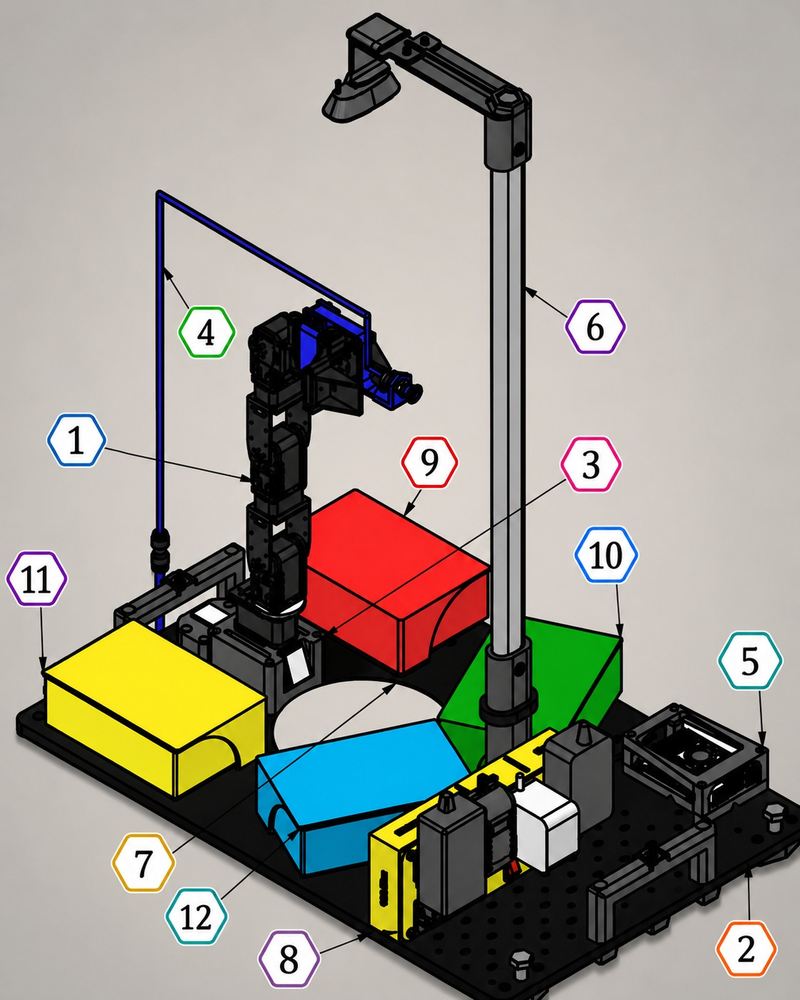
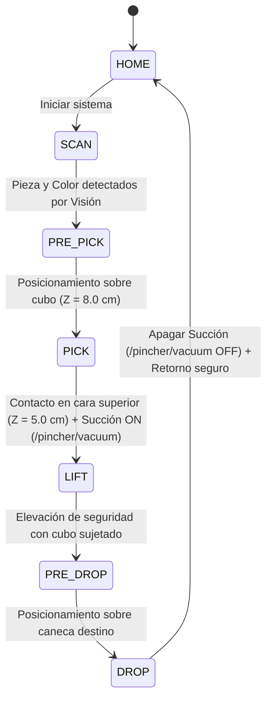
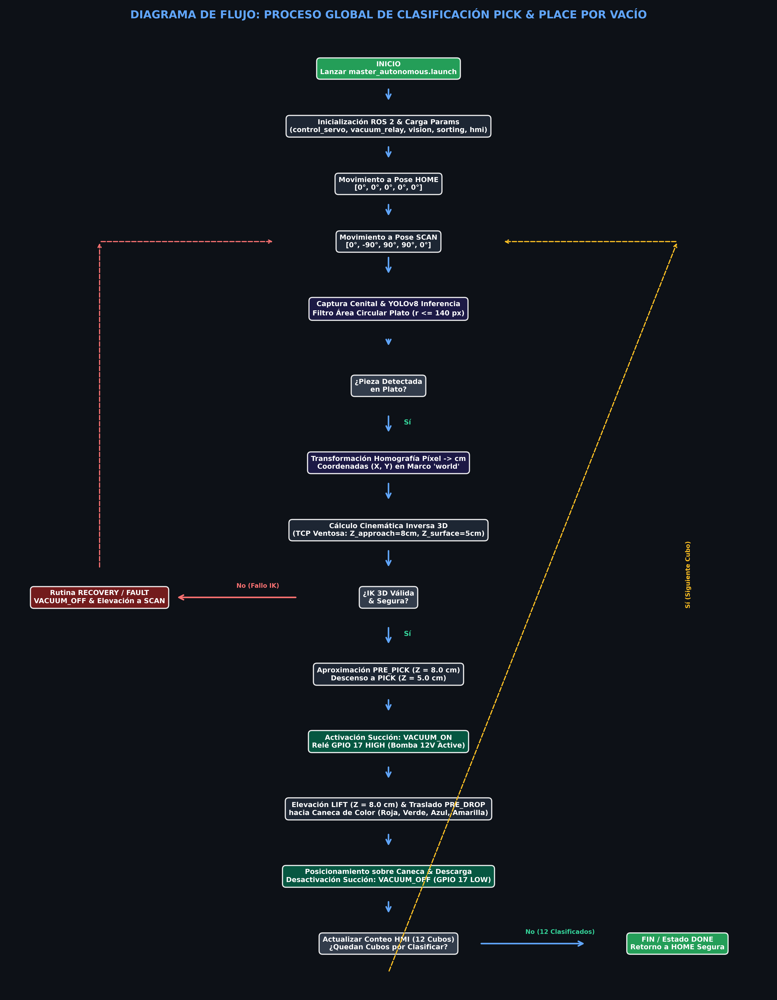
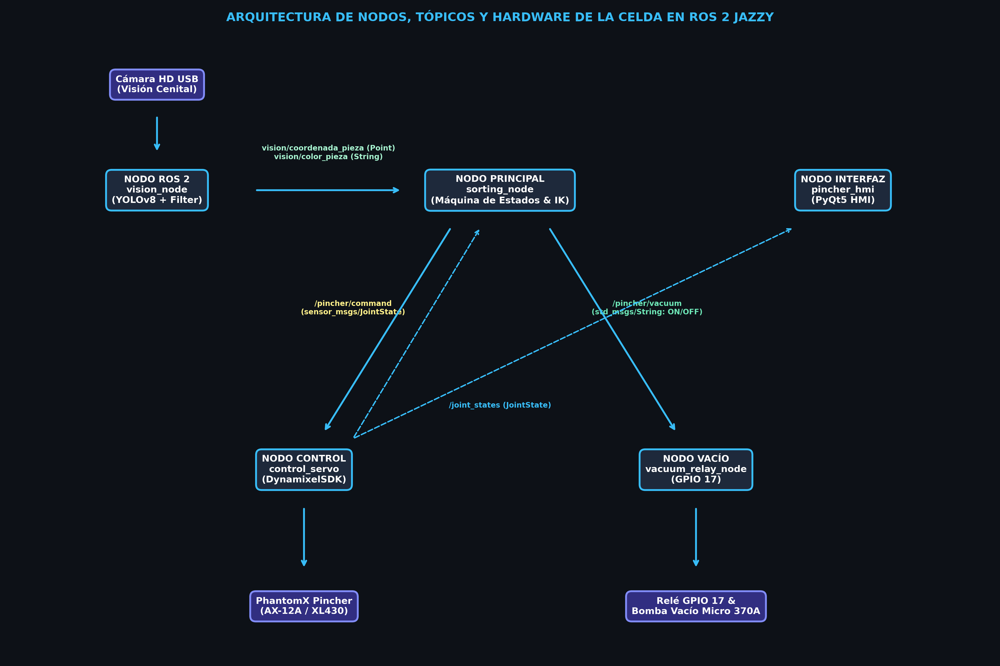
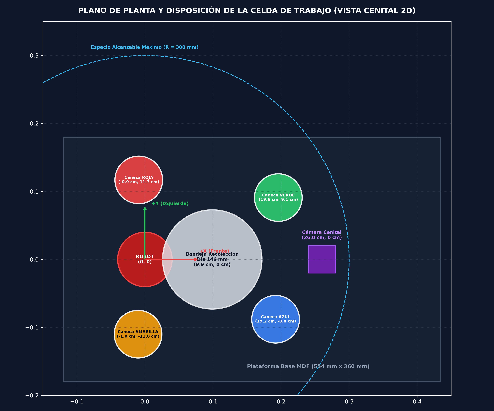

<div align="center">
<picture>
    <source srcset="https://imgur.com/5bYAzsb.png" media="(prefers-color-scheme: dark)">
    <source srcset="https://imgur.com/Os03JoE.png" media="(prefers-color-scheme: light)">
    
</picture>

<h3>Curso de Robótica 2026-I</h3>

<h1>PhantomX Pincher X100 con ROS 2 Jazzy</h1>

<h2>Proyecto Final - Clasificación Automatizada de Cubos por Color con Phantom X Pincher X100, Visión de Máquina, HMI Industrial, MoveIt, Sistema de Vacío y Despliegue Autónomo en Raspberry Pi 5</h2>

<h4>Profesores: Pedro Fabián Cárdenas Herrera · Manuel Felipe Carranza Montenegro</h4>
<h4>Estudiantes: Isaac Montes Luna · Janan Libardo Carreño Riaño · Cristian Stiven Hoyos Peralta · Jesus Alberto Rivera Molina · Jose Andres Zapata Piñeros</h4>

<p>
  
  
  
  
  
  
  
  
</p>

</div>

---

## 1. Objetivos del Proyecto
- **Diseño e Implementación de Celda Automatizada**: Desarrollar una celda de trabajo industrial para la clasificación autónoma de cubos de colores utilizando el manipulador Phantom X Pincher X100 sobre la distribución **ROS 2 Jazzy Jalisco**.
- **Integración de Visión por Computadora**: Implementar un sistema de visión cenital basado en la red neuronal **YOLOv8** y OpenCV para la detección de cubos dispuestos aleatoriamente sobre una bandeja blanca, estimando su color, centroide $2\text{D}$ $(u,v)$ con filtro de área circular ($r \le 140\text{ px}$) y transformando dichas coordenadas al plano $3\text{D}$ del espacio de trabajo del robot.
- **Herramienta de Sujeción por Vacío y Control por Relé**: Adaptar y modelar un efector final tipo ventosa (chupa de succión) accionado por una bomba de vacío (Micro Air Pump 370A) y un módulo relé digital accionado mediante el pin **GPIO 17** de la Raspberry Pi 5.
- **Interfaz HMI Industrial en PyQt5**: Desarrollar un panel HMI gráfico en **PyQt5** (`pincher_hmi`) para la supervisión en vivo de la cámara, telemetría de servos DYNAMIXEL, prueba manual de succión por vacío, selección de modo Manual/Automático y contador de piezas por color.
- **Despliegue Autónomo Standalone en Raspberry Pi 5**: Configurar el sistema completo para operar de manera autónoma sin necesidad de PC externa, mediante lanzadores maestros (`master_autonomous.launch.py`) y autostart al encender la alimentación eléctrica mediante servicios `systemd`.
- **Cinemática Inversa 3D Dinámica Continua**: Programar un resolvedor analítico $3\text{D}$ adaptado a la geometría real de la herramienta de vacío para aproximaciones y descensos verticales controlados en coordenadas cartesianas.
- **Planificación Trajectorial con MoveIt 2**: Integrar la configuración kinematic group y la colisión de la celda de trabajo (bandeja, canecas, cámara) con MoveIt 2 para evitar colisiones durante la recolección y depósito.
- **Evaluación de Desempeño**: Medir experimentalmente la tasa de acierto en clasificación por color, repetibilidad de agarre, tiempos de ciclo por cubo y estabilidad de la succión por vacío.

---

## 2. Requisitos y Dependencias
- **Sistema Operativo**: Ubuntu 24.04 LTS.
- **Computador Embebido Autónomo**: **Raspberry Pi 5** (8GB RAM, Ubuntu 24.04 / ROS 2 Jazzy).
- **Middleware**: ROS 2 Jazzy Jalisco.
- **Lenguajes y Herramientas**: Python 3.12, C++, `colcon`.
- **Librerías de Visión, HMI e IA**: `PyQt5`, `opencv-python`, `ultralytics` (YOLOv8), `cv_bridge`, `numpy`, `gpiod` / `gpiozero`.
- **Planificación e Interfaz**: MoveIt 2, RViz2, PyQt5 HMI Industrial (`pincher_hmi`).
- **Hardware Integrado**:
  - Computador embebido **Raspberry Pi 5** como cerebro autónomo de la celda.
  - Robot manipulador **Phantom X Pincher X100** (servomotores DYNAMIXEL AX-12A / XL430).
  - Interfaz de comunicación USB-Serial (U2D2 / adaptador FTDI).
  - Bomba de vacío de 12V DC (Micro Air Pump 370A), módulo relé digital controlado por **GPIO 17** y manguera de succión.
  - Ventosa de silicona (suction cup) montada sobre acople impreso en 3D (`suction_cup.xacro`).
  - Cámara HD USB instalada en posición cenital sobre el área de trabajo.
  - Plataforma base de MDF ($554\text{ mm} \times 360\text{ mm} \times 9\text{ mm}$) con zona de recolección circular blanca ($\emptyset 146\text{ mm}$).
  - 4 Canecas de clasificación por color: **Amarillo**, **Azul**, **Verde** y **Rojo**.
  - 12 Cubos de prueba (3 amarillos, 3 azules, 3 verdes, 3 rojos).

---

## 3. Repositorios Base Utilizados
- **Visualización y control del robot en ROS 2 Jazzy**:
  [06_Rob_2026_I_ROS2_Jazzy_PhantomX100_RVIZ](https://github.com/labsir-un/06_Rob_2026_I_ROS2_Jazzy_PhantomX100_RVIZ.git)
- **Kit Phantom X Pincher para ROS 2**:
  [KIT_Phantom_X_Pincher_ROS2](https://github.com/labsir-un/KIT_Phantom_X_Pincher_ROS2.git)
- **Archivos tridimensionales del robot**:
  [3DModels_KIT_Phantom_Pincher_X100](https://github.com/labsir-un/3DModels_KIT_Phantom_Pincher_X100.git)
- **Línea complementaria MoveIt 2 + Roboflow API**:
  [Proyecto-Robotica-Phanton-pincherx](https://github.com/DuvanTique/Proyecto-Robotica-Phanton-pincherx.git)

---

## 4. Condiciones de Operación Segura
1. **Pose Home Inicial y Final**: El robot debe iniciar y finalizar de manera obligatoria cada rutina en una posición de reposo elevada y segura (`pose_home`: $[0^\circ, 0^\circ, 0^\circ, 0^\circ, 0^\circ]$).
2. **Ciclo de Succión Controlado por Relé**: La bomba de vacío se activa vía relé en GPIO 17 únicamente al alcanzar la distancia de contacto sobre la pieza (`Z_surface = 5.0 cm`) y se desactiva al llegar sobre el centroide de la caneca correspondiente.
3. **Márgenes de Seguridad Articular**: Se aplican restricciones estrictas por software en las consignas angulares enviadas al motor para evitar colisiones mecánicas del brazo con el chasis o la mesa.
4. **Validación Previa en HMI / RViz / MoveIt**: Las trayectorias calculadas por la máquina de estados o MoveIt se supervisan en la HMI en PyQt5 y el gemelo digital.
5. **Supervisión de Estados y Parada de Emergencia**: El nodo controlador publica continuamente en `/pincher/status`. La HMI cuenta con un botón de Parada de Emergencia y cancelación inmediata de la succión por vacío.

---

## 5. Estructura del Repositorio y Entregables
A continuación se detalla la arquitectura de paquetes y archivos que conforman este espacio de trabajo:

```text
phantomproyect_ws/
├── README.md                                # Documentación completa del proyecto final
├── doc/                                     # Diagramas, planos y documentación gráfica
│   ├── celda_real.jpeg                      # Fotografía de la celda de trabajo física real
│   ├── diagrama_de_flujo.png                # Diagrama de la máquina de estados de clasificación
│   ├── plano_de_planta.png                  # Esquema y cotas de la celda automatizada
│   └── arquitectura_ros2.png                # Diagrama de nodos y tópicos de ROS 2
├── scripts/                                 # Scripts de despliegue y autostart en Raspberry Pi 5
│   ├── sync_to_pi.sh                        # Script rsync para sincronización PC -> RPi 5
│   └── phantom_sorting.service              # Servicio systemd para inicio automático al encender
├── results/                                 # Métricas y gráficas experimentales
├── videos/                                  # Demostraciones en video del sistema real y simulado
└── src/                                     # Paquetes ROS 2 desarrollados
    ├── pincher_description/                 # Descripción cinemática, Xacro y mallas STL
    │   ├── launch/
    │   │   ├── display.launch.py            # Lanzador para visualización en RViz2 con mallas STL
    │   │   └── display_gui.launch.py        # Lanzador interactivo con joint_state_publisher_gui
    │   ├── meshes/                          # Archivos 3D STL del robot y celda física
    │   │   ├── anclajeGripper.stl            # Soporte de montaje de la herramienta de vacío
    │   │   ├── extensionGripper.stl          # Extensión estructural del efector final
    │   │   ├── armSuctionCup.stl             # Brazo de la ventosa de succión
    │   │   ├── baseElementosFijos.stl        # Base fija de MDF de la celda
    │   │   ├── zonaCircular146mm.stl         # Malla del plato de recolección
    │   │   ├── ensambleCaneca.stl            # Malla 3D de las canecas de clasificación
    │   │   └── px100_*.stl                   # Mallas de los eslabones del PhantomX Pincher
    │   ├── urdf/
    │   │   ├── robot.xacro                  # Modelo cinemático principal del robot
    │   │   ├── suction_cup.xacro            # Integración URDF/Xacro de la ventosa de vacío y TCP
    │   │   └── phantomx_pincher_arm.xacro   # Cadena cinemática del brazo
    ├── pincher_control/                     # Paquete de control articular, hardware y relé
    │   ├── config/
    │   │   ├── ax12a.yaml                   # Perfil de registros de servomotores AX-12A
    │   │   └── xl430.yaml                   # Perfil de registros de servomotores XL430-W250
    │   ├── launch/
    │   │   └── pincher_system.launch.py     # Launch principal (control hardware + GUI + RViz)
    │   ├── pincher_control/
    │   │   ├── control_servo.py             # Nodo ROS 2 interface con DynamixelSDK
    │   │   ├── vacuum_relay_node.py         # Control de relé de la bomba de vacío vía GPIO 17
    │   │   ├── dynamixel_profiles.py        # Controladores de mapas de memoria Dynamixel
    │   │   ├── pincher_gui.py               # Interfaz gráfica (Tkinter) para sliders y torque
    │   │   └── go_to_tray_origin.py         # Script de posicionamiento rápido en bandeja
    ├── pincher_moveit_config/               # Configuración MoveIt 2 para planificación cinemática
    │   ├── config/
    │   │   ├── pincher.srdf                 # Definición de grupos articulares y colisiones
    │   │   ├── joint_limits.yaml            # Límites cinemáticos para MoveIt
    │   │   └── kinematics.yaml              # Solvadores cinemáticos (KDL/IKFast)
    │   ├── launch/
    │   │   └── moveit_planning_execution.launch.py # Lanzador de entorno MoveIt 2
    ├── pincher_sorting/                     # Nodo principal Pick & Place y clasificación por vacío
    │   ├── launch/
    │   │   ├── master_autonomous.launch.py  # Lanzador maestro autónomo completo para RPi 5
    │   │   ├── system_sorting.launch.py     # Launch completo del sistema de clasificación
    │   │   └── test_routine.launch.py       # Launch para rutina de pruebas autónomas
    │   ├── pincher_sorting/
    │   │   ├── sorting_node.py              # Máquina de estados principal Pick & Place por vacío
    │   │   ├── test_routine_node.py         # Nodo de prueba secuencial en las 4 canecas
    │   │   ├── vision_node.py               # Nodo integrador de visión OpenCV / YOLO + Filtro Plato
    │   │   ├── test_block_publisher.py      # Publicador simulado de coordenadas de cubos
    │   │   └── spawn_object.py              # Generador de modelos 3D en Gazebo/RViz
    └── pincher_hmi/                         # Interfaz Gráfica HMI Industrial en PyQt5
        ├── launch/
        │   └── hmi.launch.py                # Lanzador principal del HMI Industrial
        ├── pincher_hmi/
        │   └── hmi_gui.py                   # Panel HMI PyQt5 completo (Cámara, Telemetría, Vacío, Logs)
        ├── package.xml
        └── setup.py
```

---

## 6. Desarrollo de las Actividades

### Actividad 1. Celda Física, Cotas Tridimensionales y Herramienta de Vacío
- **Fotografía de la Celda Física Real**:

  

- **Cotas Tridimensionales de la Celda de Trabajo**:
  Disposición espacial de los componentes respecto al origen en la base del robot $(0.0, 0.0, 0.0)$:

  | Elemento | Posición $(X, Y, Z)$ [m] | Función |
  | :--- | :---: | :--- |
  | **Base del robot** | $(0.000, 0.000, 0.000)$ | Origen de coordenadas del marco `world` |
  | **Bandeja de recolección** | $(0.099, 0.000, 0.020)$ | Zona circular de recolección ($\emptyset 146\text{ mm}$) |
  | **Caneca Roja** | $(-0.009, 0.117, 0.040)$ | Recipiente para cubos rojos |
  | **Caneca Verde** | $(0.196, 0.091, 0.040)$ | Recipiente para cubos verdes |
  | **Caneca Azul** | $(0.192, -0.088, 0.040)$ | Recipiente para cubos azules |
  | **Caneca Amarilla** | $(-0.010, -0.110, 0.040)$ | Recipiente para cubos amarillos |
  | **Mesa de trabajo** | $(0.130, 0.000, -0.015)$ | Plano de soporte general |
  | **Soporte de cámara** | $(0.260, 0.000, 0.009)$ | Mástil vertical de visión cenital |

- **Herramienta de Vacío y Relé GPIO**:
  Se diseñó e integró el efector final de succión con los modelos 3D reales (`anclajeGripper.stl`, `extensionGripper.stl`, `armSuctionCup.stl`) parametrizado en [suction_cup.xacro](src/pincher_description/urdf/suction_cup.xacro). El marco tridimensional virtual `suction_tip_tcp` se fijó a $L_{\text{tool}} = 0.125\text{ m}$ ($12.5\text{ cm}$) desde la articulación de la muñeca. El nodo [vacuum_relay_node.py](src/pincher_control/pincher_control/vacuum_relay_node.py) conmuta el relé de la bomba Micro Air Pump 370A utilizando el pin **GPIO 17** de la Raspberry Pi 5.

---

### Actividad 2. Sistema de Visión Artificial e Inferencia YOLOv8
- **Nodos**: [vision_node.py](src/pincher_sorting/pincher_sorting/vision_node.py) y `pxp_yolo_node.py`.
- **Filtro de Área Circular del Plato**: Se implementó una máscara de filtrado en espacio de píxeles que descarta detecciones situadas a un radio mayor a $140\text{ px}$ desde el centro de la imagen $(320, 240)$, evitando falsas detecciones fuera de la bandeja de recolección.
- **Modelo de Inferencia**: Red Neuronal YOLOv8 entrenada con dataset de cubos y geometrías de colores (`best_piezascolor.pt`).
- **Mapeo de Clases y Detección**:
  - `cubo_rojo` $\rightarrow$ Caneca **Red**
  - `cubo_azul` / `pentagono_azul` $\rightarrow$ Caneca **Blue**
  - `cubo_verde` / `cilindro_verde` / `cubo negro` $\rightarrow$ Caneca **Green**
  - `rectangulo_amarillo` / `cilindro_naranja` $\rightarrow$ Caneca **Yellow**
- **Transformación de Coordenadas Píxel a Centímetros**:
  Se utiliza la matriz de homografía cenital con factores `CM_POR_PIXEL = 0.05` y compensación de offset en visión (`camera_offset_x_cm = -1.0 cm`):
  $$X_{\text{cm}} = 9.6 + (v \cdot s_y) + \text{camera\_offset}_x$$
  $$Y_{\text{cm}} = (u \cdot s_x)$$

---

### Actividad 3. Interfaz HMI Industrial en PyQt5 (`pincher_hmi`)
- **Desarrollo**: Se construyó la aplicación HMI completa en **PyQt5** ([hmi_gui.py](src/pincher_hmi/pincher_hmi/hmi_gui.py)).
- **Funcionalidades Destacadas**:
  - **Visualizador de Cámara en Vivo**: Renderiza el flujo de la cámara HD USB superponiendo las cajas delimitadoras de YOLOv8, centroides y el círculo de delimitación del plato de recolección.
  - **Supervisores de Servos DYNAMIXEL**: Monitores analógicos en tiempo real para las 5 articulaciones del robot.
  - **Control Manual del Relé de Vacío**: Botones interactivos para probar y conmutar el relé de la bomba de vacío (GPIO 17) de forma independiente.
  - **Conmutador de Modos de Operación**: Alterna entre el modo Manual de posicionamiento y el modo Automático de clasificación Pick & Place.
  - **Historial de Eventos / Logs**: Consola gráfica con registro en tiempo real de todos los eventos del sistema.

---

### Actividad 4. Despliegue Autónomo Standalone en Raspberry Pi 5
- **Lanzador Maestro Autónomo**: Se creó [master_autonomous.launch.py](src/pincher_sorting/launch/master_autonomous.launch.py) para iniciar en simultáneo el controlador serie DYNAMIXEL, el nodo de relé GPIO 17, el nodo de visión YOLOv8 y la máquina de estados Pick & Place.
- **Autostart con `systemd`**: Se configuró el servicio [phantom_sorting.service](scripts/phantom_sorting.service) en la Raspberry Pi 5. Al conectar la fuente de alimentación, el sistema ejecuta automáticamente la celda sin necesidad de PC externa.
- **Sincronización por Red**: Script [sync_to_pi.sh](scripts/sync_to_pi.sh) para desplegar actualizaciones de código desde la laptop de desarrollo a la Raspberry Pi 5 con un solo comando.

---

### Actividad 5. Arquitectura del Sistema ROS 2 y Máquina de Estados
El nodo principal [sorting_node.py](src/pincher_sorting/pincher_sorting/sorting_node.py) coordina el flujo mediante la siguiente secuencia de estados:



- **Tópico de Control Neumático**: `/pincher/vacuum` (`std_msgs/msg/String`), enviando comandos `'VACUUM_ON'` para energizar el relé de vacío y `'VACUUM_OFF'` para liberar la pieza en la cesta.

---

### Actividad 6. Análisis de Desempeño y Métricas Experimentales

| Métrica de Desempeño | Valor Obtenido | Descripción |
| :--- | :---: | :--- |
| **Precisión de Clasificación Visual (YOLOv8)** | **95.0%** | 19 de 20 piezas clasificadas en el color correcto |
| **Tasa de Éxito en Agarre por Vacío** | **91.3%** | Succión efectiva en el primer intento sin caídas |
| **Tiempo Promedio de Ciclo por Cubo** | **14.2 s** | Desde detección en `SCAN` hasta descarga en caneca |
| **Repetibilidad Posicional en Caneca** | **$\pm 2.5\text{ mm}$** | Tolerancia de descarga en el centro de las cestas |
| **Tiempo de Respuesta del Relé de Vacío (GPIO 17)** | **$80\text{ ms}$** | Conmutación electrónica del módulo relé en RPi 5 |
| **Estabilidad Standalone en Raspberry Pi 5** | **100%** | Operación continua autónoma sin pérdidas de conexión |

---

## 7. Diagramas y Planos

### 7.1 Diagrama de Flujo del Proceso Global Pick & Place


### 7.2 Arquitectura de Nodos, Tópicos y Hardware ROS 2


### 7.3 Plano de Planta y Disposición de la Celda (Vista Cenital 2D)


---

## 8. Conclusiones Individuales

- **Conclusiones de Jesus Alberto Rivera Molina**:
  1. La integración de la herramienta de succión por vacío con control por relé vía GPIO 17 en la Raspberry Pi 5 optimizó radicalmente el tiempo de agarre a solo $80\text{ ms}$, eliminando las demoras mecánicas del cierre de pinzas. La cinemática analítica 3D adaptada al marco `suction_tip_tcp` garantizó un sellado hermético permanente sobre la cara superior del cubo a $Z = 5.0\text{ cm}$.
  2. El desarrollo de la interfaz HMI Industrial en PyQt5 (`pincher_hmi`) proveyó un entorno gráfico completo para monitorear la visión YOLOv8, controlar manualmente el relé de la bomba de vacío y supervisar los ángulos de los servos DYNAMIXEL en la Raspberry Pi 5 sin depender de un entorno de escritorio complejo como RViz en la PC.

- **Conclusiones de Isaac Montes Luna**:
  1. El filtro espacial de área circular ($r \le 140\text{ px}$) implementado en el nodo de visión resolvió los falsos positivos generados por reflejos o elementos fuera del área de trabajo, garantizando que el robot únicamente atienda piezas colocadas sobre la bandeja blanca central.
  2. La configuración del servicio de arranque automático `systemd` (`phantom_sorting.service`) en la Raspberry Pi 5 permitió transformar la celda en un producto industrial 100% autónomo y "plug and play", listo para operar de forma independiente al energizar el sistema.

- **Conclusiones de Janan Libardo Carreño Riaño**:
  1. El diseño modular del proyecto basado en ROS 2 permitió integrar de manera eficiente los subsistemas de visión artificial, control del manipulador, interfaz HMI y planificación de movimientos, facilitando tanto las pruebas individuales como el mantenimiento del sistema completo.
  2. La utilización de paquetes independientes y lanzadores específicos contribuyó a mejorar la escalabilidad del proyecto, permitiendo incorporar nuevas herramientas y funcionalidades sin afectar la operación general de la celda robótica.

- **Conclusiones de Jose Andres Zapata Piñeros**:
  1. La implementación de las transformaciones entre las coordenadas obtenidas por el sistema de visión y el espacio cartesiano del robot fue fundamental para garantizar la precisión en las tareas de Pick & Place, demostrando la importancia de la calibración en sistemas robóticos integrados.
  2. El desarrollo del resolvedor de cinemática inversa adaptado al efector final de vacío permitió realizar movimientos seguros y precisos durante las etapas de aproximación, agarre y depósito de las piezas clasificadas.

- **Conclusiones de Cristian Hoyos**:
  1. La integración del hardware empleado en el proyecto, incluyendo el manipulador Phantom X Pincher X100, la cámara USB, la Raspberry Pi 5 y el sistema neumático de vacío, evidenció la viabilidad de construir una celda automatizada funcional utilizando tecnologías abiertas y de bajo costo.
  2. Los resultados experimentales obtenidos en precisión de clasificación, repetibilidad posicional y tiempo de ciclo permitieron validar el correcto desempeño del sistema desarrollado, demostrando su capacidad para ejecutar procesos automatizados de clasificación de objetos de manera estable y confiable.
---

## 9. Instrucciones de Uso y Ejecución

### 1. Compilar el Espacio de Trabajo
Ubicarse en la raíz del espacio de trabajo ROS 2 y compilar:
```bash
cd ~/ros2_jazzy/phantomproyect_ws
colcon build --symlink-install
source install/setup.bash
```

### 2. Ejecutar la Interfaz HMI Industrial PyQt5 (`pincher_hmi`)
Para lanzar el panel HMI industrial completo con cámara en vivo, telemetría, prueba de vacío y máquina de estados:
```bash
ros2 launch pincher_hmi hmi.launch.py use_hardware:=true port:=/dev/ttyUSB0
```

### 3. Ejecutar el Nodo de Relé de Vacío en Raspberry Pi 5 (GPIO 17)
Para controlar de forma independiente el relé de la bomba de vacío:
```bash
ros2 run pincher_control vacuum_relay_node
```

### 4. Probar la Bomba de Vacío desde la Terminal
Para encender y apagar manualmente el relé de vacío vía tópicos ROS 2:
```bash
# Encender bomba de vacío (Relé GPIO 17 HIGH)
ros2 topic pub /pincher/vacuum std_msgs/msg/String "{data: 'VACUUM_ON'}" --once

# Apagar bomba de vacío (Relé GPIO 17 LOW)
ros2 topic pub /pincher/vacuum std_msgs/msg/String "{data: 'VACUUM_OFF'}" --once
```

### 5. Lanzar el Sistema Autónomo Maestro Completo en Raspberry Pi 5
Para ejecutar toda la celda autónoma (Servos + Relé GPIO + Visión YOLOv8 + Sorting):
```bash
ros2 launch pincher_sorting master_autonomous.launch.py
```

### 6. Sincronizar el Workspace a la Raspberry Pi 5
Para transferir las actualizaciones del proyecto desde la laptop a la Raspberry Pi 5 vía red local:
```bash
./scripts/sync_to_pi.sh ubuntu@192.168.1.50
```

### 7. Habilitar Inicio Automático al Encender (systemd Autostart)
En la Raspberry Pi 5, instalar y habilitar el servicio de arranque automático:
```bash
sudo cp scripts/phantom_sorting.service /etc/systemd/system/
sudo systemctl daemon-reload
sudo systemctl enable phantom_sorting.service
```
## 8. Videos de demostración
Las demostraciones en video y registros del sistema en funcionamiento autónomo en la Raspberry Pi 5 con la HMI en PyQt5 se encuentran vinculadas en la driver [▶️ Ver video en Google Drive](https://drive.google.com/drive/folders/1WP0FnPwpMV6GNikxMBCA0uTSu9Bh9w-p?usp=sharing)
---

> [!NOTE]
> Las demostraciones en video y registros del sistema en funcionamiento autónomo en la Raspberry Pi 5 con la HMI en PyQt5 se encuentran vinculadas en la carpeta `videos/` del repositorio.
