# Laboratorio No. 05 — Robótica de Desarrollo
###  Phantom X Pincher X100 – ROS 2 Jazzy – RViz.
**Universidad Nacional de Colombia · Robótica 2026-I**

---

## Integrantes

| Nombre | URL del Repositorio |
|--------|-------------------|
| Julian Benitez | https://github.com/JulianI3 |
| Juan Salamanca | https://github.com/JuanSalan |

---

## Actividades
### Actividad 2 Identificación de motores y articulaciones

| Articulación | ID DYNAMIXEL | Referencia | Sentido positivo | Función |
|--------------|--------------|------------|------------------|---------|
| Base (Waist) | N.A. | 0 rad | Giro antihorario del robot respecto al eje vertical, visto desde arriba. | Rotar toda la cadena cinemática alrededor de la base. |
| Hombro (Shoulder) | N.A. | 0 rad  | La rotación positiva del hombro hace descender el primer eslabón, desplazando toda la cadena cinemática. | Posicionar el primer eslabón y modificar la posición de toda la cadena cinemática. |
| Codo (Elbow) | N.A. | -π rad | La rotación positiva del codo hace descender la cadena cinemática a partir del segundo eslabón. | Modificar la configuración del segundo eslabón y del efector final sin afectar el primer eslabón. |
| Muñeca (Wrist) | N.A. | 0 rad | La rotación positiva de la muñeca hace descender la pinza. | Orientar el efector final mediante la rotación de la muñeca. |
| Pinza (Gripper) | N.A. | Gripper cerrado | La rotación positiva produce la apertura de la pinza. | Sujetar y liberar objetos mediante la apertura y cierre de las mordazas. |


Nota: La columna ID DYNAMIXEL se omitió debido a que no se contaba con el modelo físico que nos permitía conocer esta característica.


Se pueden centrar estas tablas?
### Actividad 3. Medición del robot

Las dimensiones del robot fueron obtenidas a partir de la medición de los archivos STL del modelo tridimensional disponible en el repositorio.  Las dimensiones estructurales se obtienen a partir de la altura de la base y la distancia entre articulaciones para las demás medidas solicitadas.

#### Dimensiones estructurales

| Parámetro | Valor (mm) |
|:----------|-----------:|
| Altura de la base | 48 |
| Distancia Base – Hombro | 44,5 |
| Distancia Hombro – Codo | 105,7 |
| Distancia Codo – Muñeca | 100,0 |
| Distancia Muñeca – TCP | 113,6 |

Luego la longitud de los eslabones se mide como el alto o largo de cada eslabón y no como la distancia entre articulaciones.

#### Longitud de los eslabones

| Eslabón | Longitud (mm) |
|:---------|--------------:|
| Eslabón 1 | 157,0 |
| Eslabón 2 | 114,2 |
| Eslabón 3 | 66,0 |

#### Dimensiones de la pinza

| Parámetro | Valor (mm) |
|:----------|-----------:|
| Longitud útil | 38,15 |
| Ancho útil | 29,0 |

El esquema que permite conocer con mayor facilidad las distancias entre juntas, orientación y tipo de juntas se muestra a continuación.

<p align="center">
  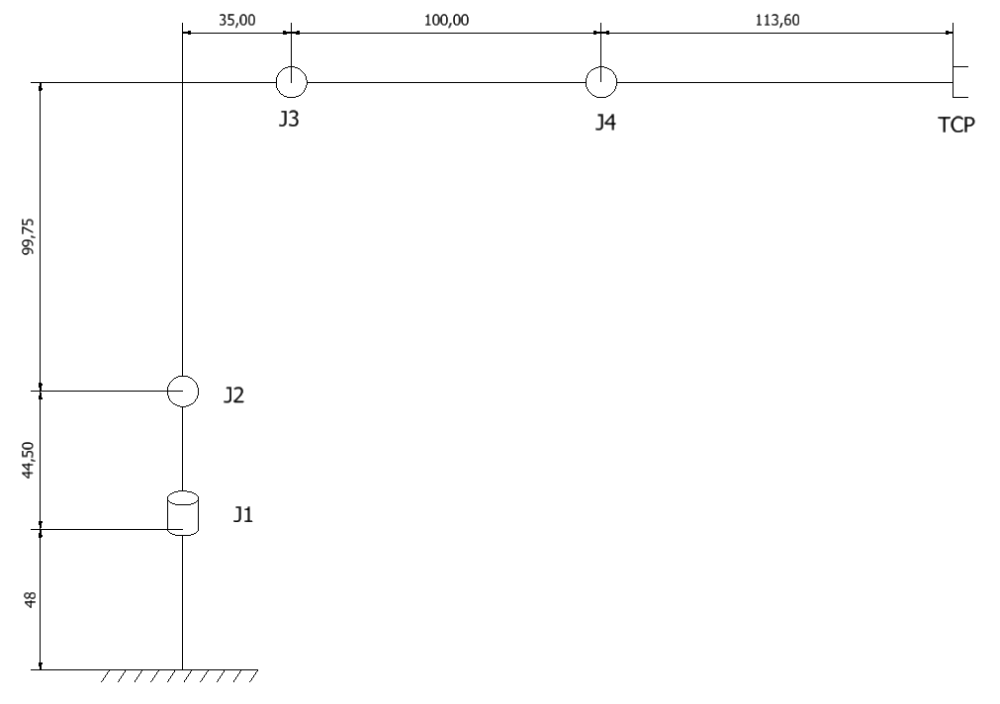<br>
  <em>Figura 1. Esquema del robot PhantomX100.</em>
</p>
<h3>Actividad 4. Determinación de límites seguros</h3>
para realizar esta actividad se creo un script el cual funciona como un menú donde por consola se escoge la articualción que se va a mover, luego de esto se le da el angulo que se quiere mover en radianes, esto se puede ver en el sigueinte video:

<p align="center">
  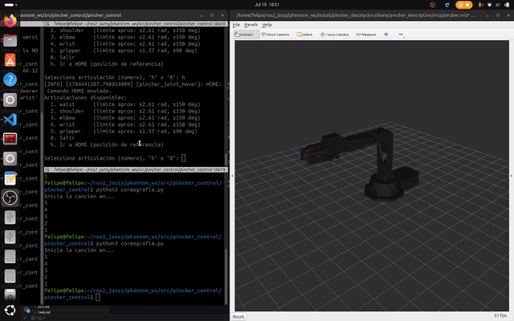
</p>
<h3>Actividad 6. Determinación de límites seguros</h3>

<p>
Los siguientes límites fueron determinados experimentalmente a partir de la simulación en RViz.
Los valores corresponden a aproximaciones visuales obtenidas considerando el mejor caso, es decir,
evaluando cada articulación de manera independiente y sin interferencias ocasionadas por la
configuración instantánea de las demás articulaciones. Para garantizar una operación segura, el
programa debe impedir el envío de comandos fuera de estos rangos.
</p>

<table>
  <thead>
    <tr>
      <th align="center">Articulación</th>
      <th align="center">Límite inferior (rad)</th>
      <th align="center">Límite superior (rad)</th>
      <th align="center">Margen de seguridad</th>
    </tr>
  </thead>
  <tbody>
    <tr>
      <td align="center">Base</td>
      <td align="center">-2,618</td>
      <td align="center">2,618</td>
      <td align="center">0,10 rad</td>
    </tr>
    <tr>
      <td align="center">Hombro</td>
      <td align="center">-2,00</td>
      <td align="center">2,00</td>
      <td align="center">0,10 rad</td>
    </tr>
    <tr>
      <td align="center">Codo</td>
      <td align="center">-2,15</td>
      <td align="center">1,571 </td>
      <td align="center">0,10 rad</td>
    </tr>
    <tr>
      <td align="center">Muñeca</td>
      <td align="center">-2,00</td>
      <td align="center">2,30</td>
      <td align="center">0,10 rad</td>
    </tr>
    <tr>
      <td align="center">Pinza</td>
      <td align="center">-1,571 </td>
      <td align="center">1,571 </td>
      <td align="center">0,10 rad</td>
    </tr>
  </tbody>
</table>

### Actividad 7. Movimiento simultáneo

Se implementó el desplazamiento simultáneo de las cinco articulaciones del robot mediante el envío de comandos articulares en el tópico `/pincher/command`. Cada configuración fue ejecutada de forma secuencial y validada en la simulación de RViz. Los valores corresponden a ángulos articulares expresados en grados para las articulaciones Base, Hombro, Codo, Muñeca y Pinza, respectivamente.

#### Configuración 1
**Coordenadas:** `(0°, 0°, 0°, 0°, 0°)`

<p align="center">
  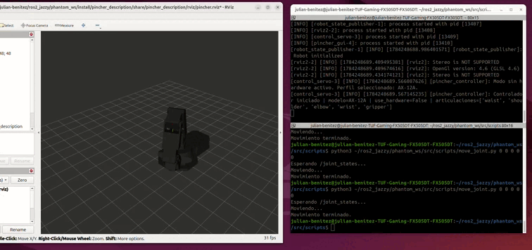
</p>

---

#### Configuración 2
**Coordenadas:** `(25°, 25°, 20°, -20°, 0°)`

<p align="center">
  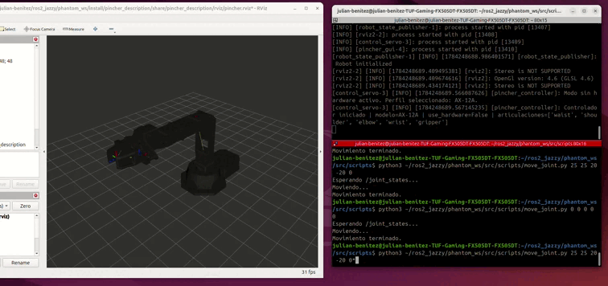
</p>

---

#### Configuración 3
**Coordenadas:** `(-35°, 35°, -30°, 30°, 0°)`

<p align="center">
  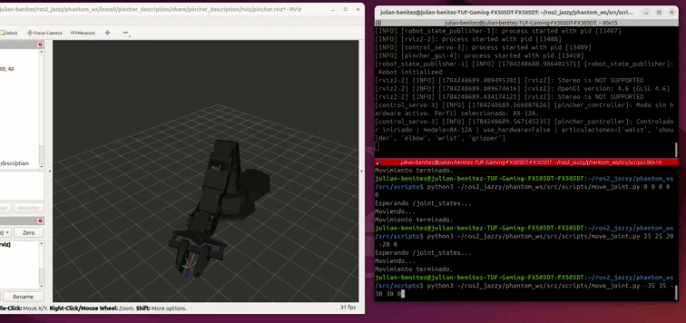
</p>

---

#### Configuración 4
**Coordenadas:** `(85°, -20°, 55°, 25°, 0°)`

<p align="center">
  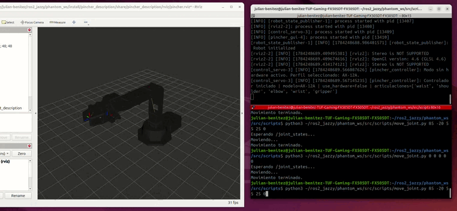
</p>

---

#### Configuración 5
**Coordenadas:** `(80°, -35°, 55°, -45°, 0°)`

<p align="center">
  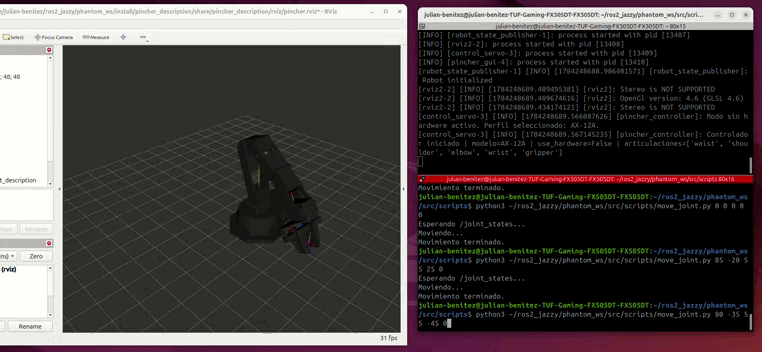
</p>

## Actividad 8.  Movimiento secuencial
Para dar solución a esto se reuso el script que se uso para la actividad número 5, se escogio el desplazamiento numero 5 ( 80, −35, 55, −45, 0.) y como se puede observar en el video se haciendo el movimiento secuencial se llega al mismo lugar, pero se nota una diferencia clara en los tiempo de ejecución y en la fluidez del movimiento, siendo el simultaneo el que mejor se desempeño


<p align="center">
  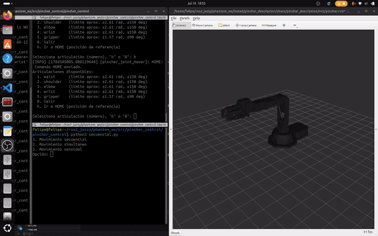
</p>

## Actividad 9.  Interpolación de trayectorias
El código de `trajectory_lib.py` implementa tres formas de generar el movimiento entre dos posiciones articulares. La interpolación lineal calcula la posición como una simple proporción del tiempo transcurrido (`q0 + (qf-q0)*t/tf`), lo que da velocidad constante pero un cambio brusco de velocidad al inicio y al final. La cúbica usa un polinomio de tercer grado cuyos coeficientes se resuelven para que la velocidad sea cero en ambos extremos, logrando un arranque y frenado suaves, aunque la aceleración todavía cambia de golpe en esos puntos. La quíntica extiende esto a un polinomio de quinto grado que además fija la aceleración en cero en los extremos, produciendo la trayectoria más suave de las tres. Las tres funciones devuelven posición, velocidad y aceleración evaluadas en el tiempo, y `generate_multijoint_trajectory` simplemente las aplica a cada una de las 5 articulaciones a la vez.


<p align="center">
  
</p>

## Actividad 10.  rayectoria sinusoidal de una articulación

Para implementar la trayectoria sinusoidal se desarrolló un nodo en Python que genera una referencia articular de acuerdo con la expresión:


\[
q(t)=q_0+A\sin(2\pi ft)
\]

donde \(q_0\) corresponde a la posición inicial de la articulación, \(A\) es la amplitud y \(f\) la frecuencia de la señal. Durante la ejecución, el nodo publica continuamente la posición deseada en el tópico `/pincher/command`, mientras recibe la posición medida desde `/joint_states`. Con ambas señales se registran los datos necesarios para generar la gráfica de posición deseada y posición medida, además de calcular el error máximo y el error cuadrático medio (RMSE), permitiendo evaluar el desempeño del seguimiento de la trayectoria.

<p align="center">
  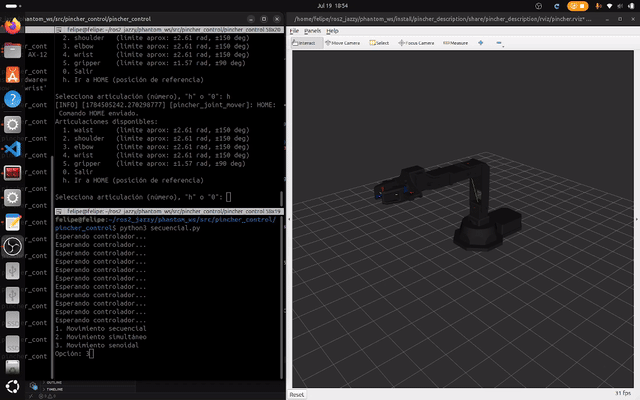
</p>

## Actividad 11. Cinemática directa

La cinemática directa del robot Phantom X Pincher se implementó utilizando la convención clásica de Denavit–Hartenberg (DH). El anáisis se realiza mediante la siguiente convención de sistemas coordenados.

<p align="center">
  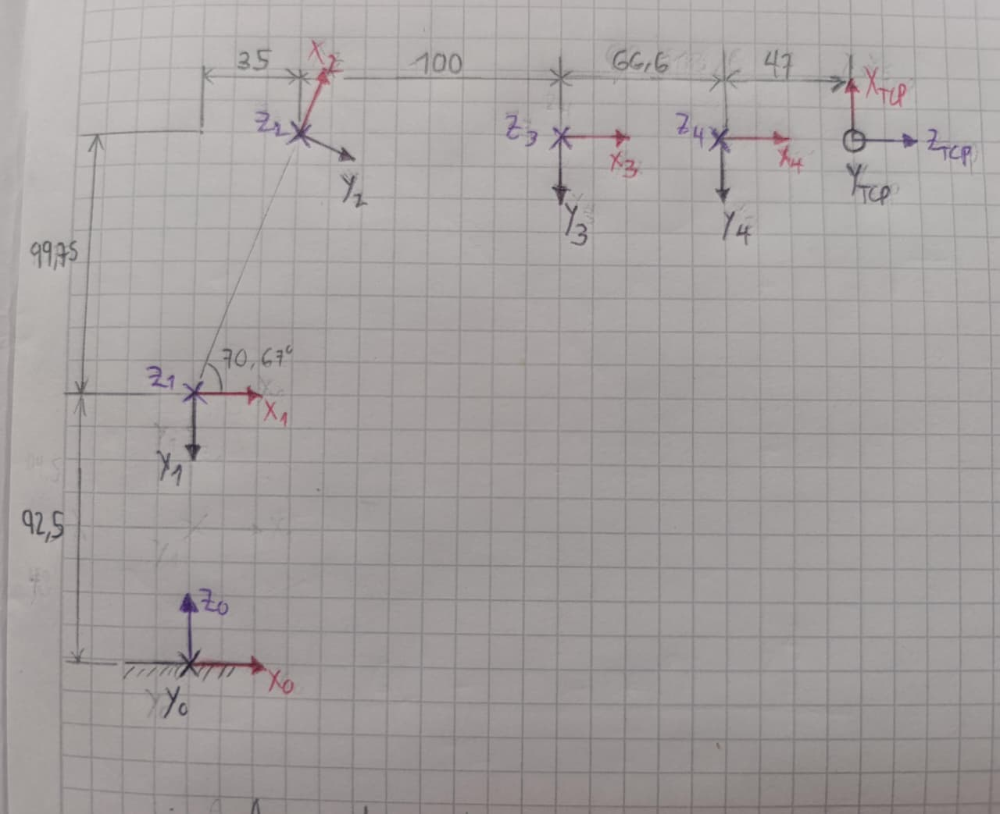
</p>


Del anterior gráfico se obtuvo la siguiente tabla DH:

<div align="center">

| i | θ<sub>i</sub> | d<sub>i</sub> (mm) | α<sub>i</sub> (°) | a<sub>i</sub> (mm) |
|:-:|:-------------:|:------------------:|:-----------------:|:------------------:|
| 1 | q₁ | 92.5 | -90 | 0 |
| 2 | q₂ − 70.67° | 0 | 0 | 105.71 |
| 3 | q₃ + 70.67° | 0 | 0 | 100.0 |
| 4 | q₄ | 0 | 0 | 66.6 |

</div>

Cada transformación homogénea se calcula mediante

```text
Aᵢ = Rz(θᵢ) · Tz(dᵢ) · Tx(aᵢ) · Rx(αᵢ)
```

obteniendo la transformación hasta el último sistema de referencia del manipulador

```text
T₀₄ = A₁ · A₂ · A₃ · A₄
```

El TCP del Phantom X Pincher no coincide con el origen del último marco DH, por lo que se definió una transformación homogénea fija entre ambos sistemas de referencia:

```text
        ┌                      ┐
        │  0   0   1   47.0    │
TNOA =  │ -1   0   0    0.0    │
        │  0  -1   0    0.0    │
        │  0   0   0    1.0    │
        └                      ┘
```

La pose final del efector se obtiene mediante

```text
T₀TCP = T₀₄ · TNOA
```

A partir de esta matriz se extraen automáticamente:

- Posición cartesiana del TCP:
  - x
  - y
  - z

- Orientación del TCP:
  - Roll
  - Pitch
  - Yaw

El programa `fk_phantom.py` recibe como entrada los ángulos articulares q₁, q₂, q₃ y q₄, calcula la cinemática directa y, simultáneamente, publica dichas posiciones sobre el tópico `/pincher/command`, realizando una interpolación lineal desde la configuración actual hasta la configuración objetivo. Esto permite comparar directamente la pose calculada con la visualizada en RViz, verificando la correcta implementación del modelo cinemático.

### Posición 1

**Coordenadas articulares:** (0°, 0°, 0°, 0°)

<div align="center">
    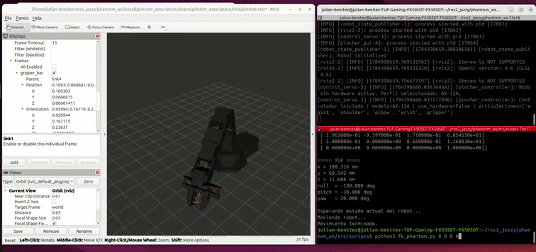


| Método | x (mm) | y (mm) | z (mm) |
|:------:|-------:|-------:|-------:|
| Cinemática directa | 248.591 | 0.000 | 192.251 |
| RViz | 251.500 | 0.000 | 190.450 |
| Error absoluto | 2.909 | 0.000 | 1.801 |

</div>

Se observa una buena correspondencia entre la posición calculada y la reportada por RViz, con un error máximo inferior a 3 mm.

---

### Posición 2

**Coordenadas articulares:** (25°, 25°, 20°, -20°)

<div align="center">
    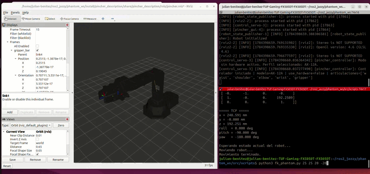


| Método | x (mm) | y (mm) | z (mm) |
|:------:|-------:|-------:|-------:|
| Cinemática directa | 224.344 | 104.613 | 49.397 |
| RViz | 227.283 | 105.630 | 46.359 |
| Error absoluto | 2.939 | 1.017 | 3.038 |


</div>

La diferencia entre ambos resultados permanece cercana a los 3 mm, validando el modelo para esta configuración.

---

### Posición 3

**Coordenadas articulares:** (-35°, 35°, -30°, 30°)

<div align="center">
    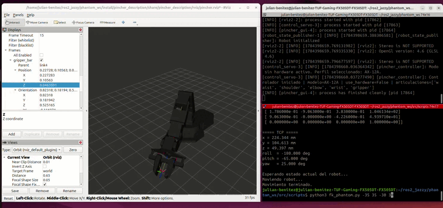


| Método | x (mm) | y (mm) | z (mm) |
|:------:|-------:|-------:|-------:|
| Cinemática directa | 228.177 | -159.771 | 80.267 |
| RViz | 231.157 | -161.242 | 77.409 |
| Error absoluto | 2.980 | 1.471 | 2.858 |

</div>

La cinemática directa reproduce adecuadamente la posición del TCP, con errores inferiores a 3 mm en cada componente.

---

### Posición 4

**Coordenadas articulares:** (85°, -20°, 55°, 25°)

<div align="center">
    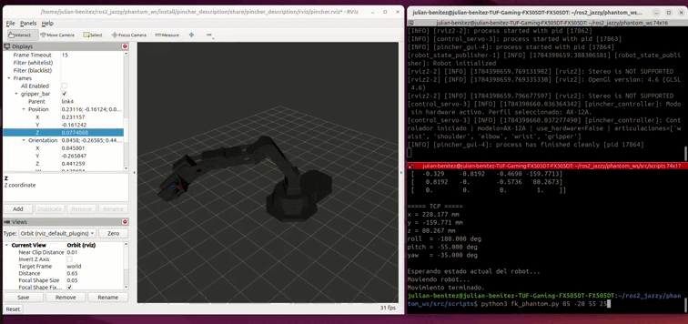


| Método | x (mm) | y (mm) | z (mm) |
|:------:|-------:|-------:|-------:|
| Cinemática directa | 11.982 | 136.956 | 42.465 |
| RViz | 11.835 | 136.482 | 33.753 |
| Error absoluto | 0.147 | 0.474 | 8.712 |

</div>

En esta configuración se obtiene el mayor error sobre el eje Z (≈ 8.7 mm), mientras que las componentes X y Y presentan diferencias inferiores a 1 mm.

---

### Posición 5

**Coordenadas articulares:** (80°, -35°, 55°, -45°)

<div align="center">
    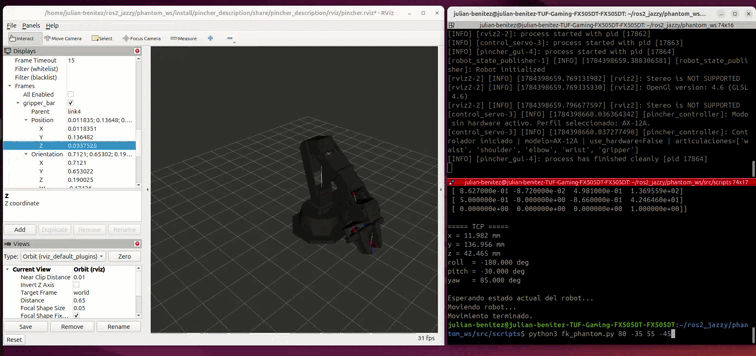


| Método | x (mm) | y (mm) | z (mm) |
|:------:|-------:|-------:|-------:|
| Cinemática directa | 29.238 | 165.816 | 208.089 |
| RViz | 29.520 | 168.422 | 204.978 |
| Error absoluto | 0.282 | 2.606 | 3.111 |

</div>

La comparación muestra nuevamente una buena concordancia entre el modelo cinemático y la simulación, con diferencias del orden de pocos milímetros.

---

En términos generales, las cinco pruebas muestran una buena correspondencia entre la cinemática directa implementada y la posición del TCP reportada por RViz. Las diferencias observadas pueden atribuirse a aproximaciones en las dimensiones del modelo, al redondeo de los parámetros DH y a la definición del TCP respecto al último sistema de referencia.

---

## Actividad 12: Cinemática inversa

La implementación de la cinemática inversa permite calcular una configuración articular válida a partir de una posición y orientación deseadas del TCP.

El nodo recibe como entrada:

- **Px:** posición del TCP sobre el eje X (mm).
- **Py:** posición del TCP sobre el eje Y (mm).
- **Pz:** posición del TCP sobre el eje Z (mm).
- **θ:** orientación del efector final en el plano de movimiento (°).

La salida corresponde a los cuatro ángulos articulares del manipulador:

- **q₁:** base.
- **q₂:** hombro.
- **q₃:** codo.
- **q₄:** muñeca.

### 1. Cálculo de la articulación de la base

<div align="center">
    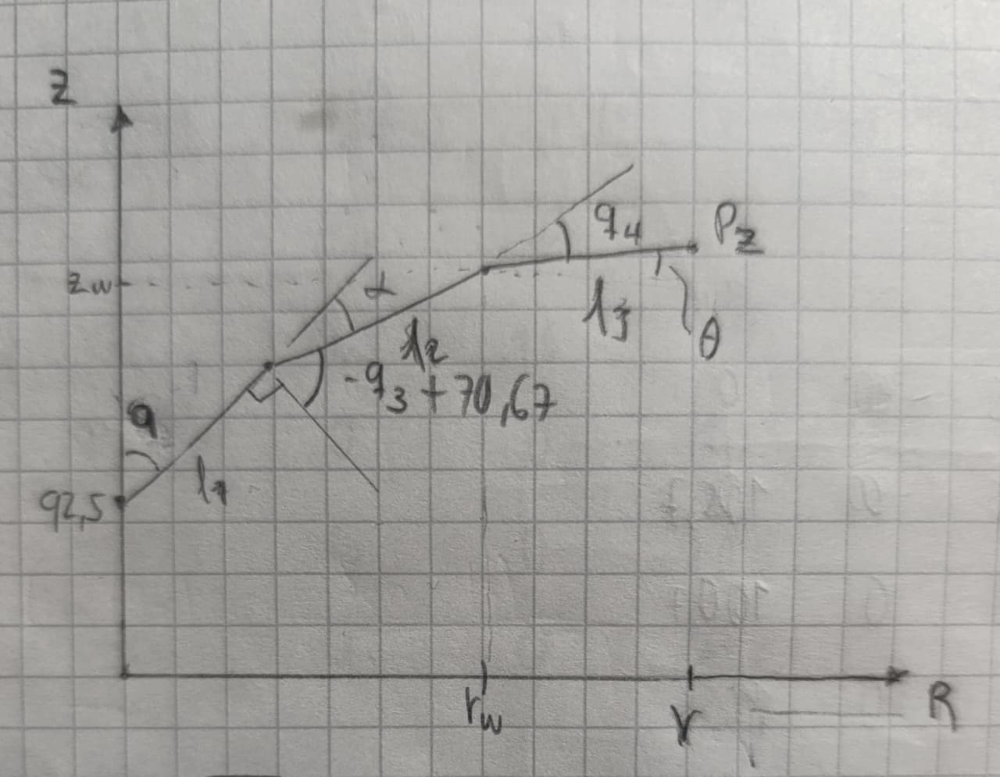
</div>


La primera articulación orienta el manipulador hacia el punto solicitado sobre el plano XY.

$$
q_1 = \mathrm{atan2}(P_y,P_x)
$$

Posteriormente se calcula la distancia radial al objetivo.

$$
r = \sqrt{P_x^2 + P_y^2}
$$

### 2. Cálculo del centro de la muñeca

Como el TCP se encuentra separado una distancia \(l_3\) de la articulación de la muñeca, primero se calcula la posición del centro de la muñeca.

$$
r_w = r - l_3 \cos(\theta)
$$

$$
z_w = P_z - l_3 \sin(\theta)
$$

<div align="center">
    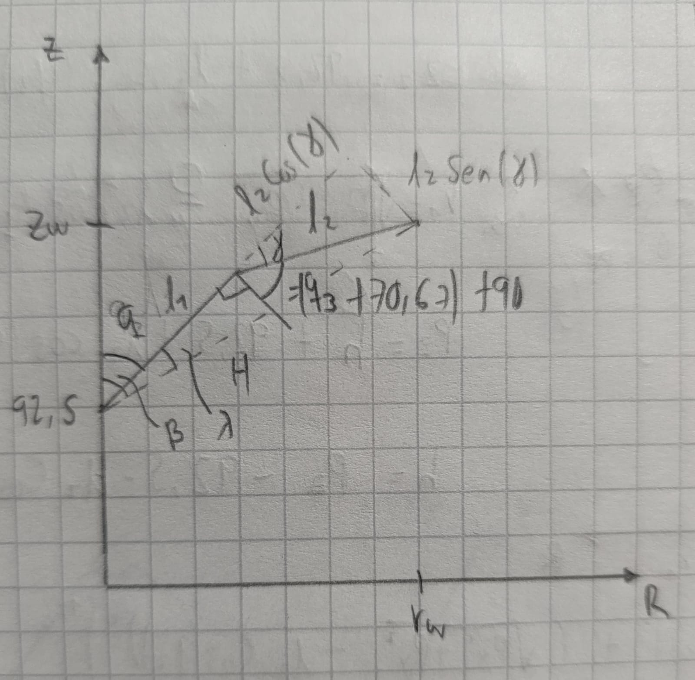
</div>


Con estas coordenadas se obtiene la distancia entre el hombro y el centro de la muñeca.

$$
H = \sqrt{(z_w-d_1)^2+r_w^2}
$$

donde \(d_1\) corresponde a la altura de la base.

Antes de continuar se verifica que el punto pertenezca al espacio de trabajo del robot.

### 3. Cálculo del ángulo del codo

Aplicando la ley del coseno al triángulo formado por \(l_1\), \(l_2\) y \(H\):

$$
\cos(q_3)=\frac{H^2-l_1^2-l_2^2}{2l_1l_2}
$$

A partir de este valor se generan las dos soluciones geométricas (codo arriba y codo abajo):

$$
q_3=\mathrm{atan2}\left(\pm\sqrt{1-\cos^2(q_3)},\cos(q_3)\right)
$$

Posteriormente se aplica el offset definido por el modelo DH.

$$
q_3=q_3-\mathrm{OFFSET}
$$

### 4. Cálculo del hombro

Se calcula el ángulo

$$
\gamma=q_3+\mathrm{OFFSET}
$$

Posteriormente,

$$
\beta=\mathrm{atan2}(r_w,z_w-d_1)
$$

y

$$
\lambda=\mathrm{atan2}(l_2\sin(\gamma),l_1+l_2\cos(\gamma))
$$

Finalmente,

$$
q_2=(\beta-\lambda)+\mathrm{OFFSET}-\frac{\pi}{2}
$$

### 5. Cálculo de la muñeca

La orientación del efector final se obtiene mediante

$$
q_4=-\theta-q_2-q_3
$$

### 6. Verificación de colisiones

Cada solución obtenida es evaluada mediante la función `structure_clear()`.

Para ello se ejecuta nuevamente la cinemática directa utilizando la configuración calculada y se obtiene la posición del:

- Hombro.
- Codo.
- Muñeca.
- Soporte final.
- TCP.

Si cualquiera de estos puntos queda por debajo del plano del suelo considerando un margen de seguridad de **20 mm**, la solución es descartada.

### 7. Restricciones articulares

Las soluciones restantes son comparadas con los límites mecánicos definidos para cada articulación.

Aquellas que excedan alguno de los límites son eliminadas.

### 8. Selección de la solución

Si existen varias soluciones válidas, se calcula la distancia euclidiana entre cada una de ellas y la configuración actual del robot.

Se selecciona la solución cuya distancia sea mínima, reduciendo el desplazamiento necesario para alcanzar el objetivo.

### 9. Movimiento del robot

Finalmente se realiza una interpolación lineal entre la configuración actual y la configuración objetivo durante **3 s**.

Cada interpolación se publica sobre el tópico

```text
/pincher/command
```

utilizando mensajes `sensor_msgs/JointState`, permitiendo visualizar el movimiento continuo del robot en RViz.

### Posición 1

**Coordenadas cartesianas:** (248.591 mm, 0.000 mm, 192.251 mm, 0°)

**Coordenadas articulares obtenidas:** (0.00°, 0.00°, 0.00°, 0.00°)

<div align="center">
    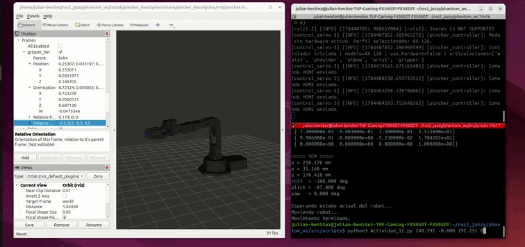
</div>

Se verifica que la cinemática inversa obtiene la configuración esperada para la posición de referencia del manipulador, alcanzando correctamente la posición y orientación solicitadas.

### Posición 2

**Coordenadas cartesianas:** (224.344 mm, 104.613 mm, 49.397 mm, 65°)

**Coordenadas articulares obtenidas:** (25.00°, 25.00°, 20.00°, -20.00°)

<div align="center">
    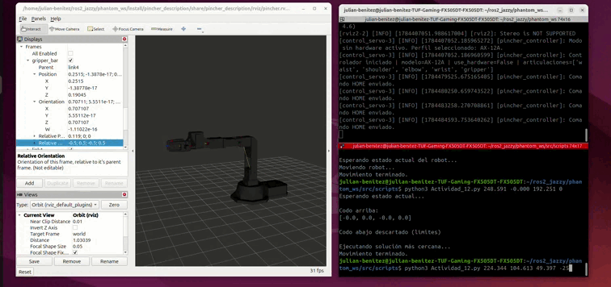
</div>

La solución calculada corresponde a la configuración deseada, reproduciendo correctamente tanto la posición del TCP como su orientación.

### Posición 3

**Coordenadas cartesianas:** (228.177 mm, -159.771 mm, 80.267 mm, 35°)

**Coordenadas articulares obtenidas:** (-35.00°, 35.00°, -30.00°, 30.00°)

<div align="center">
    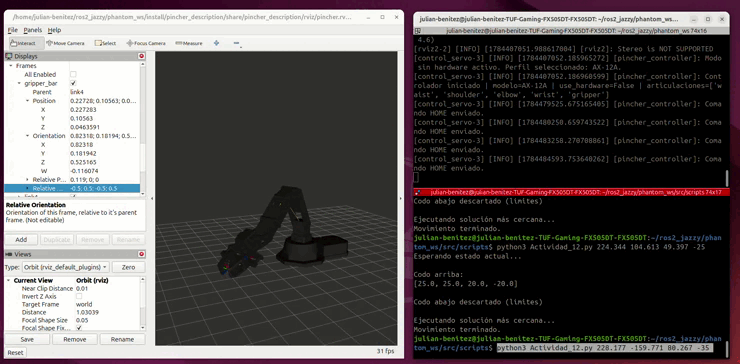
</div>

La cinemática inversa selecciona una configuración válida dentro de los límites articulares, alcanzando el objetivo especificado.

### Posición 4

**Coordenadas cartesianas:** (11.982 mm, 136.956 mm, 42.465 mm, -60°)

**Coordenadas articulares obtenidas:** (85.00°, -20.00°, 55.00°, 25.00°)

<div align="center">
    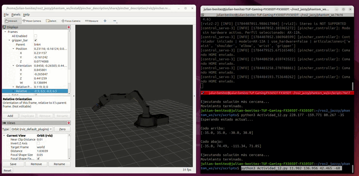
</div>

Se obtiene una solución factible que satisface simultáneamente la posición y la orientación requeridas del efector final.

### Posición 5

**Coordenadas cartesianas:** (29.238 mm, 165.816 mm, 208.089 mm, -25°)

**Coordenadas articulares obtenidas:** (80.00°, -35.00°, 55.00°, -45.00°)

<div align="center">
    
</div>

La solución obtenida permite alcanzar el objetivo solicitado respetando las restricciones geométricas y los límites articulares definidos para el manipulador.


## Actividad 13. Enseñanza y repetición de poses

Se desarrolló un nodo denominado `teach_repeat.py` que implementa un modo de enseñanza para el robot Phantom X Pincher. El programa permite registrar configuraciones articulares directamente desde la posición actual del manipulador, almacenarlas en un archivo YAML y reproducirlas posteriormente en el mismo orden en que fueron registradas.

### Características implementadas

- Registro de la configuración articular actual.
- Asignación de un nombre a cada pose.
- Almacenamiento automático en un archivo `poses.yaml`.
- Capacidad de almacenar múltiples poses (mínimo ocho).
- Reproducción secuencial de las poses registradas.
- Modificación del tiempo de transición entre poses.
- Detención inmediata de la reproducción.
- Visualización de las poses almacenadas y de la configuración articular actual.

### Ejecución

```bash
python3 teach_repeat.py
```

Al iniciar el programa se presenta un menú interactivo.

### Comandos disponibles

| Comando | Descripción |
|---------|-------------|
| `guardar nombre` | Guarda la configuración articular actual con el nombre indicado. |
| `listar` | Muestra todas las poses almacenadas. |
| `actual` | Muestra la configuración articular actual del robot. |
| `reproducir` | Ejecuta todas las poses en el orden en que fueron registradas. |
| `tiempo segundos` | Modifica el tiempo de transición entre poses. |
| `detener` | Detiene la reproducción en cualquier momento. |
| `eliminar nombre` | Elimina una pose del archivo YAML. |
| `salir` | Finaliza el programa. |

### Archivo YAML

Las poses se almacenan en el archivo `poses.yaml` utilizando el siguiente formato:

```yaml
home:
  joints:
  - 0.0
  - 0.0
  - 0.0
  - 0.0
  - 0.0

pose1:
  joints:
  - 0.5236
  - -0.3491
  - 0.7854
  - -0.2618
  - 0.0
```

Cada pose almacena las cinco coordenadas articulares del manipulador en radianes, lo que permite reconstruir exactamente la configuración registrada durante la etapa de enseñanza.

### Funcionamiento

El nodo obtiene continuamente la configuración articular del robot mediante el tópico `/joint_states`. Cuando el usuario ejecuta el comando `guardar`, la configuración actual se almacena en memoria y posteriormente se escribe en el archivo YAML.

Durante la reproducción, el programa lee las poses registradas respetando el orden de almacenamiento y genera una interpolación lineal entre configuraciones articulares, publicando las posiciones sobre el tópico `/pincher/command`. De esta forma el movimiento entre poses es continuo y el tiempo de transición puede modificarse por el usuario.


### Guardar una pose

Permite registrar la configuración articular actual del robot y asignarle un nombre para almacenarla en el archivo `poses.yaml`.

<div align="center">
    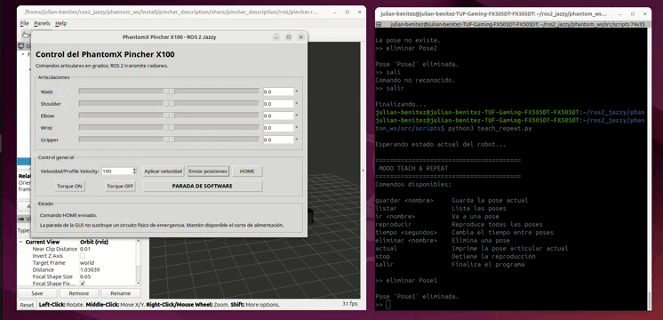
</div>

### Listar poses

Muestra todas las poses registradas junto con sus coordenadas articulares en radianes y grados.

<div align="center">
    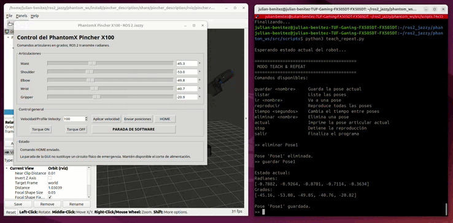
</div>

### Ir a posición

Permite llevar al robot a una de las posiciones articulares almacenadas en el archivo `poses.yaml`.

<div align="center">
    
</div>

### Consultar la posición actual

Obtiene la configuración articular actual del robot a partir del tópico `/joint_states`.

<div align="center">
    
</div>

### Reproducir poses

Ejecuta todas las poses almacenadas respetando el orden en que fueron registradas, realizando una interpolación lineal entre cada una de ellas.

<div align="center">
    
</div>

### Modificar el tiempo de transición

Permite cambiar el tiempo empleado para desplazarse entre dos poses consecutivas durante la reproducción.

<div align="center">
    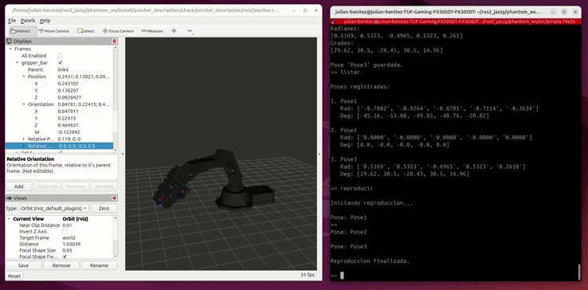
</div>

### Eliminar una pose

Elimina una pose previamente registrada tanto de la memoria del programa como del archivo `poses.yaml`.

<div align="center">
    
</div>

### Detener la reproducción

Interrumpe la ejecución de la secuencia de poses en cualquier instante.

<div align="center">
    
</div>

## Actividad 14. Trazado de una Figura


Para la generación de la trayectoria circular se desarrolló un nodo en Python que calcula una secuencia de puntos cartesianos pertenecientes a una circunferencia definida por un centro y un radio. Para cada punto se resuelve la cinemática inversa del robot utilizando sus parámetros de Denavit-Hartenberg (DH), obteniendo los ángulos articulares correspondientes. Posteriormente, estas configuraciones se publican de forma continua en el tópico `/pincher/command`, permitiendo que el robot describa una trayectoria circular suave en RViz. Este enfoque facilita la implementación de trayectorias en el espacio cartesiano y puede extenderse fácilmente a otras figuras modificando únicamente los puntos que describen la trayectoria.

<div align="center">
    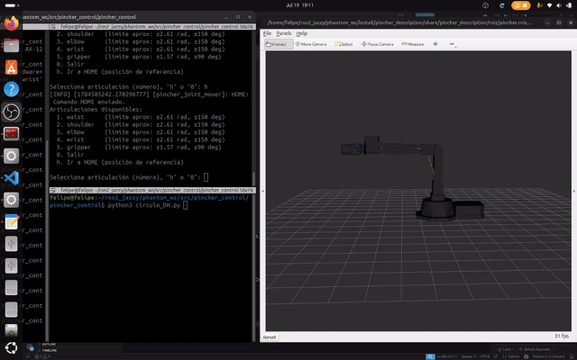
</div>

## Actividad 15. Trazado de una Figura


Para la coreografía se desarrolló un nodo en Python que ejecuta una secuencia de posiciones articulares predefinidas mediante interpolación lineal entre cada una de ellas, logrando movimientos suaves y continuos del robot. La secuencia inicia y finaliza en una posición segura, e involucra las articulaciones de la base, hombro, codo, muñeca y pinza. Antes de comenzar la ejecución, el programa realiza una cuenta regresiva para facilitar la sincronización con la reproducción de la canción. Posteriormente, las poses se ejecutan de forma automática durante aproximadamente 48 segundos, cumpliendo con la duración mínima requerida y sin necesidad de intervención del usuario una vez iniciada la rutina.

<div align="center">
    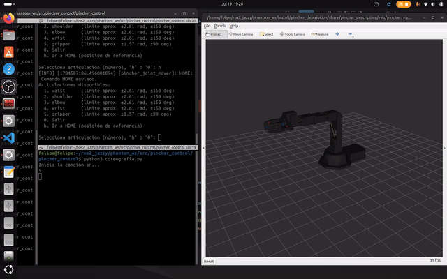
</div>

## Conclusiones

- Se implementó la cinemática directa e inversa del manipulador Phantom utilizando la convención de Denavit–Hartenberg, obteniendo un modelo capaz de relacionar las variables articulares con la posición y orientación del efector final.

- La validación de los algoritmos en ROS 2 y RViz permitió comprobar el correcto funcionamiento del modelo cinemático, obteniendo resultados coherentes con el comportamiento esperado del robot en simulación.

- La integración de los modelos matemáticos con el control del manipulador permitió ejecutar trayectorias a partir de configuraciones articulares calculadas, demostrando la aplicabilidad de la cinemática en tareas de posicionamiento.

- El desarrollo de la práctica puso de manifiesto la importancia de una adecuada definición de los sistemas de referencia, los parámetros geométricos y los sentidos de giro de las articulaciones para obtener un modelo consistente con la geometría real del manipulador.
