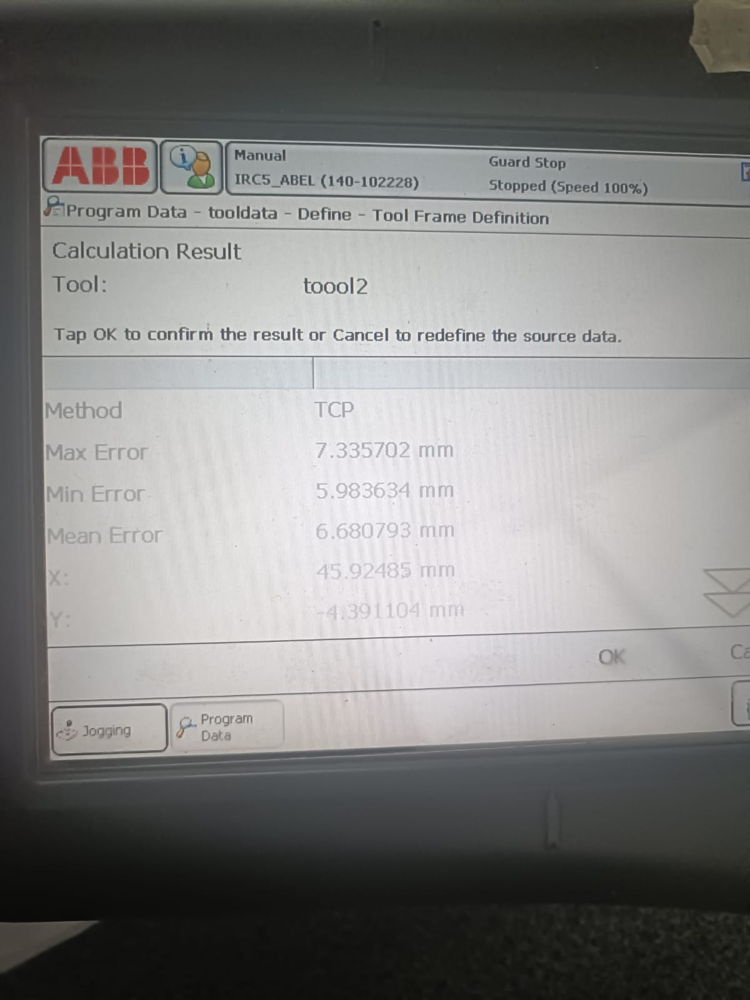
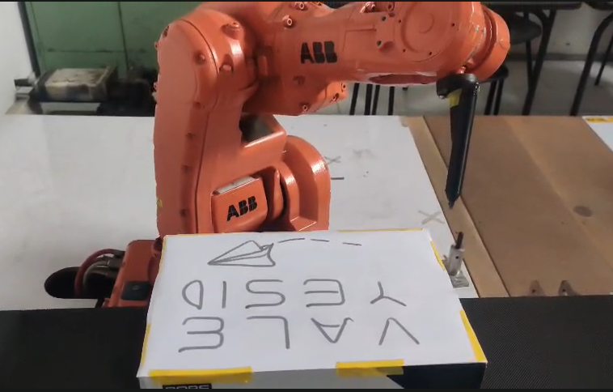

# Robótica-ABB — RobotStudio

> Esta es una práctica de laboratorio del curso Robótica que comprende el diseño CAD, simulación en RobotStudio y ejecución real con ABB IRB140. Es un sistema para automatizar el trazo de dibujos sobre piezas en una banda transportadora usando una herramienta diseñada e impresa para la tarea.
---
## Descripción detallada de la solución planteada
El objetivo es diseñar un sistema que automatice el trazado de dibujos sobre piezas transportadas por una banda, simulando procesos industriales de decoración, de manera más específica, el decorado de tortas. El ABB IRB140 detecta la llegada y posición de la pieza mediante sensores digitales, sincroniza la banda transportadora y ejecuta rutinas de trazado de alta precisión con la herramienta diseñada, que se trata de un soporte para marcador con adaptador de flange.

La programación en RAPID se organizó e módulos, separando las funciones principales en diferentes procedimientos. Una rutina de retorno a Home, una de mantenimiento, una para el trazado de nombres y otra para el trazado del ícono. Además, se implementó un control de entradas y salidas digitales para sincronizar el movimiento del robot con el accionamiento de la banda transportadora y con las transiciones entre modos de operación.

Para garantizar que las trayectorias se ejecutaran correctamente sobre la superficie de trabajo, se definió un WorkObject asociado al pastel virtual, lo que permitió programar los puntos de trazado respecto a una referencia local. De igual forma, el TCP la herramienta del marcador fue definido en RobotStudio.

Respecto al modo de mantenimiento, se activa por una entrada digital independiente, en el que el robot se desplaza a una pose segura para facilitar la instalación, retiro o ajuste de la herramienta. Entonces además de ejecutar el decorado automático incluye una etapa de preparación y ajuste, similar a lo que ocurre en un entorno industrial real.

Componentes del sistema:
- Robot - ABB IRB140: Encargado de ejecutar movimientos articulares, lineales y circulares para posicionamiento, aproximación y trazado.
- Banda transportadora: Utilizada para desplazar el pastel hacia la zona de trabajo y hacia la salida, controlada mediante señales digitales.
- Herramienta- soporte para marcador con adaptador de flange: Diseñada e impresa en 3D para acoplar un marcador al robot y permitir el trazado sobre la superficie.
- WorkObject - Pastel para 20 personas: Sistema de coordenadas local sobre el cual se definieron las trayectorias de decorado.

## Plano de planta de la ubicación de cada uno de los elementos

## Diseño de la herramienta

La herramienta se diseñó como un soporte para marcador con adaptador al flange del ABB IRB140. Su geometría se definió buscando robustez y facilidad de montaje. El marcador se orientó con una inclinación de 30°, ya que este ángulo permitió un mejor acceso a la superficie de trabajo y evitó configuraciones cinemáticas desfavorables del robot por el riesgo de singularidades.

Además, se incorporó un mecanismo de resorte para aplicar presión controlada sobre el marcador. Este resorte introduce tolerancia mecánica durante el trazado, errores menores de calibración y diferencias en la superficie, lo que ayuda a mantener un contacto continuo y uniforme durante la escritura y el decorado.

### Fabricación e impresión 3D:

- Se imprimió con 25% de relleno para garantizar una rigidez suficiente, evitando deformaciones durante uso repetido.
- Material: PLA 
- Patrón de giroide.
- Perímetros: 2–3 walls.
- Montaje por rosca: En la parte de atrás de la herramienta se hizo una tapa con rosca que permite retirar el resorte y el marcador sin problemas.

### Calibración de la herramienta

Para que el robot pueda ejecutar trayectorias con precisión, es necesario definir correctamente el TCP, es decir, el punto exacto de la herramienta que realmente entra en contacto con la superficie de trabajo.

La calibración de la herramienta se intentó realizar directamente en el robot real mediante la opción de Tool Frame Definition. En este procedimiento se llevan varias orientaciones de la herramienta hacia un mismo punto de referencia, de manera que el controlador calcule la posición del TCP a partir de esas mediciones. El objetivo es que todas las aproximaciones coincidan en el mismo punto físico.

Sin embargo, durante la práctica la calibración obtenida en el robot presentó un error elevado. Como se observa en la imagen, el resultado mostró un error máximo de 7.34 mm que es alto para una aplicación de trazado con marcador, ya que puede afectar la precisión del decorado.

Debido a que la calibración experimental no ofreció suficiente precisión, se decidió utilizar el tooldata definido en RobotStudio, ya que la geometría de la herramienta y su TCP podían establecerse de forma más controlada y consistente con el diseño CAD.

## Diagrama de flujo de acciones del robot

## Descripción de las funciones utilizadas
En esta sección se explican los comandos, las señales y procedimientos empleados en la práctica, orientada a su aplicación práctica en el banco. 

### Comandos de movimiento y su aplicación
- **MoveJ (movimiento articular)**
    - Se encarga de mover el robot actuando sobre sus ejes.
    - Se constituye de transiciones rápidas a posiciones seguras o de reposo, home o la posición de mantenimiento, y desplazamientos fuera de la zona de trazado.

- **MoveL (movimiento lineal)**
    - Traslada la herramienta en línea recta manteniendo orientación.
    - El usuario especifica el trazado de líneas rectas y posicionamientos precisos relativos al WorkObject, se usó para hacer los trazos de las letras y del símbolo.

- **MoveC (movimientos curvilíneos)**
    - Genera trayectorias en arco entre puntos definidos.
    - Se aplicó en ejecución de curvas suaves las letras y partes del símbolo, manteniendo continuidad de trayectoria.

### Control de Entradas y salidas en sincronizado
- **SetDO**
    - Activa y desactiva salidas físicas
    - En el sistema se usa para inicializar salidas digitales en estado apagado al inicio del programa por seguridad

- **Set**
    - Activa las salidas digitales
    - controla la banda transportadora y enciende indicadores físicos (DO_01, DO_02, DO_03) que informan al operador el estado del proceso.

- **Reset**
    - Desactiva las salidas digitales.
    - Se utiliza para apagar las salidas y detener la banda transportadora después de cada acción.

- **WaitTime**
    - Pausa la ejecución por un intervalo.
    - Se usa para sincronizar el arranque y parada de la banda con la posición de la pieza y permitir asentamiento mecánico.

- **WaitUntil**
    - Mantiene el programa detenido hasta que se cumpla una condición lógica.
    - Se emplea para esperar que el usuario coloque la herramienta en el flange del robot por seguridad para luego volver a home.

### Procedimientos y bloques funcionales
- **main()**
    - Es el procedimiento principal del programa. Inicializa las salidas digitales en cero, mantiene un ciclo continuo de supervisión de entradas y ejecuta la rutina correspondiente según la señal activada. Controla los tres modos de operación: decorado (DI_01), mantenimiento (DI_02) y transporte adicional (DI_03).

- **Path_home()**
    - Lleva el robot a la posición Home mediante un movimiento articular (MoveJ). Se usa como referencia segura al inicio y al final de las rutinas.

- **Path_maintenance()**
    - Posiciona el robot en una pose de mantenimiento para facilitar la revisión y, montaje o desmontaje de la herramienta.

- **Path_names()**
    - Ejecuta la trayectoria correspondiente al trazado de los nombres del equipo sobre el workobject del pastel. Combina movimientos lineales y curvos para formar el recorrido de escritura.

- **Path_icon()**
    - Ejecuta la trayectoria de un ícono complementaria al trazado de los nombres.

### Parámetros de trabajo
- Velocidad programada: v100
- Zona de aproximación: z10
- Herramienta: MyNewTool
- Referencias de trabajo: wobj0 para posiciones generales y wobjcajitazvy para las trayectorias de decorado sobre la superficie de trabajo.

## Código en RAPID
[Ver archivo RAPID Module1-Implementacion.mod](Codigo%20RAPID/Module1-Implementacion.mod)

## Vídeo de simulación e implementación

### Resultado final

