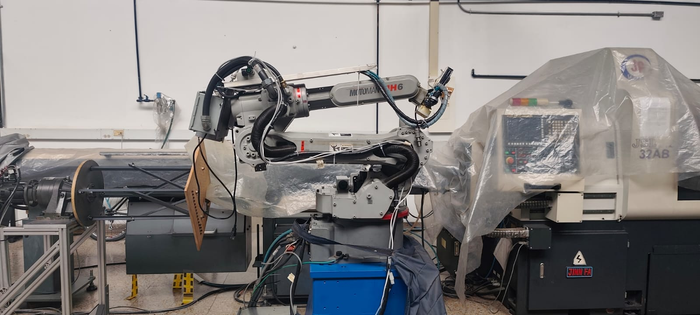
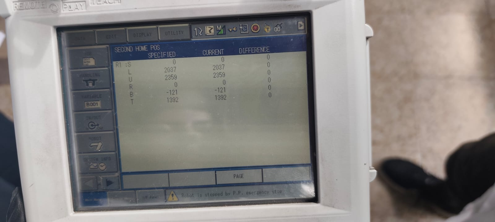
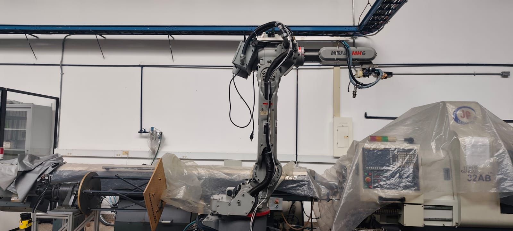
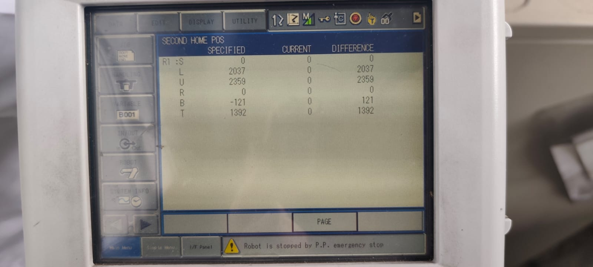
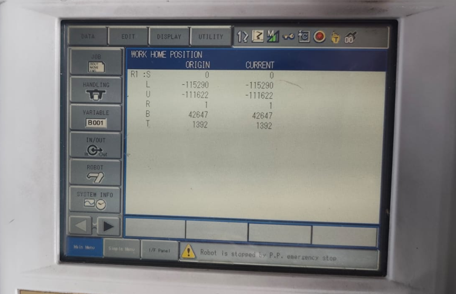
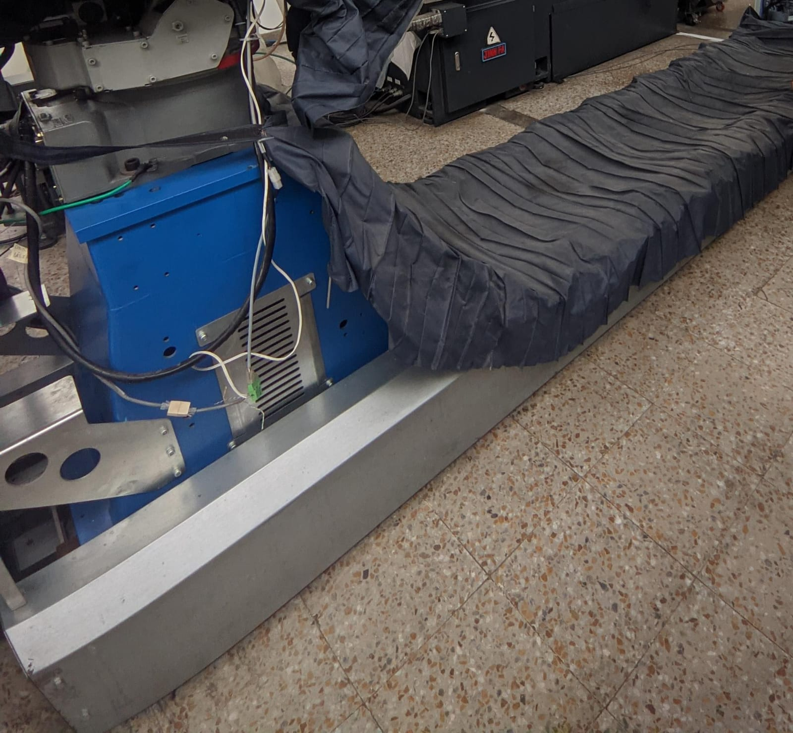
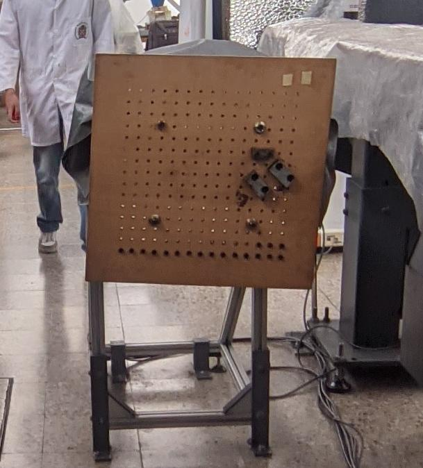
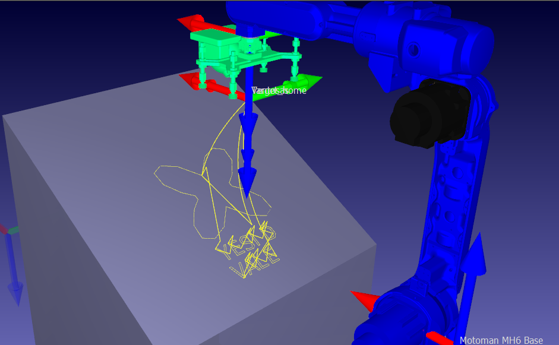

# Robótica Industrial - Análisis y Operación del Manipulador Motoman MH6
> Esta práctica de laboratorio se enfoca en el análisis, operación manual, simulación y programación del manipulador industrial Motoman MH6 con controlador DX100. Se hace una comparación con los ABB, se describen las configuraciones, procedimientos para realizar movimientos manuales y la integración con RoboDK. 

### Cuadro Comparativo Técnico: Motoman MH6 vs. ABB IRB140

| Característica               | Manipulador Motoman MH6                                                            | Manipulador ABB IRB 140                                                                    |
| :--------------------------- | :--------------------------------------------------------------------------------- | :----------------------------------------------------------------------------------------- |
| **Carga Máxima (Payload)**   | 6 kg                                                                               | 6 kg                                                                                       |
| **Grados de Libertad (DOF)** | 6 ejes                                                                             | 6 ejes                                                                                     |
| **Alcance Máximo (Reach)**   | 1422 mm                                                                            | 810 mm                                                                                     |
| **Repetibilidad**            | ± 0.08 mm                                                                          | ± 0.03 mm                                                                                  |
| **Velocidad Máxima (TCP)**   | ~ 2000 mm/s                                                                        | ~ 2500 mm/s                                                                                |
| **Peso del Brazo**           | 130 kg                                                                             | 98 kg                                                                                      |
| **Aplicaciones Típicas**     | Soldadura por arco, manipulación de materiales, ensamble, aplicación de adhesivos. | Carga/descarga de máquinas, empaque, ensamblaje electrónico, pulido, aplicaciones médicas. |
| **Controlador**              | DX100                                                                              | IRC5                                                                                       |

#### Análisis de Comparación:
1. **Espacio de Trabajo:** El Motoman MH6 ofrece un área de trabajo más amplia, con un alcance que casi duplica al del IRB 140 (1422 mm vs 810 mm), lo que facilita su integración en líneas de producción extensas.
2. **Precisión y Agilidad:** El ABB IRB 140 destaca por su precisión superior (±0.03 mm de repetibilidad) y una velocidad lineal ligeramente mayor en el centro de la herramienta (TCP), lo que lo hace ideal para tareas de alta velocidad en espacios confinados.

## Descripción configuraciones home1 y home2
### Home1
<p align="center">
  
</p>
corresponde a una postura compacta para ocupar el menor volumen posible. Esta configuración es útil para transporte, almacenamiento, mantenimiento o trabajo en espacios reducidos, porque reduce el área ocupada por el manipulador y disminuye el riesgo de interferir con elementos cercanos.


En la siguiente imagen se puede ver la posición de las 6 articulaciones (S, L, U, R, B y T) en el Home1 donde se compara una posición guardada como referencia contra la posición actual del robot

<p align="center">
  
</p>


### Home2
Corresponde a la postura de trabajo o referencia, donde los encoders están en cero y es el que suministra el fabricante.
<p align="center">
  
</p>
En la siguiente imagen se puede ver la posición de cada articulación (S, L, U, R, B y T) en el Home2

<p align="center">
  
</p>

<p align="center">
  
</p>

Respecto a cuál es mejor depende del uso. Para trabajar, la mejor es HOME2, porque es la posición de referencia con los encoders en cero. Esto facilita verificar el estado del robot, iniciar programas desde una postura conocida, comparar posiciones. Mientras que para transportar o dejar el robot en reposo en espacios reducidos, la mejor es HOME1, porque ocupa menos volumen.

## Procedimeinto para realizar movimientos manuales
#### 1. 
Antes de mover el robot, se debe verificar que el área de trabajo esté libre de personas, herramientas u obstáculos. También se debe confirmar que los botones de parada de emergencia funcionen correctamente en el Teach Pendant.

#### 2. 
La llave o selector de modo debe colocarse en TEACH que es el modo de manual entonces el robot solo depende del Teach Pendant.

#### 3. 
Una vez el controlador está encendido y el modo está en TEACH, se activa la alimentación de los servomotores. Entonces hay que erificar que no haya ninguna alarma activa. Luego pulsar SERVO ON READY para energizar los motores. El indicador de "Servo ON" se debe poner verde.

#### 4. 
Se debe seleccionar una velocidad baja. En la siguiente sección se indica como se puede variar la velocidad manual. Aunque durante las clases se recomiendó iniciar en INCH o SLOW, ya que permiten desplazamientos más controlados.

#### 5. Cambio entre modo de articulaciones y modo cartesiano
Hay dos maneras de mover el robot, lineal angular y articular, esto se cambia en el botón de coordenadas, la tecla COORD del Teach Pendant. Esta tecla permite seleccionar el sistema de coordenadas o modo de desplazamiento manual. Se diferencia explícitamente entre EJES / AXIS, COORDENADAS / COORD, movimiento de articulaciones, movimiento en el espacio de trabajo y coordenadas de herramienta.

Los modos principales son:
| Modo seleccionado | Movimientos | Uso principal |
|---|---|---|
| **AXIS / JOINT** | Mueve cada articulación del robot por separado | Alejarse de obstáculos, llevar el robot a una postura segura, aproximaciones generales |
| **XYZ / cartesiano** | Mueve el TCP en el espacio de trabajo | Trasladar la herramienta en línea recta respecto a X, Y o Z |
| **TOOL** | Mueve el TCP respecto a los ejes propios de la herramienta | Ajustar orientación o aproximación de una herramienta montada en el flange |
| **USER** | Mueve el TCP respecto a un sistema de usuario definido | Trabajar alineado con una mesa, pieza o plano de trabajo |

#### 6. Movimiento manual en modo de articulaciones: AXIS / JOINT

En este las teclas de movimiento no desplazan directamente el TCP en línea recta, sino que mueven cada eje físico del robot. En el MH6, los seis ejes articulares se identifican:

- **Eje S:** Giro de la base del robot.
- **Eje L:** Movimiento del brazo inferior.
- **Eje U:** Movimiento del brazo superior.
- **Eje R:** Giro de muñeca.
- **Eje B:** Inclinación de muñeca.
- **Eje T:** Giro final de la herramienta.

Para este el procedimiento después de tener seleccionada la velocidad (INCH o SLOW), es: 

1. Presionar COORD hasta seleccionar AXIS o JOINT.
2. Mantener presionado el deadman switch o botón de hombre muerto en posición intermedia.
3. Usar las teclas **S+/S-**, **L+/L-**, **U+/U-**, **R+/R-**, **B+/B-** o **T+/T-** para mover la articulación deseada.
4. Soltar la tecla de movimiento para detener el eje.

Este modo es útil cuando se necesita modificar la postura general del robot, por ejemplo, para evitar choques o para llevarlo a una posición de transporte o aproximación.

#### 7. **Movimiento manual en modo cartesiano: traslaciones en X, Y, Z**
En modo cartesiano, el robot mueve el TCP respecto a un sistema de coordenadas, por lo que las teclas de movimiento se interpretan como desplazamientos lineales en los ejes X, Y y Z.

1. Presionar COORD hasta seleccionar XYZ, RECT, ROBOT o el sistema cartesiano equivalente.
2. Mantener presionado el botón de hombre muerto.
3. Usar las teclas correspondientes al movimiento deseado. Por ejemplo X+ para traslada el TCP en dirección positiva del eje X, X- para traslada el TCP en dirección negativa del eje X y así con cada eje.

Este es el modo en el espacio de trabajo. Es más adecuado para aproximarse a una pieza, ajustar la posición de una herramienta o realizar pequeños desplazamientos lineales. 

#### 8. Movimiento manual en modo cartesiano: rotaciones alrededor de X, Y, Z
Además de trasladar el TCP, el modo cartesiano permite modificar la orientación de la herramienta. En la documentación del DX100, los elementos de posición incluyen X, Y, Z para posición lineal y Tx, Ty, Tz para orientación o rotación.

Se interpretan de la siguiente manera:

- **Tx+ / Tx-:** Rotación positiva o negativa alrededor del eje X.
- **Ty+ / Ty-:** Rotación positiva o negativa alrededor del eje Y.
- **Tz+ / Tz-:** Rotación positiva o negativa alrededor del eje Z.

Estas rotaciones cambian la orientación del TCP. Por ejemplo, si se tiene una herramienta montada en el flange, las teclas Tx, Ty y Tz permiten inclinar o girar la herramienta sin buscar directamente qué articulación debe moverse.

#### 9. Uso de coordenadas de herramienta
Cuando se selecciona el modo TOOL, los movimientos X, Y y Z ya no se interpretan respecto al sistema global del robot, sino respecto al sistema propio de la herramienta. Esto es útil cuando se quiere mover la herramienta en positivo, negativo o “en la dirección de trabajo” sin depender de la orientación global del robot.

#### 10. Movimiento manual de ejes externos
El Motoman H6 del laboratorio cuenta con dos ejes externos que solo se pueden mover de forma articular. El eje 7/E que es un riel, desplaza el manipulador en una dirección recta. Es decir, lo mueve únicamente en sentido positivo o negativo, por lo que sólo tiene un movimiento lineal.

<p align="center">
  
</p>

Mientras el eje 8 es un motor que se usa en procesos de micromaquinado que sólo se mueve en sentido horario o antihorario según la tecla usada. Es decir sólo es un movimiento angular.
<p align="center">
  
</p>


#### 11. Recomendaciones durante el movimiento manual
Durante toda la operación manual se debe mantener una velocidad reducida y observar el comportamiento del robot. Si el movimiento no corresponde a lo esperado, se debe soltar inmediatamente la tecla de movimiento o el botón de hombre muerto. También se recomienda mover un solo eje o dirección a la vez.

En zonas cercanas a singularidades, límites articulares u obstáculos, es preferible reducir la velocidad a INCH y, si el movimiento cartesiano se vuelve poco intuitivo, regresar temporalmente al modo AXIS / JOINT para reacomodar la postura del robot.

#### 12. Finalización del movimiento manual

Al terminar el movimiento manual:
1. Soltar las teclas de movimiento.
2. Soltar el deadman switch.
3. Desactivar los servos si no se continuará operando.
4. Dejar el manipulador en Home2
5. Verificar que no queden alarmas activas ni herramientas en posición de riesgo.

## Niveles de velocidad para movimientos manuales
La velocidad manual se puede verificar directamente en la consola de programación mediante la indicación de velocidad manual. Además, el cambio de velocidad se realiza con las teclas FAST y SLOW

#### 1. Niveles disponibles de velocidad manual

| Nivel mostrado | Nombre | Descripción |
|---|---|---|
| **INCH** | Movimiento por incremento | Es el nivel más lento y se usa para acercamientos delicados o cuando el robot está cerca de una pieza, herramienta u obstáculo. Es útil en movimientos pequeños sobre X, Y, Z, o cuando se ajusta la orientación de la herramienta con Tx, Ty, Tz. |
| **SLW** | Slow / lento | Movimiento continuo a baja velocidad. Es útil para operar con seguridad durante prácticas o ajustes generales. En el manual se menciona que, para las operaciones FWD/BWD, si se selecciona INCH, el movimiento se ejecuta realmente en SLW, lo cual indica que SLW es el nivel mínimo usado para este tipo de avance por pasos. |
| **MED** | Medium / medio | Movimiento a velocidad intermedia. Se usa cuando se tiene mayor seguridad del movimiento y hay espacio libre alrededor del robot. |
| **FST** | Fast / rápido | Movimiento rápido. Se usa normalmente cuando el robot está lejos de obstáculos y se desea desplazarlo a una zona general. |

#### 2. Proceso para cambiar entre niveles de velocidad
El cambio de velocidad se hace con las teclas físicas FAST y SLOW del Teach Pendant. Entonces cada vez que se presiona FAST, la velocidad aumenta en esta secuencia:

INCH → SLW → MED → FST

Por el contrario, cada vez que se presiona SLOW, la velocidad disminuye en esta secuencia:

FST → MED → SLW → INCH

#### 3. Procedimiento recomendado para cambiar la velocidad manual
1. Verificar que el robot esté en modo TEACH.
2. Soltar momentáneamente la tecla de movimiento del eje o coordenada.
3. Observar el nivel de velocidad actual en el área de estado del Teach Pendant.
4. Presionar FAST si se desea aumentar la velocidad.
5. Presionar SLOW si se desea disminuir la velocidad.
6. Confirmar visualmente en la pantalla que el nuevo nivel quedó seleccionado.
7. Continuar el movimiento manteniendo el botón de hombre muerto en posición intermedia y presionando la tecla de movimiento correspondiente.

#### 4. identificar el nivel establecido en la interfaz
El nivel de velocidad manual se identifica en la pantalla del Teach Pendant en el área de estado donde se observan las siguiente abrevieaturas: INCH,SLW,MED,FST. Esa indicación le permite al operador saber con qué velocidad responderá el robot antes de presionar una tecla de movimiento.

Por eso, antes de mover cualquier eje, el operador debe revisar dos cosas en la interfaz: el modo de coordenadas activo y el nivel de velocidad manual seleccionado.

#### 5. Diferencia entre velocidad manual y velocidad programada
La velocidad manual se usa cuando el operador mueve el robot directamente desde el Teach Pendant. En cambio, la velocidad de reproducción aparece en instrucciones como MOVJ, MOVL, MOVC o MOVS, con parámetros como VJ, V, VR o VE.

## RoboDK
#### 1. Principales funcionalidades de RoboDK
RoboDK permite crear un gemelo digital de la celda robótica. Esto significa que el robot real se representa en un entorno 3D, con sus límites articulares, herramienta, objetos cercanos y sistemas de referencia. De esta forma, antes de mover el robot físico, se puede verificar si la trayectoria es alcanzable, si la herramienta se orienta correctamente y si existe riesgo de colisión. Entre sus principales funcionalidades se encuentra:
- Permite visualizar el movimiento del robot antes de ejecutarlo físicamente.
- Permite generar trayectorias sin ocupar el robot real durante todo el proceso de programación.
- Permite definir una herramienta, como ventosas, marcador, pinza, etc
- Permite trabajar respecto a sistemas de coordenadas definidos sobre una mesa, caja, pieza o superficie.
- Permite crear movimientos articulares, lineales, circulares o trayectorias generadas por programación con Python o en bloques.
- Puede conectarse al controlador del robot para ejecutar movimientos desde el computador.

#### 2. Comunicación entre RoboDK y el manipulador Motoman
La comunicación entre RoboDK y el manipulador Motoman se realiza a través del controlador del robot, en este caso el controlador DX100 asociado al Motoman MH6. Para robots Yaskawa/Motoman, RoboDK puede conectarse mediante el driver MotomanHSE, usando el protocolo High-Speed Ethernet Server, HSE. La documentación oficial indica que este protocolo permite mover y monitorear el robot desde un computador mediante una conexión Ethernet estándar, y que el controlador DX100 está dentro de los controladores compatibles. 

El proceso general de comunicación es el siguiente:

1. El computador ejecuta RoboDK.
2. RoboDK contiene el modelo virtual del Motoman MH6.
3. El robot físico debe estar conectado a la red mediante Ethernet.
4. En RoboDK se selecciona Connect → Connect to Robot.
5. Se introduce la IP del controlador.
6. Se selecciona el driver correspondiente, normalmente MotomanHSE.
7. En el Teach Pendant del robot, el controlador debe estar en modo Remote.
8. RoboDK envía comandos de movimiento al controlador.
9. El controlador DX100 interpreta esos comandos y mueve físicamente los servomotores del robot.

#### 3. Funcionamiento del código en Python dentro de RoboDK
El código utiliza la API de RoboDK mediante:

```python
from robodk.robolink import *
from robodk.robomath import *
```
La librería robolink permite comunicarse con la estación de RoboDK, seleccionar robots, frames, herramientas y enviar instrucciones de movimiento. La librería robomath permite construir transformaciones homogéneas, por ejemplo con transl(x, y, z), que representa una posición en el espacio.

#### 4. Inicialización de la estación y selección del robot
```python
RDK = Robolink()
robot = RDK.ItemUserPick("Selecciona un robot", ITEM_TYPE_ROBOT)
```
Esto crea la conexión entre Python y RoboDK. Luego, ItemUserPick permite seleccionar el robot de la estación y se valida que exista

#### 5. Uso del frame y de la herramienta
```python
frame_name = "Frame_from_Target1"
frame = RDK.Item(frame_name, ITEM_TYPE_FRAME)
robot.setPoseFrame(frame)
robot.setPoseTool(robot.PoseTool())
```
El robot no ejecuta la trayectoria respecto al origen global de RoboDK, sino respecto al frame seleccionado

#### 6. Configuración de velocidad y suavizado
```python
robot.setSpeed(300)
robot.setRounding(5)
```
Aquí se define una velocidad de desplazamiento lineal de referencia en mm/s para movimientos cartesianos. También se define un radio de suavizado, que permite que el robot no se detenga completamente en cada punto, sino que suavice el paso entre segmentos.

#### 7. Tipos de movimiento usados: MoveJ y MoveL
```python
robot.MoveJ(target)
robot.MoveL(transl(x, y, z))
```
El código usa principalmente:

- MoveJ: Un movimiento articular. El robot se desplaza desde su configuración actual hasta un objetivo, moviendo sus articulaciones. No garantiza que el TCP siga una línea recta, como para ir a Home

- MoveL: Un movimiento lineal. En este caso, el TCP intenta desplazarse en línea recta entre un punto y el siguiente. Este tipo de movimiento es el más adecuado para tareas de trazado, dibujo, soldadura, seguimiento de contornos.

En el código para el laboratorio, el robot primero va a Home, Target_HOME, mediante MoveJ. Luego usa MoveL para recorrer la figura polar y las letras.

#### 8. Proceso interno para ejecutar movimientos
1. Python genera las coordenadas de la trayectoria.
2. RoboDK recibe los comandos MoveJ y MoveL.
3. RoboDK interpreta las posiciones respecto al frame activo.
4. RoboDK aplica el TCP de la herramienta seleccionada.
5. RoboDK resuelve la cinemática inversa, es decir, calcula qué valores articulares necesita el robot para alcanzar cada punto.
6. RoboDK verifica si el punto es alcanzable y si la configuración es válida.
7. Si se trabaja en simulación, RoboDK anima el robot virtual.
8. Si se trabaja conectado al robot real, RoboDK envía los comandos al controlador Motoman mediante el driver.
9. El controlador DX100 ejecuta físicamente el movimiento.

## Comparación RoboDK y robotstudio
| Característica               | RoboDK                                                                 | ABB RobotStudio                                                         |
| :--------------------------- | :--------------------------------------------------------------------- | :---------------------------------------------------------------------- |
| **Compatibilidad**           | Soporta decenas de fabricantes (Yaskawa, Fanuc, KUKA, ABB, etc.).      | Diseñado exclusivamente para robots de la marca ABB.                    |
| **Entorno de Simulación**    | Sencillo y más enfocado a cinemática.                                  | Simulación tipo gemelo digital, precisa al nivel de torques requeridos. |
| **Lenguaje de Programación** | Basado en python para scripts avanzados.                               | Basado en **RAPID** (lenguaje específico de ABB).                       |
| **Comunicación con Robot**   | A través de drivers específicos vía Ethernet (TCP/IP).                 | Comunicación LAN y ethernet                                             |
| **Dificultad**               | Baja, posee una interfaz intuitiva y fácil de usar para principiantes. | Requiere conocimientos detallados de la arquitectura y lógica de ABB.   |


*   **RoboDK:** Representa la flexibilidad y facilidad. Posee compatibilidad con Python, que es un lenguaje de programación sencillo de aprender y muy general, por lo que es muy probable que una persona lo sepa en comparación a otros lenguajes, además de eso el hecho de que sea compatible con tantos robots y marcas exige versatilidad para adaptarse a cada robot.
*   **RobotStudio:** Representa la especialización y potencia. Ofrece un nivel de detalle técnico que un software general no puede alcanzar, calcula tiempos exactos, energía, flujo de señales y características geométricas a un nivel muy específico, esto viene al costo de manejar sus propios estándares (ABB) que incluye un lenguaje de programación dedicado (RAPID) que es específico a la marca y no es una habilidad transferible como lo sería saber Python, además de tener una interfaz un poco más compleja por todas las funcionalidades que ofrece.
## Diagrama de flujo de acciones del robot


## Plano de planta de la ubicación de cada uno de los elementos

## Código en Robodk


## Video de simulacion e implementacion
[](https://www.youtube.com/watch?v=uN_OA0dUkic)
