# Robótica Industrial - Análisis y operación del manipulador EPSON T3-401S.
> > Esta práctica de laboratorio se enfocó en el análisis, operación manual, simulación y programación del manipulador industrial EPSON T3-401S mediante el entorno EPSON RC+ 7.0. Durante el desarrollo de la práctica se revisaron las principales características técnicas del robot SCARA, su configuración HOME, los modos de movimiento manual, los niveles de potencia y velocidad, así como el proceso de enseñanza de puntos y ejecución de trayectorias.
>
> Además, se diseñó una rutina de manipulación para dos huevos ubicados en una cubeta de 30 posiciones, utilizando la función de paletizado y respetando el patrón de movimiento del caballo de ajedrez. Para esta tarea se propuso el uso de un gripper neumático por vacío controlado mediante salidas digitales del robot.


### 1. Cuadro Comparativo Técnico: Motoman MH6 vs. ABB IRB140 vs. EPSON T3-401S

| Característica | Manipulador Motoman MH6 | Manipulador ABB IRB 140 | Manipulador EPSON T3-401S |
|---|---|---|---|
| **Carga Máxima** <br> **(Payload)** | 6 kg | 6 kg | 3 kg |
| **Grados de Libertad** <br> **(DOF)** | 6 ejes | 6 ejes | 4 ejes |
| **Alcance Máximo** <br> **(Reach)** | 1422 mm | 810 mm | 400 mm |
| **Repetibilidad** | ± 0.08 mm | ± 0.03 mm | ± 0.020 mm |
| **Velocidad Máxima** <br> **(TCP)** | ~ 2000 mm/s | ~ 2500 mm/s | ~ 3700 mm/s* |
| **Peso del Brazo** | 130 kg | 98 kg | 16 kg |
| **Aplicaciones Típicas** | Soldadura por arco, manipulación de materiales, ensamble, aplicación de adhesivos. | Carga/descarga de máquinas, empaque, ensamblaje electrónico, pulido, aplicaciones médicas. | Pick and place, ensamble ligero, manipulación de precisión, paletizado |
| **Controlador** | DX100 | IRC5 | EPSON RC+ 7.0 |


### 2. Descripción de la configuración HOME del EPSON T3-401S

La configuración HOME se realiza desde el entorno EPSON RC+ 7.0, en la sección de configuración HOME del Robot Manager. En esta ventana, la posición HOME se introduce en pulsos de codificador para cada articulación.

En el caso del laboratorio, se definió la siguiente configuración HOME:

<table>
  <tr>
    <td>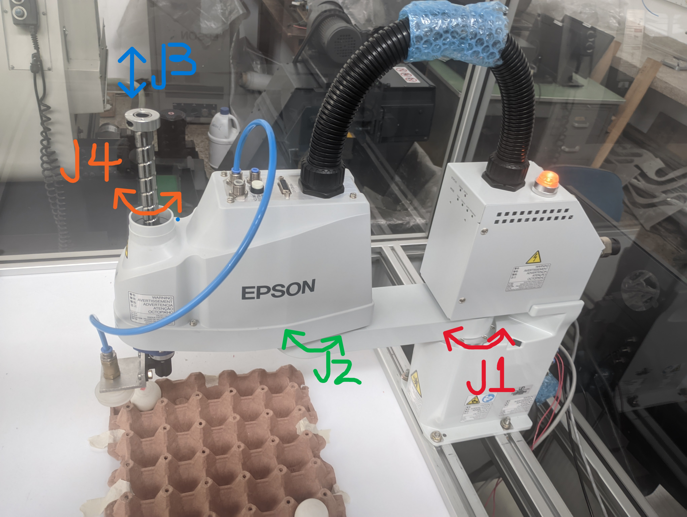</td>
    <td>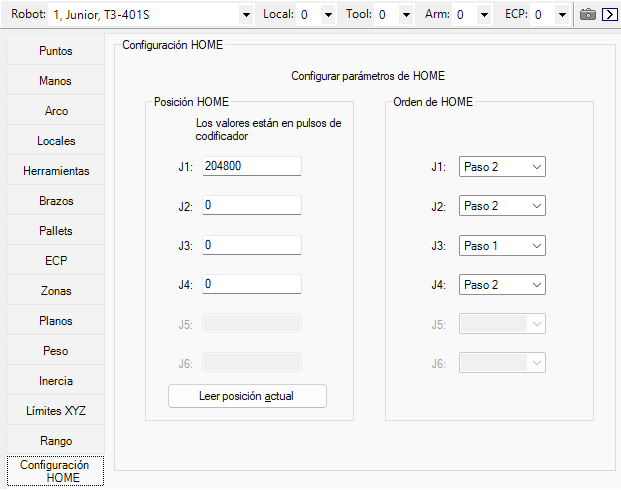</td>
  </tr>
</table>

La razón principal para modificar el valor de J1 es que, aunque según la referencia del fabricante los encoders pueden encontrarse en cero, en la práctica esta postura no resultaba adecuada para el laboratorio, ya que llevaba al robot cerca de un límite de movimiento. Por ello, se seleccionó una posición más segura rotando la articulación 1 aproximadamente 90°.

La conversión entre grados y pulsos se obtiene usando la resolución angular de la articulación. Para la articulación 1 la resolución es aproximadamente: 0.000439 °/pulso
>
> Pulsos = Ángulo en ° / Resolución
>
> Pulsos = 90° / 0.000439 °/pulso
>
> Pulsos ≈ 204800 pulsos

Además, se configuró el orden de movimiento HOME para que la articulación J3 se desplace en el Paso 1, mientras que J1, J2 y J4 se mueven en el Paso 2. Esto significa que el robot primero eleva el eje vertical hasta la posición superior y luego realiza los movimientos de las articulaciones rotacionales.

Esta secuencia es más segura porque reduce el riesgo de colisión entre el efector final, la mesa de trabajo o los elementos periféricos antes de desplazar el brazo en el plano horizontal.

### 3. Procedimiento para realizar movimientos manuales en EPSON RC+ 7.0

Para realizar movimientos manuales del manipulador, se utiliza la herramienta Robot Manager en EPSON RC+ 7.0, en la pestaña mover y enseñar (Jog & Teach). Desde esta sección es posible desplazar el robot manualmente, seleccionar el modo de movimiento, definir la distancia de desplazamiento y enseñar puntos de trabajo.

Antes de realizar cualquier movimiento manual, se debe verificar en el Panel de control que el sistema se encuentre en una condición segura de operación. Es decir, se revisa que la parada de emergencia esté desactivada, que no exista una condición de protección activa, que los motores estén activados y que la potencia se encuentre en modo bajo. 

En el panel de movimiento manual se puede seleccionar el modo de operación desde el campo Modo. Los modos más utilizados son:

| Modo | Descripción |
|---|---|
| **Mundo** | Permite mover el robot respecto al sistema de coordenadas global o base del robot. |
| **Tool / Herramienta** | Permite mover el robot respecto al sistema de coordenadas de la herramienta. En este modo, los desplazamientos dependen de la orientación actual del efector final. |
| **Articulación** | Permite mover cada articulación del robot de manera independiente. |

#### 3.1. Movimiento en modo cartesiano

En el modo cartesiano, Mundo o Tool, el robot se desplaza mediante los botones asociados a los ejes X, Y, Z y la rotación U.

<p align="center">
  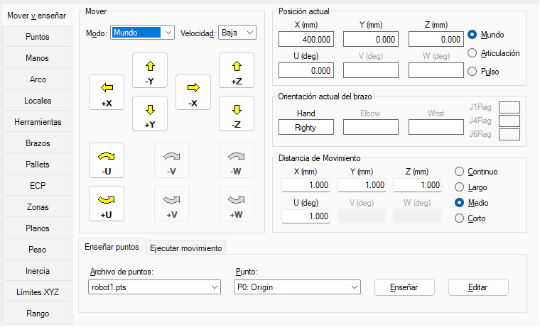
</p>

En el caso del robot, al ser un robot SCARA de 4 grados de libertad, las rotaciones V y W no se utilizan, por lo que aparecen deshabilitadas en la interfaz. El movimiento rotacional disponible en la herramienta es U, asociado a la orientación final del efector.

Cuando se selecciona el modo Mundo, los desplazamientos se realizan respecto al sistema de coordenadas fijo del robot. En cambio, cuando se selecciona el modo Tool, los movimientos se realizan respecto al sistema de coordenadas de la herramienta, por lo que la dirección de los ejes depende de la orientación actual del efector final.

#### 3.2. Movimiento en modo articulación

En el modo Articulación, el movimiento se realiza directamente sobre cada eje del robot. En este caso, los botones disponibles corresponden a las articulaciones J1, J2, J3 y J4.

<table>
  <tr>
    <td></td>
    <td>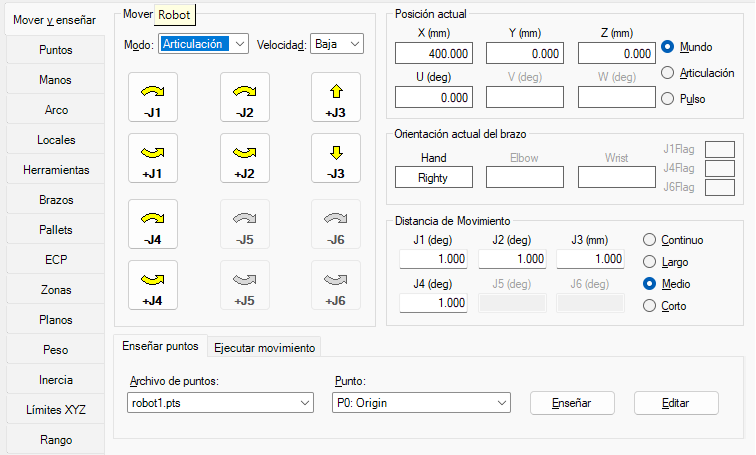</td>
  </tr>
</table>


| Articulación | Movimiento |
|---|---|
| **J1** | Rotación del primer brazo alrededor de la base del robot. |
| **J2** | Rotación del segundo brazo respecto al primer brazo. |
| **J3** | Movimiento vertical del eje Z. Permite subir o bajar el efector final. |
| **J4** | Rotación de la herramienta o muñeca final del robot. |

En este modo, las articulaciones J1, J2 y J4 se controlan en grados, mientras que la articulación J3 se controla en milímetros debido a que corresponde al desplazamiento vertical del eje del robot.

#### 3.3. Selección de distancia de movimiento

La sección Distancia de Movimiento permite definir el tamaño del desplazamiento manual. Esta puede configurarse en modo:

| Opción | Descripción |
|---|---|
| **Continuo** | El robot se mueve mientras se mantenga presionado el botón de movimiento. |
| **Largo** | Realiza desplazamientos grandes por cada pulsación. |
| **Medio** | Realiza desplazamientos intermedios. |
| **Corto** | Realiza desplazamientos pequeños para ajustes finos. |

Durante la práctica se mantuvo en medio, y de igual manera para posicionamiento preciso, es recomendable iniciar con distancias pequeñas o medias, de forma que el robot pueda aproximarse progresivamente al punto deseado sin riesgo de colisión.

#### 3.4. Visualización de la posición actual

La interfaz muestra la posición actual del robot. Esta puede visualizarse de diferentes formas:

| Visualización | Descripción |
|---|---|
| **Mundo** | Muestra la posición cartesiana del efector final en X, Y, Z y U. |
| **Articulación** | Muestra el valor actual de cada articulación del robot. |
| **Pulso** | Muestra la posición de cada articulación en pulsos de codificador. |

Esta visualización permite verificar en tiempo real la posición del robot durante el movimiento manual y facilita la enseñanza de puntos. Además, en la sección de simulator se puede ver un modelo del robot moviendose en tiempo real.

#### 3.5. Enseñanza de puntos

Una vez el robot se encuentra en la posición deseada, se puede registrar el punto mediante el botón "enseñar". Para ello, se selecciona el archivo de puntos correspondiente y el número o etiqueta del punto que se desea guardar. De esta manera, la posición actual del robot queda almacenada y puede ser utilizada posteriormente dentro de un programa o trayectoria.

### 4. Explicación de los niveles de velocidad para movimientos manuales

En el entorno del software, los movimientos manuales del robot se realizan desde el "Robot Manager", principalmente mediante las pestañas "Panel de control" y "Mover y enseñar". Para comprender los niveles de velocidad, es importante diferenciar entre la "potencia del sistema" y la "velocidad de movimiento manual".

La potencia se controla desde el "Panel de control", mediante los botones "POWER LOW" y "POWER HIGH". En la interfaz también se muestra el estado actual de potencia del robot.

| Nivel de potencia | Descripción |
|---|---|
| **Power Low** | Modo de baja potencia. El robot trabaja con velocidad y torque reducidos. Es el modo recomendado para movimientos manuales, enseñanza de puntos y pruebas iniciales. En la práctica de laboratorio se toma como referencia 300 mm/s. |
| **Power High** | Modo de alta potencia. El robot puede ejecutar movimientos con las velocidades programadas, sin la restricción propia del modo de baja potencia. Debe utilizarse únicamente cuando las condiciones de seguridad estén verificadas. |

En los movimientos manuales desde la pestaña "Mover y enseñar", además del nivel de potencia, se puede seleccionar la velocidad de jog desde el campo "Velocidad". Esta opción permite cambiar entre "Baja" y "Alta", dependiendo de si se requiere un ajuste fino o un desplazamiento más rápido.

<p align="center">
  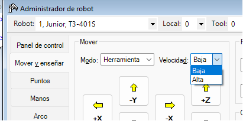
</p>

| Velocidad de jog | Uso recomendado |
|---|---|
| **Baja** | Se utiliza para movimientos precisos, aproximación a puntos, enseñanza de posiciones y verificación segura del movimiento. |
| **Alta** | Se utiliza para desplazamientos manuales más rápidos dentro del área de trabajo, siempre que no exista riesgo de colisión. |

#### 4.1. Articulaciones libres y bloqueadas

En el "Panel de control" también se encuentra la sección de "Articulaciones libres", donde es posible liberar o bloquear las articulaciones del robot. Esta opción permite que ciertas articulaciones dejen de estar controladas por el servosistema, facilitando el movimiento manual o la manipulación directa del robot.

| Opción | Función |
|---|---|
| **J1, J2, J3, J4** | Permiten seleccionar qué articulaciones se desean liberar. |
| **Liberar todas** | Libera las articulaciones seleccionadas del control servo. |
| **Bloquear todas** | Vuelve a bloquear las articulaciones bajo control del servosistema. |

En el caso del robot, las articulaciones J1 y J2 corresponden a los movimientos rotacionales principales del brazo en el plano horizontal. Estas articulaciones no se ven afectadas directamente por la gravedad de la misma manera que un eje vertical, ya que el peso del brazo es soportado principalmente por la estructura mecánica y los rodamientos.

La articulación J3, en cambio, corresponde al movimiento vertical del eje Z. Por esta razón, debe manipularse con mayor precaución, ya que el peso del efector final y de la herramienta puede influir sobre su movimiento. 

Cuando las articulaciones están bloqueadas, el servosistema mantiene la posición del robot. Para mantener una articulación fija, el motor puede aplicar torque aun cuando la velocidad sea cero. Este comportamiento se relaciona con el concepto de stall torque, entendido como el torque máximo que puede ejercer un motor cuando se encuentra detenido. En este estado, el motor no está girando, pero sí puede generar esfuerzo para sostener o mantener la posición.

#### 4.2. Identificación del estado en la interfaz

El nivel de operación del robot puede identificarse visualmente en el "Panel de control":

<p align="center">
  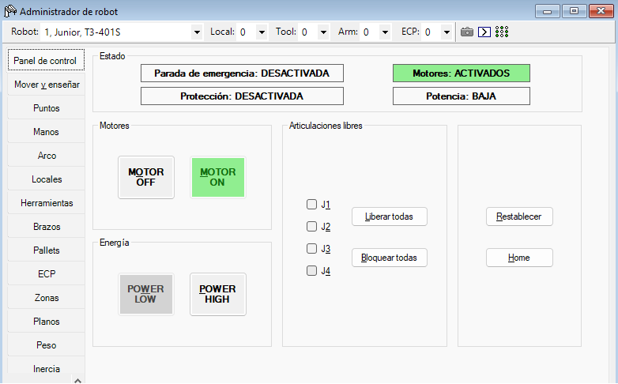
</p>

| Indicador en la interfaz | Significado |
|---|---|
| **Parada de emergencia: DESACTIVADA** | No hay una parada de emergencia activa. |
| **Protección: DESACTIVADA** | No hay una condición de protección activa que impida el movimiento. |
| **Motores: ACTIVADOS** | Los motores del robot están encendidos y disponibles para operar. |
| **Potencia: BAJA** | El robot se encuentra en modo de baja potencia. |

Si se activa una parada de emergencia, el robot detiene su operación y no podrá moverse hasta que se libere físicamente el botón de emergencia y se presione **Restablecer**. Este botón permite recuperar el sistema después de una condición de emergencia, siempre que la causa haya sido corregida.

Finalmente, el botón **Home** permite enviar el robot a la posición HOME previamente configurada. Esta función no corresponde a un cambio de velocidad, sino a un movimiento automático hacia una posición de referencia definida para el manipulador.

### 5. Principales funcionalidades de EPSON RC+ 7.0 y ejecución de movimientos

**EPSON RC+ 7.0** es el entorno de desarrollo, configuración y operación utilizado para programar y controlar robots EPSON.Entre sus principales funcionalidades se encuentran:

| Funcionalidad | Descripción |
|---|---|
| **Gestión de proyectos** | Permite crear, editar, compilar y cargar proyectos al controlador del robot. |
| **Programación en SPEL+** | Permite escribir rutinas de movimiento, lógica de control, manejo de variables, entradas y salidas. |
| **Robot Manager** | Permite controlar motores, potencia, realizar movimientos manuales, enseñar puntos y configurar parámetros del robot. |
| **Comunicación con el controlador** | Permite conectar el computador con el controlador del robot mediante USB o Ethernet. |
| **Simulación** | Permite trabajar con controladores virtuales para probar rutinas sin usar directamente el robot real. |
| **Edición de puntos** | Permite crear y modificar archivos de puntos, donde se almacenan posiciones X, Y, Z y orientación U. |
| **Paletizado** | Permite definir distribuciones regulares de puntos a partir de una geometría base, como una matriz de posiciones. |


#### 5.1. Comunicación entre el computador y el manipulador

Para que el software pueda controlar el robot, primero debe establecerse una comunicación entre el computador y el controlador del manipulador. Esta configuración se realiza desde la ventana comunicaciones de computadora a controlador.

<p align="center">
  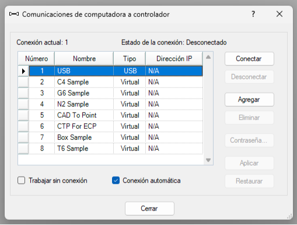
</p>

En esta ventana se pueden observar distintos tipos de conexión:

| Tipo de conexión | Uso |
|---|---|
| **USB** | Se utiliza para conectar el computador con el controlador del robot real. |
| **Ethernet** | Permite comunicación por red con el controlador, usando una dirección IP. |
| **Virtual** | Se utiliza para simulación, sin necesidad de conectar el robot físico. |

En el laboratorio, la conexión al manipulador real se realiza mediante USB, ya que esta es la conexión directa entre el computador y el controlador del EPSON T3-401S. El robot tiene su Teach Pedant pero no está disponible en la universidad.

Por otro lado, ara trabajar en simulación, se selecciona un controlador virtual, el cual permite probar programas, revisar trayectorias y validar la lógica sin mover físicamente el robot.

El proceso general de comunicación es el siguiente:

1. Abrir **EPSON RC+ 7.0**.
2. Ingresar a la ventana **Comunicaciones de computadora a controlador**.
3. Seleccionar el controlador correspondiente:
   - **USB** para el robot real.
   - **Virtual** para simulación.
4. Presionar **Conectar**.
5. Verificar que el estado de la conexión cambie a conectado.
6. Abrir o crear el proyecto de trabajo.

Una vez establecida la conexión, el computador puede enviar programas, puntos y comandos al controlador. El controlador es el encargado de interpretar estos comandos y ejecutar el movimiento sobre el manipulador.

#### 5.2. Proceso para ejecutar movimientos

El proceso para ejecutar un movimiento comienza con la creación o selección de puntos de trabajo. Estos puntos pueden enseñarse manualmente desde el robot manager o ingresarse directamente en el archivo de puntos.

Cada punto almacena la posición cartesiana del efector final, normalmente en coordenadas X, Y, Z, U.

Después de definir los puntos, se escriben los comandos de movimiento en un programa SPEL+. Cuando el programa se ejecuta, EPSON RC+ 7.0 compila el proyecto, lo enlaza y lo envía al controlador del robot. Si no hay errores, el controlador ejecuta la rutina y transforma los comandos en movimientos del manipulador.

#### 5.3. Comandos principales de movimiento

EPSON RC+ 7.0 utiliza comandos de movimiento propios del lenguaje SPEL+. Cada comando genera un tipo de trayectoria diferente.

<p align="center">
  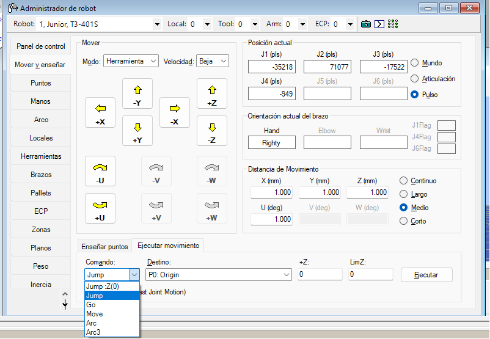
</p>

| Comando SPEL+ | Tipo de movimiento | Equivalencia conceptual | Descripción |
|---|---|---|---|
| **Go** | Punto a punto, PTP | MoveJ | Mueve el robot directamente hacia un punto. La trayectoria del efector final no necesariamente es recta. |
| **Jump** | Punto a punto con elevación | MoveJ con movimiento seguro en Z | El robot primero sube hasta una altura de seguridad, luego se desplaza sobre el punto destino y finalmente baja al punto indicado. |
| **Move** | Movimiento lineal, CP | MoveL | Mueve el efector final en línea recta desde la posición actual hasta el punto destino. |
| **Arc** | Movimiento circular, CP | MoveC | Mueve el robot siguiendo un arco circular definido a partir de un punto intermedio y un punto final. |
| **Arc3** | Movimiento circular en 3D | Movimiento circular espacial | Permite realizar interpolación circular en tres dimensiones. |
| **JTran** | Movimiento de una articulación | Movimiento articular individual | Permite mover una articulación específica del robot. |
| **Pulse / PTran** | Movimiento por pulsos de codificador | Movimiento en unidades internas | Permite mover el robot usando posiciones en pulsos de codificador. |

#### 5.4. Uso de puntos en EPSON RC+ 7.0

Los puntos se almacenan en archivos de puntos, como se observa en la interfaz. Cada punto contiene sus coordenadas y orientación.

| Dato | Descripción |
|---|---|
| **Número** | Identificador numérico del punto. |
| **Etiqueta** | Nombre asignado al punto, por ejemplo `Origin`, `PointX`, `PointY`. |
| **X** | Coordenada en el eje X. |
| **Y** | Coordenada en el eje Y. |
| **Z** | Altura del efector final. |
| **U** | Orientación de la herramienta. |
| **Local** | Sistema de coordenadas local utilizado. |
| **Hand** | Configuración de orientación del brazo, por ejemplo `Lefty` o `Righty`. |

En el laboratorio se definieron puntos como:
> P0 = Origin
> P1 = PointX
> P2 = PointY

<p align="center">
  
</p>

Estos puntos se utilizaron como referencia para definir la distribución de la cubeta mediante una función de paletizado.


#### 5.5. Función Pallet

La función Pallet permite definir una matriz de posiciones a partir de puntos de referencia. En lugar de enseñar manualmente las 30 posiciones de una cubeta, se enseñan puntos base que describen la geometría del arreglo y luego se indica la cantidad de filas y columnas.

Para una cubeta de 30 posiciones, organizada como una matriz de 6 x 5, se puede definir el pallet con: Pallet 1, Origin, PointY, PointX, 6, 5

En este caso:

| Elemento | Descripción |
|---|---|
| **Pallet 1** | Identificador del pallet. |
| **Origin** | Punto de origen de la matriz. |
| **PointY** | Punto que define la dirección de avance en Y. |
| **PointX** | Punto que define la dirección de avance en X. |
| **6, 5** | Distribución de la matriz: 6 columnas y 5 filas, según la orientación definida en el montaje. |

#### 6. Aplicación a la práctica de laboratorio.

En el laboratorio se debía diseñar y programar una trayectoria para manipular dos huevos ubicados inicialmente en los extremos de una cubeta de 30 posiciones. La cubeta tenía una distribución de **6 x 5**, por lo que se utilizó la función Pallet para representar todas las posiciones de la cubeta.

La restricción principal era que los huevos solo podían moverse siguiendo el patrón de movimiento del caballo en el ajedrez. Esto significa que cada desplazamiento debía realizarse con una relación de dos posiciones en una dirección y una posición en la dirección perpendicular.


### 7. Comparación RoboDK, ABB RobotStudio y EPSON RC+ 7.0

| Característica | RoboDK | ABB RobotStudio | EPSON RC+ 7.0 |
|---|---|---|---|
| **Compatibilidad** | Soporta múltiples marcas de robots industriales como Yaskawa, Fanuc, KUKA, ABB, EPSON, entre otras. | Diseñado principalmente para robots ABB. | Diseñado para robots EPSON, como la serie T y robots SCARA. |
| **Enfoque principal** | Simulación, programación offline y generación de trayectorias para diferentes marcas. | Simulación avanzada tipo gemelo digital para celdas ABB. | Programación, configuración, operación y comunicación directa con robots EPSON. |
| **Entorno de simulación** | Sencillo, flexible y orientado a cinemática, trayectorias y validación rápida. | Muy detallado, con representación precisa de celdas, controladores, señales y comportamiento ABB. | Más orientado al control real del robot, configuración del sistema y ejecución de programas que a una simulación visual avanzada. |
| **Lenguaje de programación** | Permite automatización mediante Python y otros lenguajes externos. | Utiliza RAPID, lenguaje propio de ABB. | Utiliza SPEL+, lenguaje multitarea propio de EPSON. |
| **Comunicación con robot** | Se comunica mediante drivers específicos, usualmente por Ethernet TCP/IP. | Se comunica con controladores ABB mediante red LAN/Ethernet y herramientas propias de ABB. | Permite conexión con el robot mediante USB y Ethernet; también puede integrarse con E/S remotas. |
| **Ventajas** | Muy flexible, compatible con muchas marcas, fácil de aprender y útil para programación offline. | Alta precisión para robots ABB, simulación robusta de celdas industriales y buena integración con controladores reales. | Integración directa con robots EPSON, configuración de parámetros del manipulador, control de E/S, programación SPEL+ y operación directa desde el entorno. |
| **Limitaciones** | Al ser generalista, puede no representar todos los detalles internos de cada controlador real. | Está muy centrado en ABB, por lo que su conocimiento no se transfiere directamente a otras marcas. | Está limitado principalmente al ecosistema EPSON y no es tan generalista como RoboDK ni tan visualmente detallado como RobotStudio. |
| **Aplicaciones típicas** | Programación offline, simulación rápida, validación de trayectorias, integración de robots de diferentes marcas. | Diseño de celdas ABB, simulación industrial avanzada, validación de ciclos, programación RAPID y puesta en marcha virtual. | Pick and place, ensamble ligero, empaquetado, laboratorio, control de robots SCARA EPSON y configuración de rutinas con E/S. |
| **Dificultad** | Baja a media. Tiene una interfaz intuitiva y es amigable para principiantes. | Media a alta. Requiere entender la lógica ABB, RAPID y la arquitectura del controlador. | Media. Es más sencillo que un entorno industrial muy avanzado, pero requiere aprender SPEL+, configuración de robot y manejo de E/S. |

- **RoboDK:** destaca por su flexibilidad y facilidad de uso. Es una buena herramienta para aprender programación offline, validar trayectorias y trabajar con robots de distintas marcas. Su mayor fortaleza es que permite aplicar conceptos generales de robótica sin depender de un único fabricante.

- **ABB RobotStudio:** se enfoca en la precisión y especialización para robots ABB. Es ideal cuando se necesita una simulación industrial completa, con controladores, señales, tiempos de ciclo y programación RAPID. Su limitación principal es que está muy ligado al ecosistema ABB.

- **EPSON RC+ 7.0:** está orientado al control y programación directa de robots EPSON. Es especialmente útil para robots SCARA como el T3-401S, ya que permite configurar parámetros del manipulador, programar en SPEL+, controlar entradas y salidas, y conectar el robot por USB o Ethernet. Su ventaja principal es la integración directa con el hardware EPSON; su limitación es que no es una plataforma general para múltiples marcas.1111

### 8. Diseño técnico del gripper neumático por vacío.

Para la manipulación de los huevos se propuso un gripper neumático por vacío, compuesto por un soporte mecánico, una ventosa flexible, un sistema neumático de generación de vacío y una señal de control digital desde el robot.

El diseño mecánico está compuesto por dos partes principales:

1. **Soporte impreso en 3D**
2. **Ventosa neumática de vacío**
<table>
  <tr>
    <td>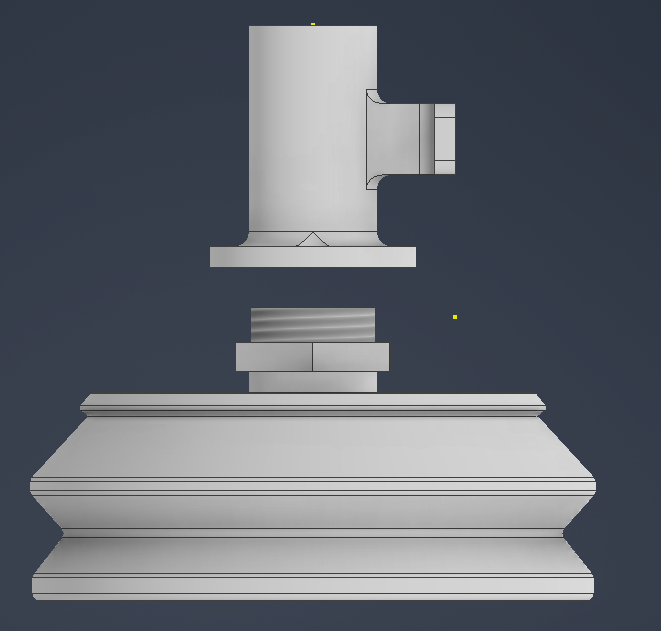</td>
    <td>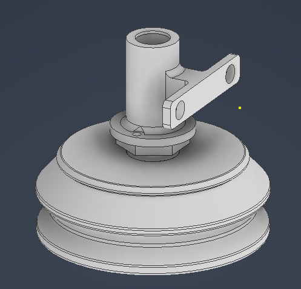</td>
  </tr>
</table>


#### 8.1. Componentes utilizados

| Componente | Función |
|---|---|
| **Soporte 3D** | Permite fijar el sistema de succión al efector final del robot. |
| **Ventosa** | Realiza el contacto directo con el huevo y genera la sujeción por vacío. |
| **Racor neumático** | Conecta la ventosa con la manguera de vacío. |
| **Manguera neumática** | Transporta el vacío desde el generador hasta la ventosa. |
| **Generador de vacío tipo Venturi** | Genera vacío a partir de aire comprimido. |
| **Electroválvula 3/2** | Permite activar o desactivar el flujo de aire hacia el generador de vacío. |
| **Fuente de aire comprimido** | Alimenta el sistema neumático. |
| **Regulador de presión** | Permite ajustar la presión de alimentación para evitar una succión excesiva. |
| **Salida digital del robot** | Activa o desactiva la electroválvula. |
| **Entrada digital del robot** | Recibe la señal del sensor de vacío, si se utiliza. |


#### 8.2. Descripción del funcionamiento

El sistema funciona a partir de una señal digital enviada desde el robot. Cuando el programa activa la salida digital asignada al gripper, la electroválvula permite el paso de aire comprimido hacia el generador de vacío. El generador tipo Venturi produce una presión negativa que se transmite por la manguera hasta la ventosa.

Cuando la ventosa entra en contacto con el huevo, el vacío permite sujetarlo sin necesidad de aplicar una fuerza de agarre mecánica. Posteriormente, el robot puede levantar el huevo, moverlo hacia otra posición de la cubeta y liberarlo desactivando la salida digital.

El proceso general es:

```text
Activar salida digital → Abrir electroválvula → Generar vacío → Sujetar huevo → Mover robot → Desactivar salida → Liberar huevo
```


#### 8.3. Configuración de E/S digitales

Para controlar el gripper neumático por vacío se utiliza una salida digital del robot. En el programa del laboratorio se trabajó con la salida DO_09, la cual se encarga de activar o desactivar la electroválvula del sistema de vacío.

La verificación de esta señal se realiza desde el monitor de E/S en el software. Esta herramienta permite observar el estado lógico de las entradas y salidas digitales del controlador. En la imagen se muestra el monitor utilizado para revisar el comportamiento lógico de las señales durante la simulación o pruebas sin conexión física directa al robot.

<p align="center">
  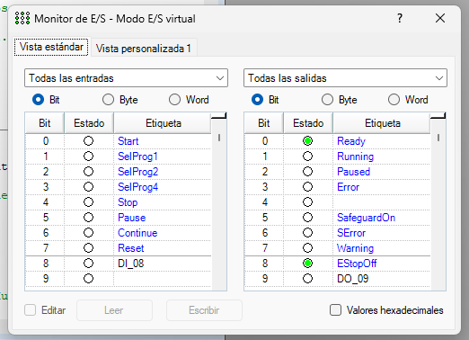
</p>

<p align="center">
  <em>Figura. Monitor de E/S digitales en EPSON RC+ 7.0, donde se observa la salida DO_09 asociada al gripper neumático.</em>
</p>

En la parte izquierda de la ventana se muestran las entradas digitales, mientras que en la parte derecha se muestran las salidas digitales. Cada señal tiene un número de bit, un estado lógico y una etiqueta asociada.

En la sección de salidas se observa la señal DO_09, ubicada en el bit 9. Esta salida fue asignada al control del gripper neumático. Cuando la salida se encuentra en estado OFF, se activa la electroválvula y se genera vacío en la ventosa. Cuando la salida se encuentra en estado ON, la electroválvula se desactiva y el huevo es liberado.

En la imagen también se observan salidas del sistema como Ready, Running, Paused, Error y EStopOff. Estas señales corresponden a estados generales del controlador. Como Ready indica que el sistema está listo, mientras que EStopOff indica que la parada de emergencia no se encuentra activa.

Se debe establecer un tiempo de espera después de activar la salida que permita que el sistema genere suficiente vacío antes de iniciar el movimiento del robot. De igual forma, después de desactivar la salida se deja un breve tiempo para asegurar que el huevo sea liberado correctamente.


### 9. Diagrama de flujo de la rutina de movimiento de huevos con patrón de caballo de ajedrez.
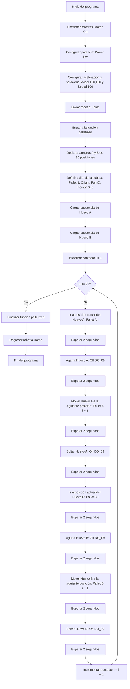

### 10. Plano de planta de la ubicación de la cubeta de huevos y posiciones iniciales de los huevos.
<p align="center">
  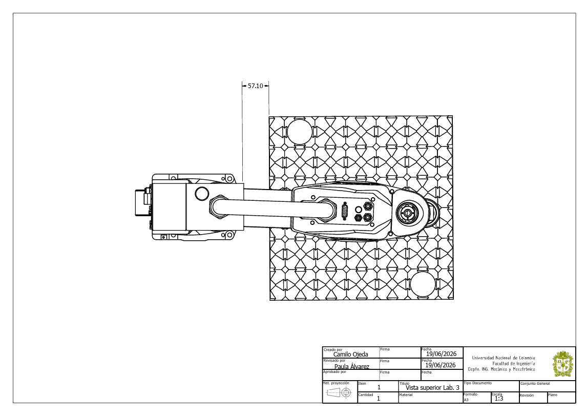
</p>

### 11. Código para ejecutar la trayectoria con patrón de caballo.

Para el ejercicio las secuencias para los dos huevos quedaron de la siguiente manera 

>Secuencia huevo A
1 → 14 → 25 → 21 → 29 → 18 → 5 → 9 → 13 → 26
→ 22 → 30 → 17 → 6 → 10 → 2 → 15 → 28 → 24 → 11
→ 3 → 7 → 20 → 16 → 27 → 23 → 12 → 4 → 8 → 19

>Secuencia huevo B
30 → 17 → 6 → 10 → 2 → 13 → 26 → 22 → 18 → 29
→ 21 → 25 → 14 → 1 → 9 → 5 → 16 → 3 → 7 → 20
→ 28 → 24 → 11 → 15 → 4 → 8 → 19 → 27 → 23 → 12

Las posiciones en la cubeta se definieron así, una matriz 6x5
<p align="center">
  
</p>

con lo cual el código completo de la práctica puede consultarse en el archivo
[MainC.prg](code/MainC.prg).

### 12. Video de simulación e implementación
<p align="center">
  <a href="https://youtu.be/VebWlqA3GsU">
    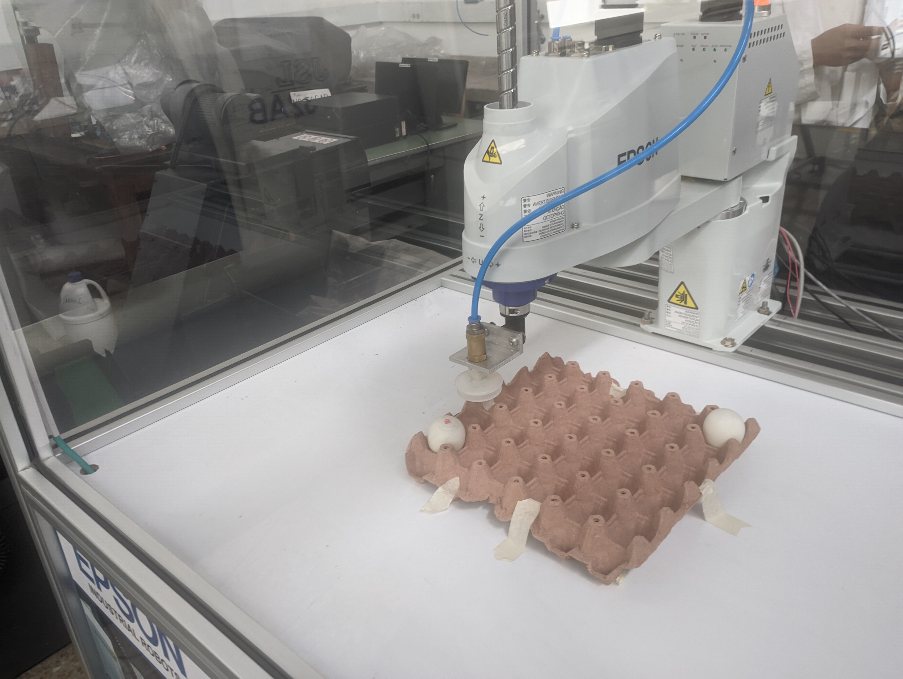
  </a>
</p>


