# Laboratorio No. 04 - Robótica de desarrollo
# Introducción a ROS 2 Jazzy Jalisco - Turtlesim

## 1. Descripción general
Este laboratorio tiene como objetivo implementar una aplicación en ROS 2 Jazzy Jalisco utilizando `turtlesim`, en la cual se controla una tortuga principal (`turtle1`) mediante comandos en el teclado, se ejecutan trayectorias automáticas, se dibujan figuras geométricas y letras personalizadas, y se implementa un sistema líder-seguidor con una segunda tortuga (`turtle2`).

La solución fue desarrollada en Python usando `rclpy` y servicios propios de ROS 2. Además, se verificó la arquitectura de comunicación mediante comandos de inspección y la herramienta `rqt_graph`.

## 2. Objetivos del laboratorio

- Implementar nodos propios en ROS 2 usando Python y `rclpy`.
- Controlar `turtle1` mediante el teclado sin utilizar `turtle_teleop_key`.
- Ejecutar trayectorias automáticas como cuadrado, triángulo y patrullaje.
- Dibujar letras personalizadas correspondientes a las iniciales de los integrantes.
- Crear una segunda tortuga (`turtle2`) mediante servicios de ROS 2.
- Implementar un sistema líder-seguidor donde `turtle2` siga a `turtle1`.
- Verificar la arquitectura ROS 2 mediante nodos, tópicos, servicios y `rqt_graph`.

## 3. Estructura de la carpeta
```bash
src/my_turtle_controller/
├── setup.cfg
├── package.xml
├── setup.py
├── resource/
├── test/
└── my_turtle_controller/
    ├── move_turtle.py
    └── turtle_follower.py
```

Los archivos principales son los siguientes:

| Archivo | Descripción |
|---|---|
| `move_turtle.py` | Nodo principal de control de `turtle1`: teclado, figuras, letras, lápiz y trayectorias automáticas. |
| `turtle_follower.py` | Nodo encargado de crear `turtle2` e implementar el sistema líder-seguidor. |
| `setup.py` | Define los ejecutables ROS 2 del paquete. |
| `package.xml` | Declara las dependencias del paquete. |

---

## 4. Controles implementados

La interacción con el sistema se realiza de forma exclusiva a través de la terminal donde se ejecuta el nodo principal (`move_turtle.py`). A continuación, se detalla el mapeo de teclas:

| Tecla / Comando | Acción / Comportamiento |
| :---: | :--- |
| **Flechas (↑ ↓ ← →)** | Control manual: Movimiento lineal (adelante/atrás) y angular (giros). |
| **S** | Dibuja un **cuadrado** de forma automática. |
| **T** | Dibuja un **triángulo** equilátero de forma automática. |
| **A** | Activa el **patrullaje automático**: avanza y esquiva los bordes de la ventana. |
| **V, X(P), B(A), C, Y, O, H** | Dibuja letras personalizadas (iniciales de los integrantes). |
| **Z** | Dibuja un arco de prueba de 180°. |
| **R** | **Reinicia** la posición de `turtle1` al centro sin borrar el dibujo. |
| **P** | Activa o desactiva el **lápiz** (Pen). |
| **Espacio / Q** | **Detiene** cualquier movimiento o figura en curso de forma segura. |

Para implementar este control de forma eficiente y evitar una cadena gigante de declaraciones `if-elif`, se utilizó un diccionario que asocia los caracteres del teclado con funciones anónimas (`lambda`) que disparan los comportamientos del nodo. Esto hace que el código sea altamente escalable, ya que agregar una nueva tecla solo requiere añadir una línea a este diccionario:

```python
_BEHAVIOR_KEYS: dict[str, Callable[['MoveTurtle'], None]] = {
    's': lambda n: n.start_behavior(n.draw_square),
    't': lambda n: n.start_behavior(n.draw_triangulo),
    'a': lambda n: n.start_behavior(n.auto_patrol),
    'v': lambda n: n.start_behavior(n.draw_letter_v, scale=0.8),
    'x': lambda n: n.start_behavior(n.draw_letter_p, scale=0.8),
    # ... otras letras ...
    'p': lambda n: n.toggle_pen(),
}
```

## 5. Control manual de turtle1

Por requerimiento estricto del laboratorio, no se podía utilizar el nodo predeterminado `turtle_teleop_key`. Para solucionar esto de manera nativa en Python, se implementó un bucle de lectura de teclado **no bloqueante**.

Para lograr la lectura sin bloquear el programa (lo que impediría que ROS 2 actualice los callbacks y publique la velocidad), se utilizaron las librerías `sys`, `termios`, `tty` y `select`:

```python
def _read_key(settings, timeout: float = 0.1) -> str:
    # Configura la terminal en modo "raw" para leer sin necesidad de presionar Enter
    tty.setraw(sys.stdin.fileno())
    
    # select.select espera hasta 'timeout' segundos a que haya datos en stdin
    rlist, _, _ = select.select([sys.stdin], [], [], timeout)
    
    if not rlist:
        termios.tcsetattr(sys.stdin, termios.TCSADRAIN, settings)
        return ''
    
    ch = sys.stdin.read(1)
    if ch == '\x1b': # Manejo de secuencias de escape (flechas direccionales)
        ch += sys.stdin.read(2)
        
    termios.tcsetattr(sys.stdin, termios.TCSADRAIN, settings)
    return ch
```

**¿Por qué no input()** 
La función estándar `input()` de Python pausa por completo la ejecución del código hasta que el usuario presiona "Enter". Con `select.select`, el programa revisa la terminal por un breve instante (`timeout=0.05` en el bucle principal) y, si no hay ninguna tecla presionada, continúa su ejecución. Esto permite que el nodo siga su ciclo normal.

Adicionalmente, dado que el teclado se lee en el hilo principal y ROS 2 publica los comandos de velocidad usando un *Timer Callback* (ejecutado asíncronamente), se implementó un objeto de exclusión mutua o **`threading.Lock()`**:

```python
def publish_twist(self):
    # Protegemos el estado interno de lecturas/escrituras cruzadas
    with self._lock:
        v = self.linear_speed
        w = self.angular_speed
        
    msg = Twist()
    msg.linear.x = v
    msg.angular.z = w
    self._cmd_pub.publish(msg)
```
El `Lock` asegura que no haya "condiciones de carrera" (Race Conditions). Si el hilo del teclado cambia la velocidad exactamente en el mismo milisegundo en que el *Timer* intenta publicarla, el programa podría fallar. El candado obliga a que una acción termine antes de que la otra lea los datos.

## 6. Figuras y trayectorias automáticas

Para dibujar formas precisas (como un cuadrado o un triángulo), no podíamos depender del tiempo (ej. "avanzar durante 2 segundos"), ya que el simulador puede tener latencia. El enfoque correcto fue usar la **odometría real** de la tortuga leyendo el tópico `/turtle1/pose`. 

Sin embargo, si ejecutamos un bucle `while` en el hilo principal para esperar a que la tortuga llegue a su destino, el nodo dejaría de escuchar el teclado y sería imposible detener a la tortuga en caso de error. Por ello, las figuras se lanzan en un **hilo independiente** (`threading.Thread`):

```python
def start_behavior(self, target: Callable, *args, **kwargs):
    # Se usa un Event() de threading para poder interrumpir la ejecución con la tecla Q
    self._stop_behavior.clear()
    
    def _wrapper():
        self.set_mode(Mode.DRAWING)
        try:
            target(*args, **kwargs)
        finally:
            with self._lock:
                self.linear_speed = 0.0
                self.angular_speed = 0.0
                self.mode = Mode.MANUAL

    # El hilo demonio (daemon=True) asegura que si el programa principal se cierra, 
    # este hilo también muera inmediatamente.
    self._behavior_thread = threading.Thread(target=_wrapper, daemon=True)
    self._behavior_thread.start()
```

Apoyados en este hilo secundario, se crearon primitivas de movimiento precisas. Por ejemplo, la función `move_distance` calcula la hipotenusa (distancia euclidiana) iterativamente consultando la última posición reportada por ROS 2, hasta alcanzar el objetivo:

```python
traveled = 0.0
while traveled < distance and not self._stop_behavior.is_set():
    time.sleep(0.01)
    with self._lock:
        x1, y1 = self.pose.x, self.pose.y
    traveled = math.hypot(x1 - x0, y1 - y0) # Medición precisa del desplazamiento real
```

Para el comportamiento especial de **Patrullaje Automático (Tecla A)**, se diseñó un algoritmo de evasión de bordes. Se evalúa constantemente la posición de la tortuga respecto a los límites de la ventana (cuyo tamaño máximo es 11.088). Si se detecta colisión inminente, se genera una ruta de escape hacia el centro:

```python
# ¿Está cerca de un borde (MARGIN=0.7) y avanzando hacia él?
collision = (
    (x < MARGIN and dx < 0) or
    (x > 11.088 - MARGIN and dx > 0) or
    (y < MARGIN and dy < 0) or
    (y > 11.088 - MARGIN and dy > 0)
)

if collision:
    # 1. Frena la tortuga
    # 2. Calcula el ángulo hacia el centro del mapa
    # 3. Suma una perturbación aleatoria de ±30°
    target = math.atan2(self.CENTER_Y - y, self.CENTER_X - x)
    target += random.uniform(-math.pi / 6, math.pi / 6)
    self.orientacion(target) # Gira hacia la nueva ruta segura
```
Si la tortuga solo girara exactamente al centro, terminaría atrapada en un patrón repetitivo e infinito de ida y vuelta. La perturbación garantiza un comportamiento de exploración de todo el mapa.

## 7. Letras personalizadas

De acuerdo a la guía de laboratorio, se programó el dibujo de letras basadas en las iniciales de los nombres y apellidos de los integrantes. Para lograr formas estéticas y controladas, los giros no se programaron con tiempos fijos, sino apoyados en un **Controlador Proporcional (P)** dentro de la función `orientacion`.

El uso del controlador P garantiza que, sin importar la rotación actual de la tortuga, esta siempre busque el ángulo destino tomando el camino más corto, y reduciendo la velocidad gradualmente a medida que se acerca al objetivo para evitar sobrepasos (Overshoot) o vibraciones:

```python
def orientacion(self, target_angle: float):
    Kp = 2.0     # Constante de ganancia proporcional
    W_MAX = 1.0  # Límite máximo de velocidad angular

    while not self._stop_behavior.is_set():
        with self._lock:
            current_theta = self.pose.theta

        # El truco matemático de usar atan2(sin(error), cos(error))
        # normaliza el error entre -π y π, asegurando el giro más corto.
        error = math.atan2(
            math.sin(target_angle - current_theta),
            math.cos(target_angle - current_theta)
        )

        if abs(error) < 0.005: # Tolerancia de ~0.3°, se detiene al llegar
            break

        # Saturación de la velocidad angular de salida (max/min)
        omega = max(min(Kp * error, W_MAX), -W_MAX)

        with self._lock:
            self.angular_speed = omega
```

Las letras se construyeron componiendo estas primitivas matemáticas. Todas las letras aceptan un parámetro `scale` que permite escalar el tamaño del dibujo fácilmente de manera proporcional, algo muy útil si se quiere escribir una palabra entera.

Por ejemplo, para construir la letra **'P'** (asignada a la tecla X), se combinan líneas rectas y arcos matemáticos. Se usa un arco de circunferencia de 180° (`math.pi`), el cual calcula internamente la velocidad angular necesaria (`omega = linear_speed / radius`) para trazar una curva perfecta y cerrada de acuerdo a la velocidad lineal:

```python
def draw_letter_p(self, scale: float = 2.0):
    v_linear = 1.5
    v_angular = 1.0

    # 1. Tallo vertical
    if not self._stop_behavior.is_set():
        self.orientacion(math.pi / 2) # Mira hacia el norte
        self.move_distance(v_linear, 2.0 * scale)

    # 2. Prepararse para la "panza" de la P (giro y pequeño avance)
    if not self._stop_behavior.is_set():
        self.rotate_angle(v_angular, -math.pi / 2) # Gira 90° a la derecha
        self.move_distance(v_linear, 0.3 * scale)

    # 3. Arco semicircular (Panza de la letra) usando la primitiva move_arc
    if not self._stop_behavior.is_set():
        self.move_arc(radius=0.5 * scale, angle=-math.pi, linear_speed=v_linear)
        
    # 4. Cierra la forma uniendo la panza al tallo
    if not self._stop_behavior.is_set():
        self.move_distance(v_linear, 0.3 * scale)
```
## 8. Sistema líder-seguidor

El sistema permite que una segunda tortuga siga continuamente el movimiento de la tortuga principal dentro del entorno `turtlesim`. Para lograrlo, se diseñó un segundo nodo `/turtle_follower` que era el encargado de controlar la tortuga secundaria para que siga a la líder.

### 8.1. Creación de la tortuga secundaria

El nodo `/turtle_follower` crea la segunda tortuga mediante el servicio `/spawn`. Para evitar bloqueos durante el arranque del nodo, la creación de la tortuga se realiza de forma asíncrona usando un temporizador de 0.5 segundos. De esta manera, el nodo intenta crear la tortuga secundaria cuando el servicio está disponible, sin detener la ejecución del sistema.

La tortuga secundaria `turtle2`, se inicia con una posición inicial definida y una orientación inicial igual a cero. Una vez creada correctamente, el nodo cancela el temporizador de creación y habilita el control de seguimiento.

### 8.2. Tópicos utilizados

El comportamiento líder-seguidor se basa en la comunicación por los siguientes tópicos:

| Tópico | Tipo de mensaje | Función |
|---|---|---|
| `/turtle1/pose` | `turtlesim/Pose` | Entrega la posición y orientación de la tortuga líder. |
| `/turtle2/pose` | `turtlesim/Pose` | Entrega la posición y orientación de la tortuga seguidora. |
| `/turtle2/cmd_vel` | `geometry_msgs/Twist` | Recibe los comandos de velocidad para mover la tortuga seguidora. |
| `/pen_enabled` | `std_msgs/Bool` | Sincroniza el estado del lápiz entre ambas tortugas. |

El nodo seguidor se suscribe a las poses de ambas tortugas. Con esta información calcula la distancia relativa y el error angular entre la tortuga secundaria y la tortuga líder. A partir de estos valores se generan comandos de velocidad lineal y angular para mover la tortuga seguidora.

### 8.3. Cálculo de distancia y orientación

En cada ciclo de control, el nodo `/turtle_follower` obtiene las poses actuales de ambas tortugas. Luego calcula la diferencia de posición entre la líder y la seguidora:

$$
\begin{aligned}
dx &= x_{\text{líder}} - x_{\text{seguidora}} \\
dy &= y_{\text{líder}} - y_{\text{seguidora}}
\end{aligned}
$$

Con estos valores se calcula la distancia euclidiana entre ambas tortugas:

$$
d = \sqrt{dx^2 + dy^2}
$$

También se calcula el ángulo objetivo, es decir, la dirección en la que debe orientarse la tortuga seguidora para apuntar hacia la tortuga líder:

$$
\theta_{\mathrm{objetivo}} = \mathrm{atan2}(dy, dx)
$$

Posteriormente se calcula el error angular entre la orientación actual de la tortuga seguidora y el ángulo objetivo:

$$
e_{\theta} = \theta_{\mathrm{objetivo}} - \theta_{\mathrm{seguidora}}
$$

Para evitar discontinuidades cuando el ángulo pasa de π a -π, el error angular se normaliza con las funciones trigonométricas:

$$
e_{\theta} = \mathrm{atan2}\left(\sin(e_{\theta}), \cos(e_{\theta})\right)
$$

Esto es lo que permite que la tortuga seguidora siempre gire por el camino angular más corto.

### 8.4. Control para el seguimiento

El movimiento de la tortuga secundaria se implementó mediante un controlador proporcional. Este controlador calcula la velocidad lineal en función de la distancia a la tortuga líder y la velocidad angular en función del error angular.

La idea general es:

$$
v_{\text{lineal}} \propto d
$$
$$
v_{\text{angular}} \propto e_{\theta}
$$

Con ello, si la tortuga secundaria está lejos de la líder, avanza más rápido. Si está cerca, disminuye su velocidad. Del mismo modo, si el error angular es grande, la tortuga gira con mayor velocidad angular para alinearse con la dirección correcta.

El controlador usa los siguientes parámetros:

| Parámetro | Descripción |
|---|---|
| `DIST_STOP` | Distancia mínima a partir de la cual la tortuga seguidora deja de avanzar. |
| `K_LINEAR` | Ganancia proporcional para la velocidad lineal. |
| `K_ANGULAR` | Ganancia proporcional para la velocidad angular. |
| `K_THETA` | Ganancia usada para copiar la orientación de la tortuga líder cuando están muy cerca. |
| `V_MAX` | Saturación máxima de velocidad lineal. |
| `W_MAX` | Saturación máxima de velocidad angular. |

Las saturaciones de velocidad se agregaron para limitar la respuesta del sistema y evitar movimientos demasiado bruscos.

### 8.5. Casos para el control

En este algoritmo se consideraron 3 casos:

#### La tortuga seguidora está muy cerca de la líder
Cuando la distancia entre ambas tortugas es menor que DIST_STOP, la tortuga seguidora deja de avanzar. En este caso, solo intenta copiar la orientación de la tortuga líder. Esto evita que la tortuga secundaria oscile alrededor del objetivo.

$$
\text{Si } d < D_{\text{STOP}}:
\begin{cases}
v_{\text{lineal}} = 0 \\
v_{\text{angular}} = K_{\theta} \cdot e_{\text{orientación}}
\end{cases}
$$

#### La tortuga seguidora está muy desalineada
Si el error angular es muy grande, la tortuga secundaria no avanza inmediatamente. Primero gira sobre su propio eje hasta orientarse aproximadamente hacia la tortuga líder. Esto evita que avance en una dirección incorrecta.

$$
\text{Si } |e_{\theta}| > 1.2:
\begin{cases}
v_{\text{lineal}} = 0 \\
v_{\text{angular}} = K_{\text{ANGULAR}} \cdot e_{\theta}
\end{cases}
$$

#### La tortuga seguidora está moderadamente alineada
Cuando la tortuga secundaria está suficientemente orientada hacia la líder, avanza mientras corrige su orientación. Para suavizar el movimiento, se usa un factor de alineación basado en el coseno del error angular.

$$
f_{\text{alineación}} = \max \left(0.25,\cos(e_{\theta})\right)
$$

Luego se calculan las velocidades de control:

$$
v_{\text{lineal}} = K_{\text{LINEAR}} \cdot d \cdot f_{\text{alineación}}
$$

$$
v_{\text{angular}} = K_{\text{ANGULAR}} \cdot e_{\theta}
$$

Este factor reduce la velocidad lineal cuando la tortuga no está completamente alineada, lo que mejora el comportamiento en curvas y cambios bruscos de dirección.

### 8.6. Flujo del algoritmo

El funcionamiento general del sistema puede mostrarse de la siguiente manera:

```text
1. Iniciar el nodo seguidor.
2. Esperar disponibilidad del servicio /spawn.
3. Crear la tortuga secundaria.
4. Leer continuamente la pose de la tortuga líder.
5. Leer continuamente la pose de la tortuga seguidora.
6. Calcular dx, dy, distancia y ángulo objetivo.
7. Calcular el error angular normalizado.
8. Aplicar el controlador proporcional.
9. Saturar velocidades lineales y angulares.
10. Publicar el comando de velocidad en /turtle2/cmd_vel.
11. Repetir el proceso a una frecuencia de 20 Hz.
```
## 9. Sincronización del lápiz

Además del seguimiento de movimiento, se implementó una sincronización del lápiz entre la tortuga líder y la tortuga seguidora.

El nodo `move_turtle` publica el estado actual del lápiz en el tópico `/pen_enabled` mediante un mensaje booleano. Este valor indica si el lápiz debe estar activado o desactivado.

Cuando el usuario presiona la tecla correspondiente para cambiar el estado del lápiz, el nodo controlador realiza dos acciones:

1. Modifica el lápiz de `turtle1` usando el servicio `/turtle1/set_pen`.
2. Publica el nuevo estado del lápiz en el tópico `/pen_enabled`.

El nodo `turtle_follower` se suscribe a `/pen_enabled`. Cada vez que recibe un nuevo estado, aplica el mismo cambio sobre `turtle2` mediante el servicio `/turtle2/set_pen`.

De esta forma, ambas tortugas pueden dibujar o dejar de dibujar de manera sincronizada.

## 10. Arquitectura ROS 2

La arquitectura implementada se basa en el modelo de comunicación distribuida de ROS 2, donde diferentes nodos intercambian información mediante tópicos y servicios. En este caso, el sistema está compuesto por el nodo del simulador `turtlesim` y dos nodos propios desarrollados en Python con `rclpy`.

La solución se diseñó de forma modular, separando la lógica de control de la tortuga líder y la lógica de seguimiento de la tortuga secundaria. Esta separación permite que cada nodo tenga una responsabilidad específica, facilita la depuración del sistema y permite visualizar claramente el flujo de información mediante herramientas como `rqt_graph`.

### 10.1. Nodos principales

La arquitectura final está compuesta por tres nodos principales:

| Nodo | Descripción |
|---|---|
| `/turtlesim` | Nodo del simulador. Representa el entorno gráfico, publica las poses de las tortugas y recibe comandos de velocidad. |
| `/turtle_controller` | Nodo propio encargado del control de la tortuga líder. Gestiona el movimiento manual, las trayectorias automáticas, las figuras, las letras, el reinicio de posición y el estado del lápiz. |
| `/turtle_follower` | Nodo propio encargado de controlar la tortuga secundaria. Lee las poses de ambas tortugas, calcula el error relativo y publica velocidades para realizar el seguimiento. |

El nodo `/turtle_controller` se ejecuta desde el archivo `move_turtle.py`, mientras que el nodo `/turtle_follower` se ejecuta desde el archivo `turtle_follower.py`.

### 10.2. Ejecutables del paquete

Los nodos propios fueron registrados en el archivo `setup.py` mediante la sección `entry_points`. Esto permite ejecutarlos desde terminal usando el comando `ros2 run`.

```python id="3mm7yk"
entry_points={
    'console_scripts': [
        'move_turtle = my_turtle_controller.move_turtle:main',
        'turtle_follower = my_turtle_controller.turtle_follower:main',
    ],
},
```
De esta forma, el sistema se ejecuta con dos comandos propios:

```
ros2 run my_turtle_controller move_turtle
ros2 run my_turtle_controller turtle_follower
```

Aunque el ejecutable principal se llama move_turtle, el nodo se registra internamente como /turtle_controller, lo cual permite identificarlo claramente dentro de la arquitectura ROS 2.

### 10.3. Comunicación mediante tópicos

 La comunicación continua entre nodos se realiza mediante tópicos. Los tópicos permiten enviar y recibir información de forma periódica, lo cual es necesario para controlar el movimiento de las tortugas y leer sus posiciones en tiempo real.

Los tópicos de la arquitectura son:

| Tópico | Tipo de mensaje | Publicador | Suscriptor | Función |
|---|---|---|---|---|
| `/turtle1/cmd_vel` | `geometry_msgs/Twist` | `/turtle_controller` | `/turtlesim` | Envía comandos de velocidad lineal y angular a la tortuga líder. |
| `/turtle1/pose` | `turtlesim/Pose` | `/turtlesim` | `/turtle_controller`, `/turtle_follower` | Entrega la posición y orientación actual de la tortuga líder. |
| `/turtle2/cmd_vel` | `geometry_msgs/Twist` | `/turtle_follower` | `/turtlesim` | Envía comandos de velocidad lineal y angular a la tortuga secundaria. |
| `/turtle2/pose` | `turtlesim/Pose` | `/turtlesim` | `/turtle_follower` | Entrega la posición y orientación actual de la tortuga secundaria. |
| `/pen_enabled` | `std_msgs/Bool` | `/turtle_controller` | `/turtle_follower` | Comunica el estado del lápiz para sincronizar el dibujo entre ambas tortugas. |

En los códigos se usan los Los mensajes Twist para definir velocidades lineales y angulares. En este caso se utilizan los campos:

```text
linear.x   -> velocidad lineal
angular.z  -> velocidad angular
```

Tambien están los mensajes Pose que entregan información de estado de cada tortuga, incluyendo:
```text
x      -> posición horizontal
y      -> posición vertical
theta  -> orientación angular
```
### 10.4. Comunicación mediante servicios
Los servicios se usan para ejecutar acciones puntuales dentro del simulador. A diferencia de los tópicos, los servicios siguen una lógica de solicitud y respuesta, por lo que son adecuados para eventos específicos como los siguientes:

| Servicio | Tipo | Función |
|---|---|---|
| `/spawn` | `turtlesim/srv/Spawn` | Crear la tortuga secundaria dentro del simulador. |
| `/turtle1/set_pen` | `turtlesim/srv/SetPen` | Activar o desactivar el lápiz de la tortuga líder. |
| `/turtle2/set_pen` | `turtlesim/srv/SetPen` | Activar o desactivar el lápiz de la tortuga secundaria. |
| `/turtle1/teleport_absolute` | `turtlesim/srv/TeleportAbsolute` | Reubicar la tortuga líder en una posición específica. |
| `/reset` | `std_srvs/srv/Empty` | Reiniciar el entorno del simulador. |

<p align="center">
  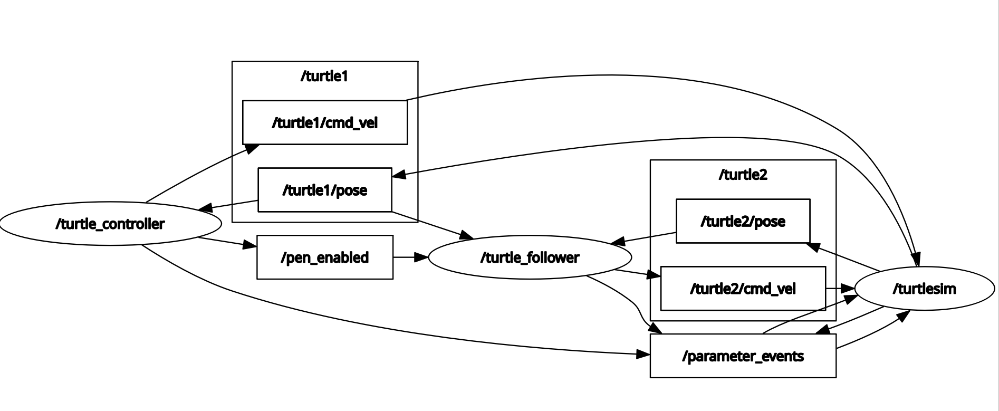
</p>

## 11. Comandos de inspección ROS 2
Para validar el funcionamiento de la arquitectura de la sección anterior se utilizaron diferentes comandos de inspección de ROS 2. Estos permiten verificar los nodos activos, los tópicos disponibles, el flujo de mensajes, los servicios registrados y la conexión entre publicadores y suscriptores.

Con esto se comprobó que los nodos desarrollados se están comunicando correctamente y que el sistema cumple con el diseño propuesto.

Antes de ejecutar los comandos de inspección, se debe cargar el entorno de ROS 2 y el workspace compilado:

```bash id="8b7mtb"
source /opt/ros/jazzy/setup.bash
source ~/ros2_jazzy/turtlesim_ws/install/setup.bash
```
Además de los otros 3 componentes del sistema, turtlesim_node, move_turtle y turtle_follower.

### 11.1 Lista de nodos activos
Con el comando "ros2 node list" podemos verificar los nodos activos dentro del sistema. En este caso aparecen el nodo /turtlesim, que corresponde al simulador; el nodo /turtle_controller, que gestiona el control manual, las figuras, las letras y el lápiz; y el nodo /turtle_follower, que implementa el sistema líder-seguidor.
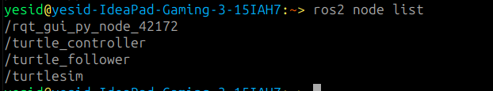
### 11.2. Lista de tópicos
Luego, con ros2 topic list, podemos observar los tópicos que permiten la comunicación entre los nodos. Los más importantes son los tópicos de velocidad, como /turtle1/cmd_vel y /turtle2/cmd_vel, y los tópicos de posición, como /turtle1/pose y /turtle2/pose.
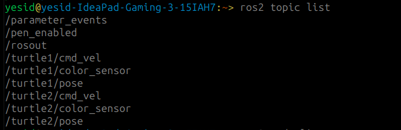
Los tópicos de velocidad se usan para enviar comandos de movimiento a cada tortuga, mientras que los tópicos de pose entregan información sobre la posición y orientación actual dentro del simulador.

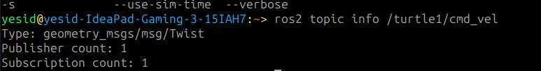
### 11.3. Lectura de poses en tiempo real

El comando ros2 topic echo permite visualizar los mensajes publicados en un tópico. Para verificar la pose de la tortuga líder se usa: ros2 topic echo /turtle1/pose

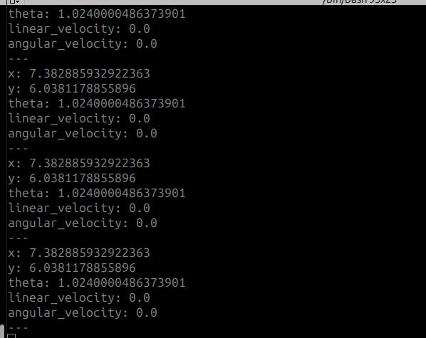

Para verificar la pose de la tortuga secundaria se usa: ros2 topic echo /turtle2/pose


Estos comandos permiten comprobar que el simulador publica continuamente la posición y orientación de cada tortuga. Durante el movimiento, los valores de x, y y theta cambian en tiempo real.

### 11.4. Lista de servicios
El comando ros2 service list permite visualizar los servicios disponibles en el sistema.
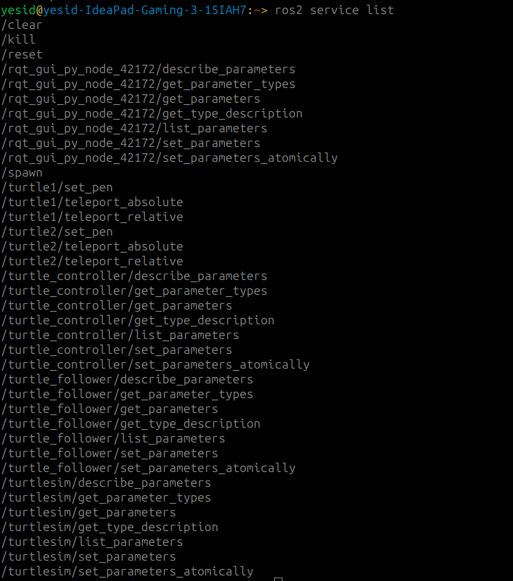

### 11.5. Visualización con rqt_graph
En el grafo se observa la arquitectura completa del sistema


## 12. Diagrama de flujo

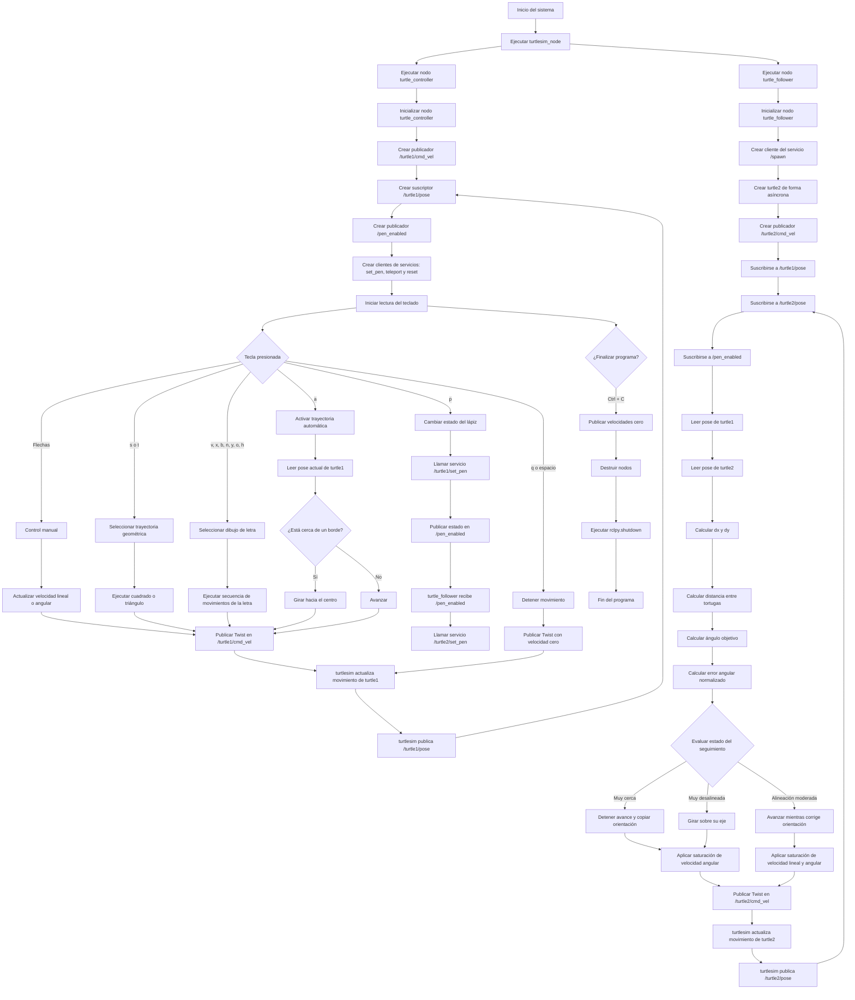
## 13. Evidencias de funcionamiento
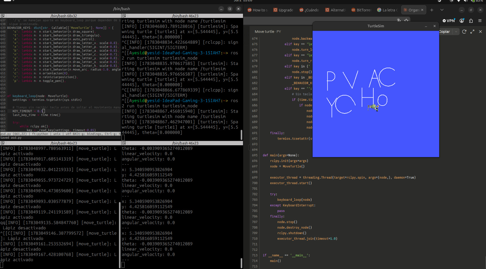
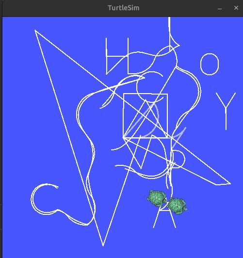
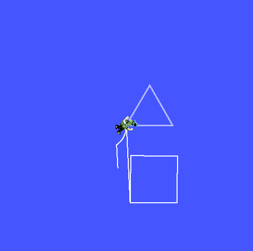

## 14. Video explicativo
[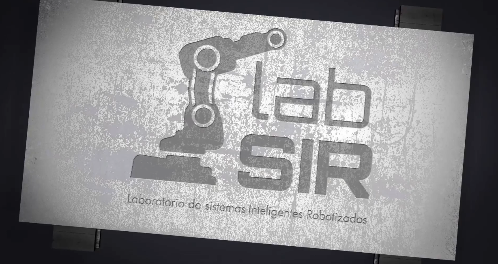](https://drive.google.com/file/d/1I7Jt4ODWYjsPJ_gddNJygFtL4aLLt2bq/view?usp=sharing)

## 15. Conclusiones
El laboratorio permitió desarrollar una arquitectura modular en ROS 2 Jazzy basada en dos nodos propios. El primero gestiona el control de la tortuga líder, incluyendo el movimiento manual, la ejecución de figuras, el dibujo de letras y el estado del lápiz. El segundo implementa el seguimiento automático de la tortuga secundaria, calculando la distancia y el error angular a partir de las poses disponibles, para generar los comandos de velocidad correspondientes.

El seguimiento se realizó mediante un controlador proporcional basado en distancia y error angular, incorporando saturaciones de velocidad para mejorar la estabilidad y evitar movimientos bruscos. Esta estrategia fue suficiente para el entorno simulado de turtlesim, ya que no se presentan dinámicas físicas complejas como fricción, inercia o cargas externas.

Además, se usaron servicios para crear tortugas, controlar el lápiz y teletransportar la posición, y se agregó un tópico auxiliar para sincronizar el lápiz entre ambos nodos. Finalmente, la arquitectura fue validada mediante comandos de inspección de ROS 2 y rqt_graph, confirmando la correcta comunicación entre nodos, tópicos y servicios.
