# Laboratorio No. 05 - Phantom X Pincher X100 – ROS 2 Jazzy – RViz
> En este laboratorio se implementa el control articular y cartesiano del robot Phantom X Pincher X100 mediante ROS 2 Jazzy. Se desarrollan procedimientos de calibración, determinación de límites, generación de trayectorias, cinemática directa, cinemática inversa, enseñanza de poses y ejecución de movimientos coordinados.
---
## Tabla de contenido

- [1. Descripción detallada de la solución planteada](#1-descripción-detallada-de-la-solución-planteada)
- [2. Objetivos](#2-objetivos)
- [3. Diagrama de flujo de las acciones del robot](#3-diagrama-de-flujo-de-las-acciones-del-robot)
- [4. Plano de planta](#4-plano-de-planta)
- [5. Actividad 1. Preparación del robot](#5-actividad-1-preparación-del-robot)
- [6. Actividad 2. Identificación de motores y articulaciones](#6-actividad-2-identificación-de-motores-y-articulaciones)
- [7. Actividad 3. Medición del robot](#7-actividad-3-medición-del-robot)
- [8. Actividad 4. Movimiento individual de articulaciones](#8-actividad-4-movimiento-individual-de-articulaciones)
- [9. Actividad 5. Calibración de cero y error articular](#9-actividad-5-calibración-de-cero-y-error-articular)
- [10. Actividad 6. Determinación de límites seguros](#10-actividad-6-determinación-de-límites-seguros)
- [11. Actividad 7. Movimiento simultáneo](#11-actividad-7-movimiento-simultáneo)
- [12. Actividad 8. Movimiento secuencial](#12-actividad-8-movimiento-secuencial)
- [13. Actividad 9. Interpolación de trayectorias](#13-actividad-9-interpolación-de-trayectorias)
- [14. Actividad 10. Trayectoria sinusoidal de una articulación](#14-actividad-10-trayectoria-sinusoidal-de-una-articulación)
- [15. Actividad 11. Cinemática directa](#15-actividad-11-cinemática-directa)
- [16. Actividad 12. Cinemática inversa](#16-actividad-12-cinemática-inversa)
- [17. Actividad 13. Enseñanza y repetición de poses](#17-actividad-13-enseñanza-y-repetición-de-poses)
- [18. Actividad 14. Trazado de una figura](#18-actividad-14-trazado-de-una-figura)
- [19. Actividad 15. Reto final: coreografía robótica](#19-actividad-15-reto-final-coreografía-robótica)
- [20. Conclusiones](#20-conclusiones)

---

## 1. Descripción de la solución planteada

## Descripción detallada de la solución planteada

La solución desarrollada consiste en un conjunto de nodos independientes
programados en Python y ROS 2 Jazzy para controlar y analizar el comportamiento
del robot Phantom X Pincher X100. Cada nodo corresponde a una actividad del
laboratorio, lo que permite ejecutar, verificar y documentar cada prueba de
forma independiente.

El control articular se realiza publicando configuraciones en el tópico
`/pincher/command`, mientras que la velocidad de los servomotores se configura
mediante `/pincher/profile_velocity`. Las posiciones reportadas por el robot se
obtienen desde `/joint_states`, lo que permite comparar las referencias
deseadas con las posiciones medidas y calcular los errores correspondientes.

Las rutinas siguen un procedimiento general:

1. Inicializar el nodo de ROS 2.
2. Verificar la comunicación con el robot.
3. Configurar la velocidad de movimiento.
4. Llevar el robot a una posición inicial segura.
5. Cargar las posiciones o trayectorias de la actividad.
6. Validar los límites articulares.
7. Ejecutar los movimientos.
8. Leer y registrar las posiciones alcanzadas.
9. Guardar los resultados y regresar a `HOME`.

La solución permite realizar movimientos individuales, simultáneos,
secuenciales e interpolados. También incluye la generación de trayectorias
sinusoidales, la implementación de la cinemática directa e inversa y el trazado
virtual de figuras mediante puntos cartesianos.

La cinemática directa calcula la posición y orientación del efector final a
partir de las variables articulares y compara los resultados con la
transformación publicada en RViz. Por su parte, la cinemática inversa calcula
las configuraciones de codo arriba y codo abajo, descarta las soluciones que
incumplen los límites y selecciona la alternativa válida más cercana a la
posición actual del robot.

Finalmente, los datos obtenidos se almacenan en archivos CSV y se generan
gráficas para analizar errores, tiempos de ejecución y seguimiento de
trayectorias. Esta organización modular facilita la validación de cada
actividad, la identificación de errores y la presentación ordenada de los
resultados.

## 2. Objetivos

### 2.1 Objetivo general

Controlar y modelar el robot Phantom X Pincher X100 utilizando ROS 2 Jazzy,
aplicando conceptos de movimiento articular, generación de trayectorias y
cinemática de manipuladores.

### 2.2 Objetivos específicos

- Identificar las articulaciones y los servomotores del robot.
- Determinar la geometría y los límites seguros del manipulador.
- Implementar movimientos individuales, simultáneos y secuenciales.
- Comparar métodos de interpolación de trayectorias.
- Implementar la cinemática directa e inversa.
- Programar tareas de enseñanza, repetición, trazado y coreografía.

## 3. Diagrama de flujo de las acciones del robot

El siguiente diagrama representa el procedimiento general utilizado para
ejecutar las rutinas del laboratorio. Aunque cada actividad cuenta con un nodo
independiente, todas siguen un proceso común de inicialización, validación,
ejecución, adquisición de datos y retorno a una posición segura.

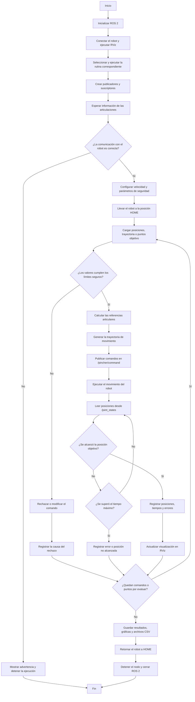
```mermaid
flowchart TD
    A["Inicio"] --> B["Inicializar ROS 2"]
    B --> C["Conectar el robot y ejecutar RViz"]
    C --> D["Seleccionar y ejecutar la rutina correspondiente"]
    D --> E["Crear publicadores y suscriptores"]
    E --> F["Esperar información de las articulaciones"]

    F --> G{"¿La comunicación con el robot es correcta?"}

    G -->|No| H["Mostrar advertencia y detener la ejecución"]
    H --> Z["Fin"]

    G -->|Sí| I["Configurar velocidad y parámetros de seguridad"]
    I --> J["Llevar el robot a la posición HOME"]
    J --> K["Cargar posiciones, trayectoria o puntos objetivo"]

    K --> L{"¿Los valores cumplen los límites seguros?"}

    L -->|No| M["Rechazar o modificar el comando"]
    M --> N["Registrar la causa del rechazo"]
    N --> Y{"¿Quedan comandos o puntos por evaluar?"}

    L -->|Sí| O["Calcular las referencias articulares"]
    O --> P["Generar la trayectoria de movimiento"]
    P --> Q["Publicar comandos en /pincher/command"]
    Q --> R["Ejecutar el movimiento del robot"]
    R --> S["Leer posiciones desde /joint_states"]

    S --> T{"¿Se alcanzó la posición objetivo?"}

    T -->|No| U{"¿Se superó el tiempo máximo?"}
    U -->|No| S
    U -->|Sí| V["Registrar error o posición no alcanzada"]
    V --> Y

    T -->|Sí| W["Registrar posiciones, tiempos y errores"]
    W --> X["Actualizar visualización en RViz"]
    X --> Y

    Y -->|Sí| K
    Y -->|No| AA["Guardar resultados, gráficas y archivos CSV"]
    AA --> AB["Retornar el robot a HOME"]
    AB --> AC["Detener el nodo y cerrar ROS 2"]
    AC --> Z
```

## 4. Plano de planta
Se tomó el plano directamente de la página de [PincherX](https://docs.trossenrobotics.com/interbotix_xsarms_docs/specifications/px100.html)
<p align="center">
  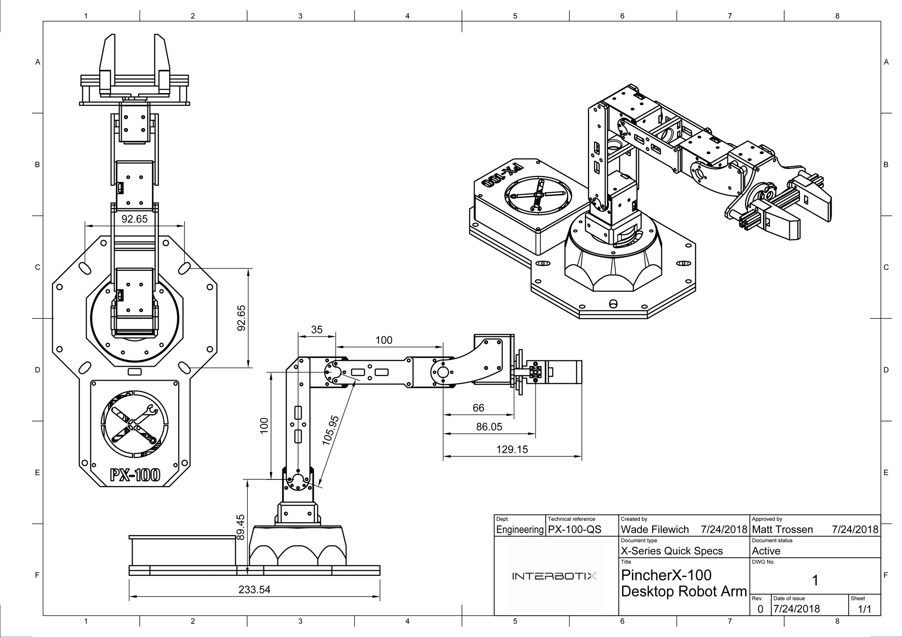
</p>

## 5. Actividad 1. Preparación del robot
Para asegurarse de la correcta operación del robot, se ubicó en una zona libre de obstaculos, y se probó cada motor con el software de dynamixel proveido por el profesor.
<p align="center">
  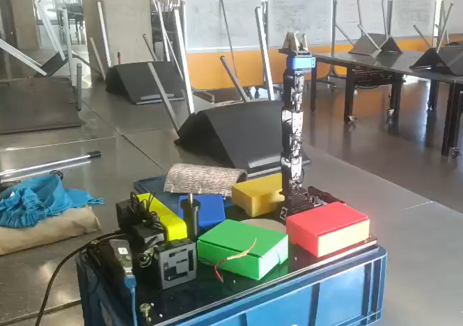
</p>

## 6. Actividad 2. Identificación de motores y articulaciones
Para esta actividad se usó el software de pruebas de dynamixel ya mencionado previamente:
<p align="center">
  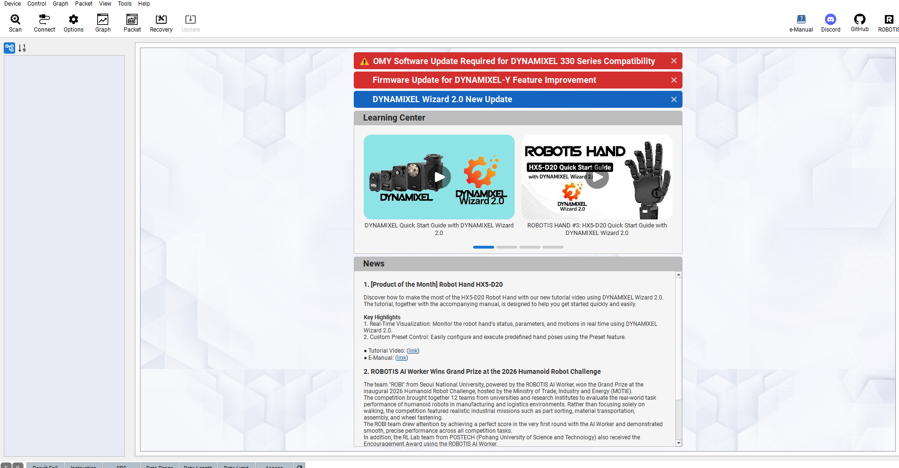
</p>

## 7. Actividad 3. Medición del robot

<p align="center">
  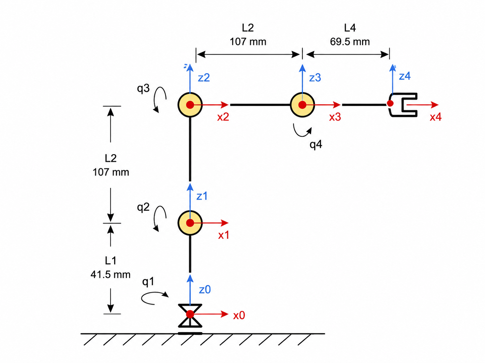
</p>

## 8. Actividad 4. Movimiento individual de articulaciones

Para dar cumplimiento a esta actividad, se desarrolló una interfaz gráfica personalizada utilizando la biblioteca `tkinter` de Python. El objetivo de este programa es permitir al usuario aislar el movimiento del robot, seleccionando una única articulación a la vez y enviándole una posición angular específica, garantizando que los demás motores permanezcan en su estado actual.

El desarrollo se estructuró mediante el paradigma de programación orientada a objetos, dividiendo el programa en dos clases principales: `PincherNode` (encargada de la comunicación con ROS 2) e `Interface` (encargada de la interacción con el usuario y la validación de datos).

[Ver código fuente de la Actividad 4](./Codes/interfazpunto4.py)

### 8.1. Arquitectura del Nodo de ROS 2 (`PincherNode`)

Se creó el nodo `punto4_gui` el cual establece la comunicación con el controlador principal del robot (`pincher_controller`). Sus funciones principales son:

- **Publicación de comandos:** A través del método `send_joint()`, el nodo recibe el nombre de una sola articulación y su valor en grados. Construye un mensaje de tipo `sensor_msgs/msg/JointState` asignando **únicamente** la articulación seleccionada en el arreglo `msg.name` y convierte el ángulo a radianes para poblar `msg.position`. Este mensaje es publicado en el tópico `/pincher/command`.
- **Publicación de velocidad:** Mediante el tópico `/pincher/profile_velocity` (mensaje de tipo `UInt32`), permite ajustar dinámicamente la velocidad del perfil de movimiento de los servomotores.
- **Clientes de servicio:** El nodo instancia clientes para los servicios `/pincher/home`, `/pincher/software_stop` y `/pincher/torque_enable`, permitiendo acceder a las funciones de seguridad y referenciación del robot desde la misma ventana.

### 8.2. Lógica de la Interfaz Gráfica (`Interface`)

La clase `Interface` construye la ventana de usuario y gestiona el bucle de eventos. Sus características más destacadas son:

- **Selección restrictiva:** Utiliza un menú desplegable (`ttk.Combobox`) configurado en modo *"readonly"*, el cual se puebla automáticamente con las llaves del diccionario `JOINT_LIMITS` (`waist`, `shoulder`, `elbow`, `wrist`, `gripper`). Esto evita errores de digitación por parte del usuario.
- **Validación de límites seguros:** Antes de invocar el método de envío del nodo, el valor ingresado en la caja de texto es evaluado contra los límites definidos en la Actividad 6. Si la posición excede el rango permitido para esa articulación específica, se bloquea el envío y se despliega una ventana emergente de advertencia (`messagebox.showwarning`).
- **Integración de bucles (Spinning):** Para evitar que la interfaz gráfica se congele mientras ROS 2 escucha los tópicos de estado, se utilizó el método `self.root.after()`. Este método ejecuta `rclpy.spin_once()` cada 20 milisegundos, permitiendo que las devoluciones de llamada (*callbacks*) de ROS 2 operen armónicamente dentro del *mainloop* de Tkinter.

### 8.3. Interfaz de usuario

A continuación se presenta la interfaz gráfica desarrollada para el movimiento individual:

<p align="center">
  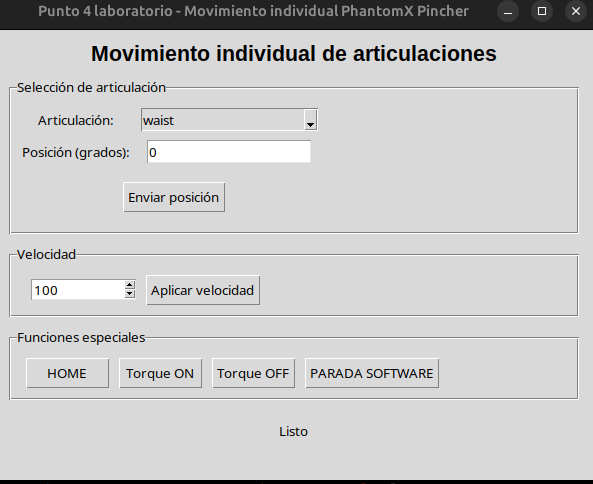
</p>


## 9. Actividad 5. Calibración de cero y error articular
En esta actividad se obtuvo el error de posicionamiento de cada articulación del robot Phantom X
Pincher X100 mediante la comparación entre la posición angular solicitada y la
posición reportada por los servomotores DYNAMIXEL.

A partir de las mediciones se determinaron: El error articular para cada posición, el error máximo absoluto, el error promedio con signo, el desplazamiento de cero sugerido para cada articulación, la correspondencia entre las posiciones deseadas y medidas.

Para realizar la calibración se desarrolló el nodo de ROS 2
`actividad5_calibracion`que utiliza los siguientes tópicos:

| Tópico | Tipo de mensaje | Función |
|---|---|---|
| `/pincher/command` | `sensor_msgs/msg/JointState` | Envío de posiciones articulares al robot |
| `/pincher/profile_velocity` | `std_msgs/msg/UInt32` | Configuración de la velocidad de los servomotores |
| `/joint_states` | `sensor_msgs/msg/JointState` | Lectura de las posiciones reportadas por el robot |

Para cada prueba, el programa construye un mensaje `JointState` con las
posiciones deseadas expresadas inicialmente en grados. Antes de publicar el
comando, los valores se convierten a radianes, debido a que esta es la unidad
empleada por los mensajes de ROS 2.

La posición reportada en `/joint_states` se convierte nuevamente de radianes a
grados para realizar la comparación.

[Ver código fuente de la Actividad 5](./Codes/actividad5_calibracion.py)

### 9.1. Procedimiento experimental
El procedimiento que se hizo en la actividad fue:

1. Configurar la velocidad de movimiento del robot en un valor de `30`.
2. Llevar todas las articulaciones a la posición de referencia `HOME`.
3. Seleccionar una articulación.
4. Enviar cinco posiciones distribuidas dentro de su rango seguro.
5. Mantener las demás articulaciones en la posición de referencia.
6. Esperar cuatro segundos después de cada comando para permitir que el robot
   alcanzara una condición estable.
7. Leer la posición reportada mediante el tópico `/joint_states`.
8. Calcular el error articular.
9. Guardar los resultados en un archivo CSV.
10. Regresar a `HOME` antes de iniciar las pruebas de la siguiente articulación.
11. Generar una gráfica de posición deseada y medida para cada articulación.
12. Finalizar la rutina llevando nuevamente el robot a `HOME`.

Cada comando se publicó cinco veces consecutivas para aumentar la probabilidad
de recepción por parte del controlador.

### 9.2. Posiciones evaluadas
| Articulación | Prueba 1 | Prueba 2 | Prueba 3 | Prueba 4 | Prueba 5 |
|---|---:|---:|---:|---:|---:|
| Base (`waist`) | -60° | -15° | 0° | 25° | 70° |
| Hombro (`shoulder`) | -40° | -25° | 0° | 15° | 60° |
| Codo (`elbow`) | -75° | -30.5° | 0° | 22.5° | 55° |
| Muñeca (`wrist`) | -35° | -15° | 0° | 20° | 75° |
| Pinza (`gripper`) | 3° | 10.5° | 15° | 24.5° | 55° |

Durante cada grupo de pruebas solamente se modificó la articulación evaluada.
Las demás articulaciones permanecieron en `0°`.

### 9.3. Cálculo del error articular

Para cada posición evaluada, el error articular se calculó mediante:

```math
e_{q,i}
=
q_{\text{deseado},i}
-
q_{\text{medido},i}
```

donde:

- $q_{\text{deseado},i}$ es la posición enviada al controlador en la prueba $i$.
- $q_{\text{medido},i}$ es la posición reportada por el servomotor.
- $e_{q,i}$ es el error articular obtenido en la prueba $i$.

De acuerdo con esta convención de signos:

- Un error positivo indica que la posición medida fue menor que la posición deseada.
- Un error negativo indica que la articulación superó la posición solicitada.
- Un error igual a cero indica que la posición medida coincide con la referencia.

El error máximo absoluto se calculó como:

```math
e_{\max}
=
\max_i
\left|
e_{q,i}
\right|
```

Esta métrica representa la mayor desviación registrada, independientemente de su signo.

El error promedio con signo se calculó mediante:

```math
\overline{e_q}
=
\frac{1}{N}
\sum_{i=1}^{N}
e_{q,i}
```

donde $N$ corresponde al número total de posiciones evaluadas para la articulación.

Para esta implementación, el desplazamiento de cero se estimó como la componente constante promedio del error:

```math
\Delta q_0
=
\overline{e_q}
```

Por lo tanto, una posible compensación del comando articular puede plantearse como:

```math
q_{\text{comando corregido}}
=
q_{\text{deseado}}
+
\Delta q_0
```

Esta compensación permite ajustar el comando enviado al servomotor con base en el error sistemático promedio observado durante las pruebas de calibración.

### 9.4. Resultados obtenidos
Los resultados completos de las 25 pruebas pueden consultarse en:

- [Datos completos de calibración](./Resultados_Actividades/Actividad5/actividad5_calibracion.csv)
- [Resumen de errores](./Resultados_Actividades/Actividad5/actividad5_resumen.csv)

En base a estos se pueden observar los siguientes análisis:

#### Base

La articulación de la base presentó un error máximo absoluto de aproximadamente
`0.660°` y un error promedio de `0.070°`.

La cercanía del error promedio a cero indica que no existe un desplazamiento
constante significativo. Sin embargo, se presentaron pequeñas variaciones
positivas y negativas dependiendo de la posición evaluada.

La mayor diferencia se registró en el comando de `25°`, para el cual se obtuvo
una posición medida cercana a `24.34°`.

#### Hombro

El hombro presentó un error máximo absoluto de aproximadamente `2.170°`, siendo
uno de los errores más altos de la prueba.

Aunque el error promedio fue solamente de `0.065°`, este valor reducido se debe
a la compensación entre errores positivos y negativos. Por esta razón, el error
promedio no representa completamente la variación observada en esta
articulación.

La mayor diferencia ocurrió en la posición deseada de `60°`, donde el
servomotor reportó aproximadamente `62.17°`.

#### Codo

El codo presentó el mayor error máximo absoluto, con un valor aproximado de
`2.566°`.

El error promedio fue de `-0.732°`, lo que indica que, en promedio, la posición
reportada por esta articulación fue superior a la posición solicitada.

La mayor diferencia ocurrió en la posición deseada de `-75°`, para la cual se
registró una posición cercana a `-72.43°`.

De acuerdo con el criterio utilizado, se sugiere un desplazamiento de cero de
aproximadamente `-0.732°`.

#### Muñeca

La muñeca presentó el menor error máximo absoluto de todas las articulaciones,
con aproximadamente `0.396°`.

Además, las curvas de posición deseada y medida permanecieron prácticamente
superpuestas durante las cinco pruebas. El error promedio de `-0.208°` indica
una pequeña tendencia a superar la posición solicitada.

#### Pinza

La pinza presentó un error máximo absoluto de aproximadamente `0.630°` y un
error promedio positivo de `0.486°`.

Todos los errores registrados fueron positivos, lo cual indica una tendencia
sistemática de la posición medida a permanecer ligeramente por debajo de la
posición deseada.

Por esta razón, la pinza es la articulación que muestra con mayor claridad un
posible desplazamiento constante de cero.

### 9.5. Gráficas de calibración

Las siguientes gráficas comparan las posiciones deseadas y las posiciones
medidas después de permitir que cada articulación alcanzara una condición
estable.

#### Base

<p align="center">
  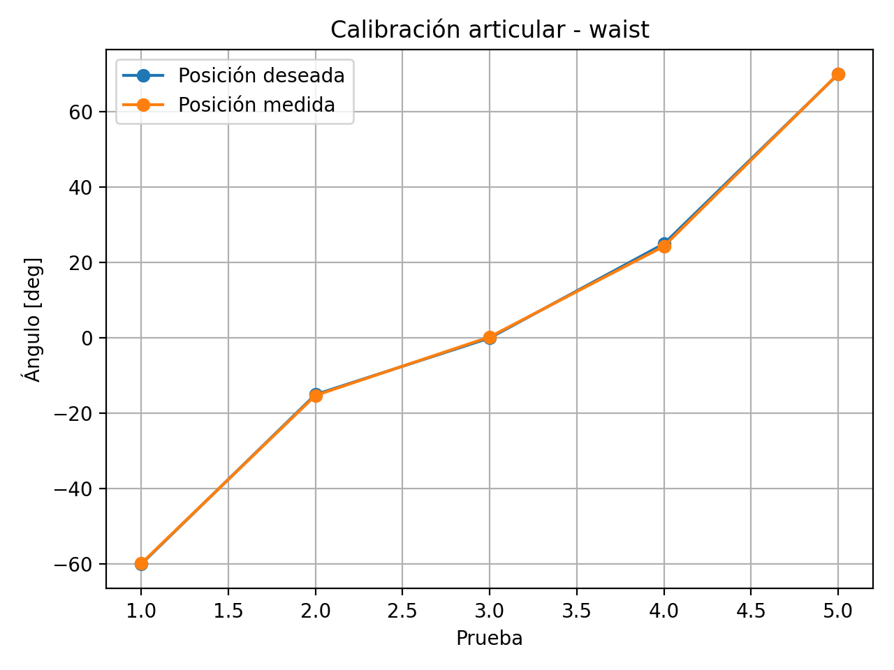
</p>

La posición medida sigue de manera cercana la referencia en todo el rango
evaluado. Las diferencias entre ambas curvas son inferiores a un grado.

#### Hombro

<p align="center">
  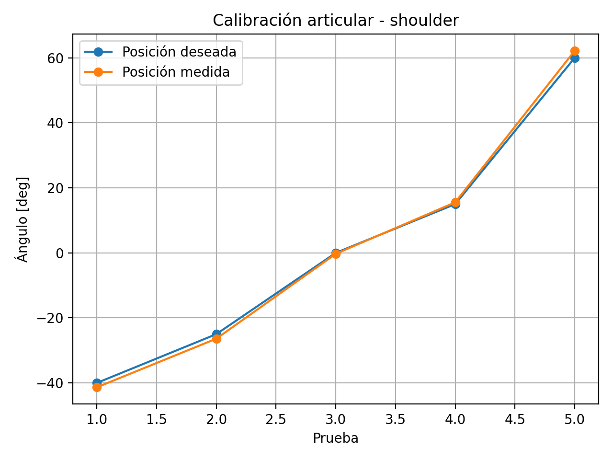
</p>

La articulación sigue correctamente la tendencia de la referencia, aunque
presenta una diferencia mayor en los extremos del rango evaluado,
particularmente en `60°`.

#### Codo

<p align="center">
  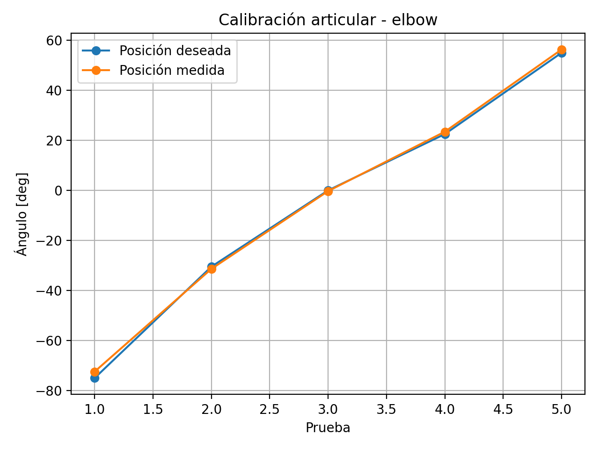
</p>

Las dos curvas presentan un comportamiento similar. No obstante, el codo
registra las diferencias más grandes de la prueba, especialmente en las
posiciones negativas de mayor amplitud.

#### Muñeca

<p align="center">
  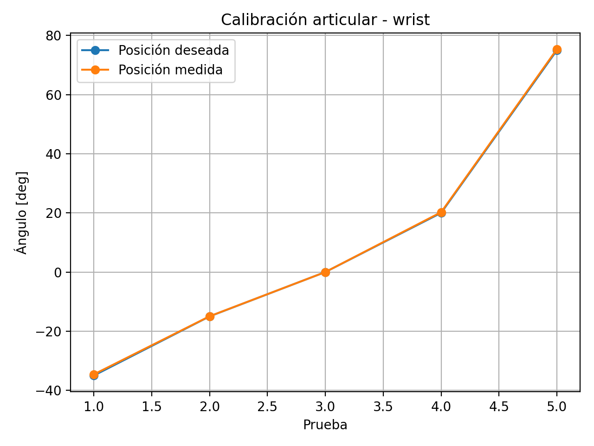
</p>

La posición deseada y la posición medida permanecen prácticamente
superpuestas, confirmando que la muñeca presentó el menor error máximo de las
articulaciones evaluadas.

#### Pinza

<p align="center">
  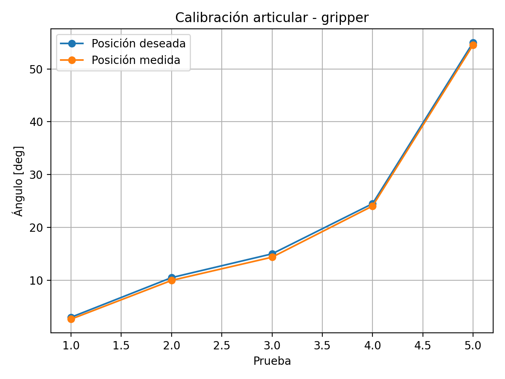
</p>

La posición medida conserva la forma de la referencia, pero permanece
ligeramente por debajo de la posición deseada en las cinco pruebas. Este
comportamiento es consistente con el error promedio positivo obtenido.

### 9.6. Videos de implementación y simulación

El funcionamiento del sistema y la ejecución de la rutina sobre el robot físico se presentan en el siguiente video:
- [Video de simulación actividad 5](https://drive.google.com/file/d/1EbKl_TOIXgzQG85vIAY_odGgw22aQ_B7/view?usp=drive_link)
- [Video de implementación actividad 5](https://drive.google.com/file/d/1FbLVwYQIVazOJA2WrkdWcB_NfD9oWBkW/view?usp=drive_link)

## 10. Actividad 6. Determinación de límites seguros

En esta actividad se determinaron experimentalmente los límites articulares seguros para el robot Phantom X Pincher X100. El objetivo principal de establecer estos límites es evitar colisiones con el propio cuerpo del robot o el entorno, prevenir el estrangulamiento del cableado y evitar daños mecánicos en los servomotores debido al esfuerzo excesivo. 

Para realizar esta tarea, se deshabilitó el torque de los motores y se llevó manualmente cada articulación hacia sus topes mecánicos. Una vez identificados los límites físicos, se aplicó un margen de reducción para obtener los límites seguros, teniendo en cuenta la carga inercial y los posibles sobreimpulsos (*overshoots*) generados por el controlador interno del servomotor al realizar movimientos rápidos.

### 10.1. Análisis por articulación

- **Base (`waist`):** La articulación de la base permite un rango de movimiento físico bastante amplio. Durante las pruebas, se verificó el rango operativo estándar de `-150°` a `150°`. El robot logra alcanzar estas posiciones sin riesgo de colisión, por lo que se mantienen como los límites seguros.
- **Hombro (`shoulder`):** Para evaluar esta articulación de forma segura, se ubicó la base en la posición más conveniente para permitir el mayor rango de movimiento libre. Se observó que el tope mecánico inferior se encuentra en aproximadamente `-112°` (punto donde colisiona contra el borde más cercano de la canasta o base) y el superior en `112°`. Sin embargo, debido a que esta articulación soporta todo el peso del brazo y es propensa a *overshoots*, se definió un límite seguro conservador de `-100°` a `100°`.
- **Codo (`elbow`):** Partiendo desde la posición de referencia (`HOME`), donde el codo tiene su mayor margen de movilidad, se determinó que la articulación alcanza los `130°` de forma segura. El límite mecánico real es ligeramente superior, pero debido a la cercanía y tensión de los cables de conexión, sumado al riesgo de *overshoot*, el límite por software se restringió a `-120°` y `120°`.
- **Muñeca (`wrist`):** Desplazando la muñeca sin torque, se encontró que el tope mecánico se ubica cerca de los `103°`. Dado que en esta articulación el efecto del sobreimpulso es mucho menor por tener menos carga inercial en el extremo, se definió un límite seguro de `-95°` a `95°`.
- **Pinza (`gripper`):** En el movimiento de apertura máxima, la pinza alcanza los `90°` sin presentar problemas de sobreimpulso. Por otro lado, para el movimiento de cierre, se definió un límite seguro de `-80°`; esto con el propósito estricto de evitar que los servomotores generen un esfuerzo o torque continuo excesivo al presionar fuertemente las piezas mecánicas entre sí.

### 10.2. Tabla resumen de límites

A continuación se presenta el cuadro consolidado con los límites físicos y los límites de seguridad definidos para la operación del manipulador.

| Articulación | Límite inferior | Límite superior | Margen de seguridad aplicado |
|---|:---:|:---:|---|
| Base (`waist`) | -150° | 150° | 0° (Rango operativo normal) |
| Hombro (`shoulder`) | -100° | 100° | ~12° (Prevención de colisión y *overshoot*) |
| Codo (`elbow`) | -120° | 120° | ~10° (Prevención de cables y *overshoot*) |
| Muñeca (`wrist`) | -95° | 95° | ~8° |
| Pinza (`gripper`) | -80° | 90° | 10° en cierre / 0° en apertura |

Como criterio de operación segura, cualquier nodo de control (como `actividad7_simultaneo` o `actividad8_comparacion`) y la propia interfaz gráfica, deben estructurarse de modo que saturen o rechacen cualquier comando de posición que se encuentre por fuera de estos rangos antes de ser transmitido por puerto serial a través de *DynamixelSDK*.


## 11. Actividad 7. Movimiento simultáneo
Se implementó el movimiento simultáneo de las cinco articulaciones del robot enviando configuraciones articulares completas en un único mensaje de comando. De esta manera se comprobó que la base, el hombro, el codo, la muñeca y la pinza pueden desplazarse de forma coordinada desde una configuración inicial
hasta una configuración final, respetando condiciones seguras de velocidad y
posición.

### 11.1. Desarrollo de la actividad
Para desarrollar esta actividad se creó el nodo de ROS 2
`actividad7_simultaneo`, este publica las posiciones deseadas de las cinco articulaciones en el tópico
`/pincher/command`. Todas las referencias se incluyen dentro de un único mensaje
`sensor_msgs/msg/JointState`, por lo que el controlador recibe simultáneamente
la configuración completa del manipulador.

Adicionalmente, se publica un valor de velocidad en el tópico
`/pincher/profile_velocity` antes de iniciar la secuencia.

| Tópico | Tipo de mensaje | Función |
|---|---|---|
| `/pincher/command` | `sensor_msgs/msg/JointState` | Envío simultáneo de las posiciones articulares |
| `/pincher/profile_velocity` | `std_msgs/msg/UInt32` | Configuración de la velocidad de movimiento |

[Ver código fuente de la Actividad 7](./Codes/actividad5_calibracion.py)

### 11.2. Configuraciones ejecutadas

Las cinco configuraciones solicitadas fueron almacenadas en la variable
`CONFIGS`.

| Configuración | Base [°] | Hombro [°] | Codo [°] | Muñeca [°] | Pinza [°] |
|---:|---:|---:|---:|---:|---:|
| 1 | 0 | 0 | 0 | 0 | 0 |
| 2 | 25 | 25 | 20 | -20 | 0 |
| 3 | -35 | 35 | -30 | 30 | 0 |
| 4 | 85 | -20 | 55 | 25 | 0 |
| 5 | 80 | -35 | 55 | -45 | 0 |

La primera configuración corresponde a la posición de referencia o `HOME`.

### 11.3. Envío simultáneo de las referencias

El movimiento se considera simultáneo porque las posiciones objetivo de las
cinco articulaciones se incluyen en un único mensaje:

```python
msg.name = JOINTS
msg.position = [math.radians(q) for q in config_scaled]
```

El controlador recibe el vector articular completo, de esta forma, las articulaciones no reciben comandos independientes y secuenciales, sino que comienzan a desplazarse hacia sus respectivas referencias durante el mismo intervalo de movimiento.

El envío simultáneo no implica necesariamente que todas las articulaciones terminen exactamente al mismo tiempo. El instante de llegada depende de la distancia angular recorrida, la velocidad configurada y el comportamiento interno de cada servomotor.

### 11.4. Velocidad de movimiento

Para evitar movimientos bruscos durante la prueba sobre el robot real, se
configuró una velocidad de perfil de:

```python
PROFILE_VELOCITY = 20
```

El valor se publica cinco veces antes de iniciar la secuencia:

```python
for _ in range(5):
    self.speed_pub.publish(msg)
    time.sleep(0.1)
```

Esto aumenta la probabilidad de que el controlador reciba
correctamente la velocidad antes de ejecutar los movimientos.


### 11.5. Secuencia de ejecución

La rutina realiza el siguiente procedimiento:

1. Inicializa el nodo `actividad7_simultaneo`.
2. Crea los publicadores de posición y velocidad.
3. Configura la velocidad de perfil en `20`.
4. Lleva el robot a la posición inicial `HOME`.
5. Ejecuta la configuración 1.
6. Ejecuta la configuración 2.
7. Ejecuta la configuración 3.
8. Ejecuta la configuración 4.
9. Ejecuta la configuración 5.
10. Retorna el robot a la posición `HOME`.
11. Finaliza la rutina.

Entre configuraciones se utilizó un tiempo de espera de:

```python
HOLD_TIME = 4.0
```

Este intervalo permite que el robot alcance y mantenga cada pose antes de
recibir el siguiente comando.

Cada configuración se publica cinco veces con una separación de `0.05 s`:

```python
for _ in range(5):
    self.cmd_pub.publish(msg)
    time.sleep(0.05)
```
### 11.6. Videos de implementación y simulación

El funcionamiento del sistema y la ejecución de la rutina sobre el robot físico se presentan en el siguiente video:
- [Video de simulación actividad 7](https://drive.google.com/file/d/1Vbg4IgPvELY8GfibhWnVjwBo6rHylynm/view?usp=drive_link)
- [Video de implementación actividad 7](https://drive.google.com/file/d/1qEF8NnzvFOj5EtcBdsku9txTD8m9fmXe/view?usp=drive_link)

## 12. Actividad 8. Movimiento secuencial
Se debía ejecutar una configuración articular mediante dos estrategias de movimiento: Movimiento secuencial y simultáneo.

Posteriormente, comparar ambas estrategias en términos de:

- Tiempo total de ejecución.
- Trayectoria seguida por el TCP.
- Suavidad del movimiento.
- Error articular al alcanzar la configuración final.

### 12.1. Descripción de la implementación

Para desarrollar la actividad se implementó el nodo de ROS 2
`actividad8_comparacion` que permite:
- Enviar posiciones articulares al robot.
- Configurar la velocidad de los servomotores.
- Leer las posiciones medidas desde `/joint_states`.
- Detectar cuándo el robot alcanza una configuración.
- Medir el tiempo de cada movimiento.
- Comparar la estrategia secuencial con la simultánea.
- Guardar los resultados en archivos CSV y TXT.
- Generar gráficas comparativas.

Los tópicos utilizados fueron:

| Tópico | Tipo de mensaje | Función |
|---|---|---|
| `/pincher/command` | `sensor_msgs/msg/JointState` | Envío de posiciones articulares |
| `/pincher/profile_velocity` | `std_msgs/msg/UInt32` | Configuración de la velocidad de movimiento |
| `/joint_states` | `sensor_msgs/msg/JointState` | Lectura de las posiciones medidas |

[Ver código fuente de la Actividad 8](./Codes/actividad8_secuencial.py)

Se escogió hacer la configuración

| Articulación | Posición objetivo [°] |
|---|---:|
| Base (`waist`) | 25 |
| Hombro (`shoulder`) | 25 |
| Codo (`elbow`) | 20 |
| Muñeca (`wrist`) | -20 |
| Pinza (`gripper`) | 0 |

Tanto la prueba secuencial como la simultánea se iniciaron desde la posición de
referencia HOME

### 12.2. Parámetros de la prueba

Para realizar una comparación bajo las mismas condiciones se utilizaron los
siguientes parámetros para las dos pruebas:

| Parámetro | Valor |
|---|---:|
| Velocidad de perfil | 20 |
| Tolerancia de llegada | 2° |
| Tiempo máximo de espera | 15 s |
| Pausa entre pruebas | 2 s |
| Número de muestras estables requeridas | 5 |

La condición utilizada para determinar que una pose fue alcanzada fue:
```math
\max_i
\left|
q_{d,i}-q_{m,i}
\right|
\leq 2^\circ
```

- $q_{\text{d,i}}$ es la posición enviada al controlador en la prueba $i$.
- $q_{\text{m,i}}$ es la posición reportada por el servomotor.
- ${2^\circ}$ es el error articular obtenido en la prueba $i$.

### 12.3. Movimiento secuencial
En el movimiento secuencial las articulaciones se desplazaron una después de
otra, siguiendo el orden indicado: Base, hombro,codo, muñeca, pinza.

Se inicia con todas las articulaciones en `HOME`. Después de mover cada articulación, esperó hasta que la configuración parcial estuviera dentro de la tolerancia antes de continuar con el siguiente paso.

Las configuraciones parciales ejecutadas fueron:

| Paso | Articulación modificada | Configuración enviada [°] |
|---:|---|---|
| 1 | Base | `[25, 0, 0, 0, 0]` |
| 2 | Hombro | `[25, 25, 0, 0, 0]` |
| 3 | Codo | `[25, 25, 20, 0, 0]` |
| 4 | Muñeca | `[25, 25, 20, -20, 0]` |
| 5 | Pinza | `[25, 25, 20, -20, 0]` |

### 12.4. Movimiento simultáneo
Para realizar una comparación equivalente, el robot regresó primero a la
posición `HOME`.

Posteriormente, las cinco posiciones objetivo se enviaron dentro de un único
mensaje `JointState` como fue explicado en la sección anterior.

### 12.5. Resultados de tiempo

Los tiempos obtenidos fueron:

<p align="center">
  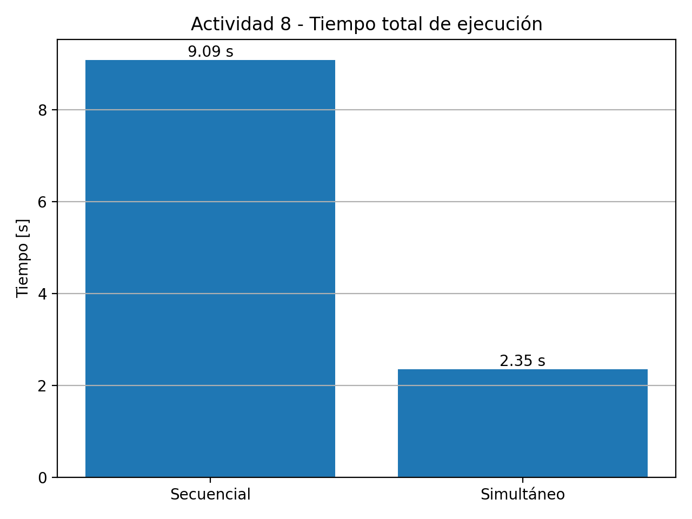
</p>


La relación entre ambos tiempos fue:
```math
\frac{t_{\mathrm{secuencial}}}
{t_{\mathrm{simultáneo}}}
=
\frac{9.087}{2.349}
=
3.868
```

Por lo tanto, el movimiento secuencial tardó aproximadamente `3.87` veces el
tiempo requerido por el movimiento simultáneo.

La reducción de tiempo obtenida mediante el movimiento simultáneo fue:

```math
\Delta t
=
9.087-2.349
=
6.738\ \mathrm{s}
```
Los resultados muestran que el movimiento simultáneo es más eficiente cuando el objetivo es alcanzar una configuración articular completa en el menor tiempo posible.

### 12.6. Tiempo por paso del movimiento secuencial

Los tiempos medidos para cada paso fueron:

<p align="center">
  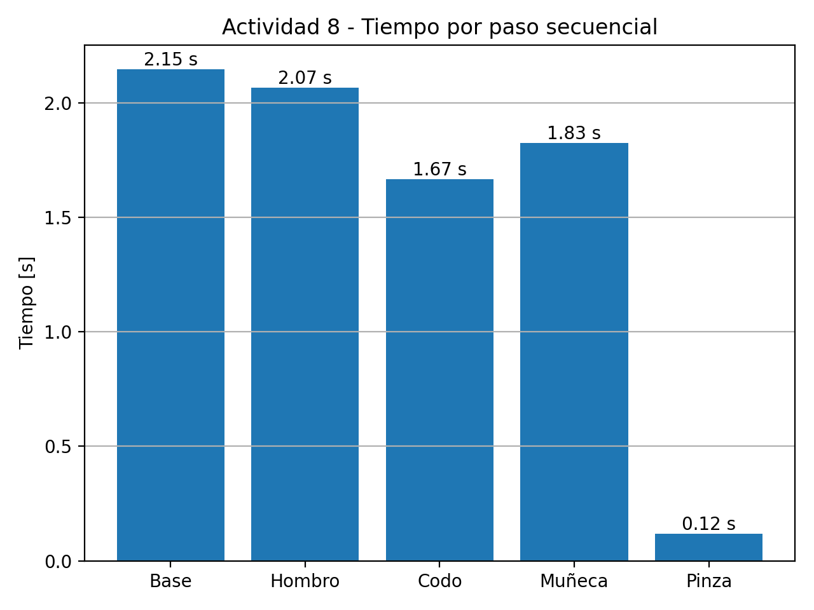
</p>

La base presentó el mayor tiempo de desplazamiento, seguida por el hombro y la
muñeca.

La pinza registró un tiempo considerablemente menor porque su posición inicial
y final era `0°`, por lo que no fue necesario realizar un desplazamiento
angular significativo.

La suma de los tiempos de llegada de cada articulación es menor que el tiempo
total secuencial. Esto ocurre porque el tiempo total también incluye el proceso
de publicación repetida de cada comando y la ejecución interna entre los pasos.

### 12.7. Posición final medida

Al finalizar las pruebas se obtuvo la siguiente configuración medida:

| Articulación | Posición deseada [°] | Posición medida [°] | Error \(q_d-q_m\) [°] |
|---|---:|---:|---:|
| Base | 25.000 | 24.340 | 0.660 |
| Hombro | 25.000 | 26.100 | -1.100 |
| Codo | 20.000 | 20.528 | -0.528 |
| Muñeca | -20.000 | -19.355 | -0.645 |
| Pinza | 0.000 | 0.000 | 0.000 |

El error máximo absoluto en la configuración final fue:

```math
e_{\max}
=
\max_i
\left|
q_{d,i}-q_{m,i}
\right|
\]

\[
e_{\max}
\approx
1.100^\circ
\]
```

El error máximo se presentó en la articulación del hombro. Sin embargo, todas
las articulaciones permanecieron dentro de la tolerancia de `2°`, por lo que la
pose fue considerada alcanzada correctamente.

### 12.8. Comparación de la trayectoria del TCP

#### Movimiento secuencial

En el movimiento secuencial la pose del robot cambia en cinco etapas. Cada
articulación modifica la posición y orientación de los eslabones restantes, por
lo que el TCP sigue una trayectoria compuesta por varios tramos.

De manera conceptual, la trayectoria puede representarse como:

```math
\mathbf{p}_0
\rightarrow
\mathbf{p}_1
\rightarrow
\mathbf{p}_2
\rightarrow
\mathbf{p}_3
\rightarrow
\mathbf{p}_4
\rightarrow
\mathbf{p}_5
```

Cada punto representa la posición del TCP después de mover una articulación.

#### Movimiento simultáneo

En el movimiento simultáneo todas las variables articulares cambian durante el
mismo intervalo. Esto genera una trayectoria más compacta y continua entre la
posición inicial y la final.

Sin embargo, esta trayectoria no necesariamente corresponde a una línea recta
en el espacio cartesiano, ya que el comando se define en el espacio articular y
no mediante una interpolación cartesiana del TCP.

### 12.9. Comparación de la suavidad

El movimiento secuencial presentó transiciones diferenciadas entre cada
articulación. Después de completar un paso, el robot permaneció momentáneamente
estable antes de iniciar el siguiente.

Esto produjo:

- Cambios sucesivos en la dirección del TCP.
- Una trayectoria dividida en etapas.
- Pausas entre movimientos.
- Mayor tiempo total de ejecución.

En el movimiento simultáneo las articulaciones comenzaron a desplazarse de forma coordinada, lo que produjo una transición visualmente más continua entre la posición inicial y la final. Tambien se tiene en cuenta que la suavidad depende del perfil interno de velocidad de los servomotores.

- [Resumen de resultados de la implementación](./Resultados_Actividades/Actividad8/actividad8_resumen.txt)
- [Datos completos de la implementación](./Resultados_Actividades/Actividad8/actividad8_comparacion.csv)

### 12.10. Videos de simulación e implementación.
El funcionamiento del sistema y la ejecución de la rutina sobre el robot físico se presentan en el siguiente video:
- [Video de simulación actividad 8](https://drive.google.com/file/d/1Q8-Tft3jEFu85D1XZGVKhfq7gHC4-aMp/view?usp=drive_link)
- [Video de implementación actividad 8](https://drive.google.com/file/d/1xCPLl3a9EM7x9UhCFLGuDlsb7oS0BZPq/view?usp=drive_link)

## 13. Actividad 9. Interpolación de trayectorias

Para lograr movimientos fluidos y evitar cambios bruscos de posición que puedan desestabilizar el manipulador o causar daños mecánicos, se implementó un sistema de generación de trayectorias por software. En esta actividad se desarrolló una interfaz que permite mover el robot entre dos configuraciones utilizando interpolación lineal o interpolación cúbica, controlando el tiempo exacto de viaje y registrando el comportamiento real de los motores.

[Ver código fuente de la Actividad 9](./Codes/actividad9_interpolacion.py)

### 13.1. Arquitectura del sistema y comunicación

El programa se dividió en un nodo de comunicaciones de ROS 2 (`TrajectoryNode`) y una interfaz gráfica (`TrajectoryGUI`). El sistema se basa en los siguientes tópicos y servicios:

| Interfaz ROS 2 | Tipo | Función |
|---|---|---|
| `/pincher/command` | Tópico (`JointState`) | Envío iterativo de los puntos calculados por la interpolación. |
| `/pincher/profile_velocity` | Tópico (`UInt32`) | Ajuste de la velocidad de hardware. Se requiere un valor alto (ej. 1023) para que el motor siga el perfil sin retrasos. |
| `/joint_states` | Tópico (`JointState`) | Lectura en tiempo real de la posición física del robot para graficar. |
| `/pincher/software_stop` | Servicio (`Trigger`) | Parada de emergencia de la trayectoria en ejecución. |
| `/pincher/torque_enable` | Servicio (`SetBool`) | Activación del torque de los servomotores. |

### 13.2. Modelos matemáticos de interpolación

La trayectoria se calcula en un hilo secundario (`threading.Thread`) para evitar el bloqueo de la interfaz gráfica. Dado un tiempo total de viaje $T$, un ángulo inicial $q_0$ y un ángulo final $q_f$, el sistema calcula iterativamente la posición deseada $q_d(t)$ para cada instante $t$.

#### Interpolación Lineal

Genera un movimiento a velocidad constante. La ecuación discreta implementada es:

```math
q_d(t) = q_0 + (q_f - q_0) \left( \frac{t}{T} \right)
```

Característica: Produce un arranque y una parada abruptos (aceleración infinita teórica), lo que puede inducir vibraciones en la estructura física del robot.

#### Interpolación Cúbica

Genera un perfil de velocidad parabólico, garantizando que la velocidad inicial y final sean cero ($v_0 = 0, v_f = 0$), lo que suaviza el movimiento. La ecuación polinomial implementada es:

```math
q_d(t) = q_0 + a_2 t^2 + a_3 t^3
```

Donde los coeficientes se definen como:

```math
a_2 = \frac{3(q_f - q_0)}{T^2}, \quad a_3 = \frac{-2(q_f - q_0)}{T^3}
```

### 13.3. Lógica de ejecución y estabilización

El bucle de trayectoria se ejecuta con un periodo de muestreo $dt = 0.05$ s (frecuencia de 20 Hz). Una característica clave de esta implementación es la inclusión de un tiempo de estabilización adicional ($T_{extra} = 1.0$ s).

Una vez el tiempo de viaje $T$ se agota, el controlador continúa enviando la posición final $q_f$ y recolectando datos de `/joint_states` durante un segundo más. Esto permite evaluar mediante gráficas generadas con `matplotlib` si la articulación presenta sobreimpulso (*overshoot*) o error en estado estacionario al finalizar el movimiento.

### 13.4. Resultados Comparativos: Lineal vs Cúbica

La interfaz gráfica permite seleccionar el tipo de interpolación, el tiempo total $T$ e ingresar los ángulos destino.

<p align="center">
  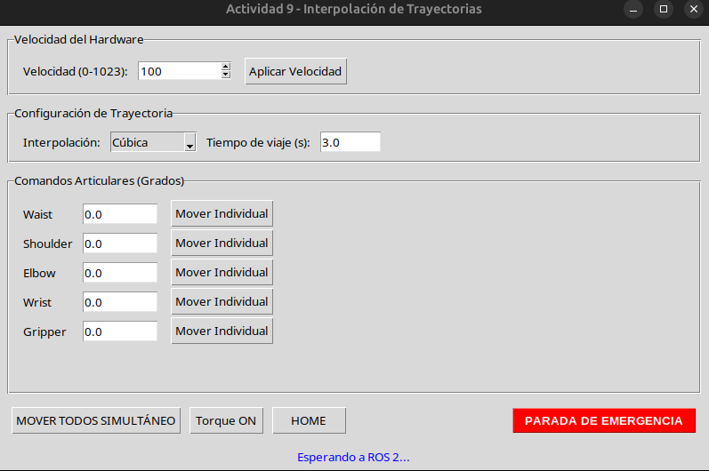
</p>

Para evaluar el desempeño, se plantearon cinco casos de prueba partiendo siempre desde la posición de referencia (`HOME` o `0°`). A continuación se comparan los perfiles lineal y cúbico para cada caso.
#### Caso 1: Base (`Waist`) de 0° a 90° en 10 segundos

<p align="center">
  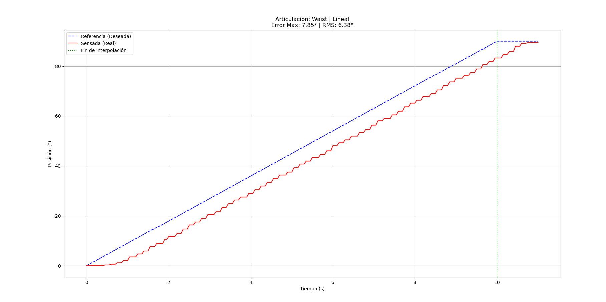
  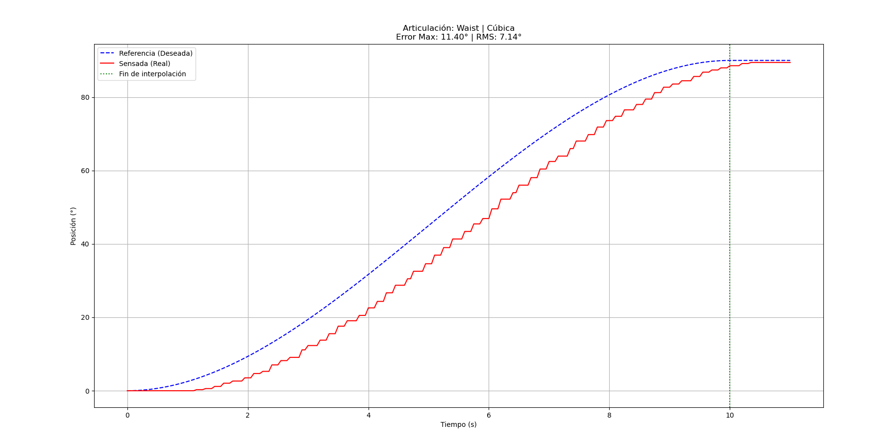
</p>

#### Caso 2: Base (`Waist`) de 0° a 120° en 30 segundos

<p align="center">
  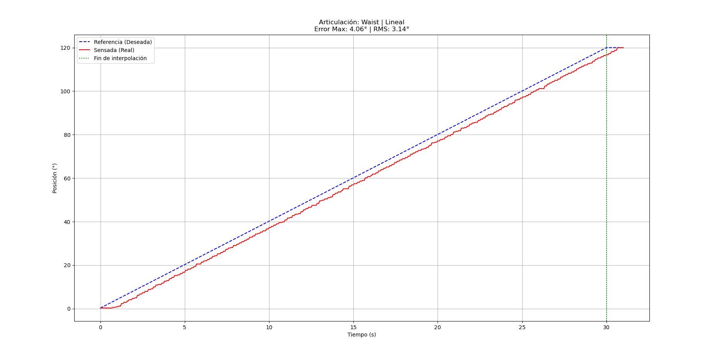
  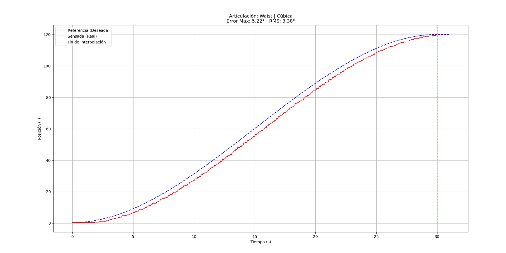
</p>

#### Caso 3: Hombro (`Shoulder`) de 0° a -90° en 30 segundos

<p align="center">
  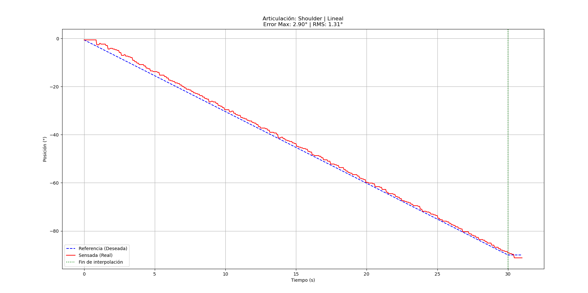
  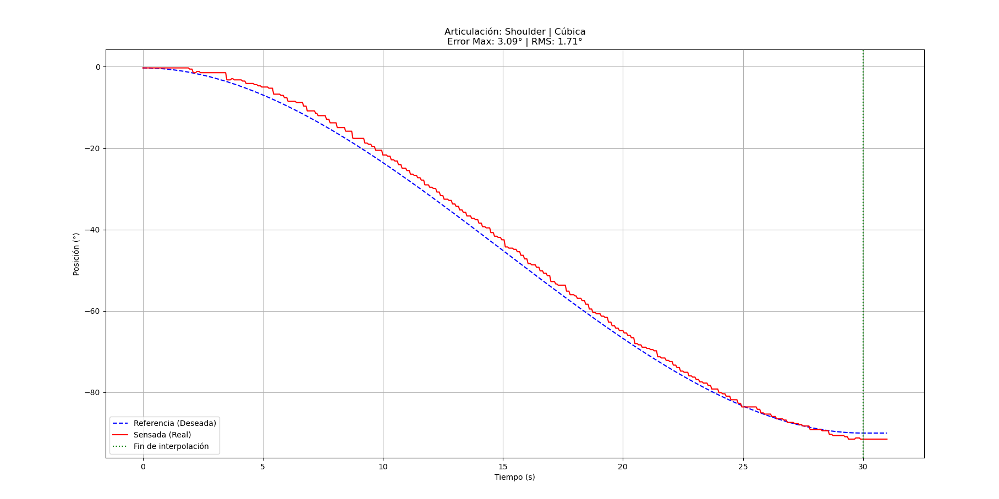
</p>

#### Caso 4: Codo (`Elbow`) de 0° a 90° en 30 segundos

<p align="center">
  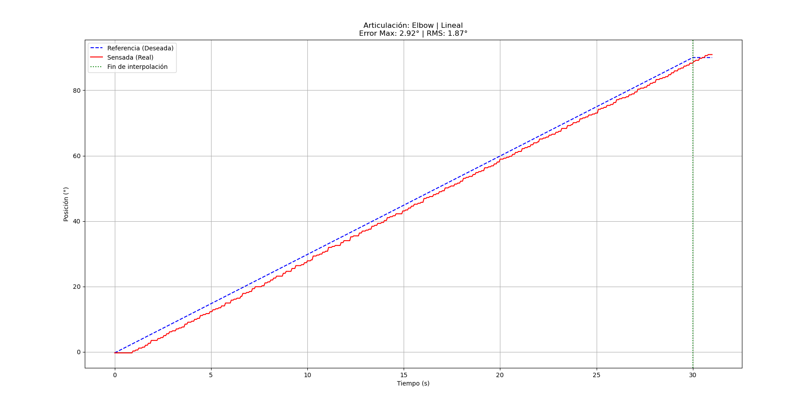
  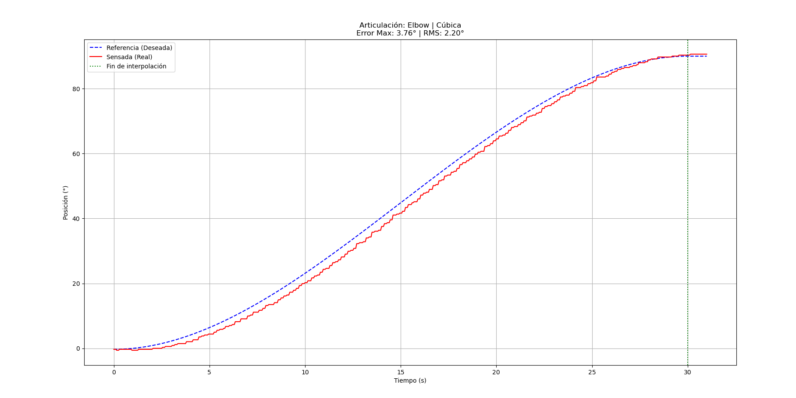
</p>

#### Caso 5: Muñeca (`Wrist`) de 0° a 90° en 30 segundos

<p align="center">
  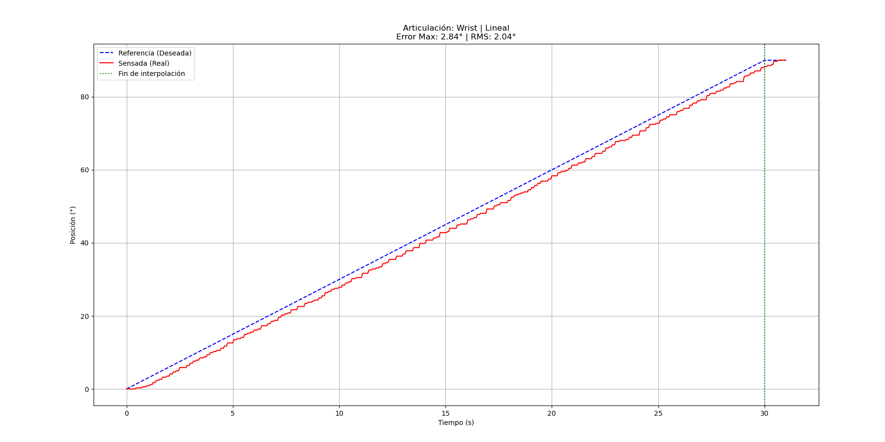
  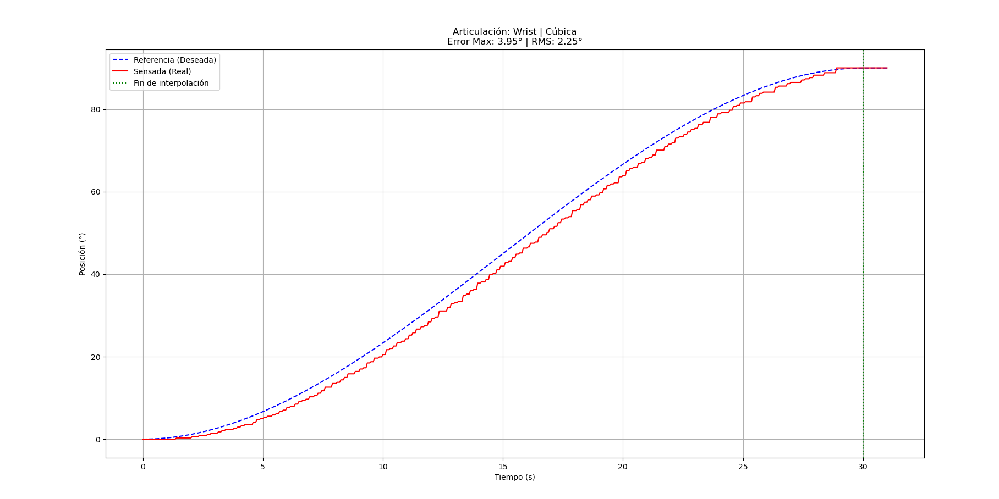
</p>

#### Análisis de las trayectorias

Al observar el error RMS y el comportamiento de la señal sensada frente a la referencia en las distintas gráficas, se determinó que no hubo una diferencia drástica en el error de seguimiento entre la interpolación lineal y la cúbica para la mayoría de las articulaciones (hombro, codo y muñeca).

La excepción fue la articulación de la base (`waist`). En ella, la interpolación cúbica presentó un seguimiento ligeramente mejor y un movimiento más suave. Esto se atribuye a la mayor inercia de esta articulación, responsable de mover toda la estructura del manipulador. Al iniciar y finalizar con velocidad nula, la trayectoria cúbica reduce los cambios bruscos de aceleración y facilita el seguimiento por parte del servomotor.

### 13.5. Video de implementación

En el siguiente video se observa al robot ejecutando las trayectorias interpoladas para los diferentes casos de prueba, permitiendo comparar visualmente el comportamiento obtenido mediante interpolación lineal y cúbica.

- [Video de implementación y comparación de trayectorias (Actividad 9)](https://drive.google.com/file/d/1rp-mupeFN4I7OdXY4hrb2oCEHR1Y2isX/view?usp=drive_link)


## 14. Actividad 10. Trayectoria sinusoidal de una articulación
En esta aactividad se tuvo que implementar una trayectoria sinusoidal para una articulación del robot Phantom y evaluar su capacidad de seguimiento ante 2 diferentes valores de amplitud y 2 de frecuencia.

Para cada prueba se comparó la posición angular deseada con la posición medida
por el servomotor. A partir del error de seguimiento se calcularon: Error máximo absoluto, error promedio, error cuadrático medio, MSE, raíz del error cuadrático medio, RMSE.

En este caso se hizo la trayectoria sinusoidal sobre la articulación de la muñeca y las demás articulaciones permanecieron en la posición de referencia. Por lo tanto, la muñeca osciló de forma simétrica alrededor de `0°`.

[Ver código fuente de la Actividad 10](./Codes/actividad10_sinusoidal.py)

### 14.1. Modelo de la trayectoria

La posición deseada se definió mediante:

$$
q_d(t)=q_0+A\sin(2\pi ft)
$$

donde:

- $q_{d(t)}$ es la posición angular deseada.
- $q_{0}$ es la posición central de la trayectoria.
- $A$ es la amplitud angular.
- $f$ es la frecuencia.
- $t$ es el tiempo transcurrido.

Para esta implementación:

```math
q_0=0^\circ
```
Por lo tanto:

```math
q_d(t)=A\sin(2\pi ft)
```
La velocidad angular deseada corresponde a la derivada de la posición:

```math
\dot q_d(t)=2\pi fA\cos(2\pi ft)
```

La velocidad angular máxima teórica es:

```math
\left|\dot q_d\right|_{\max}=2\pi fA
```
Esta expresión permite observar que el nivel de exigencia dinámica aumenta
tanto con la amplitud como con la frecuencia.


### 14.2. Configuración experimental

Se utilizaron dos amplitudes y dos frecuencias:

```python
AMPLITUDES_DEG = [10.0, 20.0]
FREQUENCIES_HZ = [0.05, 0.1]
```

La duración de cada prueba fue de:

```python
DURATION_SEC = 20.0
```

El periodo de publicación fue:

```python
DT = 0.05
```

Esto equivale a una frecuencia aproximada de envío de comandos de:

```math
f_s=\frac{1}{0.05}=20\ \text{Hz}
```

La velocidad de perfil de los servomotores se configuró en:

```python
PROFILE_VELOCITY = 200
```

Los parámetros se mantuvieron constantes para las cuatro pruebas, excepto por
la amplitud y la frecuencia de la referencia.

| Prueba | Articulación | Amplitud [°] | Frecuencia [Hz] | Periodo [s] | Ciclos en 20 s |
|---:|---|---:|---:|---:|---:|
| 1 | Muñeca | 10 | 0.05 | 20 | 1 |
| 2 | Muñeca | 10 | 0.10 | 10 | 2 |
| 3 | Muñeca | 20 | 0.05 | 20 | 1 |
| 4 | Muñeca | 20 | 0.10 | 10 | 2 |

El periodo se calculó mediante:

```math
T=\frac{1}{f}
```
Por lo tanto, las pruebas de `0.05 Hz` contienen un ciclo completo durante los
20 segundos, mientras que las pruebas de `0.10 Hz` contienen dos ciclos.

### 14.3. Adquisición de datos

Durante cada prueba, el nodo realizó el siguiente procedimiento:

1. Llevó el robot a la posición `HOME`.
2. Ubicó la muñeca en la posición central \(q_0=0^\circ\).
3. Calculó la referencia sinusoidal correspondiente al tiempo actual.
4. Publicó la configuración completa en `/pincher/command`.
5. Leyó la posición medida desde `/joint_states`.
6. Calculó el error instantáneo.
7. Almacenó el tiempo, la posición deseada, la posición medida y el error.
8. Repitió el procedimiento durante 20 segundos.
9. Retornó el robot a `HOME`.
10. Generó las gráficas de posición y error.

### 14.4. Cálculo del error

El error instantáneo se definió como:

```math
e_i=q_{\mathrm{deseado},i}-q_{\mathrm{medido},i}
```

Un error positivo indica que la posición medida se encuentra por debajo de la
posición deseada. Un error negativo indica que la posición medida es mayor que
la referencia.

#### Error máximo absoluto

```math
e_{\max}=\max_i |e_i|
```

Representa la mayor diferencia registrada durante cada prueba.

#### Error promedio
```math
\overline e=
\frac{1}{N}
\sum_{i=1}^{N}e_i
```

El error promedio conserva el signo, por lo que puede indicar una tendencia
general. Sin embargo, los errores positivos y negativos pueden cancelarse.

#### Error cuadrático medio

```math
MSE=
\frac{1}{N}
\sum_{i=1}^{N}e_i^2
```
El MSE penaliza con mayor intensidad los errores de gran magnitud y se expresa
en grados cuadrados.

#### Raíz del error cuadrático medio

```math
RMSE=
\sqrt{
\frac{1}{N}
\sum_{i=1}^{N}e_i^2
}
```
El RMSE se expresa en grados, por lo que permite interpretar directamente la
magnitud típica del error de seguimiento.

### 14.5. Resultados generales

| Prueba | Amplitud [°] | Frecuencia [Hz] | Error máximo [°] | Error promedio [°] | MSE [°²] | RMSE [°] |
|---:|---:|---:|---:|---:|---:|---:|
| 1 | 10 | 0.05 | 3.242 | -0.294 | 3.142 | 1.773 |
| 2 | 10 | 0.10 | 5.297 | -0.325 | 10.140 | 3.184 |
| 3 | 20 | 0.05 | 5.520 | -0.339 | 10.586 | 3.254 |
| 4 | 20 | 0.10 | 9.947 | -0.426 | 38.338 | 6.192 |

Los resultados completos pueden consultarse en:

- [Datos de las cuatro pruebas](./Resultados_Actividades/Actividad10/actividad10_datos.csv)
- [Resumen de métricas](./Resultados_Actividades/Actividad10/actividad10_resumen.csv)

### 14.6. Prueba 1 $(A=10^\circ\), \(f=0.05\ \text{Hz})$
#### Posición deseada y posición medida

<p align="center">
  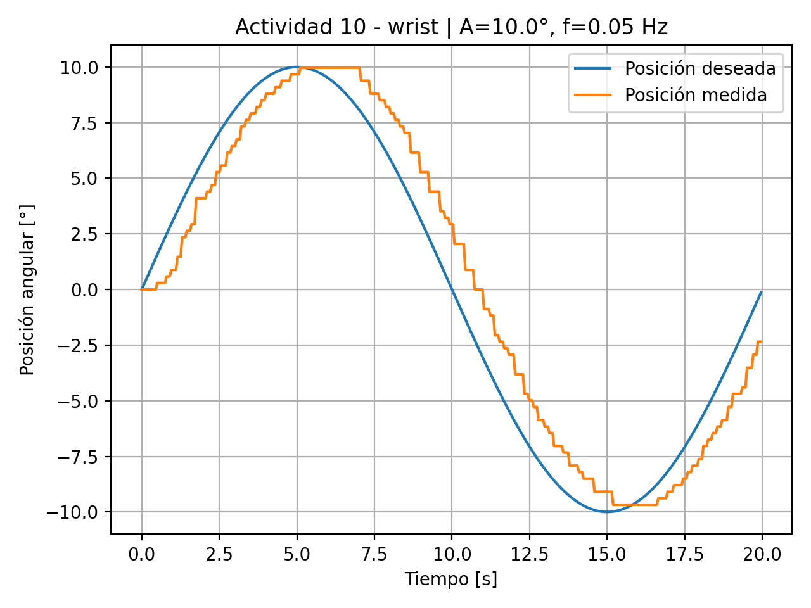
</p>

#### Error de seguimiento

<p align="center">
  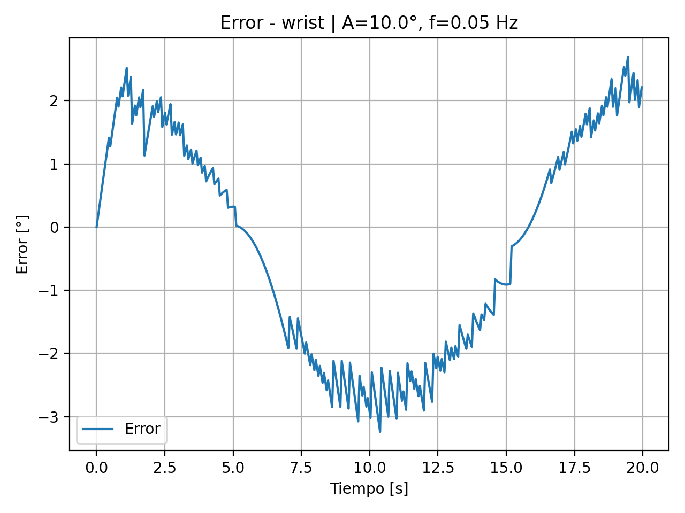
</p>

Esta prueba presentó el mejor seguimiento de las cuatro combinaciones. La
posición medida siguió la forma general de la referencia sinusoidal y alcanzó
valores cercanos a los extremos de $(10^\circ)$ y $(-10^\circ)$.

Se observa un retraso entre la referencia y la respuesta medida, especialmente
durante los cambios de dirección. Este desfase genera errores positivos durante
algunos intervalos y negativos durante otros.

Al utilizar la menor amplitud y la menor frecuencia, esta prueba exigió la menor
velocidad angular al servomotor y obtuvo el menor error.

### 14.7. Prueba 2 $(A=10^\circ)$, $(f=0.10\ \text{Hz})$
#### Posición deseada y posición medida

<p align="center">
  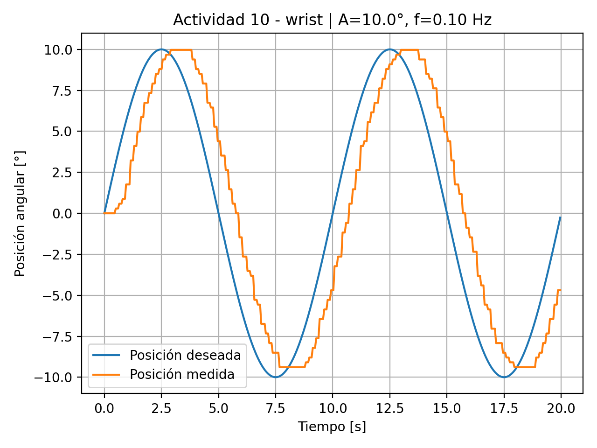
</p>

#### Error de seguimiento

<p align="center">
  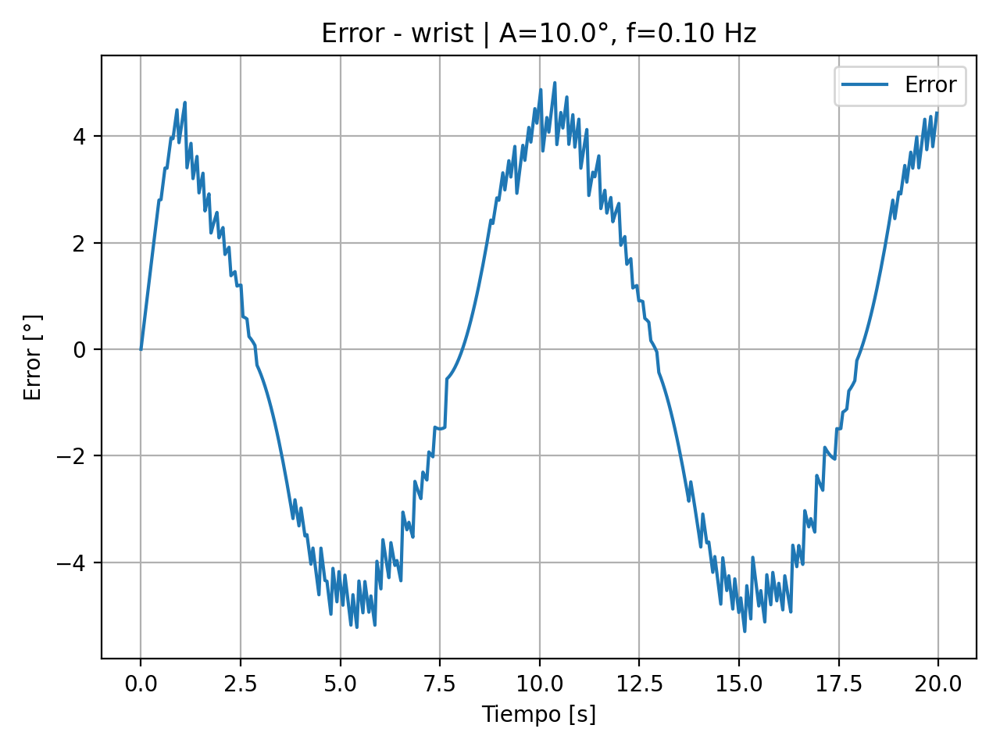
</p>

Al duplicar la frecuencia respecto a la prueba 1, la muñeca debió completar dos
ciclos durante el mismo intervalo de 20 segundos.

La posición medida conservó el comportamiento periódico, pero presentó un
desfase temporal más evidente. Este retraso produjo errores mayores durante los
tramos en los que la referencia cambió rápidamente.

### 14.8. Prueba 3 $(A=20^\circ)$, $(f=0.05\ \text{Hz})$
#### Posición deseada y posición medida

<p align="center">
  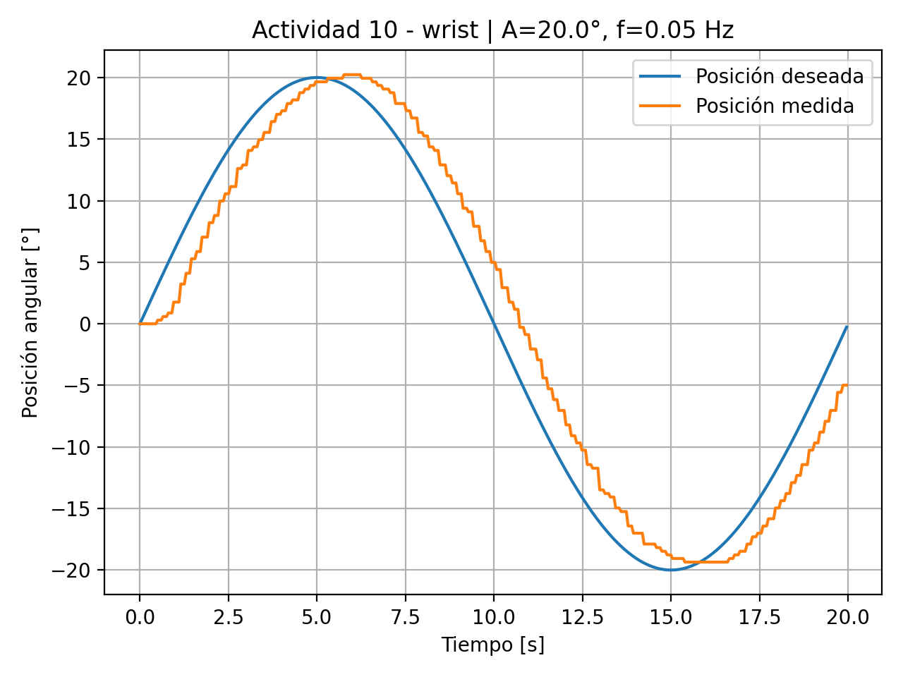
</p>

#### Error de seguimiento

<p align="center">
  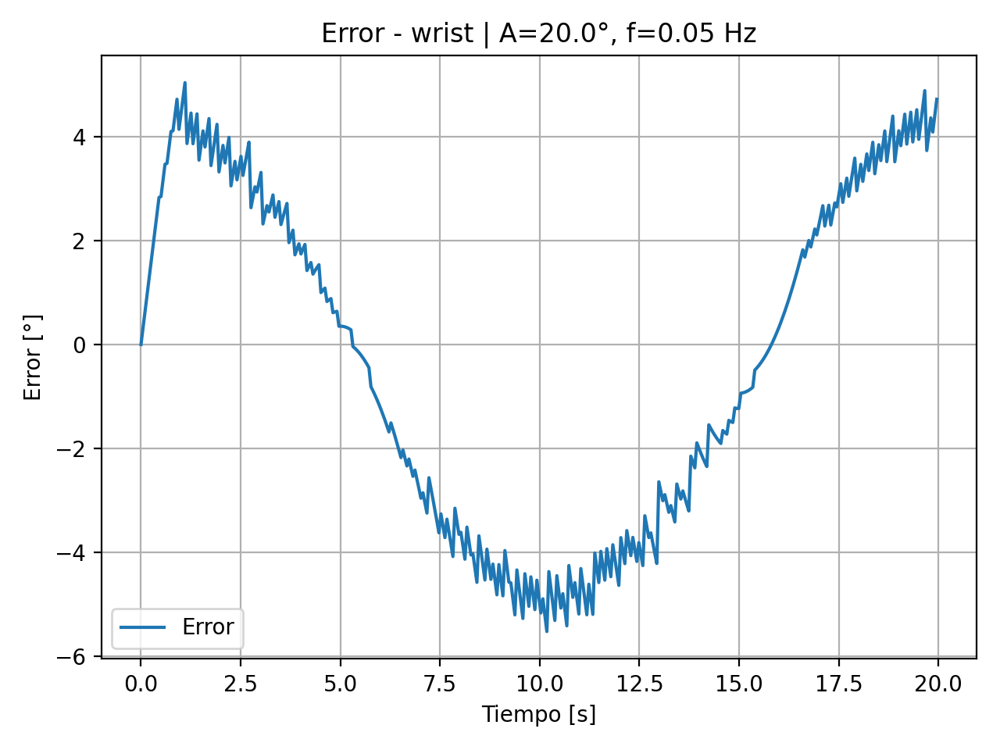
</p>

En esta prueba se duplicó la amplitud respecto a la prueba 1, mientras se
mantuvo la frecuencia en `0.05 Hz`.

La posición medida alcanzó valores cercanos a $(20^\circ)$ y $(-20^\circ)$,
pero presentó un retraso respecto a la referencia. El incremento de la amplitud
aumentó la distancia angular recorrida y la velocidad máxima solicitada.

En las pruebas 2 y 3 unque se utilizan amplitudes y frecuencias diferentes, ambas tienen la misma velocidad
angular máxima:

```math
2\pi(0.10)(10)
=
2\pi(0.05)(20)
=
6.283^\circ/\text{s}
```

Esto explica que sus valores de MSE y RMSE sean cercanos. Por lo tanto, el error de seguimiento no depende únicamente de la amplitud o de la frecuencia por separado, sino también de la velocidad angular que debe alcanzar la articulación.

### 14.9. Prueba 4 $(A=20^\circ)$, $(f=0.10\ \text{Hz})$
#### Posición deseada y posición medida

<p align="center">
  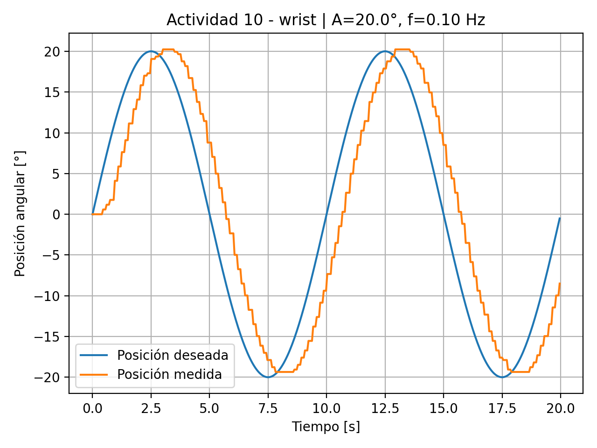
</p>

#### Error de seguimiento

<p align="center">
  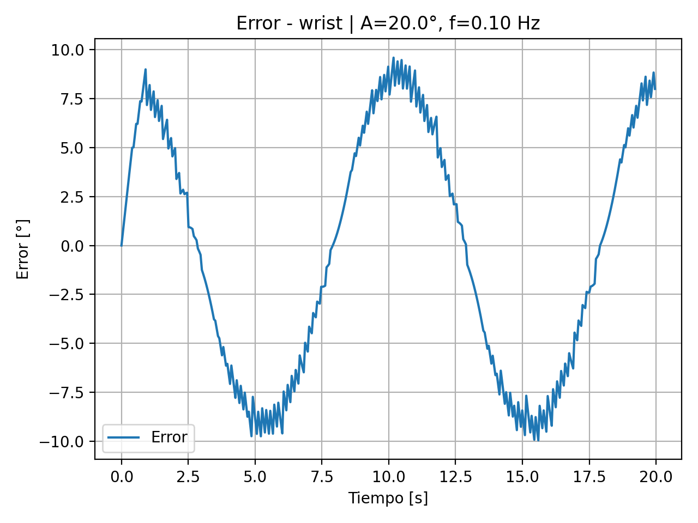
</p>

Esta prueba combinó la mayor amplitud con la mayor frecuencia, por lo que
representó la condición más exigente para la articulación.

La referencia completó dos ciclos entre $(-20^\circ)$ y $(20^\circ)$. Aunque
la posición medida conservó la forma periódica, se observó un desfase
considerable respecto a la referencia.

Los mayores errores aparecieron en los intervalos de mayor cambio angular,
mientras que en las cercanías de los máximos y mínimos la diferencia se redujo
temporalmente.

### 14.10. Comportamiento escalonado de la medición

En las gráficas se observa que la posición medida presenta pequeños cambios escalonados, mientras que la referencia calculada es una curva continua.

Este comportamiento es consistente con:

- La actualización discreta de los comandos.
- La frecuencia de lectura de `/joint_states`.
- La resolución de posición del servomotor.
- El periodo de muestreo de `0.05 s`.
- La dinámica interna del controlador DYNAMIXEL.

A pesar de este comportamiento discreto, la articulación conservó la forma general de la trayectoria sinusoidal en las cuatro pruebas.

### 14.11. Videos de simulación e implementación.
- [Video de simulación e implementación actividad 10](https://drive.google.com/file/d/1E2JiExZbqcZoOUcic_ESeW8z23apEOLV/view?usp=drive_link)


## 15. Actividad 11. Cinemática directa

Se tuvo que hacer la cinemática directa del robot para determinar la posición y orientación de su efector final a partir de las variables articulares:

```math
q_1,\ q_2,\ q_3,\ q_4
```


El programa calcula:

```math
x,\ y,\ z,\ roll,\ pitch,\ yaw
```

### 15.1. Descripción de la implementación

Para desarrollar esta actividad se creó el nodo de ROS 2
`actividad11_cinematica_directa` que realiza:

1. Recibe o selecciona una configuración articular.
2. Convierte los ángulos de grados a radianes.
3. Construye la cadena de transformaciones homogéneas.
4. Calcula la posición y orientación del efector final.
5. Envía la configuración al robot.
6. Consulta la transformación `world → gripper_bar` publicada en TF.
7. Compara la pose calculada con la pose observada en RViz.
8. Calcula el error euclidiano de posición.
9. Guarda los resultados en un archivo CSV.

[Ver código fuente de la Actividad 11](./Codes/actividad11_cinematica_directa.py)


### 15.2. Variables articulares

El modelo utiliza las cuatro articulaciones:
| Variable | Articulación | Nombre en ROS 2 |
|---|---|---|
| \(q_1\) | Base | `waist` |
| \(q_2\) | Hombro | `shoulder` |
| \(q_3\) | Codo | `elbow` |
| \(q_4\) | Muñeca | `wrist` |

La articulación de la pinza no modifica la pose del frame seleccionado como TCP, por lo que no se incluye dentro del cálculo de la cinemática directa.

### 15.3. Frame seleccionado como TCP

Para realizar la comparación se utilizó como efector final el frame:

```python
TARGET_FRAME = "gripper_bar"
```

El sistema de referencia base fue:

```python
BASE_FRAME = "world"
```

Por lo tanto, la pose observada en RViz se obtuvo mediante la transformación:

```math
{}^{world}T_{gripper\_bar}
```

El frame `gripper_bar` corresponde al elemento conectado después de la
articulación de la muñeca en el archivo `robot.xacro`.


### 15.4. Parámetros geométricos

Se tomaron las dimensiones del `robot.xacro`.

| Parámetro | Valor [m] | Descripción |
|---|---:|---|
| \(L_1\) | 0.0445 | Altura asociada a la base |
| \(L_2\) | 0.1010 | Dimensión del eslabón entre hombro y codo |
| \(L_3\) | 0.1010 | Longitud del eslabón entre codo y muñeca |
| \(L_4\) | 0.1190 | Distancia desde la muñeca hasta `gripper_bar` |
| \(L_m\) | 0.0315 | Desplazamiento geométrico horizontal |

También se definió el ángulo auxiliar:

```math
\beta
=
\mathrm{atan2}(L_2,L_m)
```

El ángulo representa la orientación fija entre los frames del hombro, el codo y la muñeca.


### 15.5. Modelo de transformaciones homogéneas

La cinemática directa se implementó mediante una cadena de transformaciones
homogéneas, se expresa como:

```math
{}^{world}T_{TCP}
=
{}^{world}T_{waist}
{}^{waist}T_{shoulder}
{}^{shoulder}T_{elbow}
{}^{elbow}T_{wrist}
{}^{wrist}T_{TCP}
```

Cada matriz homogénea tiene la forma:

```math
T=
\begin{bmatrix}
R_{3\times3} & \mathbf{p}_{3\times1}\\
0 & 1
\end{bmatrix}
```

donde:

- $(R)$ es la orientación.
- $(\mathbf{p})$ es la posición.
- La última fila permite trabajar con coordenadas homogéneas.


### 15.6. Transformación de la base

La primera articulación rota alrededor del eje vertical \(z\):

```math
{}^{world}T_{waist}
=
T_z(0.08945-L_1)\,R_z(q_1)
```

La matriz de rotación alrededor de \(z\) es:

```math
R_z(q)=
\begin{bmatrix}
\cos q & -\sin q & 0\\
\sin q & \cos q & 0\\
0 & 0 & 1
\end{bmatrix}
```

Esta articulación determina principalmente la orientación horizontal del brazo.


### 15.7. Transformación del hombro

La transformación correspondiente al hombro se construyó como:

```math
{}^{waist}T_{shoulder}
=
T_z(L_1)\,
R_x\left(-\frac{\pi}{2}\right)\,
R_z(q_2)
```

La rotación fija de $-\pi/2$ alrededor de $x$ permite orientar el eje de
movimiento del hombro de acuerdo con la descripción URDF del robot.


### 15.8. Transformación del codo

Para el codo se utilizó:

```math
{}^{shoulder}T_{elbow}
=
T(L_m,-L_2,0)\,
R_z\left(-\beta-\frac{\pi}{2}\right)\,
R_z(q_3)
```

Esta transformación incluye:

- Un desplazamiento fijo de $L_m$ en $x$.
- Un desplazamiento de $-L_2$ en $y$.
- Una rotación fija determinada por $beta$.
- La rotación articular $q_3$.


### 15.9. Transformación de la muñeca

La transformación del codo hacia la muñeca se definió como:

```math
{}^{elbow}T_{wrist}
=
T\left(
L_3\cos\beta,
L_3\sin\beta,
0
\right)
R_z(\beta)
R_z(q_4)
```

Esta expresión representa la longitud del tercer eslabón y la orientación de la
articulación de la muñeca.


### 15.10. Transformación hasta el TCP

Finalmente, desde la muñeca hasta el frame `gripper_bar` se aplicó la
transformación fija:

```math
{}^{wrist}T_{TCP}
=
T_x(L_4)
R_x\left(-\frac{\pi}{2}\right)
R_z\left(-\frac{\pi}{2}\right)
```


### 15.11. Matriz de transformación total

El producto de las matrices anteriores genera:

```math
{}^{world}T_{TCP}
=
\begin{bmatrix}
r_{11} & r_{12} & r_{13} & x\\
r_{21} & r_{22} & r_{23} & y\\
r_{31} & r_{32} & r_{33} & z\\
0 & 0 & 0 & 1
\end{bmatrix}
```

La posición cartesiana del TCP se obtiene de la última columna:

```math
\mathbf{p}_{TCP}
=
\begin{bmatrix}
x\\
y\\
z
\end{bmatrix}
```

La orientación se obtiene a partir de la submatriz:

```math
R=
\begin{bmatrix}
r_{11} & r_{12} & r_{13}\\
r_{21} & r_{22} & r_{23}\\
r_{31} & r_{32} & r_{33}
\end{bmatrix}
```


### 15.12. Obtención de roll, pitch y yaw

La orientación se expresó utilizando la convención:

```math
R=R_z(yaw)R_y(pitch)R_x(roll)
```

A partir de la matriz de rotación se calcularon:

```math
pitch
=
\arcsin(-r_{31})
```

```math
\mathrm{roll}
=
\mathrm{atan2}(r_{32},r_{33})
```

```math
\mathrm{yaw}
=
\mathrm{atan2}(r_{21},r_{11})
```

### 15.13. Comparación con RViz

Para obtener la pose observada en RViz se consultó la transformación publicada
por `robot_state_publisher`:

```text
world → gripper_bar
```

La transformación fue obtenida mediante:

```python
tf = self.tf_buffer.lookup_transform(
    BASE_FRAME,
    TARGET_FRAME,
    Time()
)
```

La orientación de TF se recibe en forma de cuaternión:

```math
(q_x,q_y,q_z,q_w)
```

Este cuaternión se convirtió a una matriz de rotación y luego a
ángulos `roll`, `pitch` y `yaw`, utilizando la misma convención aplicada en el
modelo calculado.


### 15.14. Error de posición

La diferencia entre la posición calculada y la posición obtenida de RViz se
determinó mediante:

```math

\Delta x=x_{\mathrm{calc}}-x_{\mathrm{RViz}}
```

```math

\Delta y=y_{\mathrm{calc}}-y_{\mathrm{RViz}}
```

```math

\Delta z=z_{\mathrm{calc}}-z_{\mathrm{RViz}}
```

El error euclidiano se calculó como:

```math

e_p
=
\sqrt{
(\Delta x)^2+
(\Delta y)^2+
(\Delta z)^2
}
```

Este valor representa la distancia tridimensional entre la posición predicha
por el modelo y la posición publicada por ROS 2.


### 15.15. Configuraciones evaluadas

Se evaluaron las cinco configuraciones utilizadas en la Actividad 7:

| Configuración | \(q_1\) [°] | \(q_2\) [°] | \(q_3\) [°] | \(q_4\) [°] | Pinza [°] |
|---:|---:|---:|---:|---:|---:|
| 1 | 0 | 0 | 0 | 0 | 0 |
| 2 | 25 | 25 | 20 | -20 | 0 |
| 3 | -35 | 35 | -30 | 30 | 0 |
| 4 | 85 | -20 | 55 | 25 | 0 |
| 5 | 80 | -35 | 55 | -45 | 0 |


### 15.16. Resultados de posición

| Config. | \(x_{\mathrm{calc}}\) [m] | \(y_{\mathrm{calc}}\) [m] | \(z_{\mathrm{calc}}\) [m] | \(x_{\mathrm{RViz}}\) [m] | \(y_{\mathrm{RViz}}\) [m] | \(z_{\mathrm{RViz}}\) [m] | Error [mm] |
|---:|---:|---:|---:|---:|---:|---:|---:|
| 1 | 0.03150 | 0.00000 | 0.41045 | 0.02709 | 0.00014 | 0.41074 | 4.426 |
| 2 | 0.17487 | 0.08154 | 0.34694 | 0.18283 | 0.08271 | 0.34143 | 9.760 |
| 3 | 0.13171 | -0.09223 | 0.35221 | 0.13751 | -0.09384 | 0.34886 | 6.893 |
| 4 | 0.01360 | 0.15545 | 0.33737 | 0.01401 | 0.16159 | 0.33145 | 8.535 |
| 5 | -0.00831 | -0.04715 | 0.39301 | -0.00877 | -0.05002 | 0.39232 | 2.993 |

Los resultados completos pueden consultarse en:

- [Resultados de la cinemática directa config1](./Resultados_Actividades/Actividad11/lab05_results_A11_1/actividad11_cinematica_directa.csv)
- [Resultados de la cinemática directa config2](./Resultados_Actividades/Actividad11/lab05_results_A11_2/actividad11_cinematica_directa.csv)
- [Resultados de la cinemática directa config3](./Resultados_Actividades/Actividad11/lab05_results_A11_3/actividad11_cinematica_directa.csv)
- [Resultados de la cinemática directa config4](./Resultados_Actividades/Actividad11/lab05_results_A11_4/actividad11_cinematica_directa.csv)
- [Resultados de la cinemática directa config5](./Resultados_Actividades/Actividad11/lab05_results_A11_5/actividad11_cinematica_directa.csv)


### 15.17. Resultados de orientación

| Config. | Roll calculado [°] | Pitch calculado [°] | Yaw calculado [°] | Roll RViz [°] | Pitch RViz [°] | Yaw RViz [°] |
|---:|---:|---:|---:|---:|---:|---:|
| 1 | 0.000 | 0.000 | -180.000 | 0.000 | 0.880 | -179.707 |
| 2 | 0.000 | -25.000 | -155.000 | 0.000 | -27.273 | -155.660 |
| 3 | 0.000 | -35.000 | 145.000 | 0.000 | -36.657 | 145.689 |
| 4 | 0.000 | -60.000 | -95.000 | 0.000 | -62.170 | -94.956 |
| 5 | 0.000 | 25.000 | -100.000 | 0.000 | 25.513 | -99.941 |

El valor de `roll` permaneció prácticamente en cero para todas las
configuraciones. Las principales diferencias de orientación se presentaron en
el ángulo `pitch`.


### 15.18. Resumen de errores

| Métrica | Valor |
|---|---:|
| Error mínimo | 2.993 mm |
| Error máximo | 9.760 mm |
| Error promedio | 6.521 mm |
| RMS de los errores de posición | 6.988 mm |
| Diferencia angular promedio en pitch | 1.499° |
| Diferencia angular máxima en pitch | 2.273° |
| Diferencia angular promedio en yaw | 0.349° |
| Diferencia angular máxima en yaw | 0.689° |

Todas las diferencias de posición obtenidas fueron inferiores a `10 mm`.

La configuración 5 presentó la mejor correspondencia, con un error de `2.993 mm`. En cuanto a la orientación, el ángulo `yaw` presentó diferencias menores a `0.7°`, mientras que la mayor diferencia en `pitch` fue de aproximadamente `2.273°`.

Finalmente, las diferencias obtenidas pueden atribuirse tanto a pequeñas variaciones geométricas como al error articular entre las posiciones deseadas y las posiciones reportadas por los servomotores. En términos generales, el modelo implementado reproduce adecuadamente el comportamiento cinemático
mostrado en RViz.

## 16. Actividad 12. Cinemática inversa

Se implementó el modelo de cinemática inversa del robot para determinar una configuración articular válida a partir de una pose cartesiana deseada:

```math
x,\ y,\ z,\ \theta
```
que representan la posición deseada del TCP en metros. El programa calcula las variables articulares:

```math
q_1,\ q_2,\ q_3,\ q_4
```

### 16.1. Descripción de la implementación
El nodo realiza el siguiente procedimiento:

1. Calcula el ángulo de la base.
2. Determina el centro de la muñeca.
3. Verifica si el punto pertenece al espacio de trabajo.
4. Calcula las configuraciones de codo arriba y codo abajo.
5. Convierte las soluciones al modelo articular real del robot.
6. Verifica los límites articulares.
7. Valida cada solución mediante cinemática directa.
8. Selecciona la solución válida más cercana a la configuración actual.
9. Publica la configuración sobre `/pincher/command`.
10. Guarda los resultados en un archivo CSV.

[Ver código fuente de la Actividad 12](./Codes/actividad12_cinematica_inversa.py)

### 16.2. Parámetros geométricos

Las dimensiones empleadas fueron tomadas del archivo `robot.xacro`.

| Parámetro | Valor [m] | Descripción |
|---|---:|---|
| \(L_1\) | 0.0445 | Dimensión asociada a la base |
| \(L_2\) | 0.1010 | Primer componente del eslabón hombro-codo |
| \(L_3\) | 0.1010 | Longitud del eslabón codo-muñeca |
| \(L_4\) | 0.1190 | Longitud desde la muñeca hasta el TCP |
| \(L_m\) | 0.0315 | Desplazamiento geométrico del hombro |
| \(Z_0\) | 0.08945 | Altura de referencia del hombro |

Debido al desplazamiento $(L_m)$, el primer eslabón del mecanismo plano se
representó mediante una longitud equivalente:

```math
A_1=\sqrt{L_2^2+L_m^2}
```

Para las dimensiones utilizadas:

```math
A_1=0.105798\ \text{m}
```

También se definió el ángulo auxiliar:

```math
\gamma
=
\mathrm{atan2}(L_m,L_2)
```

```math
\gamma\approx17.322^\circ
```


### 16.3. Límites articulares

Las soluciones obtenidas fueron verificadas utilizando los siguientes límites que se especificaron en la actividad 6

| Articulación | Límite inferior [°] | Límite superior [°] |
|---|---:|---:|
| Base (`waist`) | -150 | 150 |
| Hombro (`shoulder`) | -10 | 100 |
| Codo (`elbow`) | -120 | 120 |
| Muñeca (`wrist`) | -95 | 95 |

Una solución se considera válida únicamente cuando:

```math
q_{i,\min}\leq q_i\leq q_{i,\max}
```

para todas las articulaciones.

### 16.4. Cálculo del ángulo de la base

El ángulo de la base se obtiene a partir de las coordenadas $x$ y $y$:

```math
q_1
=
\mathrm{atan2}(y,x)
```

La distancia radial desde el eje de la base es:

```math
r=\sqrt{x^2+y^2}
```

El uso de `atan2` permite identificar correctamente el cuadrante en el que se
encuentra el punto solicitado.


### 16.5. Relación entre la orientación y las articulaciones

Para el modelo cinemático utilizado, el `pitch` del TCP está relacionado con
las articulaciones del plano mediante:

```math
\theta=-(q_2+q_3+q_4)
```

Por lo tanto, se definió:

```math
\phi=-\theta
```

y se cumple:

```math
\phi=q_2+q_3+q_4
```

Esta relación permite calcular posteriormente el ángulo de la muñeca \(q_4\).


### 16.6. Cálculo del centro de la muñeca

La pose solicitada corresponde al TCP. Para resolver el mecanismo equivalente
de dos eslabones primero se resta el efecto del último eslabón \(L_4\).

Las coordenadas del centro de la muñeca son:

```math
r_w=r-L_4\sin(\phi)
```

```math
z_w=z-Z_0-L_4\cos(\phi)
```

La distancia desde el hombro hasta el centro de la muñeca se calcula como:

```math
D=\sqrt{r_w^2+z_w^2}
```


### 16.7. Verificación de alcanzabilidad

Para que el centro de la muñeca sea alcanzable por el mecanismo equivalente de
dos eslabones debe cumplirse:

```math
|A_1-L_3|\leq D\leq A_1+L_3
```

Con las dimensiones del robot, el intervalo permitido es:

```math
0.004798\ \text{m}
\leq D\leq
0.206798\ \text{m}
```

Si la distancia se encuentra fuera de este intervalo, el punto es clasificado
como no alcanzable y no se calculan comandos articulares.

### 16.8. Soluciones de codo arriba y codo abajo

Aplicando la ley del coseno se calcula:

```math
\cos\delta=
\frac{
D^2-A_1^2-L_3^2
}{
2A_1L_3
}
```

El ángulo auxiliar puede presentar dos soluciones:

```math
\delta_{\mathrm{abajo}}
=
+\arccos(\cos\delta)
```

```math
\delta_{\mathrm{arriba}}
=
-\arccos(\cos\delta)
```

En la implementación se utilizaron las etiquetas:

```text
codo_abajo
codo_arriba
```

La protección numérica:

```python
cos_delta = max(-1.0, min(1.0, cos_delta))
```

evita errores producidos por pequeñas aproximaciones de punto flotante cuando
el valor calculado queda ligeramente fuera del intervalo \([-1,1]\).


### 16.9. Cálculo de las articulaciones del plano

El ángulo del vector que conecta el hombro con el centro de la muñeca se
calculó como:

```math
\psi
=
\mathrm{atan2}(r_w,z_w)
```

Posteriormente:

```math
u
=
\psi
-
\mathrm{atan2}
\left(
L_3\sin\delta,\,
A_1+L_3\cos\delta
\right)
```

```math
v=u+\delta
```

Las variables del modelo equivalente se transformaron a las articulaciones
reales mediante:

```math
q_2=u-\gamma
```

```math
q_3=v-u+\gamma
```

Finalmente, el ángulo de la muñeca se obtuvo como:

```math
q_4=\phi-v
```

Los cuatro ángulos fueron normalizados al intervalo:

```math
-180^\circ\leq q_i\leq180^\circ
```


### 16.10. Validación mediante cinemática directa

Cada solución obtenida fue evaluada nuevamente mediante el modelo de cinemática
directa.

La posición reconstruida se calculó como:

```math
r=
L_m\cos q_2+
L_2\sin q_2+
L_3\sin(q_2+q_3)+
L_4\sin(q_2+q_3+q_4)
```

```math
z=
Z_0-
L_m\sin q_2+
L_2\cos q_2+
L_3\cos(q_2+q_3)+
L_4\cos(q_2+q_3+q_4)
```

```math
x=r\cos q_1
```

```math
y=r\sin q_1
```

El `pitch` reconstruido fue:

```math
\theta_{\mathrm{FK}}
=
-(q_2+q_3+q_4)
```

El error de posición se calculó mediante:

```math
e_p=
\sqrt{
(x_d-x_{\mathrm{FK}})^2+
(y_d-y_{\mathrm{FK}})^2+
(z_d-z_{\mathrm{FK}})^2
}
```

El error de orientación se calculó como:

```math
e_\theta=
\theta_d-\theta_{\mathrm{FK}}
```


### 16.11. Selección de la solución más cercana

Cuando las soluciones de codo arriba y codo abajo cumplen los límites, se
selecciona aquella que requiere el menor cambio respecto a la configuración
actual del robot.

La distancia en el espacio articular se calcula mediante:

```math
d_q=
\sqrt{
\sum_{i=1}^{4}
\left(
q_i-q_{i,\mathrm{actual}}
\right)^2
}
```

Antes de calcular la diferencia, cada ángulo se normaliza para evitar recorridos
innecesarios mayores a \(180^\circ\).

La solución seleccionada es:

```math
\mathbf{q}_{\mathrm{seleccionada}}
=
\underset{\mathbf{q}_j}{\arg\,\min}
\left[
d_q\left(
\mathbf{q}_j,
\mathbf{q}_{\mathrm{actual}}
\right)
\right]
```

Este criterio reduce la amplitud del movimiento y evita cambiar de configuración
de codo cuando existe una alternativa más cercana.


### 16.12. Puntos cartesianos evaluados

Se probaron cinco posiciones cartesianas diferentes. Cuatro de ellas fueron
alcanzables y una se seleccionó intencionalmente fuera del espacio de trabajo
para verificar la detección de puntos no alcanzables.

| Punto | \(x\) [m] | \(y\) [m] | \(z\) [m] | \(\theta\) [°] |
|---:|---:|---:|---:|---:|
| 1 | 0.0000 | 0.2827 | 0.1642 | -55 |
| 2 | -0.0506 | -0.2869 | 0.1306 | -60 |
| 3 | 0.13171 | -0.09223 | 0.35221 | -35 |
| 4 | 0.0630 | 0.0630 | 0.3931 | -30 |
| 5 | 0.5000 | 0.0000 | 0.3000 | 0 |


### 16.13. Resultados generales

| Punto | Alcanzable | Solución seleccionada | \(q_1\) [°] | \(q_2\) [°] | \(q_3\) [°] | \(q_4\) [°] |
|---:|---|---|---:|---:|---:|---:|
| 1 | Sí | Codo arriba | 90.000 | 96.355 | -35.365 | -5.990 |
| 2 | Sí | Codo abajo | -100.002 | 54.992 | 65.025 | -59.995 |
| 3 | Sí | Codo arriba | -35.002 | 35.001 | -30.003 | 30.002 |
| 4 | Sí | Codo arriba | 45.000 | 2.143 | -5.355 | 33.212 |
| 5 | No | No aplica | — | — | — | — |


### 16.14. Análisis de cada punto

#### Punto 1
- [Resultados de cinemática inversa config1](./Resultados_Actividades/Actividad12/lab05_results_A12_1/actividad12_cinematica_inversa.csv)

El primer punto se ubicó sobre el eje positivo $y$:

```math
(x,y,z)=(0,\ 0.2827,\ 0.1642)\ \text{m}
```

Por esta razón, el ángulo de la base fue:

```math
q_1=90^\circ
```

La solución seleccionada fue de codo arriba:

```math
\mathbf q=
[90.000,\ 96.355,\ -35.365,\ -5.990]^\circ
```

La suma de las articulaciones del plano fue:

```math
q_2+q_3+q_4
=
55^\circ
```

Por lo tanto:

```math
\theta=-(55^\circ)=-55^\circ
```

La articulación del hombro quedó cerca de su límite superior de \(100^\circ\),
aunque la configuración todavía se encuentra dentro del rango establecido.

#### Punto 2
- [Resultados de cinemática inversa config2](./Resultados_Actividades/Actividad12/lab05_results_A12_2/actividad12_cinematica_inversa.csv)

Para el segundo punto se obtuvo:

```math
(x,y,z)=(-0.0506,\ -0.2869,\ 0.1306)\ \text{m}
```

La ubicación en el tercer cuadrante produjo:

```math
q_1\approx-100.002^\circ
```

La solución seleccionada fue de codo abajo:

```math
\mathbf q=
[-100.002,\ 54.992,\ 65.025,\ -59.995]^\circ
```

En este caso:

```math
q_2+q_3+q_4
\approx60^\circ
```

por lo que el `pitch` resultante fue:

```math
\theta\approx-60^\circ
```

Las cuatro articulaciones permanecieron dentro de los límites definidos.


#### Punto 3
- [Resultados de cinemática inversa config3](./Resultados_Actividades/Actividad12/lab05_results_A12_3/actividad12_cinematica_inversa.csv)

El tercer punto correspondió a:

```math
(x,y,z)=
(0.13171,\ -0.09223,\ 0.35221)\ \text{m}
```

La solución seleccionada fue:

```math
\mathbf q=
[-35.002,\ 35.001,\ -30.003,\ 30.002]^\circ
```

Esta configuración fue clasificada como codo arriba.

La solución presenta valores cercanos a una de las configuraciones utilizadas
en la Actividad 7. La validación mediante cinemática directa produjo un error
de posición exactamente igual a cero dentro de la precisión mostrada.

#### Punto 4
- [Resultados de cinemática inversa config4](./Resultados_Actividades/Actividad12/lab05_results_A12_4/actividad12_cinematica_inversa.csv)

Para el cuarto punto:

```math
(x,y,z)=
(0.063,\ 0.063,\ 0.3931)\ \text{m}
```

Como las coordenadas \(x\) y \(y\) son iguales y positivas, el ángulo de la base
fue:

```math
q_1=45^\circ
```

La solución seleccionada fue:

```math
\mathbf q=
[45.000,\ 2.143,\ -5.355,\ 33.212]^\circ
```

La configuración fue clasificada como codo arriba y presentó un error de
posición del orden de $(10^{-17}\ \text{m}\$.

#### Punto 5
- [Resultados de cinemática inversa config5](./Resultados_Actividades/Actividad12/lab05_results_A12_5/actividad12_cinematica_inversa.csv)

El quinto punto fue:

```math
(x,y,z)=(0.5,\ 0,\ 0.3)\ \text{m}
```

Para este objetivo, la distancia calculada hasta el centro de la muñeca fue:

```math
D=0.5083\ \text{m}
```

El rango permitido por el mecanismo equivalente es:

```math
0.0048\ \text{m}
\leq D\leq
0.2068\ \text{m}
```

Como:

```math
0.5083>0.2068
```

el punto se encuentra fuera del espacio de trabajo y fue correctamente clasificado como no alcanzable. Por ello, no se generaron ni se enviaron comandos articulares para esta posición.


### 16.15. Comparación de las soluciones seleccionadas

| Punto | Configuración seleccionada | Característica principal |
|---:|---|---|
| 1 | Codo arriba | Hombro cercano al límite superior |
| 2 | Codo abajo | Única prueba con esta configuración seleccionada |
| 3 | Codo arriba | Pose cercana a una configuración previamente conocida |
| 4 | Codo arriba | Base orientada a 45° |
| 5 | Sin solución | Punto fuera del espacio de trabajo |


## 17. Actividad 13. Enseñanza y repetición de poses

El modo Teach & Play (enseñar y reproducir) es una de las metodologías de programación más utilizadas en la robótica industrial tradicional. En este enfoque, en lugar de ingresar las coordenadas manualmente mediante cinemática inversa, el usuario guía físicamente al manipulador por el espacio de trabajo. Las posiciones adquiridas se graban en la memoria para generar una rutina automatizada que el robot luego reproduce con exactitud.

En esta actividad se desarrolló un entorno gráfico en ROS 2 Jazzy para implementar este concepto sobre el PhantomX Pincher X100, permitiendo la captura, edición, carga, guardado y reproducción de secuencias de movimiento personalizadas.

[Ver código fuente de la Actividad 13](./Codes/actividad13_teach_and_play.py)

### 17.1. Arquitectura y Lógica de ROS 2

El programa se estructura en dos clases principales: el nodo de comunicaciones TeachNode y el administrador gráfico TeachGUI. 

El nodo TeachNode instancia clientes y publicadores idénticos a los vistos en laboratorios anteriores, pero su rol fundamental recae en la subscripción a /joint_states. Cada vez que el robot (físico o simulado) reporta su posición, la función callback actualiza el diccionario interno current_positions.
Para no bloquear los eventos de la ventana de Tkinter, la clase TeachGUI utiliza el método self.root.after(20, self._spin_ros) que se encarga de ejecutar el spin_once de ROS 2 en periodos cortos de tiempo. De forma simultánea, self._update_realtime() actualiza los cuadros de texto de la interfaz con los valores articulares actuales en grados.

### 17.2. Lógica de Enseñanza (Teach)

El flujo para enseñar una posición al manipulador se basa en el método save_current_pose(). La secuencia lógica es la siguiente:
1. El usuario presiona el botón Torque OFF. La interfaz envía una petición False al servicio /pincher/torque_enable. Al estar desenergizados, el operador puede mover el brazo a mano.
2. Al estar suscritos a /joint_states, los encoders de los motores siguen enviando lecturas. La interfaz muestra los valores en tiempo real.
3. El usuario pulsa Guardar pose actual. El programa utiliza simpledialog para solicitar al usuario tres datos:
   - El nombre de la pose.
   - La velocidad (v) para que el robot viaje hacia dicha pose.
   - El tiempo de espera (t) después de haber llegado al objetivo.
4. El programa toma la lectura exacta del instante actual (self.node.current_positions), convierte los radianes a grados y añade la nueva pose a la lista interna self.poses_data.

### 17.3. Guardado y estructura del archivo YAML

La gestión de rutinas persistentes se delega a la librería nativa yaml de Python. Cuando el usuario presiona el botón Guardar YAML o Guardar como..., el método guardar_yaml() toma el arreglo self.poses_data y lo empaqueta en un formato de diccionario de Python. 

El código emplea la función yaml.dump(data, f, default_flow_style=False, sort_keys=False) para escribir un archivo de texto fácil de leer y modificar externamente. 

La estructura del YAML generado sigue estrictamente este esquema jerárquico:

```yaml
joints_order:
- waist
- shoulder
- elbow
- wrist
- gripper
poses:
- name: aproximacion_cubo
  joints: [0.0, -45.5, 30.0, 15.0, 0.0]
  v: 100
  t: 0.5
- name: agarre
  joints: [0.0, -45.5, 30.0, 15.0, 60.0]
  v: 50
  t: 2.0
```
Esta estructura define el joints_order (para asegurar que los índices del arreglo joints siempre coincidan con las articulaciones físicas) y luego una lista de poses donde cada elemento dictamina su cinemática y dinámica particular (v y t). 

Asimismo, el método cargar_yaml() incluye el sub-método normalizar_poses_yaml(), el cual valida que el archivo seleccionado contenga todas las llaves necesarias. De esta forma se previenen fallos lógicos; por ejemplo, si un archivo antiguo no contenía v o t, el sistema inyecta variables por defecto (DEFAULT_POSE_SPEED y DEFAULT_POSE_WAIT).

### 17.4. Lógica de Reproducción (Play) e Hilos 

Al presionar el botón REPRODUCIR RUTINA, la GUI invoca al método play_sequence(), el cual crea un hilo secundario (threading.Thread) apuntando a la función _play_loop(). Esto es imperativo; si se ejecutara en el hilo principal, un ciclo de retardo bloquearía inmediatamente toda la interfaz gráfica.

El núcleo de la reproducción no se basa en un simple time.sleep(), sino en el método de supervisión wait_until_pose_reached(). La lógica opera así:
1. Extrae de la lista la primera pose. Envía su velocidad y su arreglo articular.
2. Inicia un bucle while. 
3. Usando pose_error_deg(), resta la posición objetivo y la posición actual sensada en grados absolutos para cada motor, obteniendo el max_error.
4. Solo si el max_error disminuye por debajo de un margen prestablecido (ej. 3.0°) durante una cantidad de ciclos consecutivos de lectura (Estabilidad lecturas), se asume que el robot efectivamente llegó a la pose.
5. Tras confirmarse la llegada, se aplica el retardo individual t asignado a esa pose.
6. Pasa a la siguiente pose en la lista, hasta agotar el archivo.

Cualquier emergencia detectada por el usuario al presionar PARADA DE SOFTWARE rompe los bucles y ejecuta de inmediato el cliente de servicio para software_stop, quitando la fuerza a los servomotores y cancelando la ejecución del hilo.

### 17.5. Interfaz de Usuario (UI)

La ventana integra el panel de lectura y configuración de tolerancia en la parte izquierda, y el listado de despliegue dinámico de la secuencia YAML en el centro-derecha.

<p align="center">
	  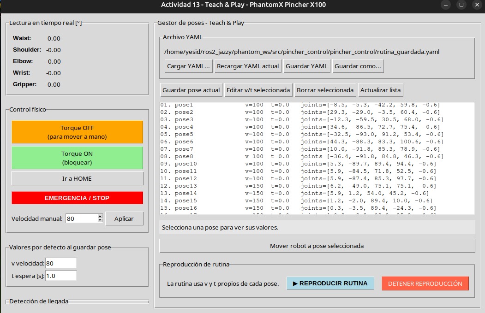
</p>

### 17.6. Video de implementación

En el siguiente video se observa la interacción completa descrita. Se evidencia la manipulación del robot sin torque, el guardado secuencial de las poses en la lista de la interfaz y la creación del documento estructurado YAML. Finalmente, se muestra la reproducción autónoma de la rutina; durante esta, se puede verificar en la barra de estado inferior cómo el software monitoriza el error máximo de manera ininterrumpida para dar paso a la configuración subsiguiente.

- [Video de implementación y simulación del modo Teach & Play (Actividad 13)](https://drive.google.com/file/d/1jYDjLFx-pTjw6QV7CfhET46cKieBFShB/view?usp=drive_link)

## 18. Actividad 14. Trazado de una figura
Para hacer el trazado virtual de una figura geométrica con el robot la trayectoria se definió como una secuencia de puntos cartesianos:

```math
\mathbf{p}_i=
\begin{bmatrix}
x_i & y_i & z_i & \theta_i
\end{bmatrix}^{T}
```

Para cada punto se aplicó el modelo de cinemática inversa desarrollado en la
Actividad 12, con el propósito de obtener una configuración articular válida:

```math
\mathbf{q}_i=
\begin{bmatrix}
q_{1,i} & q_{2,i} & q_{3,i} & q_{4,i}
\end{bmatrix}^{T}
```

El recorrido se representó virtualmente en RViz mediante una línea que muestra
la trayectoria deseada y otra que se actualiza conforme el robot visita los
puntos de la figura.

Para desarrollar la actividad se implementó el nodo de ROS 2 que realiza las siguientes operaciones:

[Ver código fuente de la Actividad 14](./Codes/actividad14_trazado_figura.py)


### 18.1. Figuras disponibles

El programa permite seleccionar una de las siguientes figuras:

```text
square
triangle
circle
```

La selección se realiza mediante el argumento:

```bash
--figure
```

Por defecto, el programa ejecuta:

```python
default="square"
```

Por lo tanto, cuando no se especifica ningún argumento, se genera un cuadrado.

| Opción | Figura |
|---|---|
| `square` | Cuadrado |
| `triangle` | Triángulo |
| `circle` | Círculo aproximado mediante puntos |


### 18.2. Sistema de referencia

Los puntos cartesianos se definieron con respecto al frame:

```python
BASE_FRAME = "world"
```

Cada punto contiene:

- Posición $x$ en metros.
- Posición $y$$ en metros.
- Altura $z$ en metros.
- Orientación `pitch` $(\theta)$ en grados.

Durante el trazado, la altura y la orientación se mantienen constantes,
mientras las coordenadas x, y cambian para formar la figura.


### 18.3. Generación del cuadrado

El cuadrado se definió mediante cuatro vértices y el retorno al punto inicial.

Los parámetros predeterminados fueron:

| Parámetro | Valor |
|---|---:|
| Centro en x | 0.120 m |
| Centro en y | -0.090 m |
| Altura en z | 0.300 m |
| Longitud del lado | 0.120 m |
| Orientación | -35° |
| Puntos por lado | 12 |

Si s representa la longitud del lado, los vértices se calculan mediante:

```math
\begin{aligned}
P_1 &=
\left(x_c-\frac{s}{2},\,y_c-\frac{s}{2}\right) \\
P_2 &=
\left(x_c+\frac{s}{2},\,y_c-\frac{s}{2}\right) \\
P_3 &=
\left(x_c+\frac{s}{2},\,y_c+\frac{s}{2}\right) \\
P_4 &=
\left(x_c-\frac{s}{2},\,y_c+\frac{s}{2}\right)
\end{aligned}
```

Finalmente, se vuelve a \(P_1\) para cerrar la figura.

Con 12 puntos por lado y el punto final de cierre, la trayectoria contiene:

```math
4(12)+1=49\ \text{puntos}
```


### 18.4. Generación del triángulo

El triángulo implementado es equilátero y se define mediante tres vértices.

Los parámetros predeterminados fueron:

| Parámetro | Valor |
|---|---:|
| Centro en x | 0.110 m |
| Centro en y | -0.090 m |
| Altura z | 0.300 m |
| Longitud del lado | 0.156 m |
| Orientación | -35° |
| Puntos por lado | 14 |

La altura geométrica del triángulo se calcula como:

```math
h=\frac{\sqrt{3}}{2}s
```

Los vértices se distribuyen alrededor del centro geométrico y se añade
nuevamente el primer punto al final para cerrar la figura.

La trayectoria contiene:

```math
3(14)+1=43\ \text{puntos}
```


### 18.5. Generación del círculo

El círculo se aproximó mediante una secuencia de puntos cartesianos.

Los parámetros predeterminados fueron:

| Parámetro | Valor |
|---|---:|
| Centro en x | 0.120 m |
| Centro en y | -0.090 m |
| Altura z | 0.300 m |
| Radio | 0.078 m |
| Orientación | -35° |
| Divisiones | 48 |

Para cada ángulo $(\alpha_i)$, las coordenadas se calcularon mediante:

```math
x_i=x_c+r\cos(\alpha_i)
```

```math
y_i=y_c+r\sin(\alpha_i)
```

con:

```math
\alpha_i=\frac{2\pi i}{N}
```

donde N=48.

Se generaron 49 puntos, incluyendo nuevamente el punto inicial para cerrar el
círculo.


### 18.6. Interpolación cartesiana de los lados

Para el cuadrado y el triángulo, los puntos intermedios de cada lado se
generaron mediante interpolación lineal.

Dados dos puntos consecutivos $(P_0)$ y $(P_1)$, cada punto intermedio se
calculó como:

```math
\mathbf{p}(\alpha)
=
\mathbf{p}_0+
\alpha
\left(
\mathbf{p}_1-\mathbf{p}_0
\right)
```

donde:

```math
0\leq\alpha<1
```

La interpolación se aplica a:

```math
x,\ y,\ z,\ \theta
```

En esta implementación, $(z)$ y $(\theta)$ permanecen constantes, por lo que
la figura se encuentra contenida en un plano paralelo al plano xy.


### 18.7. Cinemática inversa de cada punto

Para cada punto se calcula inicialmente el ángulo de la base:

```math
q_1
=
\mathrm{atan2}(y,x)
```

La distancia radial es:

```math
r=\sqrt{x^2+y^2}
```

La orientación se relaciona con las articulaciones del plano mediante:

```math
\theta=-(q_2+q_3+q_4)
```

Después de retirar el efecto del último eslabón, se calcula el centro de la
muñeca:

```math
r_w=r-L_4\sin(\phi)
```

```math
z_w=z-Z_0-L_4\cos(\phi)
```

donde:

```math
\phi=-\theta
```

La distancia hasta el centro de la muñeca es:

```math
D=\sqrt{r_w^2+z_w^2}
```

El punto se considera geométricamente alcanzable cuando:

```math
|A_1-L_3|
\leq D\leq
A_1+L_3
```


### 18.8. Soluciones de codo arriba y codo abajo

Para cada punto alcanzable se calculan dos soluciones mediante:

```math
\cos\delta=
\frac{
D^2-A_1^2-L_3^2
}{
2A_1L_3
}
```

Las soluciones corresponden a:

```math
\delta_{\text{codo abajo}}
=
+\arccos(\cos\delta)
```

```math
\delta_{\text{codo arriba}}
=
-\arccos(\cos\delta)
```

Las etiquetas utilizadas por el programa son:

```text
codo_abajo
codo_arriba
```

Después de calcular las variables auxiliares, se obtienen:

```math
q_2=u-\gamma
```

```math
q_3=v-u+\gamma
```

```math
q_4=\phi-v
```

Cada solución se valida mediante cinemática directa antes de ser utilizada con codo arriba, codo abajo y los límites articulares.


### 18.9. Visualización en RViz

El trazado virtual se publica en el tópico:

```text
/actividad14_trace
```

El programa utiliza mensajes:

```text
visualization_msgs/msg/Marker
```

La figura deseada y el trazo ejecutado se publican mediante marcadores
`LINE_STRIP`.

El marcador del punto actual utiliza el tipo:

```text
SPHERE
```

El tópico fue configurado con durabilidad:

```text
TRANSIENT_LOCAL
```

Esto permite que RViz reciba el último marcador publicado incluso cuando se
conecta después de iniciar el nodo.


### 18.10. Configuración de RViz

Para visualizar la figura se debe agregar un display de tipo:

```text
Marker
```

y seleccionar el tópico:

```text
/actividad14_trace
```

También se debe verificar que el `Fixed Frame` de RViz sea:

```text
world
```


### 18.11. Secuencia de ejecución

La rutina sigue el siguiente procedimiento:

1. Esperar los estados articulares publicados en `/joint_states`.
2. Configurar la velocidad de perfil en `60`.
3. Generar los puntos cartesianos de la figura.
4. Publicar la figura deseada completa en RViz.
5. Seleccionar el primer punto.
6. Calcular su cinemática inversa.
7. Verificar la alcanzabilidad.
8. Validar los límites articulares.
9. Seleccionar la solución de codo arriba o la solución válida más cercana.
10. Interpolar el movimiento articular.
11. Publicar la configuración en `/pincher/command`.
12. Añadir el punto a la trayectoria ejecutada.
13. Repetir el procedimiento para todos los puntos.
14. Guardar los resultados y generar la gráfica en el plano \(xy\).


### 18.12. Ejecución del programa

Para trazar el cuadrado:

```bash
python3 actividad14_trazado_figura.py --figure square
```

Para trazar el triángulo:

```bash
python3 actividad14_trazado_figura.py --figure triangle
```

Para trazar el círculo:

```bash
python3 actividad14_trazado_figura.py --figure circle
```


### 18.13. Resultados

#### Video de simulación
- [Video de simulación actividad 14](https://drive.google.com/file/d/1IM4lrkmaZOeeK3_MgOf6iAJCWdrtb9SH/view?usp=drive_link)

#### Resultados cuadrado
- [Archivo que muestra todos los puntos](./Resultados_Actividades/Actividad14/actividad14_square_puntos.csv)
<p align="center">
  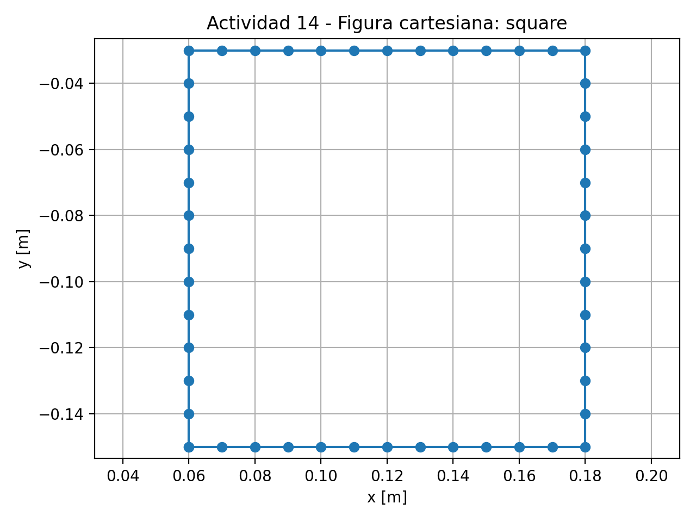
</p>

#### Resultados triángulo
- [Archivo que muestra todos los puntos](./Resultados_Actividades/Actividad14/actividad14_triangle_puntos.csv)
<p align="center">
  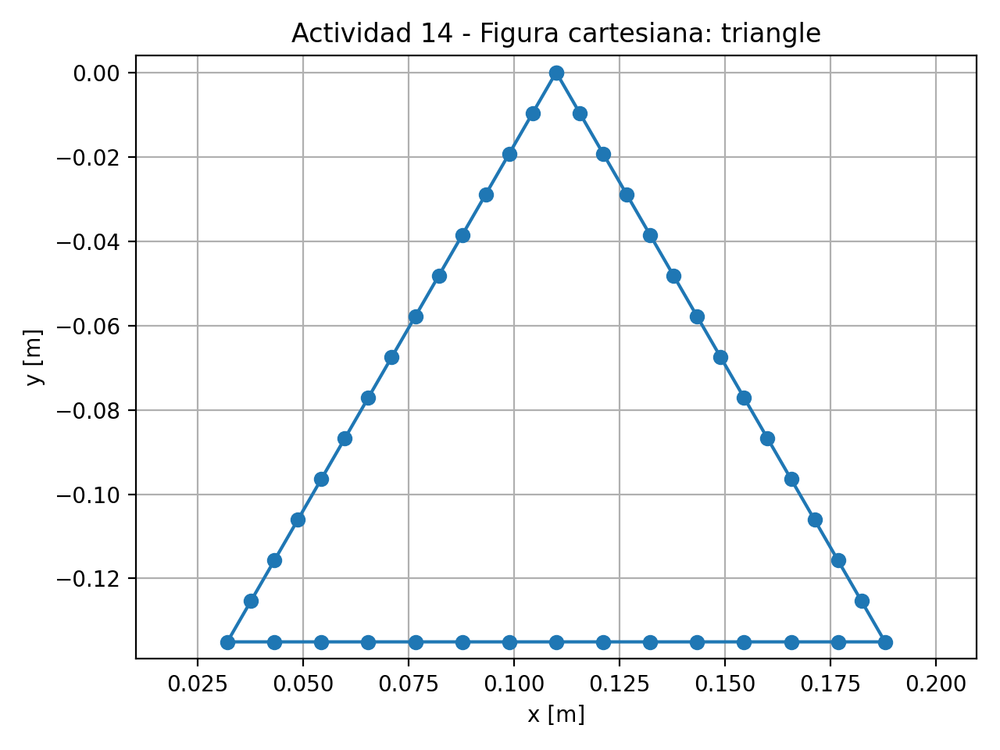
</p>

#### Resultados círculo
- [Archivo que muestra todos los puntos](./Resultados_Actividades/Actividad14/actividad14_circle_puntos.csv)
<p align="center">
  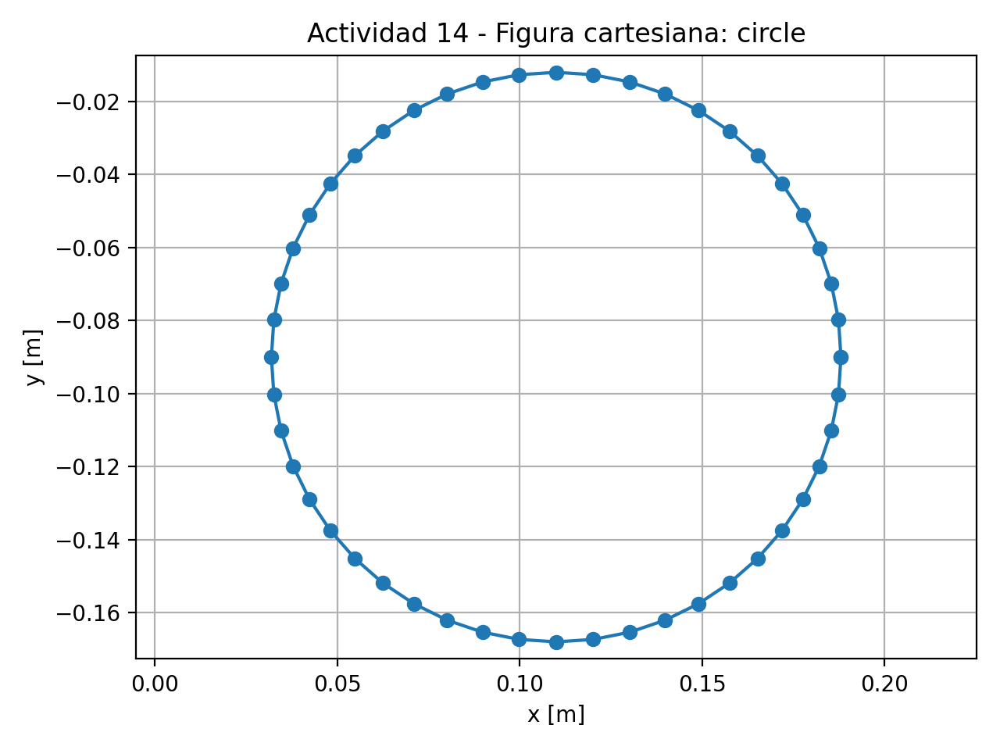
</p>


## 19. Actividad 15. Reto final: coreografía robótica
Para esta actividad se usó el código creado en la actividad 13, se aprovechó el espaciado temporal entre poses, se tuvo en cuenta la velocidad para evitar movimientos bruscos y overhangs por inercia, y se acabó enfocando los movimientos rápidos en las articulaciones
más cercanas al efector final para evitar dichos efectos inerciales:
- [Video de reto de baile (Actividad 15)](https://drive.google.com/file/d/1ohT5SI5eYY-PyRBRIDprFiCcbH9Kq--g/view?usp=drive_link)

## 20. Conclusiones

El laboratorio permitió integrar el control articular y cartesiano del robot
Phantom X Pincher X100 mediante ROS 2 Jazzy, utilizando una estructura modular
basada en nodos independientes. Esta organización facilitó la ejecución,
validación y documentación de cada actividad, además de permitir la reutilización
de funciones de comunicación, seguridad, interpolación y cinemática.

Respecto a actividade en específico, sepuede decir que las pruebas de calibración mostraron que las posiciones medidas siguen de forma
cercana las referencias enviadas. La muñeca presentó el menor error máximo,
mientras que el codo registró la mayor desviación. También se identificaron
pequeños errores sistemáticos que pueden considerarse en futuras rutinas de
compensación.

Tambien, la comparación entre movimientos evidenció que la estrategia simultánea fue
más eficiente que la secuencial, al reducir el tiempo total. Sin
embargo, ambas estrategias generan trayectorias diferentes del TCP y deben
seleccionarse según las necesidades de coordinación, seguridad y precisión de
la tarea.

Por otro lado, en la generación de trayectorias, la interpolación cúbica produjo transiciones
más suaves que la interpolación lineal, especialmente en la articulación de la
base. Por su parte, las pruebas sinusoidales demostraron que el error de
seguimiento aumenta al incrementar la amplitud y la frecuencia, debido a la
mayor velocidad angular requerida por el servomotor.

El modelo de cinemática directa presentó una correspondencia adecuada con RViz,
con errores de posición inferiores a `10 mm` en las configuraciones evaluadas.
La cinemática inversa permitió calcular soluciones de codo arriba y codo abajo,
validar límites articulares, seleccionar configuraciones apropiadas y detectar
correctamente posiciones fuera del espacio de trabajo.

Las actividades de enseñanza y repetición de poses, trazado virtual de figuras
y coreografía demostraron que las herramientas desarrolladas pueden integrarse
para construir rutinas de mayor complejidad. El uso de archivos CSV, YAML,
gráficas y marcadores en RViz permitió registrar, visualizar y analizar los
resultados de manera organizada.

Finalmente, se comprobó que la validación de límites, el uso de velocidades
controladas, el retorno a `HOME` y la simulación previa en RViz son elementos
fundamentales para operar el robot de manera segura. En conjunto, los resultados
cumplieron los objetivos planteados y permitieron aplicar de forma práctica los
conceptos de control, trayectorias y cinemática de manipuladores.