

<picture>
    <source srcset="https://imgur.com/5bYAzsb.png" media="(prefers-color-scheme: dark)">
    <source srcset="https://imgur.com/Os03JoE.png" media="(prefers-color-scheme: light)">
    
</picture>

<h3>Curso de Robótica 2026-I</h3>
<h1>Laboratorio No. 2</h1>
<h2>Robótica Industrial: Análisis y Operación del Manipulador Motoman MH6</h2>
<h3>Motoman MH6 · RoboDK</h3>

<h4>Profesores: Pedro Fabián Cárdenas Herrera · Manuel Felipe Carranza Montenegro</h4>
<h4>Estudiantes: Janan Libardo Carreño Riaño · Cristian Stiven Hoyos Peralta · Jose Andres Zapata Piñeros</h4>

  
  
  
  

---

## Tabla de Contenidos

1. [Introducción](#1-introducción)
2. [Resultados de Aprendizaje](#2-resultados-de-aprendizaje)
3. [Comparación Técnica: Motoman MH6 vs ABB IRB140](#3-comparación-técnica-motoman-mh6-vs-abb-irb140)
4. [Configuraciones Iniciales del Motoman MH6](#4-configuraciones-iniciales-del-motoman-mh6)
   - [4.1 Home 1](#41-home-1)
   - [4.2 Home 2](#42-home-2)
   - [4.3 Posición Óptima](#43-posición-óptima)
5. [Movimientos Manuales del Manipulador](#5-movimientos-manuales-del-manipulador)
   - [5.1 Movimiento por Articulaciones (Joint Mode)](#51-movimiento-por-articulaciones-joint-mode)
   - [5.2 Movimiento Cartesiano (XYZ Mode)](#52-movimiento-cartesiano-xyz-mode)
   - [5.3 Traslaciones en Ejes X, Y, Z](#53-traslaciones-en-ejes-x-y-z)
   - [5.4 Rotaciones en Ejes X, Y, Z](#54-rotaciones-en-ejes-x-y-z)
6. [Control de Velocidad](#6-control-de-velocidad)
7. [Software RoboDK](#7-software-robodk)
   - [7.1 Aplicaciones Principales](#71-aplicaciones-principales)
   - [7.2 Comunicación con el Manipulador](#72-comunicación-con-el-manipulador)
8. [Comparación: RoboDK vs RobotStudio](#8-comparación-robodk-vs-robotstudio)
9. [Trayectoria Polar](#9-trayectoria-polar)
   - [9.1 Fundamento Matemático](#91-fundamento-matemático)
   - [9.2 Diseño, Simulación e Implementación](#92-diseño-simulación-e-implementación)
10. [Diagrama de Flujo](#10-diagrama-de-flujo)
11. [Plano de Planta](#11-plano-de-planta)
12. [Videos](#12-videos)
13. [Conclusiones](#13-conclusiones)
14. [Anexos](#14-anexos)

---

## 1. Introducción

Los manipuladores industriales constituyen una de las herramientas fundamentales de la automatización moderna, siendo ampliamente utilizados en procesos de manufactura, ensamble, soldadura, pintura y manipulación de materiales, entre otros. Cada modelo de manipulador presenta características técnicas, configuraciones y modos de operación particulares que determinan su idoneidad para distintas aplicaciones industriales.

El presente laboratorio tiene como propósito realizar un análisis comparativo entre el manipulador industrial Motoman MH6 de Yaskawa y el robot ABB IRB140, profundizando en las capacidades técnicas, configuraciones iniciales y modos de operación del primero. Adicionalmente, se explora el entorno de simulación y programación RoboDK como herramienta para la generación *offline* de trayectorias y su ejecución directa sobre el hardware físico del manipulador.

Como actividad central del laboratorio, se diseñó, simuló y ejecutó una trayectoria polar en el manipulador Motoman MH6, utilizando RoboDK como plataforma de programación y comunicación con el controlador DX100. Esta práctica permite integrar conceptos de cinemática, programación de robots y coordinación hombre-máquina en un contexto de operación real.

---

## 2. Resultados de Aprendizaje

Al finalizar la presente práctica, el estudiante habrá desarrollado las siguientes competencias:

- Comprensión de las diferencias entre las características técnicas del manipulador Motoman MH6 y el IRB140.
- Identificación y descripción de las configuraciones iniciales (*home1* y *home2*) del manipulador Motoman MH6.
- Ejecución de movimientos manuales del manipulador Motoman en distintos modos de operación: articulaciones, cartesianos, traslaciones y rotaciones.
- Control de los niveles de velocidad para el movimiento manual del manipulador Motoman MH6.
- Comprensión de las principales aplicaciones del software RoboDK y su mecanismo de comunicación con el manipulador.
- Análisis de las diferencias entre RobotStudio y RoboDK.
- Diseño, simulación y ejecución de una trayectoria polar mediante RoboDK sobre el manipulador Motoman físico.

---

## 3. Comparación Técnica: Motoman MH6 vs ABB IRB140

El siguiente cuadro presenta una comparación detallada de las especificaciones técnicas de ambos manipuladores industriales, con base en las hojas de datos oficiales de los fabricantes Yaskawa y ABB, respectivamente.

| Característica | Motoman MH6 | ABB IRB140 |
|:---|:---:|:---:|
| **Fabricante** | Yaskawa | ABB |
| **Estructura** | Robot articulado | Robot articulado |
| **Grados de libertad** | 6 (expandible a 8 con riel de suelo) | 6 |
| **Carga útil máxima** | 6 kg | 6 kg |
| **Alcance máximo** | 1,422 mm | 800 mm |
| **Repetibilidad posicional** | ±0.08 mm | ±0.03 mm |
| **Peso del robot** | 130 kg | 98 kg |
| **Controlador** | DX100 | IRC5 con RobotWare |
| **Vel. máx. eje 1 (S)** | 220°/s | 200°/s |
| **Vel. máx. eje 2 (L)** | 200°/s | 200°/s |
| **Vel. máx. eje 3 (U)** | 220°/s | 260°/s |
| **Vel. máx. eje 4 (R)** | 410°/s | 360°/s |
| **Vel. máx. eje 5 (B)** | 410°/s | 360°/s |
| **Vel. máx. eje 6 (T)** | 610°/s | 450°/s |
| **Rango articulación 1 (S)** | ±170° | ±180° |
| **Rango articulación 2 (L)** | −90° a +155° | −90° a +110° |
| **Rango articulación 3 (U)** | −175° a +250° | −230° a +50° |
| **Rango articulación 4 (R)** | ±180° | ±200° |
| **Rango articulación 5 (B)** | −45° a +225° | ±115° |
| **Rango articulación 6 (T)** | ±360° | ±400° |
| **Configuración de montaje** | Suelo, pared, suspendido | Suelo, pared, suspendido |
| **Temperatura de operación** | 0 a +45 °C | +5 a +45 °C |
| **Consumo de potencia** | 1.5 kVA (promedio) | 0.44 kW a 1000 mm/s |
| **Protección IP** | — | IP67 (hasta muñeca) |
| **Aceleración máx. TCP** | — | 57 m/s² |
| **Software de programación** | MotoSim EG, RoboDK | RobotStudio, RoboDK |
| **Lenguaje de programación** | INFORM III | RAPID |
| **Aplicaciones típicas** | Soldadura por arco, manipulación, ensamble, empaquetado, dispensado | Manejo de materiales, ensamble electrónico, fundición, *clean room*, soldadura |

**Análisis comparativo:**

Ambos manipuladores comparten la misma carga útil de 6 kg y el mismo número de grados de libertad; sin embargo, presentan diferencias sustanciales en su concepción de diseño y prestaciones operativas. El Motoman MH6 sobresale notablemente por su mayor alcance (1,422 mm frente a 800 mm del IRB140), haciéndolo más adecuado para operaciones en espacios de trabajo amplios. En velocidad angular, el MH6 también supera al IRB140 en cuatro de sus seis ejes —especialmente en los ejes distales R, B y T (410°/s y 610°/s frente a 360°/s y 450°/s), lo que lo favorece en tareas de alta cadencia productiva. Por su parte, el ABB IRB140 ofrece mejor repetibilidad posicional (±0.03 mm frente a ±0.08 mm del MH6), siendo la opción más adecuada en aplicaciones de alta precisión como el ensamble electrónico. Adicionalmente, el IRB140 cuenta con protección IP67 en la muñeca, lo que amplía su rango de aplicación en entornos con presencia de líquidos o polvo.

---

## 4. Configuraciones Iniciales del Motoman MH6

El manipulador Motoman MH6 cuenta con dos posiciones de referencia predefinidas denominadas *Home 1* y *Home 2*, las cuales sirven como puntos de inicio, finalización de tareas y calibración del sistema de coordenadas del robot.

### 4.1 Home 1

La posición *Home 1* (*Work Home Position — Origin*) constituye la postura base o neutral de referencia del manipulador Motoman MH6. En esta configuración, el eje U (antebrazo) se orienta horizontalmente y el eje R (muñeca) queda en posición vertical, resultando en la postura de reposo característica del robot. Esta configuración facilita la referencia de inicio del sistema y las verificaciones rápidas de calibración, al tiempo que minimiza los torques estáticos sobre las articulaciones, prolongando la vida útil de los frenos eléctricos. Es comúnmente empleada como posición de inicio en aplicaciones de embalaje y manipulación de materiales.

Los valores de las articulaciones para esta posición, expresados en pulsos de encoder tal como los reporta el controlador DX100, son los siguientes:

| Articulación | Denominación | Origen (pulsos) | Actual (pulsos) |
|:---:|:---:|:---:|:---:|
| Eje 1 | S | 0 | 1 |
| Eje 2 | L | −115,290 | −115,291 |
| Eje 3 | U | −111,622 | −111,621 |
| Eje 4 | R | 1 | 0 |
| Eje 5 | B | 42,647 | 42,646 |
| Eje 6 | T | 1,392 | 1,393 |

> *Los valores se expresan en pulsos de encoder del controlador DX100. La columna "Actual" corresponde a la posición medida en el momento de la captura; la diferencia respecto al origen es de ±1 pulso, lo que confirma la correcta calibración del sistema.*

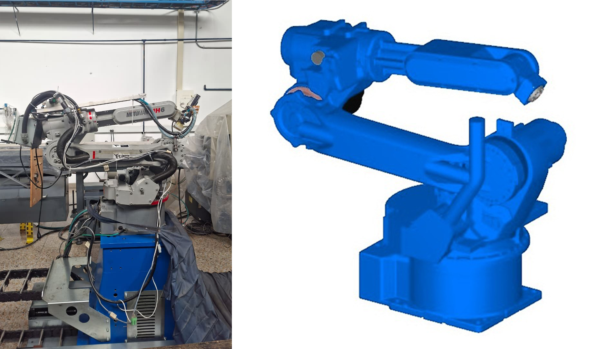
> *Figura 1. Configuración Home 1 del manipulador Motoman MH6 — postura base/neutral de referencia (U horizontal, R vertical).*

### 4.2 Home 2

La posición *Home 2* (*Second Home Position*) corresponde a una postura elevada y retraída, diseñada específicamente para operaciones de mantenimiento, cambio de herramienta y tránsito seguro del manipulador dentro de la celda. En esta configuración, el brazo adopta una geometría más extendida verticalmente que en el *Home 1*, lo cual proporciona mayor espacio de acceso a los elementos mecánicos del robot y reduce el riesgo de interferencias durante el desplazamiento entre estaciones de trabajo.

Los valores de las articulaciones para esta posición, expresados en pulsos de encoder, son los siguientes:

| Articulación | Denominación | Especificado (pulsos) | Actual (pulsos) | Diferencia |
|:---:|:---:|:---:|:---:|:---:|
| Eje 1 | S | 0 | 0 | 0 |
| Eje 2 | L | 2,037 | 2,037 | 0 |
| Eje 3 | U | 2,359 | 2,359 | 0 |
| Eje 4 | R | 0 | 0 | 0 |
| Eje 5 | B | −121 | −121 | 0 |
| Eje 6 | T | 1,392 | 1,392 | 0 |

> *Los valores de L, U y B próximos a cero confirman que el Home 2 sitúa al robot en una postura casi extendida verticalmente, con desviaciones mínimas respecto al cero mecánico. La diferencia nula en todas las articulaciones evidencia que el robot se encontraba exactamente en la posición especificada al momento de la captura.*

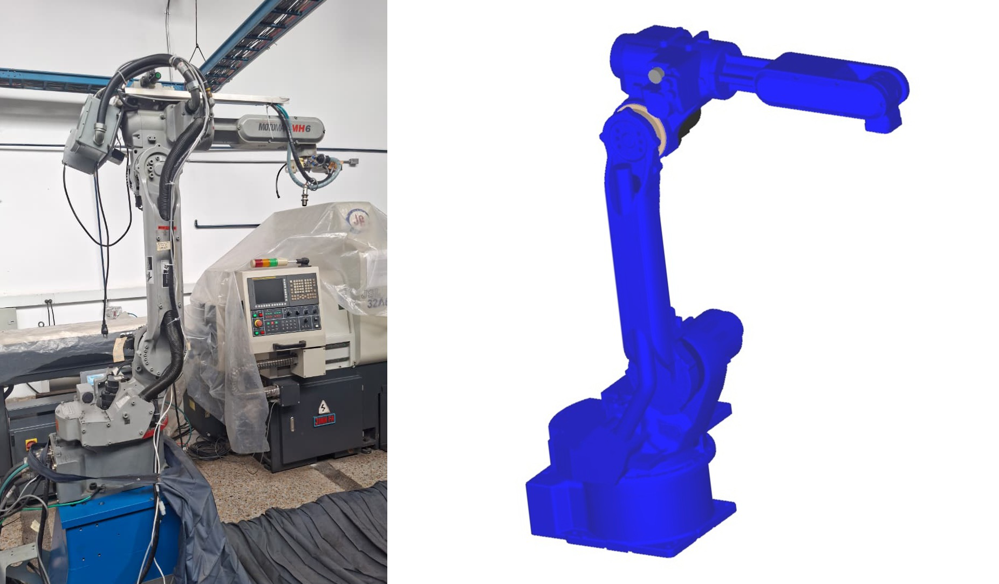
> *Figura 2. Configuración Home 2 del manipulador Motoman MH6 — postura elevada/retraída para mantenimiento y tránsito seguro.*

### 4.3 Posición Óptima

Desde el punto de vista operativo, el **Home 1** representa la posición más adecuada como referencia de inicio para la mayoría de las aplicaciones industriales del Motoman MH6. Esta elección se fundamenta en los siguientes criterios:

1. **Minimización de torques gravitacionales:** La postura base/neutral del *Home 1* distribuye de forma equilibrada las cargas sobre los actuadores, reduciendo el torque estático que deben sostener los frenos eléctricos en reposo y prolongando su vida útil.
2. **Referencia de calibración confiable:** Al ser la postura de cero mecánico del sistema, el *Home 1* facilita la verificación de la calibración del robot y la detección temprana de desvíos en la repetibilidad posicional.
3. **Coherencia con protocolos de inicio de ciclo:** La mayoría de los programas de producción exigen una posición de inicio claramente definida y reproducible; el *Home 1* cumple esta condición al estar asociado directamente a los encoders de referencia del sistema.
4. **El *Home 2* se reserva** para escenarios de mantenimiento preventivo, cambio de herramienta o movilización del manipulador entre estaciones, donde la postura elevada ofrece mayor accesibilidad mecánica y seguridad para el personal técnico.

---

## 5. Movimientos Manuales del Manipulador

El manipulador Motoman MH6 se controla manualmente a través del terminal de programación portátil (*Teach Pendant*) asociado al controlador DX100. A continuación se describe el procedimiento completo, desde el encendido del sistema hasta la ejecución de movimientos en los distintos modos disponibles.

### 5.0 Procedimiento de Encendido y Activación del Sistema

Antes de ejecutar cualquier movimiento manual, es necesario energizar y configurar correctamente el sistema. La secuencia recomendada es la siguiente:

1. **Energizar los breakers del Motoman:** Activar los tres interruptores termomagnéticos identificados con la etiqueta *MOTOMAN* en el tablero eléctrico de la celda.

2. **Energizar el totalizador:** Activar el interruptor principal ubicado en el cofre totalizador de la celda.

3. **Encender el controlador DX100:** Girar la perilla en la puerta del controlador a la posición de encendido para energizar la unidad de control.

  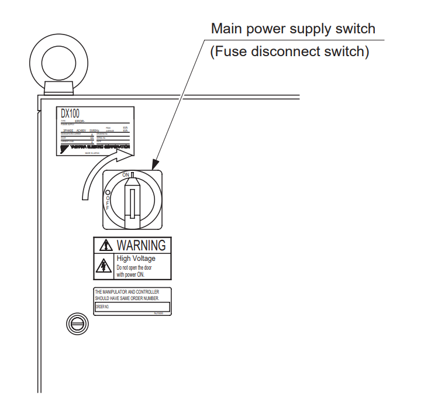
   <em>Figura A. Perilla de encendido del controlador DX100. Tomado de: <a href="https://people.wallawalla.edu/~ralph.stirling/classes/engr480/docs/Motoman/dx100_155494-1CD.pdf">Manual DX100</a>.</em>

4. **Desenrollar el cable del *Teach Pendant*:** Extender el cable cuidando no pisarlo; pasarlo por detrás del cuello según la indicación del monitor de seguridad.

5. **Liberar la parada de emergencia:** Girar el hongo (*Emergency Stop Button*) del *Teach Pendant* en sentido horario hasta que quede desbloqueado.

  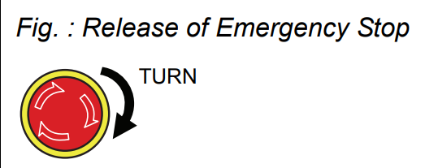
   <em>Figura B. Botón de paro de emergencia del Teach Pendant. Tomado de: <a href="https://people.wallawalla.edu/~ralph.stirling/classes/engr480/docs/Motoman/dx100_155494-1CD.pdf">Manual DX100</a>.</em>

6. **Seleccionar el modo Teach:** Con la llave del selector de modo (*Mode Switch*), girar a la posición **TEACH**.

  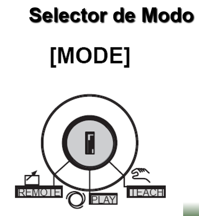
   <em>Figura C. Selector de modo del Teach Pendant. Tomado de: Presentación Fundamentos de Robótica Industrial.</em>

7. **Acceder al menú de robot:** En el *Teach Pendant*, navegar al menú **Robot**.

8. **Habilitar servos:** Presionar el botón **SERVO ON READY**. El LED se encenderá al presionar simultáneamente el botón de hombre muerto (*Enable*) en la parte posterior del pendant. Esto habilita los accionadores y permite recibir comandos de movimiento.

  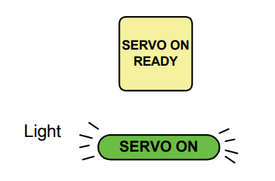
  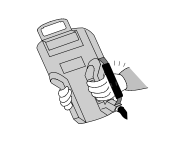
   <em>Figura D. Botón SERVO ON READY y LED de confirmación. Tomado de: <a href="https://people.wallawalla.edu/~ralph.stirling/classes/engr480/docs/Motoman/dx100_155494-1CD.pdf">Manual DX100</a>.</em>

> *Fuente del procedimiento: [Manual del Controlador DX100 — Yaskawa Motoman](https://people.wallawalla.edu/~ralph.stirling/classes/engr480/docs/Motoman/dx100_155494-1CD.pdf)*

### 5.1 Movimiento por Articulaciones (*Joint Mode*)

En el modo articular, cada uno de los seis ejes del manipulador puede desplazarse de forma independiente respecto a su eje de rotación propio.

**Procedimiento:**

1. Verificar que el selector de modo se encuentre en posición **TEACH**.
2. Presionar la tecla `[COORD]` hasta que en la pantalla aparezca el icono de modo articular (JOINT). El ciclo de modos disponibles al presionar `[COORD]` se muestra a continuación:

  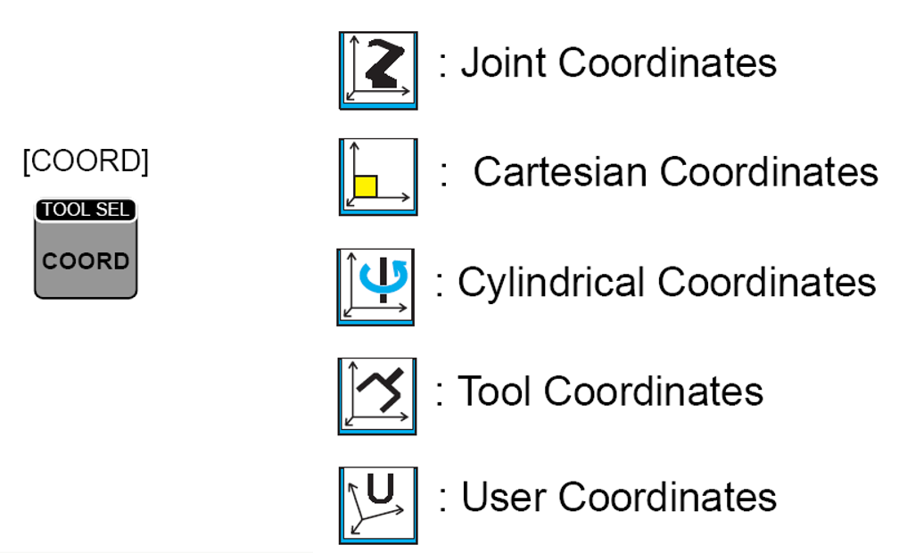
   <em>Figura 3a. Modos de movimiento disponibles mediante la tecla COORD. Tomado de: Presentación Fundamentos de Robótica Industrial.</em>

3. El icono correspondiente al modo articular (JOINT) es el siguiente:

  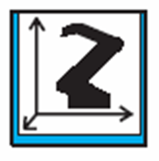
   <em>Figura 3b. Icono de modo articular en la pantalla del Teach Pendant. Tomado de: Presentación Fundamentos de Robótica Industrial.</em>

4. Mantener presionada la tecla de habilitación `[ENABLE]` (parte posterior del pendant).
5. Presionar simultáneamente `[L-SHIFT]` y la tecla del eje correspondiente. Los botones S, L, U, R, B, T corresponden al espacio articular; los botones X, Y, Z corresponden al espacio cartesiano:

  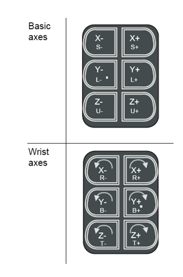
   <em>Figura 3c. Distribución de botones de ejes en el Teach Pendant DX100. Tomado de: Presentación Fundamentos de Robótica Industrial.</em>

| Articulación | Denominación | Sentido positivo | Sentido negativo |
|:---:|:---:|:---:|:---:|
| Eje 1 | S | `[L-SHIFT] + [S+]` | `[L-SHIFT] + [S−]` |
| Eje 2 | L | `[L-SHIFT] + [L+]` | `[L-SHIFT] + [L−]` |
| Eje 3 | U | `[L-SHIFT] + [U+]` | `[L-SHIFT] + [U−]` |
| Eje 4 | R | `[L-SHIFT] + [R+]` | `[L-SHIFT] + [R−]` |
| Eje 5 | B | `[L-SHIFT] + [B+]` | `[L-SHIFT] + [B−]` |
| Eje 6 | T | `[L-SHIFT] + [T+]` | `[L-SHIFT] + [T−]` |

### 5.2 Movimiento Cartesiano (*XYZ Mode*)

En el modo cartesiano, el punto central de la herramienta (TCP — *Tool Center Point*) se desplaza siguiendo los ejes del sistema de referencia del mundo o de la herramienta, manteniendo la orientación o variándola de forma controlada.

**Procedimiento para cambiar al modo cartesiano:**

1. Presionar la tecla `[COORD]` repetidamente hasta que la pantalla muestre el icono de modo cartesiano (XYZ):

  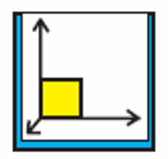
   <em>Figura 4. Icono de modo cartesiano en la pantalla del Teach Pendant. Tomado de: Presentación Fundamentos de Robótica Industrial.</em>

2. El ciclo de selección de sistemas de referencia disponibles (JOINT → XYZ → TOOL → CYLINDER → ...) se recorre con presiones sucesivas de la tecla `[COORD]`. Se recomienda utilizar el marco **BASE** para desplazamientos globales, **USER/FRAME** para trayectorias relativas a un dispositivo de trabajo, y **TOOL** para orientar la herramienta sin modificar la posición del TCP.

### 5.3 Traslaciones en Ejes X, Y, Z

Una vez en modo cartesiano, las traslaciones del TCP a lo largo de los ejes coordenados se ejecutan con las siguientes combinaciones de teclas:

| Dirección | Teclas |
|:---:|:---:|
| +X | `[L-SHIFT] + [X+]` |
| −X | `[L-SHIFT] + [X−]` |
| +Y | `[L-SHIFT] + [Y+]` |
| −Y | `[L-SHIFT] + [Y−]` |
| +Z | `[L-SHIFT] + [Z+]` |
| −Z | `[L-SHIFT] + [Z−]` |

### 5.4 Rotaciones en Ejes X, Y, Z

Las rotaciones del TCP alrededor de los ejes cartesianos (manteniendo la posición del TCP fija) se realizan con las siguientes combinaciones:

| Rotación | Teclas |
|:---:|:---:|
| +Rx | `[L-SHIFT] + [Rx+]` |
| −Rx | `[L-SHIFT] + [Rx−]` |
| +Ry | `[L-SHIFT] + [Ry+]` |
| −Ry | `[L-SHIFT] + [Ry−]` |
| +Rz | `[L-SHIFT] + [Rz+]` |
| −Rz | `[L-SHIFT] + [Rz−]` |

---

## 6. Control de Velocidad

El controlador DX100 del Motoman MH6 dispone de un sistema de control de velocidad para el movimiento manual (*Jog Speed / Teach Speed*) que permite al operador ajustar con precisión la velocidad de desplazamiento según el nivel de riesgo y el grado de precisión requerido en cada fase del proceso de enseñanza (*Teaching*).

### 6.1 Niveles de Velocidad para Movimiento Manual (Modo Teach)

| Nivel | Denominación | Rango aproximado | Uso recomendado |
|:---:|:---:|:---:|:---|
| 1 | INCHING (avance por pasos) | < 1 mm/s por pulsación | Posicionamiento fino en zonas de riesgo o precisión crítica |
| 2 | SLOW — Baja | ≈ 1–20 mm/s | Aproximación a piezas, zonas con posibilidad de interferencias |
| 3 | MEDIUM — Media | ≈ 20–150 mm/s | Desplazamientos intermedios en área despejada |
| 4 | FAST — Alta | ≈ 150–300+ mm/s | Movimientos amplios en zonas completamente libres de obstáculos |

Para el modo de reproducción automática (*Play*), el controlador DX100 dispone adicionalmente de un **Speed Override** expresado en porcentaje (5%–100%), con el cual se escala la velocidad programada en el Job. Se recomienda iniciar siempre en valores bajos (5–10%) y aumentar progresivamente tras verificar la trayectoria.

### 6.2 Cambio entre Niveles de Velocidad

El cambio de nivel se realiza mediante dos teclas dedicadas en el *Teach Pendant*:

- **`[FAST]`** `▲` — incrementa el nivel de velocidad un paso hacia arriba.
- **`[SLOW]`** `▼` — reduce el nivel de velocidad un paso hacia abajo.

Cada pulsación desplaza el nivel exactamente un paso dentro de la escala disponible, sin necesidad de mantener la tecla presionada.

### 6.3 Identificación del Nivel en la Interfaz

El nivel de velocidad activo se visualiza en el área superior de la pantalla del *Teach Pendant* DX100 mediante un icono y un valor numérico porcentual (por ejemplo: `5%`, `25%`, `50%`, `100%`). La pantalla muestra simultáneamente:

- El **modo de coordenadas activo** (JOINT / XYZ / TOOL).
- El **modo de jog** (articular, cartesiano, cilíndrico).
- El **porcentaje de velocidad** o denominación del nivel (SLOW / MEDIUM / FAST).

Este indicador se actualiza en tiempo real con cada cambio, permitiendo al operador confirmar visualmente la velocidad seleccionada antes de ejecutar cualquier movimiento.

> **Criterios de seguridad para la selección de velocidad:**
> - Emplear *INCHING* o *SLOW* al aproximarse a la pieza o a zonas con riesgo de colisión.
> - Utilizar *MEDIUM* para desplazamientos en área despejada durante la enseñanza de puntos intermedios.
> - Reservar *FAST* únicamente para movimientos de gran amplitud en zonas completamente libres y con visibilidad total del brazo.
> - En las primeras pruebas de reproducción automática, iniciar siempre con *Override* al 5–10% e incrementar gradualmente.

  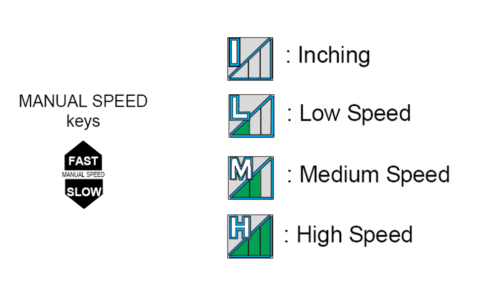
   <em>Figura 5a. Iconos de nivel de velocidad en la pantalla del Teach Pendant DX100. Tomado de: Presentación Fundamentos de Robótica Industrial.</em>

  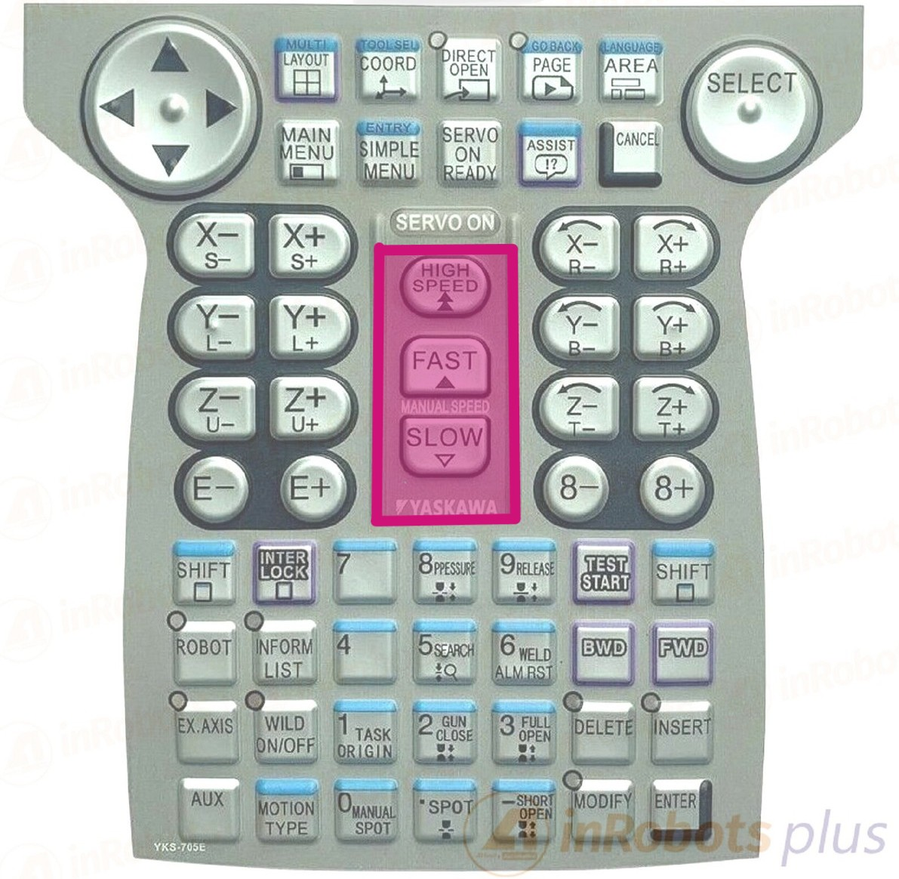
   <em>Figura 5b. Botones de selección de velocidad FAST/SLOW en el Teach Pendant DX100. Tomado de: Presentación Fundamentos de Robótica Industrial.</em>

---

## 7. Software RoboDK

### 7.1 Aplicaciones Principales

RoboDK es una plataforma de simulación y programación *offline* de robots industriales, compatible con más de 500 modelos de distintos fabricantes. Sus principales aplicaciones comprenden:

- **Programación offline:** Permite diseñar y validar trayectorias sin interrumpir la operación del robot real, reduciendo tiempos de paro en producción y eliminando riesgos de colisión durante las fases de desarrollo.
- **Simulación de celdas robóticas:** Facilita la modelización completa de celdas de manufactura, incluyendo posicionadores, herramientas, piezas de trabajo y elementos de seguridad.
- **Generación de código nativo mediante *post-processors*:** RoboDK convierte los programas generados en el lenguaje nativo del controlador de cada robot (INFORM III para Motoman, RAPID para ABB, KRL para KUKA, TP para FANUC, entre otros), garantizando compatibilidad directa con el hardware.
- **Optimización de trayectorias:** Permite analizar alcanzabilidad, detección de singularidades y conflictos de articulaciones antes de la ejecución sobre el hardware real.
- **Programación a partir de datos CAD/CAM:** Soporta la importación de trayectorias desde modelos CAD, facilitando aplicaciones de mecanizado, soldadura y recubrimiento de superficies.
- **API Python:** Ofrece una interfaz de programación en Python que permite la generación automatizada y parametrizada de trayectorias matemáticamente complejas.

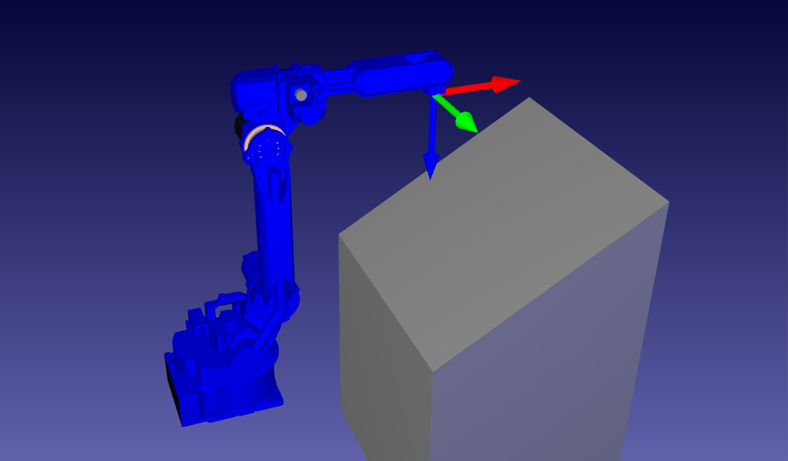
> *Figura 6. Interfaz principal de RoboDK con el modelo del Motoman MH6 cargado.*

### 7.2 Comunicación con el Manipulador

**¿Qué hace RoboDK para mover el manipulador?**

RoboDK genera el programa de movimiento en el lenguaje INFORM III del controlador DX100 a través de su *post-processor* específico para Motoman. Este programa contiene las instrucciones de movimiento (MOVJ para movimientos articulares, MOVL para lineales, MOVC para circulares), las posiciones en el espacio de trabajo y los parámetros de velocidad y zona de tolerancia posicional.

**¿Cómo se comunica RoboDK con el manipulador?**

RoboDK ofrece tres modalidades de comunicación con el manipulador Motoman MH6:

**Modalidad 1 — Conexión Online (Driver Ethernet, TCP/IP):**

Es el método empleado en el presente laboratorio. RoboDK se conecta al controlador DX100 mediante una red de área local (LAN) a través de su *driver* dedicado para Motoman. El proceso es el siguiente:

1. En RoboDK, hacer clic derecho sobre el robot en el árbol de la estación → **Conectar al robot**.
2. Ingresar la dirección **IP del controlador** y el **puerto** de comunicación.
3. Verificar que el controlador esté en modo **REMOTE** con los permisos de comunicación habilitados.
4. Hacer clic en **Conectar**; RoboDK ejecutará un *handshake* con el DX100.
5. Una vez establecida la conexión, los comandos `robot.MoveJ()` y `robot.MoveL()` de la API Python se traducen en tiempo real a instrucciones del controlador, sincronizando el movimiento virtual con el físico.

**Modalidad 2 — Programación Offline + Transferencia de programa (.JBI):**

RoboDK genera el programa completo en formato INFORM III (archivo `.JBI`) mediante **Program → Generate Program** utilizando el *post-processor* Motoman. El archivo se transfiere al controlador DX100 por **USB o FTP** y se ejecuta desde el *Teach Pendant*. Esta modalidad no requiere conexión en red durante la ejecución.

**Modalidad 3 — API Python externa → RoboDK → Robot:**

Un script Python externo controla RoboDK a través de su API (`robodk.robolink`), y RoboDK a su vez gestiona el robot mediante el *driver* o genera el `.JBI`. Esta arquitectura en capas es especialmente útil para flujos de automatización avanzada e integración con software de proceso o visión artificial.

---

## 8. Comparación: RoboDK vs RobotStudio

### 8.1 Tabla Comparativa

| Característica | RoboDK | RobotStudio |
|:---|:---:|:---:|
| **Desarrollador** | RoboDK Inc. | ABB |
| **Compatibilidad de robots** | Multimarca — más de 500 fabricantes | Exclusivo para robots ABB |
| **Lenguaje de scripting/programación** | Python, C#, C++, Matlab, Java | RAPID |
| **Licenciamiento** | Comercial / versión educativa limitada gratuita | Base gratuita; módulos avanzados (PowerPacs) de pago |
| **Fidelidad de simulación** | Media — cinemática, colisiones, orientación de herramienta | Alta — Virtual Controller con firmware ABB real (RobotWare) |
| **Programación offline (OLP)** | Sí | Sí |
| **Virtual commissioning** | Limitado | Completo — emula RAPID, I/O, FlexPendant y eventos |
| **Comunicación online con robot** | Mediante *drivers* TCP/IP por fabricante | Integrada nativamente con controlador IRC5 |
| **Generación de código nativo** | Sí — mediante *post-processors* configurables por marca | Sí — genera RAPID directamente |
| **Soporte CAD/CAM** | Sí — importación STEP/IGES/DXF y *path on surface* | Sí — integración con herramientas de trayectoria ABB |
| **Análisis de singularidades** | Sí | Sí |
| **MultiMove (coordinación multi-robot)** | Básico | Nativo y completo |
| **SafeMove (configuración de seguridad)** | No | Sí |
| **Curva de aprendizaje** | Suave — interfaz intuitiva | Media-alta — requiere conocimiento de RAPID y el sistema ABB |
| **Ecosistema objetivo** | Multi-marca: educación, integración, OLP ágil | ABB exclusivo: pre-comisionamiento, producción, mantenimiento |

### 8.2 Análisis por Dimensiones de Ingeniería

**Arquitectura y fidelidad de simulación:**
RoboDK utiliza un motor cinemático propio con modelos de robots de múltiples fabricantes. Su fortaleza radica en la programación *offline* (OLP), la generación de *post-processors* por marca y los *drivers* de conexión online. RobotStudio, en contraste, incluye un *Virtual Controller* (VC) con el firmware real de ABB (RobotWare), lo que le otorga una fidelidad de simulación considerablemente superior: los tiempos de ciclo, zonas de blend, eventos de E/S y comportamientos de MultiMove se comportan prácticamente igual que en la celda física. Si la celda es 100% ABB y se requiere pre-comisionar con máxima fidelidad, RobotStudio es la herramienta superior; si se trabaja con marcas mixtas o se requiere agilidad en OLP, RoboDK ofrece mayor versatilidad.

**Lenguajes, programación y APIs:**
RoboDK se distingue por su soporte multi-lenguaje (Python, C#, C++, Matlab, Java), que permite automatizar completamente la importación de datos CAD/CAM, el cálculo de poses, la generación de trayectorias y la exportación a código de robot. RobotStudio, por su parte, ofrece un entorno de programación RAPID completo —con IntelliSense, depuración paso a paso, herramientas de análisis de tareas y acceso al sistema ABB completo (FlexPendant virtual, Smart Components, MultiMove, SafeMove)— que resulta insustituible para el desarrollo de aplicaciones ABB de alta complejidad.

**Casos de uso recomendados:**

| Situación | Herramienta recomendada |
|:---|:---:|
| Celda con múltiples marcas de robot | RoboDK |
| Celda 100% ABB con pre-comisionamiento | RobotStudio |
| OLP rápida con integración CAD/CAM | RoboDK |
| Depuración de RAPID y validación de E/S lógicas | RobotStudio |
| Automatización por scripting multi-lenguaje | RoboDK |
| Validación de tiempos de ciclo reales | RobotStudio |
| Laboratorio universitario / multi-plataforma | RoboDK |

**Perspectiva del equipo:**
RoboDK constituye, para los integrantes del presente laboratorio, una plataforma de notable versatilidad que democratiza la programación robótica al soportar múltiples fabricantes desde una única interfaz. El conocimiento adquirido resulta directamente transferible a entornos industriales con distinta tecnología de robot. RobotStudio, a su vez, representa la herramienta de referencia del ecosistema ABB: su capacidad de emular con alta fidelidad el controlador IRC5 —incluyendo RAPID, I/O, MultiMove y SafeMove— la convierte en la solución preferida para el desarrollo de aplicaciones ABB de alta complejidad y para la reducción de tiempos de puesta en marcha en celdas de producción.

---

## 9. Trayectoria Polar

### 9.1 Fundamento Matemático

Una trayectoria polar es aquella cuya geometría se define en el sistema de coordenadas polares $(r, \theta)$, donde $r$ representa la distancia radial desde el origen y $\theta$ el ángulo de rotación medido respecto a un eje de referencia. La transformación entre coordenadas polares y cartesianas está dada por las relaciones:

$$x = r(\theta) \cdot \cos(\theta), \qquad y = r(\theta) \cdot \sin(\theta)$$

Para el presente laboratorio se implementó la curva clásica denominada **Concoide de Nicomedes** (*Conchoid of Nicomedes*), descrita originalmente por el matemático griego Nicomedes en el siglo II a.C. Su ecuación en coordenadas polares es:

$$r(\theta) = A \left(\frac{2}{\cos\theta} + 3\right) = 2A \cdot \sec(\theta) + 3A, \qquad \theta \in \left(-\frac{\pi}{2},\; \frac{\pi}{2}\right) \cup \left(\frac{\pi}{2},\; \frac{3\pi}{2}\right)$$

Con el parámetro $A = 30$ (en milímetros), la ecuación queda:

$$r(\theta) = 60\,\sec(\theta) + 90$$

La forma cartesiana equivalente se obtiene a partir de la definición geométrica de la curva: dada una recta directriz $x = b$ y un polo en el origen, la concoide se define como el lugar geométrico de los puntos sobre las semirrectas que pasan por el polo y la directriz, a una distancia $a$ de su intersección con dicha recta. La expresión cartesiana resultante es:

$$(x^2 + y^2)(x - b)^2 = a^2 x^2$$

con $b = 60$ mm (distancia del polo a la directriz) y $a = 90$ mm (desplazamiento a lo largo de las semirrectas). Dado que $a > b$, la curva presenta las dos ramas características de la concoide sin lazo interior, lo que simplifica la planificación de la trayectoria al eliminar la zona de cruce.

La curva se divide en dos ramas simétricas respecto al eje vertical para evitar la asíntota en $\theta = \pm\pi/2$, dejando un margen angular de $0.2$ rad en cada extremo. Adicionalmente, el programa escribe el texto con los nombres de los integrantes del equipo empleando la clase `TextPath` de Matplotlib, transformando los contornos de cada carácter en secuencias de movimientos lineales del robot.

### 9.2 Diseño, Simulación e Implementación

El diseño de la trayectoria se realizó íntegramente mediante la API de Python de RoboDK. El procedimiento general consistió en:

1. Definición matemática de los puntos de la Concoide de Nicomedes en el plano XY a una altura Z constante (`z_surface = 0 mm`), mediante muestreo uniforme de 360 puntos por rama sobre el parámetro $\theta$.
2. Conversión de las coordenadas polares a cartesianas mediante las relaciones trigonométricas correspondientes.
3. Ejecución de movimientos articulares (`MoveJ`) hacia el punto de inicio de cada rama para minimizar el tiempo de tránsito, seguidos de descenso lineal (`MoveL`) hasta la superficie de trabajo.
4. Trazado continuo de cada rama con instrucciones de movimiento lineal (`MoveL`) para garantizar la fidelidad geométrica de la curva.
5. Generación de los trazos de texto mediante `TextPath` de Matplotlib, con transformación de escala, centrado y rotación de 90° para adecuar la orientación al sistema de referencia del robot.
6. Verificación de alcanzabilidad y ausencia de singularidades en el entorno de simulación de RoboDK.

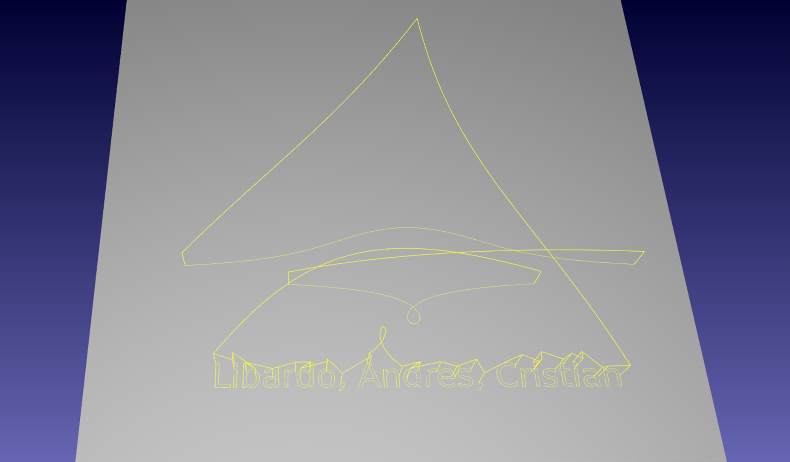
> *Figura 7. Simulación de la Concoide de Nicomedes en RoboDK — gemelo digital del Motoman MH6.*

La trayectoria validada en simulación fue transferida al manipulador Motoman MH6 del LabSIR mediante comunicación Ethernet con el controlador DX100. Los parámetros de velocidad (`300 mm/s`) y zona de transición entre puntos (`rounding = 5 mm`) fueron ajustados para garantizar la seguridad del equipo y la continuidad geométrica de la trayectoria ejecutada. La evidencia de la ejecución física se presenta en la sección de [Videos](#11-videos).

Bajo esta sección se incluyen los nombres de los integrantes del equipo que participaron en el diseño e implementación:

- Janan **Libardo** Carreño Riaño
- **Cristian** Stiven Hoyos Peralta
- Jose **Andres** Zapata Piñeros

---

## 10. Diagrama de Flujo

El siguiente diagrama de flujo describe la secuencia completa de acciones ejecutadas por el sistema robótico durante la realización de la trayectoria polar, desde la inicialización del sistema hasta el retorno a la posición de reposo.

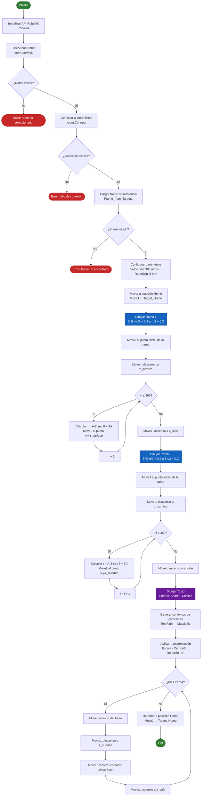

> *Figura 9. Diagrama de flujo de las acciones del robot Motoman MH6 durante la ejecución de la Concoide de Nicomedes.*

---

## 11. Plano de Planta

El siguiente plano de planta ilustra la distribución espacial de los elementos que componen la celda robótica en el LabSIR, incluyendo el manipulador Motoman MH6, el controlador DX100, la estación de programación (PC con RoboDK), los límites de la zona de seguridad y los accesos al área de trabajo.

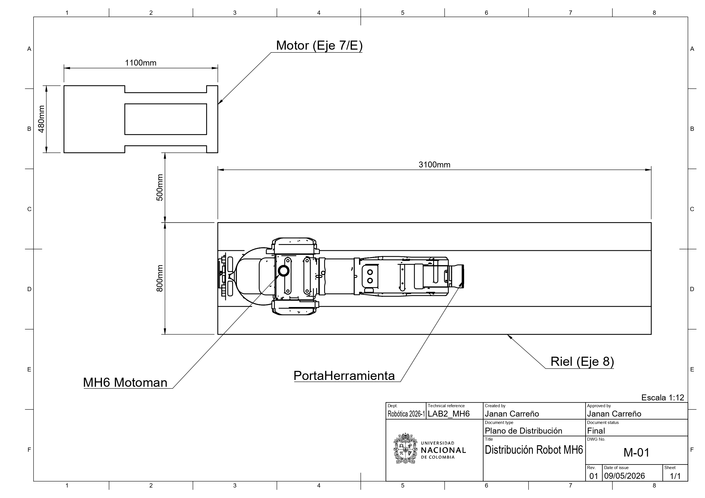
> *Figura 10. Plano de planta de la celda robótica con el manipulador Motoman MH6 en el LabSIR.*

---

## 12. Videos

El siguiente gif presenta en pantalla dividida la ejecución simultánea de la trayectoria: en la **mitad izquierda** se muestra la ejecución real del manipulador Motoman MH6 en el LabSIR, y en la **mitad derecha** el gemelo digital corriendo en RoboDK de forma sincronizada. Se evidencia el movimiento desde la posición *Home*, el trazado completo de la Concoide de Nicomedes, el trazado de los nombres de los integrantes del equipo y el retorno a *Home*.

  

> *Figura 11. Ejecución de la Concoide de Nicomedes — robot físico Motoman MH6 (izquierda) y gemelo digital en RoboDK (derecha).*

---

## 13. Conclusiones

A partir del desarrollo del presente laboratorio se derivan las siguientes conclusiones:

1. **Comparación de manipuladores:** El Motoman MH6 y el ABB IRB140 comparten carga útil y número de ejes; sin embargo, difieren significativamente en alcance y repetibilidad posicional. La selección del manipulador adecuado para una aplicación industrial debe fundamentarse en el análisis riguroso de estas métricas en función de los requerimientos específicos del proceso productivo.

2. **Configuraciones iniciales:** Las posiciones *Home 1* y *Home 2* del Motoman MH6 cumplen funciones complementarias: la primera sirve como referencia de calibración del sistema de coordenadas, mientras que la segunda ofrece mayor seguridad operativa por su postura compacta. El *Home 2* resulta más conveniente para iniciar y finalizar tareas en entornos industriales con restricciones de espacio.

3. **Modos de operación manual:** El *Teach Pendant* del controlador DX100 ofrece una interfaz estructurada para el control manual del manipulador, con una clara separación entre los modos articular y cartesiano. Esta diferenciación facilita la programación por aprendizaje (*Teaching*) y reduce la probabilidad de errores del operador durante la definición de puntos de trayectoria.

4. **RoboDK como plataforma multipropósito:** RoboDK demostró ser una herramienta eficiente para la programación *offline* y la ejecución directa de trayectorias en robots de diferentes fabricantes. Su API Python permite la generación de trayectorias matemáticamente complejas de forma sistemática, reproducible y parametrizable, abriendo la puerta a la automatización del proceso de programación.

5. **Trayectoria polar:** La implementación exitosa de la trayectoria polar en el Motoman MH6 evidenció la importancia de la planificación *offline* en la programación robótica industrial. La fase de simulación en RoboDK permitió detectar y corregir limitaciones de alcance y configuraciones singulares antes de la ejecución física, reduciendo significativamente el tiempo de puesta a punto y los riesgos asociados a la operación del manipulador real.

---

## 14. Anexos

### Anexo A: Código RoboDK — Trayectoria Polar

El código fuente desarrollado en Python para la generación y ejecución de la trayectoria polar en RoboDK se encuentra en el archivo [`code/trayectoria_polar.py`](code/trayectoria_polar.py).

### Anexo B: Recursos de Referencia

- **Manual técnico del Motoman MH6:** Documentación oficial de Yaskawa Motoman — Manual de instrucciones del controlador DX100.
- **Documentación oficial de RoboDK:** [https://robodk.com/doc/en/RoboDK-API.html](https://robodk.com/doc/en/RoboDK-API.html)
- **Coordenadas polares — referencia matemática:** [https://www.monografias.com/trabajos33/coordenadas-polares/coordenadas-polares](https://www.monografias.com/trabajos33/coordenadas-polares/coordenadas-polares)

---

Universidad Nacional de Colombia · Facultad de Ingeniería  
Departamento de Ingeniería Mecánica y Mecatrónica  
Bogotá, 2026

