

<picture>
    <source srcset="https://imgur.com/5bYAzsb.png" media="(prefers-color-scheme: dark)">
    <source srcset="https://imgur.com/Os03JoE.png" media="(prefers-color-scheme: light)">
    
</picture>
<h3>Curso de Robótica 2026-I</h3>
<h1>Laboratorio No. 03</h1>
<h2>Robótica Industrial: Análisis y Operación del Manipulador EPSON T3-401S</h2>
<h3>EPSON T3-401S · EPSON RC+ 7.5.2</h3>
<h4>Profesores: Pedro Fabián Cárdenas Herrera · Manuel Felipe Carranza Montenegro</h4>
<h4>Estudiantes: Janan Libardo Carreño Riaño · Cristian Stiven Hoyos Peralta · Jose Andres Zapata Piñeros</h4>

  
  
  
  

---

  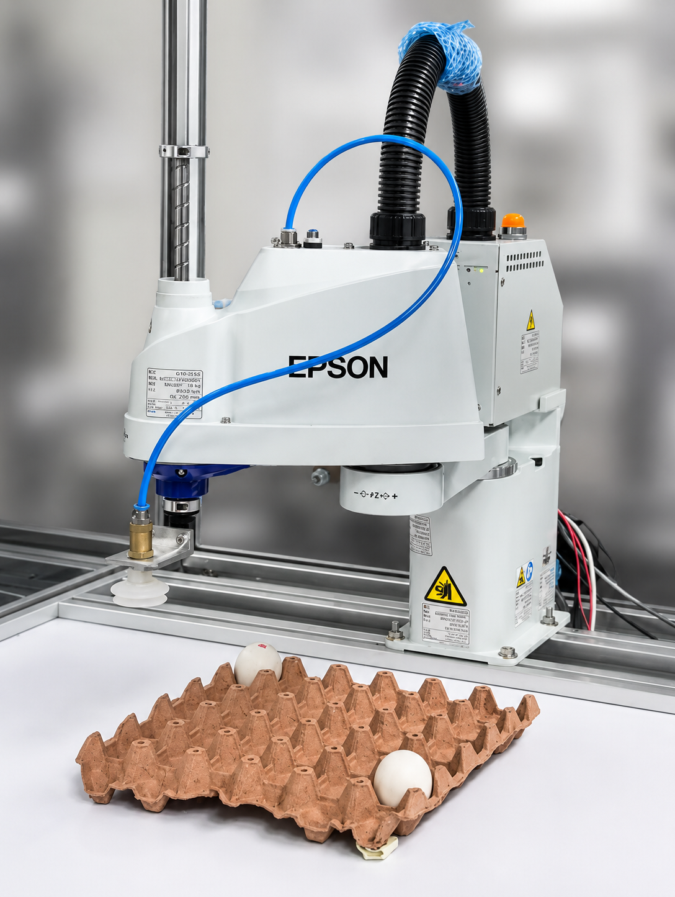
   <em>Manipulador industrial EPSON T3-401S - LabSIR UNAL</em>

---

## Tabla de Contenidos

1. [Introducción](#introducción)
2. [Cuadro Comparativo: Motoman MH6, IRB140 y EPSON T3-401S](#1-cuadro-comparativo-motoman-mh6-irb140-y-epson-t3-401s)
3. [Configuración de la posición Home](#2-configuración-de-la-posición-home)
4. [Movimientos manuales del manipulador](#3-movimientos-manuales-del-manipulador)
5. [Control y niveles de velocidad](#4-control-y-niveles-de-velocidad)
6. [Funcionalidades de EPSON RC+ 7.0](#5-funcionalidades-de-epson-rc-70)
7. [Comparación entre EPSON RC+ 7.0, RoboDK y RobotStudio](#6-comparación-entre-epson-rc-70-robodk-y-robotstudio)
8. [Diseño técnico del gripper neumático por vacío](#7-diseño-técnico-del-gripper-neumático-por-vacío)
9. [Diagrama de flujo de la rutina de movimiento](#8-diagrama-de-flujo-de-la-rutina-de-movimiento)
10. [Plano de planta - montaje](#9-plano-de-planta---montaje)
11. [Código desarrollado en SPEL+](#10-código-desarrollado-en-spel)
12. [Resultados y Videos](#11-resultados-y-videos)
13. [Referencias](#referencias)

---

## Introducción

Los manipuladores industriales son herramientas fundamentales en los procesos de automatización moderna. Cada modelo posee características técnicas y configuraciones particulares que lo hacen más apto para determinadas aplicaciones. En este laboratorio se trabajó directamente con el **EPSON T3-401S**, un robot tipo SCARA de 4 grados de libertad, utilizando **EPSON RC+ 7.5.2** como entorno de programación y simulación.

El objetivo central fue realizar una comparación técnica entre el EPSON T3-401S, el ABB IRB 140 y el Motoman MH6, comprender las configuraciones iniciales del manipulador, explorar sus modos de operación manual y diseñar un gripper neumático por vacío capaz de manipular huevos de forma segura.

Como tarea principal, se diseñó y programó en SPEL+ una rutina que manipula dos huevos ubicados en los extremos opuestos de una cubeta de 30 posiciones (6×5), cumpliendo las siguientes restricciones:

- Los huevos deben recorrer **todas** las posiciones de la cubeta.
- El movimiento debe ser **alternado** entre los dos huevos.
- El desplazamiento debe seguir estrictamente el **patrón del caballo de ajedrez**.

---

## 1. Cuadro Comparativo: Motoman MH6, IRB140 y EPSON T3-401S

| Característica | Motoman MH6 | ABB IRB140 | EPSON T3-401S |
|:---:|:---:|:---:|:---:|
| **Tipo de robot** | Articulado (6 ejes) | Articulado (6 ejes) | SCARA (4 ejes) |
| **Carga Máxima [kg]** | 6 | 5 | 3 |
| **Alcance Horizontal [mm]** | 1422 | 810 | 400 |
| **Grados de libertad** | 6 | 6 | 4 |
| **Repetibilidad [mm]** | ±0.08 | ±0.01 | ±0.02 |
| **Velocidad máxima** | 610 °/s * | 450 °/s ** | 4500 mm/s *** |
| **Temperatura de operación [°C]** | 0 – 45 | 5 – 45 | 5 – 40 |
| **Peso [kg]** | 130 | 98 | 16 |
| **Controlador** | NX100 / DX100 | IRC5 Compact | EPSON RC+ 7.0 |
| **Comunicación con PC** | Ethernet / RS-232 | Ethernet / USB | USB / Ethernet |
| **Montaje** | Piso, pared o techo | Piso, pared o invertido | Mesa (compacto) |
| **Aplicaciones típicas** | Soldadura, paletizado, manipulación de piezas | Ensamblaje, dispensado, manipulación de materiales | Pick & Place, paletizado, ensamblaje electrónico |
| **Ventajas** | Alta carga, gran alcance, estructura robusta | Preciso, compacto, ideal para espacios reducidos | Compacto, rápido, bajo costo, fácil integración |
| **Limitaciones** | Menor precisión relativa | Solo compatible con RobotStudio/ABB | Alcance corto, solo 4 ejes |

> \* Velocidad del eje 6. Los demás ejes tienen menor velocidad.  
> \*\* Velocidad del eje T. Los demás ejes tienen menor velocidad.  
> \*\*\* Velocidad lineal máxima en ejes XY. El eje J4 alcanza hasta 2600°/s.

---

## 2. Configuración de la posición Home

La posición de Home en el EPSON T3-401S es la referencia base desde la cual el robot inicia y finaliza toda rutina de trabajo. Para este laboratorio se utilizó la posición Home predeterminada del controlador, la cual garantiza que el brazo se encuentre en una postura segura, libre de colisiones con la cubeta y con el gripper elevado.

Esta posición es crítica para la rutina programada, ya que el comando `Jump` del SPEL+ obliga al robot a subir verticalmente hasta el plano Z seguro antes de desplazarse horizontalmente, evitando colisiones con la cubeta y los huevos durante los movimientos entre posiciones del paletizado.

  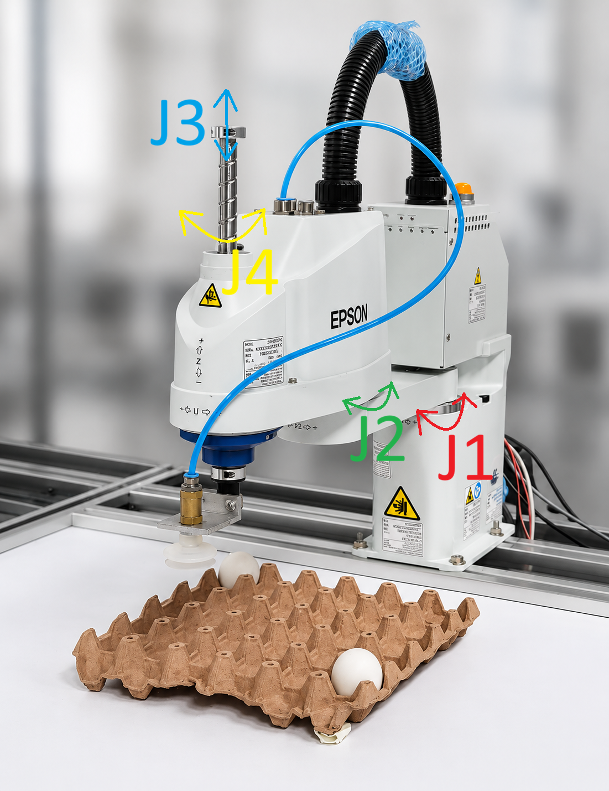
   <em>Figura: Configuración de articulaciones en posición Home</em>

  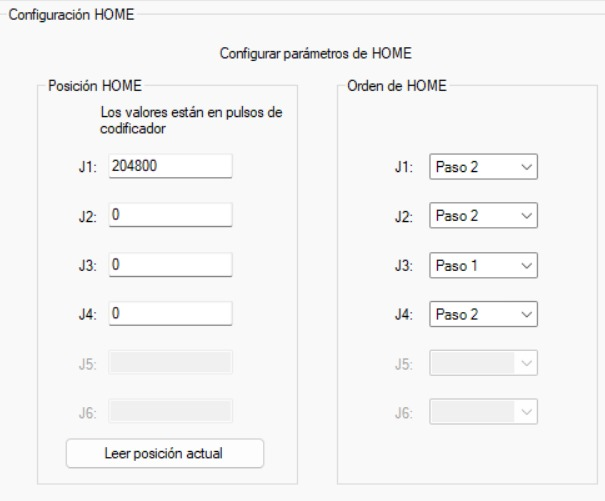
   <em>Figura: Panel de control EPSON RC+ con robot en posición Home</em>

---

## 3. Movimientos manuales del manipulador

Para operar el EPSON T3-401S de forma manual desde EPSON RC+ 7.5.2, se utiliza la ventana **Administrador de robot** junto con la pestaña **Mover y enseñar** (Jog & Teach). El procedimiento es el siguiente:

**Paso 1 — Habilitar el robot:**
Abrir el **Administrador de robot**, presionar **Reset** para limpiar cualquier alarma activa y luego activar los motores con **Motor ON**. En ese momento se escucha el enganche físico de los frenos y el robot queda listo para operar.

  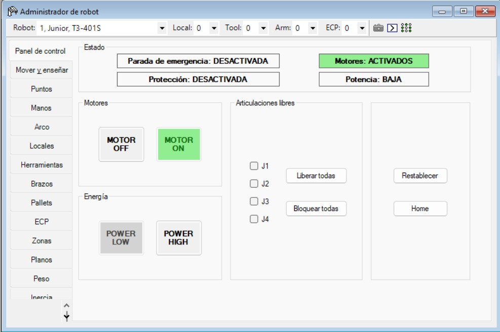
   <em>Figura: Panel de control con Motor ON activo</em>

**Paso 2 — Seleccionar el modo de movimiento:**
En la pestaña **Mover y enseñar**, el parámetro **Modo** permite elegir entre:

- **Articular (Joint):** Cada botón controla una articulación independiente (J1, J2, J3, J4). Ideal para reposicionar el robot libremente sin importar la trayectoria en el espacio.
- **Mundo (World):** El robot se desplaza en coordenadas cartesianas XYZ referenciadas a la base fija del manipulador.
- **Herramienta (Tool):** Similar al modo World, pero el desplazamiento se referencia a la orientación actual de la herramienta montada.
- **Local:** Movimiento respecto al sistema de coordenadas del punto actual.
- **ECP:** Desplazamiento a lo largo de los ejes del punto de control externo definido.

**Paso 3 — Traslaciones y rotaciones:**
En modo cartesiano, los botones **+X / -X**, **+Y / -Y** y **+Z / -Z** permiten traslaciones lineales en cada eje. Para rotaciones, el EPSON T3-401S al ser SCARA de 4 ejes únicamente permite rotar sobre el eje vertical mediante **+U / -U**, que orienta el gripper sobre su propio centro. Los botones V y W permanecen deshabilitados al no tener 6 GDL.

  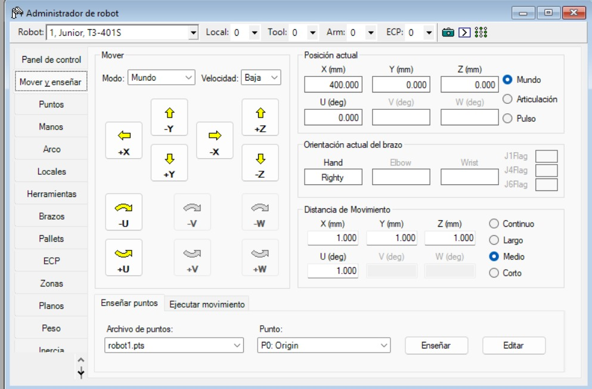
   <em>Figura: Ventana Mover y enseñar con modos de operación disponibles</em>

---

## 4. Control y niveles de velocidad

EPSON RC+ 7.5.2 ofrece dos mecanismos complementarios para controlar la velocidad del jogging manual:

### Niveles de velocidad (Power)

El selector de potencia presenta dos opciones:

- **Low (Baja):** Limita la potencia entregada a los motores. Se recomienda para aproximaciones a la cubeta, enseñanza de puntos y pruebas iniciales, ya que reduce el riesgo de colisiones por movimientos bruscos.
- **High (Alta):** Aumenta la aceleración y velocidad del robot. Útil para desplazamientos libres en espacios amplios de la mesa de trabajo.

### Distancia de avance (Jog Distance)

Define el desplazamiento por cada pulsación en los botones de movimiento:

| Modo | Descripción | Uso recomendado |
|:---:|:---:|:---:|
| **Short (Corto)** | Pasos milimétricos muy pequeños | Ajuste fino cerca de la cubeta o los huevos |
| **Medium (Medio)** | Equilibrio entre velocidad y precisión | Acercamientos intermedios dentro del área de trabajo |
| **Large (Largo)** | Pasos amplios | Desplazamientos entre extremos de la mesa |
| **Continuous** | Movimiento continuo mientras se mantiene presionado el botón | Traslados rápidos sin pasos discretos |

Adicionalmente, el software permite modificar los valores numéricos exactos en milímetros para las traslaciones (X, Y, Z) y en grados para la rotación (U), lo que da control total sobre la precisión del jogging.

  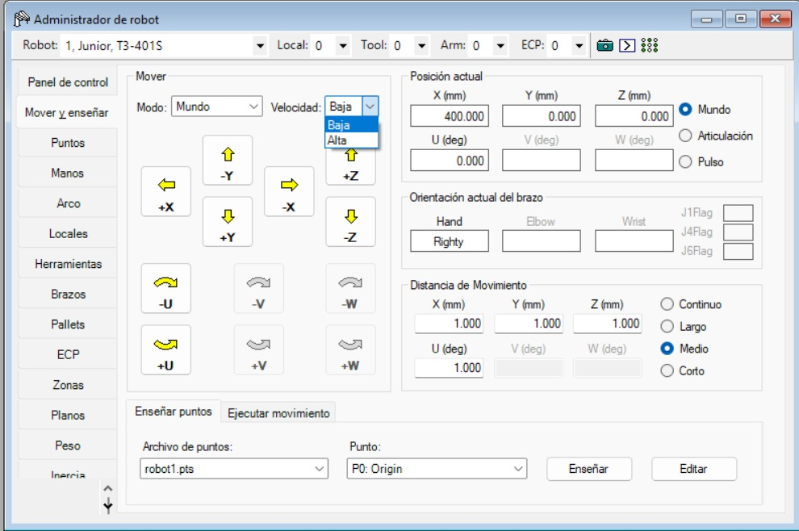
   <em>Figura: Panel de control de velocidad y distancia de avance en Jog & Teach</em>

---

## 5. Funcionalidades de EPSON RC+ 7.0

EPSON RC+ 7.0 es el entorno integrado de desarrollo (IDE) oficial de EPSON para la programación, simulación y operación de sus robots industriales. Sus principales funcionalidades son:

### 5.1 Programación en SPEL+
Lenguaje propio de EPSON orientado a aplicaciones industriales. Permite definir puntos, pallets, movimientos PTP y CP, control de E/S digitales, lógica condicional y estructuras de funciones reutilizables. Es el editor donde se escribe el programa principal (`main`) junto con todas las funciones auxiliares como `MoveEgg`, `InitTour`, `PickAndPlace`, entre otras.

  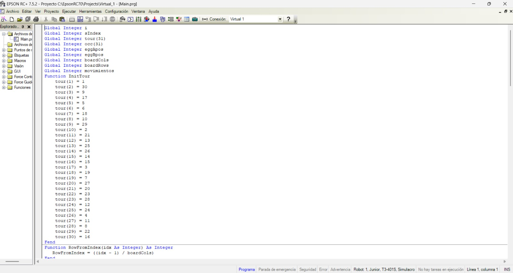
   <em>Figura: Editor de código SPEL+ mostrando el programa desarrollado en EPSON RC+ 7.5.2</em>

### 5.2 Conexión virtual y controlador simulado
Para simular sin necesidad del robot físico, se configura un controlador virtual desde **Configuración → Comunicaciones PC-Controlador**, agregando un nuevo controlador de tipo virtual. Una vez conectado, el software opera exactamente igual que con el robot real, permitiendo probar y depurar el código de forma segura antes de la implementación física.

  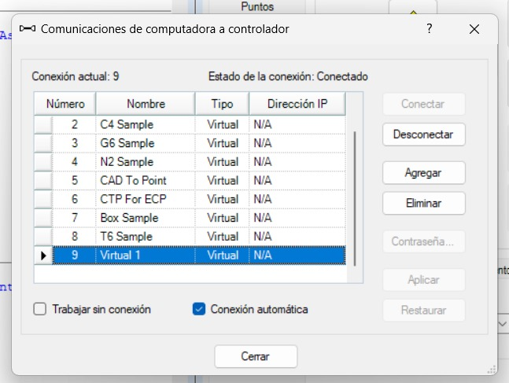
   <em>Figura: Configuración del controlador virtual en EPSON RC+ 7.5.2</em>

### 5.3 Entorno de simulación 3D
Entorno visual donde se ejecuta el programa completo y se observan los movimientos del robot en tiempo real antes de correrlo físicamente. Permite verificar trayectorias, detectar colisiones, activar el rastro del TCP (Trace) y grabar la simulación para análisis posterior.

  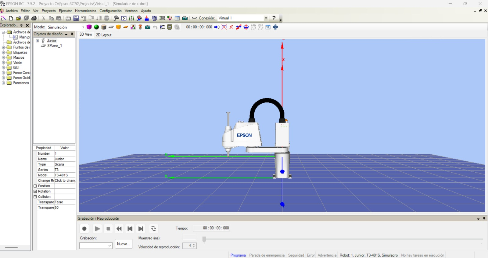
   <em>Figura: Simulador 3D con la rutina de caballo de ajedrez en ejecución</em>

### 5.4 Robot Manager (Administrador de robot)
Panel central desde donde se habilitan motores, se liberan frenos, se definen herramientas y se accede al Jog & Teach para movimientos manuales.

  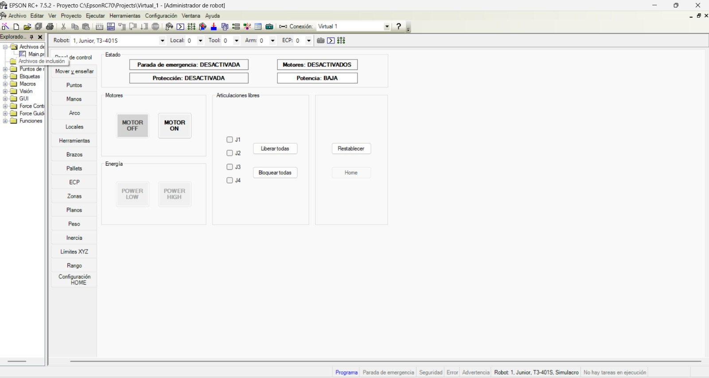
   <em>Figura: Administrador de robot con Motor ON activo</em>

### 5.5 Gestión de puntos y pallets
El comando `Pallet` permite definir matrices de posiciones a partir de tres puntos de referencia (Origin, PuntoX, PuntoY), generando automáticamente todas las coordenadas intermedias de la cubeta sin necesidad de enseñar cada celda individualmente.

### 5.6 Control de E/S digitales y comunicación
Desde el código SPEL+ se controlan las salidas digitales (`On` / `Off`) que activan o desactivan la electroválvula del gripper neumático. EPSON RC+ se comunica con el controlador físico mediante **USB o Ethernet**, enviando los comandos compilados que el controlador interpreta y convierte en señales de voltaje para los servomotores de cada articulación.

---

## 6. Comparación entre EPSON RC+ 7.0, RoboDK y RobotStudio

| Aspecto | RoboDK | RobotStudio | EPSON RC+ 7.0 |
|:---:|:---:|:---:|:---:|
| **Compatibilidad** | +900 robots de +70 fabricantes | Exclusivo ABB | Exclusivo EPSON |
| **Lenguaje** | Python, C++, C#, MATLAB | RAPID | SPEL+ |
| **Precisión de simulación** | Media (sin controlador real vinculado) | Alta (tecnología VirtualRobot, mismo software que el controlador) | Alta (controlador virtual oficial EPSON) |
| **Ventajas** | Multi-marca, integración con CAD (SolidWorks, Fusion 360), interfaz intuitiva | Gemelo digital de alta fidelidad, Add-ons para soldadura/pintura/paletizado | Integración directa robot-software, Vision Guidance, Conveyor Tracking |
| **Limitaciones** | Menor fidelidad sin controlador específico | Solo ABB, curva de aprendizaje alta | Solo EPSON, comunidad pequeña |
| **Aplicaciones** | Investigación, universidades, integradores multi-marca, impresión 3D robótica | Líneas de producción ABB, industria automotriz, programación offline de alta precisión | Pick & Place SCARA, paletizado, inspección, sistemas guiados por visión |

Desde nuestra perspectiva: **RoboDK** es la herramienta más versátil para entornos académicos y de investigación donde se trabaja con múltiples marcas de robots. **RobotStudio** es la opción de mayor fidelidad cuando el entorno es exclusivamente ABB, siendo ideal para la industria automotriz. **EPSON RC+** es la solución más directa y confiable cuando se trabaja específicamente con robots EPSON, ya que la simulación y la ejecución física comparten el mismo entorno sin necesidad de traducción de código.

---

## 7. Diseño técnico del gripper neumático por vacío

El gripper utilizado en este laboratorio es un sistema neumático por vacío compuesto por una ventosa de succión conectada a una electroválvula controlada digitalmente desde el robot.

**Componentes principales:**
- Ventosa de succión (copa de vacío)
- Electroválvula de control neumático
- Tubería de conexión
- Generador de vacío (venturi o bomba)

**Lógica de control con E/S digitales:**
La salida digital `D0_09` del robot controla la electroválvula con lógica invertida:
- `Off D0_09` → activa el vacío → **agarra el huevo**
- `On D0_09` → desactiva el vacío → **suelta el huevo**

**Consideraciones de diseño:**
La ventosa fue seleccionada con un diámetro adecuado para la superficie curva del huevo, garantizando un sello hermético suficiente para sostener el peso sin deslizamientos durante los movimientos `Jump` entre posiciones del pallet.

  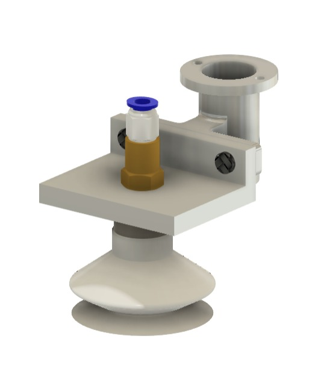
   <em>Figura: Diagrama esquemático del gripper neumático por vacío</em>

  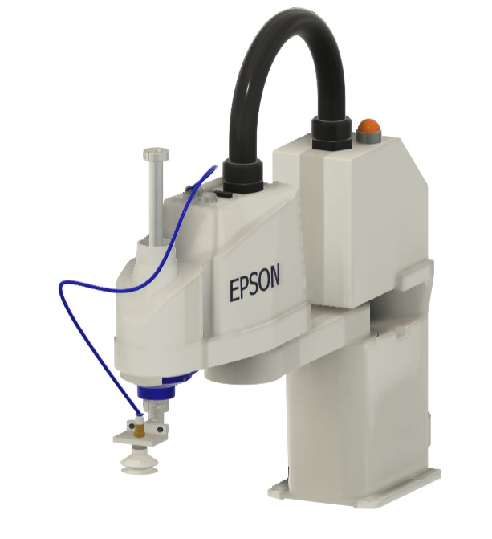
   <em>Figura: Gripper neumático montado en el EPSON T3-401S</em>

---

## 8. Diagrama de flujo de la rutina de movimiento

El siguiente diagrama describe la lógica completa del programa desarrollado en SPEL+ para el movimiento de los dos huevos siguiendo el patrón del caballo de ajedrez:

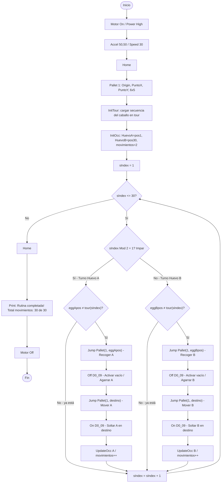

---

## 9. Plano de planta - montaje

A continuación se presenta el plano de planta con la ubicación de la cubeta de huevos respecto al robot y las posiciones iniciales de los dos huevos. El huevo A inicia en la posición 1 (esquina superior izquierda de la cubeta) y el huevo B en la posición 30 (esquina inferior derecha).

Los puntos de referencia del pallet definidos en EPSON RC+ fueron:

  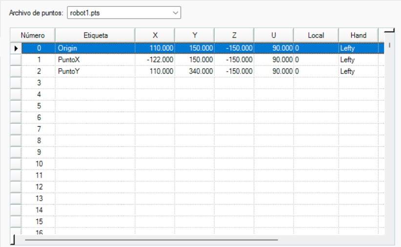
   <em>Figura: Puntos de referencia</em>

  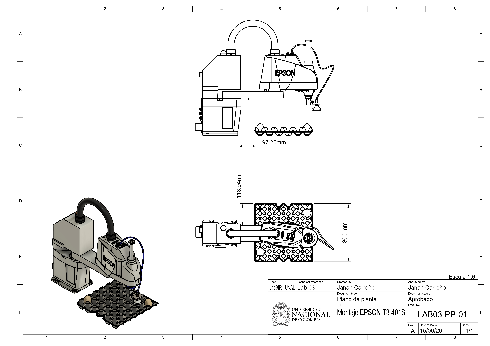
   <em>Figura: Plano de planta con ubicación de la cubeta y posiciones iniciales de los huevos</em>

  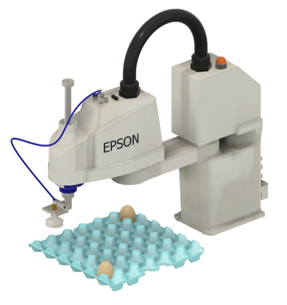
   <em>Figura: Figura: Vista frontal del montaje - EPSON T3-401S con cubeta de huevos</em>

  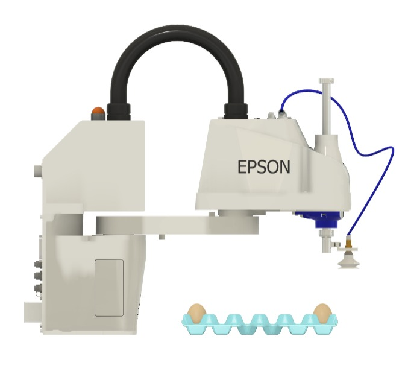
   <em>Figura: Vista lateral del montaje - EPSON T3-401S con cubeta de huevos</em>

  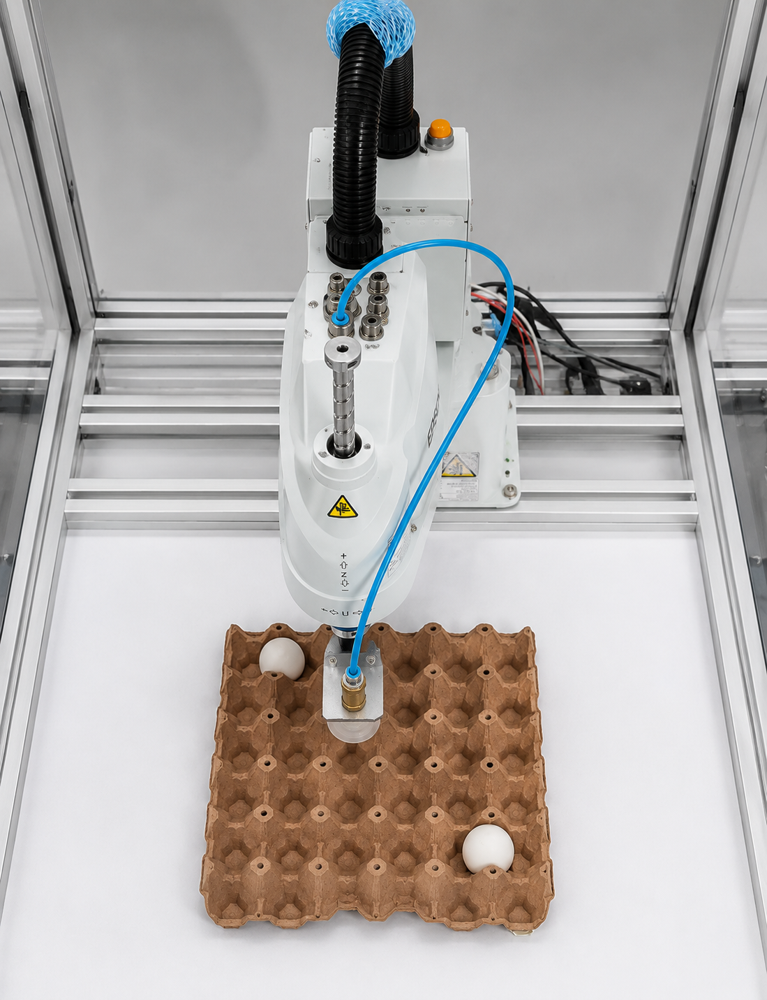
   <em>Figura: Vista superior real del montaje en el laboratorio</em>

---

## 10. Código desarrollado en SPEL+

El programa implementa un **tour del caballo de ajedrez** sobre una cubeta de 6×5 posiciones, moviendo dos huevos de forma alternada a lo largo de las 30 celdas. La secuencia de visita de cada celda está precalculada en el arreglo `tour()`, garantizando que cada movimiento sea válido según las reglas del caballo de ajedrez (desplazamiento en L: 2+1 o 1+2 celdas). El movimiento físico se gestiona mediante el comando `Jump Pallet` y la activación de la salida digital `D0_09` que controla el gripper neumático.

Durante la ejecución, la consola muestra en tiempo real el paso actual, el huevo que se está moviendo, su posición de origen y destino, y el conteo acumulado de movimientos hasta completar los 30 totales.

👉 [Ver código completo en SPEL+](Anexos/Codigo.prg)

---

## 11. Resultados y Videos

A continuación se presentan los videos de simulación e implementación física del laboratorio. Para verlos, hacer clic en la imagen correspondiente.

  <b>Video de Simulación en EPSON RC+ 7.5.2</b>

*🎥 Simulación de la rutina Caballo de Ajedrez en EPSON RC+ 7.5.2*

  <b>Video de Implementación Física</b>

*🎥 Implementación física de la rutina con Gripper Neumático - LabSIR UNAL 2026*

---

## Referencias

- [Documentación EPSON T3-401S - RoboDK](https://robodk.com/robot/es/Epson/T3-401S)
- [Manual EPSON RC+ 7.0 - Epson Global](https://global.epson.com/products/robots/)
- [EPSON RC+ 7.0 User's Guide - Epson Support](https://files.support.epson.com/far/docs/epson_rc_pl_70_users_guide-rc700_rc90(v75r9).pdf)
- [EPSON SPEL+ Language Reference](https://files.support.epson.com/far/docs/epson_spel_pl_70_language_reference-rc700_rc90(v75r8).pdf)
