<div align="center">
<picture>
    <source srcset="https://imgur.com/5bYAzsb.png" media="(prefers-color-scheme: dark)">
    <source srcset="https://imgur.com/Os03JoE.png" media="(prefers-color-scheme: light)">
    
</picture>

<h3>Curso de Robótica 2026-I</h3>
<h1>Laboratorio No. 4</h1>
<h2>Robótica de Desarrollo: Intro a ROS 2 Jazzy Jalisco — Turtlesim</h2>
<h3>ROS 2 Jazzy Jalisco · Ubuntu 24.04 LTS</h3>

<h4>Profesores: Pedro Fabián Cárdenas Herrera · Manuel Felipe Carranza Montenegro</h4>
<h4>Estudiantes: Janan Libardo Carreño Riaño · Cristian Stiven Hoyos Peralta · Jose Andres Zapata Piñeros</h4>

<p>
  
  
  
  
  
</p>
</div>

---

## Tabla de Contenidos

1. [Introducción](#1-introducción)
   - [1.1 Planteamiento del problema](#11-planteamiento-del-problema)
   - [1.2 Descripción general de la solución](#12-descripción-general-de-la-solución)
2. [Resultados de Aprendizaje](#2-resultados-de-aprendizaje)
3. [Marco Teórico](#3-marco-teórico)
   - [3.1 Nodos ROS 2](#31-nodos-ros-2)
   - [3.2 Tópicos (Publish/Subscribe)](#32-tópicos-publishsubscribe)
   - [3.3 Servicios (Request/Response)](#33-servicios-requestresponse)
   - [3.4 Turtlesim](#34-turtlesim)
4. [Preparación del Entorno](#4-preparación-del-entorno)
   - [4.1 Estructura del workspace](#41-estructura-del-workspace)
   - [4.2 Restricciones importantes del laboratorio](#42-restricciones-importantes-del-laboratorio)
   - [4.3 Compilación e instalación](#43-compilación-e-instalación)
5. [Control Manual con Teclado](#5-control-manual-con-teclado)
   - [5.1 Implementación](#51-implementación)
   - [5.2 Resultados](#52-resultados)
6. [Trayectorias Automáticas](#6-trayectorias-automáticas)
   - [6.1 Motor de trayectorias no bloqueante](#61-motor-de-trayectorias-no-bloqueante)
   - [6.2 Cuadrado (Tecla F)](#62-cuadrado-tecla-f)
   - [6.3 Triángulo equilátero (Tecla T)](#63-triángulo-equilátero-tecla-t)
   - [6.4 Trayectoria automática (Tecla M)](#64-trayectoria-automática-tecla-m)
   - [6.5 Resultados](#65-resultados)
7. [Dibujo de Letras Personalizadas](#7-dibujo-de-letras-personalizadas)
   - [7.1 Asignación de letras e iniciales reservadas](#71-asignación-de-letras-e-iniciales-reservadas)
   - [7.2 Implementación](#72-implementación)
   - [7.3 Resultados](#73-resultados)
8. [Sistema Líder-Seguidor con Dos Tortugas](#8-sistema-líder-seguidor-con-dos-tortugas)
   - [8.1 Creación de turtle2 con el servicio /spawn](#81-creación-de-turtle2-con-el-servicio-spawn)
   - [8.2 Controlador proporcional de seguimiento](#82-controlador-proporcional-de-seguimiento)
   - [8.3 Resultados](#83-resultados)
9. [Verificación de la Arquitectura ROS 2](#9-verificación-de-la-arquitectura-ros-2)
   - [9.1 ros2 node list](#91-ros2-node-list)
   - [9.2 ros2 topic list](#92-ros2-topic-list)
   - [9.3 ros2 topic echo /turtle1/pose](#93-ros2-topic-echo-turtle1pose)
   - [9.4 ros2 topic info /turtle1/cmd\_vel](#94-ros2-topic-info-turtle1cmd_vel)
   - [9.5 ros2 service list](#95-ros2-service-list)
   - [9.6 rqt\_graph](#96-rqt_graph)
10. [Diagrama de Flujo del Sistema](#10-diagrama-de-flujo-del-sistema)
11. [Video Explicativo](#11-video-explicativo)
12. [Conclusiones](#12-conclusiones)
13. [Referencias](#13-referencias)

---

## 1. Introducción

### 1.1 Planteamiento del problema

El simulador **turtlesim** es una herramienta incluida en ROS 2 que permite comprender de manera práctica los mecanismos fundamentales de comunicación del framework: nodos, tópicos, servicios y parámetros. El presente laboratorio plantea la implementación de un sistema de control completo para turtlesim que integre control manual por teclado, trayectorias automáticas, dibujo de letras personalizadas y un sistema de seguimiento entre dos tortugas.

La restricción central es que **no está permitido usar el nodo `turtle_teleop_key`**: todo el control debe provenir de nodos propios escritos en Python con `rclpy`. Esto obliga al estudiante a implementar la captura de teclado de forma concurrente con el event loop de ROS 2, garantizando que las funciones automáticas no bloqueen el nodo.

**Especificaciones del entorno:**

| Parámetro | Valor |
|-----------|-------|
| Sistema operativo | Ubuntu 24.04 LTS (Noble Numbat) |
| Distribución ROS 2 | Jazzy Jalisco |
| Lenguaje | Python 3 |
| Herramienta de compilación | colcon |
| Paquete ROS 2 | `my_turtle_controller` |

### 1.2 Descripción general de la solución

La solución se implementa en un único nodo ROS 2 (`move_turtle`) con la siguiente arquitectura concurrente:

- **Hilo de teclado**: captura teclas en modo raw usando `tty`/`termios` sin bloquear el event loop.
- **Timer de control (20 Hz)**: procesa la tecla capturada y, si hay trayectoria activa, ejecuta su siguiente paso.
- **Controlador de seguimiento**: controlador proporcional que hace que `turtle2` siga a `turtle1` con control proporcional saturado.
- **Servicios**: `SetPen`, `TeleportAbsolute` y `Spawn` se llaman de forma asíncrona (`call_async`) para no bloquear los callbacks.

<div align="center">
  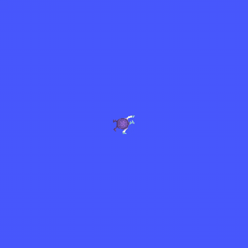
  <br><em>Demostración completa del sistema: Control manual · Cuadrado (F) · Triángulo (T) · Trayectoria automática (M) · Nueve letras del equipo · Sistema líder-seguidor</em>
</div>

---

## 2. Resultados de Aprendizaje

Al finalizar el presente laboratorio, el estudiante habrá desarrollado las siguientes competencias:

- Implementar nodos ROS 2 en Python con `rclpy` que integren publicadores, suscriptores y clientes de servicio.
- Capturar entrada de teclado de forma concurrente en un nodo ROS 2 sin bloquear el event loop.
- Diseñar un motor de trayectorias no bloqueante basado en máquina de estados por timer.
- Usar los servicios de turtlesim (`SetPen`, `TeleportAbsolute`, `Spawn`) para controlar el simulador.
- Implementar un controlador proporcional de seguimiento entre dos entidades usando retroalimentación de posición.
- Analizar la arquitectura de comunicación ROS 2 generada por los nodos, tópicos y servicios del sistema.

---

## 3. Marco Teórico

### 3.1 Nodos ROS 2

Un **nodo** es la unidad básica de ejecución en ROS 2. Encapsula una función específica del sistema (sensor, actuador, planificador) y se comunica con otros nodos mediante tópicos, servicios o acciones. En Python, un nodo se crea heredando de `rclpy.node.Node`.

### 3.2 Tópicos (Publish/Subscribe)

Los **tópicos** implementan el patrón **Publish/Subscribe** asíncrono:
- Un **publisher** emite mensajes en un canal con nombre (p. ej. `/turtle1/cmd_vel`).
- Cualquier número de **subscribers** pueden recibir esos mensajes.
- No hay garantía de entrega ni respuesta: el publisher no sabe quién escucha.

Son ideales para flujos continuos de datos como comandos de velocidad o lecturas de posición.

### 3.3 Servicios (Request/Response)

Los **servicios** implementan comunicación síncrona cliente/servidor:
- El cliente envía un `Request` y espera un `Response`.
- Son adecuados para operaciones puntuales con resultado garantizado.

En este laboratorio se usan tres servicios de turtlesim:
| Servicio | Tipo | Función |
|----------|------|---------|
| `/spawn` | `turtlesim/srv/Spawn` | Crear una nueva tortuga |
| `/turtle1/set_pen` | `turtlesim/srv/SetPen` | Controlar el lápiz de dibujo |
| `/turtle1/teleport_absolute` | `turtlesim/srv/TeleportAbsolute` | Teletransportar la tortuga |

### 3.4 Turtlesim

`turtlesim` es un simulador de robot planar incluido en ROS 2. La ventana es un cuadrado de **0 a ~11.09 unidades** en X e Y. El nodo `/turtlesim` expone:
- Tópicos de entrada: `/turtleN/cmd_vel` (`geometry_msgs/Twist`)
- Tópicos de salida: `/turtleN/pose` (`turtlesim/Pose`) con posición (x, y), ángulo θ y velocidades.
- Servicios para crear, resetear y configurar tortugas.

---

## 4. Preparación del Entorno

### 4.1 Estructura del workspace

```
my_turtle_controller_ws/
└── src/
    └── my_turtle_controller/
        ├── my_turtle_controller/
        │   ├── __init__.py
        │   └── move_turtle.py      ← nodo principal
        ├── resource/
        │   └── my_turtle_controller
        ├── package.xml
        ├── setup.cfg
        └── setup.py
```

### 4.2 Restricciones importantes del laboratorio

> Antes de comenzar, las siguientes restricciones deben respetarse en toda la implementación:

| # | Restricción |
|---|-------------|
| 1 | **Queda prohibido** usar el nodo `turtle_teleop_key` de ROS 2. Todo el control debe provenir de nodos propios escritos en Python con `rclpy`. |
| 2 | La tortuga debe **permanecer dentro de los límites** de la ventana de turtlesim (0 – 11.09 unidades en X e Y). |
| 3 | El nodo **no puede bloquearse**: ninguna función puede usar `time.sleep()` ni bucles bloqueantes dentro de callbacks de ROS 2. Toda trayectoria se ejecuta paso a paso en un timer. |
| 4 | El sistema líder-seguidor debe mantener una **distancia mínima de 0.5 u** entre tortugas para evitar colisiones. |
| 5 | Las letras que coinciden con teclas de función (`R`, `S`, `A`, `P`) deben dibujarse correctamente. Las funciones que originalmente usarían esas teclas se **reasignan** a teclas sin conflicto. |
| 6 | El dibujo de cada letra debe realizarse en una **caja de 2 × 3 unidades** centrada en la ventana (esquina inferior-izquierda: (4.0, 4.0)). |

### 4.3 Compilación e instalación

```bash
# 1. Crear workspace y paquete
source /opt/ros/jazzy/setup.bash
mkdir -p ~/my_turtle_controller_ws/src
cd ~/my_turtle_controller_ws/src
ros2 pkg create my_turtle_controller \
  --build-type ament_python \
  --dependencies rclpy geometry_msgs turtlesim

# 2. Copiar el nodo al paquete
cp move_turtle.py ~/my_turtle_controller_ws/src/my_turtle_controller/my_turtle_controller/

# 3. Registrar el entry point en setup.py
#    (editar console_scripts):
#    'move_turtle = my_turtle_controller.move_turtle:main'

# 4. Compilar
cd ~/my_turtle_controller_ws
colcon build --symlink-install
source install/setup.bash

# 5. Terminal A — lanzar turtlesim
ros2 run turtlesim turtlesim_node

# 6. Terminal B — lanzar el controlador
ros2 run my_turtle_controller move_turtle
```

---

> **Código fuente completo:** [`code/move_turtle.py`](code/move_turtle.py)

---

## 5. Control Manual con Teclado

### 5.1 Implementación

El control de teclado usa un **hilo separado** que lee en modo raw con `tty.setraw()`, evitando bloquear el event loop de ROS 2. Las teclas de flecha generan secuencias de escape de 3 bytes (`ESC [ A/B/C/D`) que se decodifican manualmente.

La tecla detectada se almacena en `self._key` y es consumida en cada ciclo del timer de control (20 Hz). El control usa **velocidad persistente**: al presionar una flecha se actualiza la velocidad almacenada (`_manual_lin`, `_manual_ang`) y ésta se mantiene activa en cada tick hasta que se presione otra tecla o `Q` para detener.

```python
if key == 'UP':
    self._manual_lin =  LIN_SPEED   # 2.0 m/s — persiste hasta nueva tecla
    self._manual_ang =  0.0
elif key == 'DOWN':
    self._manual_lin = -LIN_SPEED
    self._manual_ang =  0.0
elif key == 'LEFT':
    self._manual_ang =  ANG_SPEED   # 1.5 rad/s
    self._manual_lin =  0.0
elif key == 'RIGHT':
    self._manual_ang = -ANG_SPEED
    self._manual_lin =  0.0

self._publish_vel1(self._manual_lin, self._manual_ang)
```

Esta estrategia permite encadenar múltiples segmentos (avanzar, girar, avanzar) pulsando teclas en secuencia, lo que produce trayectorias manuales con varios trazos visibles. La detención explícita se logra con `Q`.

### 5.2 Resultados

<div align="center">
  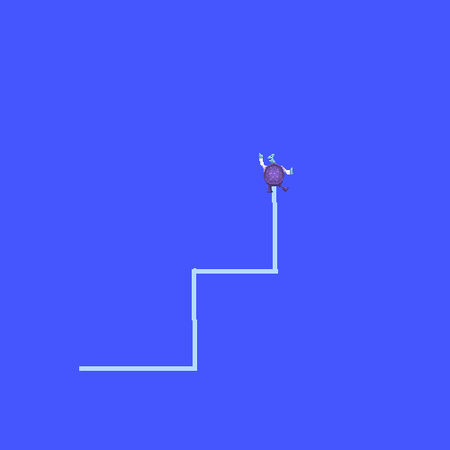
  <br><em>Figura 1. Control manual de turtle1 mediante flechas del teclado</em>
</div>

Comandos de verificación usados durante la ejecución:

```bash
ros2 topic echo /turtle1/cmd_vel
# geometry_msgs.msg.Twist(
#   linear=Vector3(x=2.0, y=0.0, z=0.0),
#   angular=Vector3(x=0.0, y=0.0, z=0.0))
```

---

## 6. Trayectorias Automáticas

### 6.1 Motor de trayectorias no bloqueante

Las trayectorias se representan como listas de **pasos** (`_traj_steps`). En cada tick de los timers (a 20 Hz, 0.05 s) se ejecuta el paso actual. Esto garantiza que el nodo nunca se bloquea:

| Tipo de paso | Acción |
|-------------|--------|
| `goto` | Controlador en lazo cerrado: gira con velocidad **angular** y avanza con velocidad **lineal** hacia el waypoint hasta alcanzarlo |
| `teleport` | Llamar a `TeleportAbsolute` (solo reposiciona con la pluma levantada) |
| `pen` | Llamar a `SetPen` (sube/baja el lápiz) |

El paso clave es **`goto`**: en cada tick calcula el error de posición y orientación hacia el waypoint y publica un `Twist`. Si la tortuga está desalineada (`|error angular| > 0.20`) **rota en el sitio** con velocidad angular; cuando se alinea, **avanza** con velocidad lineal proporcional a la distancia (con corrección fina de rumbo). Así las figuras se dibujan **conduciendo la tortuga con `cmd_vel`** —nunca con teleport para girar— lo que cumple el requisito de definir velocidades lineales y angulares, y produce un trazo animado.

```python
# Núcleo del paso 'goto' (ejecutado un tick a la vez → no bloquea)
dx, dy = step['x'] - self.pose1.x, step['y'] - self.pose1.y
dist   = math.hypot(dx, dy)
ang_err = atan2(dy, dx) - self.pose1.theta          # normalizado a [-π, π]
if abs(ang_err) > GOTO_ANG_TH:                       # desalineado → rotar
    self._publish_vel1(0.0, clamp(GOTO_ANG_GAIN * ang_err, ±GOTO_ANG_MAX))
else:                                                # alineado → avanzar
    self._publish_vel1(min(GOTO_LIN_MAX, GOTO_LIN_GAIN * dist), 1.5 * ang_err)
```

### 6.2 Cuadrado (Tecla F)

La tortuga recorre las cuatro esquinas con el controlador `goto`: avanza cada lado con velocidad lineal y **gira ~90° con velocidad angular** en cada esquina. El lazo cerrado sobre la pose evita que el error se acumule, de modo que la figura cierra.

```
Esquinas (3 u de lado): (3.5, 4.0) → (6.5, 4.0) → (6.5, 7.0) → (3.5, 7.0) → (3.5, 4.0)
```

```python
def _build_square(self):
    steps = [self._pen(False), self._tp(3.5, 4.0, 0.0), self._pen(True)]
    for x, y in square_waypoints():     # geometría compartida
        steps.append(self._goto(x, y))  # avanza + gira con cmd_vel
    steps.append(self._pen(False))
    return steps
```

### 6.3 Triángulo equilátero (Tecla T)

Misma estrategia: tres lados recorridos con `goto`, girando **~120° con velocidad angular** en cada vértice.

```
Lado 3 u · Altura h = s·√3/2 ≈ 2.598
Vértices: (3.5, 4.0) → (6.5, 4.0) → (5.0, 6.598) → (3.5, 4.0)
```

```python
def _build_triangle(self):
    steps = [self._pen(False), self._tp(3.5, 4.0, 0.0), self._pen(True)]
    for x, y in triangle_waypoints():
        steps.append(self._goto(x, y))
    steps.append(self._pen(False))
    return steps
```

### 6.4 Trayectoria automática (Tecla M)

Recorre la ventana en **zigzag (serpiente conectada)** con el controlador `goto`, avanzando y girando con velocidad lineal/angular dentro de los límites (1–10) para no salirse de los bordes.

```python
def _build_auto(self):
    wps = zigzag_waypoints()            # 6 franjas + conectores
    steps = [self._pen(False), self._tp(*wps[0], 0.0), self._pen(True)]
    for x, y in wps[1:]:
        steps.append(self._goto(x, y))
    steps.append(self._pen(False))
    return steps
```

### 6.5 Resultados

<div align="center">
  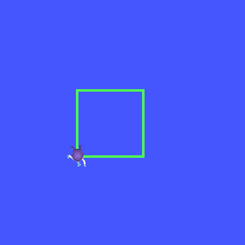
  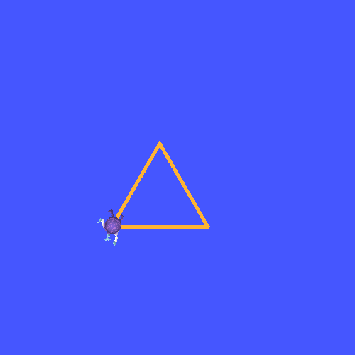
  <br><em>Figura 2. Cuadrado (izquierda) y triángulo equilátero (derecha) dibujados con las teclas F y T</em>
</div>

<div align="center">
  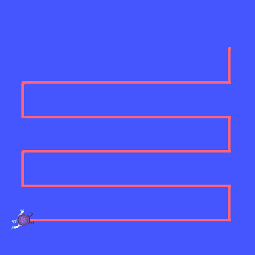
  <br><em>Figura 3. Trayectoria automática tipo zigzag activada con la tecla M</em>
</div>

---

## 7. Dibujo de Letras Personalizadas

### 7.1 Asignación de letras e iniciales reservadas

Todos los integrantes del equipo tienen sus iniciales implementadas. Las letras R, S, A y P corresponden a iniciales del equipo pero podrían generar conflicto con teclas de función intuitivas (resetear, stop, ejes WASD, pause). La solución adoptada fue **reasignar las funciones** a teclas que no pertenecen a ninguna inicial, dejando R, S, A y P exclusivamente para el dibujo de letras.

**Mapa completo de teclas del controlador:**

| Tecla | Función |
|-------|---------|
| ↑ ↓ ← → | Control manual (avanzar, retroceder, girar) |
| **Q** | Detener movimiento |
| **F** (Antes S) | Dibujar cuadrado |
| **T** | Dibujar triángulo equilátero |
| **M** (Antes A) | Trayectoria automática (zigzag) |
| **I** (Antes R) | Reiniciar posición al centro |
| **O** (Antes P) | Toggle lápiz (encender/apagar) |
| **J L C H Z** | Dibujar letra correspondiente |
| **R S A P** | Dibujar letra correspondiente (reasignadas)* |

\* Estas letras segun la guia, deben hacer otras funciones, debido a que, las iniciales de los nombres de los miembros del grupo corresponden a estas, a dichas funciones se les ha asignado otras letras

### 7.2 Implementación

Cada letra se define como **fuente de trazos (stroke font)** sobre una caja de 2×3 unidades con esquina inferior-izquierda en (4.0, 4.0), mediante `letter_strokes()` —la misma geometría que se usa en las evidencias—. Cada trazo se **dibuja conduciendo la tortuga con el controlador `goto`** (velocidad lineal y angular): se levanta la pluma y se reposiciona al inicio del trazo (teleport instantáneo, sin línea), se baja la pluma y se recorre el trazo punto a punto con `cmd_vel`, lo que anima el dibujo.

```python
def _build_letter(self, letter):
    steps = []
    for stroke in letter_strokes(letter):      # geometría compartida
        steps.append(self._pen(False))
        steps.append(self._tp(*stroke[0]))     # ir al inicio sin trazar
        steps.append(self._pen(True))
        for x, y in stroke[1:]:
            steps.append(self._goto(x, y))     # trazo animado por velocidad
        steps.append(self._pen(False))
    return steps
```

**Letra J** — barra superior corta + barra vertical + gancho inferior:
```
pen↑ → (5.0,7.0) · pen↓ → (6.0,7.0)   ← barra sup mitad derecha
pen↑ → (6.0,7.0) · pen↓ → (6.0,4.9)   ← vertical derecha
              → (5.6,4.0) → (5.2,4.0) → (4.0,4.9)   ← gancho
```

**Letra L** — vertical + base:
```
pen↑ → (4.0,7.0) · pen↓ → (4.0,4.0) → (6.0,4.0)
```

**Letra C** — barra superior + vertical izquierda + barra inferior:
```
pen↑ → (6.0,7.0) · pen↓ → (4.0,7.0) → (4.0,4.0) → (6.0,4.0)
```

**Letra H** — vertical izq + barra media + vertical der:
```
pen↑ → (4.0,4.0) · pen↓ → (4.0,7.0)     ← vertical izq
pen↑ → (4.0,5.5) · pen↓ → (6.0,5.5)     ← barra media
pen↑ → (6.0,4.0) · pen↓ → (6.0,7.0)     ← vertical der
```

**Letra Z** — barra superior + diagonal + barra inferior:
```
pen↑ → (4.0,7.0) · pen↓ → (6.0,7.0) → (4.0,4.0) → (6.0,4.0)
```

**Letra R** — vertical izq + semicírculo superior + pata diagonal:

> La tecla `R` originalmente podría reservarse para reseteo, pero se **reasigna** `I` para esa función, liberando `R` para la inicial de *Riaño*.

```
pen↑ → (4.0,4.0) · pen↓ → (4.0,7.0)                     ← vertical izq
pen↑ → (4.0,7.0) · pen↓ → (6.0,6.5) → (6.0,5.5) → (4.0,5.0)  ← bump superior
pen↑ → (4.5,5.0) · pen↓ → (6.0,4.0)                     ← pata diagonal
```

**Letra S** — barra sup + curva izq + barra media + curva der + barra inf:

> La tecla `S` podría usarse para *stop*, pero se **reasigna** `Q` para esa función, liberando `S` para la inicial de *Stiven*.

```
pen↑ → (6.0,7.0) · pen↓ → (4.0,7.0) → (4.0,5.5) → (6.0,5.5) → (6.0,4.0) → (4.0,4.0)
```

**Letra A** — dos diagonales + barra media:

> La tecla `A` podría usarse para control lateral, pero el control usa **flechas del teclado**, liberando `A` para la inicial de *Andres*.

```
pen↑ → (4.0,4.0) · pen↓ → (5.0,7.0) → (6.0,4.0)   ← diagonales
pen↑ → (4.5,5.5) · pen↓ → (5.5,5.5)                ← barra media
```

**Letra P** — vertical izq + semicírculo superior (sin pata):

> La tecla `P` podría usarse para *pause*, pero se **reasigna** `O` para toggle del lápiz, liberando `P` para las iniciales de *Peralta* y *Piñeros*.

```
pen↑ → (4.0,4.0) · pen↓ → (4.0,7.0)                     ← vertical izq
pen↑ → (4.0,7.0) · pen↓ → (6.0,6.5) → (6.0,5.5) → (4.0,5.0)  ← bump superior
```

### 7.3 Resultados

<div align="center">
  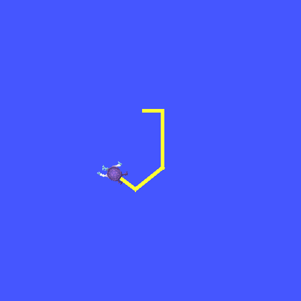
  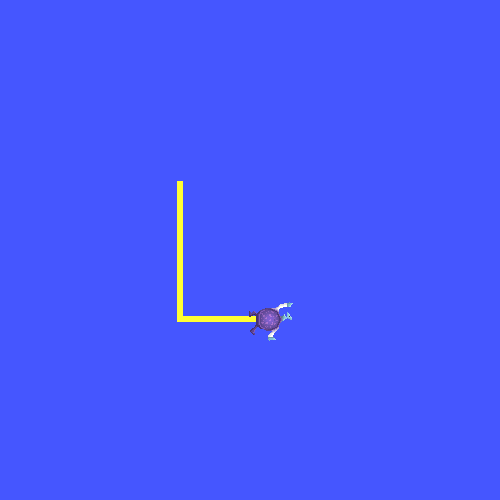
  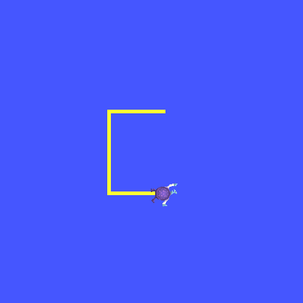
  <br>
  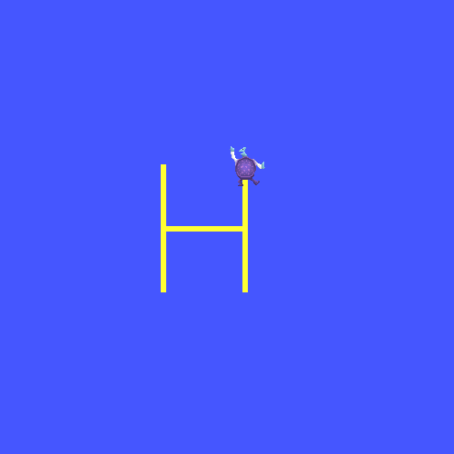
  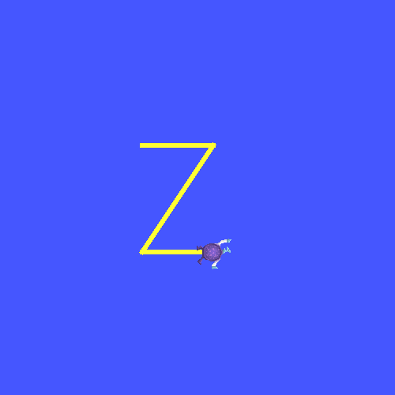
  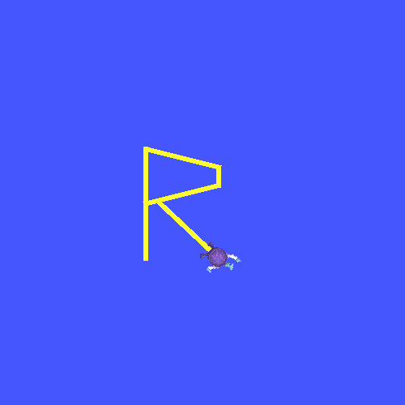
  <br>
  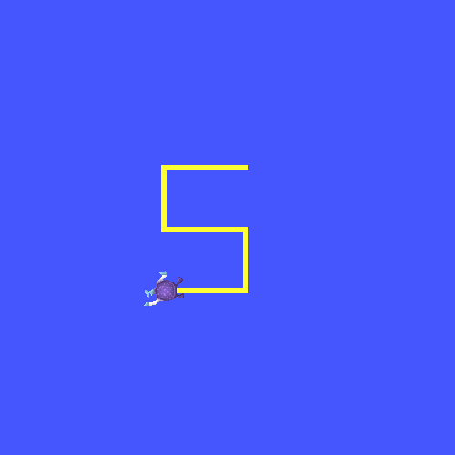
  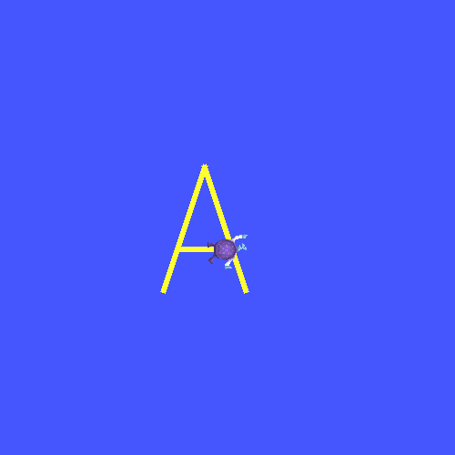
  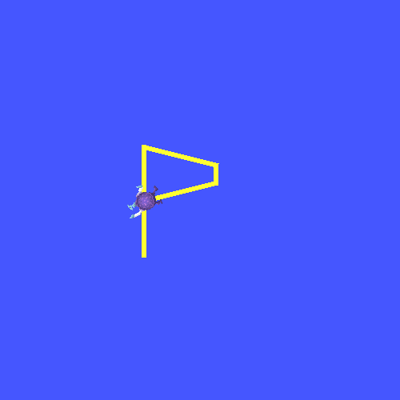
  <br><em>Figura 4. Las nueve iniciales del equipo dibujadas por turtle1.<br>
  Fila 1: J (Janan/Jose) · L (Libardo) · C (Cristian/Carreño) <br>
  Fila 2: H (Hoyos) · Z (Zapata) · R (Riaño) <br>
  Fila 3: S (Stiven) · A (Andres) · P (Peralta/Piñeros)</em>
</div>

---

## 8. Sistema Líder-Seguidor con Dos Tortugas

| Rol | Tortuga | Control |
|-----|---------|---------|
| **Líder** | `turtle1` | Manual, con las flechas del teclado (↑↓←→) |
| **Seguidor** | `turtle2` | Automático, controlador proporcional hacia `turtle1` |

### 8.1 Creación de turtle2 con el servicio /spawn

Al inicializar el nodo se llama al servicio `/spawn` para crear `turtle2` en la esquina inferior izquierda (2.0, 2.0). `turtle1` ya existe por defecto en el simulador:

```python
req = Spawn.Request()
req.x, req.y, req.theta, req.name = 2.0, 2.0, 0.0, 'turtle2'
future = self.cli_spawn.call_async(req)
rclpy.spin_until_future_complete(self, future, timeout_sec=5.0)
```

Tras la creación, el nodo publica en `/turtle1/cmd_vel` y `/turtle2/cmd_vel`, y se suscribe a `/turtle1/pose` y `/turtle2/pose`.

### 8.2 Control del líder (turtle1) por teclado

`turtle1` se mueve con las flechas. Cada tecla fija una velocidad **puramente lineal o puramente angular** (nunca ambas a la vez — por eso con el teclado no se trazan curvas):

```python
# Flecha ↑: avanzar          ↓: retroceder
cmd.linear.x  = +LIN_SPEED   # (-LIN_SPEED para ↓)
cmd.angular.z = 0.0

# Flecha ←: girar izquierda  →: girar derecha
cmd.linear.x  = 0.0
cmd.angular.z = +ANG_SPEED   # (-ANG_SPEED para →)
```

El comando manual persiste entre ticks del timer (20 Hz) y se publica en `/turtle1/cmd_vel`. La tecla `Q` detiene el movimiento publicando un `Twist` vacío.

### 8.3 Controlador proporcional de seguimiento

En un timer independiente a 20 Hz, el nodo calcula el error de posición y orientación entre `turtle2` y `turtle1` y aplica control proporcional saturado:

```python
dx   = self.pose1.x - self.pose2.x
dy   = self.pose1.y - self.pose2.y
dist = math.hypot(dx, dy)

if dist < FOLLOW_STOP_DIST:        # umbral: 0.5 unidades
    self.pub2.publish(Twist())     # detener si ya está cerca
    return

angle_to_target = math.atan2(dy, dx)
angle_err       = angle_to_target - self.pose2.theta   # normalizado a [-π, π]

msg.linear.x  = min(K_LIN * dist, MAX_FOLLOW_LIN)               # K=1.5, max=2.5 m/s
msg.angular.z = saturate(K_ANG * angle_err, MAX_FOLLOW_ANG)     # K=4.0, max=3.0 rad/s
```

El comportamiento resultante:
- Cuando `dist` es grande → velocidad lineal alta → `turtle2` corre hacia `turtle1`.
- Cuando el error angular es grande → velocidad angular alta → `turtle2` gira primero.
- Cuando `dist < 0.5` → `turtle2` se detiene para no colisionar.

### 8.4 Resultados

<div align="center">
  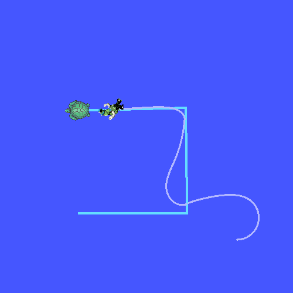
  <br><em>Figura 5. Sistema líder-seguidor: <code>turtle1</code> (líder) es controlado con el teclado (↑↓←→) trazando segmentos rectos, y <code>turtle2</code> (seguidor) lo persigue automáticamente con control proporcional.</em>
</div>

Verificación de los tópicos del seguidor:

```bash
ros2 topic info /turtle2/cmd_vel
# Type: geometry_msgs/msg/Twist
# Publisher count: 1
# Subscription count: 1

ros2 topic echo /turtle2/cmd_vel
# linear:  {x: 1.85, y: 0.0, z: 0.0}
# angular: {x: 0.0, y: 0.0, z: -0.63}
```

---

## 9. Verificación de la Arquitectura ROS 2

Con el nodo `move_turtle` y `turtlesim_node` activos, se ejecutaron los siguientes comandos de introspección. La siguiente captura muestra todos los comandos y sus salidas reales:

<div align="center">
  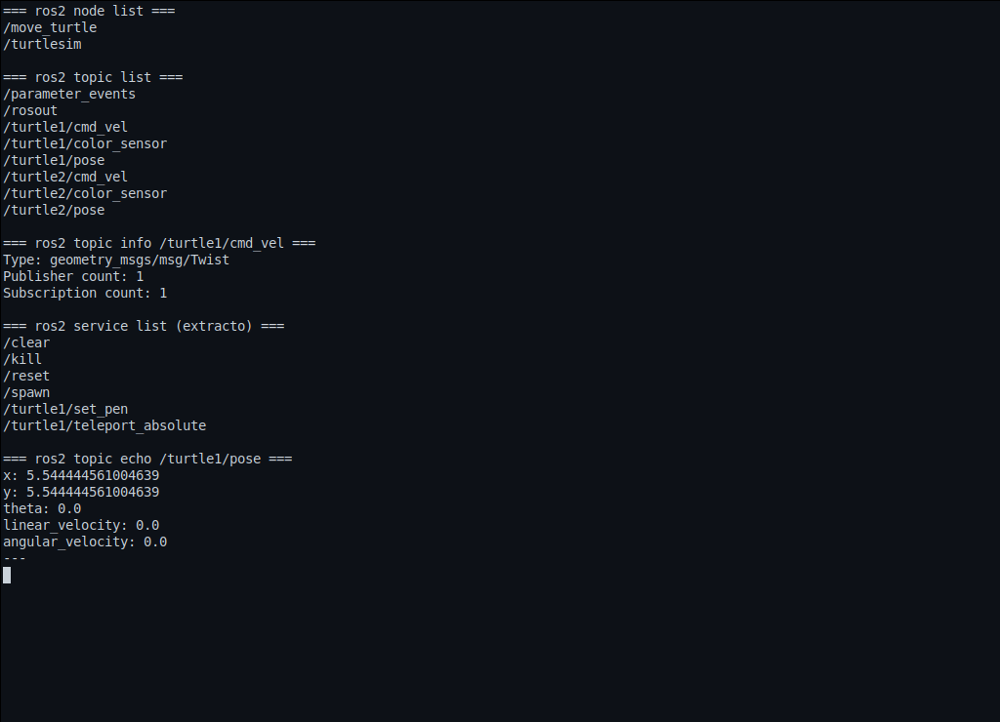
  <br><em>Figura 6. Salida de los cinco comandos de inspección ejecutados con los nodos /move_turtle y /turtlesim activos</em>
</div>

A continuación se detalla cada comando con su análisis:

### 9.1 ros2 node list

Lista todos los nodos activos en el sistema ROS 2.

```bash
ros2 node list
```
```
/move_turtle
/turtlesim
```

**Análisis:** El nodo `/move_turtle` (el controlador implementado) y `/turtlesim` (el simulador) son los únicos nodos activos. Esto confirma que el control de la tortuga se realiza exclusivamente mediante nodos propios, sin hacer uso de `turtle_teleop_key`.

### 9.2 ros2 topic list

Lista todos los tópicos activos con sus tipos.

```bash
ros2 topic list -t
```
```
/parameter_events [rcl_interfaces/msg/ParameterEvent]
/rosout [rcl_interfaces/msg/Log]
/turtle1/cmd_vel [geometry_msgs/msg/Twist]
/turtle1/color_sensor [turtlesim/msg/Color]
/turtle1/pose [turtlesim/msg/Pose]
/turtle2/cmd_vel [geometry_msgs/msg/Twist]
/turtle2/color_sensor [turtlesim/msg/Color]
/turtle2/pose [turtlesim/msg/Pose]
```

**Análisis:** Cada tortuga dispone de sus propios tópicos de `cmd_vel`, `pose` y `color_sensor`. El nodo `move_turtle` publica en los tópicos `cmd_vel` y se suscribe a los tópicos `pose`, constituyendo la columna vertebral de la comunicación del sistema.

### 9.3 ros2 topic echo /turtle1/pose

Muestra los mensajes publicados en tiempo real por el simulador sobre la posición de `turtle1`.

```bash
ros2 topic echo /turtle1/pose
```
```
x: 5.544444561004639
y: 5.544444561004639
theta: 0.0
linear_velocity: 0.0
angular_velocity: 0.0
---
```

**Análisis:** Cada mensaje contiene la posición (x, y), la orientación θ (en radianes) y las velocidades lineales y angulares actuales. El controlador proporcional utiliza estos valores para calcular el error de posición en cada iteración del bucle de control.

### 9.4 ros2 topic info /turtle1/cmd\_vel

Muestra información sobre el canal de comandos de velocidad de `turtle1`.

```bash
ros2 topic info /turtle1/cmd_vel
```
```
Type: geometry_msgs/msg/Twist
Publisher count: 1
Subscription count: 1
```

**Análisis:** Se registra exactamente 1 publicador (el nodo `move_turtle`) y 1 suscriptor (el nodo `turtlesim`). Esta relación 1-a-1 confirma que el flujo de control es el esperado: el controlador emite los comandos de velocidad y el simulador los recibe para mover la tortuga.

### 9.5 ros2 service list

Lista todos los servicios disponibles en el sistema.

```bash
ros2 service list
```
```
/clear
/kill
/reset
/spawn
/turtle1/set_pen
/turtle1/teleport_absolute
/turtle1/teleport_relative
/turtle2/set_pen
/turtle2/teleport_absolute
/turtle2/teleport_relative
/turtlesim/describe_parameters
/turtlesim/get_parameter_types
/turtlesim/get_parameters
/turtlesim/get_type_description
/turtlesim/list_parameters
/turtlesim/set_parameters
/turtlesim/set_parameters_atomically
```

**Análisis:** Los servicios de turtlesim usados directamente por `move_turtle` son: `/spawn` (crear turtle2 al inicio), `/turtle1/set_pen` (subir/bajar el lápiz) y `/turtle1/teleport_absolute` (reposicionar con la pluma levantada al inicio de cada trazo de letra y al inicio del recorrido). El movimiento que dibuja las figuras y letras se realiza con velocidad (`cmd_vel`), no con teleport. Los servicios `*/describe_parameters`, `*/get_parameters`, etc., son generados automáticamente por ROS 2 para cada nodo activo.

### 9.6 rqt\_graph

Visualización gráfica de la ROS 2 Graph activa.

```bash
source /opt/ros/jazzy/setup.bash
ros2 run rqt_graph rqt_graph
```

<div align="center">
  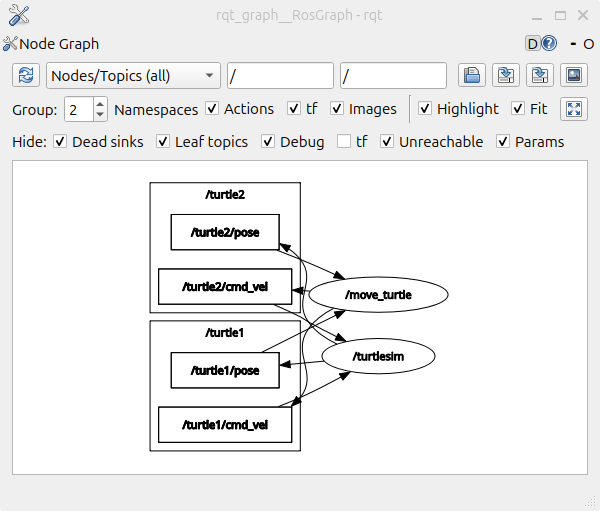
  <br><em>Figura 7. ROS 2 Graph del sistema: nodo /move_turtle conectado a /turtlesim a través de los cuatro tópicos de comunicación (cmd_vel y pose de cada tortuga)</em>
</div>

**Análisis:** El grafo muestra cómo `/move_turtle` publica en `/turtle1/cmd_vel` y `/turtle2/cmd_vel` (flechas salientes) y se suscribe a `/turtle1/pose` y `/turtle2/pose` (flechas entrantes). El nodo `/turtlesim` es el destino de los comandos y la fuente de los datos de pose.

---

## 10. Diagrama de Flujo del Sistema

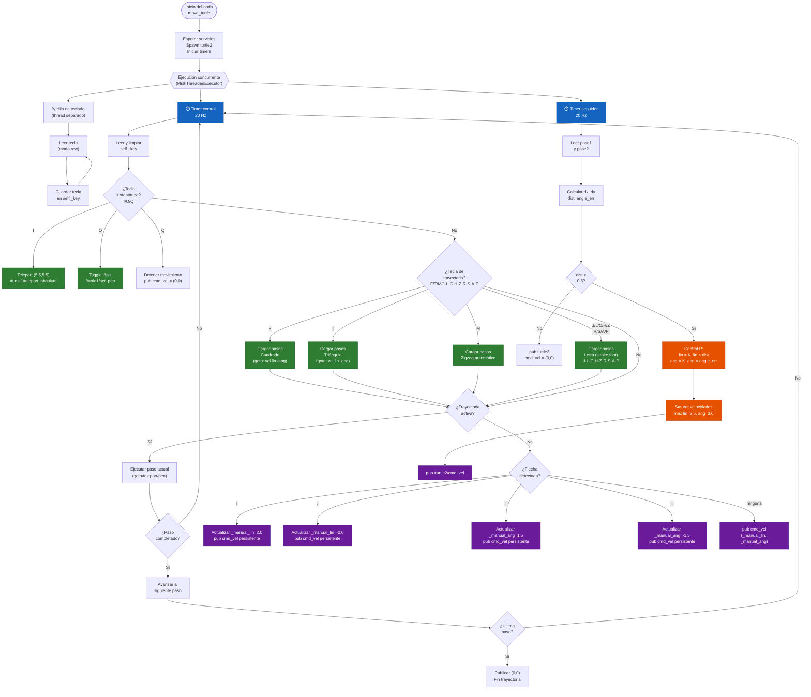

---

## 11. Video Explicativo

De conformidad con lo establecido en la guía del laboratorio, se elaboró un video explicativo con duración máxima de 10 minutos que documenta el análisis, desarrollo e implementación de la solución. La estructura del video corresponde a los lineamientos establecidos:

1. **Introducción:** Apertura con la intro oficial del laboratorio LabSIR.
2. **Presentación del equipo:** Nombres, programas académicos y aportes de cada integrante del grupo.
3. **Análisis, desarrollo e implementación:** Explicación detallada del código fuente, las decisiones técnicas adoptadas y demostración en vivo del funcionamiento de cada función: control manual, trayectorias automáticas (cuadrado, triángulo, zigzag), dibujo de letras y sistema líder-seguidor.
4. **Arquitectura ROS 2:** Descripción de los nodos `/move_turtle` y `/turtlesim`, los tópicos `cmd_vel` y `pose`, y los servicios `SetPen`, `TeleportAbsolute` y `Spawn` empleados en la solución.
5. **Conclusiones:** Reflexiones del equipo y aprendizajes obtenidos durante el laboratorio.

<div align="center">
  <a href="https://youtu.be/ujTkVDBLYUQ" target="_blank">
    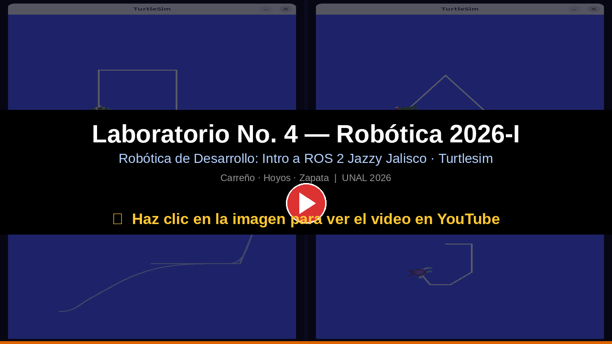
  </a>
  <br><em>Haz clic en la imagen para ver el video explicativo en YouTube</em>
</div>

---

## 12. Conclusiones

1. **Concurrencia en ROS 2:** La separación entre el hilo de captura de teclado y los timers de ROS 2 resulta indispensable para obtener un controlador responsivo. El uso de `MultiThreadedExecutor` permite que los callbacks de control y de seguimiento se ejecuten de forma paralela sin bloquearse mutuamente, condición necesaria para el correcto funcionamiento del sistema en tiempo real.

2. **Motor de trayectorias no bloqueante:** El diseño de trayectorias como listas de pasos ejecutados tick a tick —máquina de estados implícita— elimina la necesidad de `time.sleep()` o bucles bloqueantes dentro de los callbacks de ROS 2. Su uso sería incompatible con el modelo de ejecución basado en eventos del framework.

3. **Dibujo por control de velocidad en lazo cerrado (`goto`):** Las figuras y letras se trazan conduciendo la tortuga hacia cada waypoint con velocidad **lineal y angular** (`cmd_vel`), rotando en el sitio para alinearse y avanzando con corrección de rumbo a partir de la realimentación de `pose`. Esto demuestra el control de rotación exigido por la guía, evita acumulación de error (el lazo cerrado cierra las figuras) y produce un trazo animado. El teleport queda reservado a reposicionar con la pluma levantada, sin trazar.

4. **Servicios vs. tópicos:** Los servicios (`SetPen`, `TeleportAbsolute`, `Spawn`) constituyen la herramienta adecuada para operaciones puntuales con resultado garantizado. Los tópicos (`cmd_vel`, `pose`) resultan idóneos para los flujos continuos de comandos y datos de estado. La correcta selección entre ambos mecanismos representa un criterio de diseño fundamental en la arquitectura de sistemas ROS 2.

5. **Control proporcional de seguimiento:** El controlador proporcional implementado demuestra ser suficiente para el seguimiento en el entorno 2D de turtlesim. La saturación de velocidades previene comportamientos erráticos y el umbral de distancia mínima evita colisiones. En aplicaciones con dinámica más compleja se requeriría al menos un controlador PD o una ley de control más robusta.

6. **Resolución de conflictos de teclas por iniciales:** La asignación de iniciales a teclas del teclado presentó un conflicto de diseño: las letras R, S, A y P corresponden a iniciales del equipo (Riaño, Stiven, Andres, Peralta/Piñeros), pero son también teclas intuitivas para funciones de control. La solución adoptada fue reubicar las funciones automáticas en teclas sin conflicto (F=cuadrado, M=trayectoria, I=inicio, O=lápiz), liberando R, S, A y P para el dibujo de letras. Esto permitió implementar las nueve iniciales del equipo sin ninguna excepción.

7. **Herramientas de introspección de ROS 2:** Los comandos `ros2 node list`, `ros2 topic list`, `ros2 topic echo`, `ros2 topic info`, `ros2 service list` y la herramienta gráfica `rqt_graph` permiten verificar en tiempo real que la arquitectura del sistema es la esperada: publicadores, suscriptores y servicios conectados de acuerdo con el diseño previsto.

---

## 13. Referencias

[1] LabSIR UN, "Intro Linux — Ubuntu 24.04," GitHub, 2026. Disponible en: https://github.com/labsir-un/01_Rob_2026_I_Intro_Ubuntu_24.04

[2] LabSIR UN, "Intro ROS 2 Jazzy Jalisco," GitHub, 2026. Disponible en: https://github.com/labsir-un/02_Rob_2026_I_Intro_ROS2_Jazzy

[3] LabSIR UN, "Intro Turtlesim con ROS 2 Jazzy Jalisco," GitHub, 2026. Disponible en: https://github.com/labsir-un/03_Rob_2026_I_ROS2_Jazzy_Turtlesim

[4] LabSIR UN, "Arquitectura de funcionamiento de ROS 2 Jazzy Jalisco," GitHub, 2026. Disponible en: https://github.com/labsir-un/04_Rob_2026_I_ROS2_Jazzy_Architecture

[5] Open Robotics, "Using turtlesim, ros2, and rqt — Jazzy," ROS 2 Documentation, 2024–2026. Disponible en: https://docs.ros.org/en/jazzy/Tutorials/Beginner-CLI-Tools/Introducing-Turtlesim/Introducing-Turtlesim.html

[6] Open Robotics, "Understanding ROS 2 Topics — Jazzy," ROS 2 Documentation, 2024–2026. Disponible en: https://docs.ros.org/en/jazzy/Tutorials/Beginner-CLI-Tools/Understanding-ROS2-Topics/Understanding-ROS2-Topics.html

[7] Open Robotics, "Understanding ROS 2 Services — Jazzy," ROS 2 Documentation, 2024–2026. Disponible en: https://docs.ros.org/en/jazzy/Tutorials/Beginner-CLI-Tools/Understanding-ROS2-Services/Understanding-ROS2-Services.html

[8] Open Robotics, "Writing a simple publisher and subscriber (Python) — Jazzy," ROS 2 Documentation, 2024–2026. Disponible en: https://docs.ros.org/en/jazzy/Tutorials/Beginner-Client-Libraries/Writing-A-Simple-Py-Publisher-And-Subscriber.html

[9] Open Robotics, "Writing a simple service and client (Python) — Jazzy," ROS 2 Documentation, 2024–2026. Disponible en: https://docs.ros.org/en/jazzy/Tutorials/Beginner-Client-Libraries/Writing-A-Simple-Py-Service-And-Client.html

[10] Open Robotics, "Using colcon to build packages — Jazzy," ROS 2 Documentation, 2024–2026. Disponible en: https://docs.ros.org/en/jazzy/Tutorials/Beginner-Client-Libraries/Colcon-Tutorial.html

---

<div align="center">

Universidad Nacional de Colombia · Facultad de Ingeniería
Departamento de Ingeniería Mecánica y Mecatrónica
Bogotá, 2026

</div>
