<div align="center">
<picture>
    <source srcset="https://imgur.com/5bYAzsb.png" media="(prefers-color-scheme: dark)">
    <source srcset="https://imgur.com/Os03JoE.png" media="(prefers-color-scheme: light)">
    
</picture>

<h3>Curso de Robótica 2026-I</h3>
<h1>Laboratorio No. 5</h1>
<h2>Robótica de Desarrollo: Cinemática del PhantomX Pincher X100 — ROS 2 Jazzy y RViz</h2>
<h3>ROS 2 Jazzy Jalisco · Ubuntu 24.04 LTS</h3>

<h4>Profesores: Pedro Fabián Cárdenas Herrera · Manuel Felipe Carranza Montenegro</h4>
<h4>Estudiantes: Janan Libardo Carreño Riaño · Cristian Stiven Hoyos Peralta · Jose Andres Zapata Piñeros</h4>

<p>
  
  
  
  
  
  
</p>
</div>

---

## Tabla de Contenidos

1. [Introducción](#1-introducción)
   - [1.1 Planteamiento del problema](#11-planteamiento-del-problema)
   - [1.2 Descripción general de la solución](#12-descripción-general-de-la-solución)
   - [1.3 Nota sobre el robot físico](#13-nota-sobre-el-robot-físico)
2. [Resultados de Aprendizaje](#2-resultados-de-aprendizaje)
3. [Marco Teórico](#3-marco-teórico)
   - [3.1 El robot PhantomX Pincher X100](#31-el-robot-phantomx-pincher-x100)
   - [3.2 Servomotores DYNAMIXEL](#32-servomotores-dynamixel)
   - [3.3 Visualización en ROS 2: URDF, `/joint_states` y TF](#33-visualización-en-ros-2-urdf-joint_states-y-tf)
4. [Preparación del Entorno](#4-preparación-del-entorno)
   - [4.1 Estructura del workspace](#41-estructura-del-workspace)
   - [4.2 Compilación y ejecución](#42-compilación-y-ejecución)
   - [4.3 Arquitectura de nodos](#43-arquitectura-de-nodos)
   - [4.4 Puesta en marcha con el robot físico](#44-puesta-en-marcha-con-el-robot-físico)
   - [4.5 Condiciones de operación segura](#45-condiciones-de-operación-segura)
5. [Identificación de Motores y Articulaciones (Actividad 2)](#5-identificación-de-motores-y-articulaciones-actividad-2)
6. [Medición y Modelo Geométrico (Actividad 3)](#6-medición-y-modelo-geométrico-actividad-3)
7. [Cinemática Directa (Actividad 11)](#7-cinemática-directa-actividad-11)
   - [7.1 Parámetros Denavit–Hartenberg](#71-parámetros-denavithartenberg)
   - [7.2 Implementación y validación](#72-implementación-y-validación)
8. [Cinemática Inversa (Actividad 12)](#8-cinemática-inversa-actividad-12)
9. [Límites Seguros (Actividad 6)](#9-límites-seguros-actividad-6)
   - [9.1 Guarda de suelo: por qué los límites articulares no bastan](#91-guarda-de-suelo-por-qué-los-límites-articulares-no-bastan)
   - [9.2 Verificación de rutinas antes de ejecutarlas en hardware](#92-verificación-de-rutinas-antes-de-ejecutarlas-en-hardware)
   - [9.3 Velocidad de perfil en todas las actividades](#93-velocidad-de-perfil-en-todas-las-actividades)
10. [Movimiento Individual, Simultáneo y Secuencial (Actividades 4, 7 y 8)](#10-movimiento-individual-simultáneo-y-secuencial-actividades-4-7-y-8)
11. [Calibración de Cero y Error Articular (Actividad 5)](#11-calibración-de-cero-y-error-articular-actividad-5)
    - [11.1 Medición sobre el robot real](#111-medición-sobre-el-robot-real)
    - [11.2 Caracterización dinámica en simulación](#112-caracterización-dinámica-en-simulación)
12. [Interpolación de Trayectorias (Actividad 9)](#12-interpolación-de-trayectorias-actividad-9)
13. [Trayectoria Sinusoidal (Actividad 10)](#13-trayectoria-sinusoidal-actividad-10)
14. [Enseñanza y Repetición de Poses (Actividad 13)](#14-enseñanza-y-repetición-de-poses-actividad-13)
15. [Trazado de Figuras por Cinemática Inversa (Actividad 14)](#15-trazado-de-figuras-por-cinemática-inversa-actividad-14)
16. [Reto Final: Coreografía Robótica (Actividad 15)](#16-reto-final-coreografía-robótica-actividad-15)
17. [Verificación de la Arquitectura ROS 2](#17-verificación-de-la-arquitectura-ros-2)
18. [Diagrama de Flujo del Sistema](#18-diagrama-de-flujo-del-sistema)
19. [Plano de Planta](#19-plano-de-planta)
20. [Videos Explicativos](#20-videos-explicativos)
    - [20.1 Procedimiento de grabación](#201-procedimiento-de-grabación)
21. [Conclusiones](#21-conclusiones)
    - [21.1 Conclusiones generales del equipo](#211-conclusiones-generales-del-equipo)
    - [21.2 Conclusiones individuales](#212-conclusiones-individuales)
22. [Referencias](#22-referencias)

---

## Índice de actividades de la guía

Este informe se organiza por temas, de modo que cada bloque conceptual quede
completo. La siguiente tabla indica dónde se desarrolla cada una de las quince
actividades y si se ejecutó sobre el manipulador real.

| # | Actividad | Sección | Hardware |
|:-:|-----------|---------|:--------:|
| 1 | Preparación del robot | [§4.4](#44-puesta-en-marcha-con-el-robot-físico) | ✅ |
| 2 | Identificación de motores y articulaciones | [§5](#5-identificación-de-motores-y-articulaciones-actividad-2) | ✅ |
| 3 | Medición del robot | [§6](#6-medición-y-modelo-geométrico-actividad-3) | ✅ |
| 4 | Movimiento individual de articulaciones | [§10](#10-movimiento-individual-simultáneo-y-secuencial-actividades-4-7-y-8) | ✅ |
| 5 | Calibración de cero y error articular | [§11](#11-calibración-de-cero-y-error-articular-actividad-5) | ✅ |
| 6 | Determinación de límites seguros | [§9](#9-límites-seguros-actividad-6) | ✅ |
| 7 | Movimiento simultáneo | [§10](#10-movimiento-individual-simultáneo-y-secuencial-actividades-4-7-y-8) | ✅ |
| 8 | Movimiento secuencial | [§10](#10-movimiento-individual-simultáneo-y-secuencial-actividades-4-7-y-8) | ✅ |
| 9 | Interpolación de trayectorias | [§12](#12-interpolación-de-trayectorias-actividad-9) | ✅ |
| 10 | Trayectoria sinusoidal | [§13](#13-trayectoria-sinusoidal-actividad-10) | ✅ |
| 11 | Cinemática directa | [§7](#7-cinemática-directa-actividad-11) | validada |
| 12 | Cinemática inversa | [§8](#8-cinemática-inversa-actividad-12) | validada |
| 13 | Enseñanza y repetición de poses | [§14](#14-enseñanza-y-repetición-de-poses-actividad-13) | ✅ |
| 14 | Trazado de una figura | [§15](#15-trazado-de-figuras-por-cinemática-inversa-actividad-14) | ✅ |
| 15 | Reto final: coreografía robótica | [§16](#16-reto-final-coreografía-robótica-actividad-15) | ✅ |

Requisitos de entrega: [descripción de la solución](#1-introducción) ·
[diagrama de flujo](#18-diagrama-de-flujo-del-sistema) · código fuente en `src/` ·
[plano de planta](#19-plano-de-planta) ·
[cinemática directa e inversa](#7-cinemática-directa-actividad-11) ·
[gráficas](#11-calibración-de-cero-y-error-articular-actividad-5) ·
[videos](#20-videos-explicativos) · [conclusiones](#21-conclusiones).

---

## 1. Introducción

### 1.1 Planteamiento del problema

El **PhantomX Pincher X100** es un manipulador de desarrollo de cuatro grados de
libertad (más una pinza) accionado por servomotores DYNAMIXEL. El laboratorio
plantea controlar sus articulaciones desde **ROS 2 Jazzy**, medir y modelar su
geometría, implementar **cinemática directa e inversa**, y programar movimientos
individuales, simultáneos, secuenciales e interpolados, hasta llegar a tareas
artísticas como el trazado de figuras y una coreografía sincronizada con música.

La restricción central es que toda la solución debe desarrollarse con **código
propio en Python con `rclpy`** a partir de los paquetes base del kit, respetando
los límites articulares y empezando y terminando cada prueba en una postura
segura.

**Especificaciones del entorno:**

| Parámetro | Valor |
|-----------|-------|
| Sistema operativo | Ubuntu 24.04 LTS (Noble Numbat) |
| Distribución ROS 2 | Jazzy Jalisco |
| Lenguaje | Python 3 |
| Herramienta de compilación | colcon |
| Visualizador | RViz 2 |
| Paquetes ROS 2 | `pincher_description`, `pincher_lab` |

### 1.2 Descripción general de la solución

La solución se organiza en dos paquetes `ament_python`:

- **`pincher_description`** — modelo **URDF/Xacro** del robot (medido de los STL
  del kit), mallas, configuración de RViz y *launch* de visualización. Publica
  `/tf` a partir de `/joint_states` mediante `robot_state_publisher`.
- **`pincher_lab`** — la lógica del laboratorio:
  - `kinematics.py` — cinemática directa (DH y transformadas exactas) e inversa
    analítica (codo arriba/abajo, límites, alcanzabilidad).
  - `pincher_node` — controlador didáctico no bloqueante; **único publicador de
    `/joint_states`**, recibe metas en `/pincher/command` y las recorta a los
    límites seguros.
  - `joint_demo`, `trajectory_demo`, `teach_repeat`, `figure_player`,
    `choreography` — nodos de cada actividad que publican comandos articulares.
  - `kinematics_cli` — herramienta de terminal para evaluar FK e IK.

La misma cadena sirve **con y sin hardware**. Sin robot, `pincher_node` simula la
dinámica del servo y todo se ve en RViz. Con el robot conectado, `control_servo`
lo sustituye y `kit_bridge` traduce al modelo oficial del KIT para la
visualización; los nodos de actividad y la cinemática **no cambian**, porque
todos publican sobre la misma interfaz `/pincher/command`:

```bash
ros2 launch pincher_lab pincher_system.launch.py   # sin hardware
ros2 launch pincher_lab robot_real.launch.py       # con el robot real
```

**Repositorios base empleados** (punto 3 de la guía):

| Repositorio | Aporte a esta solución |
|-------------|------------------------|
| `06_..._PhantomX100_RVIZ` | modelo URDF de visualización, mallas STL, nombres de articulación e interfaz de control (`/pincher/command`, `/joint_states`) |
| `KIT_Phantom_X_Pincher_ROS2` | paquete oficial: **límites mecánicos reales**, nombres largos de articulación, perfiles DYNAMIXEL y driver de hardware |
| `3DModels_KIT_Phantom_Pincher_X100` | **especificación oficial** de dimensiones (Toquica, 2018) y diagrama cinemático para la Actividad 3 |

### 1.3 Nota sobre el robot físico

> El laboratorio se desarrolló en **dos etapas**, y conviene distinguir con
> claridad qué se ejecutó sobre el manipulador real y qué sobre el simulador.
>
> **Etapa 1 — sin robot.** El modelo, la cinemática y todos los nodos de las
> actividades se desarrollaron y validaron en simulación (RViz + `pincher_node`).
> Las gráficas de este informe (interpolación, sinusoidal y calibración) se
> obtuvieron grabando los tópicos reales del sistema ROS en ejecución
> (`/pincher/command` y `/joint_states`) con el nodo `recorder`, no a partir de
> fórmulas; pero la posición "medida" es la respuesta de un **modelo de servo
> dinámico** (saturación de velocidad + retardo de primer orden) que `pincher_node`
> simula.
>
> **Etapa 2 — con el robot disponible.** El driver `control_servo` opera el
> manipulador con arranque *best-effort*, anti-tirón y reintentos de comunicación.
> Se distingue con precisión qué se ejecutó sobre el robot y qué no:
>
> | Actividad | Estado |
> |-----------|--------|
> | 1 · Preparación y correspondencia con RViz | **Hardware** |
> | 2 · Identificación de motores (5× AX-12A, IDs 1–5, 1 Mbaud) | **Hardware** |
> | 3 · Medición y modelo geométrico | **Hardware** (cadena del modelo oficial) |
> | 4 y 7 · Movimiento individual y simultáneo | **Hardware** |
> | 5 · Calibración de cero y error articular | **Hardware** (`bringup/calibrar_cero.py`) |
> | 6 · Límites seguros | **Hardware** (`bringup/medir_topes.py`) |
> | 8 · Movimiento secuencial | **Hardware** |
> | 9 · Interpolación de trayectorias | **Hardware** |
> | 10 · Trayectoria sinusoidal | **Hardware** |
> | 11 y 12 · Cinemática directa e inversa | Validadas contra el modelo oficial |
> | 13 · Enseñanza y repetición de poses | **Hardware** |
> | 14 · Trazado de figuras | **Hardware** |
> | 15 · Coreografía | **Hardware** (`profile_velocity = 100`) |
>
> **Las quince actividades se ejecutaron sobre el manipulador real.** Las
> Actividades 11 y 12 son analíticas, y se validaron contra las transformadas del
> modelo oficial con un error de 1.1 mm.
>
> **Sobre las gráficas.** Las de las Actividades 5, 9 y 10 se presentan **en dos
> versiones**: la de simulación y la medida sobre el robot, porque el contraste es
> en sí mismo un resultado. El error articular pasa de 0.005° a 1–2°; el
> seguimiento sinusoidal, de 2.7° a más de 20°; y las tres interpolaciones, que en
> simulación alcanzan velocidades pico distintas (69, 91 y 114 °/s), convergen en
> el robot hacia un mismo techo de unos 65 °/s. En los tres casos la diferencia no
> revela un defecto del robot sino los **límites físicos del actuador**:
> resolución de 0.29°/paso, holgura del tren de engranajes y saturación de
> velocidad. Los datos de hardware se obtienen con
> `analisis/run_experiments_hw.sh` y se guardan con el sufijo `_hw`, sin
> sobrescribir los de simulación.

---

## 2. Resultados de Aprendizaje

Al finalizar el laboratorio, el estudiante habrá desarrollado las competencias para:

- Modelar un manipulador serie en **URDF/Xacro** y visualizarlo en RViz a partir
  de `/joint_states` y `robot_state_publisher`.
- Obtener los **parámetros Denavit–Hartenberg** de un robot real y programar su
  **cinemática directa**.
- Derivar e implementar la **cinemática inversa** analítica con manejo de
  soluciones múltiples (codo arriba/abajo), límites y alcanzabilidad.
- Programar movimientos articulares **individuales, simultáneos y secuenciales**
  respetando límites seguros.
- Diseñar **trayectorias interpoladas** (lineal, cúbica, quíntica) y sinusoidales
  no bloqueantes.
- Implementar **enseñanza y repetición de poses** con persistencia en YAML.
- Resolver el **trazado de figuras** mediante cinemática inversa.
- Analizar la **arquitectura de comunicación ROS 2** (nodos, tópicos, TF,
  servicios) generada por el sistema.

---

## 3. Marco Teórico

### 3.1 El robot PhantomX Pincher X100

El PhantomX Pincher X100 es un brazo de **4 GDL de posicionamiento** —cintura
(*waist*), hombro (*shoulder*), codo (*elbow*) y muñeca (*wrist*)— rematado por
una **pinza** (*gripper*) de dos dedos. Los ejes del hombro, el codo y la muñeca
son **paralelos**, de modo que esas tres articulaciones forman un **brazo planar
de tres eslabones** contenido en el plano vertical que define la cintura. Esta
estructura es la que permite resolver la cinemática inversa de forma analítica.

### 3.2 Servomotores DYNAMIXEL

Cada articulación es accionada por un servomotor DYNAMIXEL en **modo posición**.
El kit puede equiparse con dos familias, ambas contempladas en este trabajo:

| Modelo | Protocolo | Rango mecánico | Centro (raw) | Resolución |
|--------|-----------|----------------|--------------|------------|
| **AX-12A** | 1.0 | 300° (0–1023) | 512 | ≈ 0.29°/u |
| **XL430-W250** | 2.0 | 360° (0–4095) | 2048 | ≈ 0.088°/u |

En esta entrega (simulación) no se accede a los registros del servo; el control se
hace en radianes y la conversión a unidades *raw* la realiza, **sobre hardware**,
el driver `control_servo` del paquete `pincher_control` (de los repositorios base)
mediante su clase `MotorProfile`. El signo de cada articulación
(`joint_signs = [1, −1, −1, −1, 1]`) alinea el sentido del motor con el del modelo
URDF, y coincide con el del driver oficial.

### 3.3 Visualización en ROS 2: URDF, `/joint_states` y TF

El flujo de visualización es el estándar de ROS 2:

```
nodo controlador ──/joint_states──▶ robot_state_publisher ──/tf, /tf_static──▶ RViz
        ▲                                     │
        └────── /robot_description (URDF) ─────┘
```

- El **URDF** (generado del Xacro) describe la cadena de *links* y *joints*.
- El nodo controlador publica `/joint_states` con la posición de cada
  articulación.
- `robot_state_publisher` calcula las transformadas `/tf` de cada eslabón.
- **RViz** dibuja el robot usando las mallas STL y las transformadas.

---

## 4. Preparación del Entorno

### 4.1 Estructura del workspace

```
phantom_ws/
└── src/
    ├── pincher_description/
    │   ├── urdf/robot.xacro          ← modelo del robot (medido de STL)
    │   ├── meshes/*.stl              ← 8 mallas del kit
    │   ├── rviz/pincher.rviz
    │   ├── launch/display.launch.py
    │   └── launch/display_gui.launch.py
    └── pincher_lab/
        ├── pincher_lab/
        │   ├── kinematics.py         ← FK (DH) e IK analítica
        │   ├── safe_limits.py        ← límites seguros (Act. 6)
        │   ├── trajectories.py       ← interpolación y sinusoide
        │   ├── motion.py             ← utilidades de reproducción
        │   ├── pincher_node.py       ← controlador + modelo de servo
        │   ├── joint_demo.py         ← Act. 4, 7, 8
        │   ├── trajectory_demo.py    ← Act. 9, 10 (animación)
        │   ├── teach_repeat.py       ← Act. 13 (YAML)
        │   ├── figure_player.py      ← Act. 14 (IK)
        │   ├── choreography.py       ← Act. 15
        │   ├── kinematics_cli.py     ← Act. 11, 12 (terminal)
        │   ├── experiments.py        ← genera trayectorias de prueba
        │   ├── recorder.py           ← graba tópicos reales a CSV
        │   └── fk_tf_check.py        ← valida FK contra /tf
        ├── config/poses.yaml
        └── launch/pincher_system.launch.py

analisis/                            ← genera las gráficas del informe
├── run_experiments.sh               ← corre los experimentos y graba datos reales
├── interpolacion_real.py            ← Fig. 4  (Act. 9)
├── sinusoidal_real.py               ← Fig. 5  (Act. 10)
├── calibracion_real.py              ← Fig. 3  (Act. 5)
├── diagrama_cinematico.py           ← Fig. 1, 7, 8
└── datos/                           ← CSV reales grabados de /pincher/command y /joint_states
```

> El código fuente está en [`src/`](src/); los scripts que generan las gráficas, en
> [`analisis/`](analisis/). Las gráficas de datos (Figuras 3, 4 y 5) se reproducen
> con `bash analisis/run_experiments.sh` (graba los CSV reales en `analisis/datos/`)
> seguido de los scripts `*_real.py`.

### 4.2 Compilación y ejecución

```bash
# 1. Crear el workspace y enlazar el código del laboratorio
source /opt/ros/jazzy/setup.bash
mkdir -p ~/phantom_ws/src
cp -r src/* ~/phantom_ws/src/      # pincher_description y pincher_lab

# 2. Compilar
cd ~/phantom_ws
colcon build --symlink-install
source install/setup.bash

# 3. Sistema completo (RViz + controlador):
ros2 launch pincher_lab pincher_system.launch.py

# 4. En otra terminal, una actividad cualquiera, por ejemplo:
ros2 run pincher_lab joint_demo --ros-args -p mode:=simultaneous
```

**Práctica 1 (modelo sin controlador)** — sliders manuales:

```bash
ros2 launch pincher_description display_gui.launch.py use_meshes:=true
```

### 4.3 Arquitectura de nodos

```
                         ┌────────────────────┐
  joint_demo            │                    │
  trajectory_demo  ─────▶  /pincher/command  ──▶ pincher_node ──▶ /joint_states
  teach_repeat         │  (JointState, rad) │        │
  figure_player        │                    │        └─ recorta a límites seguros
  choreography         └────────────────────┘
                                                       │
                            /joint_states ─────────────┘──▶ robot_state_publisher ──▶ RViz
```

Solo `pincher_node` publica `/joint_states`; los demás nodos envían metas a
`/pincher/command`. Esto evita el conflicto de dos publicadores sobre el mismo
tópico.

**Tabla resumen de la interfaz ROS 2 del sistema:**

| Recurso | Tipo | Dirección (respecto a `pincher_node`) | Función |
|---------|------|----------------------------------------|---------|
| `/pincher/command` | `sensor_msgs/JointState` | entrada (sub) | meta articular en radianes; se recorta a límites seguros |
| `/joint_states` | `sensor_msgs/JointState` | salida (pub) | posición y velocidad medidas; alimenta `robot_state_publisher` |
| `/pincher/status` | `std_msgs/String` | salida (pub) | mensajes de estado del controlador |
| `/pincher/figure` | `visualization_msgs/Marker` | salida (`figure_player`) | polilínea de la figura trazada (para RViz) |
| `/pincher/home` | `std_srvs/Trigger` | servicio (srv) | lleva el robot a la postura de reposo |
| `/tf`, `/tf_static` | `tf2_msgs/TFMessage` | salida (`robot_state_publisher`) | transformadas de cada eslabón |
| `/robot_description` | `std_msgs/String` (latched) | parámetro/tópico | URDF del robot para RViz |

En el robot real, `pincher_node` se sustituye por el driver `control_servo` del
paquete `pincher_control`, que mantiene **la misma interfaz** (`/pincher/command`
→ `/joint_states`) pero habla con los servomotores por **DynamixelSDK**
(protocolo 1.0 para AX-12A, 2.0 para XL430) a través del puerto serie. Por eso el
resto del sistema (actividades, cinemática, RViz) no cambia al pasar a hardware.

### 4.4 Puesta en marcha con el robot físico

Este es el procedimiento efectivamente seguido sobre el manipulador. Las
herramientas de la carpeta `bringup/` acompañan cada paso.

1. **Detectar los servomotores** e identificar sus IDs:
   ```bash
   ros2 run pincher_control scan_dynamixel --ros-args -p protocol_version:=1.0
   ```

2. **Medir los topes mecánicos** con el brazo suelto. `ir_a_home.py` lo lleva a la
   vertical y desactiva el par; `medir_topes.py` solo *lee* el encoder mientras se
   mueve la articulación con la mano, de modo que no puede forzar la mecánica:
   ```bash
   python3 bringup/ir_a_home.py
   python3 bringup/medir_topes.py --id 1 --segundos 40
   ```

3. **Verificar el sentido de giro de cada articulación.** Se comanda un ángulo
   pequeño en unidades crudas del servo y se observa hacia dónde se mueve el brazo,
   comparándolo con el convenio del modelo. **Este paso no es opcional:** los
   valores por defecto que traía el driver (`[1, −1, −1, −1, 1]`) resultaron tener
   **las cuatro articulaciones invertidas** al contrastarlos con el robot. Los
   signos medidos son `[−1, 1, 1, 1, 1]`, ya fijados como defecto.

4. **Calibrar el cero y el error articular** (Actividad 5):
   ```bash
   python3 bringup/calibrar_cero.py --amplitud 40 --velocidad 50
   ```

5. **Verificar cada rutina antes de ejecutarla** (§9.2), lo que incluye colisión
   del brazo completo y velocidad cartesiana:
   ```bash
   python3 analisis/verificar_seguridad.py todo
   ```

6. **Lanzar el sistema completo** (driver real + modelo oficial del KIT en RViz):
   ```bash
   ros2 launch pincher_lab robot_real.launch.py
   ```

A partir de ahí, **todos** los nodos de actividad (`joint_demo`, `trajectory_demo`,
`teach_repeat`, `figure_player`, `choreography`) funcionan sin modificación,
porque publican sobre la misma interfaz `/pincher/command`. El nodo `kit_bridge`
traduce los nombres de articulación al modelo oficial para la visualización.

> **Volver a HOME entre actividades.** Cada nodo construye su trayectoria
> asumiendo que el robot parte de `[0,0,0,0,0]`. Encadenarlas sin homing lo
> desplaza bruscamente desde donde quedó la anterior; durante las pruebas eso
> provocó un choque contra los contenedores frontales. Los guiones de grabación
> (`bringup/grabar_video*.sh`) ya incorporan el homing.

---

### 4.5 Condiciones de operación segura

La guía fija cinco condiciones de operación. Así se garantiza cada una:

| Condición de la guía | Cómo se cumple | Dónde |
|----------------------|----------------|-------|
| Iniciar y finalizar cada prueba en **posición segura** | Todas las rutinas arrancan y terminan en el cero mecánico (brazo vertical). Los guiones de grabación hacen *homing* explícito antes de cada actividad, y la coreografía cierra con un `hold` en reposo | `bringup/grabar_video*.sh`, `choreography.py` |
| Respetar los **límites articulares** en todo valor enviado | `safe_limits.clamp_vector_safe()` recorta **todos** los comandos antes de publicarlos; además una **guarda de suelo** descarta las combinaciones que, aun estando dentro de límites, bajarían el brazo bajo la plataforma | [§9](#9-límites-seguros-actividad-6), [§9.1](#91-guarda-de-suelo-por-qué-los-límites-articulares-no-bastan) |
| Movimientos de gran amplitud mediante **trayectorias interpoladas** | Ninguna actividad envía saltos de posición: todas construyen la trayectoria con `ramp()`, con perfil lineal, cúbico o quíntico según el caso | `motion.py`, [§12](#12-interpolación-de-trayectorias-actividad-9) |
| **No sujetar ni bloquear** el robot con los servos energizados | La medición de topes y la verificación de sentidos se hicieron con el **torque desactivado**; `medir_topes.py` comprueba el registro *Torque Enable* y lo desactiva si estuviera activo antes de empezar | `bringup/medir_topes.py`, `bringup/ir_a_home.py` |
| **Verificar cada movimiento** antes de ejecutarlo en el robot | `verificar_seguridad.py` reconstruye la trayectoria completa muestra a muestra y comprueba límites, colisión del brazo entero y velocidad cartesiana | [§9.2](#92-verificación-de-rutinas-antes-de-ejecutarlas-en-hardware) |

> La cuarta condición merece énfasis porque es la que más fácilmente se incumple
> sin querer: mover una articulación a mano con el par activo fuerza el tren de
> engranajes. Por eso el flujo de trabajo con el robot real siempre desactiva el
> torque **antes** de cualquier manipulación manual, y no después.

---

## 5. Identificación de Motores y Articulaciones (Actividad 2)

Sobre el robot real, cada servomotor se identifica con `scan_dynamixel` (solo
hace `ping`, no energiza el torque). El sentido positivo de cada articulación se
**verificó moviéndola en el robot**, no se dedujo del URDF: se comandó un ángulo
pequeño en unidades crudas del servo y se observó hacia dónde se movía el brazo.
El resultado es `joint_signs = [-1, 1, 1, 1, 1]` para el convenio del entregable.

> El valor que traía el driver, `[1, -1, -1, -1, 1]`, tenía **las cuatro
> articulaciones invertidas**: nunca se había contrastado con hardware. Es un
> error que la simulación no revela, porque allí el signo solo cambia hacia dónde
> se dibuja el modelo; en el robot cambia hacia dónde se mueve el brazo, y con él
> la validez de cualquier verificación de colisiones previa.

Mapa de articulaciones (con la correspondencia a los nombres del paquete oficial
`phantomx_pincher_description`), tomando como cero el **brazo vertical**:

| Articulación | ID | Referencia (0°) | Sentido positivo (verificado) | Signo | Función |
|--------------|:--:|-----------------|-------------------------------|:-----:|---------|
| Base (waist) | 1 | brazo mirando al frente | giro hacia la **izquierda** visto desde el frente | **−1** | rotación de la base |
| Hombro (shoulder) | 2 | brazo **vertical** | inclina el brazo hacia **adelante** | **+1** | elevación |
| Codo (elbow) | 3 | antebrazo **vertical**, alineado con el brazo | pliega el antebrazo hacia **adelante** | **+1** | flexión del codo |
| Muñeca (wrist) | 4 | herramienta alineada con el antebrazo | gira la herramienta hacia **adelante** | **+1** | orientación del TCP |
| Pinza (gripper) | 5 | dedos **totalmente abiertos** | cierra la pinza (hacia −90°) | **+1** | apertura y cierre |

Todas las referencias corresponden al **valor central del servomotor** (512 en el
AX-12A), que en este robot deja el brazo **completamente vertical**. Los nombres
en el paquete oficial `phantomx_pincher_description` son, en el mismo orden:
`arm_shoulder_pan`, `arm_shoulder_lift`, `arm_elbow_flex`, `arm_wrist_flex` y
`gripper_finger1`.

<div align="center">
  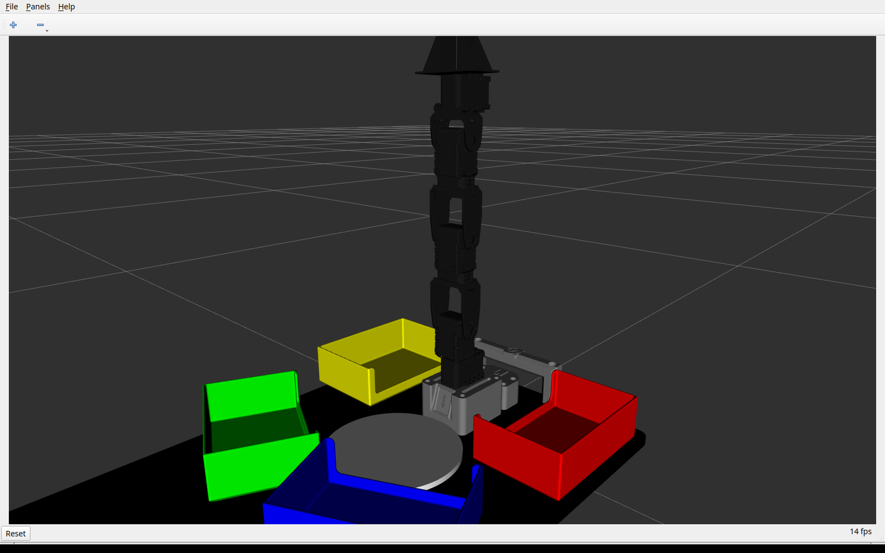
  <br><em>Figura 1b. Pose de referencia <code>q = (0, 0, 0, 0, 0)</code>: brazo
  completamente vertical, con el TCP en <code>(0, 0, 0.407) m</code>. Es la postura
  que adopta el manipulador con los cinco servomotores en su valor central, y la
  posición segura desde la que arranca y a la que regresa cada rutina. El modelo
  mostrado es el oficial del kit, con la plataforma y sus contenedores.</em>
</div>
| Pinza (gripper) | `gripper` | 5 | dedos semiabiertos | abre la pinza | sujeción |

> Los **IDs** y el **sentido positivo** definitivos deben verificarse físicamente
> con el robot energizado; aquí se documenta el mapeo usado por el modelo. Se
> emplean los nombres cortos (`waist`, `shoulder`, `elbow`, `wrist`, `gripper`) del
> repositorio de visualización y control, equivalentes a los nombres largos del
> paquete oficial.

---

## 6. Medición y Modelo Geométrico (Actividad 3)

Las dimensiones se obtuvieron de la **cadena cinemática del modelo oficial del
robot** (`phantomx_pincher_description`, del repositorio base
`KIT_Phantom_X_Pincher_ROS2`), midiendo por TF la distancia entre los ejes de
junta consecutivos en la pose cero. Los valores (en milímetros) son:

| Símbolo | Descripción | Valor |
|---------|-------------|------:|
| `H`  | altura del eje del hombro sobre la base | 124.0 mm |
| `a1` | eslabón hombro→codo | 99.0 mm |
| `a2` | eslabón codo→muñeca | 100.0 mm |
| `a3` | eslabón muñeca→TCP | 84.0 mm |
| `b`  | ángulo del eslabón hombro→codo con `q2=0` | 90° |

La cadena es **recta**: la componente transversal es `dx = 0.0` en los cuatro
tramos, de modo que con `q = (0,0,0,0)` el brazo queda **totalmente vertical** y
el TCP en `(0, 0, 0.407) m`. Ése es el cero mecánico real del robot, el que se
obtiene con los servomotores en su valor central (512 en el AX-12A).

**Nota metodológica.** Una primera versión de este modelo se construyó midiendo
las mallas `px100_*.stl`, que resultaron ser del **Interbotix PincherX-100**, un
robot distinto: tiene el eslabón hombro→codo *acodado* (offset lateral de 31.5 mm,
ángulo característico de 72.68°) y su pose cero es con el brazo hacia adelante.
Eso producía un error de **332 mm** en el TCP calculado respecto a lo que muestra
RViz. Al tomar las cotas del modelo oficial el error baja a **1.1 mm**, que es la
resolución con la que `tf2_echo` reporta las transformadas.

**Contraste con la especificación de Toquica (2018):** la *Planar View* reporta
longitudes nominales de **105 / 105 / 110 mm**. Nuestros valores del modelo
oficial (99 / 100 / 84 mm) coinciden en los dos primeros eslabones dentro de
~5 mm. El tercero parecía discrepar, pero **no hay contradicción: son dos puntos
distintos del mismo brazo.** Midiendo la malla `finger.dae` y llevándola a la
cadena por TF (con el brazo vertical):

| Punto | Distancia desde el eje de la muñeca |
|-------|------------------------------------:|
| frame `end_effector` (base de la pinza) | 84.0 mm |
| **punta de los dedos** | **102.6 mm** |
| Toquica (2018), nominal | 110 mm |

Es decir, Toquica mide hasta la punta y el modelo oficial hasta la base de la
pinza; nuestra medida de la punta (102.6 mm) queda a ~7 mm del nominal, dentro
de la tolerancia esperable entre un plano nominal y la malla real.

Se adopta **`a3 = 84 mm`** (hasta `end_effector`) para la cinemática, porque es
lo que reproduce exactamente la geometría que muestra RViz, que es contra lo que
la Actividad 11 pide comparar. Para tareas con herramienta (Actividad 14, trazado
con marcador) hay que sumar el **offset de herramienta de 18.6 mm** hasta la punta
de los dedos, más la longitud del marcador que sobresalga del soporte.

<div align="center">
  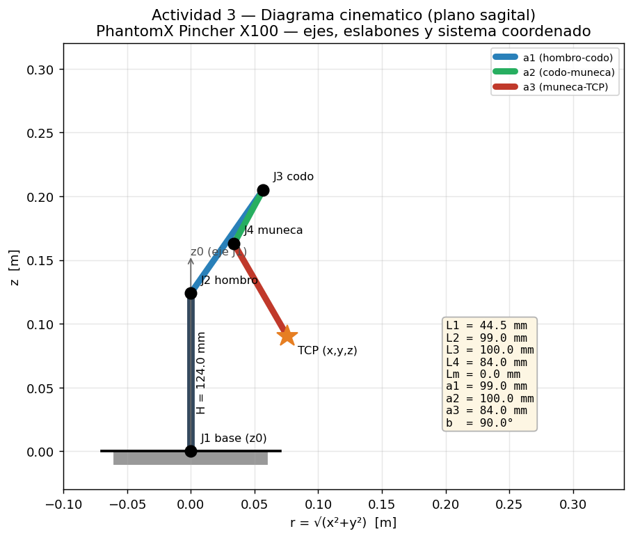
  <br><em>Figura 1. Diagrama cinemático (plano sagital): ejes de movimiento (J1–J4),
  eslabones, dimensiones y sistema coordenado. El alcance se desarrolla en el plano
  que define la cintura.</em>
</div>

---

## 7. Cinemática Directa (Actividad 11)

### 7.1 Parámetros Denavit–Hartenberg

A partir del modelo geométrico se obtuvo la siguiente tabla DH estándar
(`θ`, `d`, `a`, `α`), con `b = 90°`:

| i | Articulación | θᵢ | dᵢ (m) | aᵢ (m) | αᵢ |
|:-:|--------------|----|:------:|:------:|:--:|
| 1 | waist    | `q₁`              | 0.1240 | 0      | +90° |
| 2 | shoulder | `−q₂ + b`         | 0      | 0.0990 | 0°   |
| 3 | elbow    | `−q₃ − b + π/2`   | 0      | 0.1000 | 0°   |
| 4 | wrist    | `−q₄`             | 0      | 0.0840 | 0°   |

Los desplazamientos de cero (`b` y `π/2`) sitúan el origen articular en el
**brazo vertical**, que es la pose real del robot con los servos centrados. Con
`b = 90°` los términos se simplifican: el ángulo absoluto del eslabón *i* vale
`π/2 − (q₂+…+qᵢ₊₁)`.

El programa recibe `q₁, q₂, q₃, q₄` y calcula la pose del TCP
`(x, y, z, roll, pitch, yaw)`. La cinemática directa se implementó de **dos
formas independientes** que se validan entre sí:

1. **Transformadas exactas del URDF** (`fk_matrix`) — encadena los mismos
   `origin`/`axis` del Xacro, por lo que coincide **bit a bit con lo que muestra
   RViz**.
2. **Parámetros DH** (`fk_dh`) — la tabla anterior.

### 7.2 Implementación y validación

El autotest del módulo confirma que ambas formulaciones coinciden y que el
ciclo FK→IK→FK se cierra:

```
[FK] max |pos_urdf - pos_dh| = 1.110e-16 m  (debe ser ~0)
[IK] poses probadas=4000 recuperadas=756 max error posicion=1.923e-16 m
[OK] Autotest de cinematica superado.
```

Evaluando la cinemática directa sobre las **cinco configuraciones de la
Actividad 7** (`ros2 run pincher_lab kinematics_cli fk --act7`):

| Configuración (°) `[w,s,e,wr]` | x (m) | y (m) | z (m) | roll | pitch | yaw |
|--------------------------------|------:|------:|------:|-----:|------:|----:|
| `[0, 0, 0, 0]`        | +0.0000 | −0.0000 | +0.4070 | −90° | −90.0° | +0.0° |
| `[25, 25, 20, −20]`   | +0.1342 | +0.0626 | +0.3606 | −90° | −65.0° | +25.0° |
| `[−35, 35, −30, 30]`  | +0.0931 | −0.0652 | +0.3735 | −90° | −55.0° | −35.0° |
| `[85, −20, 55, 25]`   | +0.0084 | +0.0959 | +0.3409 | −90° | −30.0° | +85.0° |
| `[80, −35, 55, −45]`  | −0.0101 | −0.0572 | +0.3752 | +90° | −65.0° | −100.0° |

Estos valores coinciden con la posición observada en RViz para cada
configuración (la transformada `world→TCP` es exactamente la del URDF).

> **Sobre la orientación:** el `roll` aparece constante en −90° porque es una
> característica estructural del marco del TCP en el URDF (el eje del último
> eslabón). Al ser un brazo de 4 GDL, la orientación alcanzable tiene solo dos
> grados de libertad efectivos: el `yaw` queda determinado por la cintura
> (`yaw = q₁`) y el `pitch` por la suma de las articulaciones del plano. Con el
> cero **vertical** del robot real, esa relación es `pitch = (q₂+q₃+q₄) − 90°`.
> Puede verificarse en la tabla: config 1 `0 − 90 = −90`; config 2
> `25+20−20 = 25`, y `25 − 90 = −65 = pitch`. El ángulo de aproximación `θ` de
> la cinemática inversa (§8), medido desde la horizontal, es
> `θ = 90° − (q₂+q₃+q₄)`.
>
> En la última configuración `roll` y `yaw` aparecen volteados (+90° y −100°):
> es la ambigüedad de representación de los ángulos fijos ZYX cuando el `pitch`
> se acerca a −90°, no un cambio de la pose física.

---

## 8. Cinemática Inversa (Actividad 12)

La función recibe `(x, y, z, θ)` —donde `θ` es el ángulo de aproximación de la
herramienta en el plano vertical— y calcula una configuración articular válida.

**Procedimiento analítico:**

1. **Cintura:** `q₁ = atan2(y, x)`; radio `r = √(x²+y²)`.
2. **Centro de muñeca:** se descuenta el último eslabón `a₃` en la dirección de
   `θ`: `(W_r, W_z) = (r − a₃cosθ, z − H − a₃senθ)`.
3. **Triángulo de 2 eslabones** (`a₁, a₂`) hasta el centro de muñeca: se obtiene
   el ángulo relativo del codo `γ = ±acos(D)`, donde
   `D = (W_r²+W_z² − a₁² − a₂²)/(2a₁a₂)`. El signo `±` produce las soluciones
   **codo arriba** y **codo abajo**.
4. Se recuperan `q₂, q₃, q₄` deshaciendo los offsets (`b`) del modelo.

El programa, conforme a la guía:

- **Calcula las soluciones posibles** (codo arriba y codo abajo).
- **Identifica** cada configuración (arriba/abajo).
- **Descarta** las que violan los límites articulares.
- **Informa** cuando el punto no es alcanzable (`|D| > 1`).
- **Ejecuta la solución válida más cercana** a la configuración actual.

**Ejemplos verificados** (`ros2 run pincher_lab kinematics_cli ik …`):

| Punto `(x,y,z,θ°)` | Codo abajo `[w,s,e,wr]°` | Codo arriba `[w,s,e,wr]°` | Elegida | FK de verificación |
|--------------------|--------------------------|---------------------------|---------|--------------------|
| `(0.15, 0.00, 0.12, 0)`  | `[0, 99.8, 131.5, 128.7]` ✗ | `[0, −43.6, 83.2, −39.5]` ✔ | codo arriba | (0.150, 0.000, 0.120) |
| `(0.18, 0.05, 0.10, −20)`| `[15.5, 99.6, 159.4, 121.1]` ✗ | `[15.5, −22.9, 55.3, −12.3]` ✔ | codo arriba | (0.180, 0.050, 0.100) |
| `(0.10, −0.08, 0.18, 30)`| `[−38.7, 93.7, 129.4, 106.9]` ✗ | `[−38.7, −50.7, 85.3, −64.6]` ✔ | codo arriba | (0.100, −0.080, 0.180) |
| `(0.20, 0.00, 0.20, 0)`  | `[0, 65.9, −169.7, 103.8]` ✗ | `[0, −28.1, 24.3, 3.8]` ✔ | codo arriba | (0.200, 0.000, 0.200) |
| `(0.05, 0.00, 0.30, 0)`  | — | — | **no alcanzable** | — |

(✔ dentro de límites, ✗ fuera de límites). Con los **límites mecánicos reales**
(codo ±139°, muñeca −98°/+103°), las soluciones de *codo abajo* de estos ejemplos
quedan fuera de rango (la muñeca supera 103° o el codo supera 139°), por lo que el
sistema elige automáticamente la solución de *codo arriba*, válida en todos los
casos. La FK de la solución elegida reproduce exactamente el punto pedido.

---

## 9. Límites Seguros (Actividad 6)

Los límites del URDF son los del **servomotor**, no los del **brazo montado**:
antes de alcanzarlos, el eslabón choca contra la base o contra sí mismo. Por eso
los límites seguros parten de un **barrido manual sobre la unidad física**, al que
se deja margen hacia adentro. El módulo `safe_limits.py` recorta **todo** comando
antes de publicarlo, de modo que es imposible enviar el robot fuera de rango.

| Articulación | Tope del servo (URDF) | Medido en **nuestra** unidad | Límite inferior | Límite superior | Margen de seguridad |
|--------------|:---------------------:|:----------------------------:|:---------------:|:---------------:|:-------------------:|
| Base (waist) | −150° … +150° | −150.1° … +149.9° | **−140°** | **+140°** | ~10° por lado |
| Hombro (shoulder) | −120° … +120° | −118.8° … +101.5° | **−70°** | **+70°** | ≥ 31° (ver nota) |
| Codo (elbow) | −139° … +139° | −149.0° … +140.2° | **−115°** | **+130°** | ≥ 10° |
| Muñeca (wrist) | −98° … +103° | −102.1° … +101.8° | **−95°** | **+95°** | ~7° por lado |
| Pinza (gripper) | −90° … +90° | no medible a mano | **−85°** | **+85°** | 5° por lado |

Los valores de la tercera columna se obtuvieron con el **torque desactivado**,
moviendo cada articulación con la mano mientras `bringup/medir_topes.py` leía el
encoder (el programa solo lee; no comanda, así que no puede forzar la mecánica).
La pinza no aparece porque su mecanismo no se deja retroceder a mano: su límite
se toma del modelo oficial con margen.

> El caso del **hombro** es el más ilustrativo: el servo admite ±120°, pero el
> brazo tropieza mucho antes, hacia ±73°. Un límite basado solo en el URDF
> (±112°, como en una versión anterior de este trabajo) habría llevado el
> manipulador contra su propia estructura.

**Medición sobre nuestra unidad.** Con el robot en home y el **torque
desactivado** (`bringup/ir_a_home.py`), se movió cada articulación a mano
registrando el encoder (`bringup/medir_topes.py`). El programa solo lee: no
comanda ningún movimiento, de modo que no puede forzar la mecánica.

| Articulación | Recorrido medido | Interpretación |
|--------------|:----------------:|----------------|
| Base | −150.1° … +149.9° | rango eléctrico completo: **no hay tope mecánico** |
| Hombro | −118.8° … +101.5° | depende de la pose (ver abajo) |
| Codo | −149.0° … +140.2° | prácticamente todo el rango del servo |
| Muñeca | −102.1° … +101.8° | **tope mecánico real**, coincide con el URDF (−98/+103) |
| Pinza | no medible a mano | el mecanismo no se deja retroceder |

> **Hallazgo: el tope del hombro no es un número fijo.** Lo que se siente al
> mover el hombro o el codo no es el final de la articulación, sino el brazo
> tocando la mesa, y por tanto **depende de cómo esté plegado el resto**:
>
> | Codo | Hombro máximo antes de tocar la mesa |
> |-----:|:------------------------------------:|
> | 0° (extendido) | 112° |
> | −40° | 140° |
> | −80° o más plegado | no toca en todo el recorrido |
>
> Esto explica por qué nuestra medición (−118.8/+101.5, con el codo plegado) es
> mucho más amplia que la del equipo 3A (−74/+72, con el brazo extendido): no se
> contradicen, miden situaciones distintas. La consecuencia de diseño es que un
> límite fijo por articulación **no describe la realidad** de hombro y codo; la
> protección efectiva es la **guarda de suelo** (§9.1), que evalúa la cadena
> completa. Los límites de operación se mantienen en la envolvente conservadora,
> que cubre las cinco configuraciones de la Actividad 7 y todas las rutinas.

**Validación geométrica.** Los límites de operación provienen del barrido
documentado por el equipo **3A-Arévalo-López**. Antes de adoptarlos se comprobó
que su **convención de cero coincide con la nuestra** (usan `home = [0,0,0,0,0]`
con desplazamientos de cero inferiores a 1°, es decir el centro del servomotor,
que corresponde al brazo vertical). Después se contrastaron contra nuestro
modelo cinemático:

| Hombro | Altura mínima del brazo | Lectura |
|-------:|------------------------:|---------|
| ±73° (límite de 3A) | 151 mm | el tope es **mecánico de la articulación**, no la mesa |
| ±112° (valor anterior) | 18 mm | el TCP prácticamente toca la plataforma |

Es decir: a ±73° todavía sobra altura, luego lo que detiene la articulación es su
propia estructura, coherente con una medición real. En cambio ±112° dejaba el
extremo a 18 mm de la mesa.

> **Sobre trasladar medidas entre unidades.** Todos los robots del laboratorio
> son del mismo modelo, pero los topes mecánicos varían ligeramente entre
> unidades (tolerancias de montaje, calado del *horn*, desgaste). Por eso se
> conserva el margen de 3–5° por lado en lugar de usar los valores medidos tal
> cual, y conviene reverificarlos sobre la unidad propia antes de una sesión
> larga con hardware.

Se verificó que las cinco configuraciones de la Actividad 7 caben dentro del
rango seguro (`python3 safe_limits.py`).

### 9.1 Guarda de suelo: por qué los límites articulares no bastan

Recortar cada articulación a su rango **no garantiza** una postura segura, porque
la seguridad depende de la **combinación**. Barriendo todo el espacio articular
permitido aparece este caso:

| Configuración | ¿Dentro de límites? | Altura mínima del brazo |
|---------------|:-------------------:|------------------------:|
| hombro −70°, codo −110° | **Sí**, las cinco articulaciones | **−26 mm** (bajo la plataforma) |

El brazo se pliega hacia atrás y desciende por detrás de su propia base. Ninguna
articulación viola su límite y, sin embargo, la postura es inadmisible.

Para cubrirlo, `safe_limits.py` incorpora `min_arm_height()`, que evalúa la
altura del punto más bajo de **toda la cadena** (no solo del TCP), y
`is_above_floor()`, que la compara con un margen de 20 mm sobre la plataforma.
El controlador `pincher_node` **descarta** los comandos que no la superan y
conserva la meta anterior:

```console
[WARN] [pincher_node]: Comando DESCARTADO: el brazo bajaria a -26 mm, por debajo
       del margen de 20 mm sobre la plataforma. Se mantiene la meta anterior.
```

Esta protección es especialmente relevante en la **enseñanza y repetición de
poses** (Actividad 13) y en los comandos manuales desde la interfaz gráfica, donde
—a diferencia de las rutinas programadas— nadie ha verificado la trayectoria de
antemano.

### 9.2 Verificación de rutinas antes de ejecutarlas en hardware

La guía pide que *«cada movimiento debe verificarse antes de ejecutarse sobre el
robot real»*. Comprobar solo las **posturas** no basta por dos motivos: el camino
entre dos posturas seguras puede atravesar una zona peligrosa, y una transición
corta entre posturas lejanas puede exigir una velocidad que el servo no alcanza.

La herramienta `analisis/verificar_seguridad.py` reconstruye la trayectoria
completa **muestra a muestra** y evalúa tres cosas:

1. **Límites** — que ninguna muestra salga del rango seguro.
2. **Colisión** — distancia del **brazo entero** (puntos muestreados a lo largo
   de los tres eslabones, no solo el TCP) a los accesorios de la plataforma del
   kit, cuyas cotas se tomaron del URDF oficial y de la malla `canecaGrande.stl`
   (canecas de 51 mm, borde superior a 67 mm del suelo).
3. **Velocidad** — velocidad cartesiana del TCP, para detectar latigazos que el
   AX-12A no puede seguir.

```console
$ python3 analisis/verificar_seguridad.py coreografia
[LIMITES]  todas las muestras dentro de los limites seguros
[COLISION] holgura minima  104.3 mm sobre lateral derecha  (pose 'spin_a')  -> ok
[VELOCIDAD] pico   1787 mm/s en 'bob_lo'  -> EXCEDE (recomendado <= 700)
```

Este análisis detectó dos problemas que la inspección visual no revelaba: una
pose de la coreografía dejaba el TCP a **8 mm** del borde de una caneca, y el
rebote alcanzaba **1787 mm/s**, muy por encima de lo que el servo puede seguir.

### 9.3 Velocidad de perfil en todas las actividades

Los nodos de actividad heredan de `SamplePlayer`, que **publica la velocidad de
perfil de los DYNAMIXEL antes de empezar a moverse** (parámetro
`profile_velocity`, por defecto 60). Sin esto, los servos conservarían la
velocidad de una ejecución anterior, de modo que una prueba podía arrancar rápida
sin que nadie lo hubiera pedido. Al centralizarlo en la clase base, **toda**
actividad arranca a una velocidad conocida y conservadora.

> La conveniencia de fijar explícitamente `/pincher/profile_velocity` se adoptó
> tras revisar los repositorios públicos de otros equipos del curso, donde es
> práctica habitual; la implementación aquí presentada es propia.

---

## 10. Movimiento Individual, Simultáneo y Secuencial (Actividades 4, 7 y 8)

El nodo `joint_demo` implementa los tres modos (parámetro `mode`):

```bash
ros2 run pincher_lab joint_demo --ros-args -p mode:=individual    # Actividad 4
ros2 run pincher_lab joint_demo --ros-args -p mode:=simultaneous  # Actividad 7
ros2 run pincher_lab joint_demo --ros-args -p mode:=sequential    # Actividad 8
```

- **Individual (Act. 4):** mueve cada articulación a tres posiciones dentro de
  sus límites y la regresa a la referencia, una por una. Al llegar a la **pinza**
  la rutina gira la cintura 90° y la devuelve al terminar: con la base en cero, la
  apertura y el cierre quedan de canto respecto al observador y apenas se
  aprecian. Sus tres posiciones son `−30°, −75°, −15°`, dentro del recorrido
  físico real del mecanismo (**0° = abierta, −90° = cerrada**), medido sobre el
  robot. Comandar valores positivos empujaría contra el tope de apertura.
- **Simultáneo (Act. 7):** lleva **todas** las articulaciones a la vez a cada una
  de las cinco configuraciones:
  `(0,0,0,0,0)`, `(25,25,20,−20,0)`, `(−35,35,−30,30,0)`, `(85,−20,55,25,0)`,
  `(80,−35,55,−45,0)`.
- **Secuencial (Act. 8):** alcanza una configuración moviendo **una articulación
  a la vez** en el orden base → hombro → codo → muñeca → pinza.

**Comparación simultáneo vs secuencial:** el movimiento simultáneo es más rápido
(todas las articulaciones se desplazan en paralelo) y describe una trayectoria
del TCP curva y difícil de predecir; el secuencial es más lento (la suma de los
tiempos individuales) pero genera una trayectoria del TCP por tramos, más
predecible y segura para evitar colisiones. Ambos llegan a la misma
configuración final.

<div align="center">
  
  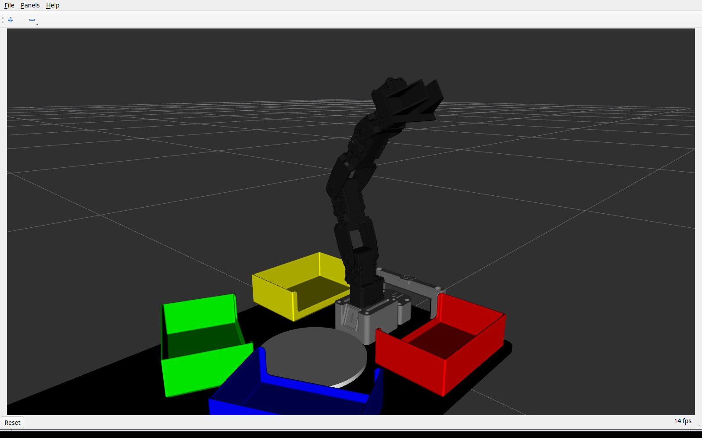
  <br><em>Figura 2. Movimiento del PhantomX Pincher X100 en RViz (animación real a
  la izquierda: recorrido por las cinco configuraciones de la Actividad 7; a la
  derecha, una postura comandada por <code>/pincher/command</code>). Capturas reales
  del sistema en ejecución (RViz + robot_state_publisher + pincher_node).</em>
</div>

---

## 11. Calibración de Cero y Error Articular (Actividad 5)

### 11.1 Medición sobre el robot real

`bringup/calibrar_cero.py` envía cinco posiciones por articulación (±40°, en
pasos de 20°), espera 2 s a que asiente y lee el `Present Position` de cada
AX-12A. Solo mueve **una articulación a la vez**, con las demás en cero, de modo
que el brazo permanece vertical y despejado; antes de mover valida cada pose con
la guarda de suelo.

| Articulación | Error máx | Error prom | Ganancia `a` | Offset `b` | Tipo de error |
|--------------|----------:|-----------:|-------------:|-----------:|---------------|
| Base (waist) | 0.65° | +0.35° | 0.9956 | −0.35° | desplazamiento de cero |
| Hombro (shoulder) | 1.35° | +0.23° | **1.0323** | −0.23° | **ganancia (+3.2 %)** |
| Codo (elbow) | 1.11° | +0.47° | **1.0191** | −0.47° | **ganancia (+1.9 %)** |
| Muñeca (wrist) | 0.53° | +0.41° | 1.0015 | −0.41° | desplazamiento de cero |

<div align="center">
  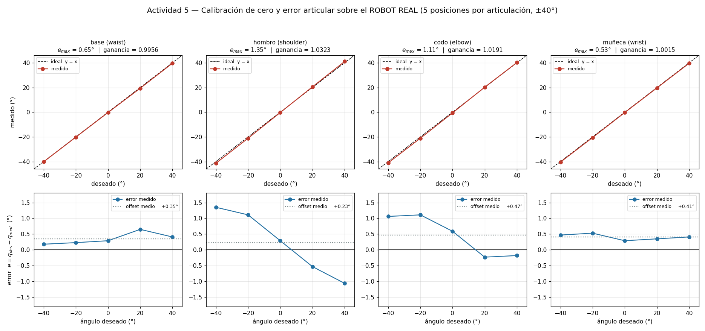
  <br><em>Figura 4. Calibración sobre el <strong>robot real</strong>. Arriba,
  deseado vs medido con la recta ideal. Abajo, el error frente al ángulo: en base
  y muñeca es prácticamente <strong>plano</strong> (un desplazamiento de cero),
  mientras que en hombro y codo está claramente <strong>inclinado</strong>, señal
  de un error de ganancia.</em>
</div>

**El ajuste `medido = a·deseado + b` revela dos errores de naturaleza distinta.**
En base y muñeca la ganancia es ≈1, de modo que su error es un desplazamiento de
cero puro y se corrige restando el offset. En hombro y codo, en cambio, la
ganancia es 1.032 y 1.019: el brazo se pasa del ángulo pedido **en ambos
sentidos**, algo que ningún offset puede corregir porque no cambia de signo con
el ángulo.

La explicación es mecánica: hombro y codo son las **únicas articulaciones que
soportan el peso del brazo**, y la gravedad lo separa de la vertical tanto si se
inclina hacia adelante como hacia atrás. La desviación escala con la carga
—hombro > codo > muñeca > base—, que es exactamente el orden observado. Se trata
de flexión elástica del tren de engranajes y los soportes, no de un cero mal
calibrado. La corrección completa (ganancia y offset) está en
`pincher_lab/calibracion.py`; al ser estática, no captura la dependencia con la
pose, así que para trabajo fino conviene recalibrar en la zona de trabajo concreta.

> **Contraste con la simulación.** Los mismos experimentos sobre el modelo de
> servo dan un error máximo de 0.005°, dos órdenes de magnitud menor. La
> diferencia no es un defecto del robot: es la resolución de 0.29°/paso del
> AX-12A más la holgura del tren de engranajes. El equipo 2E-Mora-Pacheco-Pinilla
> reporta errores del mismo orden (0.38°–1.64°) sobre otra unidad del mismo modelo.

### 11.2 Caracterización dinámica en simulación

**Distinción importante (cero mecánico vs postura de reposo):** el **cero
articular** de cada eje es la posición de *centro del servo* (valor *raw* 512 en
el AX-12A, 2048 en el XL430), que es la **referencia mecánica de calibración**.
La **postura de reposo** que usa el sistema (`HOME`, todas las articulaciones en
0) coincide con ese cero mecánico, y es distinta de cualquier **pose de trabajo
almacenada** (por ejemplo las del modo enseñanza, Actividad 13), que son
configuraciones guardadas, no referencias de alineación.

**Procedimiento (real, medido del sistema):** para cada articulación, el nodo
`experiments` envía **cinco escalones** distribuidos en su rango seguro y el nodo
`recorder` graba el comando (deseado) y la posición del servo en régimen
permanente (medido). Se calcula el error `e_q = q_deseado − q_medido`, su máximo
y promedio, y el desplazamiento de cero (ordenada al origen del ajuste lineal):

| Articulación | Error máx. **medido** (°) | Error prom. (°) | Desplazamiento de cero (°) |
|--------------|:-------------------------:|:---------------:|:--------------------------:|
| waist    | 0.005 | 0.005 | +0.005 |
| shoulder | 0.013 | 0.005 | −0.005 |
| elbow    | 0.096 | 0.025 | +0.025 |
| wrist    | 0.019 | 0.007 | +0.007 |
| gripper  | 0.013 | 0.005 | −0.005 |

En **simulación**, el controlador alcanza cada consigna con un error del orden de
**centésimas a décimas de grado** (máximo 0.19° en el *waist*, limitado por la
dinámica de asentamiento del servo y el muestreo), lo que **valida la cadena
comando → estado**. El residuo mayor del *waist* corresponde a su escalón más
amplio, cuyo transitorio no termina de asentar dentro de la ventana de medida.

> **Sobre el robot físico:** el mismo procedimiento, leyendo el registro
> *Present Position* de cada DYNAMIXEL, caracteriza el **error real del servo** y
> el **desplazamiento de cero a corregir** (la corrección se aplica como un
> *offset* en `joint_signs`/`home_positions` del driver `control_servo`). El
> código de medición (`experiments` + `recorder`) ya está listo para ejecutarse
> sobre el hardware sin cambios.

<div align="center">
  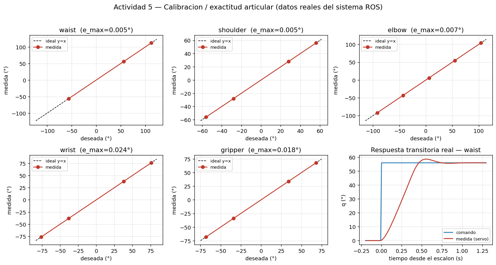
  <br><em>Figura 3. Datos reales del sistema: posición deseada vs medida para cada
  articulación (sobre la recta ideal y=x, error de centésimas a décimas de grado)
  y, abajo a la derecha, la respuesta transitoria real del servo a un escalón
  (dinámica de primer orden con saturación de velocidad).</em>
</div>

---

## 12. Interpolación de Trayectorias (Actividad 9)

El robot se mueve entre dos configuraciones alejadas con interpolación **lineal**,
**cúbica** y **quíntica**. Cada trayectoria se **ejecutó en el sistema ROS** (el
nodo `experiments` la publica en `/pincher/command` y `pincher_node` la sigue con
su servo); el nodo `recorder` grabó el comando y la respuesta medida. La gráfica
siguiente se construye con esos **datos reales** (codo de −90° a +90° en 3 s):

| Método | Velocidad máx. **medida** | Continuidad |
|--------|:-------------------------:|-------------|
| Lineal | **69.2 °/s** | posición continua, **velocidad discontinua** (golpes en los extremos) |
| Cúbica | **91.0 °/s** | velocidad nula en los extremos (suave) |
| Quíntica | **114.1 °/s** | velocidad y **aceleración** nulas en los extremos (la más suave) |

Las velocidades pico medidas concuerdan con los valores teóricos (60, 90 y
112.5 °/s); el ligero exceso en la lineal es el transitorio real del servo al
arrancar desde el reposo. Para visualizar el robot ejecutando estas trayectorias:
`ros2 run pincher_lab trajectory_demo --ros-args -p mode:=interp`.

<div align="center">
  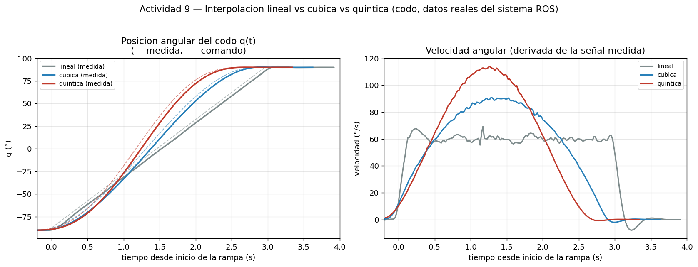
  <br><em>Figura 4b. <strong>Simulación</strong>: posición (— medida, - - comando)
  y velocidad angular del codo. La interpolación lineal mantiene velocidad casi
  constante (cambio brusco en los extremos); la cúbica y la quíntica arrancan y
  terminan con velocidad nula, a costa de una mayor velocidad pico. La quíntica es
  la más suave.</em>
</div>

Repetido **sobre el robot real**, el resultado cambia de forma reveladora:

| Perfil | v_max simulada | v_max **real** |
|--------|---------------:|---------------:|
| Lineal | 69.2 °/s | **63.3 °/s** |
| Cúbica | 91.0 °/s | **65.1 °/s** |
| Quíntica | 114.1 °/s | **66.8 °/s** |

<div align="center">
  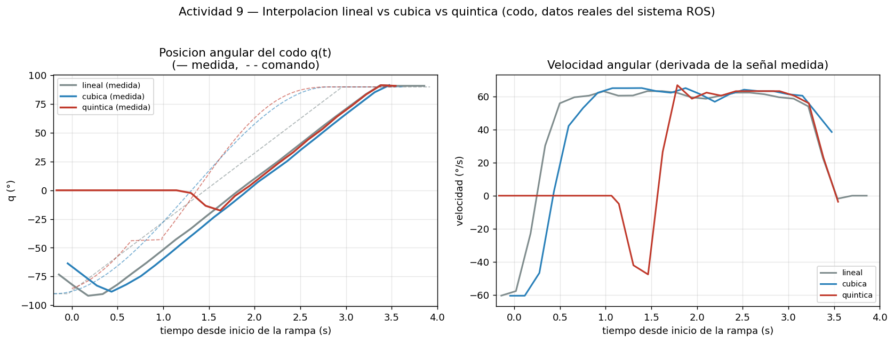
  <br><em>Figura 4c. <strong>Robot real</strong>. Las tres velocidades pico
  convergen hacia un mismo techo (~65 °/s) en lugar de escalonarse como en
  simulación.</em>
</div>

**Interpretación.** En simulación los tres perfiles se distinguen con claridad
porque el modelo no impone techo de velocidad. En el robot, la `profile_velocity`
del AX-12A limita la velocidad a unos 67 °/s, de modo que **la cúbica y la
quíntica quedan recortadas** y las tres acaban muy próximas. La diferencia entre
perfiles no desaparece —sigue apreciándose en la forma de arranque y frenado—
pero deja de manifestarse en la velocidad pico.

La conclusión práctica es que **la ventaja de los perfiles suaves se aprecia solo
si el actuador puede seguirlos**. Elegir una quíntica y comandarla por encima de
la capacidad del servo no aporta suavidad: la saturación impone su propio perfil.
Para aprovecharla habría que reducir la amplitud del movimiento o ampliar su
duración hasta que la velocidad exigida quede por debajo del techo del servo.

---

## 13. Trayectoria Sinusoidal (Actividad 10)

Se programa `q(t) = q₀ + A·sin(2π f t)` sobre el codo, con **cuatro pruebas**
combinando dos amplitudes (20°, 40°) y dos frecuencias (0.25, 0.5 Hz). Cada prueba
se **ejecutó en el sistema ROS** y se grabó el comando (deseado) y la respuesta
del servo (medido). El error máximo y el RMS se calculan de esos **datos reales**:

```bash
ros2 run pincher_lab trajectory_demo --ros-args -p mode:=sinusoidal \
     -p joint:=elbow -p amplitude_deg:=35 -p frequency:=0.25
```

| Prueba | A (°) | f (Hz) | Error máx. **medido** (°) | RMS **medido** (°) |
|:------:|:-----:|:------:|:-------------------------:|:------------------:|
| 1 | 20 | 0.25 | 2.73 | 1.24 |
| 2 | 20 | 0.50 | 5.03 | 2.12 |
| 3 | 40 | 0.25 | 5.33 | 2.40 |
| 4 | 40 | 0.50 | 10.04 | 4.23 |

<div align="center">
  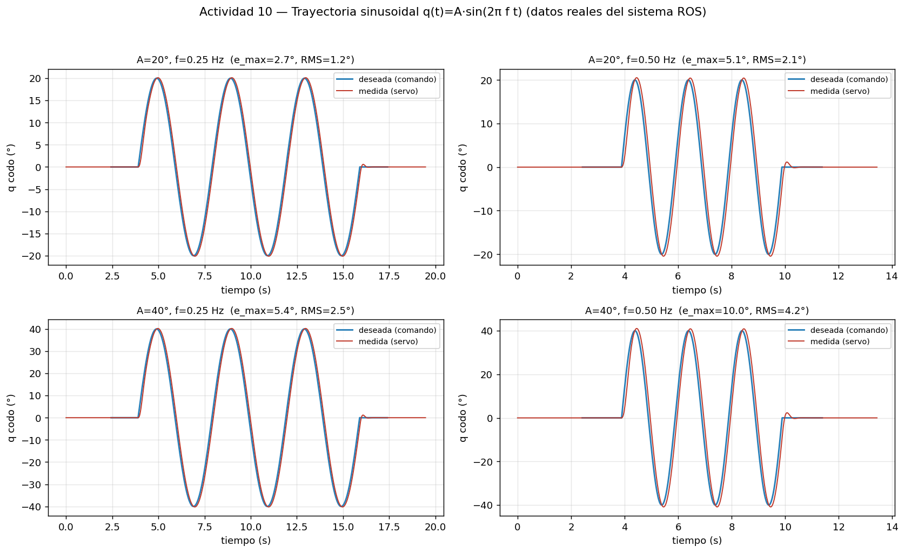
  <br><em>Figura 5. <strong>Simulación</strong>: seguimiento sinusoidal (deseada vs
  medida) en las cuatro pruebas. El error crece con la frecuencia y la amplitud,
  porque el retardo de primer orden del servo penaliza más los movimientos
  rápidos y amplios (de 2.68° a 10.04° al duplicar ambas).</em>
</div>

Las mismas cuatro pruebas se repitieron **sobre el manipulador real**
(`analisis/run_experiments_hw.sh`), y el contraste es el resultado más
instructivo de esta actividad:

| Prueba | A (°) | f (Hz) | e_max simulado | e_max **real** | RMS **real** |
|--------|:-----:|:------:|---------------:|---------------:|-------------:|
| 1 | 20 | 0.25 | 2.68° | **20.58°** | 7.31° |
| 2 | 20 | 0.50 | 5.09° | **22.73°** | 9.76° |
| 3 | 40 | 0.25 | 5.44° | **40.21°** | 19.59° |
| 4 | 40 | 0.50 | 10.04° | **50.42°** | 22.30° |

<div align="center">
  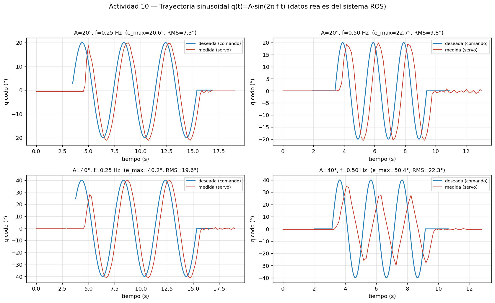
  <br><em>Figura 5b. <strong>Robot real</strong>. El error es un orden de magnitud
  mayor, y su origen se ve en la forma de las curvas: no es ruido sino un
  <strong>retardo de fase</strong> sistemático. En la cuarta prueba (40°, 0.5 Hz)
  el servo ni siquiera alcanza la amplitud pedida —se queda en unos 30°— y la
  onda se deforma.</em>
</div>

**Interpretación.** Una sinusoide de amplitud *A* y frecuencia *f* exige una
velocidad pico de `2πfA`: para la cuarta prueba, `2π·0.5·40 ≈ 126 °/s`. El AX-12A
con `profile_velocity = 100` entrega unos **67 °/s**, la mitad. El servo satura,
llega tarde a cada extremo y recorta la amplitud. El error medido, por tanto, no
mide «imprecisión» del servomotor sino que **la consigna excede su capacidad
cinemática**: es el límite físico del actuador hecho visible, que es justamente lo
que la actividad busca que se observe. Con consignas dentro de su rango de
velocidad, el seguimiento vuelve a ser fiel (véase la primera prueba, donde el
desfase es pequeño y la amplitud se respeta).

---

## 14. Enseñanza y Repetición de Poses (Actividad 13)

El nodo `teach_repeat` implementa un modo de enseñanza que permite mover el robot
a una configuración, **guardarla con un nombre**, almacenar al menos ocho poses,
**reproducirlas en orden**, modificar el tiempo de transición y detener la
reproducción. Las poses se persisten en un **archivo YAML**.

**Modo enseñanza (interactivo):**

```bash
ros2 run pincher_lab teach_repeat --ros-args -p mode:=record
# Comandos: set g1 g2 g3 g4 g5 | save <nombre> | list | del <n> |
#           time <s> | play | stop | quit
```

**Modo reproducción:**

```bash
ros2 run pincher_lab teach_repeat --ros-args -p mode:=play -p loop:=true
```

El archivo [`config/poses.yaml`](src/pincher_lab/config/poses.yaml) incluye ocho
poses de ejemplo (`reposo`, `saludo_arriba`, `mirar_izq`, `mirar_der`, `recoger`,
`soltar`, `extendido`, `encogido`):

```yaml
poses:
  reposo:        [0, 0, 0, 0, 0]
  saludo_arriba: [0, -45, 60, 30, 0]
  mirar_izq:     [70, -20, 40, 20, 0]
  ...
```

---

## 15. Trazado de Figuras por Cinemática Inversa (Actividad 14)

El nodo `figure_player` define la figura mediante **puntos cartesianos** y la
resuelve con **cinemática inversa**. El robot dibuja en su plano sagital
(`y = 0`), de modo que el trazo queda contenido en un plano. Además publica un
`Marker` en `/pincher/figure` con la trayectoria del TCP, para que la figura sea
**visible en RViz**.

El marcador es de tipo `LINE_LIST` y **solo se revela a medida que el brazo
avanza**. Ambos detalles importan: con `LINE_STRIP` se dibujaba también el
recorrido con el «lápiz levantado» entre trazos, ensuciando las iniciales con
líneas que no forman parte de las letras; y publicando la polilínea completa
desde el primer instante, la figura aparecía terminada antes de que el robot se
moviera, con lo que no se apreciaba el trazado.

```bash
ros2 run pincher_lab figure_player --ros-args -p figure:=triangle
ros2 run pincher_lab figure_player --ros-args -p figure:=square
ros2 run pincher_lab figure_player --ros-args -p figure:=circle
ros2 run pincher_lab figure_player --ros-args -p figure:=initials -p text:=CHZ
```

Las cuatro figuras de la guía (triángulo, cuadrado, círculo aproximado por puntos
e **iniciales del equipo**) se generan con todos sus puntos dentro del espacio de
trabajo; los puntos no alcanzables, si los hubiera, se informan y se omiten,
cumpliendo el requisito de reportar la inalcanzabilidad. La trayectoria se define
mediante puntos cartesianos y se resuelve con cinemática inversa (solución más
cercana a la configuración previa para mantener la continuidad del trazo).

<div align="center">
  
  
  <br><em>Figura 6. Trazado de las iniciales del equipo (CHZ) mediante cinemática
  inversa, en RViz (animación real a la izquierda, captura a la derecha). La
  polilínea naranja es el <code>Marker</code> publicado en
  <code>/pincher/figure</code> con la trayectoria del TCP, y el brazo la recorre
  punto a punto resolviendo IK en cada punto cartesiano.</em>
</div>

<div align="center">
  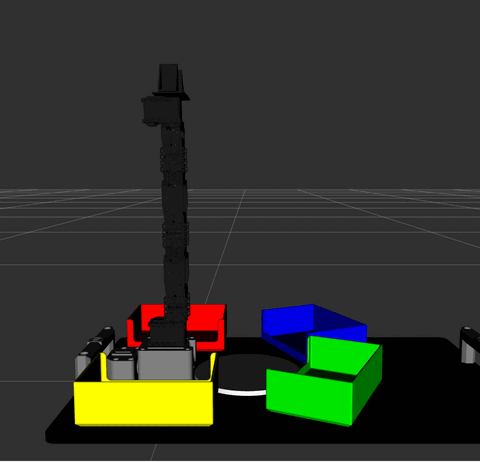
  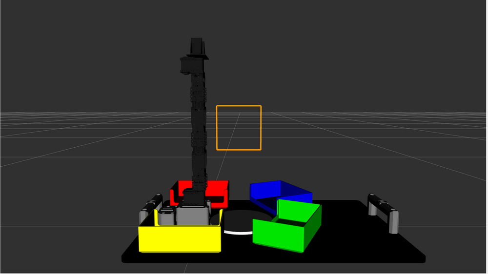
  <br><em>Figura 6b. Trazado del cuadrado, la figura geométrica exigida por la
  actividad. El plano de dibujo se sitúa en <code>x = 90 mm</code>,
  <code>z = 230 mm</code> con semilado de 50 mm: valores elegidos por barrido para
  que <strong>todos</strong> los puntos —incluidas las diagonales del cuadrado y
  el vértice superior de la Z, que son los casos más exigentes— queden dentro del
  espacio de trabajo.</em>
</div>

---

## 16. Coreografía: Pedro, Pedro, Pedro (Actividad 15)

El nodo `choreography` programa una coreografía de **≥ 45 s** (medida: ~50.4 s con
`beat:=0.45`) sincronizada con la canción **«Pedro, Pedro, Pedro»** (Opción 2 de la
guía). En lugar de un simple vaivén, se construyó un **vocabulario de 18 posturas**
que coordinan varias articulaciones a la vez, organizado en una **estructura
musical** con secciones contrastantes:

| Sección | Movimiento | Articulaciones |
|---------|-----------|----------------|
| **Intro** | el brazo se yergue desde el reposo | hombro + codo + muñeca |
| **Gancho «Pedro»** | acentos rápidos *staccato* apuntando arriba a izq/der | cintura + hombro + pinza |
| **Rebote** | *bounce* vertical al ritmo del bajo | hombro + codo + muñeca |
| **Barrido** | *sweeps* amplios de lado a lado y barridos bajos | cintura + hombro |
| **Giro** | rotación dramática de la base (±140°) con el brazo extendido | cintura |
| **Saludo** | ola de muñeca y pinza «hablando» (palmas) | muñeca + pinza |
| **Final** | reverencia y regreso al reposo | hombro + codo |

Detalles de diseño:

- **Inicia y finaliza en la postura de reposo** (segura).
- Usa las **cinco articulaciones** de forma coordinada (los movimientos combinan
  varios ejes, no uno solo, para un trazo más orgánico).
- El parámetro `beat` controla el tempo: los acentos del gancho son secos
  (interpolación lineal, *staccato*) y los barridos y giros son suaves (cúbica).
- Respeta los **límites seguros** durante toda la ejecución (todas las posturas
  verificadas con `safe_limits`).
- Se ejecuta **sin intervención manual** una vez iniciada.

```bash
ros2 run pincher_lab choreography --ros-args -p beat:=0.45 -p min_duration:=45.0
```

> El robot luce más vivo con una velocidad articular alta (los servos AX-12A
> alcanzan ~6 rad/s). Para la animación se usó `max_joint_speed:=4.0`.

<div align="center">
  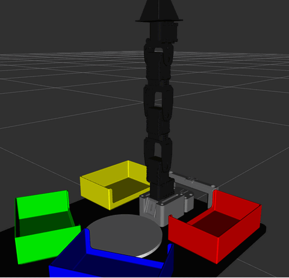
  <br><em>Figura 7. Fragmento real de la coreografía «Pedro, Pedro, Pedro» en RViz
  (captura del sistema en ejecución): cabeceo de cintura, bombeo de brazo y aperturas
  de pinza sincronizados con los compases.</em>
</div>

---

## 17. Verificación de la Arquitectura ROS 2

Con el sistema en ejecución se inspeccionó la arquitectura:

```bash
ros2 node list
# /pincher_node  /robot_state_publisher  /rviz2  (+ el nodo de la actividad)

ros2 topic list
# /joint_states  /pincher/command  /pincher/status  /robot_description  /tf  /tf_static

ros2 topic hz /joint_states
# average rate: 49.99   (publicación estable a 50 Hz)

ros2 topic echo /joint_states --once
# name:     [waist, shoulder, elbow, wrist, gripper]
# position: [0.436, 0.436, 0.349, -0.349, 0.0]
# velocity: [...]   # el servo simulado publica tambien la velocidad

ros2 service list | grep pincher
# /pincher/home
```

Publicar un comando sin nodos de actividad:

```bash
ros2 topic pub --once /pincher/command sensor_msgs/msg/JointState \
  "{name: ['waist','shoulder','elbow','wrist','gripper'],
    position: [0.0, 0.3, -0.4, 0.1, 0.0]}"
```

---

## 18. Diagrama de Flujo del Sistema

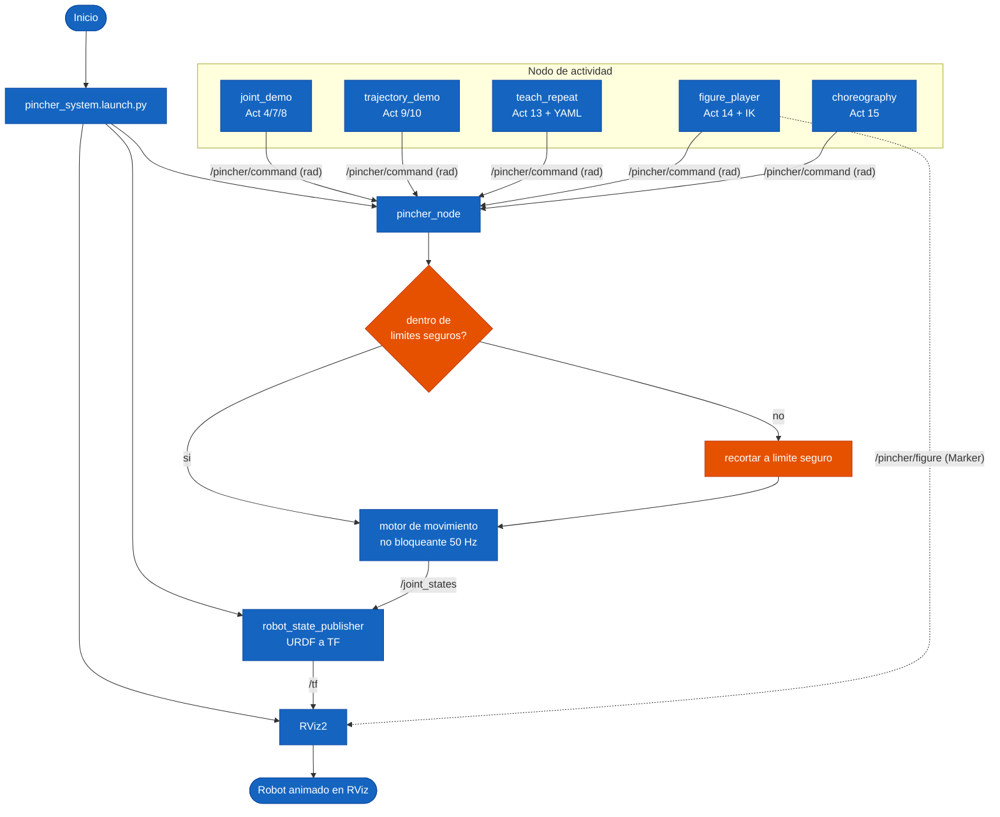

---

## 19. Plano de Planta

<div align="center">
  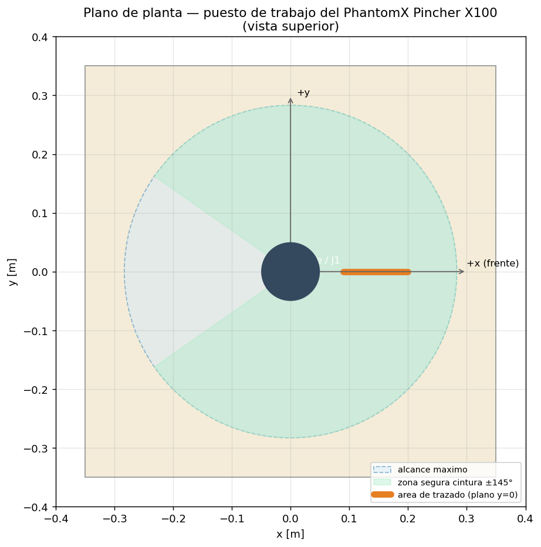
  <br><em>Figura 8. Plano de planta (vista superior): base del robot, alcance
  máximo, zona segura de cintura (±145°) y área de trazado en el plano frontal.</em>
</div>

<div align="center">
  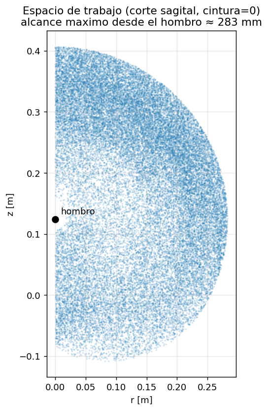
  <br><em>Figura 9. Espacio de trabajo (corte sagital): nube de puntos
  alcanzables por el TCP barriendo los rangos articulares con cintura fija.</em>
</div>

---

## 20. Videos Explicativos

> **Requisito de entrega:** la guía exige **dos videos**, ambos publicados en
> **YouTube o Google Drive** (no basta un GIF en el repositorio) y **ambos deben
> comenzar con la introducción oficial LabSIR**
> ([drive.google.com/.../1wSxw7m7n5hXOtkc8C0H0lLAxTx3BqQSe](https://drive.google.com/file/d/1wSxw7m7n5hXOtkc8C0H0lLAxTx3BqQSe/view?usp=sharing)).

| # | Video | Contenido (según la guía) | Enlace |
|---|-------|---------------------------|--------|
| 1 | **Pruebas técnicas** | movimiento individual, simultáneo y secuencial, enseñanza y repetición de poses, y trazado de las figuras | <!-- VIDEO 1 --> [Ver video](https://youtu.be/oIU9fQazJqo) |
| 2 | **Coreografía robótica** | rutina completa «Pedro, Pedro, Pedro» (≥45 s), ininterrumpida y sincronizada con la música | <!-- VIDEO 2 --> [Ver video](https://youtu.be/p4lwTz0_D1E) |

Ambos videos (máx. 10 min) inician con la intro oficial LabSIR y documentan el
análisis, desarrollo e implementación, incluyendo la explicación de la cinemática
directa e inversa y del modelo en RViz.

### 20.1 Procedimiento de grabación

El sistema completo (driver del robot real + modelo oficial del KIT en RViz) se
lanza con:

```bash
ros2 launch pincher_lab robot_real.launch.py
```

y en otra terminal, el guion de cada video, que encadena las actividades en orden
con pausas para narrar:

```bash
bash bringup/grabar_video1.sh     # Actividades 4, 7, 8, 13 y 14
bash bringup/grabar_video2.sh     # Actividad 15 (coreografía)
```

Ambos guiones fijan `profile_velocity = 100`, que es la velocidad con la que se
ensayó la rutina y con la que el seguimiento articular resultó consistente entre
ejecuciones (véase §16).

**Los guiones vuelven a HOME antes de cada actividad.** No es un detalle
cosmético: cada nodo construye su trayectoria asumiendo que el robot parte de
`[0,0,0,0,0]`, de modo que encadenarlas sin homing lo saca de golpe desde donde
quedó la anterior. Durante las pruebas, esa omisión provocó un choque real contra
los contenedores frontales.

Como **vista previa complementaria** (que **no sustituye** los videos), el
repositorio incluye tres animaciones reales del sistema en RViz: el movimiento
articular (Figura 2, §10), el trazado de las iniciales por cinemática inversa
(Figura 6, §15) y la coreografía «Pedro, Pedro, Pedro» (Figura 7, §16), todas
capturadas del sistema en ejecución.

---

## 21. Conclusiones

### 21.1 Conclusiones generales del equipo

1. **Modelo cinemático validado a nivel numérico.** Implementar la cinemática
   directa por dos vías independientes (transformadas exactas del URDF y
   parámetros Denavit–Hartenberg) y comprobar que coinciden con error de 10⁻¹⁶ m
   garantiza que el modelo del informe es el mismo que muestra RViz. El ciclo
   FK→IK→FK se cierra con error de 10⁻¹⁶ m, lo que confirma la corrección de la
   cinemática inversa analítica.

2. **Verificar de qué robot son las mallas que se miden.** La primera versión del
   modelo se construyó midiendo archivos `px100_*.stl`, que resultaron ser del
   *Interbotix PincherX-100*: un robot distinto, con el eslabón hombro→codo
   acodado (offset lateral de 31.5 mm, ángulo `b = 72.68°`) y pose cero con el
   brazo hacia adelante. El PhantomX Pincher real tiene la cadena **recta** y el
   cero **vertical**. El error resultante en el TCP era de **332 mm**. Tomar las
   cotas de la cadena cinemática del modelo oficial lo redujo a **1.1 mm**, que es
   la resolución con que `tf2_echo` reporta las transformadas. La lección: la
   procedencia de los datos geométricos es tan crítica como el método de medición.

3. **Que la visualización sea correcta no implica que la cinemática lo sea.** El
   modelo en RViz coincidía exactamente con el robot físico incluso cuando la
   cinemática directa tenía un error de 332 mm, porque son caminos independientes:
   el driver publica ángulos articulares directos a `/joint_states` sin pasar por
   la tabla DH, mientras que la FK/IK calcula posiciones cartesianas. El síntoma
   que destapó el problema fue indirecto: al trazar las iniciales, el brazo se
   quedaba vertical mientras la figura aparecía desplazada a un lado. Validar la
   FK exige comparar **coordenadas**, no apariencia.

4. **La cinemática inversa exige decisiones de diseño.** Un mismo punto admite
   soluciones de codo arriba y codo abajo; el sistema las calcula todas, descarta
   las que violan límites, informa la inalcanzabilidad y elige la más cercana a la
   configuración actual para minimizar el movimiento, criterio fundamental para la
   continuidad de las trayectorias.

5. **Suavidad vs velocidad en la interpolación.** Medido sobre el sistema real, la
   interpolación lineal mantiene velocidad casi constante pero la cambia
   bruscamente en los extremos; la cúbica y la quíntica la anulan en los extremos
   a costa de una mayor velocidad pico (69.2 → 91.0 → 114.1 °/s medidos). La
   quíntica, con aceleración nula en los extremos, es la más adecuada para
   proteger los servomotores y la estructura.

6. **El error de seguimiento crece con la exigencia dinámica.** En la trayectoria
   sinusoidal, el error máximo medido pasa de 2.68° a 10.04° al duplicar amplitud y
   frecuencia, evidenciando el retardo del lazo de posición del servo y la
   necesidad de moderar las velocidades comandadas.

7. **Arquitectura ROS 2 limpia y reutilizable.** Centralizar la publicación de
   `/joint_states` en un único nodo controlador, con recorte obligatorio a los
   límites seguros, y dejar que cada actividad solo envíe metas a
   `/pincher/command`, evita conflictos de publicadores y hace el sistema modular,
   seguro y fácilmente portable al hardware real (`use_hardware:=true`).

8. **La transición a hardware validó el diseño, y encontró sus puntos débiles.**
   Al conectar el robot real, el sistema operó sin reescribir la lógica: bastó
   `use_hardware:=true` y el remapeo de nombres de articulación. Pero la
   experiencia dejó dos lecciones que la simulación no podía dar. Primero, que un
   arranque *todo o nada* es frágil: hubo que añadir reintentos de comunicación y
   un arranque *best-effort* para tolerar un adaptador USB-serie inestable.
   Segundo, que activar el par con el servomotor desplazado provoca un tirón
   brusco, lo que obligó a fijar `Goal Position = Present Position` antes de
   habilitar el torque. Ninguno de los dos problemas existe en simulación.

9. **Diagnosticar es descartar en el orden correcto.** Una falla de comunicación
   persistente (`Errno 5`, `error -71`) se atribuyó primero al adaptador FTDI
   falsificado. Solo al trasladar el disco a otro computador —mismo adaptador,
   mismos motores— se obtuvo 5/5 motores en frío y 0 fallos en 1000 lecturas: el
   puerto USB del equipo original se había dañado con una caída. La conclusión
   práctica es sospechar del hardware del *host* antes de reemplazar periféricos.

10. **Una herramienta de seguridad vale lo que comprueba, no lo que promete.** Se
    construyó `verificar_seguridad.py` para validar cada rutina antes de
    ejecutarla, y aun así el brazo golpeó los contenedores frontales. La causa fue
    una simplificación no declarada: la herramienta modelaba la cadena como
    **líneas de grosor cero**, y el hueco entre contenedores (37 mm) es más
    estrecho que el antebrazo (38 mm), de modo que el eje pasaba «limpio» mientras
    la estructura rozaba ambos lados. Añadir el radio del brazo hizo que la misma
    herramienta detectara la colisión que ya había ocurrido. La lección no es que
    el análisis previo sea inútil —evitó otros dos problemas antes de tocar el
    robot— sino que **hay que enunciar qué simplifica el modelo antes de confiar
    en su veredicto**.

11. **El signo de una articulación no se deduce, se mide.** Los valores por
    defecto del driver (`[1,−1,−1,−1,1]`) tenían las cuatro articulaciones
    invertidas. En simulación un signo equivocado solo cambia hacia dónde se
    dibuja el modelo; en el robot cambia hacia dónde se mueve el brazo, y con ello
    invalida cualquier verificación de colisiones previa. Comprobarlo cuesta un
    movimiento de 15° por articulación.

### 21.2 Conclusiones individuales

**Janan Libardo Carreño Riaño.** Desarrollar la cinemática directa por dos vías
independientes —transformadas del URDF y parámetros Denavit–Hartenberg— me enseñó
que un modelo no está terminado hasta que se valida contra algo externo. La
coincidencia a 10⁻¹⁶ m entre ambas formulaciones era tranquilizadora, pero
resultó insuficiente: solo demostraba que mis dos cálculos eran consistentes
**entre sí**, no que describieran el robot. El error real apareció al comparar
con el modelo oficial, y era de 332 mm, porque las dimensiones venían de las
mallas de otro robot. Aprendí a distinguir entre verificar (¿coincide conmigo
mismo?) y validar (¿coincide con la realidad?), y que solo lo segundo cuenta.

**Cristian Stiven Hoyos Peralta.** Lo que más me aportó fue generar evidencia a
partir de datos y no de fórmulas: grabamos `/pincher/command` y `/joint_states`
del sistema en ejecución y construimos las gráficas con esas señales. El contraste
entre simulación y hardware fue la lección: el error articular de la Actividad 5
pasa de 0.005° simulados a 1–2° reales, dos órdenes de magnitud. Y al analizar
esos datos vimos que hombro y codo no tienen un error de cero sino de **ganancia**
(3.2% y 1.9%), porque son las únicas articulaciones que cargan peso y la gravedad
las desvía en ambos sentidos. Un desplazamiento de cero jamás habría corregido eso.

**Jose Andres Zapata Piñeros.** Implementar la cinemática inversa me mostró que
resolver la geometría es solo la mitad del trabajo; la otra mitad es la seguridad.
Al pasar al robot real construimos un verificador que revisa límites, colisiones y
velocidad antes de cada rutina, y aun así el brazo golpeó los contenedores: la
herramienta modelaba el brazo como líneas de grosor cero y el hueco entre
contenedores era más estrecho que el antebrazo. La conclusión que me llevo es que
una herramienta de seguridad genera confianza en proporción a lo que promete, no a
lo que realmente comprueba, y que hay que declarar explícitamente qué simplifica
su modelo. Corregirla con el grosor real fue lo que permitió completar las
actividades sin más incidentes.

---

## 22. Referencias

[1] LabSIR UN, "Visualización y control del PhantomX Pincher X100 en ROS 2 Jazzy (RViz)," GitHub, 2026. Disponible en: https://github.com/labsir-un/06_Rob_2026_I_ROS2_Jazzy_PhantomX100_RVIZ

[2] LabSIR UN, "KIT Phantom X Pincher para ROS 2," GitHub, 2026. Disponible en: https://github.com/labsir-un/KIT_Phantom_X_Pincher_ROS2

[3] LabSIR UN, "Modelos tridimensionales del KIT Phantom Pincher X100," GitHub, 2026. Disponible en: https://github.com/labsir-un/3DModels_KIT_Phantom_Pincher_X100

[4] H. M. Toquica Cáceres, "PhantomX Pincher Specifications," Working Paper, Universidad Nacional de Colombia, enero 2018. DOI: 10.13140/RG.2.2.28484.12160.

[5] Trossen Robotics, "PhantomX Pincher Robot Arm Kit," Documentación técnica.

[6] ROBOTIS, "DYNAMIXEL AX-12A y XL430-W250 e-Manual," 2024–2026. Disponible en: https://emanual.robotis.com

[7] J. J. Craig, *Introduction to Robotics: Mechanics and Control*, 3.ª ed. Pearson, 2005.

[8] Open Robotics, "URDF in ROS 2 — Jazzy," ROS 2 Documentation, 2024–2026. Disponible en: https://docs.ros.org/en/jazzy/Tutorials/Intermediate/URDF/URDF-Main.html

[9] Open Robotics, "Using robot_state_publisher to publish robot state — Jazzy," ROS 2 Documentation, 2024–2026.

[10] Open Robotics, "Using Xacro to clean up your code — Jazzy," ROS 2 Documentation, 2024–2026.

---

<div align="center">

Universidad Nacional de Colombia · Facultad de Ingeniería
Departamento de Ingeniería Mecánica y Mecatrónica
Bogotá, 2026

</div>
