<div align="center">

<h3>Laboratorio No. 02</h3>

<h1>Robótica Industrial - Análisis y Operación del Manipulador Motoman MH6.</h1>

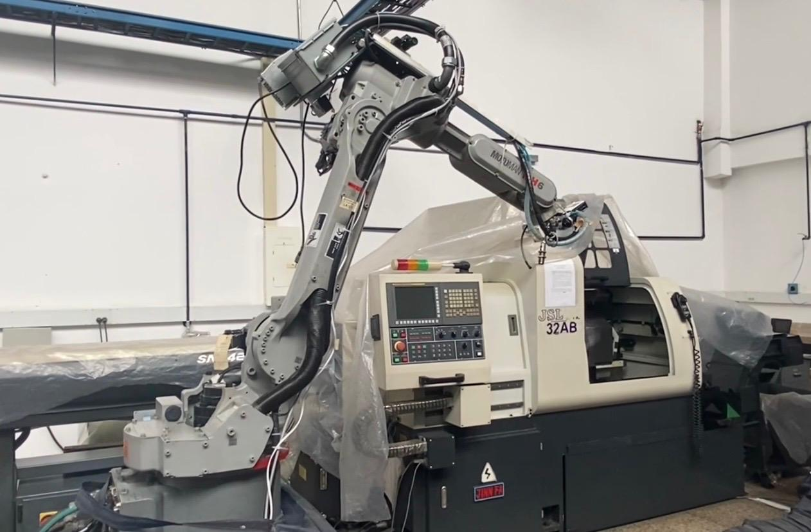<br>

<b>Figura 1. Manipulador Motoman MH6 </b>

</div>

---

## Introducción

Los manipuladores industriales son una parte importante en los procesos de automatización, cada modelo tiene características y configuraciones que lo hacen más adecuado para ciertas tareas. En este laboratorio se trabajó con el Motoman MH6, el controlador DX100 y RoboDK como herramienta de simulación y programación,  con el objetivo de realizar una comparación técnica con el ABB IRB 140 utilizado en la práctica anterior [Laboratorio 01](https://github.com/labsir-un/Robotica-2026-I-Equipo-2B-Pinzon-Quiroga-Sanchez/blob/main/Laboratorio%20No.%2001%20-%20Rob%C3%B3tica%20Industrial%20ABB%20IRB140%20y%20RobotStudio/README.MD). Además, de comprender sus configuraciones iniciales, modos de operación e igual que con el ABB  simular e implementar una trayectoria.

Para esta trayectoria, se consideraron los siguientes requerimientos:
- Utilizar coordenadas polares.
- El movimiento debe partir de una posición home especificada (puede ser el home del robot) y realizar la trayectoria de cada palabra y decoración con un trazo continuo. El movimiento debe finalizar en la misma posición de home en la que se inició.
- Bajo la sección de la trayectoria polar, incluir los nombres de los integrantes del equipo 

---

## Comparativa de las especificaciones técnicas del Motoman MH6 y el ABB IRB140

| Característica | Motoman MH6 | ABB IRB140 |
| --- | --- | --- |
| Carga Máxima [kg] | 6 | 5 |
| Alcance Horizontal [m] | 1.422 | 0.81 |
| Número de grados de libertad | 8 | 6 |
| Velocidad Angular máxima [°/s] | 610 * | 450 ** |
| Temperatura de operación [°C] | 0 - 45 | 5 - 45 |
| Peso [kg] | 130 | 98 |
| Aplicaciones típicas |Ensamblaje, Dispensado, Manipulación de materiales, TCP remoto.|Ensamblaje, Dispensado, Manipulación de materiales, TCP remoto.|

*Esta es la velocidad del 6to eje. Los otros ejes tienen menor velocidad.

**Esta es la velocidad del eje T. Los otros ejes tienen menor velocidad.

---

## Configuraciones iniciales del Motoman MH6

El manipulador Motoman MH6 cuenta con dos configuraciones iniciales, denominadas **home1** y **home2**. A continuación, se presenta cada una de estas posiciones, realizando una descripción más detallada y un breve análisis de las ventajas y desventajas asociadas a cada caso. 

Por otro lado, las denominaciones de las articulaciones corresponden a:

- S (Shoulder/Base): giro de la base.
- L (Lower Arm): movimiento del brazo inferior.
- U (Upper Arm): brazo superior/codo.
- R (Rotate): rotación de muñeca.
- B (Bend): flexión de muñeca.
- T (Twist/Tool): giro final de herramienta.

### Descripción Home 1

Inicialmente, en la figura 2.1 se presenta la configuración física del manipulador Motoman MH6 al recibir la instrucción de **“Work Home Position”**. Asimismo, en la figura 2.2 se muestran, a través de la pantalla del Teach Pendant, los valores correspondientes a los encoders de cada articulación.

<table align="center">
  <tr>
    <td align="center">
      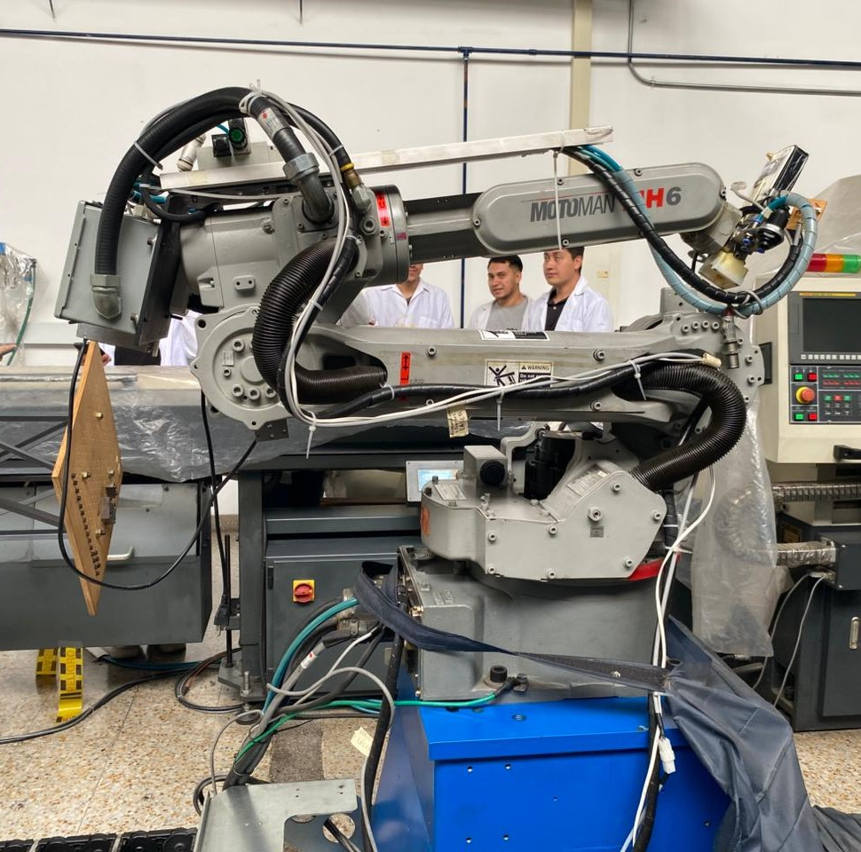<br>
      <b>Figura 2.1: Manipulador en home1 </b>
    </td>
    <td align="center">
      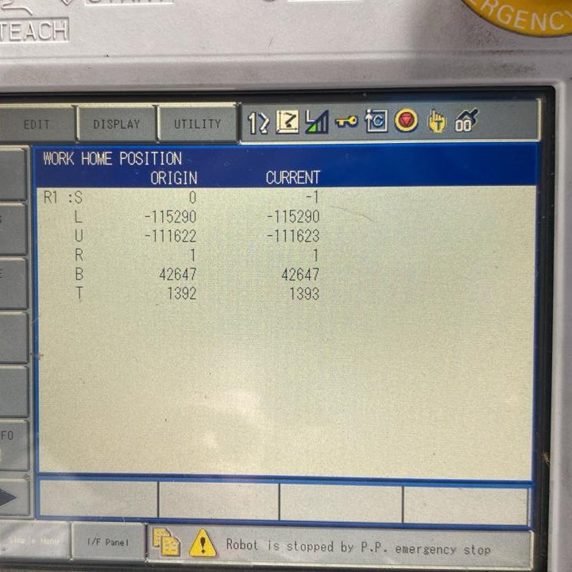<br>
      <b>Figura 2.2: Valores de los encoders en la posición de home1</b>
    </td>
  </tr>
</table>

En esta configuración, el manipulador se encuentra en una posición más reducida en términos de espacio, es decir, el brazo se encuentra “recogido” y cercano a la base. De esta manera, los encoders de las articulaciones L y U presentan valores altamente negativos, lo que indica el plegado general del brazo. Asimismo, se evidencia una inclinación considerable en la articulación B.

### Descripción Home 2

En este caso, la figura 3.1 muestra la segunda posición home del manipulador, mientras que la figura 3.2 presenta en el Teach Pendant los respectivos valores de los encoders.

<table align="center">
  <tr>
    <td align="center">
      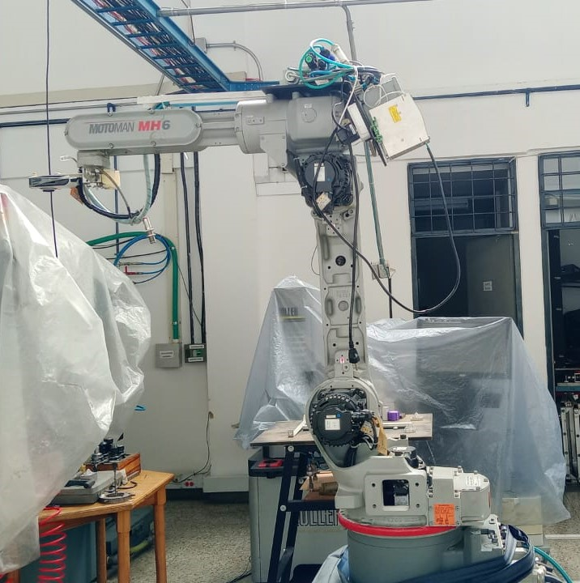<br>
      <b>Figura 3.1: Manipulador en home2</b>
    </td>
    <td align="center">
      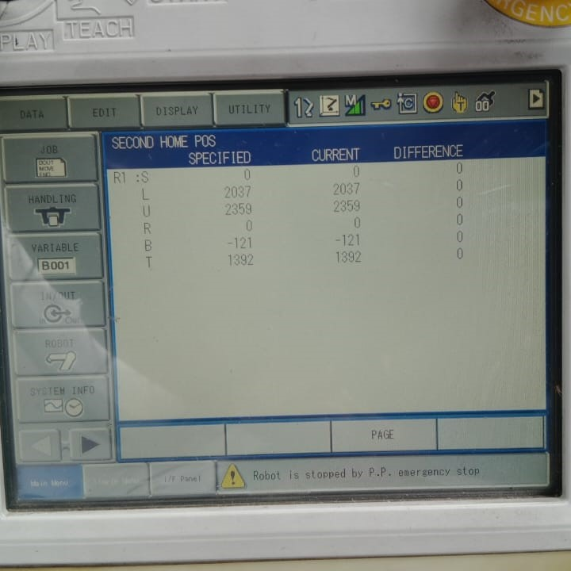<br>
      <b>Figura 3.2: Valores de los encoders en la posición de home2</b>
    </td>
  </tr>
</table>

Para este caso, el manipulador se encuentra mucho más desplegado dentro del área de trabajo. Los valores de las articulaciones L y U pasan a ser positivos, mientras que la articulación B toma un valor cercano a cero, siendo estas las principales diferencias con respecto a la configuración Home1.

### Posición preferente

Aunque ambas posiciones cuentan con ventajas y desventajas propias, a nivel general se considera que la posición **home1** es la más conveniente. Esto se debe principalmente a que, al encontrarse el manipulador en una posición más recogida, se optimiza el espacio ocupado por el robot, permitiendo una configuración más compacta y facilitando su transporte.

Por otro lado, al estar menos desplegado, el torque generado en las articulaciones es menor, lo que implica una reducción del esfuerzo mecánico y, por consiguiente, un menor esfuerzo requerido por los motores cuando el manipulador permanece en posición home.


---

## Modos de operación manual

<table align="center">
  <tr>
    <td align="center">
      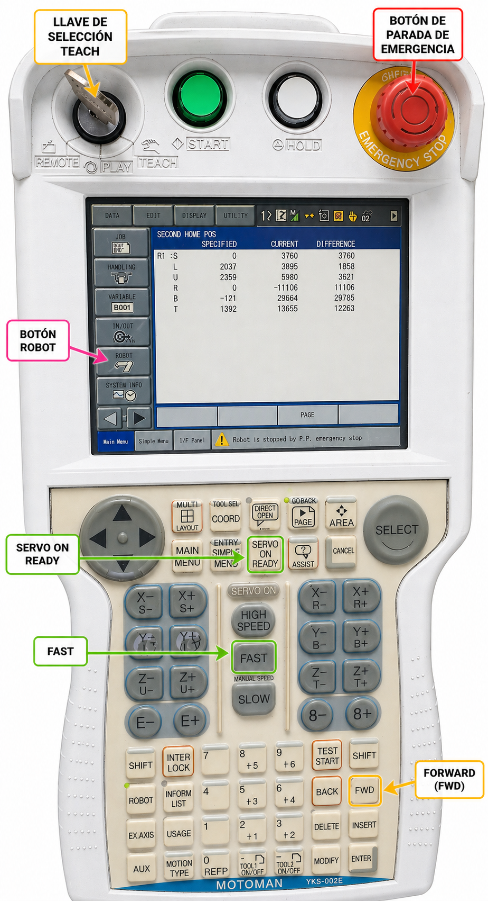<br>
      <b>Figura 4.1: Teach pendant </b>
    </td>
    <td align="center">
      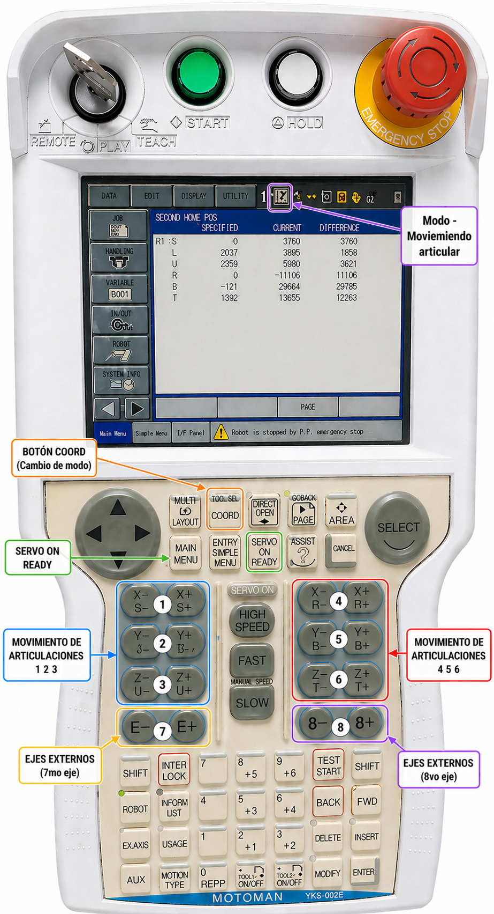<br>
      <b>Figura 4.2: Teach pendant movimiento manual</b>
    </td>
  </tr>
</table>

Teniendo el controlador DX100 energizado los pasos para realizar movimientos manuales son:

1. Se quita la parada de emergencia girando el botón en sentido horario.  
2. Con la llave se pone en modo “teach”  
3. En el menú de “robot”, se ubica “second home position”  
4. Se oprimen los botones en el siguiente orden: SERVO ON READY, FAST, FRENO y FWD (Forward), estos últimos dos se mantienen hasta llegar a la posición.  
5. Al tener el manipulador en la posición de home, con el botón COORD se cambia entre los modos de operación (Figura 4.2):
- Articular o en el espacio de las configuraciones.  
- Linear/Angular o en el espacio de la tarea, respecto a la base del manipular.  
- Linear/Angular o en el espacio de la tarea, respecto a la herramienta.  
- Cuaterniones (No utilizados en la práctica)  

6. En el modo Articular (como indicador en la parte superior de la pantalla aparece un icono con el manipulador sobre un eje de coordenadas), es posible mover los 8 grados de libertad del robot, 6 articulaciones internas del manipulador y 2 externas independientes. Estas se pueden accionar en sentido positivo o negativo siguiendo el orden de la <em>Figura 4.2</em> (teniendo encendido el indicador del botón SERVO ON READY)
7. En el modo Linear/Angular respecto a la base (el icono del indicador es un eje de coordenadas) o a la herramienta (el icono del indicador es una herramienta sobre un eje de coordenadas), se utilizan los botones anteriores como están distribuidos en el Teach Pendant para realizar traslaciones en X, Y, Z los de la izquierda y para  rotaciones en los ejes X, Y, Z los de la derecha.

---

## Niveles de velocidad

<div align="center">
  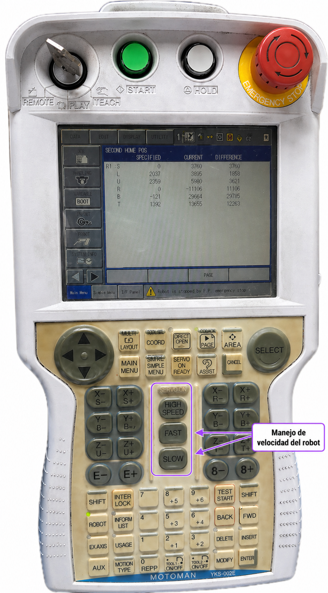
  <br>
  <b>Figura 5: Teach pendant (Botones para configurar velocidad) </b>
</div>

Para seleccionar manualmente la velocidad de operación del robot, se pueden utilizar los botones HIGH SPEED, FAST y SLOW. Con este teach pendant se pueden utilizar cuatro niveles de velocidad (slow, medium, high e inching). La velocidad del robot cambia como se señala a continuación: 

Cada vez que se oprime el botón FAST, la velocidad cambia en el siguiente orden:
Inching → Slow Speed → Medium Speed → High Speed.

Por otro lado, cada vez que se pulsa SLOW, la velocidad manual cambia en el siguiente orden:
High Speed → Medium Speed → Slow Speed → Inching.

Por su parte, el botón HIGH SPEED permite que el manipulador se mueva a alta velocidad, al pulsarse al tiempo junto a una de las teclas de eje durante el funcionamiento manual. La velocidad que se alcanza es especificada con antelación, teniendo en consideración que la máxima a la que puede llegar el punto central es de 250 mm/s en el modo manual.

Cada nivel de velocidad se puede verificar en la pantalla del teach pendant, en la barra superior. Se puede identificar como un triángulo dividido por líneas verticales, generando tres espacios. Además, sobre esta figura aparece una letra que indica, junto al símbolo, la velocidad. A medida que sube la velocidad, los espacios en esta figura se van llenando de color, como se puede observar en las siguientes imágenes.

- Inching

<p align="center">
  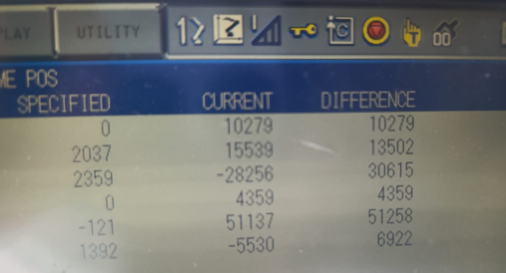<br>
  <b>Figura 6: Símbolo para Inching</b>
</p>

- Low Speed

<p align="center">
  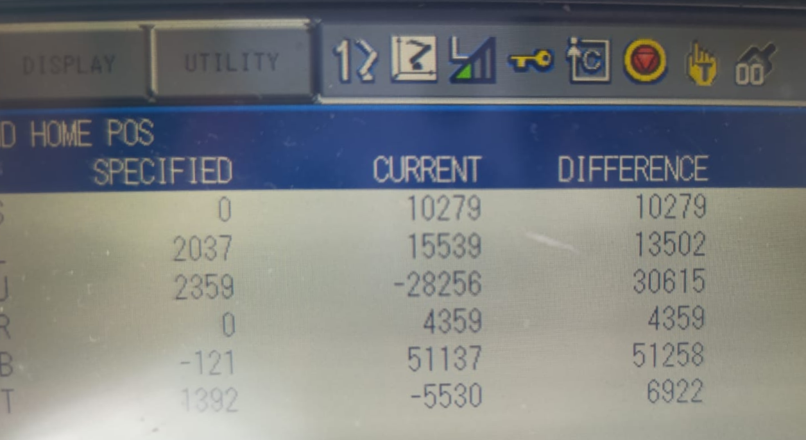<br>
  <b>Figura 7: Símbolo para Low Speed</b>
</p>

- Medium Speed

<p align="center">
  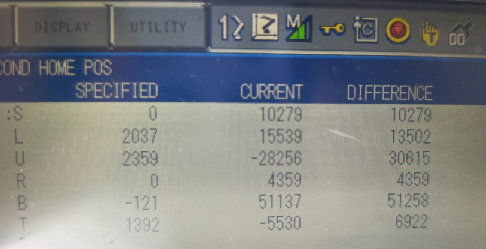<br>
  <b>Figura 8: Símbolo para Medium Speed</b>
</p>

- High Speed

<p align="center">
  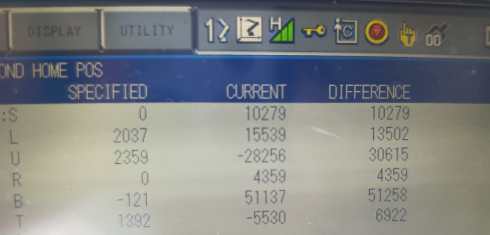<br>
  <b>Figura 9: Símbolo para High Speed </b>
</p>

---

## Principales funcionalidades de RoboDK

RoboDK es un software de simulación y programación orientado a aplicaciones de robótica industrial. Aquí es posible modelar, programar y validar trayectorias de una gran cantidad de referencias de manipuladores industriales sin necesidad de operar físicamente el robot a lo largo de este proceso. Particularmente con el manipulador Motoman MH6, RoboDK brinda la posibilidad de importar su modelo desde la biblioteca de robots que ofrece esta misma empresa en su página web. A través de este modelo, el software facilita la creación de movimientos, simulaciones y programas que posteriormente pueden ser ejecutados por el controlador del robot. 
Entre las principales funcionalidades de RoboDK se encuentran:

- Simulación tridimensional de robots industriales y entornos de trabajo.
- Programación de trayectorias y tareas automatizadas.
- Generación automática de programas compatibles con distintos fabricantes de robots.
- Validación de movimientos y detección de colisiones.
- Creación de herramientas y sistemas de referencia.
- Control y monitoreo del robot en tiempo real.
- Integración con lenguajes de programación externos (como se trabajó en el presente trabajo, Python).

### Comunicación entre RoboDK y el manipulador Motoman

La comunicación entre RoboDK y el manipulador Motoman MH6 se realizó mediante una conexión Ethernet utilizando la dirección IP del controlador del robot. En este proceso, RoboDK actuó como intermediario entre el computador y el manipulador industrial, permitiendo establecer el intercambio de instrucciones y movimientos entre ambos sistemas.

Para que esta comunicación pudiera realizarse correctamente, fue necesario que tanto el computador como el controlador Motoman se encontraran dentro de la misma red y haber configurado la dirección IP previamente dentro del software.

Dependiendo de la configuración utilizada, RoboDK puede trabajar principalmente de dos maneras:

1. **Programación offline:**  
   En esta modalidad, RoboDK genera un archivo de programa compatible con el controlador Motoman. Posteriormente, dicho archivo es transferido al robot para su ejecución física.

2. **Control online:**  
   En este caso, RoboDK envía instrucciones directamente al controlador del robot en tiempo real, permitiendo controlar y mover el manipulador desde el entorno de simulación.

### Proceso de ejecución de movimientos

Cuando se realiza un movimiento desde RoboDK, el software lleva a cabo una serie de procesos internos antes de que el manipulador ejecute la trayectoria físicamente.

Inicialmente, el usuario debe definir puntos, trayectorias o instrucciones de movimiento dentro del entorno virtual. A partir de esta información, RoboDK calcula la cinemática del robot, determinando los valores articulares necesarios para alcanzar cada posición objetivo.

Posteriormente, el software verifica:
- Límites articulares.
- Posibles colisiones.
- Orientación de la herramienta.
- Continuidad de la trayectoria.

Una vez validado el movimiento, RoboDK traduce la trayectoria a instrucciones compatibles con el controlador Motoman. Estas instrucciones pueden corresponder a movimientos articulares, lineales o circulares.

Finalmente, el controlador del robot interpreta dichas instrucciones y envía las señales necesarias a cada motor del manipulador para ejecutar el movimiento físico. Durante este proceso, los encoders de las articulaciones permiten retroalimentar la posición real del robot realizando el proceso de control.

---

## Comparativa entre RoboDK y RobotStudio

## Comparación RoboDK vs RobotStudio

| Aspecto        | RoboDK                                                                 | RobotStudio (ABB)                                                   |
|----------------|------------------------------------------------------------------------|----------------------------------------------------------------------|
| Ventajas       | Multimarca, fácil de usar, integración con Python, desarrollo rápido   | Alta precisión, gemelo digital, integración directa con ABB, uso de RAPID |
| Limitaciones   | Menor precisión, menos detalle en control real, versión gratuita limitada | Solo compatible con ABB, mayor complejidad, curva de aprendizaje más alta |
| Aplicaciones   | Educación, pruebas, simulación general, desarrollo de trayectorias      | Industria, programación offline avanzada, validación de celdas robóticas |

---

## Trayectoria planteada 

Conociendo el funcionamiento del manipulador y de RoboDK, junto con los requerimientos se diseñó la siguiente trayectoria.

<div align="center">
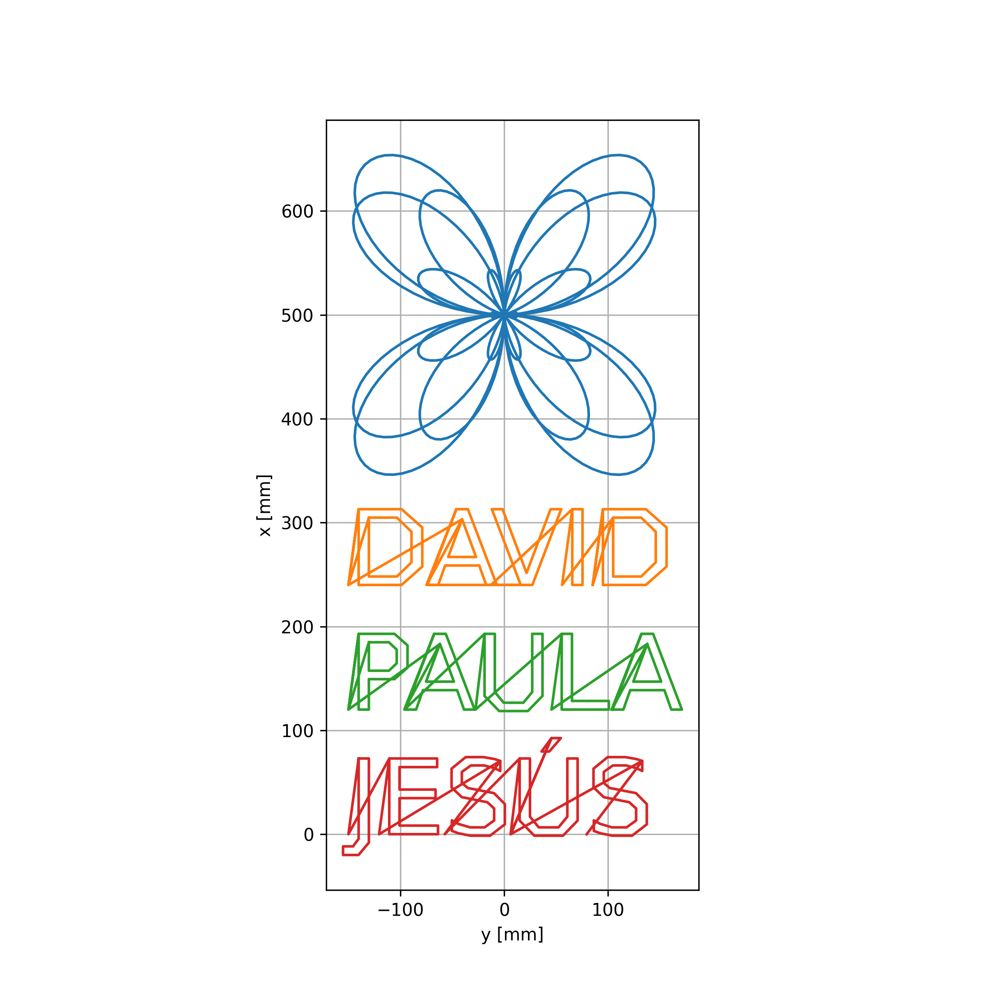<br>
<b>Figura 9. Diseño trayectoria </b>
</div>

Compuesta por los nombres de los integrantes del equipo generados mediante la librería `matplotlib.textpath.TextPath`, la cual permite convertir texto en trayectorias, y una figura en coordenadas polares definida por la función:

$$
r(\theta) = 200 \cos\left(\frac{5}{4}\theta\right)\sin(2\theta)
$$

La trayectoria se transforma a coordenadas cartesianas mediante:

$$
x = r \cos(\theta)
$$

$$
y = r \sin(\theta)
$$

Con esta trayectoria, la rutina del robot parte desde la posición *home*, ejecuta el recorrido definido y finalmente regresa a la misma posición inicial.

---

## Diagrama de flujo de acciones del robot

A continuación se muestra el diagrama de flujo correspondiente a la rutina de escritura de la rosa y los nombres, realizada por el robot.

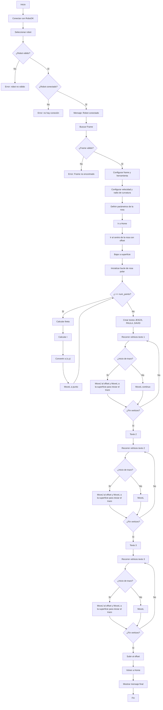

---

## Plano de planta de la ubicación de cada uno de los elementos 

En el caso del manipulador Motoman MH6, no se identificaron obstáculos que pudieran interferir con la trayectoria establecida para el presente laboratorio. Por esta razón, a continuación se presentan únicamente las dimensiones generales de su disposición, así como las de dos elementos adicionales que incrementan los grados de libertad del sistema.

[Plano de planta de los elementos del robot](Anexos/Pl_planta_lab2.pdf)


---
## Código en RoboDK

Se partió del código suministrado por el docente en cuanto a estructura. Se agregó de la librería Matplotlib la función TextPath, para poder facilitar el proceso de hacer la trayectoria de las letras. Se implementó la trayectoria planteada, solamente cambiando la función que la describe y añadiéndole un offset para ubicarla adecuadamente en el espacio.

Para poder hacer la trayectoria de los nombres, se comenzó utilizando la función antes mencionada para sacar una lista de puntos asociados a los vértices de las letras. La función como tal devuelve un objeto del cual se pueden sacar los puntos como tal, además de información del tipo de punto, por ejemplo, si es uno intermedio entre las letras o si es el último de cada letra.

```python
...
verts = tp.vertices
codes = tp.codes
verts1 = tp1.vertices
codes1 = tp1.codes
verts2 = tp2.vertices
codes2 = tp2.codes
...
```
Con esta información se utilizaron tres bucles for, uno para cada nombre, con el que se itero entre cada par de puntos para mover al robot a la posicion adecuada. En caso de que el punto no perteneciera a la trayectoria, o fuese el primer punto de la letra, entonces se ejecuta un movimiento de aproximación a un punto de seguridad.

Para más información, consulte el programa adjunto.

[Programa en RoboDK](Anexos/Programa_RDK.py)

---

## Resultados

Se verificó la correcta simulación de la rutina en RoboDK y para la implementación física, se estableció la conexión entre RoboDK y el manipulador y se ejecutó la rutina, la cual se realizó casi por completo a excepción del último nombre, debido a limitaciones relacionadas con la licencia del software. Lo anterior se recopiló en un video.

<div align="center">
  <a href="https://youtu.be/d39ROg9m2_Q">
    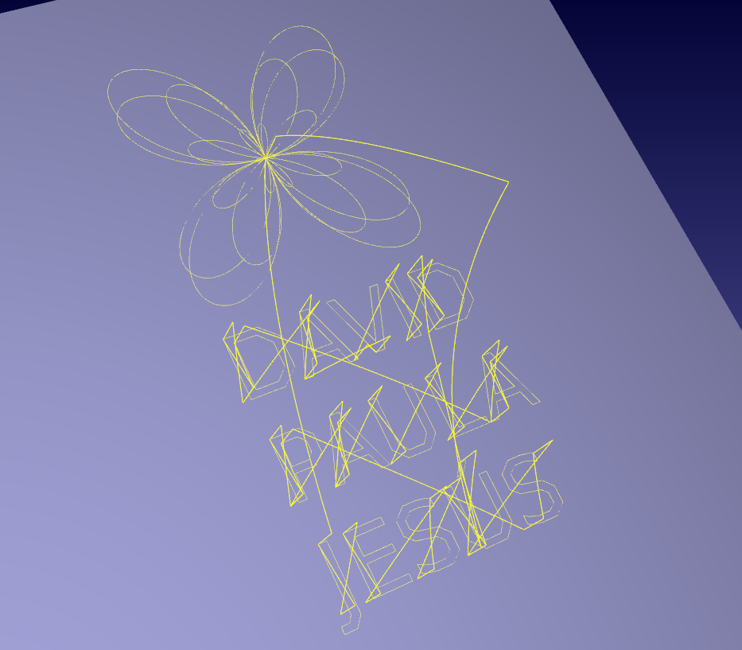<br>
 </a>
    <b>Figura 10. Resultado simulación. Haz clic en la imagen para ver el video</b>
</div>

---

## Referencias

1. RoboDK. *Yaskawa Motoman MH6S Robot*. Disponible en:  
   https://robodk.com/robot/es/Yaskawa-Motoman/MH6S#View3D  
   Consultado el 30 de abril de 2026. 

2. RoboDK. *ABB IRB 140-6/0.8 Robot*. Disponible en:  
   https://robodk.com/robot/es/ABB/IRB-140-6-0-8  
   Consultado el 30 de abril de 2026. 

3. ABB Robotics. *Product Manual ABB IRB 140*. Disponible en:  
   https://micampus.unal.edu.co/pluginfile.php/3481932/mod_resource/content/6/Product%20Manual%20ABB%20IRB%20140.pdf  
   Consultado el 30 de abril de 2026.

4. Yaskawa Motoman. *YASKAWA MH6 Instructions Manual*. Disponible en:  
   http://www.wtech.com.tw/public/download/manual/yaskawa/YASKAWA%20MH6%20Instructions.pdf  
   Consultado el 30 de abril de 2026.

5. Yaskawa Motoman. *Motoman MH6 Datasheet*.


