<div align="center">

<h3>Laboratorio No. 03</h3>

<h1>Robótica Industrial - Análisis y Operación del Manipulador EPSON T3-401S.</h1>

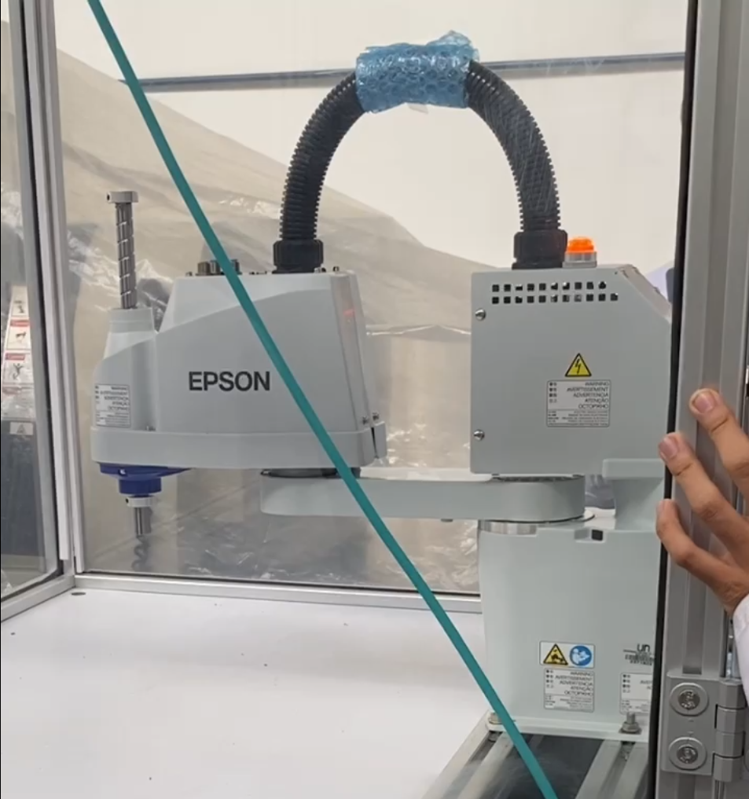<br>

<b>Figura 1. EPSON T3-401S</b>

</div>

---

## Introducción

Los manipuladores industriales son una parte importante en los procesos de automatización; cada modelo tiene características y configuraciones que lo hacen más adecuado para ciertas tareas. En este laboratorio se trabajó con el EPSON T3-401S y EPSON RC+ 7.0 como herramienta de simulación y programación, con el objetivo de realizar una comparación técnica con el ABB IRB 140 utilizado en el [Laboratorio 01](../Laboratorio%20No.%2001%20-%20Rob%C3%B3tica%20Industrial%20ABB%20IRB140%20y%20RobotStudio/README.MD) y el Motoman MH6 del [Laboratorio 02](../Laboratorio%20No.%2002%20-%20Rob%C3%B3tica%20Industrial%20Motoman%20MH6%20y%20RoboDK/README.MD). Además, se buscó comprender sus configuraciones iniciales, modos de operación y realizar simulaciones y ejecuciones de trayectorias reales.

Para este último objetivo, se diseñó y programó una trayectoria en EPSON RC+ 7.0 que permitiera manipular dos huevos ubicados inicialmente en los extremos de la diagonal de una cubeta de 30 huevos (6×5), con los siguientes requerimientos:
- La rutina debe posicionar los huevos en todas las posiciones de la cubeta.
- Mover un huevo y luego el otro de manera alternada.
- Los huevos solo pueden moverse siguiendo el patrón de movimiento del caballo en el ajedrez.

La manipulación de los huevos se realizó por medio de un gripper neumático por vacío.


---

## Comparativa de las especificaciones técnicas del Motoman MH6, el ABB IRB140 y el EPSON T3-401S.

| Característica | Motoman MH6 | ABB IRB140 | EPSON T3-401S |
| --- | --- | --- | --- |
| Carga Máxima [kg] | 6 | 5 | 3 |
| Alcance Horizontal [m] | 1.422 | 0.81 | 0.4 |
| Número de grados de libertad | 8 | 6 | 4 |
| Velocidad Angular máxima [°/s] | 610 * | 450 ** | 2600 *** |
| Temperatura de operación [°C] | 0 - 45 | 5 - 45 | 5 - 40 |
| Peso [kg] | 130 | 98 | 16 |
| Aplicaciones típicas |Ensamblaje, Dispensado, Manipulación de materiales, TCP remoto.|Ensamblaje, Dispensado, Manipulación de materiales, TCP remoto.|  Ensamblaje, Manipulación de materiales, pick and place, paletizado y despaletizado. |

*Esta es la velocidad del 6.º eje. Los otros ejes tienen menor velocidad.

**Esta es la velocidad del eje T. Los otros ejes tienen menor velocidad.

***Esta es la velocidad del eje de rotación J4 del robot. Sin embargo, la máxima velocidad que se alcanza con J1 y J2 es de 3700 mm/s.

---

## Configuraciones iniciales del EPSON T3-401S

La posición **home** del robot EPSON T3-401S corresponde a la postura de referencia inicial desde la cual se toman como base las coordenadas de trabajo y los movimientos del manipulador, esta configuración puede ser visualizada físicamente en la figura 1. En el software EPSON RC+ 7.0 esta misma posición puede visualizarse en diferentes sistemas de referencia: **cartesiano**, **articular** y **por pulsos**; mostrados a continuación.

# Configuración Home en Coordenadas Cartesianas

En la vista cartesiana, la posición home mostrada corresponde a:

* **X = 0 mm**
* **Y = 400 mm**
* **Z = 0 mm**
* **U = 90°**

<div align="center">

<br>

<b>Figura 2. Configuración Home del EPSON T3-401S en coordenadas cartesianas.</b>

</div>

En esta representación, el robot se encuentra ubicado a 400 mm sobre el eje Y, sin desplazamiento en X ni en Z, y con una orientación angular de 90 grados.

# Configuración Home en Coordenadas Articulares

La misma posición home puede expresarse directamente mediante los valores de las articulaciones del robot:

* **J1 = 90°**
* **J2 = 0°**
* **J3 = 0 mm**
* **J4 = 0°**

<div align="center">

<br>

<b>Figura 3. Configuración Home del EPSON T3-401S en coordenadas articulares.</b>

</div>

Esta representación indica que la primera articulación se encuentra girada 90 grados con respecto a la referencia del robot, mientras que las articulaciones J2, J3 y J4 permanecen en sus posiciones de origen. Adicionalmente, el software muestra la orientación del brazo como **Righty**, indicando una configuración de mano derecha.

# Configuración Home en Pulsos

Finalmente, la posición home también puede visualizarse mediante el conteo de pulsos de los encoders asociados a cada eje:

* **J1 = 204800 pulsos**
* **J2 = 0 pulsos**
* **J3 = 0 pulsos**
* **J4 = 0 pulsos**

<div align="center">

<br>

<b>Figura 4. Configuración Home del EPSON T3-401S en pulsos de encoder.</b>

</div>

Esta forma de representación es utilizada internamente por el controlador del robot para determinar la posición real de cada eje. Los valores mostrados corresponden al número de pulsos registrados por los encoders y dependen de la resolución del sistema de medición y de la calibración realizada en el manipulador.

---

## Modos de operación manual

Aunque no se cuenta con el respectivo *Teach Pendant*, la operación manual se realizó de forma alámbrica con un computador por medio del software EPSON RC+ 7.0. Para esto, al tener el robot en el programa, en primer lugar, en **Administrador de robot > Panel de control**, se activan **MOTOR ON** y **POWER HIGH**, además de asegurarse de que las articulaciones estén libres. 

<div align="center">

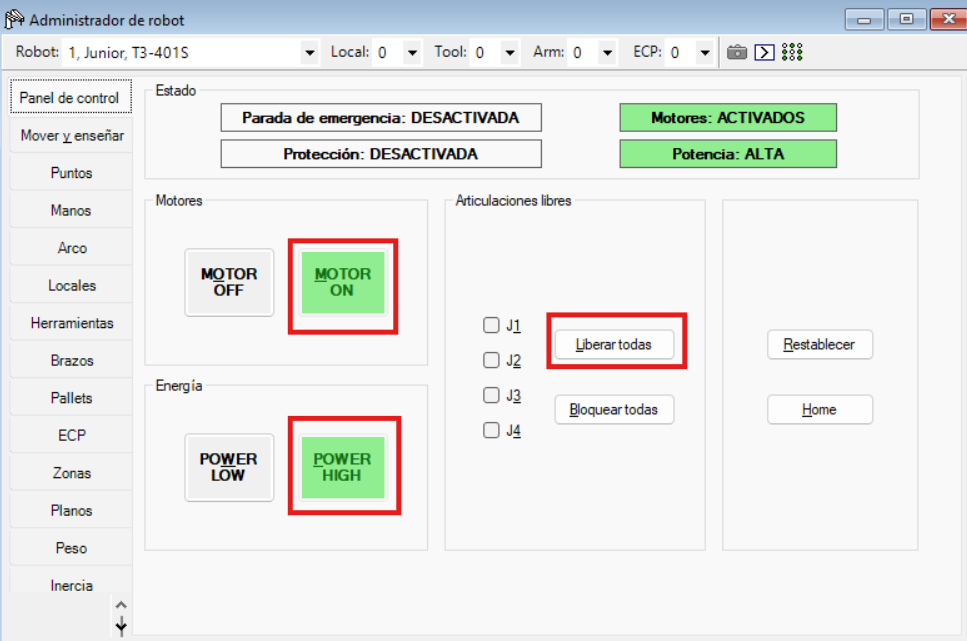<br>

<b>Figura 5. EPSON T3-401S</b>

</div>

Posteriormente, en **Mover y enseñar**, en **Modo**, se puede escoger entre cinco modos de operación:

- **(Mundo)** Linear/Angular o en el espacio de la tarea, respecto a la base del manipulador.
- **(Herramienta)** Linear/Angular o en el espacio de la tarea, respecto a la herramienta.
- **(Local)** Linear/Angular o en el espacio de la tarea, respecto al sistema de coordenadas local del punto actual.
- **(Articulaciones)** Articular o en el espacio de las configuraciones.
- **(ECP)** Desplaza el robot a lo largo de los ejes del sistema de coordenadas definido por el punto de control externo actual. Las coordenadas son coordenadas de mundo.

<table align="center">
  <tr>
    <td align="center">
      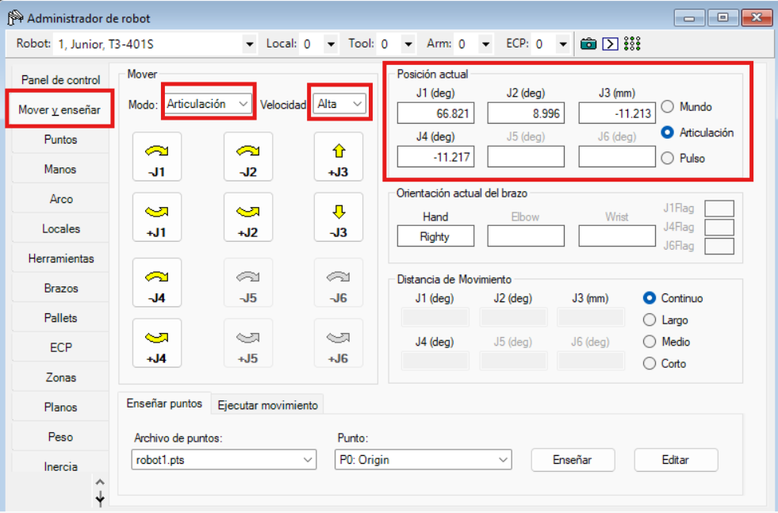<br>
      <b>Figura 6.1: Modo de operación articular</b>
    </td>
    <td align="center">
      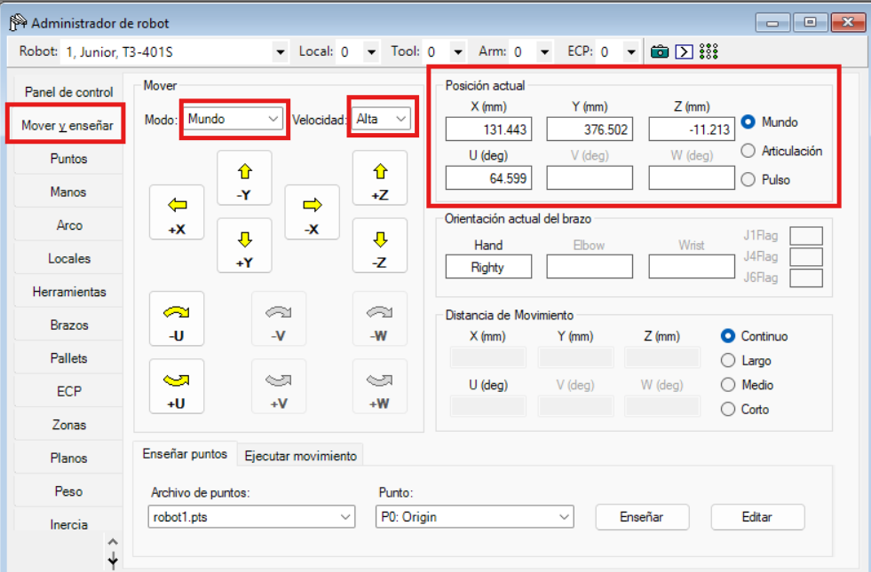<br>
      <b>Figura 6.2: Modo de operación linear/angular respecto al mundo</b>
    </td>
  </tr>
</table>

Finalmente, se selecciona la velocidad baja o alta y, con los botones de la interfaz, se mueven las articulaciones o las coordenadas y ángulos XYZ en cartesiano. Con esto, tanto en la simulación como en el robot físico se observarán los movimientos que se van realizando, respectivamente.

Adicionalmente, en esta misma interfaz es posible visualizar la posición actual del TCP en coordenadas cartesianas respecto al mundo, así como los valores de las articulaciones en grados y pulsos.

---

## Niveles de velocidad

Para este robot, los niveles de velocidad se manejan de dos maneras: la primera es por movimiento de PTP (control punto a punto), en donde la velocidad se programa como un porcentaje de 1 a 100%. La segunda manera es por movimiento de CP (control de ruta continua), en donde es programable el valor real de la velocidad, y se define manualmente. En caso de un comando punto a punto, la velocidad máxima que se alcanza es de 3700 mm/s en el plano horizontal, mientras que si se emplea un comando de ruta continua, la velocidad máxima en el plano horizontal es de 2000 mm/s.

Aunque lo anterior se emplea directamente en la programación, EPSON RC+ 7.0 también permite realizar una modificación de la velocidad. Esta modificación se puede realizar en dos partes: por un lado, seleccionando la casilla Baja potencia, y por otro lado, modificando el factor de velocidad, el cual también es porcentual.

<div align="center">

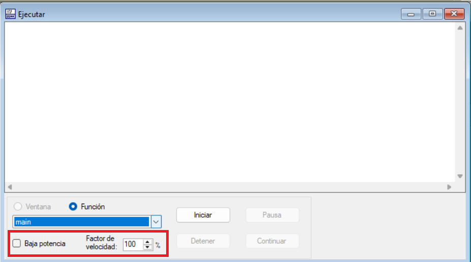<br>

<b>Figura 7. Sección de la interfaz para selección de velocidad.</b>

</div>

---

## Principales funcionalidades de EPSON RC+ 7.0

EPSON RC+ 7.0 es un entorno de desarrollo orientado a la programación, simulación, depuración y monitoreo de aplicaciones robóticas Epson. El software integra las herramientas necesarias para configurar, programar y supervisar robots industriales Epson, lo que permite desarrollar aplicaciones en entornos virtuales y en sistemas reales.

Entre las principales funcionalidades de EPSON RC+ 7.0 se encuentran:

* Programación de aplicaciones mediante el lenguaje SPEL+.
* Edición de código con resaltado de sintaxis y detección de errores.
* Depuración mediante puntos de interrupción y ejecución paso a paso.
* Monitoreo de variables y recursos del sistema en tiempo real.
* Configuración de robots, herramientas y sistemas de referencia.
* Supervisión y control de entradas y salidas digitales.
* Simulación y validación de movimientos antes de su ejecución física.
* Desarrollo offline y posterior transferencia al controlador.
* Integración con sistemas de visión artificial y control de potencia.

## Comunicación entre EPSON RC+ 7.0 y el controlador

La comunicación entre EPSON RC+ 7.0 y el controlador del robot se realiza mediante conexión USB o Ethernet. Para ello, el software incorpora la herramienta **PC to Controller Communications**, la cual permite establecer el enlace entre el computador y el controlador del robot.

Una vez establecida la conexión, el usuario puede transferir programas, monitorear el estado del sistema y ejecutar tareas directamente sobre el robot. En el caso de una conexión Ethernet, es necesario que tanto el controlador como el computador se encuentren configurados dentro de la misma red y dispongan de direcciones IP compatibles.

## Proceso de ejecución de movimientos

Para ejecutar un movimiento, se deben definir previamente los puntos, trayectorias y rutinas dentro del entorno de programación. El software procesa esta información y genera las instrucciones necesarias para el controlador del robot.

Durante este proceso, EPSON RC+ 7.0 permite verificar la lógica del programa mediante herramientas de depuración y monitoreo. Posteriormente, el controlador interpreta las instrucciones recibidas y las convierte en señales para los servomotores de cada articulación. La información proveniente de los encoders permite retroalimentar continuamente la posición real del robot, garantizando que los movimientos ejecutados coincidan con la trayectoria programada.

---

## Comparativa entre RoboDK, RobotStudio y EPSON RC+ 7.0

| Aspecto | RoboDK | RobotStudio | EPSON RC+ 7.0 |
|----------|----------|----------|----------|
| **Ventajas** | Soporta más de 900 robots de más de 70 fabricantes (KUKA, Fanuc, UR, Yaskawa, ABB, etc.).<br>Se integra con Python, C++, C# y MATLAB para automatizar tareas.<br>Cuenta con plugins nativos para SolidWorks, Fusion 360, Mastercam, etc.<br>Permite ver en tiempo real en el programa las operaciones del manipulador.<br>Interfaz más intuitiva y fácil de usar. | Gran precisión, utiliza la tecnología VirtualRobot, lo que le permite al simulador ejecutar exactamente el mismo software que el controlador real de ABB.<br>Cuenta con Add-ons especializados para soldadura (ArcWelding), pintura, paletizado, etc.<br>Configuración avanzada del sistema. | Integración directa con robots Epson y sus controladores.<br>Simulación y programación en un mismo entorno de desarrollo.<br>Utiliza el lenguaje SPEL+, orientado a aplicaciones industriales y de automatización.<br>Permite implementar funciones avanzadas como Vision Guidance, Conveyor Tracking y Force Guidance.<br>Interfaz intuitiva. |
| **Limitaciones** | Puede presentar menor precisión al no estar vinculado a un controlador específico.<br>Requiere una conexión activa con el manipulador para ejecutar la rutina; si hay fallas de conexión, la ejecución puede verse afectada. | Utiliza únicamente como lenguaje de programación RAPID.<br>Diseñado específicamente para trabajar con robots ABB.<br>Curva de aprendizaje más alta. | Compatible únicamente con robots Epson y sus controladores.<br>Menor cantidad de herramientas de simulación avanzada y gemelo digital en comparación con RobotStudio.<br>Menor disponibilidad de recursos y comunidad de usuarios respecto a plataformas más difundidas. |
| **Aplicaciones** | Impresión 3D con robots.<br>Mecanizado robótico.<br>Entornos de investigación y universidades.<br>Integradores de sistemas que trabajan con múltiples marcas de robots.<br>Tareas de Pick & Place, pintura y soldadura general. | Diseño y optimización de líneas de producción complejas exclusivas con robots ABB.<br>Programación offline de alta precisión para la industria automotriz y manufacturera pesada.<br>Simulación con alta fidelidad (gemelo digital).<br>Optimización de trayectorias. | Programación y simulación de robots SCARA y de seis grados de libertad Epson.<br>Aplicaciones de Pick & Place y manipulación de piezas.<br>Automatización de procesos industriales de ensamblaje e inspección.<br>Implementación de sistemas guiados por visión artificial y seguimiento de transportadores.<br>Validación de trayectorias antes de la ejecución física del sistema robótico. |

---

## Diseño del gripper

Los diseños que se mostrarán a continuación se basan en los elementos facilitados por el laboratorio para realizar la práctica. Para este gripper se tuvo en cuenta que se va a usar un sistema neumático, por lo que se emplea un gripper de vacío. Para instalar este elemento se desarrollaron dos piezas, la primera en TPU, la cual va instalada en el mango del robot mediante tornillos; esta pieza fue denominada como "AcopleTC". A esta pieza se acopla una segunda pieza, hecha de aluminio, que va también atornillada a la primera pieza; al otro extremo es donde se acopla la ventosa de vacío, gracias a un orificio. Esta pieza fue denominada como "SoporteVent".


<div align="center">

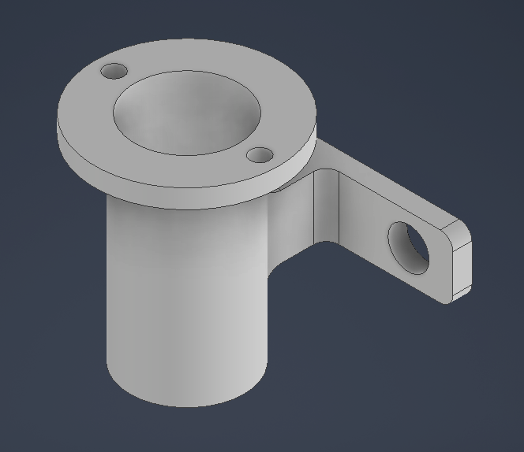<br>

<b>Figura 8. Vista isométrica de AcopleTC.</b>

</div>

<div align="center">

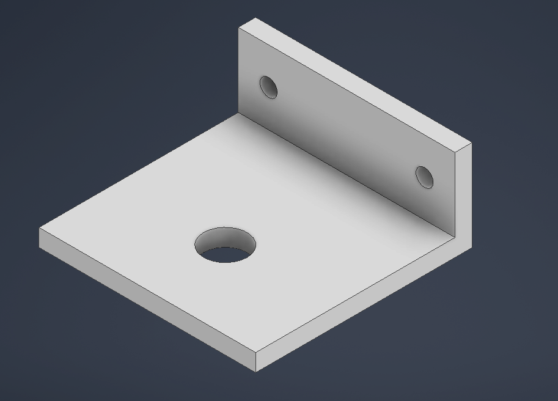<br>

<b>Figura 9. Vista isométrica de SoporteVent.</b>

</div>

En la imagen se observa la instalación fisica completa. 

<div align="center">

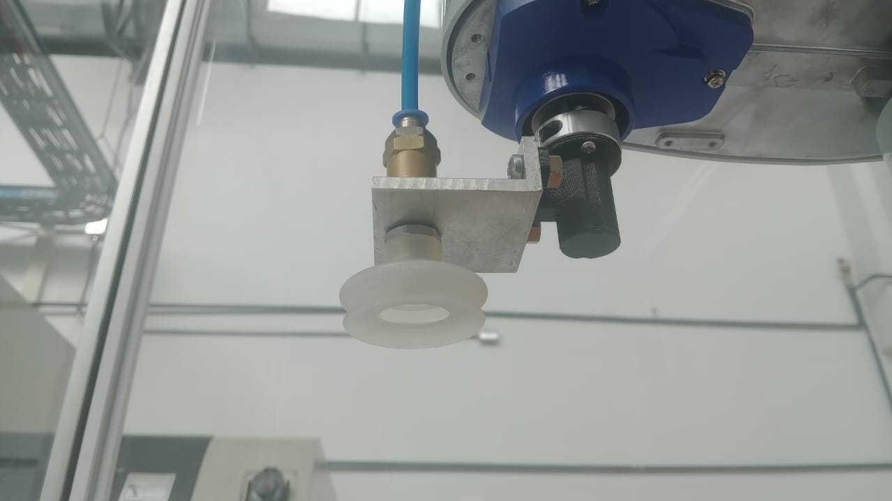<br>

<b>Figura 10. EPSON T3-401S</b>

</div>

Para consultar los planos de ambas piezas, puede acceder a los siguientes documentos.

[PLano de AcopleTC](Anexos/AcopleTC.pdf)

[Plano de SoporteVent](Anexos/SoporteVent.pdf)

---

## Diagrama de flujo

A continuación se muestra el diagrama de flujo correspondiente a la rutina de movimiento de huevos con patrón de caballo de ajedrez, realizada por el robot.

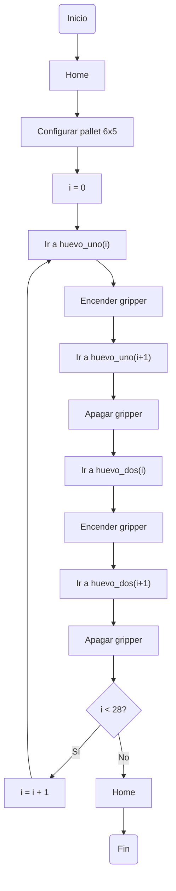

---

## Plano de planta

---

## Código en EPSON RC+ 7.0

El código consta de tres partes principales; la primera es la definición de los puntos que se van a emplear. Los puntos se guardan en una matriz dos por veintinueve, para cada huevo. La segunda parte consta del código principal donde se llama a la función que ejecuta el paletizado.

En la función Pallet se itera usando i durante veintinueve ocasiones En cada iteración, el programa toma primero los valores de la posición de uno de los huevos y se posiciona usando la función Jump; cuando ya está en posición, se enciende la salida digital del gripper para tomar el huevo, luego toma los valores de la siguiente posición para luego ubicarse y desactivar el gripper. Tras esto, se ubica en la posición del segundo huevo y se repite el mismo proceso. Para ambos procesos se toma i como indicador para identificar qué fila de las matrices de posición se va a tomar.  

```python
Pallet 1, Origin, Puntox, Puntoy, 6, 5
    For i = 0 To 28
        Print "Ciclo número:", i
        Jump Pallet(1, huevo_uno(i, 0), huevo_uno(i, 1))
        Off DO_09
        Wait 0.5
        Jump Pallet(1, huevo_uno(i + 1, 0), huevo_uno(i + 1, 1))
        On DO_09
        Wait 0.5
        Jump Pallet(1, huevo_dos(i, 0), huevo_dos(i, 1))
        Off DO_09
        Wait 0.5
        Jump Pallet(1, huevo_dos(i + 1, 0), huevo_dos(i + 1, 1))
        On DO_09
        Wait 0.5
    Next
```

Para más información, consulte el programa adjunto.

[Programa para EPSON RC+ 7.0](Anexos/Codigo.prg)

---

## Resultados

Se verificó la correcta simulación de la rutina en **EPSON RC+** y en el laboratorio se realizó la implementación física, en la que fue necesario ajustar distancias en Z para que la herramienta pudiera mover correctamente los huevos. Lo anterior se recopiló en un video: https://www.youtube.com/watch?v=6wCGEdeLWnc

<table align="center">
  <tr>
    <td align="center">
      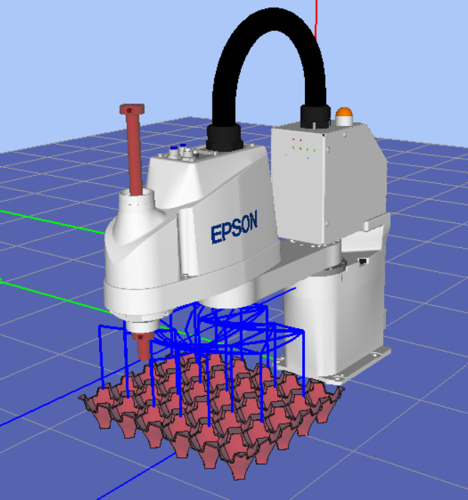<br>
      <b>Figura 11.1: Simulación de la rutina</b>
    </td>
    <td align="center">
      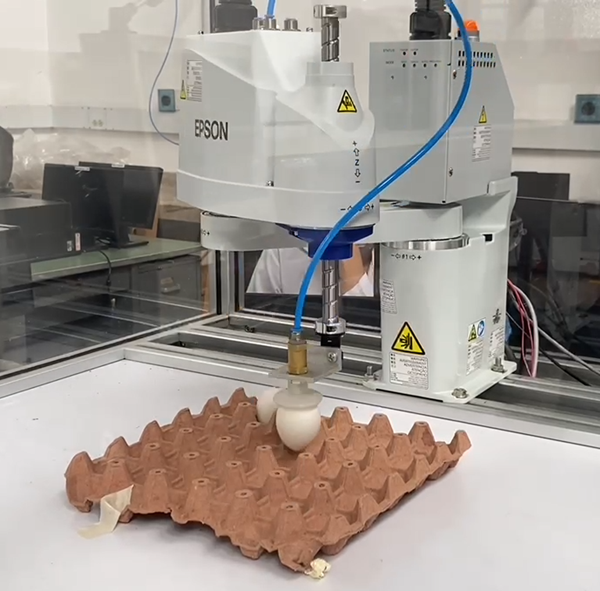<br>
      <b>Figura 11.2: Ejecución de la rutina en el laboratorio</b>
    </td>
  </tr>
</table>

---

## Referencias

[1] RoboDK, “Epson T3-401S Robot,” RoboDK Robot Library. [En línea]. Disponible en: https://robodk.com/robot/es/Epson/T3-401S. [Accedido: 6-jun-2026].

[2] Seiko Epson Corporation, Manual del Robot Epson T3, Rev. 2. Nagano, Japón: Seiko Epson Corporation, 2017. [En línea]. Disponible en: https://files.support.epson.com/far/docs/epson_t3_robot_manual_spanish_(r2).pdf. [Accedido: 6-jun-2026].

[3] Epson Robots, "EPSON RC+ 7.0 Development Software", Epson America Inc. [En línea]. Disponible en: https://epson.com/robots-industrial-automation-development-software. [Accedido: 12-Jun-2026].

[4] Epson Robots, "EPSON RC+ 7.0 User's Guide (RC700A/RC90 Controller)", Epson America Inc. [En línea]. Disponible en: https://files.support.epson.com/far/docs/epson_rc_pl_70_users_guide-rc700a_rc90_t(v73r4).pdf. [Accedido: 12-Jun-2026].
