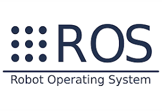
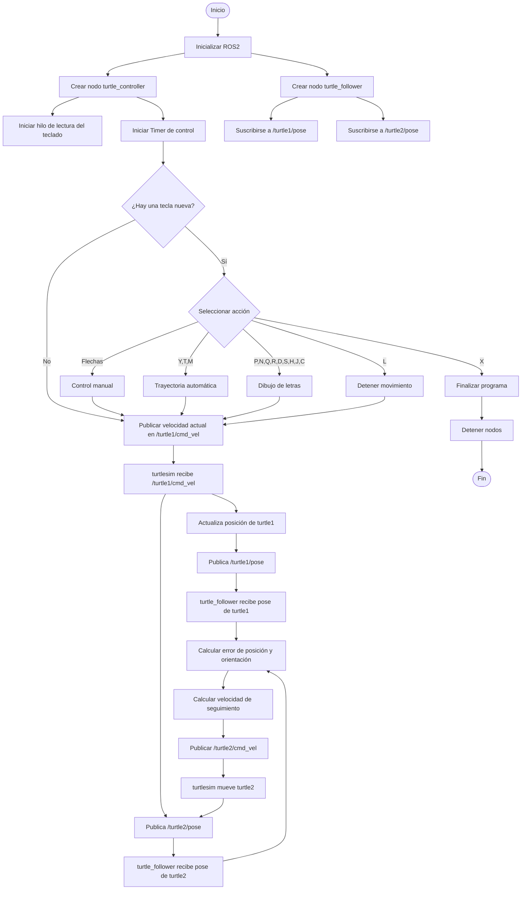
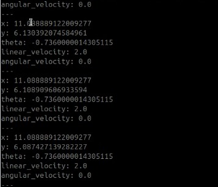
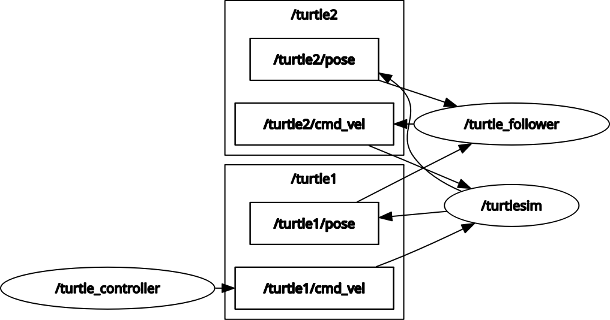
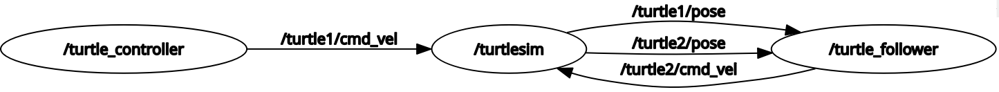
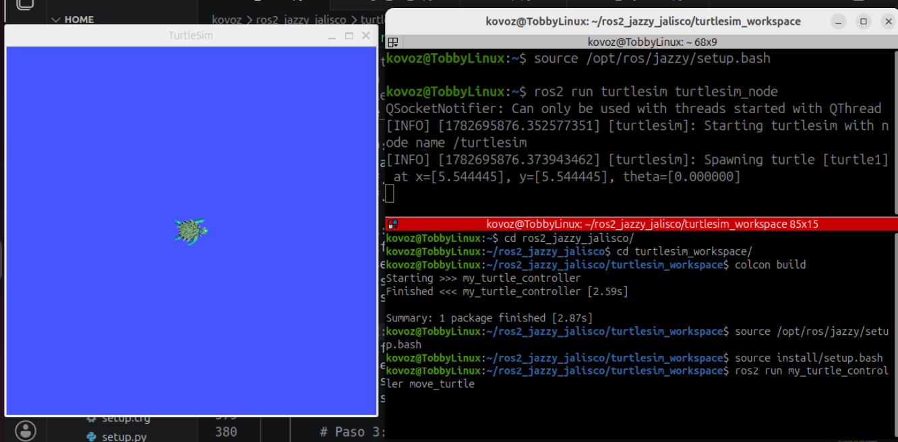
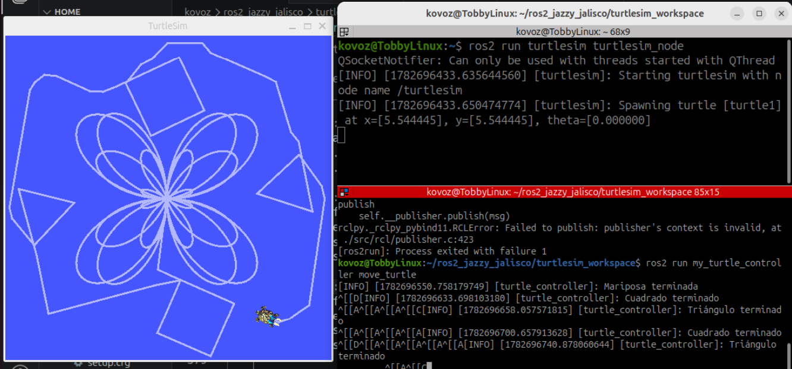
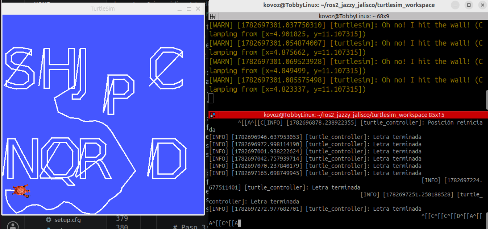
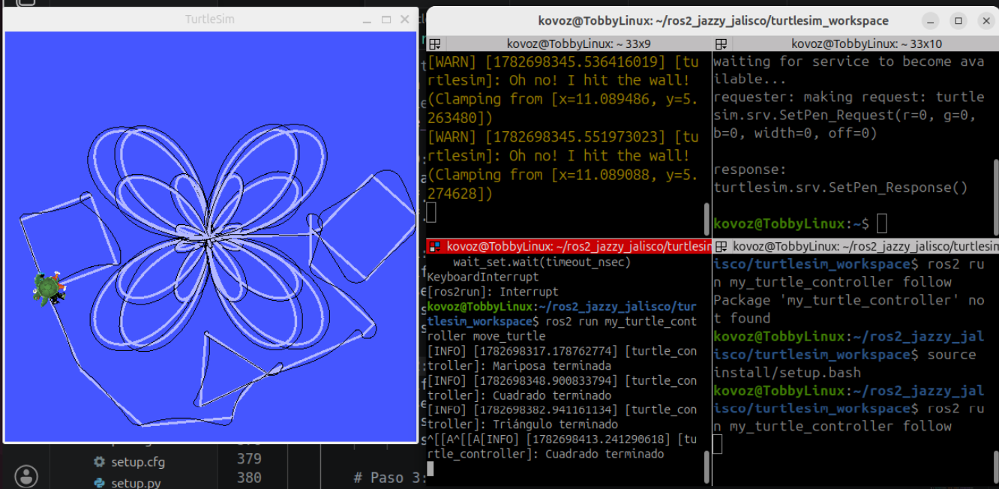
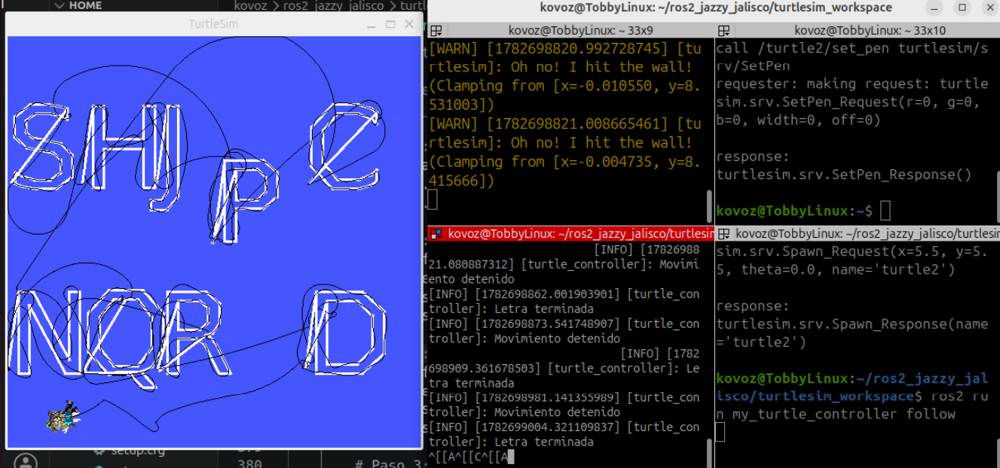

<div align="center">

<h3>Laboratorio No. 04</h3>

<h1>Robótica de Desarrollo, Intro a ROS 2 Jazzy Jalisco - Turtlesim</h1>

<br>

<b>Figura 1. ROS - Robot Operating System. </b>

<p>
  
  
  
  
</p>

</div>

---

## Introducción

ROS (Robot Operating System) es una infraestructura de software de código abierto para el desarrollo de aplicaciones robóticas. Proporciona un conjunto de herramientas, bibliotecas y funcionalidades desarrolladas de forma modular que facilitan la comunicación entre procesos, el control de dispositivos y la implementación de algoritmos para sistemas robóticos. Es caracterizado principalmente por su modelo de comunicación basado en nodos, tópicos, servicios y otros mecanismos que facilitan la interacción entre los distintos componentes de una aplicación.

---


## Descripción general

En el presente laboratorio se implementó un sistema de control para el simulador Turtlesim utilizando ROS2 y el lenguaje de programación Python. El sistema desarrollado permite controlar manualmente una tortuga mediante el teclado, ejecutar trayectorias automáticas, dibujar figuras y caracteres utilizando servicios de teletransporte y control del lápiz, así como implementar un algoritmo de seguimiento en el que una segunda tortuga persigue continuamente a la primera a partir de la información de sus posiciones.

Para lograr este comportamiento se diseñaron dos nodos principales: un nodo controlador encargado de gestionar las entradas del usuario, las trayectorias automáticas y la interacción con los servicios de Turtlesim, y un nodo seguidor responsable de calcular y publicar las velocidades necesarias para que la segunda tortuga siga a la primera. La comunicación entre estos nodos y el simulador se realizó mediante el intercambio de mensajes a través de tópicos y el uso de servicios ofrecidos por ROS2, evidenciando el funcionamiento de una arquitectura distribuida típica de aplicaciones robóticas.

El desarrollo de este laboratorio permitió comprender el funcionamiento de los principales mecanismos de comunicación de ROS2 y su aplicación en la implementación de sistemas de control reactivos y modulares, integrando tanto el control manual como el automático dentro de un mismo entorno de simulación.

---

## Diagrama de flujo del programa



---

## Organización de los archivos del programa

Con el fin de cumplir los objetivos del laboratorio de manera ordenada, se siguió la estructura planteada por el repositorio "03_Rob_2026_I_ROS2_Jazzy_Turtlesim", perteneciente a labSir, el cual está basado a su vez en la organización que ofrece colcon build. A partir de esta se plantea el siguiente árbol de archivos:

## Estructura del proyecto

```text
turtlesim_workspace
├── buld
├── install
├── log
└── scr
    └── my_turtle_controller
        ├── my_turtle_controller
        │   ├── __init__.py
        │   ├── move_turtle.py
        │   └── segui_tur_2.py
        ├── resource
        │   └── my_turtle_controller
        ├── test
        │   ├── test_copyright.py
        │   ├── test_flake8.py
        │   └── test_pep257.py
        ├── package.xml
        ├── setup.cfg
        └── setup.py
```

Aunque la mayoría de archivos se comparten con el ejemplo proporcionado en el laboratorio labsir y además son efecto de realizar colcon build, siendo así archivos que no se modifican, existen tres excepciones. La primera es el archivo move_turtle.py, la segunda es el archivo segui_tur_2.py y, por último, setup.py. En las secciones Explicación del control manual, Explicación de funciones automáticas y Explicación del dibujo de las letras personalizadas, se ahondará en el código del archivo move_turtle.py.py. El programa segui_tur_2.py se explica con más detalle en la sección explicación del líder seguidor, así como los cambios realizados en setup.py.

---

## Planteamiento de la solución

El objetivo del laboratorio consistió en controlar el movimiento de la tortuga del simulador **Turtlesim**, sin utilizar el nodo `turtle_teleop_key` proporcionado por ROS 2, mediante el archivo `move_turtle.py`. El sistema debía integrar tanto el control manual como la ejecución de trayectorias automáticas, sin bloquear la ejecución del nodo.

Como requisitos funcionales, el nodo debía permitir el desplazamiento manual de la tortuga mediante las flechas del teclado:

* `↑`: Avanzar.
* `↓`: Retroceder.
* `←`: Girar hacia la izquierda.
* `→`: Girar hacia la derecha.

Adicionalmente, se solicitó incorporar acciones especiales activadas desde el teclado para ejecutar funciones automáticas y servicios del simulador.

<div align="center">

| Tecla | Función                                                                          |
| :---: | -------------------------------------------------------------------------------- |
|  `S`  | Dibujar un cuadrado.                                                             |
|  `T`  | Dibujar un triángulo equilátero.                                                 |
|  `R`  | Reiniciar la posición de la tortuga.                                             |
|  `P`  | Activar o desactivar el lápiz de dibujo.                                         |
|  `A`  | Ejecutar una trayectoria automática evitando salir de los límites de la ventana. |
|  `Q`  | Detener completamente el movimiento de la tortuga.                               |

</div>

Otro requisito consistió en implementar el dibujo automático de las iniciales de los integrantes del grupo. Para ello, cada letra debía ejecutarse mediante una tecla específica.

Finalmente, el laboratorio solicitó implementar un sistema **líder-seguidor** utilizando dos tortugas dentro del simulador. En este esquema, la tortuga principal (`turtle1`) es controlada mediante el nodo desarrollado, mientras que una segunda tortuga (`turtle2`) sigue automáticamente su movimiento a partir de la lectura de las posiciones publicadas por ambas y el cálculo de la distancia y orientación relativas.

Con el fin de satisfacer todos estos requerimientos, se diseñó una arquitectura basada en un único ciclo de control periódico y una **Máquina de Estados Finitos (Finite State Machine, FSM)**, la cual coordina las acciones manuales y automáticas sin emplear ciclos que bloqueen la ejecución del nodo. En las siguientes secciones se describe en detalle el diseño de esta arquitectura y el funcionamiento de cada una de las acciones desarrolladas.

---

## Explicación control manual 

El control manual de la tortuga fue implementado mediante la lectura continua del teclado desde una hebra (thread) independiente. Esta decisión de diseño permite que el nodo ROS2 permanezca ejecutando normalmente su ciclo de control mientras lee el teclado, evitando bloquear el ejecutor (`executor`) de ROS2.

La función `get_key()` configura temporalmente la terminal en modo *raw*, permitiendo capturar las teclas presionadas sin necesidad de pulsar Enter. Posteriormente, la función `keyboard_loop()` almacena la última tecla detectada en una variable compartida (`self.key`).

El procesamiento de las teclas no se realiza dentro del hilo de lectura, sino dentro de la función `control_loop()`, la cual es ejecutada periódicamente mediante un temporizador de ROS2 cada 20 ms. Esta separación evita conflictos entre el manejo del teclado y el envío de comandos hacia la tortuga.

Cada tecla es asociada con una acción específica mediante una estructura `match-case`. Las flechas del teclado generan movimientos manuales, mientras que otras teclas permiten iniciar trayectorias automáticas, controlar el lápiz, reiniciar la posición de la tortuga o detener la ejecución del programa.

Cada flecha del teclado llama a la función `start_motion()`, la cual almacena la velocidad lineal, la velocidad angular y el instante en el que debe finalizar el movimiento. Durante cada iteración del ciclo de control, el nodo verifica si el tiempo programado aún no ha expirado; en caso afirmativo publica continuamente el mensaje `Twist`, y una vez transcurrido el tiempo detiene automáticamente la tortuga.

---

## Explicación de funciones automáticas

Las trayectorias automáticas fueron implementadas utilizando una máquina de estados finitos. En este enfoque cada figura se divide en una secuencia de pasos, donde cada paso representa una acción elemental, como avanzar una determinada distancia o realizar un giro.

El estado actual de la trayectoria se almacena en la variable `action_step`, mientras que la variable `action` identifica la figura que se encuentra en ejecución (cuadrado, triángulo, mariposa o letras).

Durante cada iteración del ciclo de control (`control_loop()`), el programa verifica si existe alguna acción automática activa. Dependiendo del valor de `action`, se ejecuta la función correspondiente (`square_step()`, `triangle_step()`, `butterfly_step()` o `letter_step()`).

Cada una de estas funciones implementa la máquina de estados de la figura. Cuando un movimiento termina, el estado avanza al siguiente paso hasta completar toda la secuencia. Una vez finalizada la figura, la variable `action` vuelve a tomar el valor `None`, indicando que la tortuga ha regresado al estado de espera.


-  <b>  Dibujo del cuadrado  </b> 

El dibujo del cuadrado se implementó mediante una máquina de estados compuesta por ocho estados secuenciales. Cuatro de estos estados corresponden al desplazamiento lineal de la tortuga para recorrer cada lado de la figura, mientras que los cuatro estados restantes realizan los giros de 90° necesarios para orientar la tortuga hacia el siguiente lado.

Cada transición entre estados ocurre únicamente cuando finaliza el movimiento programado mediante la función `start_motion()`, la cual define la velocidad lineal, la velocidad angular y el tiempo de ejecución de cada movimiento. De esta manera, la figura se construye paso a paso sin utilizar ciclos bloqueantes, permitiendo que el sistema permanezca disponible para recibir nuevas órdenes del usuario.

-  <b>  Dibujo del triángulo equilátero  </b> 

El triángulo fue implementado utilizando la misma estrategia empleada para el cuadrado. En este caso, la máquina de estados está conformada por seis estados: tres correspondientes al avance sobre cada lado y tres destinados a realizar los giros de 120°, necesarios para completar un triángulo equilátero.

Al reutilizar la misma arquitectura de control, únicamente fue necesario modificar la cantidad de estados y los tiempos asociados a cada giro, manteniendo el mismo mecanismo de ejecución basado en temporización.

-  <b> Trayectoria automática (Mariposa)  </b> 

Para la trayectoria automática se seleccionó una curva paramétrica con forma de mariposa. A diferencia del cuadrado y el triángulo, esta trayectoria no se construye mediante segmentos rectos y giros, sino a partir de una gran cantidad de puntos calculados previamente.

Ecuación trayectoria polar:

$$
r(\theta) = 200 \cos\left(\frac{5}{4}\theta\right)\sin(2\theta)
$$

La trayectoria se transforma a coordenadas cartesianas mediante:

$$
x = r \cos(\theta)
$$

$$
y = r \sin(\theta)
$$

La función `prepare_butterfly()` evalúa la ecuación paramétrica de la curva y almacena los puntos. Posteriormente, la función `butterfly_step()` recorre secuencialmente la lista de puntos utilizando el servicio `TeleportAbsolute`, desplazando la tortuga hasta cada una de las coordenadas calculadas.

Con el propósito de mejorar la visualización del dibujo, se incorporó un contador (`butterfly_wait`) que introduce una pequeña espera entre cada desplazamiento. Esto permite reducir la velocidad aparente del trazado sin afectar el funcionamiento general del nodo.

---

## Explicación de funciones complementarias

Adicionalmente, se implementaron métodos para cumplir con otras funcionalidades del programa. La primera es el método que permite cerrar la consola definitivamente; este método se denominó `stop`. El método coloca todas las velocidades de la tortuga en cero. Además de esto, cuando se presionó la letra X y después de llamar al método stop, se colocó la línea rclpy.shutdown(), que finaliza correctamente la comunicación con ROS2.

Otro método que se implementó fue `reset`, el cual, como su nombre lo indica, mueve a la turtle1 a la posición inicial, con la orientación inicial, como se muestra a continuación Para hacer esto, el método hace una solicitud al servicio teleport_absolute, que "teletransporta" a la tortuga a la posición deseada. Luego de esto, imprime en consola un mensaje indicando que se reinició la posición.

```text
        request.x = 5.544445
        request.y = 5.544445
        request.theta = 0.0
        self.teleport_client.call_async(request)
```

El tercer método es `toggle_pen`, el cual únicamente invierte el estado en el que se encuentra el lápiz o línea de la tortuga, mostrando o borrando la línea para los siguientes movimientos de esta. Para ello se emplea self.pen(not self.pen_state), donde self.pen_state es el estado actual de esta línea. 

Finalmente, está el método `cancel_action`, con el que se detiene alguna acción que se esté llevando a cabo en el momento. Este método hace uso de las variables de estado que se están utilizando para ponerlas en cero o ponerlas nulas, según corresponde. Las variables que se ven afectadas son:

```text
        self.action = None
        self.action_step = 0
        self.motion_end_time = None
        self.stop()
```

---

## Explicación de funciones automáticas

Las trayectorias automáticas fueron implementadas utilizando una máquina de estados finitos. En este enfoque cada figura se divide en una secuencia de pasos, donde cada paso representa una acción elemental, como avanzar una determinada distancia o realizar un giro.

El estado actual de la trayectoria se almacena en la variable `action_step`, mientras que la variable `action` identifica la figura que se encuentra en ejecución (cuadrado, triángulo, mariposa o letras).

Durante cada iteración del ciclo de control (`control_loop()`), el programa verifica si existe alguna acción automática activa. Dependiendo del valor de `action`, se ejecuta la función correspondiente (`square_step()`, `triangle_step()`, `butterfly_step()` o `letter_step()`).

Cada una de estas funciones implementa la máquina de estados de la figura. Cuando un movimiento termina, el estado avanza al siguiente paso hasta completar toda la secuencia. Una vez finalizada la figura, la variable `action` vuelve a tomar el valor `None`, indicando que la tortuga ha regresado al estado de espera.

---

## Explicación del dibujo de letras personalizadas 

Otro requerimiento del proyecto es que la turtle1 escriba en pantalla las iniciales de los nombres de los integrantes. Para esta funcionalidad, se agregó al método control_loop los casos del teclado que coinciden con las letras de las iniciales; esto adicionalmente forzó a cambiar las letras R, S, P, A y Q, que originalmente eran para el control manual y automático de turtle1, ya que coincidían con las iniciales. Por lo tanto, las letras que se agregaron como iniciales son J, D, S y C por Jesús David Sánchez Cobos, las letras P, N, Q y R por Paula Nicole Quiroga Romero y, finalmente, las letras D, S, P y H por David Steven Pinzón Hernández. Como hay letras repetidas, quedaron las iniciales J, D, S, C, P, N, Q, R y H dentro del código.

Dentro de cada caso se realiza un llamado a un nuevo método llamado `prepare_letter`, al cual se le pasan como argumentos la letra que se desea dibujar, la posición x del inicio de la figura de la letra y la posición y de la figura de la letra, como se observa a continuación:

```text
                case 'S':
                    self.prepare_letter("S",0,7)
```
Este método se encarga de preparar los puntos para hacer la trayectoria de la letra indicada, haciendo uso de la librería matplotlib.textpath, particularmente de TextPath. Para esto partimos de llamar al método TextPath de la siguiente manera: 

```text
        tp = TextPath((0,0), letra, size=3).interpolated(15)
```

El objeto tp para contener, entre varias cosas, dos atributos importantes para nuestro método; el primero es vértices, el cual brinda una lista de puntos que corresponden a las posiciones xy de los vértices de la letra; además, como se utilizó .interpolated(15), va a contener también puntos intermedios. El segundo atributo importante es codes, el cual nos indica el tipo de trazo que se está realizando. Esto último se detallará más adelante cuando se esté explicando cómo se mueve la tortuga.

```text
        self.letter_vertices = tp.vertices.copy()
        self.letter_codes = tp.codes.copy()
```

Dado que por defecto va a tomar una posición (0,0) inicialmente y nosotros necesitamos que quede en un lugar del plano que evite superponer a otra letra, entonces utilizamos los valores xy que se ingresaron como argumentos de la siguiente forma:

```text
        self.letter_vertices[:,0] += x
        self.letter_vertices[:,1] += y
```

Finalmente, el método reinicia el índice que se empleará para tomar cada punto consecutivo dentro de la lista. También coloca el parámetro .action como letter con el fin de que el programa reconozca que es la acción que va a estar ejecutando.

```text
        self.letter_index = 0
        self.action = "letter"
```

Regresando al método principal, como ya se mencionó con anterioridad, se tiene una serie de condicionales que permiten mantener alguna de las acciones sin bloquear totalmente el programa y permitiendo parar una acción cuando ya se está realizando. Dentro de las opciones también se encuentra la que indica que se debe realizar una letra y usa "letter" para condicionar su ejecución. En caso de que .action sí se letter, entonces hace un llamado al método letter_step:

```text
        elif self.action == "letter":
            self.letter_step()
```

El método letter_step no tiene argumentos además de self, y parte de manera similar a butterfly_step, utilizando un contador para controlar la velocidad con que se realiza la trayectoria. Esta sección omite el código en caso de que el contador .letter_wait sea menor que dos, sumándole uno en cada iteración. Cuando supera a dos, permite la ejecución del código y reinicia el contador. 

```text
        if self.letter_wait < 2:
            self.letter_wait += 1
            return
        self.letter_wait = 0
```

Luego se agregó un condicional para cuando se termina de hacer toda la trayectoria. Esto sucede cuando el índice letter_index mencionado con anterioridad iguala al tamaño de la lista letter_vertices. En caso de que esto pase, coloca como vacía la acción a realizar, imprime en consola un mensaje de que se terminó de realizar la letra y retorna al método principal.

```text
        if self.letter_index >= len(self.letter_vertices):
            self.action = None
            self.get_logger().info("Letra terminada")
            return
```

En caso de que este condicional no se cumpla, entonces se procede con el código que mueve a la tortuga. Para esto, primero le asignamos a un parámetro el código correspondiente al punto al que se va a mover, clicando el índice letter_index. Adicionalmente, se colocan en dos atributos los valores de posición del mismo punto:

```text
        code = self.letter_codes[self.letter_index]
        x = self.letter_vertices[self.letter_index,0]
        y = self.letter_vertices[self.letter_index,1]
```

Luego, usando el parámetro `code`, definimos que la línea se debe mostrar o no, ya que este parámetro contiene un código que señala un tipo de línea en particular. En nuestro caso solo se utilizan cuatro tipos de líneas:

- code = 1 (MOVETO): Mueve la posición a un nuevo punto de inicio, por lo que este no se debe mostrar.
- code = 2 (LINETO): Mueve la posición en una línea recta entre la posición actual y un nuevo vértice.
- code = 3 (CURVE3): Dibuja una curva entre dos vértices; en nuestro caso se dibujará como una línea recta también.
- code = 79 (CLOSEPOLY): Cierra el bucle dibujando una línea recta que vuelva al inicio de la subruta actual; esta tampoco debe aparecer.

En este orden de ideas, se utiliza el siguiente código, en que se utiliza el método self.pen para permitir o no que aparezca la línea, y el método goto para mover la tortuga a la posición dada: 

```text
        if code == 1:
            self.pen(True)
            self.goto(x,y)
        elif code == 79:
            self.pen(True)
        else:
            self.pen(False)
            self.goto(x,y)
```

Finalmente, se le suma un uno al índice para que en la siguiente iteración se pase al siguiente punto.

```text
        self.letter_index += 1
```

Respecto al método pen, este emplea una solicitud al servicio call_async para poder mostrar o no la línea que dibuja turtle1. Previo a esto, se tiene un condicional para evitar repetir comandos en caso de que el estado de la línea ya esté en el que se introduce en el argumento del método.

```text
        if off == self.pen_state:
            return
```

Luego se crea un mensaje de tipo Request y se le colocan atributos de color, grosor y si se debe mostrar o no con el parámetro .off.

```text
        request = SetPen.Request()
        request.r = 255
        request.g = 255
        request.b = 255
        request.width = 3
        request.off = int(off)
```

Finalmente, se hace la solicitud y se cambia el estado de la línea dentro del programa.

```text
        self.pen_client.call_async(request)
        self.pen_state = off
```

Tras implementar el dibujo de letras personalizadas, la tabla de teclas sufrió cambios, quedando de la siguiente manera: 

<div align="center">

| Tecla | Función                                                                          |
| :---: | -------------------------------------------------------------------------------- |
|  `Y`  | Dibujar un cuadrado.                                                             |
|  `T`  | Dibujar un triángulo equilátero.                                                 |
|  `G`  | Reiniciar la posición de la tortuga.                                             |
|  `O`  | Activar o desactivar el lápiz de dibujo.                                         |
|  `M`  | Ejecutar una trayectoria automática evitando salir de los límites de la ventana. |
|  `L`  | Detener completamente el movimiento de la tortuga.                               |
|  `P`  | Dibujar la letra P.                                                              |
|  `N`  | Dibujar la letra N.                                                              |
|  `Q`  | Dibujar la letra Q.                                                              |
|  `R`  | Dibujar la letra R.                                                              |
|  `D`  | Dibujar la letra D.                                                              |
|  `S`  | Dibujar la letra S.                                                              |
|  `H`  | Dibujar la letra H.                                                              |
|  `J`  | Dibujar la letra J.                                                              |
|  `C`  | Dibujar la letra C.                                                              |
|  `X`  | Cerrar el programa.                                                              |

</div>

---

## Explicación del sistema líder-seguidor con dos tortugas

El sistema líder-seguidor se implementó como un nodo, que en esencia funciona como un control proporcional para la turtle2. En este sentido, se creó un programa de Python llamado segui_tur_2.py, en el que se establece una clase llamada Seguidor, la cual no tiene argumentos. Esta clase posee en total cuatro métodos. El primer método es el principal, en el cual se inicializan suscriptores a las poses de ambas tortugas para poder calcular el mensaje que se le va a enviar a la turtle2. Para enviar este mensaje, adicionalmente se inicializa un publicador que envía mensajes al tópico /turtle2/cmd_vel. 

Los dos métodos siguientes, pose1_callback y pose2_callback, son para poder recibir el mensaje que llega desde los suscriptores y asignarlo a una variable propia. Ambos métodos tienen los argumentos self y msg. El argumento msg es el que recibe en primer lugar el mensaje que le llega al suscriptor para luego asignárselo a las variables correspondientes. Finalmente, se desarrolló el método follow con el que se calcula la "acción de control" para la turtle2. Para cumplir con esta función, se parte de definir un mensaje de tipo Twist para poder guardar el mensaje que se va a enviar a turtle2. Luego se debe poner un condicional para evitar que se hagan operaciones con poses vacías, por lo que se utiliza el siguiente código:

```text
        if self.pose1 is None or self.pose2 is None: 
            return
```

Luego se deben extraer las componentes cartesianas del mensaje de las poses de cada turtle de la siguiente manera:

```text
        x1 = self.pose1.x
        y1 = self.pose1.y
        x2 = self.pose2.x
        y2 = self.pose2.y
```

Con estas poses se calcula la diferencia entre la posición x de turtle1 y turtle2, y la diferencia entre las componentes y. Con estas diferencias se calcula el ángulo que hay entre la turtle1 y la turtle2. Con el resultado de este ángulo se calcula el error angular que hay entre las dos tortugas, restándole al valor anteriormente calculado el valor actual de la orientación de turtle2. Adicionalmente, se normaliza el valor de este error para que esté entre los límites pi y -pi, como se muestra a continuación:

```text
        error = angulo - self.pose2.theta
        error = np.arctan2(np.sin(error), np.cos(error))
```

Para calcular el error en la distancia, solamente se obtiene sacando la raíz de la suma de los cuadrados de las diferencias entre las posiciones de las tortugas, similar a sacar una hipotenusa. 

Dado que en las primeras pruebas la segunda tortuga, al llegar a la misma posición que la primera tortuga, empezaba a girar indefinidamente debido a la sensibilidad de este control, fue necesario agregar una condición que impidiera este efecto. Por lo tanto, se agregó un `if` que detiene el movimiento de la segunda tortuga cuando esta está lo suficientemente cerca de la primera. A continuación se muestra cómo se realizó: 

```text
        if distancia < 0.05: 
            twist.linear.x = 0.0
            twist.angular.z = 0.0
            self.pub.publish(twist)
            return
```

Finalmente, se envía el mensaje a TurtleBot usando una ganancia proporcional para la posición de 2 y una ganancia para el ángulo de 2.4, como se ve a continuación:

```text
        twist.linear.x = 2*distancia
        twist.angular.z = 2.4*error
        self.pub.publish(twist)
```

Antes de indicar cómo se ejecuta el programa, es importante señalar que, para que a la hora de usar `colcon build` se pueda probar el programa, es necesario que en el archivo setup.py se realice un cambio, añadiendo una línea de código dentro de los corchetes de entry_points de la siguiente manera:

```text
    entry_points={
        'console_scripts': [
            'move_turtle = my_turtle_controller.move_turtle:main',
            'follow = my_turtle_controller.segui_tur_2:main' # Se añadió esta línea de código para que reconozca al nodo seguidor.
        ],
    },
```

Si desea consultar con más detalle sobre estos programas, puede consultar:

[Código segui_tur_2.py](Anexos//my_turtle_controller//my_turtle_controller//segui_tur_2.py)

[Código setup.py](Anexos//my_turtle_controller/setup.py)

Para ejecutar el sistema líder-seguidor, tras tener activo turtlesim_node y move_turtle, es necesario llamar al servicion /spaw para colocar una segunda torutga usando en la linea de comandos los siguiente:

```text
ros2 service call /spawn turtlesim/srv/Spawn "{x: 5.5, y: 5.5, theta: 0.0, name: 'turtle2'}"
```

Además ejecutamos antes o despues del anterior comando el siguiente comando:

```text
ros2 run my_turtle_controller follow
```

---

## Descripción de los nodos, tópicos y servicios utilizados

En esta sección se presenta la inspección de la arquitectura de comunicación implementada en ROS2 para el desarrollo del laboratorio. Se describen los nodos, tópicos y servicios que intervienen en la aplicación, junto con las salidas obtenidas mediante los principales comandos de inspección de ROS2.

### Nodos 

En la arquitectura de ROS2, los nodos constituyen la unidad básica de ejecución. Cada nodo representa un proceso independiente encargado de realizar una o varias funciones específicas dentro del sistema. Mediante el siguiente comando es posible visualizar los nodos activos, lo que permite identificar los componentes que conforman la aplicación.

```text
ros2 node list
```
A partir de este comando se obtuvo la siguiente salida:
```text
/turtle_controller
/turtle_follower
/turtlesim
```
De esta manera se observa que la aplicación está compuesta por tres nodos:

- **`/turtle_controller`**: Este nodo se encarga de controlar la primera tortuga. A través de este se lee el teclado, publica velocidades y solicita servicios que serán descritos posteriormente. Este es el nodo inicializado en el código de Python  [move_turtle.py](Anexos//my_turtle_controller//my_turtle_controller//move_turtle.py). 

- **`/turtle_follower`**: A través de este nodo se implementa el algoritmo de seguimiento, tomando la posición de las dos tortugas y calculando la velocidad necesaria para que `turtle2` siga a `turtle1`. Este es el nodo inicializado en el código de Python [segui_tur_2.py](Anexos//my_turtle_controller//my_turtle_controller//segui_tur_2.py).

- **`/turtlesim`**: Este nodo, del paquete `/turtlesim` de ROS 2. Proporciona el entorno de simulación donde se ejecutan las tortugas, administra su estado interno y ofrece las interfaces de comunicación necesarias para controlar su movimiento y consultar su posición.

### Tópicos

ROS2 implementa un modelo de comunicación Publisher–Subscriber, en el cual un nodo publica información sobre un tópico y uno o varios nodos pueden suscribirse a él para recibir los mensajes de manera asíncrona. En este laboratorio, los tópicos permiten transmitir tanto los comandos de velocidad como la información de posición de las tortugas.
Los tópicos disponibles se visualizaron mediante:
```text
ros2 topic list
```
Se obtuvo la siguiente salida:
```text
/parameter_events
/rosout
/turtle1/cmd_vel
/turtle1/color_sensor
/turtle1/pose
/turtle2/cmd_vel
/turtle2/color_sensor
/turtle2/pose
```
En este caso, son de interés principal los siguientes tópicos:

- **`/turtle1/cmd_vel`**: Este tópico es del tipo `geometry_msgs/msg/Twist`. Su nodo publicador es `/turtle_controller`, como se puede ver en el código `move_turtle.py` y su nodo suscriptor corresponde a `/turtlesim`.  Se encarga de transmitir las velocidades lineal y angular calculadas por el controlador para mover la primera tortuga dentro del simulador.

- **`/turtle2/cmd_vel`**: Este tópico es del tipo `geometry_msgs/msg/Twist`. Su nodo publicador es `/turtle_follower`, como se puede ver en el código `segui_tur_2.py` y su nodo suscriptor corresponde a `/turtlesim`.  Se encarga de enviar los comandos de velocidad generados por el algoritmo de seguimiento para controlar el movimiento de la segunda tortuga.

- **`/turtle1/pose`**: Este tópico es del tipo `turtlesim/msg/Pose`. Su nodo publicador es `/turtlesim` y su nodo suscriptor corresponde a `/turtle_follower`, como se puede ver en el código `segui_tur_2.py`. Se encarga de publicar continuamente la posición, orientación y velocidades actuales de `turtle1`. Esta información constituye la referencia que utiliza el algoritmo de seguimiento.

- **`/turtle2/pose`**: Este tópico es del tipo `turtlesim/msg/Pose`. Su nodo publicador es `/turtlesim` y su nodo suscriptor corresponde a `/turtle_follower`, como se puede ver en el código `segui_tur_2.py`. Se encarga de publicar continuamente el estado de `turtle2`, permitiendo calcular el error de posición y orientación respecto a la primera tortuga.

#### Visualización de los datos publicados en un tópico

Para conocer los datos que están siendo publicados en un tópico, es posible utilizar el comando: 
```text
ros2 topic echo <nombre_del_topico>
```

Es de especial interés conocer la posición y la orientación de la tortuga 1, por lo cual, se implementa el comando: 
```text
ros2 topic echo /turtle1/pose
```
Este comando permite visualizar en tiempo real los mensajes publicados en el tópico `/turtle1/pose`. Donde cada mensaje contiene: posición en x, posición en y, orientación (theta), velocidad lineal y velocidad angular. Su salida en consola puede verse en la siguiente figura. 

<div align="center">



**Figura 1.** Salida en consola del comando `ros2 topic echo /turtle1/pose`.

</div>

Estos datos son publicados por `turtlesim` y utilizados por el nodo `turtle_follower` para calcular la trayectoria de seguimiento de la segunda tortuga.

#### Visualización de la información de un tópico

Debido a que los tópicos no solo tienen comunicación uno a uno, se utiliza el siguiente comando para conocer sus diferentes características. 

```text
ros2 topic info <nombre_del_topico>
```
En este caso, se pidió por consola la información de los tópicos de las velocidades de la tortuga 1
```text
ros2 topic info /turtle1/cmd_vel
```
Su salida es:
```text
Type: geometry_msgs/msg/Twist

Publisher count: 1

Subscription count: 1
```

Esta misma salida fue obtenida al mandar el comando de info de la tortuga 2:
```text
ros2 topic info /turtle2/cmd_vel
```

Se observa que para ambos el tipo de mensaje es geometry_msgs/msg/Twist, existe un publicador y existe un suscriptor.

Sin embargo, para `/turtle1/cmd_vel`:

Publisher: `turtle_controller`

Subscriber: `turtlesim`

Y para /turtle2/cmd_vel:

Publisher: `turtle_follower`

Subscriber: `turtlesim`

### Servicios 

ROS2 implementa un modelo de comunicación basado en Cliente–Servidor (Client–Server) para los servicios. En este modelo, un nodo actúa como cliente, enviando una solicitud a otro nodo que actúa como servidor, el cual procesa la petición y devuelve una respuesta. A diferencia de los tópicos, donde la comunicación es continua y asíncrona, los servicios se emplean para ejecutar acciones específicas que requieren una respuesta inmediata. En este laboratorio, los servicios se utilizan para modificar el estado de la tortuga, como el control del lápiz y el teletransporte a una posición determinada dentro del entorno de simulación.

Los servicios disponibles se visualizaron mediante:
```text
ros2 service list
```
Se obtuvo la siguiente salida:
```text
/clear
/kill
/reset
/spawn
/turtle1/set_pen
/turtle1/teleport_absolute
/turtle1/teleport_relative
/turtle2/set_pen
/turtle2/teleport_absolute
/turtle2/teleport_relative
/turtle_controller/describe_parameters
/turtle_controller/get_parameter_types
/turtle_controller/get_parameters
/turtle_controller/get_type_description
/turtle_controller/list_parameters
/turtle_controller/set_parameters
/turtle_controller/set_parameters_atomically
/turtle_follower/describe_parameters
/turtle_follower/get_parameter_types
/turtle_follower/get_parameters
/turtle_follower/get_type_description
/turtle_follower/list_parameters
/turtle_follower/set_parameters
/turtle_follower/set_parameters_atomically
/turtlesim/describe_parameters
/turtlesim/get_parameter_types
/turtlesim/get_parameters
/turtlesim/get_type_description
/turtlesim/list_parameters
/turtlesim/set_parameters
/turtlesim/set_parameters_atomically
```

Sin embargo, solo unos pocos de estos fueron utilizados para la aplicación. Estos corresponden a:

- **`/turtle1/set_pen`**: Este servicio es del tipo `turtlesim/srv/SetPen`. Su nodo cliente es `/turtle_controller`, como se puede ver en el código `move_turtle.py` y su nodo servidor corresponde a `/turtlesim`. Permite modificar las propiedades del lápiz de la primera tortuga, como su color, grosor y estado (encendido o apagado). Se utiliza durante el dibujo de figuras y letras para evitar trazar líneas cuando la tortuga es teletransportada.

- **`/turtle1/teleport_absolute`**: Este servicio es del tipo `turtlesim/srv/TeleportAbsolute`. Su nodo cliente es `/turtle_controller`, como se puede ver en el código `move_turtle.py` y su nodo servidor corresponde a `/turtlesim`. Reubica instantáneamente la primera tortuga en una posición y orientación específicas del entorno de simulación. Este servicio se emplea para reiniciar la posición de la tortuga y para facilitar el dibujo de figuras y caracteres.

### Visualización del grafo de comunicación

Una herramienta súmamente útil para realizar una visualización clara y amigable de los nodos y tópicos, también como las conexiones existentes entre estos, se utiliza el comando

```text
rqt_graph
```

Que como salida, permite visualizar las siguientes imágenes:

<table align="center">
  <tr>
    <td align="center">
      <br>
      <b>Figura 1.1: Grafo mostrado por el comando `rqt_graph`. </b>
    </td>
    <td align="center">
      <br>
      <b>Figura 1.2: Grafo mostrado por el comando `rqt_graph`, especificando visualización "Nodes only".</b>
    </td>
  </tr>
</table>

El grafo muestra la arquitectura completa del sistema.

Se observa que 
- `turtle_controller` publica únicamente en `/turtle1/cmd_vel`.
- `turtle_follower` se suscribe a `/turtle1/pose` y `/turtle2/pose`.
- `turtle_follower` publica en `/turtle2/cmd_vel`.
-  En medio, `turtlesim` recibe los comandos de velocidad de ambas tortugas y publica continuamente sus posiciones.

---

## Evidencias de ejecución 

- <b>  Ejecución de turtlesim en ROS 2 Jazzy Jalisco </b>

<div align="center">

<br>

<b>Figura 2. Captura de la consola y del simulador en la ejecución de los nodos `/turtlesim` y `/turtle_controler`. </b>

</div>

- <b> Movimiento manual de la tortuga, dibujo de figuras geométricas y trayectoria automática </b>

<div align="center">

<br>

<b>Figura 3. Captura de la consola y del simulador en el control manual de la tortuga (teclas `↑`, `↓`, `←` y `→`) y dibujo del cuadrado (tecla `Y`), triángulo (tecla `T`) y mariposa (tecla `M`). </b>

</div>

- <b> Movimiento manual de la tortuga y dibujo de letras personalizadas </b>

<div align="center">

<br>

<b>Figura 4. Captura de la consola y del simulador en el control manual de la tortuga (teclas `↑`, `↓`, `←` y `→`) y dibujo de letras mediante las teclas `P`, `Q`, `S`, `J`, `C`, `N`, `H`, `D` y `R`. Cada tecla corresponde a la letra que se dibuja. </b>

</div>

- <b> Funcionamiento del sistema líder-seguidor en el movimiento manual de la tortuga, dibujo de figuras geométricas y trayectoria automática </b>

<div align="center">

<br>

<b>Figura 5. Captura de la consola y del simulador durante el funcionamiento del sistema líder-seguidor (líder: línea blanca; seguidor: línea negra) dibujo de figuras. </b>

</div>

- <b> Funcionamiento del sistema líder-seguidor Movimiento manual de la tortuga y dibujo de letras personalizadas </b>

<div align="center">

<br>

<b>Figura 6. Captura de la consola y del simulador durante el funcionamiento del sistema líder-seguidor (líder: línea blanca; seguidor: línea negra) dibujo de letras </b>

</div>


---

## Video explicativo 

https://www.youtube.com/watch?v=7u3s1zW51_c

---

## Referencias

[1] LabSIR UN. “Intro Turtlesim con ROS 2 Jazzy Jalisco”. [Repositorio en GitHub]. Disponible en: https://github.com/labsir-un/03_Rob_2026_I_ROS2_Jazzy_Turtlesim.git. [Accedido: 27-jun-2026].

[2] LabSIR UN. “Arquitectura de funcionamiento de ROS 2 Jazzy Jalisco”. [Repositorio en GitHub]. Disponible en: https://github.com/labsir-un/04_Rob_2026_I_ROS2_Jazzy_Architecture.git. [Accedido: 27-jun-2026].

[3] Open Robotics. “Tutorials”. ROS 2 Documentation: Jazzy. [En línea]. Disponible en: https://docs.ros.org/en/jazzy/Tutorials.html. [Accedido: 28-jun-2026].

[4] Open Robotics. “Using turtlesim, ros2, and rqt - ROS 2 Jazzy Jalisco Tutorial”. ROS 2 Documentation: Jazzy. [En línea]. Disponible en: https://docs.ros.org/en/jazzy/Tutorials/Beginner-CLI-Tools/Introducing-Turtlesim/Introducing-Turtlesim.html. [Accedido: 28-jun-2026].

[5] Open Robotics. “Understanding topics” ROS 2 Documentation: Jazzy. [En línea]. Disponible en: https://docs.ros.org/en/jazzy/Tutorials/Beginner-CLI-Tools/Understanding-ROS2-Topics/Understanding-ROS2-Topics.html. [Accedido: 28-jun-2026].

[6] Open Robotics. “Understanding services” ROS 2 Documentation: Jazzy. [En línea]. Disponible en: https://docs.ros.org/en/jazzy/Tutorials/Beginner-CLI-Tools/Understanding-ROS2-Services/Understanding-ROS2-Services.html. [Accedido: 28-jun-2026].

[7] labsir-un. “03_Rob_2026_I_ROS2_Jazzy_Turtlesim.” GitHub. [En línea]. Disponible en: https://github.com/labsir-un/03_Rob_2026_I_ROS2_Jazzy_Turtlesim. [Accedido: 28-jun-2026].
