<div align="center">

<h3>Laboratorio No. 05</h3>

<h1>Phantom X Pincher X100 – ROS 2 Jazzy – RViz</h1>

<br>

<b>Figura 1. Robot - Phantom X Pincher X100. </b>

<p>
  
  
  
  
</p>

</div>

---

## Introducción

La cinemática constituye una de las bases fundamentales de la robótica, ya que permite describir y controlar el movimiento de un manipulador a partir de la relación entre sus articulaciones y la posición de su efector final. Mediante el uso de modelos matemáticos y herramientas de software es posible predecir el comportamiento del robot y ejecutar movimientos precisos para diferentes aplicaciones.

---


## Descripción general

En este laboratorio se implementó el control del manipulador **Phantom X Pincher X100** empleando **ROS 2 Jazzy** y herramientas de visualización en **RViz**. El desarrollo comprendió la identificación física de las articulaciones, la caracterización geométrica del robot, el control individual y simultáneo de sus servomotores, la determinación de límites seguros de operación y la implementación de modelos de cinemática directa e inversa.

Adicionalmente, se desarrollaron rutinas para la interpolación de trayectorias, generación de movimientos programados, almacenamiento y reproducción de poses, así como la ejecución de trayectorias cartesianas para el trazado de figuras mediante cinemática inversa. El objetivo principal fue comprender la relación entre el espacio articular y el espacio cartesiano del manipulador, validando los modelos matemáticos implementados mediante su comparación con el comportamiento observado tanto en RViz como en el robot físico.

Como parte del proyecto, fue necesario hacer uso de una interfaz de usuario. Aunque partimos de la interfaz y el control ofrecidos por el laboratorio, fue necesario realizar modificaciones para cumplir con cada una de las actividades propuestas. En este orden de ideas, se dispuso de una serie de botones para ejecutar las funcionalidades del sistema. Cada uno de estos botones se explicará más adelante en cada una de las secciones que describen las actividades realizadas.

<p align="center">
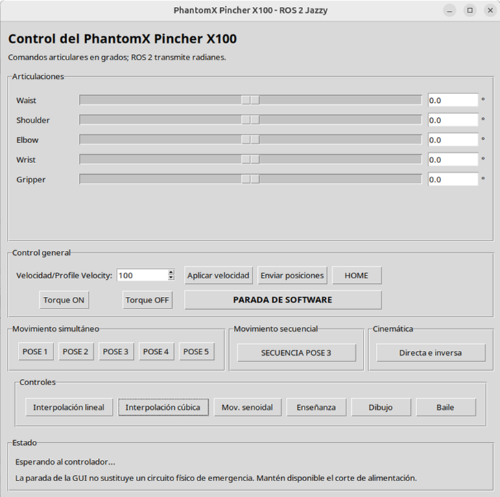
<br>
<b>Figura. GUI del robot. </b>
</p>

---

### Estructura del código 

Dada la extensión de los códigos, en el presente informe no se va a detallar cada línea de código; sin embargo, se va a explicar su funcionamiento más adelante, además de que en el siguiente diagrama se observa el árbol de archivos del laboratorio, al menos de la sección src, ya que es la que se modifica. Para ver los códigos completos, puede consultar los anexos.

```text
└── src
    ├── pincher_control
    │   ├── config
    │   │   ├── ax12a.yaml
    │   │   ├── poses.yaml
    │   │   └── xl430.yaml
    │   ├── launch
    │   │   └── pincher_system.launch.py
    │   ├── package.xml
    │   ├── pincher_control
    │   │   ├── cinematica_gui.py
    │   │   ├── cinematica.py
    │   │   ├── control_servo.py
    │   │   ├── dynamixel_profiles.py
    │   │   ├── __init__.py
    │   │   ├── pincher_gui.py
    │   │   ├── __pycache__
    │   │   │   ├── control_servo.cpython-312.pyc
    │   │   │   ├── dynamixel_profiles.cpython-312.pyc
    │   │   │   ├── __init__.cpython-312.pyc
    │   │   │   └── pincher_gui.cpython-312.pyc
    │   │   └── scan_dynamixel.py
    │   ├── resource
    │   │   └── pincher_control
    │   ├── setup.cfg
    │   └── setup.py
    └── pincher_description
        ├── launch
        │   ├── display_gui.launch.py
        │   └── display.launch.py
        ├── meshes
        │   ├── GripperBody v4.stl
        │   ├── LeftFinger v2.stl
        │   ├── LowerArm v2.stl
        │   ├── PincherBase v8.stl
        │   ├── ShoulderServo v5.stl
        │   └── UpperArm v2.stl
        ├── package.xml
        ├── resource
        │   └── pincher_description
        ├── rviz
        │   └── pincher.rviz
        ├── setup.cfg
        ├── setup.py
        └── urdf
            └── robot.xacro
```

Adicionalmente, en los anexos puede encontrar los archivos que se editaron del proyecto, los cuales son:

[Código cinematica_gui.py](Anexos/cinematica_gui.py)

[Código cinematica.py](Anexos/cinematica.py)

[Código pincher_gui.py](Anexos/pincher_gui.py)

---

# Actividad 2. Identificación de motores y articulaciones

Se identificaron cada una de las articulaciones del robot Phantom X Pincher X100 junto con el servomotor correspondiente, su identificador DYNAMIXEL, el sentido positivo de giro y la posición de referencia utilizada durante el laboratorio.

## Tabla de articulaciones

Es importante mencionar que su sentido positivo se muestra en la imagen y se toma como referencia el marco coordenado de la base global que se definió en la simulación y con el que se realizó posteriormente la cinemática directa.

| Articulación | ID DYNAMIXEL | Referencia | Sentido positivo | Función |
|--------------|-------------|-------------|-----------------|----------|
| Base | 001 | AX-12A | Z positivo global | Permite la rotación del robot alrededor del eje vertical, orientando el brazo hacia diferentes direcciones. |
| Hombro | 002 | AX-12A | Y negativo global | Eleva o desciende el primer eslabón del brazo, modificando la altura y el alcance del manipulador. |
| Codo | 003 | AX-12A | Y negativo global | Flexiona o extiende el segundo eslabón, variando el alcance del efector final. |
| Muñeca | 004 | AX-12A | Y negativo global | Ajusta la orientación del efector final para alcanzar la inclinación deseada. |
| Pinza | 005 | AX-12A | Z positivo global | Realiza la apertura y el cierre del mecanismo de agarre para sujetar o liberar objetos. |

---

## Identificación física

### Robot completo

<p align="center">
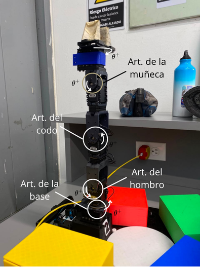
</p>

---


# Actividad 3. Medición del robot

Las dimensiones del robot fueron obtenidas a partir de las mediciones del modelo CAD (exceptuando la dimensión L<sub>0</sub> ya que este offset de altura se midió físicamente), para mayor precisión en cuanto a la simulación y para la edición del archivo .xacro; con el propósito de construir posteriormente el modelo cinemático mediante la convención de Denavit-Hartenberg.

<p align="center">
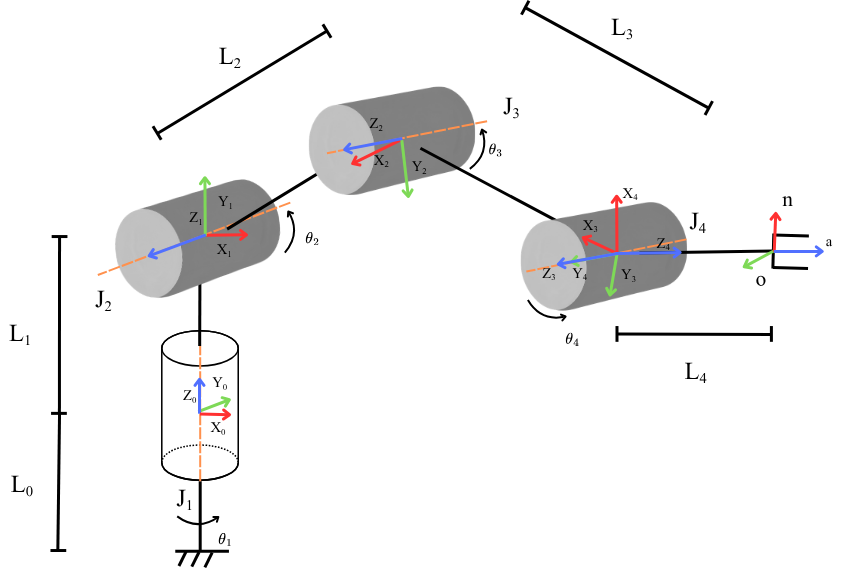
<br>
<b>Figura. Diagrama simplificado del manipulador Phantom X Pincher X100. </b>
</p>

En este caso, las dimensiones L<sub>i</sub> corresponden a:

<div align="center">

<table>
  <tr>
    <th>Dimensión</th>
    <th>Valor (cm)</th>
  </tr>
  <tr>
    <td>L<sub>0</sub></td>
    <td>10.35</td>
  </tr>
  <tr>
    <td>L<sub>1</sub></td>
    <td>4.15</td>
  </tr>
  <tr>
    <td>L<sub>2</sub></td>
    <td>10.70</td>
  </tr>
  <tr>
    <td>L<sub>3</sub></td>
    <td>10.70</td>
  </tr>
  <tr>
    <td>L<sub>4</sub></td>
    <td>9.26</td>
  </tr>
</table>

</div>
---

# Actividad 4. Movimiento individual de articulaciones

La actividad 4 propone mover individualmente cada articulación; con este propósito se propone hacer uso de unas barras deslizantes para cada articulación y así manipular la posición del robot. Sin embargo, esta propuesta fue ideada y desarrollada por el laboratorio, permitiéndonos hacer uso de ella.

Para evidenciar esta funcionalidad, se grabó el siguiente video:

[Actividad 4](https://www.youtube.com/watch?v=dsmVWJc1SFA)

---

# Actividad 5. Calibración de cero y error articular

Para poder identificar el error en las articulaciones, primero se realizaron 5 pruebas donde se le indicaba a cada articulación girar un ángulo determinado y luego, con un goniómetro, se medía cuánto era efectivamente el ángulo que alcanzaba. En la tabla se ve el resumen de este procedimiento, seguido luego del cálculo del error para cada una de las mediciones realizadas, con los cuales se calculó el error máximo y el error promedio. 

<div align="center">

| Medición | Deseada | Base | Hombro | Codo | Muñeca | Pinza |
|--- | ------|-----|------|-------|--------|------ |
|  1  | 0 | 5|0.5  |0.5|0.5|-|
|  2  | 30 |26|31|32|32|-|
|  3  | 45  |40|45.5|47.5|47|-|
|  4  | 60   |58|64|63|61|-|
|  5  | 90 |87|94|90.5|91|-|

</div>
<div align="center">

|Errores| Base | Hombro | Codo | Muñeca |
|--- | ------|-----|------|-------|
|    | 5 | 0.5|0.5 |0.5|
|    | 4 | 1 |2|2|
|    | 5 |0.5|2.5|2|
|    | 2 |4|3|1|
|    | 3 |4|0.5|1|
|Error Máximo| 5 |4|3|2|
|Error Promedio| 3.8 |2|1.7|1.3|
|Desviación Estándar|1.303840481 |1.837117307|1.151086443|0.6708203932|

A continuación se presentan algunas gráficas que comparan los valores que se midieron respecto a los valores esperados para las primeras cuatro articulaciones.

</div>

<div align="center">
  <table>
    <tr>
      <td align="center">
        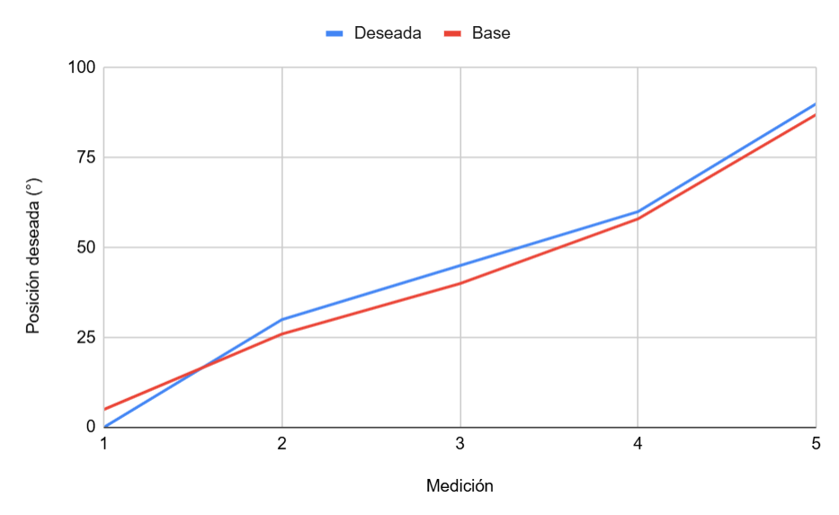<br>
        <b>(a)</b>
      </td>
      <td align="center">
        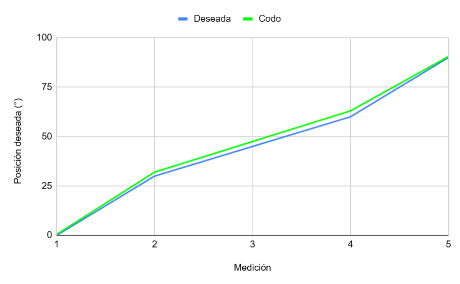<br>
        <b>(b)</b>
      </td>
    </tr>
    <tr>
      <td align="center">
        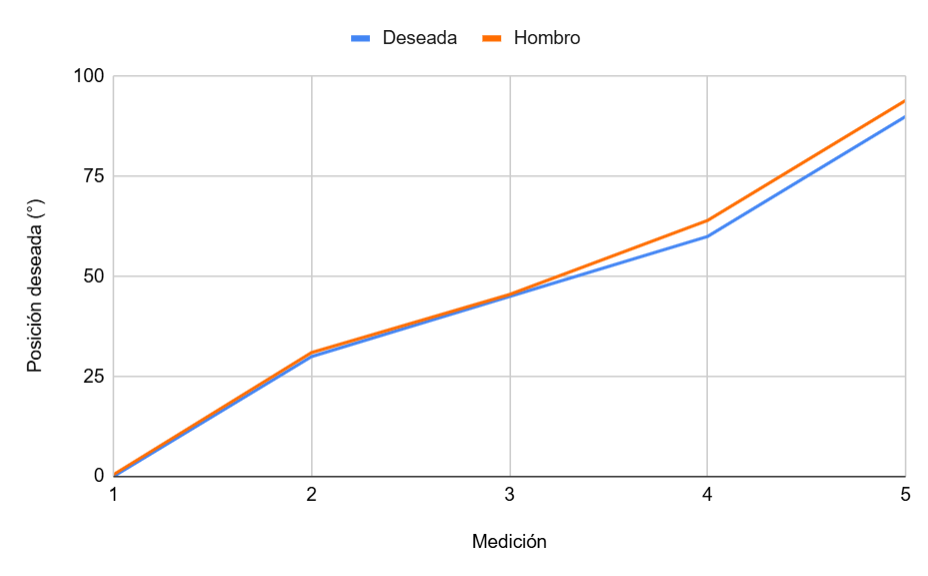<br>
        <b>(c)</b>
      </td>
      <td align="center">
        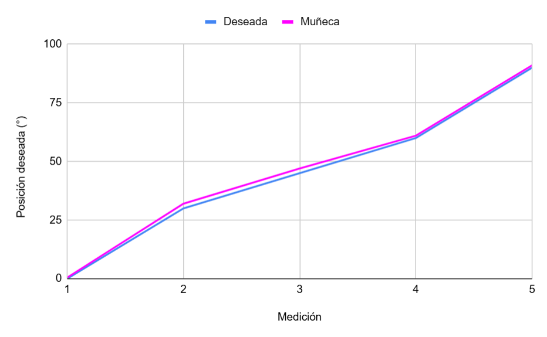<br>
        <b>(d)</b>
      </td>
    </tr>
  </table>

  <b>Figura . </b> Gráficas comparativas de los valores medidos y esperados:
  (a) Base, (b) Codo, (c) Hombro y (d) Muñeca.
</div>

---

# Actividad 6. Determinación de límites seguros

Con el fin de evitar colisiones y proteger los servomotores, se determinaron experimentalmente los límites seguros de operación para cada articulación del manipulador.

## Límites seguros

<div align="center">

| Articulación | Límite inferior (°) | Límite superior (°) | Margen de seguridad (°) |
|--------|---------|-----------|-----------|
| Base | -150 | -150 | 5 |
| Hombro | -85 | 85 | 5 |
| Codo |-135 | 135 | 5 |
| Muñeca | -95 | 90 | 5 |
| Pinza | -60 | 50 | 5 |

</div>

Se detectó que la articulación de la base era capaz de recorrer todo el margen que le daba el programa Dynamixel, sin embargo, se decidió de manera grupal dejar un margen de 5° en cada articulación, para salvaguardar la integridad física del robot.

---

# Actividad 7 Movimiento simultáneo 

Posteriormente, para la actividad 7, donde se propone realizar el movimiento simultáneo de todas las articulaciones para alcanzar una pose, se decidió añadir cinco botones, uno por cada una de las cinco poses que se solicitan. 

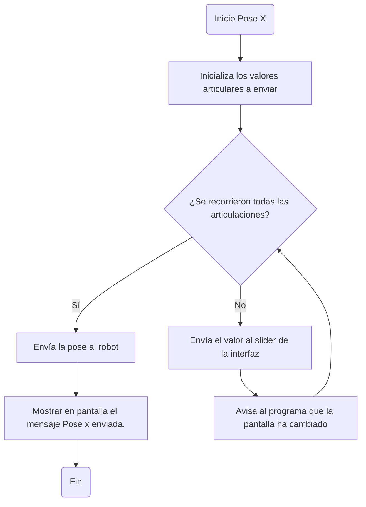
```mermaid
flowchart TB
    A("Inicio Pose X") --> B["Inicializa los valores articulares a enviar"]
    B --> W{"¿Se recorrieron todas las articulaciones?"}
    W -- Sí --> V["Envía la pose al robot"]
    V --> U["Mostrar en pantalla el mensaje "Pose x enviada.""]
    U --> L(Fin)
    W -- No --> F["Envía el valor al slider de la interfaz"]
    F --> X["Avisa al programa que la pantalla ha cambiado"]
    X --> W
```
En el siguiente video se observa cómo funciona el movimiento secuencial de nuestra implementación:

[Actividad 7](https://www.youtube.com/watch?v=yUIcodW3dls)


# Actividad 8 Movimiento secuencial

Luego la actividad 8 pide realizar el movimiento hacia una pose, pero en esta ocasión de manera secuencial en el siguiente orden: Base, hombro, codo, muñeca y pinza.  Para cumplir con ello, se agregó otro botón llamado “SECUENCIA POSE 3”.

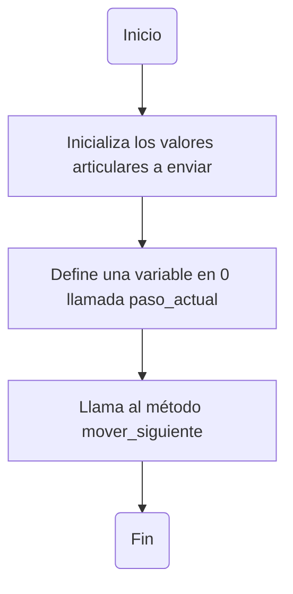
```mermaid
flowchart TB
    A("Inicio") --> B["Inicializa los valores articulares a enviar"]
    B --> C["Define una variable en 0 llamada "paso_actual""]
    C --> D["Llama al método mover_siguiente"]
    D --> L(Fin)
```

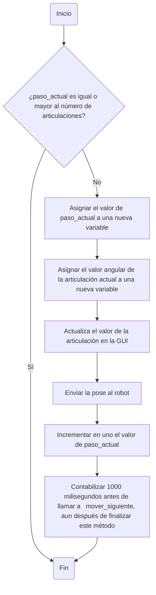
```mermaid
flowchart TB
    A("Inicio") --> I{¿paso_actual es igual o mayor al número de articulaciones?}
    I -- No --> B["Asignar el valor de paso_actual a una nueva variable"]
    I -- Sí --> L(Fin)
    B --> C["Asignar el valor angular de la articulación actual a una nueva variable"]
    C --> D["Actualiza el valor de la articulación en la GUI"]
    D --> U["Enviar la pose al robot"]
    U --> F["Incrementar en uno el valor de paso_actual"]
    F --> X["Contabilizar 1000 milisegundos antes de llamar a   mover_siguiente, aun después de finalizar este método"]
    X --> L
```

Por el lado del movimiento secuencial, se grabó el siguiente video:

[Actividad 8](https://www.youtube.com/watch?v=mNbL51_8TK8)

---

# Actividad 9. Interpolación de trayectorias

La actividad 9 solicita implementar trayectorias entre dos puntos del espacio; estas trayectorias deben implementar interpolación lineal e interpolación cúbica o quíntica; en nuestro caso se eligió quíntica. Por lo tanto, se agregaron dos botones en la sección de controles, denominados “Interpolación lineal” e “Interpolación cúbica”. Al ser presionados, se abre una ventana, una diferente en cada caso, en la cual se encuentran dos secciones donde se pueden ingresar la posición inicial y final que se desea, y una sección adicional para las gráficas de ángulo vs. tiempo para cada articulación que se solicita. Cabe señalar que la cinemática inversa requiere, además de la posición, indicar un ángulo; por facilidad, en esta ocasión este ángulo se dejó en cero por defecto. Adicionalmente, la ventana que se abre debe ser ampliada para ver completamente las gráficas.

<p align="center">
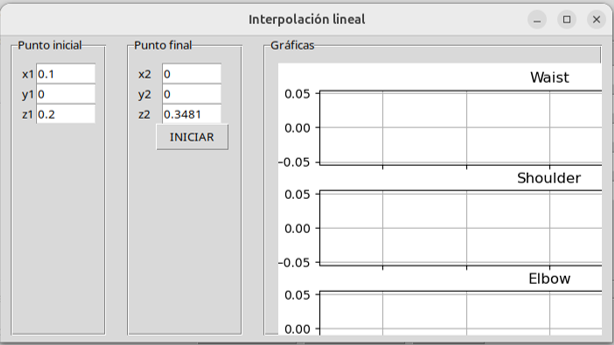
<br>
<b>Figura. Ventana de interpolación lineal. </b>
</p>

<p align="center">
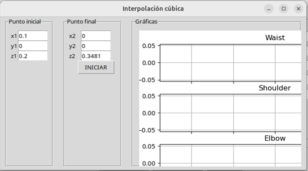
<br>
<b>Figura. Ventana de interpolación cúbica. </b>
</p>

Para unir dos puntos en el espacio fue necesario considerar dos tipos de interpolación. Por un lado, la interpolación lineal y, por otro, la interpolación cúbica.

Por el lado de la interpolación lineal se planteó como ecuación que describe este movimiento lo siguiente:

$$
X = X_1 + u(X_2 - X_1)
$$

Donde:

$$
X = [x \; y \; z]^T
$$

$$
u = \frac{i}{\text{pasos}}
$$

Donde:

- **i** es el número de la iteración.
- **pasos** es el número de pasos que se establece para el movimiento.

Por otro lado, para la interpolación cúbica se planteó hacer uso de esta interpolación en dos lugares: primero en el tiempo y luego en el espacio de la tarea.

Para la interpolación en el tiempo, con el fin de tener un inicio suave y una parada suave, se utilizó:

$$
s = 3u^2 - 2u^3
$$

Luego, para la trayectoria en el espacio se decidió hacer una interpolación con cuatro puntos, dado que se va a usar una trayectoria cúbica. Se empleó la siguiente ecuación:

$$
P(s)=(1-s)^3P_1+3(1-s)^2sP_2+3(1-s)s^2P_3+s^3P_4
$$

Desglosando este vector en sus tres componentes escalares cartesianas independientes $(x, y, z)$ obtenemos:

$$
x(s) = (1-s)^3x_1 + 3(1-s)^2sx_2 + 3(1-s)s^2x_3 + s^3x_4
$$

$$
y(s) = (1-s)^3y_1 + 3(1-s)^2sy_2 + 3(1-s)s^2y_3 + s^3y_4
$$

$$
z(s) = (1-s)^3z_1 + 3(1-s)^2sz_2 + 3(1-s)s^2z_3 + s^3z_4
$$

Dado que el usuario solamente ingresa el punto inicial y el final, los otros puntos se establecen internamente en el código. Para ello se establecieron las componentes $x$ y $y$ de estos puntos usando una proporción en tercios:

$$
x_2 = x_1 + \frac{x_4 - x_1}{3}, \qquad
y_2 = y_1 + \frac{y_4 - y_1}{3}
$$

$$
x_3 = x_1 + \frac{2(x_4 - x_1)}{3}, \qquad
y_3 = y_1 + \frac{2(y_4 - y_1)}{3}
$$

Luego, para las componentes $z$ se utilizó un arco de la forma:

$$
z_2 = z_3 = \max(z_1, z_4) + H
$$

donde $H$ es una elevación que se elige por el programador y que debe colocarse adecuadamente, evitando que se salga del alcance del robot.

Los siguientes diagramas ilustran el funcionamiento interno de las funciones linear_interpolation e ir_inter_lin. Aunque no se presentan los diagramas de flujo de los métodos de interpolación cúbica, en esencia siguen la misma secuencia, teniendo únicamente como cambios los nombres (cubic_interpolation e ir_inter_cub) y la parte que realiza el cálculo de los puntos de la interpolación siguiendo los cálculos anteriormente indicados. Adicionalmente, los mensajes que actualizan el estado del sistema también se acomodan para indicar que se está realizando la interpolación cúbica.

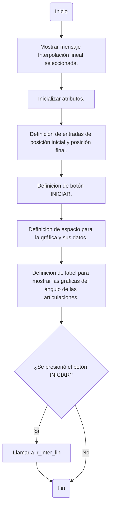
```mermaid
flowchart TB
    A("Inicio") --> B["Mostrar mensaje Interpolación lineal seleccionada."]
    B --> C["Inicializar atributos."]
    C --> D["Definición de entradas de posición inicial y posición final."]
    D --> E["Definición de botón INICIAR."]
    E --> F["Definición de espacio para la gráfica y sus datos."]
    F --> G["Definición de label para mostrar las gráficas del ángulo de las articulaciones."]
    J -- Sí --> K["Llamar a ir_inter_lin"]
    K --> L
    J -- No --> L(Fin)
    G --> J{"¿Se presionó el botón INICIAR?"}
```

El diagrama a continuación es la lógica que calcula los puntos de la interpolación y los envía al robot para su movimiento. Además, actualiza las gráficas que se visualizan en la interfaz de usuario:

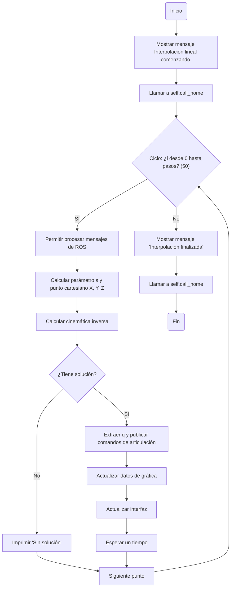
```mermaid
flowchart TB
    A("Inicio") --> K1
    K1["Mostrar mensaje Interpolación lineal comenzando."] --> K2["Llamar a self.call_home"]
    K2 --> K3{"Ciclo: ¿i desde 0 hasta pasos? (50)"}
    K3 -- Sí --> K4["Permitir procesar mensajes de ROS"]
    K4 --> K5["Calcular parámetro s y punto cartesiano X, Y, Z"]
    K5 --> K6["Calcular cinemática inversa"]
    K6 --> K7{"¿Tiene solución?"}
    K7 -- No --> K8["Imprimir 'Sin solución'"] --> K13["Siguiente punto"]
    K7 -- Sí --> K9["Extraer q y publicar comandos de articulación"]
    K9 --> K10["Actualizar datos de gráfica"]
    K10 --> K11["Actualizar interfaz"]
    K11 --> K12["Esperar un tiempo"] --> K13
    K13 --> K3
    K3 -- No --> K14["Mostrar mensaje 'Interpolación finalizada'"]
    K14 --> K15["Llamar a self.call_home"]
    K15 --> F("Fin")
```

En el siguiente video puede observar el funcionamiento de esta sección, tanto para la interpolación lineal como para la interpolación cúbica:

[Actividad 9](https://www.youtube.com/watch?v=VQAkOHhq0co)

Como se observa en el video, se obtuvieron unas gráficas para ambos tipos de trayectorias. En términos generales, se evidencia que la trayectoria que usa la interpolación cúbica tiene un perfil de posición en cada una de las articulaciones más suave.

<p align="center">
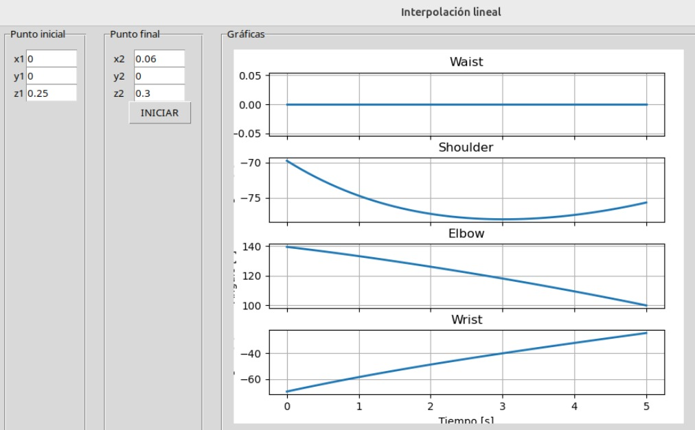
<br>
<b>Figura. Gráfica de la interpolación lineal. </b>
</p>

<p align="center">
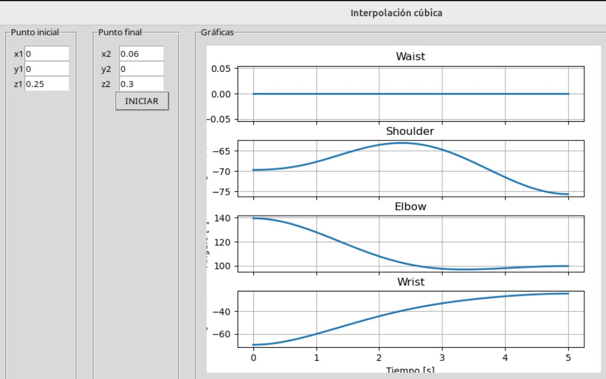
<br>
<b>Figura. Gráfica de la interpolación cúbica. </b>
</p>

---

# Actividad 10. Trayectoria sinusoidal de una articulación

Para la trayectoria sinusoidal, se eligió una articulación para realizar la prueba. En el código se observa que la articulación seleccionada es la shoulder. Como se solicitaba poder determinar la amplitud de este movimiento y su frecuencia, entonces se añadieron dos entradas numéricas en la interfaz gráfica donde se pueden asignar estos valores. Esta funcionalidad, junto con la gráfica del valor de la articulación respecto al tiempo y junto a los valores que se calcularán del error, están contenidos en el método sinusoidal_motion(self), que se muestra a continuación, el cual organiza la interfaz gráfica. Se incluyó un botón, el cual hace llamado al método que hace los cálculos como tal.


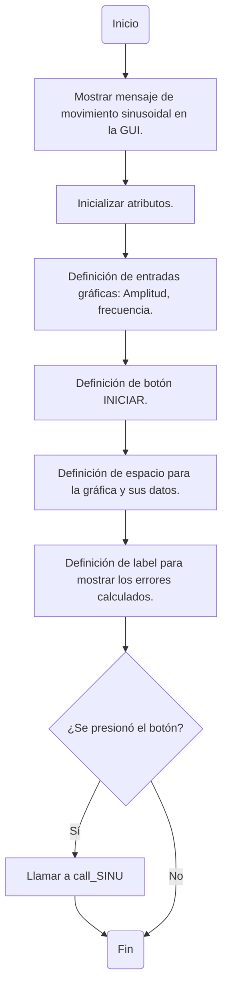
```mermaid
flowchart TB
    A("Inicio") --> B["Mostrar mensaje de movimiento sinusoidal en la GUI."]
    B --> C["Inicializar atributos."]
    C --> D["Definición de entradas gráficas: Amplitud, frecuencia."]
    D --> E["Definición de botón INICIAR."]
    E --> F["Definición de espacio para la gráfica y sus datos."]
    F --> G["Definición de label para mostrar los errores calculados."]
    J -- Sí --> K["Llamar a call_SINU"]
    K --> L
    J -- No --> L(Fin)
    G --> J{"¿Se presionó el botón?"}
```
 Al presionar el botón iniciar, se hace llamado al método call_SINU, el cual implementa la lógica detrás del movimiento de la articulación. Dado que estamos manejando una gráfica que depende del cálculo, debemos realizar algunas acciones para su correcto funcionamiento, como reiniciar datos y limpiar la línea que se grafica. Tras esto, sí se inicia a contabilizar el tiempo, con el fin de usar correctamente la frecuencia y generar la trayectoria respecto al tiempo. Dentro de un ciclo while, se comienza a calcular el valor de la articulación punto por punto. Habiendo calculado el ángulo correspondiente para un instante dado, se procede a construir el mensaje que se enviará al robot y luego se envía. Adicionalmente, se guardan los valores de tiempo, ángulo enviado y ángulo medido por el encoder para luego actualizar la gráfica con estos valores. Al finalizar el ciclo while, cuando se completa una duración especificada, se inicia el cálculo de los errores. El primero es el error máximo de la trayectoria medida respecto a la esperada, y el error cuadrático medio de los errores entre las gráficas.

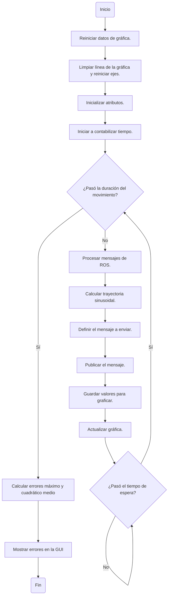
```mermaid
flowchart TB
    A("Inicio") --> B["Reiniciar datos de gráfica."]
    B --> C["Limpiar línea de la gráfica y reiniciar ejes."]
    C --> D["Inicializar atributos."]
    D --> E["Iniciar a contabilizar tiempo."]
    E --> I{"¿Pasó la duración del movimiento?"}
    I -- Sí --------> M["Calcular errores máximo y cuadrático medio"]
    I -- No --> F["Procesar mensajes de ROS."]
    F --> G["Calcular trayectoria sinusoidal."]
    G --> U["Definir el mensaje a enviar."]
    U --> V["Publicar el mensaje."]
    V --> W["Guardar valores para graficar."]
    W --> R["Actualizar gráfica."]
    R --> J{"¿Pasó el tiempo de espera?"}
    J -- Sí --> I
    J -- No --> J
    M --> Y["Mostrar errores en la GUI"]
    Y --> T("Fin") 
```

A continuación se observa un video como evidencia de este movimiento sinusoidal, únicamente para la articulación dos:

[Actividad 10](https://www.youtube.com/watch?v=TRUCXz-V_eY)

Adicionalmente, se realizaron varias pruebas con diferentes valores de amplitud y frecuencia, de las cuales se obtuvieron las siguientes gráficas:

<div align="center">
  <table>
    <tr>
      <td align="center">
        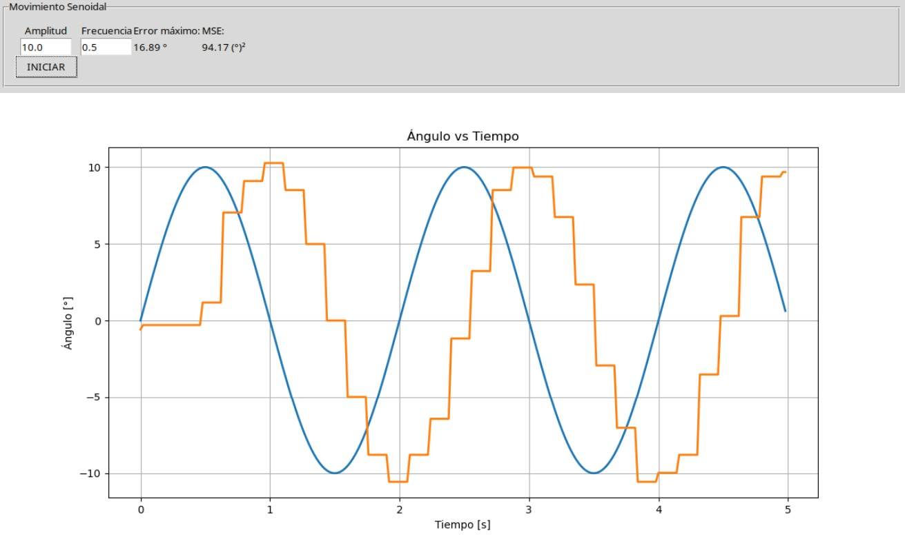<br>
        <b>(a)</b>
      </td>
      <td align="center">
        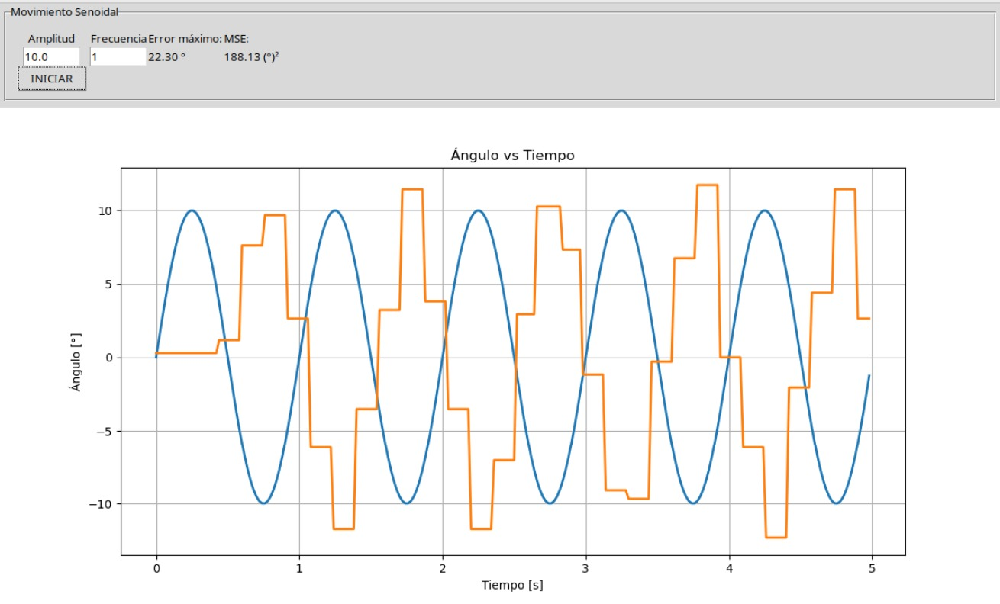<br>
        <b>(b)</b>
      </td>
    </tr>
    <tr>
      <td align="center">
        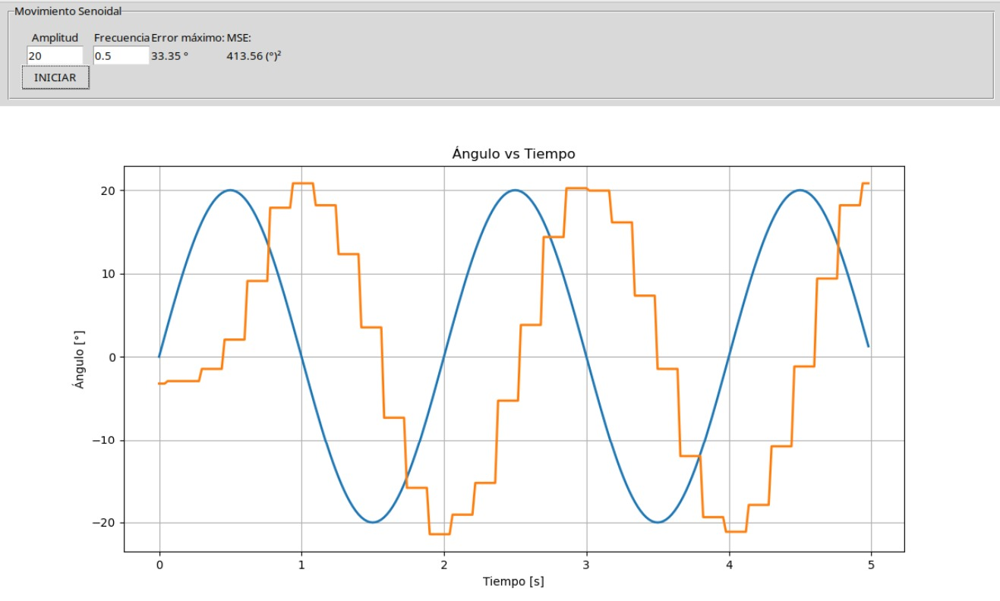<br>
        <b>(c)</b>
      </td>
      <td align="center">
        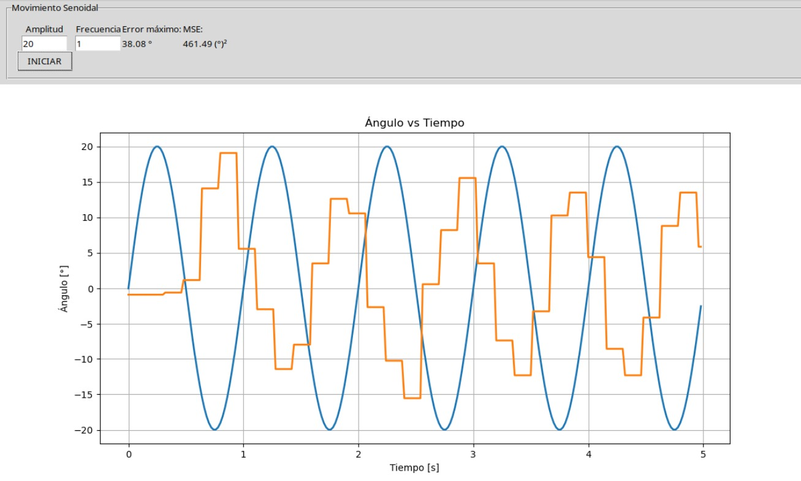<br>
        <b>(d)</b>
      </td>
    </tr>
  </table>

  <b>Figura .</b> Gráficas de movimiento sinusoidal:
  (a) Amplitud 10 frecuencia de 0.5, (b) Amplitud 10 frecuencia de 1, (c) Amplitud 20 frecuencia de 0.5 y (d) Amplitud 20 frecuencia de 1.
</div>

---

# Actividad 11 y 12 - Cinemática directa e inversa

## Interfaz gráfica para la cinemática 

El archivo <code>cinematica_gui.py</code> implementa la interfaz gráfica utilizada para interactuar con los algoritmos de cinemática directa e inversa del robot Phantom X Pincher X100.

Para visualizar esta interfaz adicional, hay que presionar el botón “Directa e inversa” en la sección de cinemática. Esto abrirá una ventana donde se pueden ingresar tanto los cuatro valores angulares para la cinemática directa como los valores de posición x, y, z y el valor angular para la cinemática inversa. Para ambas secciones se incluyó un botón para realizar el cálculo, y una vez calculado, también se encuentra un botón que envía estos valores al robot para que se mueva a la posición dada.

<p align="center">
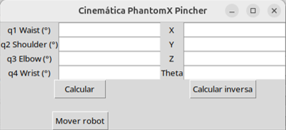
<br>
<b>Figura. Ventana de cinemática. </b>
</p>

### Estructura general de la interfaz

La interfaz fue organizada para separar claramente la interacción con el usuario de los cálculos cinemáticos. De esta manera, <code>cinematica_gui.py</code> únicamente se encarga de recibir la información ingresada por el usuario, llamar las funciones correspondientes de <code>cinematica.py</code>, mostrar los resultados obtenidos y enviar la configuración seleccionada al robot virtual mediante ROS 2.

<pre>
Usuario
   │
   ▼
cinematica_gui.py
   │
   ├── cinematica_directa()
   ├── cinematica_inversa()
   ├── obtener_rpy()
   └── elegir_solucion_cercana()
            │
            ▼
      cinematica.py
</pre>

### Importación de funciones

La comunicación con el módulo cinemático se realiza mediante la importación de las funciones encargadas de calcular la cinemática directa, resolver la cinemática inversa, obtener la orientación del efector final y seleccionar la solución articular más conveniente. Gracias a esta estructura modular, la interfaz permanece independiente del modelo matemático y facilita el mantenimiento del código.

<pre><code>
from pincher_control.cinematica import (
    cinematica_directa,
    cinematica_inversa,
    obtener_rpy,
    elegir_solucion_cercana
)
</code></pre>

### Cinemática directa

Cuando el usuario presiona el botón <strong>Calcular</strong>, la interfaz obtiene los valores de las cuatro articulaciones, ejecuta la función <code>cinematica_directa()</code> y extrae de la matriz homogénea la posición cartesiana (<em>x</em>, <em>y</em>, <em>z</em>) y la orientación del efector final mediante la función <code>obtener_rpy()</code>. Los resultados se presentan inmediatamente en la interfaz para facilitar la validación del modelo implementado.

### Cinemática inversa

Al seleccionar la opción <strong>Calcular inversa</strong>, el usuario ingresa la posición y orientación deseadas del efector final. Estos datos son enviados a la función <code>cinematica_inversa()</code>, la cual calcula todas las configuraciones articulares válidas. Posteriormente, la interfaz muestra las soluciones encontradas y utiliza <code>elegir_solucion_cercana()</code> para seleccionar automáticamente la configuración más próxima a la postura actual del robot, logrando movimientos más suaves y continuos.

Aunque los cálculos cinemáticos se encuentran implementados en <code>cinematica.py</code>, el archivo <code>cinematica_gui.py</code> constituye el principal medio de interacción con el usuario. Su implementación permitió validar de forma sencilla la cinemática directa e inversa desarrolladas durante las Actividades 11 y 12, facilitando la comparación de los resultados obtenidos con la visualización del robot en RViz y simplificando el proceso de prueba y depuración del modelo cinemático.

A continuación se mostrará un diagrama de flujo de <code>cinematica.py</code>.

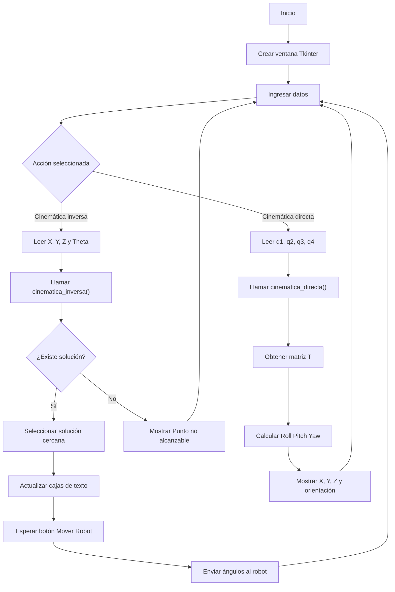
```mermaid
flowchart TD

A[Inicio] --> B[Crear ventana Tkinter]

B --> C[Ingresar datos]

C --> D{Acción seleccionada}

D -->|Cinemática directa| E[Leer q1, q2, q3, q4]

E --> F["Llamar cinematica_directa()"]

F --> G[Obtener matriz T]

G --> H[Calcular Roll Pitch Yaw]

D -->|Cinemática inversa| J[Leer X, Y, Z y Theta]

J --> K["Llamar cinematica_inversa()"]

K --> L{¿Existe solución?}

L -->|No| M[Mostrar Punto no alcanzable]

L -->|Sí| N[Seleccionar solución cercana]

N --> O[Actualizar cajas de texto]

O --> P[Esperar botón Mover Robot]

P --> Q[Enviar ángulos al robot]

Q --> C
M --> C
H --> I[Mostrar X, Y, Z y orientación]

I --> C
```

## Implementación de la cinemática (<code>cinematica.py</code>)

El archivo <code>cinematica.py</code> contiene la implementación del modelo cinemático del robot Phantom X Pincher X100. En este módulo se desarrollaron los algoritmos necesarios para resolver tanto la cinemática directa como la cinemática inversa del manipulador, utilizando la convención estándar de Denavit-Hartenberg (DH). Además, se implementaron funciones auxiliares para obtener la orientación del efector final, verificar los límites articulares y seleccionar la solución más adecuada cuando existen múltiples configuraciones posibles.

### Desarrollo teórico

Como punto de partida para el desarrollo de la cinemática del manipulador, se construyó un modelo simplificado del robot en el que únicamente se representan los elementos necesarios para describir su movimiento. En esta representación se identifican las cuatro articulaciones rotacionales (<i>J<sub>1</sub></i> a <i>J<sub>4</sub></i>), las longitudes características de cada eslabón (<i>L<sub>1</sub></i> a <i>L<sub>4</sub></i>) y los sistemas de referencia asignados siguiendo la convención estándar de Denavit-Hartenberg (DH), como se puede ver a continuación.

<p align="center">

<br>
<b>Figura. Diagrama simplificado del manipulador Phantom X Pincher X100.</b>
</p>

La asignación de los sistemas de referencia permitió construir la tabla de parámetros Denavit-Hartenberg (DH), en la cual se definieron los parámetros geométricos <b>θᵢ</b>, <b>dᵢ</b>, <b>aᵢ</b> y <b>αᵢ</b>.

A partir de esta tabla se obtuvieron las matrices de transformación homogénea entre sistemas de referencia consecutivos, representadas como <i>A<sub>0</sub><sup>1</sup></i>, <i>A<sub>1</sub><sup>2</sup></i>, <i>A<sub>2</sub><sup>3</sup></i>, <i>A<sub>3</sub><sup>4</sup></i> y <i>A<sub>4</sub><sup>5</sup></i>. Cada una de estas matrices incorpora las transformaciones elementales de rotación y traslación descritas por la convención DH estándar, permitiendo relacionar un sistema de referencia con el siguiente. 

Finalmente, la multiplicación secuencial de todas las matrices homogéneas permitió obtener la transformación total del manipulador, a partir de la cual se determinan la posición y la orientación del efector final mediante la cinemática directa.

<table align="center">
  <tr>
    <th>Eslabón <i>i</i></th>
    <th><i>&theta;<sub>i</sub></i></th>
    <th><i>d<sub>i</sub></i> (m)</th>
    <th><i>a<sub>i</sub></i> (m)</th>
    <th><i>&alpha;<sub>i</sub></i></th>
  </tr>

  <tr>
    <td align="center">1</td>
    <td align="center">&theta;<sub>1</sub></td>
    <td align="center"><i>L</i><sub>1</sub></td>
    <td align="center">0</td>
    <td align="center">90°</td>
  </tr>

  <tr>
    <td align="center">2</td>
    <td align="center">&theta;<sub>2</sub> + 90°</td>
    <td align="center">0</td>
    <td align="center"><i>L</i><sub>2</sub></td>
    <td align="center">0°</td>
  </tr>

  <tr>
    <td align="center">3</td>
    <td align="center">&theta;<sub>3</sub></td>
    <td align="center">0</td>
    <td align="center"><i>L</i><sub>3</sub></td>
    <td align="center">0°</td>
  </tr>

  <tr>
    <td align="center">4</td>
    <td align="center">&theta;<sub>4</sub> + 90°</td>
    <td align="center">0</td>
    <td align="center">0</td>
    <td align="center">90°</td>
  </tr>

  <tr>
    <td align="center">5 (TCP)</td>
    <td align="center">0°</td>
    <td align="center"><i>L</i><sub>4</sub></td>
    <td align="center">0</td>
    <td align="center">0°</td>
  </tr>
</table>

Posteriormente, utilizando el mismo modelo geométrico, se desarrolló la cinemática inversa. En este caso se empleó un análisis geométrico del manipulador para calcular los ángulos articulares requeridos para alcanzar una posición y orientación deseadas del efector final. Debido a que el Phantom X Pincher X100 posee únicamente cuatro grados de libertad, no es posible controlar de forma independiente la orientación completa del efector final. Por esta razón, el algoritmo solicita únicamente el parámetro <i>&theta;</i>, el cual representa la orientación del último eslabón dentro del plano de movimiento del manipulador, definida como la suma de las articulaciones <i>&theta;<sub>2</sub> + &theta;<sub>3</sub> + &theta;<sub>4</sub></i>. Esta restricción reduce el problema de orientación a una sola variable, permitiendo resolver la cinemática inversa mediante relaciones geométricas y trigonométricas. El procedimiento considera además las posibles configuraciones del robot, como codo arriba y codo abajo, y verifica que las soluciones obtenidas respeten los límites físicos de las articulaciones.

Finalmente, todas las expresiones obtenidas durante el desarrollo teórico fueron implementadas en el archivo <code>cinematica.py</code>. En dicho módulo se programaron las funciones encargadas de construir las matrices DH, calcular la cinemática directa, resolver la cinemática inversa, obtener la orientación del efector final y validar las soluciones antes de enviarlas a la interfaz gráfica desarrollada para el proyecto.


### Parámetros del manipulador


Inicialmente se definieron las dimensiones geométricas del robot, correspondientes a las longitudes de cada eslabón empleadas durante la construcción del modelo cinemático. Estos parámetros son utilizados por todas las funciones del módulo para garantizar que los cálculos de posición y orientación sean consistentes con el modelo implementado en ROS 2 y RViz.

<pre><code>
L1 = 0.0415
L2 = 0.1070
L3 = 0.1070
L4 = 0.0926
</code></pre>

### Cinemática directa

La función <code>cinematica_directa()</code> implementa el modelo geométrico del robot utilizando los parámetros DH definidos para el manipulador. A partir de los ángulos articulares ingresados por el usuario, se construye la tabla de parámetros Denavit-Hartenberg y posteriormente se calculan las matrices de transformación homogénea de cada articulación.

<pre><code>
tabla = [
    [q1,     L1, 0, 90],
    [q2+90,   0, L2, 0],
    [q3,      0, L3, 0],
    [q4+90,   0,  0, 90],
    [0,      L4,  0, 0]
]
</code></pre>

Las matrices individuales son multiplicadas de manera secuencial para obtener la transformación homogénea total del efector final respecto al sistema de referencia base. A partir de esta matriz es posible conocer tanto la posición cartesiana como la orientación del robot para cualquier configuración articular válida.

<pre><code>
T = np.eye(4)

for fila in tabla:
    T = T @ DH(fila[0], fila[1], fila[2], fila[3])
</code></pre>

Se adjunta también un breve diagrama de flujo de esta función para ver de manera general más fácilmente la lógica utilizada.

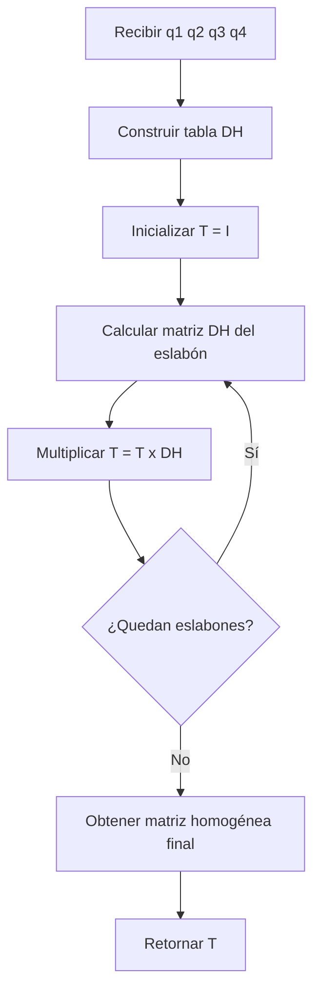
```mermaid
flowchart TD

A[Recibir q1 q2 q3 q4]

A --> B[Construir tabla DH]

B --> C[Inicializar T = I]

C --> D[Calcular matriz DH del eslabón]

D --> E[Multiplicar T = T x DH]

E --> F{¿Quedan eslabones?}

F -->|Sí| D

F -->|No| G[Obtener matriz homogénea final]

G --> H[Retornar T]
```

### Obtención de la orientación

Una vez calculada la matriz homogénea, la función <code>obtener_rpy()</code> extrae la matriz de rotación y calcula los ángulos de Roll, Pitch y Yaw. Estos valores permiten expresar la orientación del efector final mediante ángulos de Euler y son posteriormente mostrados en la interfaz gráfica desarrollada para el proyecto.


### Cinemática inversa

La función <code>cinematica_inversa()</code> resuelve el problema inverso del manipulador, determinando las configuraciones articulares necesarias para alcanzar una posición y orientación especificadas por el usuario. El algoritmo inicia calculando la rotación de la base y posteriormente determina la posición del centro de la muñeca, eliminando el efecto del último eslabón sobre la posición del efector final.


<pre><code>
theta1 = np.arctan2(y, x)

xw = ...
yw = ...
zw = ...
</code></pre>


Con la posición de la muñeca calculada, se aplica la ley de cosenos para obtener el ángulo correspondiente a la tercera articulación y posteriormente se calcula el ángulo de la segunda articulación mediante relaciones trigonométricas. Finalmente, el ángulo de la muñeca se obtiene a partir de la orientación deseada del efector final y de los ángulos previamente calculados.

Debido a la naturaleza geométrica del manipulador, el algoritmo evalúa las configuraciones de <i>codo arriba</i> y <i>codo abajo</i>, obteniendo todas las soluciones físicamente posibles para una misma posición del efector final.


### Validación de soluciones


Cada configuración obtenida es comparada con los límites mecánicos de las articulaciones definidos para el robot. Las soluciones que exceden dichos límites son descartadas automáticamente, garantizando que únicamente se consideren posiciones físicamente alcanzables por el manipulador.


<pre><code>
LIMITES_ARTICULACIONES = [
    [-145, 145],   # q1 Waist
    [-80, 80],     # q2 Shoulder
    [-130, 130],   # q3 Elbow
    [-90, 85]    # q4 Wrist
]
</code></pre>

El proceso de cinemática inversa resulta resumido en el siguiente diagrama de flujo.

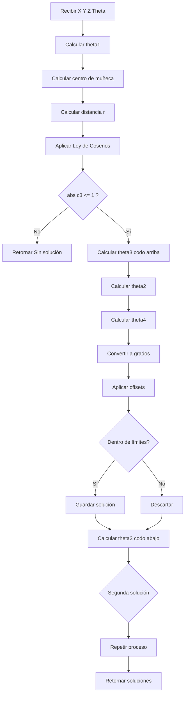
```mermaid
flowchart TD

A[Recibir X Y Z Theta]

A --> B[Calcular theta1]

B --> C[Calcular centro de muñeca]

C --> D[Calcular distancia r]

D --> E[Aplicar Ley de Cosenos]

E --> F{abs c3 <= 1 ?}

F -->|No| G[Retornar Sin solución]

F -->|Sí| H[Calcular theta3 codo arriba]

H --> I[Calcular theta2]

I --> J[Calcular theta4]

J --> K[Convertir a grados]

K --> L[Aplicar offsets]

L --> M{Dentro de límites?}

M -->|Sí| N[Guardar solución]

M -->|No| O[Descartar]

N --> P[Calcular theta3 codo abajo]

O --> P

P --> Q{Segunda solución}

Q --> R[Repetir proceso]

R --> S[Retornar soluciones]
```

### Selección de la solución óptima


Cuando existen múltiples soluciones válidas, se utiliza la función <code>elegir_solucion_cercana()</code>, la cual calcula la distancia entre cada solución y la configuración actual del robot mediante la norma euclidiana. De esta manera se selecciona la postura que requiere el menor desplazamiento articular, obteniendo movimientos más suaves y evitando cambios innecesarios entre configuraciones equivalentes.

<pre><code>
distancia = np.linalg.norm(
    np.array(q) - np.array(q_actual)
)
</code></pre>

El archivo <code>cinematica.py</code> es el encargado de todo proceso matemático de la cinemática. Todas las operaciones relacionadas con el cálculo de la posición, orientación y resolución de la cinemática del manipulador se encuentran concentradas en este módulo. Gracias a esta organización, la interfaz gráfica y los nodos de control implementados en ROS 2 únicamente deben invocar las funciones desarrolladas, manteniendo una arquitectura modular.

## Demostración de funcionamiento

En el siguiente video se observa cómo funciona la ventana de cinemática:

[Actividades 11 y 12](https://www.youtube.com/watch?v=Ca-A8xjWVEQ)

---

# Actividad 13. Enseñanza y repetición de poses

La siguiente actividad busca que el robot sea capaz de guardar una posición dada por el usuario y luego llevar a cabo una serie de acciones. Por lo tanto, se colocó un botón denominado “Enseñanza”. Este botón abre una ventana donde se pueden observar tres botones al costado izquierdo con los que se guarda una pose, se reproducen todas las poses y se detienen en el momento en el que se desee. También se observan dos tablas; la de la izquierda muestra las poses que ya se guardaron en el archivo poses.yaml y a la derecha se encuentra una tabla con la medición del ángulo que tiene actualmente cada articulación del robot. Cuando se presiona el botón guardar, se abre un cuadro de diálogo que solicita el nombre que va a tener la pose.

<p align="center">
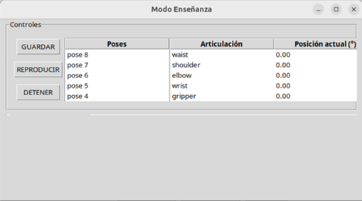
<br>
<b>Figura. Ventana de enseñanza. </b>
</p>

<p align="center">
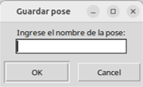
<br>
<b>Figura. Cuadro de diálogo para el nombre. </b>
</p>

Se solicita realizar un registro de mínimo ocho poses a las que llega el robot. Para ello se empleó un archivo .yaml donde se guardan estas poses y luego se consulta. Para la interfaz gráfica que gestiona esta sección, se emplearon tres botones y dos tablas. La primera es para visualizar los nombres de las poses disponibles y la segunda para mostrar el valor actual de las articulaciones, esto con el fin de comparar con los valores que se configuraron en las poses.

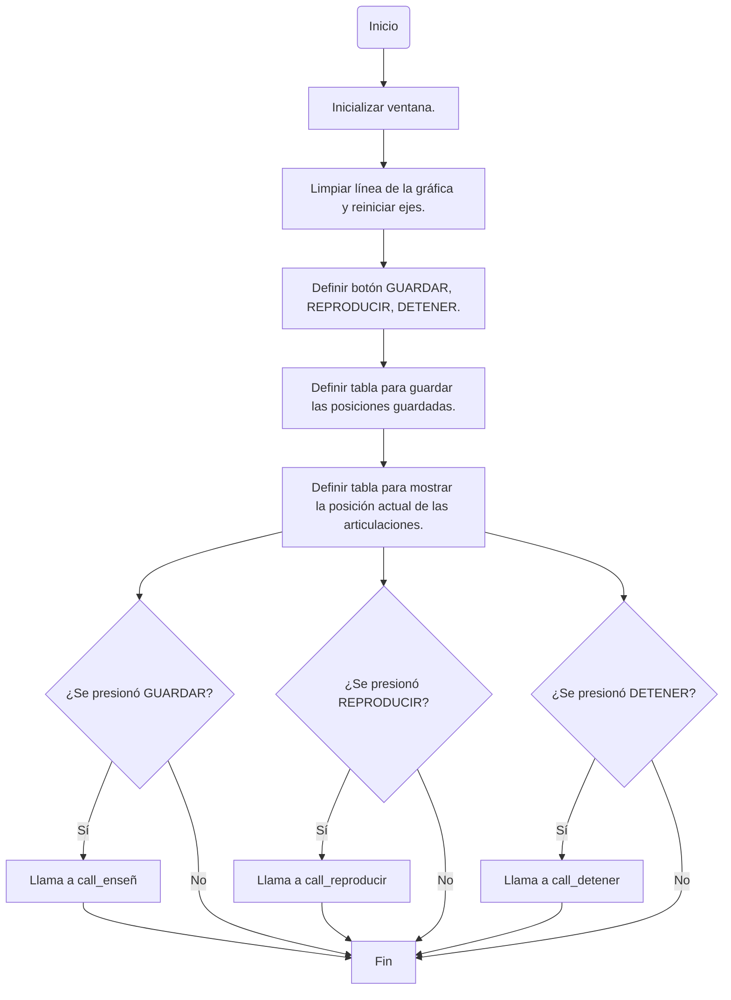
```mermaid
flowchart TB
    A("Inicio") --> B["Inicializar ventana."]
    B --> C["Limpiar línea de la gráfica y reiniciar ejes."]
    C --> D["Definir botón GUARDAR, REPRODUCIR, DETENER."]
    D --> E["Definir tabla para guardar las posiciones guardadas."]
    E --> F["Definir tabla para mostrar la posición actual de las articulaciones."]
    F --> J{"¿Se presionó GUARDAR?"}
    J -- Sí --> I["Llama a call_enseñ"]
    I --> W 
    J -- No ---> W["Fin"]
    F --> K{"¿Se presionó REPRODUCIR?"}
    K -- Sí --> M["Llama a call_reproducir"]
    M --> W 
    K -- No ---> W["Fin"]
    F --> L{"¿Se presionó DETENER?"}
    L -- Sí --> N["Llama a call_detener"]
    N --> W 

    L -- No ---> W["Fin"]
```
Al presionar el botón ENSEÑAR, se ejecuta el siguiente método. En este método se toman los valores actuales que tienen las articulaciones. Para completar con esta tarea se utiliza otra ventana emergente que se usa para escribir el nombre de la pose.
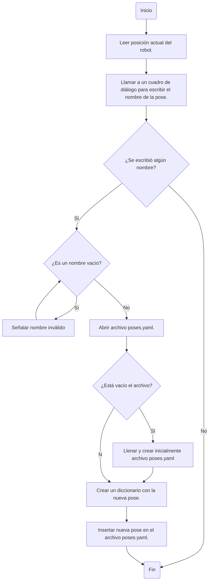
```mermaid
flowchart TB
    A("Inicio") --> B["Leer posición actual del robot."]
    B --> C["Llamar a un cuadro de diálogo para escribir el nombre de la pose."]
    C --> W{"¿Se escribió algún nombre?"}
    W -- No --> L(Fin)
    W -- Sí --> V{"¿Es un nombre vacío?"}
    V -- Sí --> N["Señalar nombre inválido"]
    N --> V 
    V -- No --> E["Abrir archivo poses.yaml."]
    E --> F{"¿Está vacío el archivo?"}
    F -- Sí --> M["Llenar y crear inicialmente archivo poses.yaml"]
    M --> G
    F -- No--> G["Crear un diccionario con la nueva pose."]
    G --> H["Insertar nueva pose en el archivo poses.yaml."]
    H --> L
```

Dada la complejidad de la tarea, fue necesario crear un método adicional que se emplea para estar actualizando la tabla de poses. Este método se llama cada vez que se hace el llamado a call_enseñ.

```text
    def actualizar_tabla_poses(self):
        # Borra todas las filas
        for fila in self.poses_table.get_children():
            self.poses_table.delete(fila)
        # Lee el archivo YAML
        with open(self.yaml_file, "r") as f:
            datos = yaml.safe_load(f)
        if datos is None:
            return
        # Inserta las poses
        for pose in datos["poses"]:
            self.poses_table.insert(
                "",
                "end",
                values=(pose["nombre"],)
        )
```

También se implementó un método que recorre todas las poses y se las envía al robot.

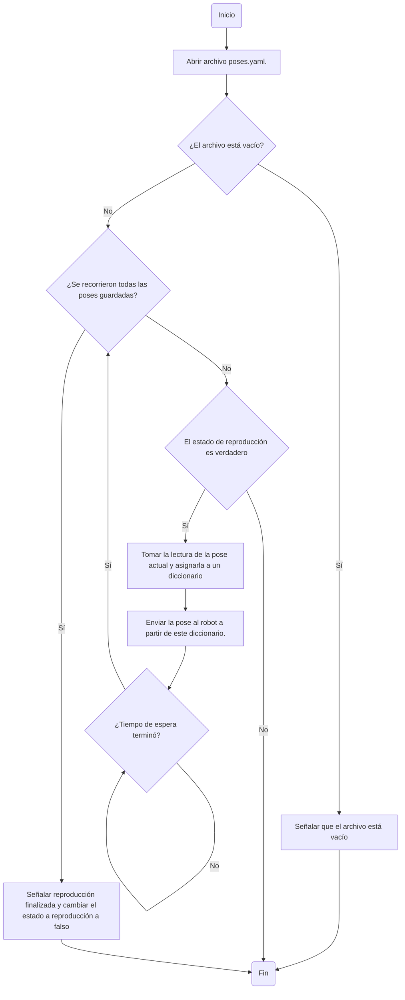
```mermaid
flowchart TB
    A("Inicio") --> B["Abrir archivo poses.yaml."]
    B --> W{"¿El archivo está vacío?"}
    W -- Sí --> V["Señalar que el archivo está vacío"]
    V ---> L(Fin)
    W -- No --> F{"¿Se recorrieron todas las poses guardadas?"}
    F -- Sí -------> M["Señalar reproducción finalizada y cambiar el estado a reproducción a falso"]
    F -- No --> X{"El estado de reproducción es verdadero"}
    X -- Sí --> Y["Tomar la lectura de la pose actual y asignarla a un diccionario"]
    Y --> Z["Enviar la pose al robot a partir de este diccionario."]
    Z --> U{"¿Tiempo de espera terminó?"}
    U -- No --> U
    U -- Sí --> F
    X -- No ----> L
    M --> L
```
Finalmente, se implementó un método para detener el movimiento.
```text
    def call_detener(self):
        self.reproduciendo = False
        self.status_var.set("Reproducción detenida.")
```

Ver el siguiente video donde se observa el funcionamiento de la enseñanza de las poses del robot:

[Actividad 13](https://www.youtube.com/watch?v=aECr74JU1NY)

---

# Actividad 14. Trazado de una figura

Se desarrolló una rutina para que el efector final describa un cuadrado en el espacio utilizando la cinemática inversa del robot. Primero se definen las cuatro esquinas de la figura en un espacio seguro y cada lado se discretiza en varios puntos mediante interpolación lineal. Para cada punto se calcula la configuración articular correspondiente con la función de cinemática inversa y posteriormente se envían los comandos al robot, permitiendo que el efector final siga la trayectoria de forma continua. Antes de iniciar el dibujo, el robot se posiciona en la primera esquina y realiza una pausa para garantizar un comienzo estable de la trayectoria.

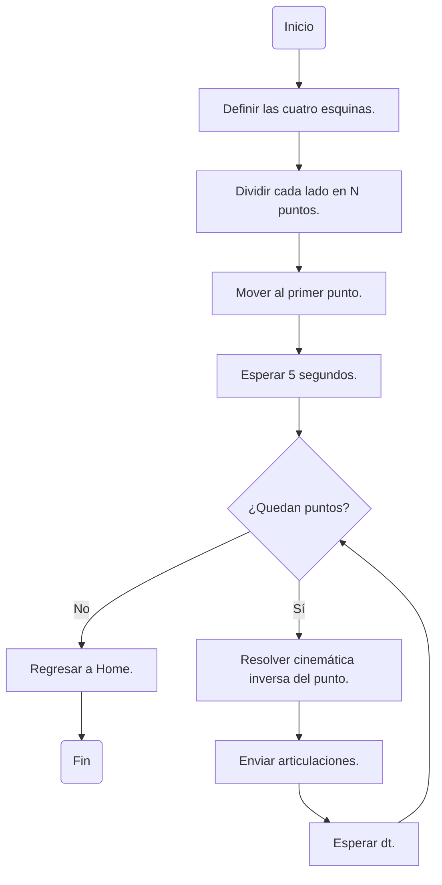
```mermaid
flowchart TB

A("Inicio")
-->B["Definir las cuatro esquinas."]
-->C["Dividir cada lado en N puntos."]
-->D["Mover al primer punto."]
-->E["Esperar 5 segundos."]

E --> F{"¿Quedan puntos?"}

F -- No --> G["Regresar a Home."]
G --> H("Fin")

F -- Sí --> I["Resolver cinemática inversa del punto."]
I --> J["Enviar articulaciones."]
J --> K["Esperar dt."]
K --> F
```

En el siguiente link puede observar el trazado de la figura en el robot físico:

[Actividad 14](https://www.youtube.com/watch?v=_px4V28vqHY)


# Actividad 15. Reto final: coreografía robótica

Finalmente, se selecciono la canción [PEDRO]( https://www.youtube.com/watch?v=OCZIzzQpJUw&list=RDOCZIzzQpJUw&start_radio=1) para la coreografía. Está cumpliendo con los requerimientos inicia y finaliza en una posición segura del robot. Durante su ejecución, la articulación de la base realiza movimientos periódicos, mientras que el hombro, el codo, la muñeca y la pinza ejecutan trayectorias senoidales sincronizadas, generando una secuencia fluida y coordinada. Todas las posiciones enviadas al manipulador respetan los límites articulares definidos en el modelo cinemático, garantizando una operación segura. La rutina tiene una duración superior a 45 segundos y, una vez iniciada desde la interfaz gráfica, se ejecuta de forma completamente automática hasta su finalización.


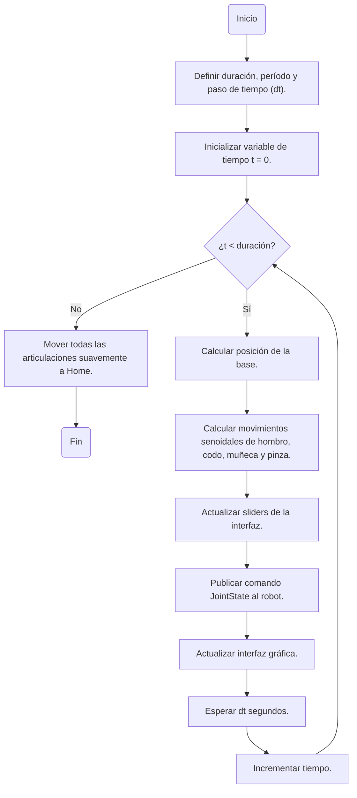
```mermaid
flowchart TB

A("Inicio") --> B["Definir duración, período y paso de tiempo (dt)."]
B --> C["Inicializar variable de tiempo t = 0."]
C --> D{"¿t < duración?"}

D -- No --> Z["Mover todas las articulaciones suavemente a Home."]
Z --> F("Fin")

D -- Sí --> G["Calcular posición de la base."]
G --> H["Calcular movimientos senoidales de hombro, codo, muñeca y pinza."]
H --> I["Actualizar sliders de la interfaz."]
I --> J["Publicar comando JointState al robot."]
J --> K["Actualizar interfaz gráfica."]
K --> L["Esperar dt segundos."]
L --> M["Incrementar tiempo."]
M --> D
```
## Video completo de la coreografía robótica

[Reto](https://www.youtube.com/watch?v=he_86dBtsZg)

[Reto_divertido](https://www.youtube.com/watch?v=9FHLh2G4z-g)

<div align="center">


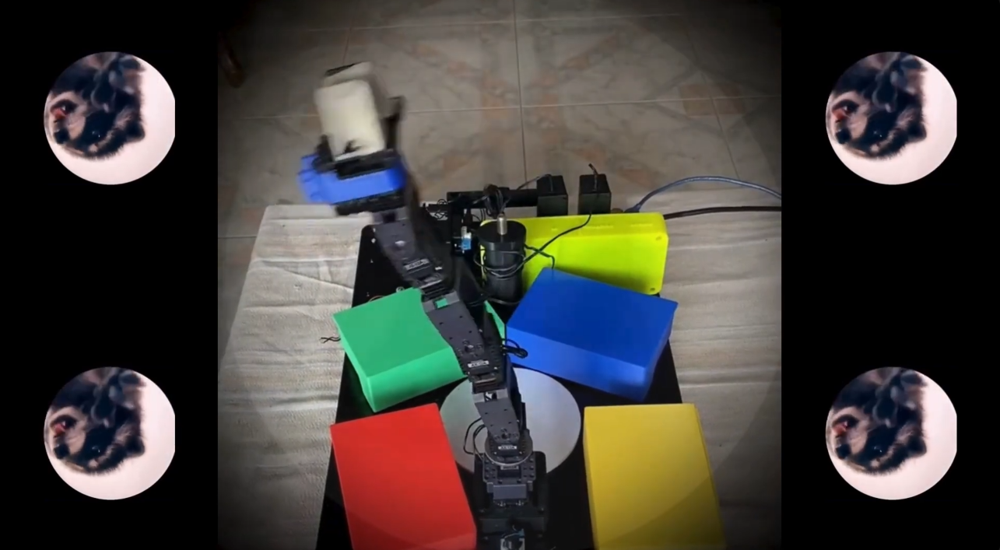<br>


</div>

---

# Plano de planta

---

# Conclusiones 

- Se complemento la interfaz gráfica en Python integrada con ROS 2 que permite controlar de forma intuitiva el robot PhantomX Pincher, incorporando funciones como el control manual de articulaciones, el modo enseñanza, la ejecución de secuencias almacenadas y rutinas automáticas de movimiento. 
- La implementación de la cinemática directa e inversa permitió validar el modelo cinemático del manipulador y controlar la posición del efector final a partir de coordenadas cartesianas, esto permitió reproducir figuras geométricas, como un cuadrado.
- Las pruebas realizadas tanto en simulación como en el robot físico permitieron identificar diferencias entre ambos entornos, relacionadas principalmente con la velocidad de ejecución, la suavidad de los movimientos y las limitaciones mecánicas del manipulador. Estas pruebas fueron fundamentales para ajustar las trayectorias y garantizar una ejecución estable sobre el sistema real. 


---

# Referencias

[1] LabSIR UN. “PhantomX Pincher X100 con ROS 2 Jazzy”. [Repositorio en GitHub]. Disponible en: https://github.com/labsir-un/06_Rob_2026_I_ROS2_Jazzy_PhantomX100_RVIZ. [Accedido: 11-jul-2026].

[2] Open Robotics. “Tutorials”. ROS 2 Documentation: Jazzy. [En línea]. Disponible en: https://docs.ros.org/en/jazzy/Tutorials.html. [Accedido: 28-jun-2026].

[3] Open Robotics. “Understanding topics” ROS 2 Documentation: Jazzy. [En línea]. Disponible en: https://docs.ros.org/en/jazzy/Tutorials/Beginner-CLI-Tools/Understanding-ROS2-Topics/Understanding-ROS2-Topics.html. [Accedido: 28-jun-2026].

[4] G. Farin, Curves and Surfaces for CAGD: A Practical Guide, 5th ed. San Francisco, CA, USA: Morgan Kaufmann, 2002.

[5] B. Siciliano, L. Sciavicco, L. Villani, and G. Oriolo, Robotics: Modelling, Planning and Control. London, UK: Springer-Verlag, 2009. Disponible en: https://www.researchgate.net/publication/257759823_Trajectory_Planning_in_Robotics

