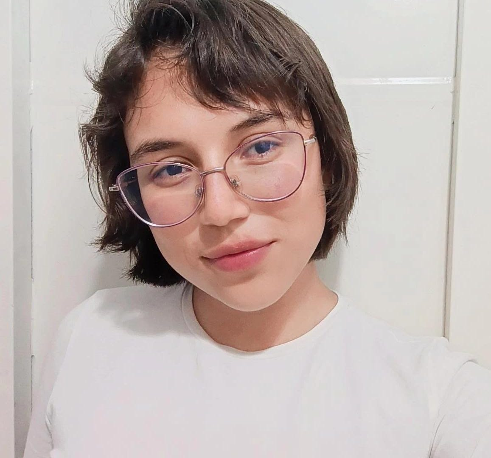
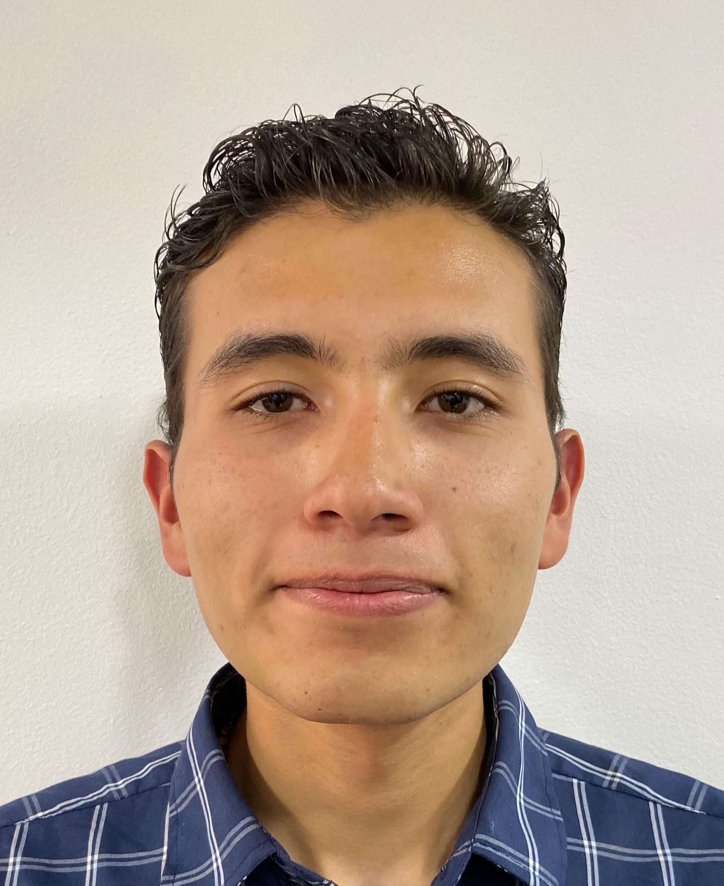

<picture>
    <source srcset="https://imgur.com/5bYAzsb.png" media="(prefers-color-scheme: dark)">
    <source srcset="https://imgur.com/Os03JoE.png" media="(prefers-color-scheme: light)">
    
</picture>

<h3>Curso de Robótica 2026-I</h3>

<h1>Compilado de Informes de Laboratorio de Robótica</h1>

<h2>Profesores:  Pedro Fabián Cárdenas Herrera   Manuel Felipe Carranza Montenegro</h2>

<h4>Paula Nicole Quiroga Romero  
    Jesus David Sanchez Cobos  
    David Steven Pinzón Hernández</h4>

  
  
  
  
  
  
  
  
  
  
  
  
  

---

## Descripción

Este repositorio corresponde al desarrollo de las actividades del curso de **Robótica 2026-I**.  
Aquí se documentan los laboratorios, avances, resultados y la presentación de los integrantes del equipo.

---

## Objetivos del repositorio

- Organizar el desarrollo de los laboratorios del curso.
- Documentar procedimientos, resultados y evidencias.
- Presentar formalmente a los integrantes del equipo.
- Mantener una estructura clara y ordenada para la evaluación.

---

## Integrantes del equipo

### Integrante 1

   

- **Nombre completo:** Paula Nicole Quiroga Romero
- **Carrera:** Ingeniería Mecatrónica
- **Correo institucional:** pquiroga@unal.edu.co
- **Usuario de GitHub:** [PaulaQ0](https://github.com/PaulaQ0)
- **Rol en el equipo:** Desarrollo de diagramas, programación, documentación.
- **Intereses:** Ingeniería biomédica, sensórica corporal, control y aplicaciones de inteligencia artificial.
- **Descripción breve:**  
  Me considero una persona comprometida, amable y bastante alegre. He trabajado en diversos proyectos académicos en los cuales he desarrollado habilidades de diseño, modelado, programación y su respectiva integración. Cuento también con habilidades comunicativas y suelo desarrollar buenas experiencias al trabajar en equipo, buena disposición para el trabajo y para el aprendizaje continuo.

---

### Integrante 2

   

- **Nombre completo:** Jesús David Sánchez Cobos
- **Carrera:** Ingeniería Mecatrónica
- **Correo institucional:** jesanchezco@unal.edu.co
- **Usuario de GitHub:** [Kovoz](https://github.com/Kovoz)
- **Rol en el equipo:** Ej. Modelado, redacción y edición de videos
- **Intereses:** Estudiante interesado en el diseño de sistemas mecatrónicos y la robótica de servicio, con especial motivación en la robótica bioinspirada. 
- **Descripción breve:**  
Me considero una persona con actitud positiva, dedicada y trabajadora. Además, destaco por mi atención a los detalles y mi compromiso para dar siempre lo mejor en cualquier proyecto o entorno. Poseo habilidades de liderazgo y trabajo en equipo, y me apasionan las matemáticas, la física, el diseño y la programación. 

---

### Integrante 3

   

- **Nombre completo:** David Steven Pinzón Hernández
- **Carrera:** Ingeniería Mecatrónica
- **Correo institucional:** dpinzonh@unal.edu.co
- **Usuario de GitHub:** [david-pi3141](https://github.com/david-pi3141)
- **Rol en el equipo:** Documentación, pruebas, programación
- **Intereses:** Robótica industrial, sistemas autónomos, visión de máquina, automatización industrial
- **Descripción breve:**  
  Me considero una persona atenta, reponsable y un poco curiosa. Tengo habilidades en el diseño CAD, programación y estoy aprendiendo acerca de temas relacionados con los microcontroladores. Se trabajar en equipo y estoy aprendiendo sobre liderazgo.
