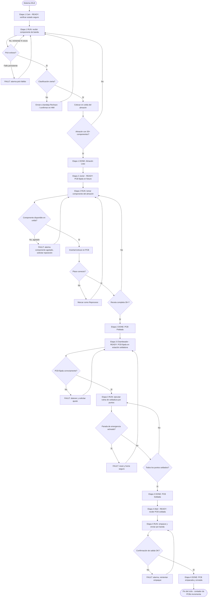
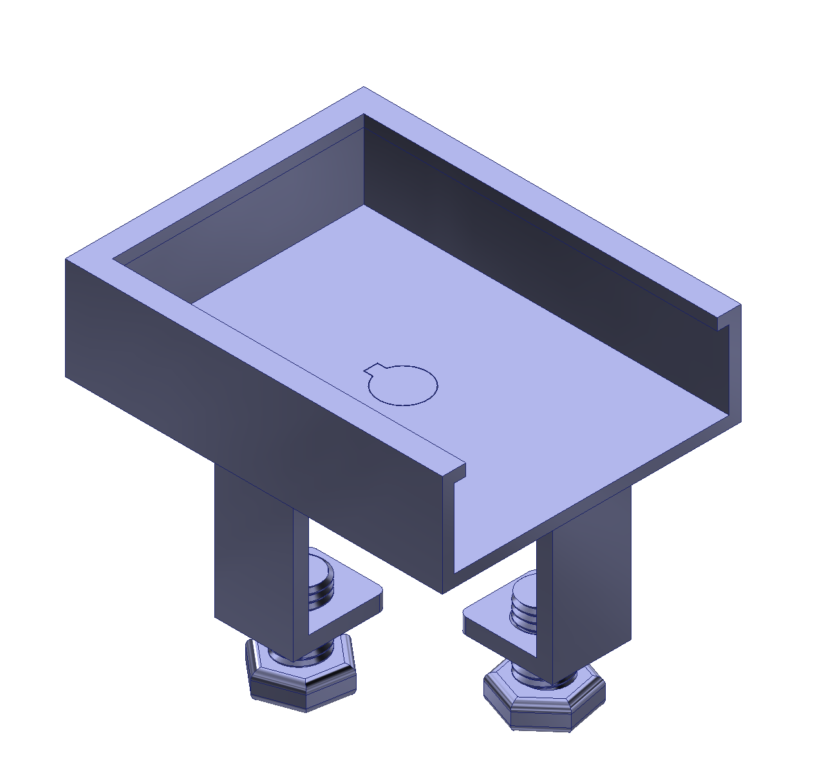
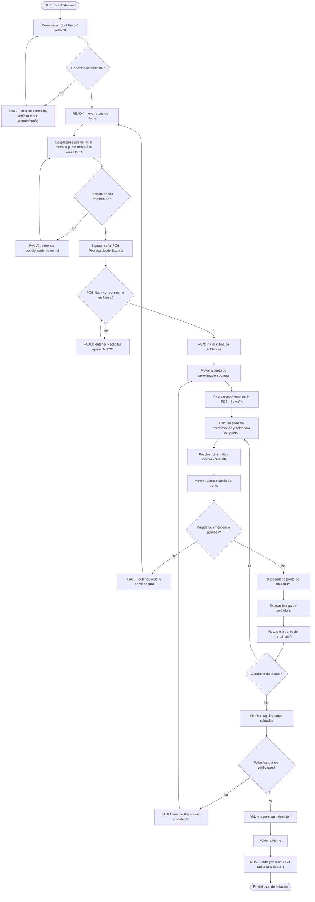

<div align="center">
  <picture>
    <source srcset="https://imgur.com/5bYAzsb.png" media="(prefers-color-scheme: dark)">
    <source srcset="https://imgur.com/Os03JoE.png" media="(prefers-color-scheme: light)">
    
  </picture>

  <h1>Proyecto Final- Robótica Industrial</h1>
  <h2>Automatización del Proceso de Soldadura de PCBs - Yaskawa Motoman MH6 “El Chambeador”.</h2>

  <p>
    <strong>Robótica - 2026-I</strong><br>
    Ingeniería Mecatrónica<br>
    Facultad de Ingeniería<br>
    Universidad Nacional de Colombia
  </p>
</div>


## Integrantes

* **Pablo de Jesus Arcila Mora**
* **Marco Alejandro Morales Pantoja**
* **Daniel Felipe Castro Galindo**
* **Juan Diego Sáenz Ardila**
* **Alejandra Sofia Monroy Socha**

## Introducción 
Este proyecto consistió en el diseño, implementación y validación de una rutina de soldadura sobre PCB utilizando un robot industrial ubicado en la Sala CAM, el Yaskawa Motoman MH6 alias “El Chambeador”; para este proyecto, la metodología empleada combinó simulación en RoboDK con ajustes empíricos de las posiciones articulares del robot, incorporando estrategias de cinemática directa e inversa para garantizar la precisión en los puntos de soldadura.

## 1. Diagrama de flujo del proceso global y por estación




## 2. Bitácora del desarrollo
Esta sesión tiene como finalidad el documentar el proceso, de manera cronológica, llevado a cabo durante el desarrollo e implementación de la rutina construida para que el Motoman "El Chambeador", fuese capaz de realizar la soldadura de PCB's

### Fase 1: Medición del área de trabajo
En la etapa inicial se realizó la medición del área de trabajo donde se instalaría la herramienta. Esta actividad permitió definir el espacio disponible, la ubicación de la PCB, la herramienta de sujeción para la PCB y para el Cautín y las zonas de aproximación necesarias para planear la trayectoria del robot.

<p align="center">
  
  <br>
  <em>Figura 1. Toma de medidas para la instalación de la herramienta.</em>
</p>

<p align="center">
  
  <br>
  <em>Figura 2. Definición pose de aproximación.</em>
</p>

<p align="center">
  
  <br>
  <em>Figura 3. Definición pose de soldadura.</em>
</p>


**Nota**:Durante la primera definición de las poses de aproximación y de soldadura, las configuraciones se establecieron con base en los valores reportados por el Teach Pendant, ver Figura 4. Sin embargo, al intentar replicar estas posiciones en RoboDK se evidenció que las distancias mostradas no corresponden directamente a medidas en grados o milésimas de grado, sino que requieren una conversión específica para su correcta interpretación en el entorno de simulación. Debido a esta limitación, fue necesario volver a tomar las posiciones articulares, sincronizando el manipulador físico con RoboDK para garantizar la correspondencia entre las configuraciones reales y las simuladas.
<p align="center">
  
  <br>
  <em>Figura 4. Posición articulaciones Teach Pedant.</em>
</p>


### Fase 2: Primera implementación del código
En la primera implementación se trabajó con unos targets definidos de manera arbitraria en RoboDK, con el propósito de verificar que las rutinas generadas tuvieran un comportamiento similar al requerido para una tarea de soldadura.

A partir de estos targets se construyó una rutina preliminar que permitió evaluar la viabilidad del movimiento general del robot y reconocer las primeras limitaciones entre la simulación y la ejecución real. ver [Version 1.0](./src/Codigo%20Rutina%20V1.0.py) 

### Fase 3: Segunda implementación del código
En la segunda implementación se comenzó a trabajar directamente con posiciones articulares. Inicialmente, la lógica del programa consistía en que, a partir de la pose de la PCB, el robot se desplazara primero a una pose de aproximación y posteriormente a la pose de la PCB, donde una vez alcanzada esta referencia, el sistema realizaba el desplazamiento hacia los puntos específicos donde debían ejecutarse los puntos de soldadura.

Durante esta fase también fue necesario ajustar las posiciones articulares en laboratorio, teniendo en cuenta tanto las modificaciones realizadas en la herramienta como la correspondencia entre las poses obtenidas en RoboDK y las posiciones reales del robot. ver [Version 2.0](./src/Codigo%20Rutina%20V2.0.py)

### Fase 4: Tercera implementación del código
En la tercera implementación se adoptó una estrategia más robusta desde el punto de vista geométrico y cinemático, donde, primero se almacenó la pose de referencia de donde va ubicada la PCB y, mediante funciones nativas de Robodk que permiten la cinemática directa, se transformó en coordenadas cartesianas, para luego, a partir de dichas coordenadas, se aplicaron traslaciones para obtener las posiciones cartesianas asociadas a cada punto de soldadura; finalmente, sobre estas nuevas posiciones cartesianas se aplicó cinemática inversa (funcion nativa de Robodk) para calcular los posicionamientos articulares requeridos y así permitir que el robot alcanzara de forma controlada los diferentes puntos de soldadura.
```python
...
#implementación de Cinematica Directa
pose_pcb = robot.SolveFK(PCB) # SolveFK permite realizar la cinematica directa
...
#Implementación de Cinematica inversa
pose_sold = pose_pcb * transl(x, y, z_soldadura)
joints_sold = robot.SolveIK(pose_sold) # SolveIK permite realizar la cinematica inversa
```
**Nota:** los fragmentos de cogido mostrados anteriormente corresponden a ejemplos de como implementar estas funciones en Python mediante la API de Robodk. El código final implementado se describe mas adelante. 

### Limitaciones durante las pruebas
Uno de los factores que afectó de manera importante el desarrollo del proyecto fue la limitación asociada a la licencia de RoboDK. Estas restricciones generaron demoras en los tiempos de prueba, ya que el proceso de reinstalar el programa para conectar con el manipulador real resultó tedioso. Además, no fue posible incorporar adecuadamente el eje número 7, correspondiente al eje lineal. Como consecuencia, no siempre se podía desplazar el robot exactamente hasta la posición requerida dentro del riel.

Para compensar esta ultima limitación, el robot se llevaba manualmente a una posición aproximada usando como referencia una marca establecida sobre el riel. Sin embargo, esta aproximación no garantizaba precisión absoluta, por lo que en diferentes jornadas de laboratorio fue necesario reajustar la ubicación del área de trabajo y reposicionar la váquela para obtener resultados aceptables.

### Problemas observados en el proyecto
Los principales problemas identificados estuvieron relacionados con la acumulación de errores. Entre ellos se destacan:
- Error en la posición del eje lineal.
- Variaciones en el posicionamiento de la PCB.
- Tolerancias mecánicas y de montaje asociadas a la herramienta de soldadura y a la base para la váquela.

Debido a la suma de estos factores, al repetir una misma prueba los puntos alcanzados por el robot no siempre coincidían exactamente, aun cuando la rutina ejecutada fuera nominalmente la misma.

### Resultado obtenido
A pesar de las dificultades presentadas durante la implementación, en el resultado final se logró un comportamiento satisfactorio en laboratorio. En particular, durante tres repeticiones consecutivas se obtuvieron resultados muy similares entre sí y cercanos al comportamiento esperado para la operación de soldadura sobre la PCB.

Este resultado permitió validar la metodología de ajuste progresivo del programa y evidenció que, aunque existían limitaciones mecánicas y de posicionamiento, la estrategia final de trabajo ofrecía una base funcional para la ejecución de la tarea.


## 3.Diseño del gripper y del workobject

Para la Etapa 3 del proyecto se diseñó una herramienta terminal para el robot Yaskawa Motoman MH6, denominado **“El Chambeador”**, cuya función es sostener el cautín y permitir la ejecución controlada de los puntos de soldadura sobre la PCB.

La herramienta se dividió en dos componentes principales: una **base de fijación** y un **cuerpo tubular portacautín**, donde esta configuración modular facilita la fabricación mediante impresión 3D, el montaje del cautín y el reemplazo independiente de cualquiera de las piezas.

<p align="center">
  
  <br>
  <em>Figura 5. Base de fijación y sistema de acople de la herramienta.</em>
</p>
La base incorpora los orificios necesarios para su sujeción al sistema de montaje del robot. En su parte frontal se diseñó un alojamiento circular con ranuras que recibe las pestañas del cuerpo portacautín.

<p align="center">
  
  <br>
  <em>Figura 6. Cuerpo tubular encargado de alojar y sujetar el cautín.</em>
</p>

### Sistema de acople

La unión entre las dos piezas funciona mediante un mecanismo de acople por inserción y giro, similar a un cierre de bayoneta. Para ensamblar la herramienta, las pestañas del cuerpo tubular se alinean con las ranuras de la base, se introduce la pieza y posteriormente se realiza un giro hasta alcanzar la posición de bloqueo.

Este sistema permite montar y desmontar rápidamente el cautín sin retirar toda la base del robot. Además, restringe el desplazamiento axial accidental durante la rutina y ayuda a conservar una posición definida de la herramienta con respecto al TCP programado.

### Compensación axial mediante resorte

Entre el cautín y su superficie de apoyo se instaló un resorte que proporciona **compliancia axial pasiva**. Cuando la punta entra en contacto con el punto de soldadura, el cautín puede desplazarse ligeramente en dirección longitudinal en lugar de transmitir toda la fuerza directamente a la PCB.

Esta solución permite:

- Compensar pequeñas variaciones en la altura o planitud de la PCB.
- Absorber errores menores de posicionamiento y calibración del robot.
- Reducir el riesgo de aplicar una fuerza excesiva sobre las pistas, terminales o componentes.
- Evitar impactos rígidos que puedan deteriorar la punta del cautín.
- Mantener un contacto más uniforme durante el tiempo programado de soldadura.

La rigidez y la precarga del resorte deben ajustarse de manera que exista suficiente fuerza para conservar el contacto térmico, sin producir una carga que pueda deformar o dañar la tarjeta.

### Justificación del diseño

El diseño modular y el sistema de compensación axial permiten utilizar un cautín convencional como herramienta terminal para realizar pruebas de soldadura robotizada, donde la fabricación por manufactura aditiva hizo posible obtener rápidamente una geometría adaptada tanto al sistema de montaje del robot como al diámetro del cautín, reduciendo el costo y el tiempo de fabricación del prototipo.

En el caso de la modularidad de la herramienta, la separación en dos piezas también mejora el acceso durante el ensamblaje y facilita las operaciones de mantenimiento, y a su vez, permite que en caso de desgaste, deformación o cambio del cautín, el cuerpo portacautín puede sustituirse sin fabricar nuevamente la base completa.

### Recomendaciones de uso y mejora

Debido a que la herramienta fue fabricada mediante impresión 3D en PLA, se recomienda emplearla principalmente en **pruebas controladas y rutinas de soldadura de corta duración**, esto debido a que la zona frontal, al encontrarse más próxima al elemento calefactor, ante tiempos prolongados acumula calor, llegando a sufrir ablandamiento o deformación progresiva.

Para aumentar la seguridad y la vida útil del sistema se recomienda:

- Evitar el contacto directo entre la parte caliente del cautín y las piezas impresas.
- Incorporar un escudo térmico delgado de acero inoxidable, separado del polímero.
- Añadir una arandela o buje aislante de mica, cerámica u otro material resistente a altas temperaturas.
- Realizar pausas de enfriamiento entre ciclos prolongados.
- Inspeccionar periódicamente el acople, las pestañas y la zona frontal para detectar deformaciones.
- Para una operación repetitiva o continua, sustituir la sección más cercana al calor por un inserto metálico o fabricar esa zona con un material de mayor resistencia térmica.

Estas mejoras permitirían reducir la transferencia de calor por conducción y radiación hacia las piezas impresas, manteniendo la precisión del montaje y disminuyendo el riesgo de que la herramienta pierda su geometría durante la operación.

### Diseño del workobject

Como complemento al diseño de la herramienta terminal, se desarrolló un **workobject** para sostener la placa de baquela (PCB) durante el proceso de soldadura. Este accesorio surgió debido a la necesidad de mantener la tarjeta fija y en una posición repetible, garantizando que el robot ejecutara la trayectoria programada sobre los puntos de soldadura correctos.

El soporte está conformado por una bandeja rectangular con bordes elevados que facilita el posicionamiento de la PCB. Además, incorpora dos patas roscadas con tuercas hexagonales que permiten ajustar la altura y nivelar el conjunto antes de iniciar la operación. En la parte central se incluyó un orificio pasante que puede emplearse como punto de referencia o de fijación, dependiendo de los requerimientos del montaje.

<p align="center">
  
</p>

#### Justificación del diseño

La incorporación de este workobject fue necesaria para asegurar la estabilidad de la PCB durante todo el proceso de soldadura. Un soporte rígido y nivelado reduce las variaciones en la posición de la tarjeta, mejorando la repetibilidad de la trayectoria del robot y disminuyendo errores ocasionados por diferencias de altura o movimientos de la pieza.

Al igual que la herramienta terminal, este accesorio fue fabricado mediante impresión 3D, permitiendo obtener un prototipo funcional de bajo costo y fácil fabricación. Además, el sistema de nivelación facilita su adaptación a diferentes superficies de trabajo y simplifica el proceso de calibración antes de cada rutina de soldadura.


## 4. Simulación desde RoboDK

En la etapa de simulación, una vez desarrollado el código de control, se procedió a su verificación en el entorno de RoboDK. En esta fase se ejecutaron múltiples pruebas para observar el comportamiento del manipulador y ajustar la trayectoria hasta obtener un movimiento coherente con la tarea de soldadura propuesta. La simulación completa puede evidenciarse en el siguiente video, donde se aprecia la secuencia de aproximación, posicionamiento sobre la PCB y ejecución de los puntos de soldadura.

<div align="center">
  <a href="https://www.youtube.com/watch?v=NdinlWy5ti0&t=1508s" target="_blank" rel="noopener noreferrer">
    
  </a>
</div>
<p align="center">
  <a href="https://www.youtube.com/watch?v=NdinlWy5ti0&t=1508s">
    Ver simulación desde RoboDK
  </a>
</p>


## 5. Descripción del código implementado en el laboratorio para la soldadura

El programa en Python puede consultarse aquí:
[Ver código](src/Codigo_Implementacio_Robot.py)
 
Este programa conecta con el robot físico a través de RoboDK y ejecuta una rutina automática de soldadura sobre una PCB (placas de circuito impreso), calculando cada punto a partir de transformaciones locales respecto a una pose de referencia. A continuación se explican las funciones y parámetros nuevos vistos.
 
### 5.1 Importación de librerías
Además de robolink y robomath (comunicación con RoboDK y funciones matemáticas), se importa la librería time, que permite generar pausas controladas durante la ejecución, por ejemplo mientras el robot se estabiliza en una posición o mientras dura la soldadura.
```python
from robodk.robolink import *
from robodk.robomath import *
import time
```
 
### 5.2 Conexión a RoboDK y al robot físico
Se selecciona el robot desde la estación de RoboDK y se valida que la selección sea correcta con `robot.Valid()`. Después se intenta la conexión con el controlador físico mediante `robot.Connect()` y se confirma el estado con `robot.ConnectedState()` (ambas devuelven `True` o `False`). Si alguna comprobación falla, el programa se detiene lanzando una excepción con un mensaje descriptivo, en lugar de continuar con un robot no disponible.
```python
robot = RDK.ItemUserPick("Selecciona un robot", ITEM_TYPE_ROBOT)
if not robot.Valid():
    raise Exception("No se ha seleccionado un robot válido.")
 
if not robot.Connect():
    raise Exception("No se pudo conectar al robot. Verifica que esté en modo remoto y que la configuración sea correcta.")
 
if not robot.ConnectedState():
    raise Exception("El robot no está conectado correctamente. Revisa la conexión.")
```
 
### 5.3 Parámetros de movimiento y posiciones articulares
Se define la velocidad y la tolerancia (rounding) del movimiento, y se guardan las posiciones clave del robot como arreglos de 6 valores articulares, uno por cada eje: `Home` (posición de reposo), `aprox` (punto de aproximación seguro) y `PCB` (punto de referencia sobre la placa).
```python
robot.setSpeed(50)
robot.setRounding(5)
 
Home  = [0, 0, 0, 0, 0, 0]
aprox = [-88.98, 56.72, 27.52, 4.1, 11.93, 4.62]
PCB   = [-88.02, 62.59, 33.77, 3.8, 11.48, 3.8]
```
 
### 5.4 Parámetros de soldadura
Estas variables configuran la geometría y el tiempo de la rutina: la altura de soldadura, la altura de aproximación (más alta, para evitar colisiones al desplazarse entre puntos), el tiempo que el robot permanece soldando cada punto, el paso entre orificios de la placa (`pitch`, en milímetros) y el número de PCB que se van a procesar en la misma ejecución.
```python
z_soldadura = 4
z_aproximacion = -10
tiempo_soldadura = 10
pitch = 2.54
Numero_de_PCB = 1
```
 
### 5.5 Puntos de soldadura en el plano local de la PCB
Los puntos a soldar se definen como coordenadas (x, y) en el plano local de la placa, expresadas en múltiplos de `pitch`. Esto permite ubicar cada punto según la cuadrícula de orificios de la PCB, sin depender de su posición global dentro de la estación.
```python
puntos_soldadura = [
    (3*pitch, 7*pitch), (4*pitch, 8*pitch), (3*pitch, 9*pitch),
    (4*pitch, 9*pitch), (3*pitch, 8*pitch), (4*pitch, 7*pitch)
]
```
 
### 5.6 Obtención de la pose de referencia (cinemática directa)
El robot se mueve primero al punto de aproximación. Luego, con `SolveFK`, se calcula la pose cartesiana (posición y orientación) correspondiente a las articulaciones descritas en el arreglo  `PCB`, sin necesidad de mover físicamente el robot hasta ese punto. Esta pose (`pose_pcb`) se usa como referencia para ubicar todos los puntos de soldadura.
```python
robot.MoveJ(aprox)
time.sleep(2)
 
pose_pcb = robot.SolveFK(PCB)
```
 
### 5.7 Rutina de soldadura: transformación de puntos y cinemática inversa
Para cada punto de la lista, se calculan dos poses a partir de `pose_pcb` usando `transl(x, y, z)`, que aplica una traslación local sobre esa pose de referencia: una a la altura de aproximación (segura) y otra a la altura de soldadura. Con `SolveIK` se obtienen los valores articulares correspondientes a cada pose, y el robot se desplaza primero al punto de aproximación, desciende al punto de soldadura, espera el tiempo definido en `tiempo_soldadura`, y se retira nuevamente al punto de aproximación antes de continuar con el siguiente punto. Al terminar todos los puntos de una PCB, el robot vuelve al target de aproximación antes de procesar la siguiente placa (si `Numero_de_PCB` > 1).
```python
for j in range(Numero_de_PCB):
    for i, (x, y) in enumerate(puntos_soldadura, start=1):
 
        pose_aprox = pose_pcb * transl(x, y, z_aproximacion)
        pose_sold  = pose_pcb * transl(x, y, z_soldadura)
 
        joints_aprox = robot.SolveIK(pose_aprox)
        joints_sold  = robot.SolveIK(pose_sold)
 
        robot.MoveJ(joints_aprox)
        robot.MoveJ(joints_sold)
        time.sleep(tiempo_soldadura)
        robot.MoveJ(joints_aprox)
 
    robot.MoveJ(aprox)
    time.sleep(3)
```
 
### 5.8 Retorno a posición de home
Una vez completadas todas las PCB configuradas, el robot regresa a la posición de home (todas las articulaciones en 0°) y se imprime un mensaje confirmando que la rutina terminó.
```python
robot.MoveJ(Home)
print("PCB's Completadas")
```
<div align="center">
  <a href="https://www.youtube.com/watch?v=NdinlWy5ti0&t=1095s" target="_blank" rel="noopener noreferrer">
    
  </a>
</div>

<p align="center">
  <a href="https://www.youtube.com/watch?v=NdinlWy5ti0&t=1095s" target="_blank" rel="noopener noreferrer">
    Ver implementacion
  </a>
</p>

## 6. Código interfaz gráfica HMI
La interfaz HMI fue desarrollada en *Python* utilizando las librerías *tkinter* y *ttk* para la construcción de la interfaz gráfica, *messagebox* para la gestión de mensajes, *threading* para la ejecución concurrente de la rutina de soldadura, time para la temporización del proceso, y las librerías *robolink* y *robomath* de RoboDK para la comunicación con el entorno de simulación y el manejo de operaciones cinemáticas. La interfaz permite seleccionar distintas recetas de PCB, visualizar la lista de componentes y los puntos de soldadura asociados, configurar parámetros del proceso como el pitch y el tiempo de soldadura, y ejecutar acciones como conectar RoboDK, cargar el robot, moverlo a home, desplazarlo a la pose de aproximación, validar puntos, iniciar la soldadura, pausar, detener, ejecutar una parada de emergencia y reiniciar el sistema.
<p align="center">
  
  <br>
  <em>Figura 7. Interfaz HMI de la estación de soldadura.</em>
</p>
Entre las funciones implementadas en el codigo de la interfaz HMI podemos recalcar:

### 6.1. Conexión con RoboDK
```python
def conectar_robodk(self):
    try:
        self.RDK = Robolink()
        self.estado.set("READY")
        self.alarma.set("Sin fallas")
        self.escribir_log("Conexión con RoboDK establecida.")
    except Exception as e:
        self.estado.set("FAULT")
        self.alarma.set(str(e))
```

Esta función establece la comunicación entre la interfaz HMI y RoboDK.

### 6.2. Validación de puntos
```python
def validar_puntos(self):
    try:
        if not self.robot:
            raise Exception("Primero carga el robot.")
        pose_pcb = self.robot.SolveFK(self.pcb)

        for i, (x, y, ref, pin) in enumerate(self.obtener_puntos_mm(), start=1):
            pose1 = pose_pcb * transl(x, y, -10)
            pose2 = pose_pcb * transl(x, y, 1)
            j1 = self.robot.SolveIK(pose1)
            j2 = self.robot.SolveIK(pose2)
            if j1 is None or j2 is None:
                raise Exception(f"Error en punto {i}: {ref}")

        self.estado.set("READY")
        self.alarma.set("Puntos válidos")
        self.escribir_log("Todos los puntos fueron validados.")
    except Exception as e:
        self.estado.set("FAULT")
        self.alarma.set(str(e))
        self.escribir_log(f"Validación fallida: {e}")
```

Esta función valida la alcanzabilidad de los puntos de soldadura mediante cinemática directa e inversa.

### 6.3. Ejecución en hilo independiente
```python
def iniciar_hilo(self):
    if self.hilo_soldadura and self.hilo_soldadura.is_alive():
        self.escribir_log("La rutina ya está en ejecución.")
        return

    self.stop_event.clear()
    self.proceso_detenido = False
    self.proceso_pausado = False
    self.emergencia = False

    self.hilo_soldadura = threading.Thread(
        target=self.rutina_soldadura,
        daemon=True
    )
    self.hilo_soldadura.start()
    self.escribir_log("Hilo de soldadura iniciado.")
```

Esta función permite ejecutar la rutina sin bloquear la interfaz gráfica.

### 6.4. Parada de emergencia
```python
def parada_emergencia(self):
    self.emergencia = True
    self.proceso_detenido = True
    self.stop_event.set()
    self.estado.set("EMERGENCY")
    self.alarma.set("Parada de emergencia activada.")
    self.escribir_log("Emergencia activada.")
    try:
        if self.robot:
            self.robot.Stop()
    except:
        pass
```

Esta función implementa la lógica de seguridad para detener el proceso de forma inmediata.

El código completo del programa en Python puede consultarse aquí:
[Ver código](src/HMI_Simulacion.py)

El siguiente video sirve para mirar a detalle la funcionalidad de la interfaz HMI
<div align="center">
  <a href="https://youtu.be/NdinlWy5ti0?t=486" target="_blank" rel="noopener noreferrer">
    
  </a>
</div>
<p align="center">
  <a href="https://youtu.be/NdinlWy5ti0?t=486">
    Ver simulación implementación de la interfaz HMI
  </a>
</p>


## 7. Comparación manual vs automatizado

Durante la etapa de implementación se realizaron diversas pruebas de soldadura con el fin de evaluar el comportamiento del sistema automatizado frente a una soldadura manual. Estas pruebas permitieron evidenciar las limitaciones asociadas a los errores de aproximación, las tolerancias mecánicas del sistema y la dificultad para fijar de manera completamente estable el riel y la posición de la PCB. Como resultado, las primeras pruebas no alcanzaron la precisión esperada, por lo que las imágenes correspondientes a estos ensayos se muestran a continuación.

<div align="center">
  
  <p><em>Figura 8. Pruebas de soldadura durante la etapa de implementación.</em></p>
</div>

En la implementación final, antes de activar el cautín, se ejecutó una aproximación preliminar para verificar que los puntos de soldadura coincidieran correctamente con la punta de la herramienta. Una vez validada esta alineación, se encendió el cautín y se procedió con la soldadura de la PCB, registrando el proceso en video. Esta estrategia permitió corregir parcialmente los errores de posicionamiento y mejorar la consistencia del resultado final.
<div align="center">
  
  <p><em>Figura 9. Soldadura Final.</em></p>
</div>

En comparación, la soldadura manual mostró mejores resultados en términos de precisión puntual durante las primeras pruebas, principalmente porque no estaba sujeta a los errores acumulados del sistema de posicionamiento. Sin embargo, la automatización ofrece una ventaja importante a largo plazo: permite repetir el proceso bajo las mismas condiciones y con mayor uniformidad, especialmente en escenarios de producción repetitiva de múltiples PCBs.

Las principales fuentes de error observadas en la etapa automatizada fueron:
- Los defases de aproximación del robot.
- La falta de fijación absoluta del riel y de la mesa de trabajo.
- El desgaste de la punta del cautín.
- La dificultad para manipular la pasta de soldadura con la herramienta disponible.

Aun así, se considera que con mejoras en el sistema mecánico y en el control de la trayectoria, la automatización puede superar la consistencia de la soldadura manual en tareas repetitivas.

### 7.1. Recomendaciones y mejoras futuras
Como trabajo futuro se recomienda:
- Implementar un software que permita incorporar un eje adicional sin depender de restricciones de licencia.
- Mejorar la precisión del sistema de posicionamiento del riel para reducir errores acumulados.
- Optimizar la fijación de la PCB y del área de trabajo para minimizar desplazamientos durante la ejecución.
  
## 8. Diagrama de flujo de acciones del robot



## 9. Plano de planta de la ubicación de cada uno de los elementos
A continuación se presenta el plano de planta del montaje general del proyecto final, donde se muestra la disposición del riel, el robot, la extremidad extra, la mesa y el soporte para baquela. 

<p align="center">
  
</p>

## 10. Vídeo de simulación y de implementación 

<div align="center">
  <a href="https://www.youtube.com/watch?v=NdinlWy5ti0">
    
  </a>
</div>

<p align="center">
  <a href="https://www.youtube.com/watch?v=NdinlWy5ti0">
    Ver video completo en YouTube
  </a>
</p>
