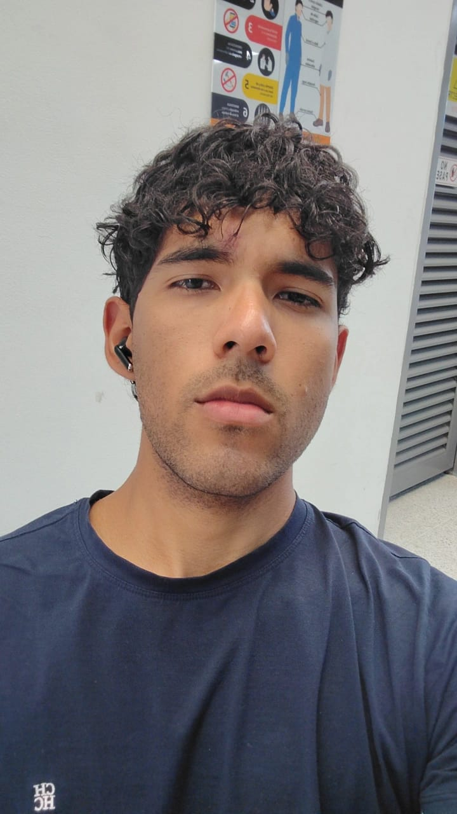
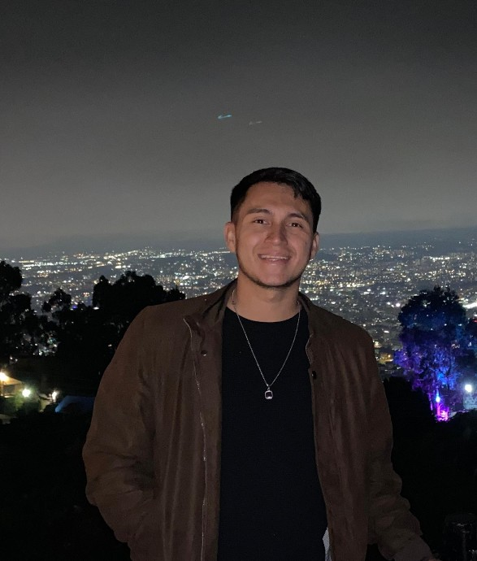

<picture>
    <source srcset="https://imgur.com/5bYAzsb.png" media="(prefers-color-scheme: dark)">
    <source srcset="https://imgur.com/Os03JoE.png" media="(prefers-color-scheme: light)">
    
</picture>

<h3>Curso de Robótica 2026-I</h3>

<h1>Compilado de Informes de Laboratorio de Robótica</h1>

<h2>Profesores:  Pedro Fabián Cárdenas Herrera   Manuel Felipe Carranza Montenegro</h2>

<h4>Pablo De Jesus Arcila Mora 
    Marco Alejandro Morales Pantoja 
    Daniel Felipe Castro Galindo</h4>

  
  
  
  
  
  
  
  
  
  
  
  
  

---

## Descripción

Este repositorio corresponde al desarrollo de las actividades del curso de **Robótica 2026-I**.  
Aquí se documentan los laboratorios, avances, resultados y la presentación de los integrantes del equipo.

---

## Objetivos del repositorio

- Organizar el desarrollo de los laboratorios del curso.
- Documentar procedimientos, resultados y evidencias.
- Presentar formalmente a los integrantes del equipo.
- Mantener una estructura clara y ordenada para la evaluación.

---

## Integrantes del equipo

### Integrante 1

   

- **Nombre completo:** Pablo De Jesus Arcila Mora
- **Carrera:** Ingeniería Mecatrónica
- **Correo institucional:** parcilam@unal.edu.co
- **Usuario de GitHub:** [Kreiop](https://github.com/Kreiop)
- **Rol en el equipo:** Programación y simulación
- **Intereses:** Automatización, IA, Robótica Colaborativa
- **Descripción breve:**  
  Estudiante de Ingeniería Mecatrónica con formación práctica en automatización industrial, motion control, sistemas de mando eléctrico y neumática. Experiencia en programación de PLCs (Siemens y Allen-Bradley), microcontroladores y entornos de simulación industrial. Interesado en el área de automatización, robótica y sistemas de control.

---

### Integrante 2

   

- **Nombre completo:** Marco Alejandro Morales Pantoja
- **Carrera:** Ingeniería Mecatrónica
- **Correo institucional:** mmoralespa@unal.edu.co
- **Usuario de GitHub:** [@Mamp](https://github.com/mmoralespa-cyber)
- **Rol en el equipo:** Modelado 3D, pruebas y simulación
- **Intereses:** Automatización industrial, PLC Siemens y Rockwell, sistemas SCADA, diseño mecánico, electrónica, simulación y desarrollo de proyectos tecnológicos.
- **Descripción breve:**  
  Soy estudiante de Ingeniería Mecatrónica, con interés en automatización industrial, diseño y desarrollo de soluciones tecnológicas que integren la parte mecánica, electrónica y de control. Tengo afinidad con herramientas y entornos relacionados con PLC Siemens, PLC Rockwell y sistemas SCADA, además de experiencia en modelado 3D, simulación y pruebas. También me interesa apoyar procesos de aprendizaje por medio de tutorías en áreas afines a la ingeniería. Me considero una persona responsable, proactiva y con buena disposición para aprender, trabajar en equipo y aportar en el desarrollo de proyectos.

---

### Integrante 3

   

- **Nombre completo:** Daniel Felipe Castro Galindo
- **Carrera:** Ingeniería Mecatrónica
- **Correo institucional:** dancastroga@unal.edu.co
- **Usuario de GitHub:** [DanielCastro-02](https://github.com/DanielCastro-02)
- **Rol en el equipo:** Documentación, pruebas, modelado 3D
- **Intereses:** Robótica industrial, Robótica Movil, integración de hardware y software
- **Descripción breve:**  
Estudiante de Ingeniería Mecatrónica con un gran interés en la electrónica y en el uso de diversas herramientas de diseño para el desarrollo de sistemas tecnológicos y me apasiona la robótica, la electrónica aplicada y la integración hardware-software. Cuento con la experiencia en la programacion de diferentes tipos de microcontroladores y tarjetas de desarrollo, asi como tambien en el diseño de PCB, programación de PLC, diseño de controladores, dado a que durante mi trayecto por la Universidad he desarrollado proyectos que han involucrado el desarrollo de prototipos y soluciones funcionales que resuelvan problemáticas.
