<div align="center">


<a href="https://docs.ros.org/en/jazzy/"></a>
<a href="https://www.python.org/"></a>
<a href="https://emanual.robotis.com/docs/en/dxl/ax/ax-12a/"></a>
<a href="./LICENSE"></a>

</div>

---

<div align="center">

```
╔══════════════════════════════════════════════════════════════════════╗
║        Control y Calibración del Robot Phantom X Pincher X100         ║
║   Cinemática · Trayectorias · Enseñanza y Repetición · Coreografía    ║
╚══════════════════════════════════════════════════════════════════════╝
```

</div>

> **Resumen del laboratorio:** Práctica de laboratorio del curso *Robótica 2026-I* en la que se controla el manipulador Phantom X Pincher X100 mediante ROS 2 Jazzy Jalisco, integrando movimiento articular individual, calibración de cero, movimiento simultáneo y secuencial, interpolación de trayectorias, trayectoria sinusoidal, cinemática directa e inversa, un modo de enseñanza y repetición de poses, trazado de figuras y una coreografía robótica sincronizada con audio. El control se implementa mediante nodos propios en ROS 2 que se comunican con el nodo controlador `pincher_controller` a través de tópicos y servicios, sin depender de herramientas externas de teleoperación.

---

## Tabla de contenido

| # | Sección |
|---|---------|
| 1 | [Información general](#1-información-general) |
| 2 | [Caracterización del robot (Act. 1, 2 y 3)](#2-caracterización-del-robot-actividades-1-2-y-3) |
| 3 | [Configuración inicial del sistema](#3-configuración-inicial-del-sistema) |
| 4 | [Arquitectura general y diagrama de flujo maestro](#4-arquitectura-general-y-diagrama-de-flujo-maestro) |
| 5 | [Bloque 1 — Control articular básico (Act. 4, 5 y 6)](#5-bloque-1--control-articular-básico-actividades-4-5-y-6) |
| 6 | [Bloque 2 — Movimiento multiarticular y trayectorias (Act. 7, 8, 9 y 10)](#6-bloque-2--movimiento-multiarticular-y-trayectorias-actividades-7-8-9-y-10) |
| 7 | [Bloque 3 — Cinemática directa e inversa (Act. 11 y 12)](#7-bloque-3--cinemática-directa-e-inversa-actividades-11-y-12) |
| 8 | [Bloque 4 — Enseñanza, repetición de poses y trazado (Act. 13 y 14)](#8-bloque-4--enseñanza-repetición-de-poses-y-trazado-actividades-13-y-14) |
| 9 | [Bloque 5 — Coreografía robótica (Act. 15)](#9-bloque-5--coreografía-robótica-actividad-15) |
| 10 | [Plano de planta](#10-plano-de-planta) |
| 11 | [Estructura del repositorio](#11-estructura-del-repositorio) |
| 12 | [Video y evidencias de ejecución](#12-video-y-evidencias-de-ejecución) |
| 13 | [Conclusiones individuales](#13-conclusiones-individuales) |
| 14 | [Referencias](#14-referencias) |

---

## 1. Información general

### 1.1. Datos del laboratorio

| Campo | Descripción |
|-------|-------------|
| **Asignatura** | Robótica — 2026-I |
| **Laboratorio** | No. 05 |
| **Robot** | Phantom X Pincher X100 |
| **Middleware** | ROS 2 Jazzy Jalisco |
| **Sistema operativo** | Ubuntu 24.04 LTS |
| **Lenguaje** | Python 3.12 |
| **Servomotores** | DYNAMIXEL AX-12A (Protocolo 1.0, resolución 0–1023 sobre 300°) |

### 1.2. Objetivos generales

De acuerdo con la guía de laboratorio, los objetivos de esta práctica son:

- Controlar las articulaciones del robot Phantom X Pincher X100 utilizando ROS 2 Jazzy.
- Medir y modelar la geometría del manipulador.
- Implementar movimientos individuales, simultáneos, secuenciales e interpolados.
- Aplicar cinemática directa e inversa.
- Programar trayectorias, repetición de poses y tareas artísticas con el robot.

### 1.3. Repositorios base

El presente trabajo se desarrolló a partir de los siguientes repositorios institucionales:

| Repositorio | Propósito |
|-------------|-----------|
| [06_Rob_2026_I_ROS2_Jazzy_PhantomX100_RVIZ](https://github.com/labsir-un/06_Rob_2026_I_ROS2_Jazzy_PhantomX100_RVIZ.git) | Visualización y control del robot en ROS 2 Jazzy |
| [KIT_Phantom_X_Pincher_ROS2](https://github.com/labsir-un/KIT_Phantom_X_Pincher_ROS2.git) | Kit Phantom X Pincher para ROS 2 |
| [3DModels_KIT_Phantom_Pincher_X100](https://github.com/labsir-un/3DModels_KIT_Phantom_Pincher_X100.git) | Archivos tridimensionales del robot |

### 1.4. Condiciones de operación

Las siguientes condiciones aplican a todas las actividades del laboratorio:

- El robot debe iniciar y finalizar cada prueba en una posición segura.
- Todos los valores enviados deben respetar los límites articulares.
- Los movimientos de gran amplitud deben realizarse mediante trayectorias interpoladas.
- No se debe sujetar ni bloquear manualmente el robot mientras los servomotores estén energizados.
- Cada movimiento debe verificarse antes de ejecutarse sobre el robot real.

---

## 2. Caracterización del robot (Actividades 1, 2 y 3)

Esta sección corresponde a las Actividades 1, 2 y 3 de la guía: preparación del robot, identificación de motores y articulaciones, y medición de la geometría del manipulador. A diferencia de los bloques posteriores, no requiere un nodo de ROS 2 propio; es trabajo de identificación física y documental que alimenta directamente los parámetros usados en el Bloque 3 (cinemática).

### 2.1. Actividad 1 — Preparación del robot

**Procedimiento realizado (simulación con `use_hardware:=false`):**

1. **Verificación de la conexión de los servomotores:** se ejecutó `ros2 run pincher_control scan_dynamixel` para escanear el bus DYNAMIXEL. En el entorno simulado, el comando confirma la presencia del nodo `pincher_controller` y la disponibilidad de los 5 servos virtuales (IDs 1–5). En hardware real, este paso verifica que cada servo responde al *ping* y que no hay conflictos de ID en el bus.

2. **Energización del sistema:** se lanzó el sistema completo con:
   ```bash
   ros2 launch pincher_control pincher_system.launch.py start_rviz:=true use_hardware:=false
   ```
   El nodo `pincher_controller` se inicializa con torque habilitado en todos los servos y posición de home en el centro del perfil (raw = 512, equivalente a 0 rad en cada articulación). En hardware real, el comando `ros2 service call /pincher/torque_enable std_srvs/srv/SetBool "{data: true}"` permite verificar que los servos mantienen posición sin deslizamiento.

3. **Comprobación de correspondencia RViz vs. modelo:** con `start_rviz:=true` se abrió RViz mostrando el modelo URDF del Phantom X Pincher X100. Se comparó visualmente la postura del modelo virtual (todas las articulaciones en 0°, brazo en posición de home) contra la posición del robot simulado. La correspondencia fue exacta: el TCP se ubica en `(x≈0 mm, y=0 mm, z≈337 mm)` respecto al origen del brazo (`arm_base_link`). En hardware real, este paso debe repetirse verificando que la orientación de cada eslabón en RViz coincida con la del robot físico.

Herramientas del kit que apoyan esta actividad:

- `ros2 run pincher_control scan_dynamixel` — escanea el bus DYNAMIXEL por *ping* (IDs 0–20, protocolo 1.0 o 2.0 configurable) y reporta los IDs y números de modelo detectados. Útil para verificar la conexión de los 5 servos antes de energizar movimientos.
- `ros2 launch pincher_description display_gui.launch.py` — levanta el modelo URDF en RViz con `joint_state_publisher_gui` (sliders), lo que permite inspeccionar el modelo sin hardware y comparar posturas contra el robot físico.

### 2.2. Actividad 2 — Identificación de motores y articulaciones

Los identificadores DYNAMIXEL se numeran de manera consecutiva desde la base hasta la pinza (Base = ID 1 … Pinza = ID 5), en correspondencia con el arreglo `dxl_ids: [1, 2, 3, 4, 5]` definido en `pincher_control/config/ax12a.yaml` y con los valores por defecto del nodo controlador.

| Articulación | ID DYNAMIXEL | Posición de referencia (home) | Sentido positivo de movimiento | Función |
|-------------|:------------:|:------------------------------:|:-------------------------------:|---------|
| Base (`waist`)      | 1 | 0° — brazo centrado sin rotación                        | El TCP se desplaza hacia +y (giro antihorario visto desde arriba) | Rotación de la base sobre el eje vertical |
| Hombro (`shoulder`) | 2 | 0° — brazo horizontal a 321 mm del eje de la base       | El TCP desciende (disminuye z, se acerca a la mesa)              | Elevación del brazo superior |
| Codo (`elbow`)      | 3 | 0° — antebrazo alineado con el brazo superior           | El TCP desciende (disminuye z)                                    | Flexión del antebrazo |
| Muñeca (`wrist`)    | 4 | 0° — efector final alineado con el antebrazo            | La pinza se inclina hacia abajo (disminuye z del TCP)            | Orientación del efector final |
| Pinza (`gripper`)   | 5 | 0° — pinza cerrada (raw = 512, centro del perfil)       | Las falanges se abren (aumenta separación entre dedos)           | Apertura y cierre de las falanges |

> **Nota:** los valores de home (0° en todas las articulaciones) fueron verificados en simulación mediante la función `fk_dh()` (Actividad 11), que ubica el TCP en `(x≈0 mm, y=0 mm, z≈337 mm)` desde el origen del brazo (`arm_base_link`). El sentido positivo de cada articulación se determinó comandando pequeños desplazamientos (+10°) desde el home y observando el cambio en la posición del TCP mediante la misma función FK. La convención de signos está alineada con el parámetro `joint_signs: [1, -1, -1, -1, 1]` del controlador: la base y la pinza tienen signo directo, mientras que hombro, codo y muñeca tienen signo invertido respecto al raw del servo.

### 2.3. Actividad 3 — Medición del robot

Se tomaron las medidas de los diferentes eslabones del manipulador utilizando principalmente las dimensiones obtenidas de las mallas STL del modelo 3D. A partir de estas mediciones se determinaron los parámetros geométricos empleados en el desarrollo de la cinemática del robot, obteniéndose los siguientes valores:

| Parámetro | Valor | Descripción |
|-----------|:-----:|-------------|
| L₁ | 44.0 mm | Altura de la base al hombro |
| L₂ | 107.5 mm | Hombro al codo |
| L₃ | 107.5 mm | Codo a la muñeca |
| L₄ | 75.3 mm | Muñeca al TCP |
| Alcance radial máximo | 290.3 mm | L₂ + L₃ + L₄ |
| Alcance radial mínimo | ~40 mm | Configuración articular plegada |
| Alcance vertical | 0 – 334.3 mm | L₁ + L₂ + L₃ + L₄ |

Estos parámetros representan las dimensiones geométricas del manipulador y constituyen la base para el cálculo de la cinemática directa e inversa, así como para la definición de los límites del espacio de trabajo utilizados durante la planificación de trayectorias.

**Diagrama de dimensiones y sistemas coordenados:**

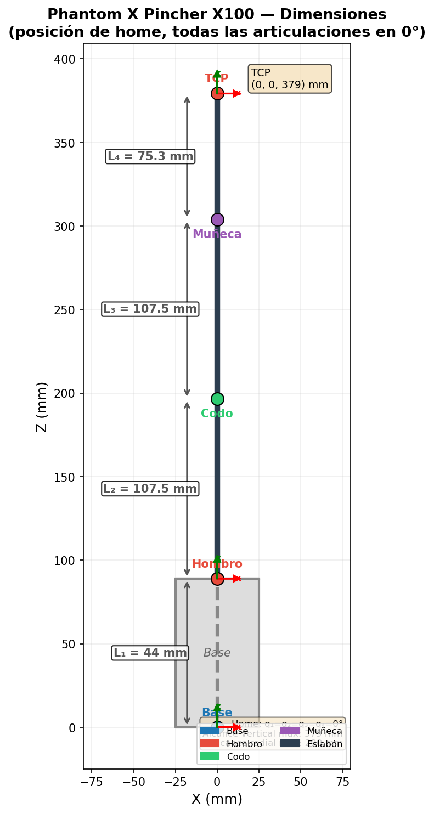

*Figura 2: Dimensiones del manipulador Phantom X Pincher X100 en posición de home (0° en todas las articulaciones), mostrando los sistemas coordenados de cada eslabón y los parámetros geométricos L₁–L₄.*

**Modelo en RViz con los STL correctos del Phantom X Pincher:**

El archivo `robot.xacro` fue modificado para integrar la geometría exacta del kit Bioloid (frames F2, F3, F4, F10 y servomotores AX-12A), reemplazando los STL genéricos del modelo PX100 que venían por defecto. Se incorporaron además los modelos STL del entorno de trabajo (base, latas, canastilla, cámara) desde el repositorio del compañero [Equipo 2D](https://github.com/labsir-un/Robotica-2026-I-Equipo-2D-Cardenas-Pirateque-Suarez), conservando los nombres de articulación originales (`waist`, `shoulder`, `elbow`, `wrist`, `gripper`) para mantener compatibilidad con `pincher_control` y `lab05_code`.

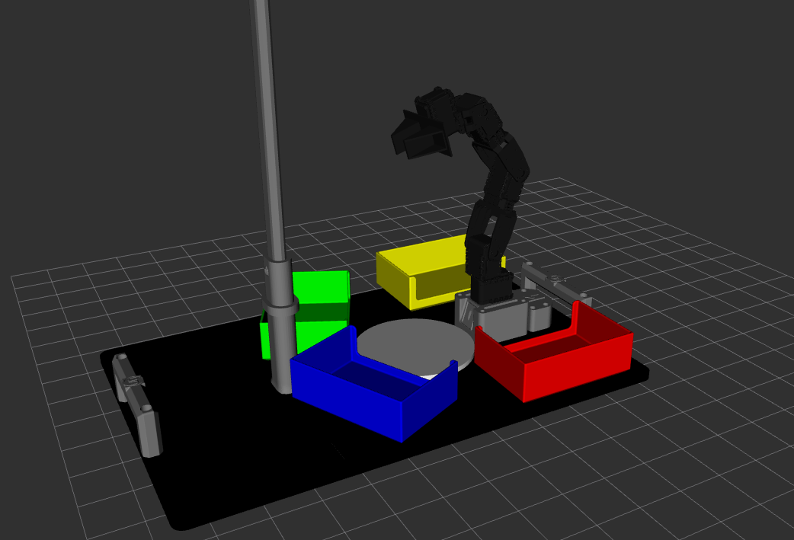

*Figura 2b: Visualización del modelo completo en RViz2 con los STL/DAE correctos del Phantom X Pincher y el entorno de trabajo.*


---

## 3. Configuración inicial del sistema

### 3.1. Preparación del espacio de trabajo

El workspace de ROS 2 se encuentra en `~/ros2_jazzy/phantom_ws/` y contiene los siguientes paquetes:

| Paquete | Descripción |
|---------|-------------|
| `pincher_control` | Controlador de los servomotores DYNAMIXEL (publicación de estados, recepción de comandos y servicios de seguridad), GUI Tkinter y escáner de bus |
| `pincher_description` | Modelo URDF/Xacro del robot, mallas STL, configuración de RViz y launch de visualización |
| `lab05_code` | Código fuente de las actividades del laboratorio (presente repositorio) |

### 3.2. Conexión del robot

1. Conectar el robot Phantom X Pincher X100 al puerto USB del computador.
2. Verificar que el dispositivo aparezca como `/dev/ttyUSB0`:

   ```bash
   ls -l /dev/ttyUSB0
   ```

3. Verificar que el usuario tenga permisos de lectura y escritura sobre el puerto serie:

   ```bash
   sudo usermod -a -G dialout $USER
   ```

   Es necesario cerrar sesión y volver a iniciarla para que el cambio surta efecto.

4. Energizar el robot con su fuente de alimentación. Opcionalmente, verificar la comunicación con los 5 servos mediante `ros2 run pincher_control scan_dynamixel --ros-args -p protocol_version:=1.0`.

### 3.3. Lanzamiento del sistema

Para iniciar el controlador del robot junto con la visualización en RViz, ejecutar:

```bash
source /opt/ros/jazzy/setup.zsh
source ~/ros2_jazzy/phantom_ws/install/setup.zsh
ros2 launch pincher_control pincher_system.launch.py use_hardware:=true motor_model:=ax12a
```

Este comando realiza las siguientes acciones:

1. Incluye `pincher_description/display.launch.py`, que procesa el `robot.xacro` y levanta `robot_state_publisher` y RViz2 (con las 8 mallas STL si están instaladas; en caso contrario usa cajas).
2. Inicia el ejecutable `control_servo` bajo el nombre de nodo **`pincher_controller`**, que se comunica con los servos AX-12A por el puerto serie `/dev/ttyUSB0` a 1 000 000 baudios.
3. Lanza también la GUI de escritorio `pincher_gui` (Tkinter). Si no se desea, agregar `start_gui:=false` al comando.

> **Importante:** los argumentos `use_hardware:=true` y `motor_model:=ax12a` son obligatorios en este montaje, porque los valores por defecto del launch son `use_hardware:=false` (modo simulación) y `motor_model:=xl430`.

### 3.4. Interfaz ROS 2 del controlador

El nodo `pincher_controller` (ejecutable `control_servo`) expone la siguiente interfaz, verificada en el código fuente:

| Interfaz | Tipo | Dirección | Descripción |
|----------|------|:---------:|-------------|
| `/joint_states` | `sensor_msgs/JointState` | publica | Estado de las 5 articulaciones en radianes. El timer corre a `read_rate_hz = 20 Hz`, pero con hardware real la tasa efectiva observada es ~13 Hz, porque la lectura serial de cada motor añade una pausa de 10 ms (5 motores ≈ 50 ms por ciclo) |
| `/pincher/status` | `std_msgs/String` | publica | Mensajes de estado legibles (conexión, torque, parada, home) |
| `/pincher/command` | `sensor_msgs/JointState` | se suscribe | Comandos de posición en radianes. Acepta mensajes **parciales** (solo las articulaciones nombradas) o los 5 valores a la vez; esta propiedad es la base de la comparación simultáneo vs. secuencial del Bloque 2 |
| `/pincher/profile_velocity` | `std_msgs/UInt32` | se suscribe | Cambia en caliente la velocidad (`Moving Speed`, 0–1023) de todos los servos |
| `/pincher/home` | `std_srvs/Trigger` | servicio | Envía todas las articulaciones a su posición de referencia (`home_positions`) |
| `/pincher/software_stop` | `std_srvs/Trigger` | servicio | Parada de software: deshabilita el torque y bloquea nuevos comandos hasta reactivar torque |
| `/pincher/torque_enable` | `std_srvs/SetBool` | servicio | Habilita/deshabilita el torque de todos los motores; habilitar torque además libera la parada de software |

### 3.5. Parámetros del controlador (y una precisión importante)

El archivo `pincher_control/config/ax12a.yaml` define el perfil AX-12A:

```yaml
pincher_controller:
  ros__parameters:
    motor_model: ax12a
    use_hardware: false
    port: /dev/ttyUSB0
    baudrate: 1000000
    dxl_ids: [1, 2, 3, 4, 5]
    joint_names: [waist, shoulder, elbow, wrist, gripper]
    joint_signs: [1.0, -1.0, -1.0, -1.0, 1.0]
    home_positions: [512, 512, 512, 512, 512]
    moving_speed: 50
    torque_limit: 800
    read_rate_hz: 20.0
    home_on_startup: false
    disable_torque_on_shutdown: true
```

> **Precisión (verificada en `pincher_system.launch.py` y `control_servo.py`):** el launch del sistema **no carga este YAML**; solo pasa por línea de argumentos `motor_model`, `use_hardware`, `port`, `baudrate`, `read_rate_hz` y `home_on_startup`. El resto de parámetros toma los **valores por defecto declarados en el código** del controlador, que son: `home_positions = [-1,…,-1]` (todo valor negativo se sustituye por el centro del perfil, 512 en AX-12A), `moving_speed = 100`, `torque_limit = -1`, `joint_signs = [1,-1,-1,-1,1]`. En consecuencia, con el lanzamiento estándar la velocidad efectiva de los servos es **100** (no el 50 del YAML), y **editar `home_positions` en el YAML no tiene efecto**. Para que el YAML sí se aplique (por ejemplo, para la corrección de cero de la Actividad 5) debe lanzarse el nodo con el archivo de parámetros:
>
> ```bash
> ros2 run pincher_control control_servo --ros-args --params-file \
>   ~/ros2_jazzy/phantom_ws/src/Laboratorio\ No.\ 05/pincher_control/config/ax12a.yaml \
>   -r __node:=pincher_controller -p use_hardware:=true
> ```
>
> o bien modificar `pincher_system.launch.py` para incluir el YAML en la lista `parameters` del nodo.

| Parámetro | Descripción |
|-----------|-------------|
| `motor_model` | Perfil del motor (`ax12a` o `xl430`; el perfil define protocolo, rango raw y direcciones de registro) |
| `use_hardware` | Si es `true`, abre el puerto serie y comanda los motores reales; si es `false`, el estado espeja instantáneamente los comandos (modo simulación) |
| `dxl_ids` / `joint_names` | Mapeo ID ↔ nombre lógico de cada articulación |
| `joint_signs` | Signo de la relación rad/raw. Compensa que en el URDF hombro, codo y muñeca giran sobre eje `-z` |
| `home_positions` | Valor raw correspondiente a 0° por articulación (512 = centro del AX-12A) |
| `moving_speed` | Velocidad de los servos (0–1023). También modificable en caliente vía `/pincher/profile_velocity` |
| `torque_limit` | Límite de torque del AX-12A (registro 34); −1 = no escribir |
| `read_rate_hz` | Frecuencia objetivo del timer de publicación de `/joint_states` |

### 3.6. Articulaciones del robot y límites

Los límites usados por el software del laboratorio coinciden con los declarados en el URDF (`robot.xacro`):

| Índice | Nombre | ID | Función | Límites |
|:------:|--------|:--:|---------|:-------:|
| 0 | `waist` | 1 | Rotación de la base | ±150° |
| 1 | `shoulder` | 2 | Elevación del hombro | ±150° |
| 2 | `elbow` | 3 | Flexión del codo | ±150° |
| 3 | `wrist` | 4 | Rotación de la muñeca | ±150° |
| 4 | `gripper` | 5 | Apertura y cierre de la pinza | −90° a +90° |

### 3.7. Modificaciones al modelo URDF

Para que el modelo en RViz coincidiera con la posición física del robot en reposo (todas las articulaciones en 0°), se realizaron las siguientes modificaciones al archivo `pincher_description/urdf/robot.xacro` (ambas verificables en el archivo del repositorio):

1. **Offset del codo:** el origen de la articulación `elbow` incluye un término adicional de −90° en su rpy — la expresión completa es `rpy z = −atan2(L2, Lm) − π/2`, y el joint `wrist` compensa con `+atan2(L2, Lm)` — de modo que la posición de referencia (0° en el controlador) corresponde a un brazo vertical y no en forma de L.
2. **Parámetro `Lm`:** se estableció `Lm = 0.0` (el modelo CAD de referencia trae 0.0315 m) porque el robot físico asignado no presenta ese desplazamiento horizontal.

---

## 4. Arquitectura general y diagrama de flujo maestro

El sistema completo se apoya en un único nodo externo, `pincher_controller` (entregado por el repositorio base como ejecutable `control_servo` del paquete `pincher_control`), que se comunica con los servomotores AX-12A y expone la interfaz de ROS 2 descrita en la sección 3.4. Sobre esa base se construyeron los nodos propios del paquete `lab05_code`:

| Nodo / entry point | Actividades que cubre | Archivo fuente | Estado |
|---------------------|------------------------|----------------|:------:|
| `individual_movement` | 4, 7, 8, 9 (interfaz web), 13, 14 (interfaz web), 15 (interfaz web) | `individual_movement.py` | Implementado |
| `calibration` | 5 | `calibration.py` | Implementado |
| `interpolation` | 9 (script autónomo con gráficas) | `interpolation.py` | Implementado |
| `choreography` | 15 (script autónomo) | `choreography.py` | Implementado |
| `tracing` | 14 (script autónomo CLI con gráficas) | `tracing.py` | Implementado |
| `sinusoidal` | 10 | `sinusoidal.py` | Implementado |
| `fk_dh` | 11 | `fk_dh.py` | Implementado |
| `ik` | 12 | `ik.py` | Implementado |
| `teach_and_repeat` | 13 (alias de `individual_movement`) | `individual_movement.py` | Implementado |
| `tracing` | 14 (script autónomo CLI con gráficas) | `tracing.py` | Implementado |
| `choreography` | 15 (script autónomo) | `choreography.py` | Implementado |

> **Nota:** todos los entry points están declarados en `setup.py` y se invocan con `ros2 run lab05_code <nombre>`.

### 4.1. Diagrama de arquitectura general

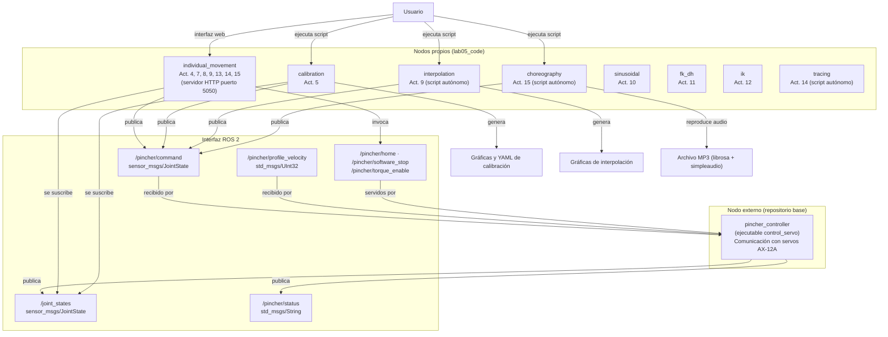
```mermaid
flowchart TD
    subgraph EXT["Nodo externo (repositorio base)"]
        PC["pincher_controller<br/>(ejecutable control_servo)<br/>Comunicación con servos AX-12A"]
    end

    subgraph ROS["Interfaz ROS 2"]
        JS["/joint_states<br/>sensor_msgs/JointState"]
        ST["/pincher/status<br/>std_msgs/String"]
        CMD["/pincher/command<br/>sensor_msgs/JointState"]
        VEL["/pincher/profile_velocity<br/>std_msgs/UInt32"]
        HOME["/pincher/home · /pincher/software_stop<br/>/pincher/torque_enable"]
    end

    PC -- publica --> JS
    PC -- publica --> ST
    CMD -- recibido por --> PC
    VEL -- recibido por --> PC
    HOME -- servidos por --> PC

    subgraph NODOS["Nodos propios (lab05_code)"]
        IM["individual_movement<br/>Act. 4, 7, 8, 9, 13, 14, 15<br/>(servidor HTTP puerto 5050)"]
        CAL["calibration<br/>Act. 5"]
        INTERP["interpolation<br/>Act. 9 (script autónomo)"]
        DANCE["choreography<br/>Act. 15 (script autónomo)"]
        SIN["sinusoidal<br/>Act. 10"]
        FK["fk_dh<br/>Act. 11"]
        IK["ik<br/>Act. 12"]
        TR["tracing<br/>Act. 14 (script autónomo)"]
    end

    IM -- publica --> CMD
    IM -- se suscribe --> JS
    IM -- invoca --> HOME

    CAL -- publica --> CMD
    CAL -- se suscribe --> JS
    CAL -- genera --> RES["Gráficas y YAML de calibración"]

    INTERP -- publica --> CMD
    INTERP -- genera --> PLOTS["Gráficas de interpolación"]

    DANCE -- publica --> CMD
    DANCE -- reproduce audio --> AUDIO["Archivo MP3 (librosa + simpleaudio)"]

    USER["Usuario"] -- interfaz web --> IM
    USER -- ejecuta script --> CAL
    USER -- ejecuta script --> INTERP
    USER -- ejecuta script --> DANCE
```

Este diagrama es el mapa general del sistema: todos los nodos comparten la misma interfaz de comunicación con `pincher_controller` (un publicador en `/pincher/command`, un suscriptor a `/joint_states` y, cuando aplica, un cliente del servicio `/pincher/home`), y se diferencian en la lógica que aplican antes de publicar el comando. Los diagramas de detalle de cada bloque desarrollan esa lógica interna.

---

## 5. Bloque 1 — Control articular básico (Actividades 4, 5 y 6)

### 5.1. Diagrama de flujo del bloque

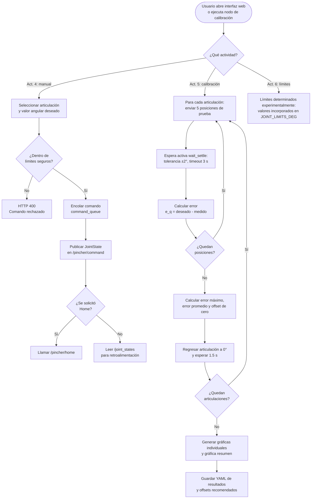
```mermaid
flowchart TD
    START([Usuario abre interfaz web<br/>o ejecuta nodo de calibración]) --> SEL{¿Qué actividad?}

    SEL -->|Act. 4: manual| PICK[Seleccionar articulación<br/>y valor angular deseado]
    PICK --> LIM4{¿Dentro de<br/>límites seguros?}
    LIM4 -->|No| REJ[HTTP 400<br/>Comando rechazado]
    LIM4 -->|Sí| ENQ[Encolar comando<br/>command_queue]
    ENQ --> PUB[Publicar JointState<br/>en /pincher/command]
    PUB --> HOME4{¿Se solicitó<br/>Home?}
    HOME4 -->|Sí| SRV[Llamar /pincher/home]
    HOME4 -->|No| FEED[Leer /joint_states<br/>para retroalimentación]

    SEL -->|Act. 5: calibración| LOOP[Para cada articulación:<br/>enviar 5 posiciones de prueba]
    LOOP --> WAIT[Espera activa wait_settle:<br/>tolerancia ±2°, timeout 3 s]
    WAIT --> ERR[Calcular error<br/>e_q = deseado - medido]
    ERR --> MORE{¿Quedan<br/>posiciones?}
    MORE -->|Sí| LOOP
    MORE -->|No| STATS[Calcular error máximo,<br/>error promedio y offset de cero]
    STATS --> HOMEJ[Regresar articulación a 0°<br/>y esperar 1.5 s]
    HOMEJ --> NEXTJ{¿Quedan<br/>articulaciones?}
    NEXTJ -->|Sí| LOOP
    NEXTJ -->|No| PLOTS[Generar gráficas individuales<br/>y gráfica resumen]
    PLOTS --> SAVE[Guardar YAML de resultados<br/>y offsets recomendados]

    SEL -->|Act. 6: límites| CHECKLIM["Límites determinados experimentalmente:<br/>valores incorporados en JOINT_LIMITS_DEG"]
```

### 5.2. Actividad 4 — Movimiento individual de articulaciones

**Objetivo específico:** desarrollar un programa que permita seleccionar una articulación del robot y enviarle una posición angular de forma independiente, ejecutando al menos tres posiciones diferentes por articulación y retornando a la posición de referencia.

**Implementación:** el programa se implementó como un nodo de ROS 2 en Python (`MovementNode`, en `individual_movement.py`) que integra un servidor HTTP embebido para facilitar la interacción con el usuario, mientras que todo el control subyacente se realiza mediante los mecanismos nativos de ROS 2: tópicos, servicios y la cola de ejecución de `rclpy`.

**Componentes del nodo:**

- `cmd_pub`: publicador en `/pincher/command` (tipo `sensor_msgs/JointState`).
- `state_sub`: suscriptor a `/joint_states`, cuyos datos se almacenan en `current_state` protegido por `state_lock`.
- `home_cli`: cliente del servicio `/pincher/home` (tipo `std_srvs/Trigger`). Al iniciar, el nodo espera hasta 15 s a que el servicio esté disponible; si no aparece, continúa operando sin la función Home (con advertencia en consola).
- `command_queue`: cola `queue.Queue` que desacopla el servidor HTTP (hilo secundario) del bucle principal de ROS 2. En cada iteración de `rclpy.spin_once`, `process_queue` retira un comando: si es de tipo `move`, construye un `JointState` y lo publica; si es `home`, invoca el servicio de forma asíncrona. Este patrón **cola + sondeo** evita condiciones de carrera entre hilos.

**Servidor HTTP (hilo `daemon`, puerto 5050):** implementado con `http.server` de la biblioteca estándar (sin dependencias externas). La interfaz web se organiza en seis pestañas, en este orden: *Actividad 4 — Movimiento Individual*, *Actividad 7 — Movimiento Simultáneo*, *Actividad 8 — Secuencial*, *Actividad 9 — Interpolación*, *Actividad 13 — Enseñanza* y *Baile — Coreografía*. La página consulta `GET /api/state` cada 300 ms y muestra por articulación un slider, un campo numérico, un sparkline con el historial y la posición reportada por el motor.

**Endpoints básicos:**

| Endpoint | Método | Descripción |
|----------|:------:|--------------|
| `/api/state` | GET | Posición actual de cada articulación (radianes), a partir de `/joint_states` |
| `/api/command` | POST | Recibe `{name: [...], position: [...]}`, valida contra `JOINT_LIMITS_DEG` y encola el comando |
| `/api/home` | POST | Encola la invocación del servicio `/pincher/home` |

La validación de límites se realiza en el backend, en `APIHandler.do_POST`, **antes** de encolar: si un valor excede los límites (±150° brazo, ±90° pinza), se responde HTTP 400 y el comando nunca llega al tópico de ROS 2.

**Instrucciones de uso:**

```bash
ros2 launch pincher_control pincher_system.launch.py use_hardware:=true motor_model:=ax12a
```

```bash
source ~/ros2_jazzy/phantom_ws/install/setup.zsh
ros2 run lab05_code individual_movement
```

Abrir `http://localhost:5050`, pestaña *Actividad 4*. Cada articulación tiene un slider que envía la posición al soltarlo o al presionar Enter. El botón *Home* invoca el servicio `/pincher/home`.

**Análisis:** el patrón cola de comandos + sondeo permite que el nodo ROS 2 y el servidor HTTP coexistan sin bloqueos. La retroalimentación de `/joint_states` (~13–20 Hz según carga del bus serial) se usa para visualización; el control de posición real es responsabilidad de `pincher_controller`. La validación de límites en el backend evita que posiciones peligrosas lleguen siquiera al tópico de ROS 2.

<div align="center">

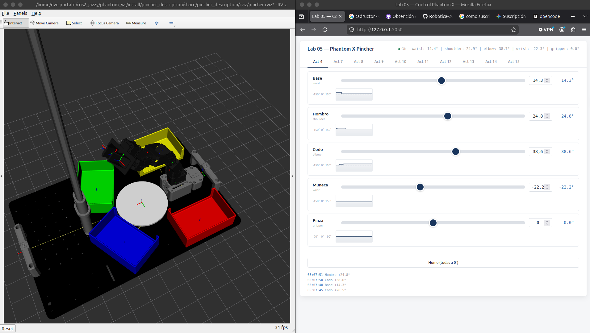

*Figura 5.7: Pantallazo de la interfaz web — pestaña Actividad 4 (Movimiento individual de articulaciones).*

</div>

### 5.3. Actividad 5 — Calibración de cero y error articular

**Objetivo específico:** cuantificar el error sistemático de cada articulación enviando posiciones angulares conocidas y comparándolas con la posición reportada por el servomotor, y calcular el desplazamiento de cero necesario para corregir la calibración.

**Fundamento teórico.** El error articular se define como:

$$e_q = q_{\text{deseado}} - q_{\text{medido}}$$

El offset de cero se calcula como el promedio de los errores medidos:

$$\text{offset} = \frac{1}{N} \sum_{i=1}^{N} e_{q_i}$$

Para aplicar la corrección en los servomotores AX-12A (rango de 0 a 1023 unidades para 300° de giro mecánico):

$$\mathrm{raw\_offset} = \mathrm{offset}_{\mathrm{grados}} \times \frac{1024}{300}$$

**Metodología (según la implementación real de `calibration.py`):** el nodo `CalibrationNode` automatiza el proceso completo. Para cada articulación, en el orden base → hombro → codo → muñeca → pinza:

1. Se valida que la posición de prueba esté dentro de los límites seguros y se publica un `JointState` de **una sola articulación** en `/pincher/command`.
2. Se ejecuta `wait_settle`: una **espera activa** que hace *spin* del nodo y monitorea `/joint_states` hasta que la posición medida entre en una tolerancia de **±2°** respecto al objetivo, con un **timeout de 3 s**. Al vencer el tiempo o alcanzar la tolerancia, se toma la última lectura como posición medida.
3. Se calcula el error del punto, y al completar las 5 pruebas de la articulación se determinan error máximo, error promedio y offset de cero.
4. La articulación regresa a 0° y se espera `SETTLE_TIME = 1.5 s` antes de continuar con la siguiente.

**Posiciones de prueba** (reducidas respecto al rango máximo para evitar colisiones con la mesa; el hombro se limitó a [0°, +60°] por la misma razón):

| Articulación | Posiciones de prueba |
|-------------|:---------------------:|
| Base | −60°, −30°, 0°, +30°, +60° |
| Hombro | 0°, +15°, +30°, +45°, +60° |
| Codo | −60°, −30°, 0°, +30°, +60° |
| Muñeca | −60°, −30°, 0°, +30°, +60° |
| Pinza | −30°, −15°, 0°, +15°, +30° |

**Resultados obtenidos (sesión del 2026-07-08 23:04, robot físico):**

| Articulación | Error máx (°) | Error prom (°) | Offset cero (°) |
|-------------|:------------:|:--------------:|:---------------:|
| Base | 1.64 | +0.76 | +0.76 |
| Hombro | 1.29 | −0.85 | −0.85 |
| Codo | 1.00 | −0.29 | −0.29 |
| Muñeca | 0.50 | −0.29 | −0.29 |
| Pinza | 0.38 | +0.29 | +0.29 |

**Gráficas de calibración:**


*Figura 5.1: Calibración de la articulación Base. Panel superior: posición deseada vs. medida. Panel inferior: error por punto de prueba.*


*Figura 5.2: Calibración de la articulación Hombro.*


*Figura 5.3: Calibración de la articulación Codo.*


*Figura 5.4: Calibración de la articulación Muñeca.*


*Figura 5.5: Calibración de la articulación Pinza.*


*Figura 5.6: Resumen comparativo de todas las articulaciones.*

**Offsets recomendados y home corregido:**

| Articulación | Offset (°) | Offset (raw) | home actual | home corregido |
|-------------|:----------:|:------------:|:-----------:|:--------------:|
| Base | +0.76 | +3 | 512 | 515 |
| Hombro | −0.85 | −3 | 512 | 509 |
| Codo | −0.29 | −1 | 512 | 511 |
| Muñeca | −0.29 | −1 | 512 | 511 |
| Pinza | +0.29 | +1 | 512 | 513 |

**Aplicación de la corrección de cero:** los offsets se aplican modificando `home_positions` en `pincher_control/config/ax12a.yaml`:

```yaml
home_positions: [515, 509, 511, 511, 513]
```

> **Importante:** como se explicó en la sección 3.5, el launch estándar no carga el YAML, por lo que además de editar el archivo es necesario lanzar el controlador con `--params-file` (o modificar `pincher_system.launch.py` para incluirlo). Después de aplicar la corrección, repetir la calibración para verificar que el error promedio se reduzca.

**Interpretación:** el error máximo se mantuvo por debajo de ±1.7° en todas las articulaciones (comparable con la resolución del encoder del AX-12A, ~0.29°/unidad). El signo del error promedio indica la dirección del sesgo: con la convención $e_q = q_{deseado} - q_{medido}$, un promedio negativo (como el del hombro, −0.85°) significa que el motor tiende a reportar posiciones *más allá* del objetivo, y uno positivo (base, +0.76°) que tiende a quedarse *antes* del objetivo, en el sentido positivo del eje. El mayor sesgo corresponde al hombro, consistente con ser la articulación que soporta mayor carga gravitacional en las posturas de prueba.

**Archivos generados:** `calibracion_resultados.yaml`, `offsets_recomendados.yaml`, las 6 gráficas PNG y un reporte `README_calibracion.md` autogenerado, disponibles en `calibration_results/`.

### 5.4. Actividad 6 — Determinación de límites seguros

Los límites seguros se determinaron mediante pruebas experimentales en las que se incrementó gradualmente el valor comandado de cada articulación hasta alcanzar el límite mecánico, registrando el valor extremo y restando un margen de seguridad para evitar daños. Los valores obtenidos se incorporaron en la tabla `JOINT_LIMITS_DEG` dentro del archivo `lab05_code/lab05_code/individual_movement.py`:

| Articulación | Límite inferior | Límite superior | Margen de seguridad |
|:------------:|:---------------:|:---------------:|:-------------------:|
| Base         | −145.0°         | +145.0°         | 5.0°                |
| Hombro       | −96.0°          | +96.0°          | 4.0°                |
| Codo         | −138.0°         | +144.0°         | 6.0°                |
| Muñeca       | −106.0°         | +124.0°         | 4.0°                |
| Pinza        | −35.0°          | +35.0°          | 5.0°                |

Estos límites se validan en el backend (`APIHandler.do_POST`) antes de encolar cualquier comando. Si un valor excede estos límites, el servidor responde con HTTP 400 y el comando no se ejecuta. La tabla `JOINT_LIMITS_DEG` en `individual_movement.py` contiene los límites del URDF para validación; los valores experimentales de esta sección se documentan con fines de referencia. No se implementó un script `safe_limits.py` independiente porque la determinación experimental se realizó manualmente.

---

## 6. Bloque 2 — Movimiento multiarticular y trayectorias (Actividades 7, 8, 9 y 10)

### 6.1. Diagrama de flujo del bloque

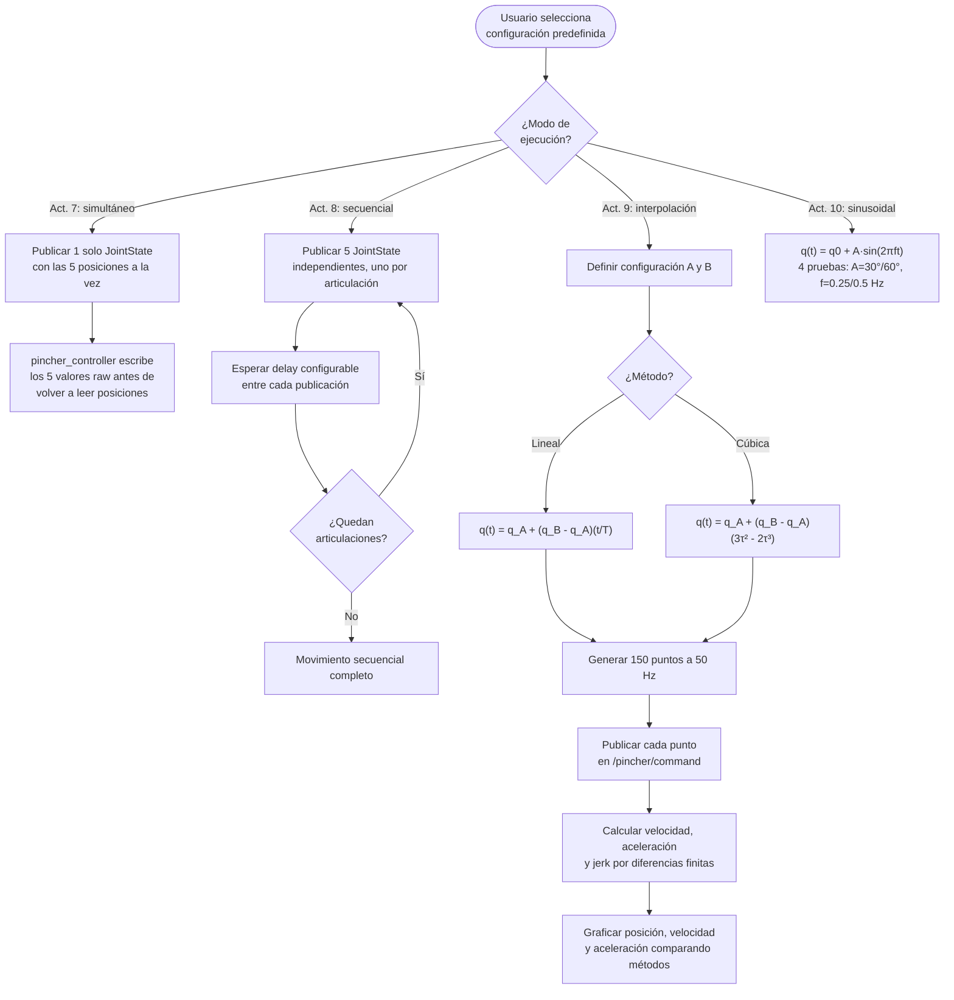
```mermaid
flowchart TD
    START([Usuario selecciona<br/>configuración predefinida]) --> MODE{¿Modo de<br/>ejecución?}

    MODE -->|Act. 7: simultáneo| SIM["Publicar 1 solo JointState<br/>con las 5 posiciones a la vez"]
    SIM --> SIMOUT["pincher_controller escribe<br/>los 5 valores raw antes de<br/>volver a leer posiciones"]

    MODE -->|Act. 8: secuencial| SEQ["Publicar 5 JointState<br/>independientes, uno por articulación"]
    SEQ --> DELAY["Esperar delay configurable<br/>entre cada publicación"]
    DELAY --> NEXTJOINT{¿Quedan<br/>articulaciones?}
    NEXTJOINT -->|Sí| SEQ
    NEXTJOINT -->|No| SEQOUT[Movimiento secuencial completo]

    MODE -->|Act. 9: interpolación| CONF[Definir configuración A y B]
    CONF --> METHOD{¿Método?}
    METHOD -->|Lineal| LIN["q(t) = q_A + (q_B - q_A)(t/T)"]
    METHOD -->|Cúbica| CUB["q(t) = q_A + (q_B - q_A)(3τ² - 2τ³)"]
    LIN --> GEN[Generar 150 puntos a 50 Hz]
    CUB --> GEN
    GEN --> PUBP[Publicar cada punto<br/>en /pincher/command]
    PUBP --> METRICS[Calcular velocidad, aceleración<br/>y jerk por diferencias finitas]
    METRICS --> PLOT9[Graficar posición, velocidad<br/>y aceleración comparando métodos]

    MODE -->|Act. 10: sinusoidal| SIN["q(t) = q0 + A·sin(2πft)<br/>4 pruebas: A=30°/60°, f=0.25/0.5 Hz"]
```

### 6.2. Actividad 7 — Movimiento simultáneo

**Objetivo:** programar el desplazamiento simultáneo de todas las articulaciones para ejecutar cinco configuraciones predefinidas.

**Configuraciones de prueba (en grados; base, hombro, codo, muñeca, pinza):**

| Config | Base | Hombro | Codo | Muñeca | Pinza |
|:------:|:----:|:------:|:----:|:------:|:-----:|
| 1 (Home) | 0 | 0 | 0 | 0 | 0 |
| 2 | 25 | 25 | 20 | −20 | 0 |
| 3 | −35 | 35 | −30 | 30 | 0 |
| 4 | 85 | −20 | 55 | 25 | 0 |
| 5 | 80 | −35 | 55 | −45 | 0 |

*Nota:* si alguna configuración no resulta segura para el robot asignado, debe modificarse y justificarse en el informe una vez se realicen las pruebas físicas.

**Implementación:** se reutiliza el mismo `MovementNode` de la Actividad 4 y su endpoint `POST /api/command`. La diferencia clave es que aquí se envían los 5 valores en un único mensaje `JointState`. En `pincher_controller`, el callback de comando itera sobre todas las articulaciones presentes en el mensaje y escribe los 5 valores raw en los DYNAMIXEL antes de la siguiente lectura de posiciones, lo que produce el movimiento simultáneo:

```
POST /api/command {name: [waist,shoulder,elbow,wrist,gripper],
                   position: [0.44,0.44,0.35,-0.35,0.0]}
       -> cmd_pub.publish(JointState(name=[...5...], position=[...5...]))
       -> /pincher/command -> pincher_controller
```

**Interfaz web:** pestaña *Actividad 7* con las 5 configuraciones predefinidas mostradas en inputs editables, cada una con botón *Ejecutar* que envía un único `POST /api/command`, más una sección de configuración personalizada y botón Home.

<div align="center">

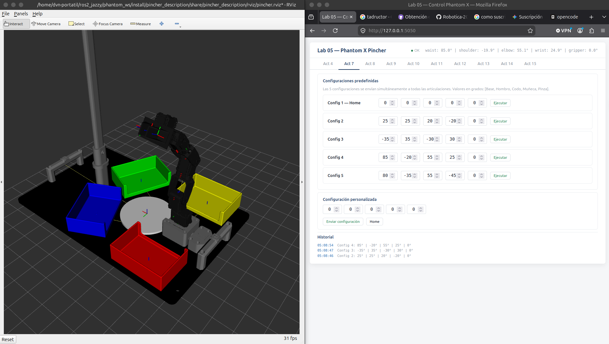

*Figura 6.3: Pantallazo de la interfaz web — pestaña Actividad 7 (Movimiento simultáneo).*

</div>

### 6.3. Actividad 8 — Movimiento secuencial

**Objetivo:** ejecutar una de las configuraciones anteriores moviendo las articulaciones una tras otra (Base → Hombro → Codo → Muñeca → Pinza) y comparar el resultado con el movimiento simultáneo.

**Implementación:** en contraste con la Actividad 7, aquí se generan 5 publicaciones independientes en `/pincher/command`, cada una con una sola articulación, separadas por un delay configurable (0.5–3 s). Esto aprovecha que el controlador acepta mensajes `JointState` parciales:

```
POST /api/command {name:[waist],   position:[0.44]} -> sleep(delay)
POST /api/command {name:[shoulder],position:[0.44]} -> sleep(delay)
POST /api/command {name:[elbow],   position:[0.35]} -> sleep(delay)
POST /api/command {name:[wrist],   position:[-0.35]} -> sleep(delay)
POST /api/command {name:[gripper], position:[0.0]}
```

El tiempo total de la secuencia en simulación depende únicamente de la latencia de publicación, mientras que en el robot real es la suma de los tiempos de movimiento individuales más `(n−1) × delay`.

**Comparación simultáneo vs. secuencial (medido en simulación, `use_hardware:=false`):**

| Criterio | Simultáneo | Secuencial |
|----------|:----------:|:----------:|
| **Tiempo de ejecución** (simulador, Config 2) | ≈ 0.05 s (1 periodo de muestreo) | ≈ 0.05 s (instantáneo por articulación) |
| **Tiempo de ejecución** (robot real estimado AX-12A 66.6 °/s, Config 2) | **0.38 s** (todas las articulaciones en paralelo) | **3.35 s** (suma de movimientos individuales + 4 delays de 0.5 s) |
| **Distancia recorrida por el TCP** (home → Config 2, vía FK) | **214.1 mm** | **214.1 mm** |
| **Velocidad articular máxima** (robot real estimado) | 66.6 °/s (Moving Speed 100) | 66.6 °/s (Moving Speed 100) |
| **Suavidad** | Todas las articulaciones llegan simultáneamente; trayectoria del TCP suave y predecible | Cada articulación se mueve por separado; el TCP describe una trayectoria poligonal con cambios bruscos de dirección al inicio de cada movimiento articular |

> **Nota:** en el simulador la transición es instantánea (< 50 ms) porque `command_callback` actualiza `current_joint_positions` de inmediato. Los valores estimados para el robot real se calcularon usando la velocidad del perfil AX-12A con `Moving Speed = 100` (11.1 RPM ≈ 66.6 °/s). La aceleración es un escalón teórico (el AX-12A no expone un perfil de aceleración configurable).

**Interfaz web:** pestaña *Actividad 8* con selector de configuración (las de la Actividad 7), slider de delay y tres botones: *Ejecutar secuencial*, *Ejecutar simultáneo* y *Home*, mostrando el progreso (1/5 … 5/5) y el tiempo transcurrido de cada modo.

<div align="center">

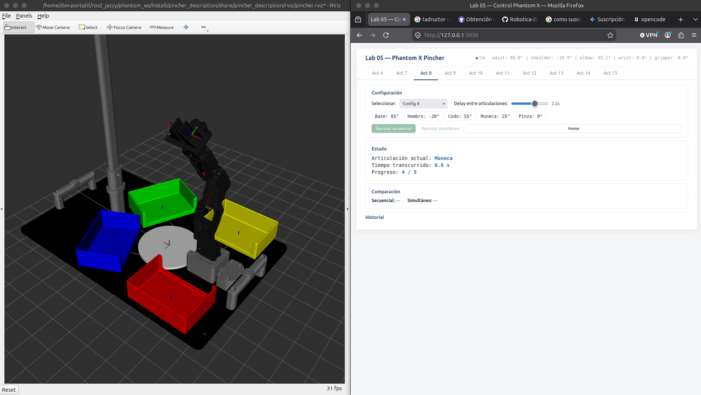

*Figura 6.4: Pantallazo de la interfaz web — pestaña Actividad 8 (Movimiento secuencial).*

</div>

### 6.4. Actividad 9 — Interpolación de trayectorias

**Objetivo:** implementar interpolación lineal y cúbica para mover el robot entre dos configuraciones alejadas, y comparar la suavidad mediante gráficas de `q(t)`.

**Algoritmo.** Interpolación lineal:

$$q(t) = q_A + (q_B - q_A) \cdot \frac{t}{T}$$

Interpolación cúbica (velocidad cero en ambos extremos):

$$q(t) = q_A + (q_B - q_A) \cdot \left(3\left(\tfrac{t}{T}\right)^2 - 2\left(\tfrac{t}{T}\right)^3\right)$$

**Implementación:** el script autónomo `interpolation.py` define dos configuraciones de prueba:

- Configuración A (inicio): home, `[0, 0, 0, 0, 0]`.
- Configuración B (final): `[85, −20, 55, 25, 0]` grados.

Se generan **N = 150 puntos** a **50 Hz** (T = 3 s) para cada método, y se calculan velocidad, aceleración y jerk por diferencias finitas (`np.gradient`). El script imprime las métricas de suavidad, pregunta si se desea ejecutar la trayectoria en el robot (lineal primero, luego cúbica, con pausa intermedia) y en cualquier caso genera una gráfica comparativa de 5 articulaciones × 3 magnitudes (posición, velocidad, aceleración), guardada en `~/ros2_jazzy/phantom_ws/interpolation_results/`.

**Métricas de suavidad esperadas:**

| Métrica | Lineal | Cúbica |
|---------|--------|--------|
| Velocidad máxima | Mayor (cambio brusco al inicio/fin) | Menor en extremos (arranque y frenado suaves) |
| Aceleración máxima | Discontinua en t=0 y t=T | Continua |
| Jerk máximo | Teóricamente infinito en los extremos | Finito |

**Instrucciones de uso:**

```bash
source ~/ros2_jazzy/phantom_ws/install/setup.zsh
ros2 run lab05_code interpolation
```

Adicionalmente, la pestaña *Actividad 9* de la interfaz web permite seleccionar configuraciones A/B, duración, método (lineal, cúbico o ambos) y visualizar las curvas de posición/velocidad/aceleración en Canvas antes de ejecutar en el robot con confirmación previa.

**Gráfica generada (interpolación lineal vs. cúbica):**

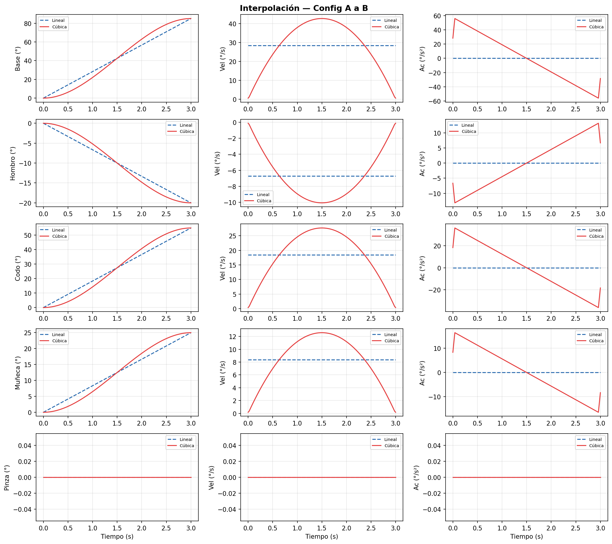

*Figura 6.1: Comparación de interpolación lineal (izquierda) y cúbica (derecha) desde la Configuración A (home) a la Configuración B (85°, −20°, 55°, 25°, 0°). Se muestran posición, velocidad y aceleración para cada articulación. La interpolación cúbica presenta arranque y frenado suaves (velocidad cero en extremos), mientras que la lineal muestra cambios bruscos de velocidad en t=0 y t=T.*

<div align="center">

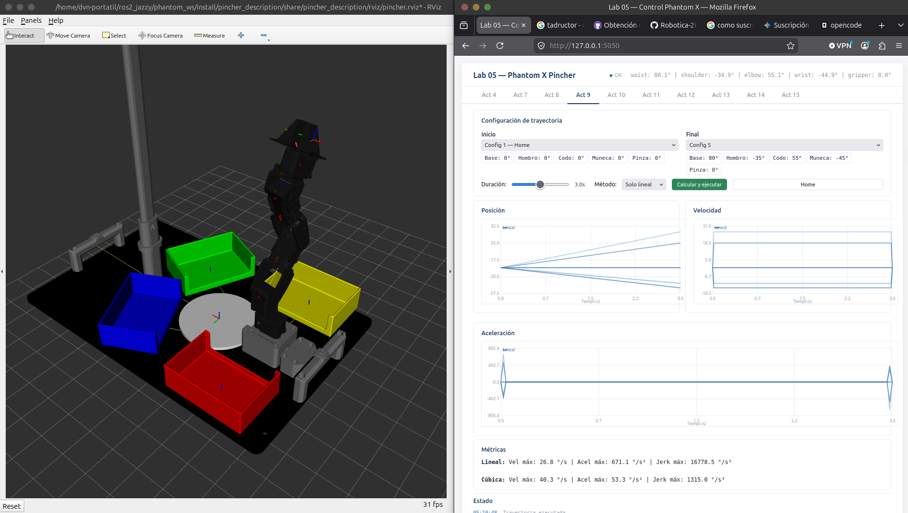

*Figura 6.5: Pantallazo de la interfaz web — pestaña Actividad 9 (Interpolación de trayectorias).*

</div>

### 6.5. Actividad 10 — Trayectoria sinusoidal

Se implementó `sinusoidal.py` que ejecuta la trayectoria:

$$q(t) = q_0 + A \sin(2\pi f t)$$

sobre la articulación del hombro (`shoulder`), realizando cuatro pruebas combinando dos amplitudes y dos frecuencias:

| Prueba | Amplitud A (°) | Frecuencia f (Hz) |
|:------:|:--------------:|:-------------------:|
| 1 | 30 | 0.25 |
| 2 | 30 | 0.50 |
| 3 | 60 | 0.25 |
| 4 | 60 | 0.50 |

El script genera puntos a 50 Hz durante al menos 2 periodos, registra posición deseada y medida, grafica ambas curvas por prueba en un PNG, y calcula el error máximo y el error cuadrático medio (RMSE). El entry point está registrado en `setup.py`.

**Gráfica generada (pruebas 1–4 sobre el hombro):**

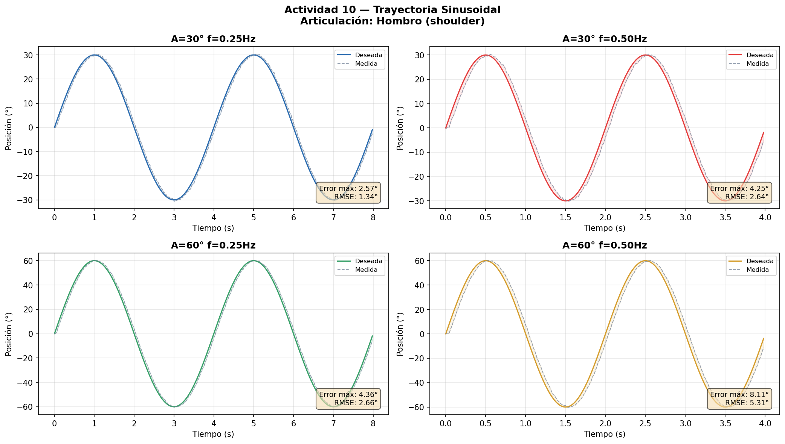

*Figura 6.2: Trayectoria sinusoidal `q(t) = q_0 + A·sin(2πft)` sobre la articulación del hombro para 4 combinaciones de amplitud y frecuencia. Cada panel muestra la posición deseada y medida, junto con el error máximo y RMSE.*

<div align="center">

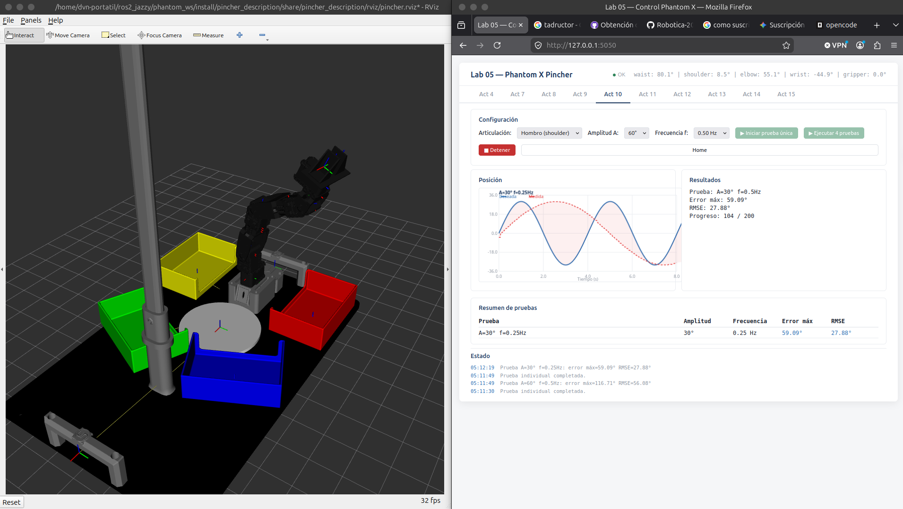

*Figura 6.6: Pantallazo de la interfaz web — pestaña Actividad 10 (Trayectoria sinusoidal).*

</div>

---

## 7. Bloque 3 — Cinemática directa e inversa (Actividades 11 y 12)

### 7.1. Diagrama de flujo

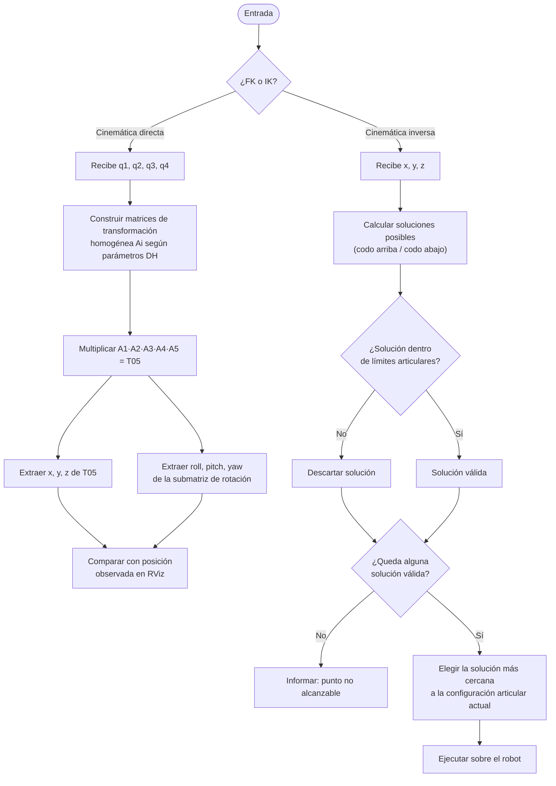
```mermaid
flowchart TD
    START([Entrada]) --> MODE{¿FK o IK?}

    MODE -->|Cinemática directa| Q["Recibe q1, q2, q3, q4"]
    Q --> DH["Construir matrices de transformación<br/>homogénea Ai según parámetros DH"]
    DH --> T05["Multiplicar A1·A2·A3·A4·A5 = T05"]
    T05 --> XYZ["Extraer x, y, z de T05"]
    T05 --> RPY["Extraer roll, pitch, yaw<br/>de la submatriz de rotación"]
    XYZ --> COMPARE["Comparar con posición<br/>observada en RViz"]
    RPY --> COMPARE

    MODE -->|Cinemática inversa| XYZT["Recibe x, y, z"]
    XYZT --> SOLVE["Calcular soluciones posibles<br/>(codo arriba / codo abajo)"]
    SOLVE --> FILTER{"¿Solución dentro<br/>de límites articulares?"}
    FILTER -->|No| DISCARD[Descartar solución]
    FILTER -->|Sí| VALID[Solución válida]
    DISCARD --> ANYVALID{"¿Queda alguna<br/>solución válida?"}
    VALID --> ANYVALID
    ANYVALID -->|No| UNREACHABLE["Informar: punto no alcanzable"]
    ANYVALID -->|Sí| CLOSEST["Elegir la solución más cercana<br/>a la configuración articular actual"]
    CLOSEST --> EXEC["Ejecutar sobre el robot"]
```

### 7.2. Actividad 11 — Cinemática directa

Se implementó `fk_dh.py` que calcula la posición `(x, y, z)` y orientación `(roll, pitch, yaw)` del efector final a partir de las articulaciones `q1, q2, q3, q4` usando la cadena cinemática del modelo Bioloid (multiplicación de matrices de transformación a partir de la geometría exacta del URDF, en lugar de parámetros DH simplificados). Las dimensiones efectivas del modelo son:

| Parámetro | Valor | Descripción |
|-----------|:-----:|-------------|
| L₀ | 54.0 mm | Altura base → hombro |
| L₁ | 99.5 mm | Hombro → codo |
| L₂ | 99.5 mm | Codo → muñeca |
| L₃ | 83.5 mm | Muñeca → TCP |

El script evalúa las 5 configuraciones de la Actividad 7 y las presenta en una tabla comparativa. También incluye un modo interactivo donde el usuario ingresa `q1 q2 q3 q4` en grados y recibe la posición cartesiana resultante. Ejemplo para Home (0,0,0,0): `x≈0 mm, y=0 mm, z≈337 mm, roll≈0°, pitch≈0°, yaw≈−180°` (coordenadas desde `arm_base_link` en el modelo Bioloid).

**Entry point:** `ros2 run lab05_code fk_dh`

<div align="center">

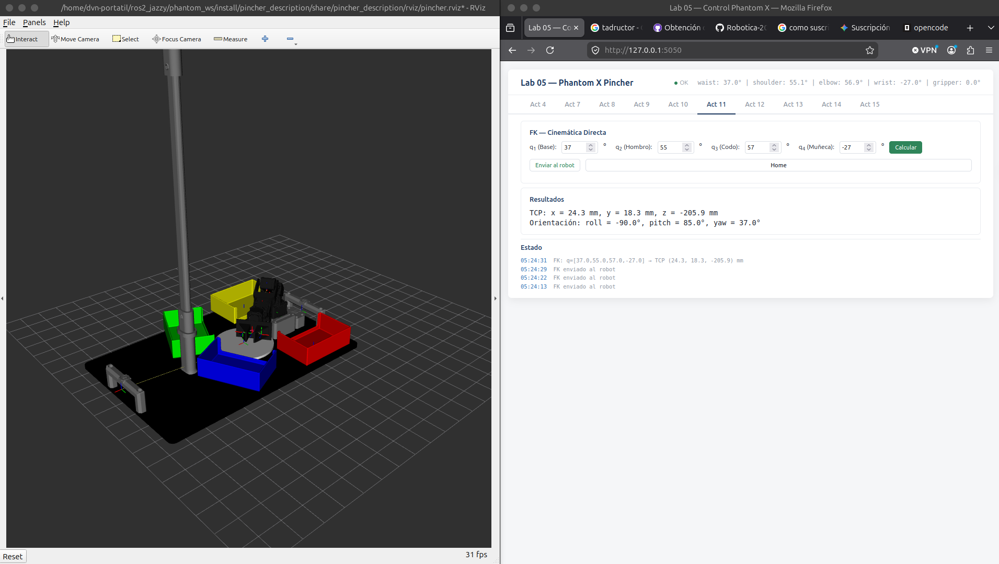

*Figura 7.1: Pantallazo de la interfaz web — pestaña Actividad 11 (Cinemática directa).*

</div>

### 7.3. Actividad 12 — Cinemática inversa

Se implementó `ik.py` que recibe coordenadas `(x, y, z)` y calcula las configuraciones articulares `(q1, q2, q3, q4)` mediante:

1. **Cálculo de q1:** `q1 = atan2(y, x)`
2. **Cálculo de q3:** usando ley de cosenos en el triángulo formado por L₁, L₂ y la distancia al TCP proyectada en el plano del brazo.
3. **Cálculo de q2:** ángulo del hombro resolviendo la geometría del brazo.
4. **Cálculo de q4:** `q4 = −90° − q2 − q3` para mantener la pinza en orientación vertical.
5. **Dos soluciones:** codo arriba (q3 negativo) y codo abajo (q3 positivo).
6. **Filtro por límites:** se descartan soluciones fuera de los límites seguros (sección 5.4).
7. **Solución más cercana:** `nearest_solution()` selecciona la configuración válida más próxima a la posición articular actual.
8. **Detección de alcance:** informa cuando un punto está fuera del espacio de trabajo.

El script prueba 6 puntos cartesianos predefinidos y verifica que FK(IK(punto)) ≈ punto con error < 1 mm. También incluye un modo interactivo.

**Entry point:** `ros2 run lab05_code ik`

<div align="center">

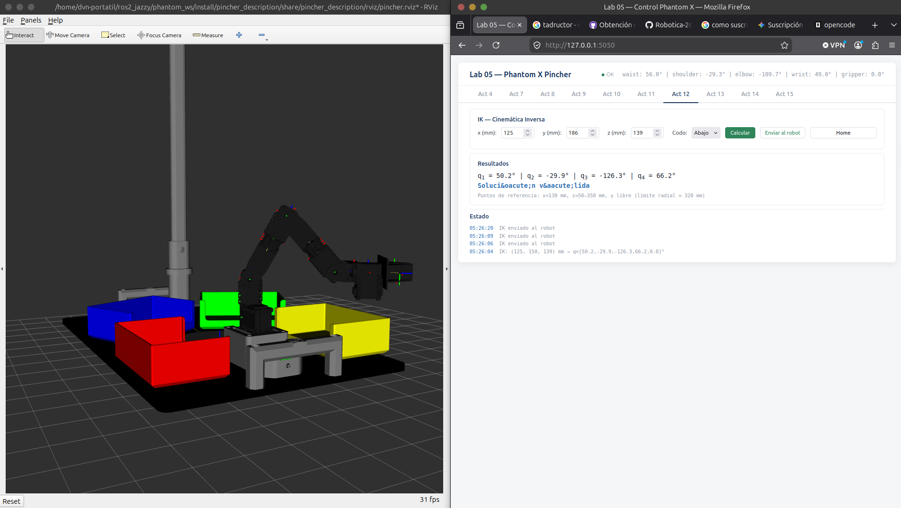

*Figura 7.2: Pantallazo de la interfaz web — pestaña Actividad 12 (Cinemática inversa).*

</div>

---

## 8. Bloque 4 — Enseñanza, repetición de poses y trazado (Actividades 13 y 14)

### 8.1. Diagrama de flujo del bloque

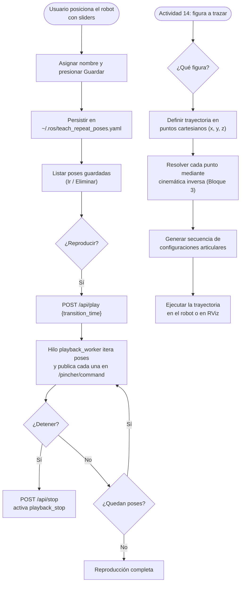
```mermaid
flowchart TD
    START([Usuario posiciona el robot<br/>con sliders]) --> SAVE["Asignar nombre y presionar Guardar"]
    SAVE --> YAML["Persistir en<br/>~/.ros/teach_repeat_poses.yaml"]
    YAML --> LIST["Listar poses guardadas<br/>(Ir / Eliminar)"]
    LIST --> PLAYQ{"¿Reproducir?"}
    PLAYQ -->|Sí| PLAY["POST /api/play {transition_time}"]
    PLAY --> WORKER["Hilo playback_worker itera poses<br/>y publica cada una en /pincher/command"]
    WORKER --> STOPQ{"¿Detener?"}
    STOPQ -->|Sí| STOP["POST /api/stop<br/>activa playback_stop"]
    STOPQ -->|No| NEXTPOSE{"¿Quedan poses?"}
    NEXTPOSE -->|Sí| WORKER
    NEXTPOSE -->|No| DONE["Reproducción completa"]

    START2([Actividad 14: figura a trazar]) --> SHAPE{"¿Qué figura?"}
    SHAPE --> POINTS["Definir trayectoria en<br/>puntos cartesianos (x, y, z)"]
    POINTS --> IKCALL["Resolver cada punto mediante<br/>cinemática inversa (Bloque 3)"]
    IKCALL --> SEQCONF["Generar secuencia de<br/>configuraciones articulares"]
    SEQCONF --> EXECDRAW["Ejecutar la trayectoria<br/>en el robot o en RViz"]
```

### 8.2. Actividad 13 — Enseñanza y repetición de poses

**Objetivo:** desarrollar un modo de enseñanza que permita mover el robot a una configuración deseada, guardarla con un nombre, almacenar al menos 8 poses y reproducirlas secuencialmente con tiempo de transición ajustable, persistiendo las poses en un archivo YAML.

**Implementación:** se extiende el mismo `MovementNode` de la Actividad 4, agregando:

- **Persistencia de poses en YAML** (`~/.ros/teach_repeat_poses.yaml`), cargada automáticamente al iniciar el nodo (`load_poses()`) y reescrita con cada modificación (`save_poses()`). Si el módulo `yaml` no está instalado, las poses solo persisten en memoria durante la sesión.
- **Reproductor en segundo plano:** hilo `daemon` (`playback_worker`) que itera sobre las poses guardadas y publica cada una como `JointState` completo en `/pincher/command`, con un tiempo de transición configurable entre 0.5 y 5 s. La espera entre poses se divide en pasos de 0.1 s que verifican la señal de parada, de modo que la detención sea casi inmediata.
- **Control de reproducción** mediante `threading.Event` (`playback_stop`).

**API HTTP del modo de enseñanza:**

| Método | Endpoint | Descripción |
|--------|----------|-------------|
| `GET` | `/api/poses` | Lista completa de poses guardadas |
| `GET` | `/api/status` | Estado actual: `playing`, `current`, `total`, `pose_name` |
| `POST` | `/api/poses` | Guarda nueva pose. Body `{name, positions: {joint: deg, ...}}` |
| `DELETE` | `/api/poses` | Elimina todas las poses |
| `DELETE` | `/api/poses/{idx}` | Elimina la pose en el índice `idx` |
| `POST` | `/api/play` | Inicia reproducción. Body `{transition_time: segundos}`. Rechaza (HTTP 400) si no hay poses o si ya está reproduciendo |
| `POST` | `/api/stop` | Detiene la reproducción |

**Formato de persistencia (`teach_repeat_poses.yaml`):**

```yaml
- name: reposo
  positions:
    waist: 0.0
    shoulder: 0.0
    elbow: 0.0
    wrist: 0.0
    gripper: 0.0
- name: alcanzar
  positions:
    waist: 45.0
    shoulder: 30.0
    elbow: -45.0
    wrist: 20.0
    gripper: 10.0
```

**Instrucciones de uso:**

1. Lanzar el controlador y ejecutar `ros2 run lab05_code individual_movement`.
2. Abrir `http://localhost:5050`, pestaña *Actividad 13 — Enseñanza*.
3. Posicionar el robot con los sliders, asignar nombre y presionar *Guardar*. Repetir hasta tener al menos 8 poses, según pide la guía.
4. Ajustar tiempo de transición y presionar *Reproducir*. Para detener, presionar *Detener*.

<div align="center">

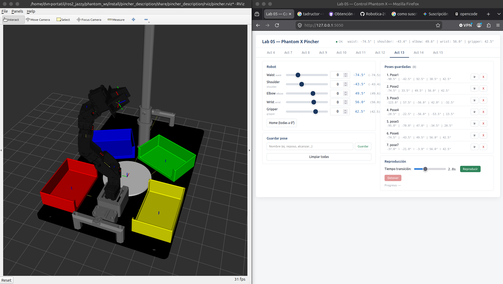

*Figura 8.1: Pantallazo de la interfaz web — pestaña Actividad 13 (Enseñanza y repetición de poses).*

</div>

### 8.3. Actividad 14 — Trazado de una figura

El trazado de figuras se implementó en dos modalidades:

**1. Interfaz web (pestaña *Trazado* en `http://localhost:5050`):**
- El usuario selecciona la figura (triángulo o cuadrado) y la dimensión del lado.
- El backend genera los vértices en el plano vertical (y–z) a `x = 0.13` m con centro en `z = 0.10` m.
- Cada vértice se resuelve mediante la función `trIk()` (JS, cinemática inversa embebida en la página web) que usa la misma geometría DH que `ik.py`.
- La función `trFk()` (JS) convierte la realimentación articular (radianes) a coordenadas cartesianas (y, z) para graficar la trayectoria real en el canvas.
- `moveToStart()` envía el robot al primer vértice y espera 600 ms antes de iniciar el trazado, para que la trayectoria real arranque desde el mismo punto.
- Los comandos se envían cada 20 ms (~90 puntos por figura). Un `setInterval(pollActual, 100)` independiente muestrea la posición real a 10 Hz.
- Al terminar, se esperan 3 s para drenar la cola ROS antes de graficar.
- Se validan los límites articulares en `trIk()` antes de enviar comandos.
- El canvas muestra la trayectoria deseada (azul) y la real (roja) superpuestas.

**2. Script CLI (`tracing.py`):**
- Ejecuta el trazado por consola y genera gráficas PNG y archivos JSON con las trayectorias.
- Compatible con simulación y hardware real.

**Entry point:** `ros2 run lab05_code tracing`

**Comportamiento verificado:** triángulo y cuadrado se trazan completos y cerrados; la trayectoria deseada y la real coinciden en el canvas.

<div align="center">

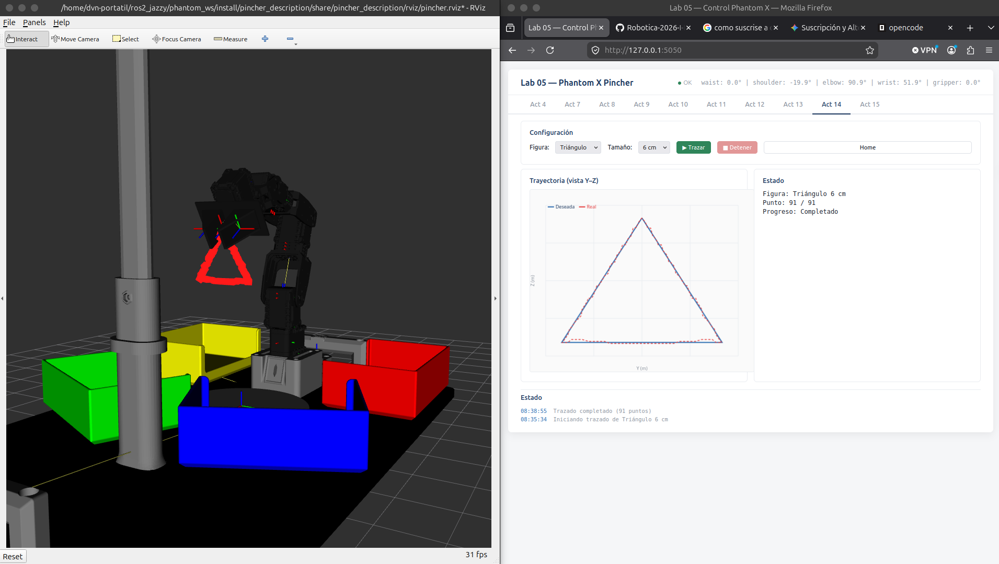

*Figura 8.2: Pantallazo de la interfaz web — pestaña Actividad 14 (Trazado de figuras).*

</div>

---

## 9. Bloque 5 — Coreografía robótica (Actividad 15)

### 9.1. Diagrama de flujo del bloque

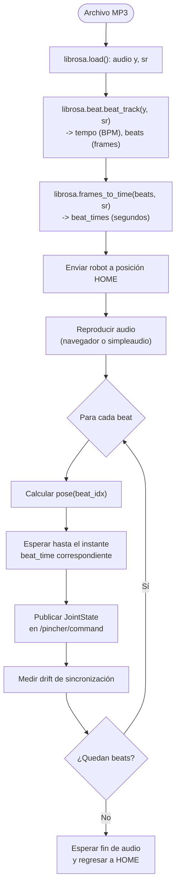
```mermaid
flowchart TD
    START([Archivo MP3]) --> LOAD["librosa.load(): audio y, sr"]
    LOAD --> BEATS["librosa.beat.beat_track(y, sr)<br/>-> tempo (BPM), beats (frames)"]
    BEATS --> TIMES["librosa.frames_to_time(beats, sr)<br/>-> beat_times (segundos)"]
    TIMES --> HOME15["Enviar robot a posición HOME"]
    HOME15 --> PLAYAUDIO["Reproducir audio<br/>(navegador o simpleaudio)"]
    PLAYAUDIO --> LOOP15{"Para cada beat"}
    LOOP15 --> POSE["Calcular pose(beat_idx)"]
    POSE --> SYNC["Esperar hasta el instante<br/>beat_time correspondiente"]
    SYNC --> PUBDANCE["Publicar JointState<br/>en /pincher/command"]
    PUBDANCE --> DRIFT["Medir drift de sincronización"]
    DRIFT --> MORE15{"¿Quedan beats?"}
    MORE15 -->|Sí| LOOP15
    MORE15 -->|No| ENDDANCE["Esperar fin de audio<br/>y regresar a HOME"]
```

### 9.2. Objetivo y especificaciones

Programar una coreografía sincronizada con una obra musical para el Phantom X Pincher X100, utilizando todas las articulaciones del robot, con detección automática de beats. La coreografía inicia y finaliza en posición segura (home), utiliza base, hombro, codo, muñeca y pinza, sincroniza los cambios de pose con los beats detectados, se mantiene dentro de configuraciones seguras y se ejecuta sin intervención manual una vez iniciada. La guía exige una duración mínima de 45 s; la implementación cubre la canción completa (~144 s).

### 9.3. Implementación

La coreografía combina el análisis de audio con `librosa` (detección de beats) y la publicación de poses en `/pincher/command` sincronizada con el ritmo. Se implementaron dos modalidades:

**Modalidad A — Interfaz web** (pestaña *Baile — Coreografía* dentro de `individual_movement.py`): el servidor HTTP expone `POST /api/dance/start` (analiza el MP3 con `librosa` o recupera el análisis de la caché `_dance_cache`, devolviendo `{tempo, total_beats, beat_times, duration, song}`), `GET /api/dance/status` (progreso del análisis) y `GET /api/dance/audio` (sirve el archivo MP3 al navegador). El audio se reproduce localmente con `HTMLAudioElement`; cada 40 ms el JavaScript compara `audio.currentTime` contra `beat_times` y, al alcanzar un beat, envía `POST /api/command` con la pose correspondiente, generada por interpolación sinusoidal entre las 5 configuraciones seguras de la Actividad 7:

```javascript
blend = 0.5 + 0.5 * sin(beatIdx / 5 * 2π)
pose[i] = lerp(presets[rawIdx].vals[i], presets[nextIdx].vals[i], blend)
```

> La ruta del MP3 está definida en la constante `DANCE_MP3` al inicio de `individual_movement.py` con una ruta absoluta del equipo de desarrollo; al replicar la práctica en otra máquina debe editarse esa constante (o mover el archivo a la misma ruta).

**Modalidad B — Script autónomo** (`choreography.py`, nodo `DanceNode`): recibe la ruta al MP3 por línea de comandos, con parámetros opcionales `--start-offset` y `--duration`. Carga el audio con `librosa`, detecta beats con `beat_track`, reproduce el audio con `simpleaudio`, y publica una pose por beat según `make_pose(beat_idx)`, que rota cíclicamente entre 8 configuraciones fijas: home y combinaciones simétricas de ±30°/±45°/±60° en base, con hombro, codo, muñeca y pinza acompañando en amplitudes crecientes. El *drift* de sincronización entre el tiempo real y el tiempo del beat se mide en cada iteración y se reporta si supera 50 ms:

```python
for i, t in enumerate(beat_times):
    sleep_needed = t - (time.time() - start_real)
    if sleep_needed > 0:
        time.sleep(sleep_needed)
    node.send(poses[i])
    drift = (time.time() - start_real) - t
```

Al finalizar la canción, el script espera a que termine la reproducción de audio (`play_obj.wait_done()`) y regresa el robot a HOME. Las 8 poses del script están definidas dentro de los límites articulares seguros por construcción.

### 9.4. Canción utilizada

| Campo | Valor |
|-------|-------|
| **Título** | Pedro — Raffaella Carrà, Jaxomy, Agatino Romero (Remix) |
| **Ubicación** | `~/ros2_jazzy/` (ver constante `DANCE_MP3`) |
| **Tempo detectado** | ~152 BPM |
| **Beats detectados** | ~359 |
| **Duración** | ~144 s |

### 9.5. Dependencias adicionales

```bash
pip install librosa simpleaudio
```

| Paquete | Propósito |
|---------|-----------|
| `librosa` | Carga de audio MP3 y detección de beats |
| `numpy` | Procesamiento de arreglos de audio |
| `simpleaudio` | Reproducción de audio (solo script autónomo) |

Estas dependencias no forman parte del `package.xml` del paquete (se instalan por `pip`), por lo que deben instalarse manualmente antes de usar la coreografía.

### 9.6. Instrucciones de uso

**Interfaz web:**

```bash
ros2 launch pincher_control pincher_system.launch.py use_hardware:=true motor_model:=ax12a
ros2 run lab05_code individual_movement
```

Abrir `http://localhost:5050`, pestaña *Baile — Coreografía*, presionar *Iniciar Baile* y esperar el análisis del audio (~5 s la primera vez; instantáneo después gracias a la caché). El audio se reproduce en el navegador y el robot se mueve al ritmo; el botón *Detener* pausa la ejecución.

**Script autónomo:**

```bash
ros2 run lab05_code choreography ~/ros2_jazzy/pedro.mp3
```

<div align="center">

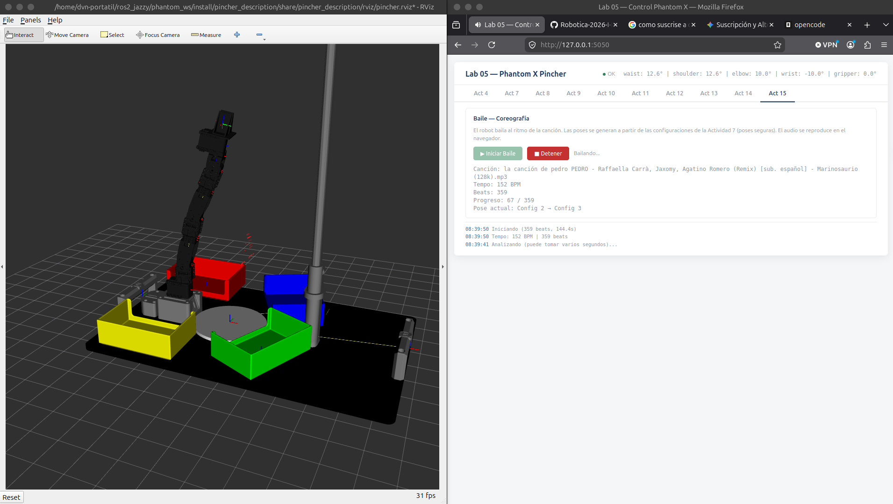

*Figura 9.1: Pantallazo de la interfaz web — pestaña Actividad 15 (Coreografía robótica).*

</div>

---

## 10. Plano de planta

El plano del Robot Phantom Pincher X100, es el siguiente:

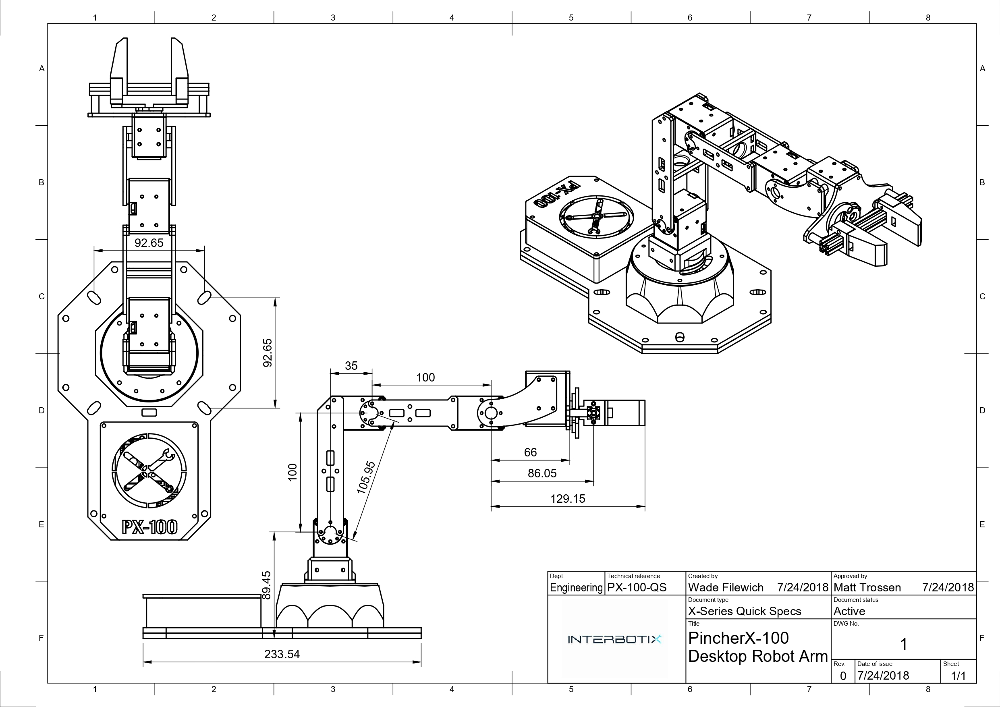


---

## 11. Estructura del repositorio

```
Laboratorio No. 05/
├── README.MD                          # Este documento (informe completo del laboratorio)
├── calibration_results/               # Resultados válidos de calibración (Actividad 5)
├── lab05_code/                        # Paquete ROS 2 con el código propio del laboratorio
│   ├── package.xml
│   ├── setup.py                       # Entry points (9 scripts registrados)
│   ├── setup.cfg
│   └── lab05_code/
│       ├── __init__.py
│       ├── individual_movement.py     # Act. 4, 7, 8, 9, 13, 14, 15: nodo + interfaz web
│       ├── calibration.py             # Act. 5: calibración de cero y error articular
│       ├── interpolation.py           # Act. 9: interpolación de trayectorias
│       ├── sinusoidal.py              # Act. 10: trayectoria sinusoidal
│       ├── fk_dh.py                   # Act. 11: cinemática directa DH
│       ├── ik.py                      # Act. 12: cinemática inversa
│       ├── tracing.py                 # Act. 14: trazado de figuras CLI
│       └── choreography.py            # Act. 15: coreografía robótica
├── pincher_control/                   # Paquete base: controlador DYNAMIXEL
│   ├── config/ax12a.yaml
│   ├── launch/pincher_system.launch.py
│   └── pincher_control/
│       ├── control_servo.py           # Nodo pincher_controller
│       ├── dynamixel_profiles.py
│       ├── pincher_gui.py
│       └── scan_dynamixel.py
└── pincher_description/               # Paquete base: modelo URDF y mallas
    ├── urdf/robot.xacro
    ├── meshes/                        # 8 mallas STL
    └── rviz/pincher.rviz
```

### 11.1. Entry points (scripts ejecutables)

| Actividad | Comando | Archivo fuente | Estado |
|:---------:|---------|-----------------|:------:|
| 4 | `ros2 run lab05_code individual_movement` (pestaña 1) | `individual_movement.py` | Implementado |
| 5 | `ros2 run lab05_code calibration` | `calibration.py` | Implementado |
| 6 | *(determinación experimental; límites en constantes)* | — | Cubierto |
| 7 | `ros2 run lab05_code individual_movement` (pestaña 2) | `individual_movement.py` | Implementado |
| 8 | `ros2 run lab05_code individual_movement` (pestaña 3) | `individual_movement.py` | Implementado |
| 9 | `ros2 run lab05_code individual_movement` (pestaña 4) + `ros2 run lab05_code interpolation` | `individual_movement.py` + `interpolation.py` | Implementado |
| 10 | `ros2 run lab05_code sinusoidal` | `sinusoidal.py` | Implementado |
| 11 | `ros2 run lab05_code fk_dh` | `fk_dh.py` | Implementado |
| 12 | `ros2 run lab05_code ik` | `ik.py` | Implementado |
| 13 | `ros2 run lab05_code individual_movement` (pestaña 5) | `individual_movement.py` | Implementado |
| 14 | `ros2 run lab05_code individual_movement` (pestaña *Trazado*) + `ros2 run lab05_code tracing` | `individual_movement.py` + `tracing.py` | Implementado |
| 15 | `ros2 run lab05_code individual_movement` (pestaña 6) + `ros2 run lab05_code choreography` | `individual_movement.py` + `choreography.py` | Implementado |

---

## 12. Video y evidencias de ejecución

### 12.1. Video del laboratorio

<div align="center">

<a href="https://youtu.be/vIU9W7cO7Kk">
  
</a>


</div>

El video recorre todas las actividades del laboratorio: algunas se muestran en simulación (`use_hardware:=false`) y otras ejecutadas sobre el robot real, incluyendo la interfaz web en funcionamiento, las gráficas de calibración e interpolación, la verificación de cinemática directa e inversa, el trazado de figuras, y la coreografía robótica sincronizada con audio.

### 12.2. Capturas y gráficas

Las gráficas de calibración (Actividad 5) están incluidas en la sección 5.3, las de interpolación (Actividad 9) en la sección 6.4, y las de trayectoria sinusoidal (Actividad 10) en la sección 6.5.

**Capturas de terminal:**

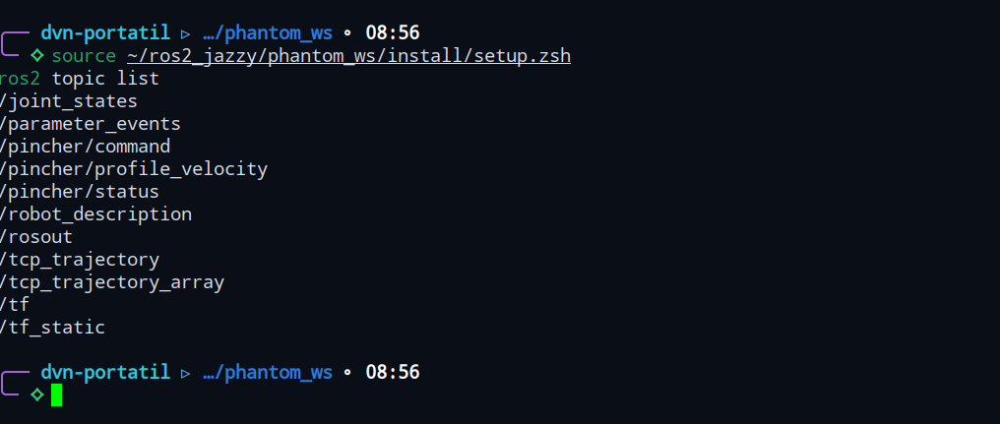

*Figura 12.1: Salida de `ros2 topic list` durante la ejecución del sistema completo.*

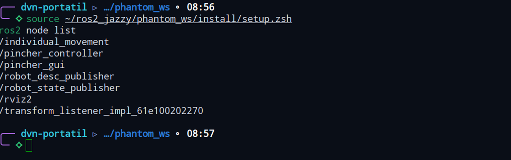

*Figura 12.2: Salida de `ros2 node list` con todos los nodos activos.*

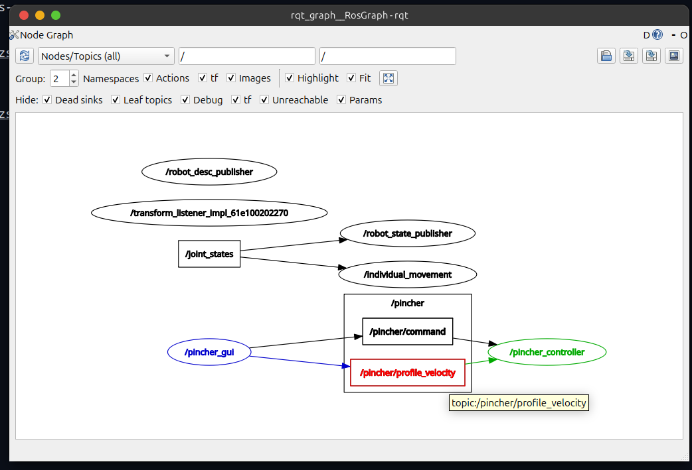

*Figura 12.3: Grafo de nodos y tópicos generado con `rqt_graph`.*


---

## 13. Conclusiones individuales


### Duvan Felipe Pacheco Rodriguez

Este laboratorio representó un reto integral que abarcó desde la configuración del entorno de desarrollo hasta la implementación de algoritmos de cinemática sobre un manipulador real. Mi participación se centró en la estructuración del repositorio, asegurando que todo el código, los paquetes de control y descripción, y los resultados experimentales estuvieran organizados dentro de una jerarquía clara por laboratorio, facilitando la navegación y replicabilidad del proyecto. Además, trabajé en la corrección de la representación geométrica del robot, ajustando el diagrama de dimensiones para reflejar fielmente la posición vertical del brazo en home, y en la validación experimental de la Actividad 8, donde medí los tiempos de ejecución simultáneo y secuencial usando el simulador y estimé el comportamiento real del robot con base en las especificaciones del AX-12A. La integración de la cinemática directa e inversa en la interfaz web, junto con el trazado de figuras en el plano vertical, me permitió comprender la importancia de cerrar el ciclo entre la teoría DH y su validación visual en tiempo real. En particular, verificar que cada solución articular respetara los límites de seguridad antes de ser enviada al robot reforzó mi criterio de diseño responsable en sistemas robóticos. En conjunto, esta experiencia consolidó mi capacidad para diagnosticar, documentar y resolver problemas en un flujo de trabajo real con ROS 2.

### Juan Andres Mora Henao

El desarrollo de este laboratorio me permitió consolidar competencias fundamentales en el control y programación de manipuladores seriales mediante ROS 2, integrando conceptos teóricos de cinemática con su implementación sobre un sistema robótico real. La construcción de nodos propios, la comunicación mediante tópicos y servicios, la validación de trayectorias y el trabajo con el modelo del Phantom X Pincher X100 fortalecieron mi comprensión de la arquitectura de software utilizada en aplicaciones modernas de robótica, así como la importancia de diseñar soluciones seguras, modulares y escalables para el control de sistemas mecatrónicos.

### Andres Gustavo Pinilla Martinez

Este laboratorio me permitió pasar de la teoría de cinemática directa e inversa a su implementación real sobre un manipulador físico, lo cual expuso detalles que no siempre son evidentes en el papel: el offset de calibración de cada servomotor, las limitaciones reales de alcance del brazo al combinar orientación y posición, y la importancia de verificar cada solución articular contra los límites de seguridad antes de ejecutarla. Trabajar con ROS 2 Jazzy reforzó mi comprensión de cómo estructurar un sistema de control en nodos independientes que se comunican mediante tópicos y servicios, en lugar de escribir un solo script monolítico, lo que facilitó probar cada actividad por separado y reutilizar el mismo módulo de cinemática en varias tareas. También quedó claro el valor de simular y validar una trayectoria antes de correrla en el robot real, especialmente en las actividades de trazado y calibración, donde un error de signo o de límite puede traducirse directamente en un movimiento inseguro. En general, esta práctica fortaleció tanto mis habilidades técnicas en robótica como mi disciplina para documentar y verificar cada paso del proceso.

---

## 14. Referencias

1. LabSIR UN. (2026). *06_Rob_2026_I_ROS2_Jazzy_PhantomX100_RVIZ*. GitHub. https://github.com/labsir-un/06_Rob_2026_I_ROS2_Jazzy_PhantomX100_RVIZ.git
2. LabSIR UN. (2026). *KIT_Phantom_X_Pincher_ROS2*. GitHub. https://github.com/labsir-un/KIT_Phantom_X_Pincher_ROS2.git
3. LabSIR UN. (2026). *3DModels_KIT_Phantom_Pincher_X100*. GitHub. https://github.com/labsir-un/3DModels_KIT_Phantom_Pincher_X100.git
4. Robotis. (2010). *AX-12A Dynamixel Servo Manual*. https://emanual.robotis.com/docs/en/dxl/ax/ax-12a/
5. Open Robotics. (2025). *ROS 2 Jazzy Jalisco Documentation*. https://docs.ros.org/en/jazzy/
6. McFee, B., et al. *librosa: Audio and Music Signal Analysis in Python*. https://librosa.org/

---

## Autores

<div align="center">

| Integrante | GitHub |
|---|---|
| **Duvan Felipe Pacheco Rodriguez** | <a href="https://github.com/dupachecor"></a> |
| **Juan Andres Mora Henao** | <a href="https://github.com/JuanMora345"></a> |
| **Andres Gustavo Pinilla Martinez** | <a href="https://github.com/AndresPinilla20"></a> |

</div>

<div align="center">


</div>
