<div align="center">


<a href="https://new.abb.com/products/robotics/robotstudio"></a>
<a href="https://new.abb.com/products/robotics/robots/articulated-robots/irb-140"></a>
<a href="https://www.arduino.cc/"></a>
<a href=""></a>
<a href="https://www.solidworks.com/"></a>

</div>

---

<div align="center">

```
╔══════════════════════════════════════════════════════════════════╗
║   Etapa 4 — Embalaje y Envio por Banda — ABB IRB 140 "Abel"   ║
║   Gripper SG90  ·  Arduino Uno  ·  RAPID  ·  RobotStudio       ║
╚══════════════════════════════════════════════════════════════════╝
```

</div>

> **Resumen del proyecto:** Automatizacion de la estacion de empaque dentro de la linea simulada de ensamblaje, soldadura y empaque de PCBs. Proyecto final del curso *Robotica Industrial 2026-I* &mdash; Universidad Nacional de Colombia.

---

# Proyecto Final &mdash; Robotica Industrial 2026-I

## Etapa 4: Embalaje y Envio por Banda &mdash; Robot ABB IRB 140 "Abel"

Automatizacion de la estacion de empaque dentro de la linea simulada de ensamblaje,
soldadura y empaque de PCBs.

---

## Tabla de Contenido

1. [Informacion General](#1-informacion-general)
2. [Descripcion de la Estacion](#2-descripcion-de-la-estacion)
3. [Diseno Mecanico](#3-diseno-mecanico)
4. [Diseno de la Herramienta (Gripper)](#4-diseno-de-la-herramienta-gripper)
5. [Diseno Electronico y de Potencia](#5-diseno-electronico-y-de-potencia)
6. [Firmware del Controlador de la Herramienta](#6-firmware-del-controlador-de-la-herramienta)
7. [Programacion del Robot (RAPID)](#7-programacion-del-robot-rapid)
8. [Diagramas de Flujo del Proceso](#8-diagramas-de-flujo-del-proceso)
9. [Maquinas de Estados](#9-maquinas-de-estados)
10. [Simulacion vs. Planta Real](#10-simulacion-vs-planta-real)
11. [Manejo de Fallas](#11-manejo-de-fallas)
12. [Interfaz de Supervision (UART)](#12-interfaz-de-supervision-uart)
13. [Interfaz Grafica HMI](#13-interfaz-grafica-hmi)
14. [Estructura del Repositorio](#14-estructura-del-repositorio)
15. [Instrucciones de Puesta en Marcha](#15-instrucciones-de-puesta-en-marcha)
16. [Seguridad](#16-seguridad)
17. [Conclusiones](#17-conclusiones)
18. [Referencias](#18-referencias)

---

## 1. Informacion General

### 1.1. Datos del proyecto

| Campo | Descripcion |
|-------|-------------|
| Asignatura | Robotica &mdash; 2026-I |
| Institucion | Universidad Nacional de Colombia |
| Proyecto | Automatizacion del proceso de ensamblaje, soldadura y empaque de PCBs |
| Estacion asignada | Etapa 4 &mdash; Embalaje y envio por banda |
| Robot | ABB IRB 140 "Abel" (Robot ABB #2) |
| Controlador | IRC5 |
| Lenguaje de programacion | RAPID |
| Software de simulacion | RobotStudio 2021 |
| Microcontrolador | Arduino Uno R3 (ATmega328P) |
| Herramienta | Gripper paralelo impreso en 3D, actuado por servomotor SG90 |

### 1.2. Integrantes del equipo

| Nombre | Rol / responsabilidad principal |
|--------|--------------------------------|
| Duvan Felipe Pacheco Rodriguez | **Lider del proyecto** &mdash; Arquitectura del sistema electronico (LM2596, PC817, reles), firmware Arduino Uno, desarrollo de la HMI (Web Serial API), programacion RAPID del robot ABB IRB 140, integracion Arduino-IRC5 y documentacion tecnica |
| Juan Andres Mora Henao | Diseno CAD de la estacion (SolidWorks/SAT), modelado del gripper paralelo y los soportes de la banda transportadora, simulacion en RobotStudio y pruebas de validacion |
| Andres Gustavo Pinilla Martinez | Diseno CAD de la estacion (SolidWorks/SAT), montaje mecanico, ensamble del gripper, puesta a punto y asistencia en el ensamble general de la estacion |

### 1.3. Objetivos

**Objetivo general**

Automatizar la recepcion, empaque y envio por banda de PCBs terminadas provenientes
de la Etapa 3 (soldadura), cerrando la linea de produccion con una estacion robotica
completamente funcional que integra control electronico, firmware embebido, programacion
RAPID y simulacion en RobotStudio.

**Objetivos especificos**

- Disenar y construir una herramienta (gripper) capaz de manipular la PCB terminada
  mediante agarre lateral, compatible con la brida del IRB 140.
- Disenar e implementar la etapa electronica de conversion y aislamiento entre las
  salidas digitales de 24 V del IRC5 y el servomotor SG90 de 5 V.
- Desarrollar el firmware del Arduino Uno para decodificar comandos, controlar el
  servo con movimiento suave y reportar estado en tiempo real.
- Programar en RAPID la secuencia completa de la Etapa 4 (calibracion, ciclo de
  produccion, manejo de banda transportadora).
- Validar el sistema mediante simulacion en RobotStudio.

---

## 2. Descripcion de la Estacion

### 2.1. Funcion dentro de la linea

La Etapa 4 constituye el cierre de la linea de produccion. Recibe la PCB ya soldada
proveniente de la Etapa 3 (robot Yaskawa Motoman MH6 "El Chambeador"), realiza el
empaque de dos PCBs en cajas individuales que avanzan sobre una banda transportadora,
y envia el lote completo hacia la salida.

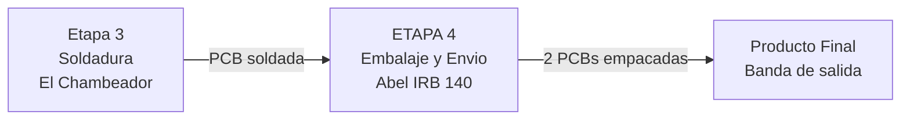

### 2.2. Componentes fisicos de la estacion

| Elemento | Descripcion | Modelo CAD |
|----------|-------------|------------|
| Robot ABB IRB 140 | Brazo robotico de 6 ejes, carga util 5 kg | Incluido en RobotStudio |
| Mesa de trabajo | Superficie donde se ubican las PCBs para recoger | `Mesa.sat` |
| Pedestal del robot | Base de montaje del IRB 140 | `Pedestal.sat` |
| Banda transportadora | Transporta las cajas de empaque hacia y desde el robot | `Banda tranportadora.sat` |
| Soportes de la banda | Soportes disenados para el cierre y guia de las cajas sobre la banda | `Banda tranportadora.sat` |
| Caja de empaque | Contenedor donde se deposita cada PCB | `caja.sat` |
| PCB | Placa de circuito impreso a manipular (2 por ciclo) | `pcb.sat` |
| Gripper | Herramienta de sujecion montada en la brida del robot | `gripper2.zip` |

<p align="center">
  
  <br/>
  <em>Figura 1. PCBs ubicadas en las dos posiciones de entrega sobre la mesa de trabajo.</em>
</p>

### 2.3. Soportes de la banda transportadora

Para garantizar que las cajas de empaque permanezcan correctamente posicionadas
y alineadas durante el ciclo de produccion, se disenaron **soportes laterales**
integrados al modelo CAD de la banda transportadora. Estos soportes cumplen tres
funciones:

1. **Guia lateral**: mantienen las cajas centradas sobre la banda durante el
   avance, evitando que se desalineen por vibracion o inercia.
2. **Tope de posicionamiento**: definen la posicion exacta de parada de cada caja
   frente al robot, asegurando repetibilidad en el punto de deposito.
3. **Cierre de caja**: ejercen presion lateral controlada sobre las solapas de la
   caja, facilitando el cierre una vez la PCB ha sido depositada en su interior.

Los soportes estan modelados como parte integral del archivo `Banda tranportadora.sat`
y se ubican a ambos lados de la banda, a la altura de la zona de trabajo del robot.

<p align="center">
  
  &nbsp;&nbsp;
  
  <br/>
  <em>Figura 2. Soportes laterales integrados a la banda (izq.) y caja cerr&aacute;ndose por acci&oacute;n de los soportes (der.).</em>
</p>

### 2.4. Entradas y salidas de la estacion

| Concepto | Detalle |
|----------|---------|
| Entrada fisica | PCB soldada, ubicada en dos posiciones fijas sobre la mesa |
| Insumos | Cajas de empaque sobre banda transportadora |
| Salida fisica | PCBs empacadas depositadas en cajas sobre la banda de salida |
| Entradas digitales | DI_01 (inicio de ciclo), DI_02 (calibracion), DI_03 (reservada), DI_04 (gripOK), DI_05 (home remoto), DI_06 (start remoto) |
| Salidas digitales | DO_01 al DO_03 (senalizacion luminosa), DO_04 (comando gripper), DO_05 (reservada), DO_06 (falla), FWD_Conveyor, BWD_Conveyor |

### 2.5. Secuencia general del ciclo de produccion

Cada ciclo completo procesa **2 PCBs** en **2 cajas**:

1. **Avance de banda**: la banda transportadora avanza durante 5 s, posicionando la
   Caja 1 frente al robot.
2. **Pick PCB 1**: el robot se desplaza a la posicion de la PCB 1 sobre la mesa,
   cierra el gripper y la recoge.
3. **Place PCB 1 en Caja 1**: el robot lleva la PCB hasta la caja sobre la banda y
   la deposita.
4. **Avance de banda**: la banda avanza otros 5 s, evacuando la Caja 1 llena y
   trayendo la Caja 2 vacia.
5. **Pick PCB 2**: el robot recoge la segunda PCB de su posicion en la mesa.
6. **Place PCB 2 en Caja 2**: deposito en la segunda caja.
7. **Expulsion**: la banda avanza durante 6 s para evacuar el lote completo.
8. **Home**: el robot regresa a la posicion de reposo y espera una nueva orden.

Antes del ciclo productivo, el operario puede ejecutar un **modo de calibracion**
activando DI_02, que hace avanzar la banda 3.8 s y luego retroceder 5 s para
posicionar la primera caja en la marca inicial.

---

## 3. Diseno Mecanico

### 3.1. Elementos modelados en CAD

Todos los componentes pasivos de la estacion fueron modelados en formato SAT
(Standard ACIS Text) e importados a RobotStudio para la simulacion:

| Archivo | Descripcion | Tamano |
|---------|-------------|:------:|
| `Mesa.sat` | Mesa de trabajo con dos zonas de entrega de PCB | 44 KB |
| `Pedestal.sat` | Base de montaje del robot IRB 140 | 13 KB |
| `Banda tranportadora.sat` | Banda transportadora con rodillos y soportes laterales | 89 KB |
| `caja.sat` | Caja de empaque individual | 38 KB |
| `pcb.sat` | Placa de circuito impreso con pestanas de agarre | 278 KB |
| `gripper2.zip` | Gripper paralelo completo (comprimido) | 34 MB |

### 3.2. Disposicion en planta

La estacion se organiza alrededor del robot IRB 140 montado sobre su pedestal.
Frente al robot se ubica la banda transportadora, que corre perpendicular al plano
frontal del robot. A un costado se situa la mesa de trabajo con las dos posiciones
de entrega de PCB.

El gripper se monta directamente sobre la brida del eje 6 del robot mediante un
acople disenado a medida.

<p align="center">
  
  <br/>
  <em>Figura 3. Vista en planta de la estacion: robot IRB 140, banda transportadora y mesa de trabajo.</em>
</p>

<p align="center">
  
  <br/>
  <em>Figura 4. Estacion completa con el robot ABB IRB 140 y el gripper montado.</em>
</p>

---

## 4. Diseno de la Herramienta (Gripper)

### 4.1. Tipo y principio de funcionamiento

<p align="center">
  
  <br/>
  <em>Figura 6. Modelado CAD del gripper paralelo de dos dedos.</em>
</p>

Se diseno un **gripper paralelo de dos dedos**, impreso en 3D, basado en un
mecanismo de cuatro barras que convierte el movimiento rotatorio de un servomotor
SG90 en desplazamiento lineal simultaneo y opuesto de ambos dedos, garantizando
un agarre centrado y simetrico. El diseno fue modelado en SolidWorks y fabricado
mediante impresion 3D en PLA.

### 4.2. Actuador

| Parametro | Valor |
|-----------|-------|
| Modelo | TowerPro SG90 |
| Torque maximo | 1.8 kg&middot;cm (a 4.8 V) |
| Rango de operacion | 0&deg; a 180&deg; |
| Senal de control | PWM, 50 Hz (periodo 20 ms) |
| Alimentacion | 5 V DC |
| Engranajes | Plasticos (limitacion: sin realimentacion de posicion ni control de fuerza) |

<p align="center">
  
  &nbsp;&nbsp;
  
  <br/>
  <em>Figura 6. Gripper montado sobre la brida del IRB 140 (izq.) y sujetando la PCB por sus pestanas laterales (der.).</em>
</p>

### 4.3. Angulos de operacion calibrados

Los angulos fueron determinados experimentalmente sobre el gripper impreso:

| Estado | Angulo servo (°) | Aplicacion |
|--------|:----------------:|------------|
| Abierto | 10 | Reposo, aproximacion y suelta de la PCB |
| Cerrado | 100 | Sujecion firme de la PCB por sus pestanas laterales |

La diferencia de 90&deg; entre abierto y cerrado proporciona una carrera suficiente
para rodear la PCB en aproximacion y ejercer presion de agarre al cerrar.

### 4.4. Movimiento suave

Para evitar tirones que pudieran desplazar o danar la PCB, el firmware implementa
un movimiento incremental de **2&deg; por paso** con un intervalo de **15 ms** entre
pasos. Esto produce un cierre progresivo que toma aproximadamente 675 ms en completar
los 90&deg; de recorrido.

### 4.5. Liberacion del servo en reposo

Cuando el gripper esta abierto y no hay comando de cierre activo, el firmware libera
el servo (funcion `detach()`) tras 800 ms de inactividad. Esto evita el zumbido
caracteristico del SG90 y reduce el calentamiento de los embobinados durante los
periodos de espera entre ciclos.

---

## 5. Diseno Electronico y de Potencia

### 5.1. Problema de compatibilidad

El controlador IRC5 entrega salidas digitales de **24 V DC** (ON/OFF), mientras que
el servomotor SG90 requiere una senal **PWM de 5 V a 50 Hz**. Es necesaria una etapa
intermedia que realice:

1. Conversion de nivel de tension (24 V &rarr; 5 V).
2. Aislamiento galvanico entre el controlador del robot y el circuito del gripper.
3. Generacion de la senal PWM para el servo.
4. Retorno de senales de estado hacia el IRC5 (a traves de contactos secos).

### 5.2. Arquitectura de la solucion

```
                  ZONA 24 V (IRC5)                     ZONA 5 V (Arduino)
                 ==================                  ======================

DO_04 (24V) ----[R 2.2k]---->| PC817 |----> D2 (INPUT)        D9 (PWM) ----> SG90
                                   |
DO_06 (24V) ----[R 2.2k]---->| PC817 |----> D4 (INPUT)        D5 ----> RELAY ----> DI_04 (gripOK)
                                                                       (contacto seco)
D13 (LED)                                              D6 ----> RELAY ----> DI_05 (home)
                                                                       (contacto seco)
                                                       D7 ----> RELAY ----> DI_06 (start)
                                                                       (contacto seco)

ALIMENTACION: LM2596 (24V -> 5V) ----> Arduino VIN + Servo VCC
                                        |
                                       GND comun
```

<p align="center">
  
  <br/>
  <em>Figura 9. Circuito electronico: Arduino Uno, modulo LM2596, optoacopladores PC817 y modulo de reles.</em>
</p>

### 5.3. Esquematico de conexionado completo

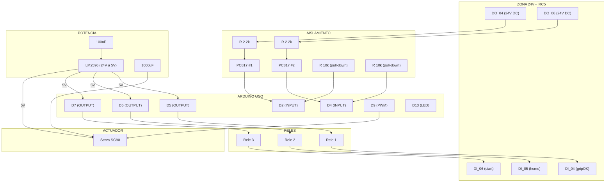

### 5.4. Componentes principales

| Componente | Referencia | Cant. | Funcion |
|------------|------------|:-----:|--------|
| Microcontrolador | Arduino Uno (ATmega328P) | 1 | Logica de control, generacion PWM, comunicacion |
| Servomotor | TowerPro SG90 | 1 | Actuador del gripper |
| Convertidor DC-DC | LM2596 step-down ajustable | 1 | Reduce 24 V a 5 V para alimentar Arduino y servo |
| Optoacoplador | PC817 | 2 | Aislamiento galvanico de senales DO_04 y DO_06 |
| Modulo de reles | 3 canales, 5 V | 1 | Contactos secos para DI_04, DI_05, DI_06 |
| Resistencia | 2.2 k&Omega;, 1/2 W | 2 | Limitacion de corriente en LED del PC817 |
| Resistencia | 10 k&Omega;, 1/4 W | 2 | Pull-down en entradas D2 y D4 |
| Condensador | 1000 &micro;F / 16 V | 1 | Filtro en alimentacion del servo |
| Condensador | 100 nF | 1 | Desacople en alimentacion del Arduino |

### 5.5. Aislamiento galvanico

Las senales DO_04 y DO_06 del IRC5 ingresan a los optoacopladores PC817 a traves
de resistencias limitadoras de 2.2 k&Omega;. Cuando el IRC5 activa una salida (24 V),
el LED interno del PC817 conduce, saturando el fototransistor de salida y llevando
el pin del Arduino a nivel alto (5 V). Esto proporciona aislamiento electrico completo
entre los 24 V industriales del controlador y los 5 V del circuito de control,
protegiendo el Arduino frente a transitorios y fallas.

En las entradas D2 y D4 del Arduino se utilizan resistencias externas de pull-down
de 10 k&Omega; (no se activa `INPUT_PULLUP`). Esto garantiza que, en ausencia de
senal del optoacoplador, el pin lea un nivel bajo estable (0 V), evitando falsas
lecturas por ruido electromagnetico.

### 5.6. Retorno de senales al IRC5

Las salidas del Arduino hacia el IRC5 (DI_04, DI_05, DI_06) utilizan **reles de
contacto seco**. Esto significa que el Arduino no impone ningun nivel de tension
sobre las entradas del IRC5; simplemente cierra o abre un circuito. El modulo de
reles empleado opera con logica activa en alto (`RELE_ON = HIGH`).

- **DI_04 (gripOK)**: senal de **nivel**. Permanece activa mientras el gripper esta
  en la posicion comandada. Se desactiva en cuanto se ordena un nuevo movimiento.
- **DI_05 (home)**: senal de **pulso** (300 ms). Indica al programa RAPID que debe
  ejecutar la rutina de ir a HOME.
- **DI_06 (start)**: senal de **pulso** (300 ms). Indica al programa RAPID que debe
  iniciar un ciclo de produccion.

### 5.7. Alimentacion

La alimentacion del sistema se toma de la fuente de 24 V DC disponible en el
controlador IRC5 o en el armario electrico del puesto de trabajo. El modulo LM2596
se ajusta a **5.0 V** (verificado con multimetro antes de conectar carga) y alimenta
simultaneamente el Arduino (por el pin VIN) y el servomotor SG90.

Se incluye un condensador electrolitico de 1000 &micro;F en paralelo con la
alimentacion del servo para absorber los picos de corriente durante el arranque
del motor, y un condensador ceramico de 100 nF para filtrar ruido de alta frecuencia.

### 5.8. Mapa completo de pines del Arduino Uno

| Pin Arduino | Modo | Conectado a | Senal | Tipo |
|-------------|------|-------------|-------|------|
| D2 | INPUT | PC817 #1 (desde DO_04 IRC5) | do_grip | Nivel 5V |
| D4 | INPUT | PC817 #2 (desde DO_06 IRC5) | do_fault | Nivel 5V |
| D5 | OUTPUT | Rele #1 (hacia DI_04 IRC5) | di_gripOK | Nivel (contacto seco) |
| D6 | OUTPUT | Rele #2 (hacia DI_05 IRC5) | di_home | Pulso 300 ms |
| D7 | OUTPUT | Rele #3 (hacia DI_06 IRC5) | di_start | Pulso 300 ms |
| D9 | OUTPUT | Servo SG90 (cable naranja) | PWM 50 Hz | Senal de control |
| D13 | OUTPUT | LED integrado placa | Diagnostico | Indicador |
| VIN | POWER | Salida 5V del LM2596 | Alimentacion | 5 V DC |
| GND | POWER | Tierra comun | Referencia | 0 V |

### 5.9. Senales no gestionadas por el Arduino

Las siguientes senales se utilizan en el programa RAPID pero no pasan por el Arduino;
estan cableadas directamente en el puesto de trabajo:

| Senal | Tipo | Uso |
|-------|------|-----|
| DO_01 | Salida | Bombillo indicador (destello al finalizar ciclo) |
| DO_02 | Salida | Reservada para senalizacion |
| DO_03 | Salida | Reservada para senalizacion |
| DI_01 | Entrada | Boton de inicio de ciclo de produccion |
| DI_02 | Entrada | Boton de modo calibracion de banda |
| DI_03 | Entrada | Reservada |

---

## 6. Firmware del Controlador de la Herramienta

**Archivo**: `firmware/gripper_control/gripper_control.ino`

### 6.1. Descripcion general

El firmware corre sobre un Arduino Uno y actua como puente entre las senales
digitales ON/OFF del IRC5 y el servomotor SG90. Su funcion principal es leer las
entradas provenientes del optoacoplador, interpretar el comando, mover el servo
de forma controlada y devolver senales de confirmacion al robot.

### 6.2. Estructura del programa

El `loop()` principal ejecuta siete tareas de forma no bloqueante (basadas en
`millis()`), sin usar `delay()`:

| Funcion | Proposito |
|---------|-----------|
| `leerEntradas()` | Lee DO_04 y DO_06 con filtro antirrebote de 30 ms |
| `moverServo()` | Avanza el servo 2&deg; por paso cada 15 ms |
| `gestionarGripOK()` | Activa/desactiva DI_04 segun coincidencia posicion |
| `gestionarDetach()` | Libera el servo tras 800 ms en posicion abierta |
| `gestionarPulsos()` | Cierra los pulsos de DI_05/DI_06 al cumplir 300 ms |
| `enviarTelemetria()` | Publica trama de estado cada 500 ms |
| `atenderSerie()` | Procesa comandos de supervision por USB/UART |

### 6.3. Parametros configurables

| Constante | Valor | Descripcion |
|-----------|:-----:|-------------|
| `angAbierto` | 10 | Angulo de apertura total (reposo) |
| `angCerrado` | 100 | Angulo de cierre para sujecion de PCB |
| `T_DEBOUNCE` | 30 ms | Tiempo de filtro antirrebote en entradas |
| `T_DETACH` | 800 ms | Espera antes de liberar el servo en reposo |
| `T_PULSO` | 300 ms | Duracion del pulso enviado a DI_05 y DI_06 |
| `T_TELEMETRIA` | 500 ms | Periodo de envio de la trama de estado |
| `PASO_GRADOS` | 2 | Incremento angular por paso |
| `T_PASO` | 15 ms | Intervalo entre pasos consecutivos |

### 6.4. Protocolo de comando (1 bit)

A diferencia del diseno preliminar que contemplaba 2 bits para tres aperturas, la
implementacion final utiliza un esquema simplificado de **1 bit** sobre DO_04:

| DO_04 | Comando | Angulo servo |
|:-----:|---------|:------------:|
| 0 | Abrir gripper | 10&deg; |
| 1 | Cerrar gripper | 100&deg; |

El bit de falla (DO_06) es monitoreado por el Arduino pero **no modifica el
comportamiento del gripper**; el Arduino simplemente retransmite el evento a la
interfaz de supervision para registro.

### 6.5. Secuencia de arranque

1. Configura pines de entrada (D2, D4) sin pull-up interna.
2. Fuerza las salidas de rele a reposo (OFF) para evitar comandos espurios.
3. Inicia comunicacion serie a 9600 baudios.
4. Acopla el servo y lo posiciona en 10&deg; (abierto).
5. Espera 500 ms para que el servo alcance la posicion.
6. Activa DI_04 (gripOK) indicando que el gripper esta listo.
7. Entra al bucle principal.

### 6.6. Antirrebote y estabilidad

Las entradas D2 y D4 incorporan un filtro antirrebote por software de 30 ms. Una
transicion solo se considera valida si la nueva lectura se mantiene estable durante
al menos ese tiempo. Esto elimina falsos disparos por rebotes mecanicos en los
optoacopladores o ruido conducido desde el controlador.

### 6.7. Buffer de recepcion serie

Para evitar fragmentacion de heap (el ATmega328P solo dispone de 2 KB de SRAM),
el firmware utiliza un buffer de caracteres de tamano fijo (24 bytes) en lugar de
la clase `String` de Arduino. Los caracteres que exceden la capacidad del buffer
se descartan silenciosamente para prevenir desbordamiento.

---


## 7. Programacion del Robot (RAPID)

### 7.1. Estructura del programa

**Archivo**: `rapid/Module1.mod`

El programa RAPID se organiza en un unico modulo (`Module1`) que contiene todas
las rutinas necesarias para la operacion de la Etapa 4.

### 7.2. Herramienta y objetos de trabajo

| Elemento | Variable | Descripcion |
|----------|----------|-------------|
| Herramienta | `toolGripper` | TCP definido a 120 mm en Z desde la brida, con offset en X e Y |
| Objeto de trabajo 1 | `wobj_Mesa` | Sistema de coordenadas de la mesa de PCBs |
| Objeto de trabajo 2 | `wobj_Banda` | Sistema de coordenadas de la banda transportadora |

### 7.3. Posiciones ensenadas (targets)

| Target | X (mm) | Y (mm) | Z (mm) | Proposito |
|--------|:------:|:------:|:------:|-----------|
| `Home_ABS` | 0&deg; (todas articulaciones) | | | Posicion de reposo absoluta |
| `pPCB1_Approach` | 96 | -439 | 425 | Aproximacion a PCB 1 (60 mm arriba) |
| `pPCB1Grab` | 96 | -439 | 345 | Agarre de PCB 1 |
| `pPCB2_Approach` | 96 | -549 | 425 | Aproximacion a PCB 2 (60 mm arriba) |
| `pPCB2Grab` | 96 | -549 | 345 | Agarre de PCB 2 |
| `pCajaApproach` | 582 | 63.5 | 488 | Aproximacion a caja sobre banda |
| `pCajaPlace` | 582 | 63.5 | 158 | Deposito de PCB dentro de la caja |

Todas las posiciones de agarre estan desplazadas +60 mm en Z respecto al punto
original, para compensar la longitud de la herramienta y evitar colisiones.

### 7.4. Configuracion de senales E/S

**Archivo**: `rapid/EIO.cfg`

Las senales se mapean sobre una placa **d652** en bus DeviceNet con direccion 10:

| Senal | Tipo | Canal fisico | Proposito |
|-------|------|:------------:|-----------|
| `DI_01` | DI | 0 | Boton inicio ciclo de produccion |
| `DI_02` | DI | 1 | Boton modo calibracion de banda |
| `DI_03` | DI | 2 | Reservada |
| `DI_04` | DI | 3 | Confirmacion gripOK desde Arduino |
| `DI_05` | DI | 4 | Comando remoto HOME desde Arduino |
| `DI_06` | DI | 5 | Comando remoto START desde Arduino |
| `DO_01` | DO | 0 | Senalizacion luminosa (destello fin de ciclo) |
| `DO_02` | DO | 1 | Reservada |
| `DO_03` | DO | 2 | Reservada |
| `DO_04` | DO | 3 | Comando de gripper (0=abrir, 1=cerrar) |
| `DO_05` | DO | 4 | Reservada |
| `DO_06` | DO | 5 | Bit de falla (informa estado de error al Arduino) |
| `FWD_Conveyor` | DO | 6 | Avance de banda transportadora |
| `BWD_Conveyor` | DO | 7 | Retroceso de banda transportadora |

### 7.5. Parametros de temporizacion

| Constante | Valor | Uso |
|-----------|:-----:|-----|
| `T_AVANCE_CAJA` | 5 s | Tiempo de avance para posicionar cada caja |
| `T_SONDEO` | 2 s | Intervalo de espera entre comprobaciones |
| `T_RETROCESO` | 5 s | Tiempo de retroceso en calibracion |
| `T_PASO` | 5 s | Avance incremental en posicionamiento fino |

### 7.6. Bucle principal (main)

```
1. Configurar monitor de configuracion (ConfL\On, ConfJ\On, SingArea\Off).
2. Resetear banda transportadora.
3. Ir a HOME.
4. Bucle infinito:
   a. Si DI_01 = 1 -> ejecutar ciclo de produccion.
   b. Si DI_02 = 1 -> ejecutar modo calibracion.
   c. Esperar 200 ms.
```

### 7.7. Modo calibracion (ModoCalibracion)

Se activa mediante DI_02. Su proposito es posicionar la primera caja exactamente
en la marca de inicio sobre la banda:

1. Avance de banda durante 3.8 s (posiciona una caja de referencia).
2. Espera a que DI_02 vuelva a 0.
3. (La rutina `CalibrarBanda` complementaria retrocede 5 s para ajuste fino).

### 7.8. Ciclo de produccion (CicloProduccion)

Se activa mediante DI_01. Procesa un lote de 2 PCBs:

1. `Set FWD_Conveyor`, `WaitTime 5` &mdash; la banda avanza, trayendo la Caja 1.
2. `TomarPCB 1` &mdash; recoge la PCB 1 de la mesa.
3. `DepositarEnCaja` &mdash; deposita la PCB en la Caja 1.
4. `Set FWD_Conveyor`, `WaitTime 5` &mdash; la banda avanza, Caja 2 en posicion.
5. `TomarPCB 2` &mdash; recoge la PCB 2 de la mesa.
6. `DepositarEnCaja` &mdash; deposita la PCB en la Caja 2.
7. `Set FWD_Conveyor`, `WaitTime 6` &mdash; expulsion del lote completo.
8. `IrAHome` &mdash; regreso a posicion segura.
9. Espera a que DI_01 = 0 antes de aceptar un nuevo ciclo.

### 7.9. Rutinas de movimiento

**TomarPCB(num nPCB)**

1. Abre el gripper (`AbrirGripper`: `SetDO DO_04,0`, espera 1 s).
2. Segun `nPCB` (1 o 2), se desplaza con `MoveJ` a la posicion de aproximacion
   (v300, zona 20), luego con `MoveL` a la posicion de agarre (v50, fine).
3. Cierra el gripper (`CerrarGripper`: `SetDO DO_04,1`, espera 1 s).
4. Retrocede con `MoveL` a la posicion de aproximacion (v100, zona 20).

**DepositarEnCaja**

1. `MoveJ` a `pCajaApproach` (v300, zona 10).
2. `MoveL` a `pCajaPlace` (v50, fine).
3. Abre el gripper (`SetDO DO_04,0`, espera 1 s).
4. Retrocede con `MoveL` a `pCajaApproach` (v100, fine).

**IrAHome**

1. Abre el gripper.
2. `MoveAbsJ` a `Home_ABS` (v300, fine) con la herramienta `toolGripper`.

### 7.10. Rutinas auxiliares

El programa incluye rutinas adicionales para manejo de parada de emergencia y
senalizacion:

| Rutina | Funcion |
|--------|---------|
| `VerificarParada` | Detiene banda, va a HOME, abre gripper (respuesta a parada) |
| `SenalarDone` | Destello en DO_01 (250 ms ON, 250 ms OFF) al finalizar ciclo |
| `PosicionarCaja` | Avance fino de la banda por `T_PASO` segundos |
| `CalibrarBanda` | Retrocede la banda `T_RETROCESO` segundos |
| `CerrarSobrePCB` / `CerrarSobreCaja` | Comandos alternativos de gripper (compatibilidad) |

---

## 8. Diagramas de Flujo del Proceso

### 8.1. Flujo principal del sistema

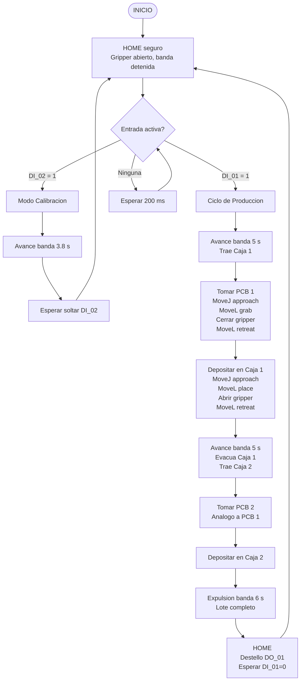

### 8.2. Flujo detallado: Pick and Place

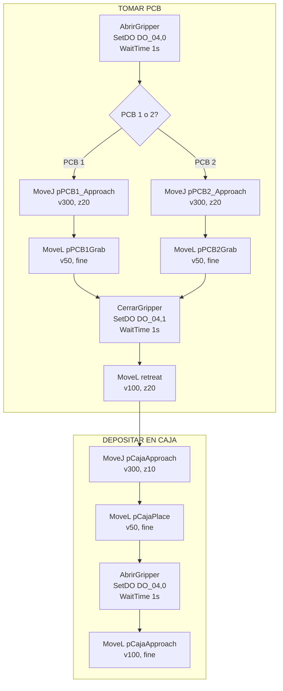

### 8.3. Flujo del firmware Arduino

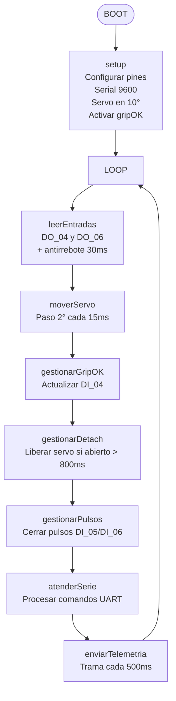

---

## 9. Maquinas de Estados

### 9.1. Maquina de estados del firmware Arduino

El firmware del Arduino implementa una maquina de estados implicita gobernada
por el comando recibido desde el IRC5 y la posicion actual del servo.

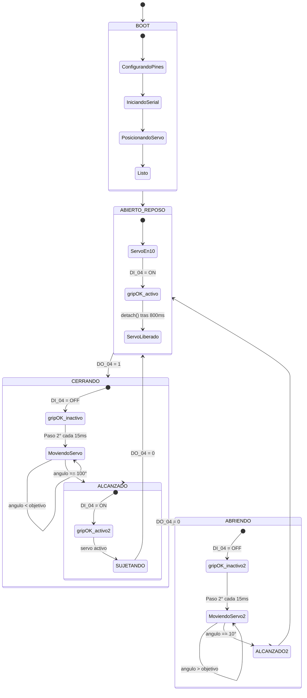

### 9.2. Maquina de estados del programa RAPID

El programa RAPID implementa una maquina de estados gobernada por las entradas
digitales del operador y la secuencia del ciclo de produccion.

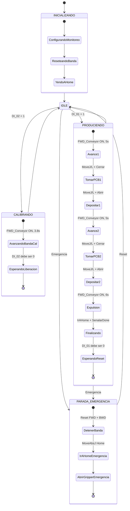

### 9.3. Maquina de estados combinada IRC5-Arduino

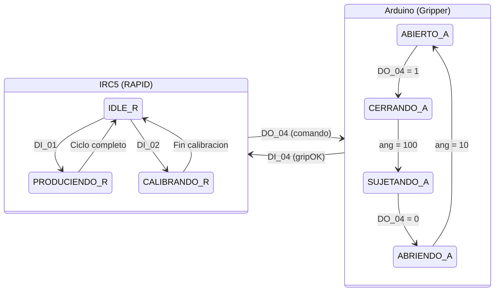

---

## 10. Simulacion vs. Planta Real

### 10.1. Relacion entre simulacion e implementacion fisica

El proyecto fue desarrollado bajo una metodologia que integra el entorno simulado
(RobotStudio) con la implementacion fisica (robot IRB 140 real + circuito Arduino).
Ambos entornos comparten el mismo codigo RAPID y la misma configuracion de senales
E/S, lo que permite validar la logica en simulacion antes de la puesta en marcha real.

| Aspecto | Simulacion (RobotStudio) | Planta Real |
|---------|--------------------------|-------------|
| Robot | Controlador virtual IRC5 + IRB 140 | Controlador IRC5 fisico + robot IRB 140 |
| Programa RAPID | `Module1.mod` cargado en VC | `Module1.mod` cargado en IRC5 real |
| E/S | Simuladas desde ventana de senales | Conexion fisica via DeviceNet (Board10, d652) |
| Gripper | Modelo CAD 3D animado | Gripper fisico impreso en 3D + SG90 |
| Arduino | No participa en la simulacion (senales simuladas manualmente) | Arduino Uno + PC817 + reles conectados al IRC5 |
| Banda transportadora | Modelo CAD con animacion de avance | Banda fisica (si esta disponible en el puesto) |
| Targets | Ensenados en el entorno virtual | Re-ensena|

dos fisicamente sobre el robot real |

### 10.2. Diferencias y consideraciones

1. **Senales del gripper**: en RobotStudio, DO_04, DI_04, DI_05 y DI_06 se activan
   manualmente desde el panel de E/S. En la planta real, estas senales fluyen a
   traves del circuito Arduino + optoacopladores + reles.

2. **Tiempos de respuesta**: en simulacion, los tiempos de espera (`WaitTime 1` en
   `AbrirGripper`/`CerrarGripper`) son conservadores. En la planta real, estos
   tiempos pueden ajustarse una vez validada la respuesta del servo.

3. **Precision de targets**: los targets ensenados en RobotStudio deben ser
   re-ensenados en el robot fisico, ya que la posicion absoluta de la mesa, banda
   y pedestal puede variar ligeramente.

4. **Calibracion del gripper**: los angulos de 10&deg; y 100&deg; calibrados en
   el gripper impreso pueden requerir ajuste en funcion del material, desgaste de
   engranajes o tolerancias de impresion.

<p align="center">
  
  <br/>
  <em>Figura 7. PCB depositada dentro de la caja de empaque sobre la banda transportadora, producto final del ciclo.</em>
</p>

<p align="center">
  
  <br/>
  <em>Figura 8. Simulacion de la Etapa 4 en RobotStudio con el robot IRB 140 y la banda transportadora.</em>
</p>

### 10.4. Video demostrativo

Video unico que integra la simulacion en RobotStudio y la implementacion real
sobre el robot ABB IRB 140:

- **Video**: [Simulacion + Implementacion Real -- Etapa 4](https://youtu.be/fSk1De6c6Eo)

---

## 11. Manejo de Fallas

### 11.1. Estrategia general

El sistema implementa tres niveles de proteccion:

1. **Nivel Arduino**: antirrebote en entradas, liberacion del servo en reposo,
   buffer serie protegido contra desbordamiento, confirmacion de posicion alcanzada.
2. **Nivel RAPID**: monitorizacion de configuracion de movimiento (`ConfL\On`,
   `ConfJ\On`), tiempos de espera fijos como respaldo ante ausencia de sensor,
   rutina `VerificarParada` para respuesta a emergencia.
3. **Nivel operador**: botonera fisica (DI_01, DI_02, DI_03), parada de emergencia
   del sistema IRC5.

### 11.2. Fallas contempladas

| Falla | Deteccion | Accion del sistema |
|-------|-----------|-------------------|
| PCB no presente en zona de entrega | Inspeccion visual del operador | El robot ejecuta el ciclo normalmente; no hay sensor de presencia. Se asume que el operario coloca las PCBs antes de iniciar. |
| Fallo de sujecion de la PCB | Tiempo de espera fijo (1 s) en lugar de sensor | Si la PCB no fue agarrada, caera durante el movimiento. La rutina `VerificarParada` detiene banda y retorna a HOME. |
| Perdida de comunicacion IRC5-Arduino | Ausencia de pulso en DO_04/DO_06 | El Arduino mantiene el servo en su ultima posicion comandada. El LED D13 indica actividad. |
| Parada de emergencia | Senal del sistema IRC5 | El servo pierde fuerza (el Arduino mantiene la posicion pero sin torque). La pieza puede caer; se recomienda que la zona bajo el gripper este despejada. |
| Banda atascada o sin cajas | Ausencia visual de cajas | El robot deposita la PCB en el vacio. Se asume responsabilidad del operario en mantener el suministro de cajas. |

### 11.3. Rutina de parada

La rutina `VerificarParada` (invocable ante condiciones de error) ejecuta:

1. `Reset FWD_Conveyor` y `Reset BWD_Conveyor` &mdash; detiene inmediatamente la banda.
2. `IrAHome` (dos llamadas) &mdash; retorna el robot a posicion segura.
3. `AbrirGripper` &mdash; libera cualquier pieza que pudiera estar sujeta.

### 11.4. Diagrama de manejo de fallas

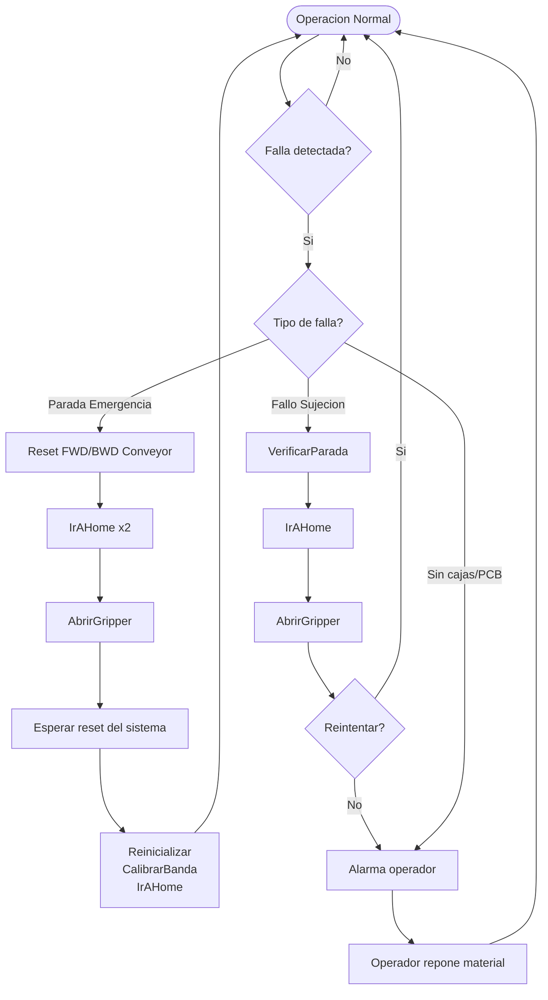

---

## 12. Interfaz de Supervision (UART)

### 12.1. Puerto serie

El Arduino mantiene un enlace USB/UART a **9600 baudios** que permite monitorear
el estado del sistema y enviar comandos en tiempo real.

### 12.2. Trama de telemetria

Cada 500 ms el Arduino publica una linea de estado con el formato:

```
ST,<estado>,<comando>,<angulo>,<gripOK>,<timestamp>
```

| Campo | Valores posibles | Significado |
|-------|------------------|-------------|
| `estado` | `OK` / `FALLA` | Estado del bit DO_06 |
| `comando` | `ABIERTO` / `CERRADO` | Ultimo comando recibido del IRC5 |
| `angulo` | 0-180 | Angulo actual del servo |
| `gripOK` | 0 / 1 | 1 = servo en posicion comandada |
| `timestamp` | entero | `millis()` del Arduino |

Ejemplo: `ST,OK,ABIERTO,10,1,45230`

### 12.3. Comandos disponibles

| Comando | Accion |
|---------|--------|
| `CMD,HOME` | Genera un pulso de 300 ms en DI_05 para ordenar HOME al robot |
| `CMD,START` | Genera un pulso de 300 ms en DI_06 para iniciar ciclo |
| `CMD,PING` | Fuerza el envio inmediato de la trama de telemetria |
| `CMD,CAL,0,<angulo>` | Recalibra el angulo de apertura (0-180) |
| `CMD,CAL,1,<angulo>` | Recalibra el angulo de cierre (0-180) |

### 12.4. Ejemplos de interaccion

```
> CMD,HOME
< EV,ACK,HOME

> CMD,START
< EV,ACK,START

> CMD,PING
< ST,OK,ABIERTO,10,1,52341

> CMD,CAL,0,15
< EV,CAL,0,15

> CMD,CAL,1,95
< EV,CAL,1,95
```

---

## 13. Interfaz Grafica HMI

Se desarrollo una interfaz grafica HMI (_Human-Machine Interface_) como dashboard web
para la supervision y control remoto de la Etapa 4. La herramienta se comunica directamente
con el Arduino Uno a traves del puerto COM via **Web Serial API**, decodificando en
tiempo real todas las tramas del protocolo UART documentado en la seccion anterior.

<p align="center">
  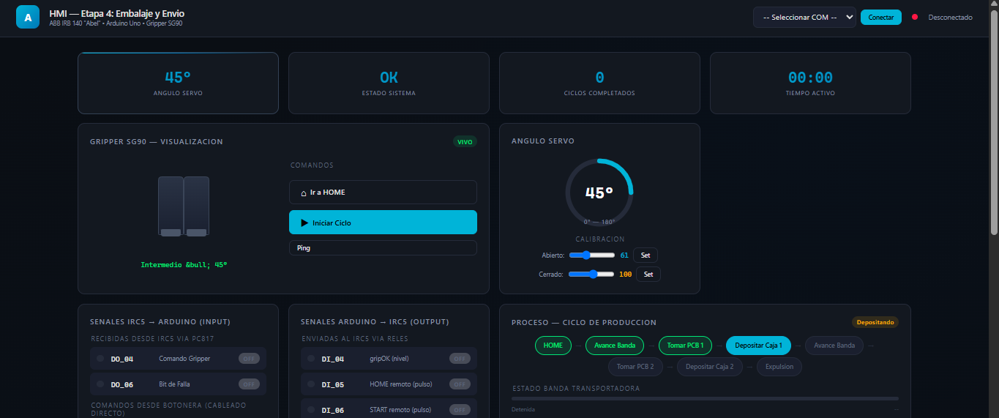
  <br/>
  <em>Figura 10. Interfaz HMI para supervision de la Etapa 4. Conexion por puerto COM (9600 baud) con visualizacion en tiempo real de senales, gripper, proceso y registro de eventos.</em>
</p>

### 13.1. Tecnologia y arquitectura

La HMI se implemento como una aplicacion web estatica (**HTML + CSS + JavaScript puro**),
sin dependencias externas ni servidores. Se abre directamente en el navegador (Chrome o Edge)
y utiliza la **Web Serial API** para establecer comunicacion bidireccional con el Arduino
a 9600 baudios.

```
NAVEGADOR (Chrome/Edge)          USB / UART (9600 baud)          ARDUINO UNO
=======================    <===============================>    =============
  index.html                                                      Gripper
  - Web Serial API                                                Etapa 4 v5
  - Dashboard en tiempo real
  - Comandos: HOME, START, PING, CAL
```

### 13.2. Paneles y funcionalidades

| Panel | Que muestra | Acciones disponibles |
|-------|------------|---------------------|
| **KPIs superiores** | Angulo actual del servo, estado del sistema (OK/FALLA), numero de ciclos completados, tiempo activo desde la conexion | -- |
| **Gripper animado** | Mordazas que abren y cierran suavemente con la PCB entre ellas. Color cambia: verde (abierto), naranja (cerrado) | -- |
| **Dial de angulo** | Medidor circular de 0&deg; a 180&deg; con transicion animada del arco | -- |
| **Comandos** | Botones de accion directa | HOME (pulso DI_05), START (pulso DI_06), PING (forzar telemetria) |
| **Calibracion** | Sliders para ajustar angulos de apertura y cierre | Envio de `CMD,CAL,0,<ang>` y `CMD,CAL,1,<ang>` |
| **Senales INPUT** | DO_04 (comando gripper), DO_06 (falla), DI_01 (inicio ciclo), DI_02 (calibracion) con indicadores LED verdes/rojos | -- |
| **Senales OUTPUT** | DI_04 (gripOK), DI_05 (home), DI_06 (start), FWD y BWD (banda) con indicadores LED | -- |
| **Proceso** | 8 pasos del ciclo de produccion con barra de progreso, banda transportadora animada, contador de PCBs empacadas y cajas utilizadas | -- |
| **Log de eventos** | Registro cronologico de todas las tramas serie (ST, EV, CMD, ER) con timestamp, coloreado por tipo | Boton para limpiar el registro |
| **Diagrama conexionado** | Referencia visual del cableado completo IRC5-Arduino-SG90 | -- |
| **Protocolo UART** | Resumen de todas las tramas serie y comandos disponibles | -- |

### 13.3. Modo demo automatico

Cuando no hay un Arduino conectado al puerto COM, la HMI entra en un **modo de
demostracion** que simula un ciclo completo de produccion:

1. El gripper alterna entre abierto (10&deg;) y cerrado (100&deg;) cada 2 segundos.
2. Las senales INPUT/OUTPUT se actualizan coherentemente con el estado del gripper.
3. El indicador de proceso avanza por los 8 pasos del ciclo (HOME &rarr; Avance
   Banda &rarr; Tomar PCB 1 &rarr; Depositar Caja 1 &rarr; Avance &rarr; Tomar
   PCB 2 &rarr; Depositar Caja 2 &rarr; Expulsion).
4. Los contadores de PCBs y cajas se incrementan automaticamente.
5. La banda transportadora se anima en los pasos de avance.

Al conectar un Arduino real, el modo demo se desactiva inmediatamente y todos los
datos pasan a reflejar las lecturas reales del puerto serie.

### 13.4. Flujo de datos

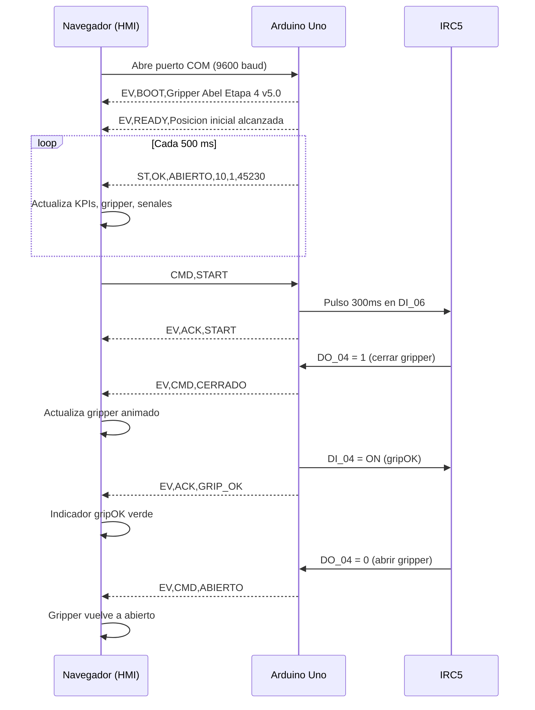

### 13.5. Uso practico

1. **Abrir la HMI**: hacer doble clic en `hmi/index.html` desde Chrome o Edge.
2. **Conectar Arduino**: hacer clic en "Conectar", seleccionar el puerto COM del
   Arduino Uno en el dialogo del navegador.
3. **Supervisar**: observar el dashboard en tiempo real: angulo del servo, estado
   de cada senal, progreso del ciclo.
4. **Comandar**: usar los botones HOME, START o PING para enviar comandos al
   Arduino, que los retransmite al IRC5 via reles.
5. **Calibrar**: ajustar los sliders de apertura y cierre y enviar los nuevos
   valores con `Set`. El Arduino recalibra en caliente sin necesidad de reiniciar.
6. **Auditar**: el log de eventos mantiene un historial completo de toda la
   actividad, incluyendo tramas de telemetria, comandos enviados y eventos del
   sistema.

### 13.6. Requisitos tecnicos

- **Navegador**: Google Chrome 89+ o Microsoft Edge 89+ (soportan Web Serial API).
  Firefox y Safari **no** son compatibles.
- **Sistema operativo**: Windows, macOS, Linux o ChromeOS.
- **Arduino**: Arduino Uno con el firmware `gripper_control.ino` cargado y
  conectado por USB.
- **No requiere**: instalacion de software adicional, servidores, ni dependencias
  externas. El archivo HTML es completamente autocontenido.

---

## 14. Estructura del Repositorio

```
Proyecto Final/
├── README.md                          # Este documento
├── cad/                               # Modelos CAD de la estacion
│   ├── Banda tranportadora.sat        #   - Banda transportadora + soportes laterales
│   ├── Mesa.sat                       #   - Mesa de trabajo
│   ├── Pedestal.sat                   #   - Pedestal del robot
│   ├── caja.sat                       #   - Caja de empaque
│   ├── pcb.sat                        #   - PCB con pestanas de agarre
│   └── gripper2.zip                   #   - Gripper paralelo completo (comprimido)
├── docs/                              # Documentacion tecnica
│   └── Proyecto Final - Robotica...pdf
├── firmware/                          # Codigo del microcontrolador
│   └── gripper_control/
│       └── gripper_control.ino        #   Firmware Arduino Uno para control del gripper
├── rapid/                             # Programacion del robot
│   ├── Module1.mod                    #   Programa RAPID principal
│   └── EIO.cfg                        #   Configuracion de entradas/salidas
├── hmi/                               # Interfaz grafica HMI
│   └── index.html                     #   Dashboard web (Web Serial API, Chrome)
├── simulacion/                        # Proyecto RobotStudio
│   └── Project3/                      #   Estacion completa con controlador virtual
│       ├── Project3.rsproj            #     Archivo de proyecto
│       ├── Station/                   #     Datos de la estacion 3D
│       ├── Controller Data/           #     Configuracion del controlador
│       └── Virtual Controllers/       #     Controlador virtual IRC5
└── evidencias/                        # Imagenes, fotos y video del proyecto
    ├── robot completo con el gripper.jpg    #   - Estacion completa
    ├── pcbs sobe las mesas.jpg              #   - PCBs en zona de entrega
    ├── sopostes que cieeran la caja...jpg   #   - Soportes de cierre de caja
    ├── caja cerandose.jpeg                  #   - Caja cerrrandose
    ├── foto de planta.jpg                   #   - Planta real de la estacion
    ├── modelado griper.png                  #   - Modelado CAD del gripper
    ├── gripper sobre el robot.jpg           #   - Gripper montado en brida
    ├── griper agarrando la pcb.jpg          #   - Agarre de PCB
    ├── foto del circuto del gripper...jpg   #   - Circuito electronico
    ├── pcb pocoonada en cajas.jpeg          #   - PCB depositada en caja
    ├── pantallazo simulacion...studio.png   #   - Simulacion en RobotStudio
    ├── pantallazoHMI.png                    #   - Pantallazo de la HMI
    └── video_demostracion.mp4               #   - Video (ver enlace YouTube en seccion 10.4)
```

---

## 15. Instrucciones de Puesta en Marcha

### 15.1. Montaje electronico

1. **Ajustar el LM2596**: con un multimetro, ajustar el trimmer del convertidor
   DC-DC hasta obtener exactamente 5.0 V en la salida, **sin carga conectada**.
2. **Cablear los optoacopladores**:
   - DO_04 (IRC5) &rarr; resistencia 2.2 k&Omega; &rarr; anodo PC817 #1.
   - DO_06 (IRC5) &rarr; resistencia 2.2 k&Omega; &rarr; anodo PC817 #2.
   - Catodo de ambos PC817 a GND de 24 V.
   - Emisor de ambos PC817 a GND del Arduino.
   - Colector PC817 #1 &rarr; D2 del Arduino.
   - Colector PC817 #2 &rarr; D4 del Arduino.
   - Resistencia pull-down de 10 k&Omega; entre D2 y GND, y entre D4 y GND.
3. **Cablear los reles**:
   - D5, D6, D7 del Arduino a las entradas IN1, IN2, IN3 del modulo de reles.
   - Contactos normalmente abiertos de los reles a DI_04, DI_05, DI_06 del IRC5.
4. **Conectar el servo SG90**:
   - Cable naranja (senal) a D9 del Arduino.
   - Cable rojo (VCC) a +5 V del LM2596.
   - Cable marron (GND) a GND comun.
5. **Conectar alimentacion**:
   - 24 V del armario/controlador a la entrada del LM2596.
   - Salida 5 V del LM2596 a VIN del Arduino y a +5 V del servo.

### 15.2. Carga del firmware

1. Conectar el Arduino Uno al PC via USB.
2. Abrir `firmware/gripper_control/gripper_control.ino` en el Arduino IDE.
3. Seleccionar placa: "Arduino Uno" y puerto COM correspondiente.
4. Compilar y cargar.
5. Abrir el Monitor Serie a 9600 baudios. Debe aparecer:
   ```
   EV,BOOT,Gripper Abel Etapa 4 v5.0
   EV,READY,Posicion inicial alcanzada
   ```
6. Verificar que el LED D13 se enciende al enviar `CMD,CAL,1,100` (simula cierre)
   y se apaga solo al volver a abrir.

### 15.3. Prueba de senales sin servo

1. Con el servo **desconectado**, abrir el Monitor Serie.
2. Simular DO_04 en alto (aplicar 5 V al pin D2 a traves del PC817 o con un cable
   de prueba): debe aparecer `EV,CMD,CERRADO` en el monitor.
3. Retirar la senal: debe aparecer `EV,CMD,ABIERTO`.
4. Verificar que DI_04 se activa con el rele al alcanzar la posicion simulada.

### 15.4. Calibracion del gripper

1. Montar el gripper impreso en el servo, con los dedos instalados.
2. Enviar `CMD,CAL,0,10` y verificar que las mordazas esten completamente abiertas,
   sin forzar el mecanismo. Ajustar el valor si es necesario.
3. Colocar una PCB entre los dedos. Enviar incrementalmente `CMD,CAL,1,<valor>`
   comenzando en 70 y subiendo de 5 en 5 hasta que la PCB quede firmemente sujeta
   sin deformar las pestanas.
4. Anotar los valores definitivos en el codigo (`angAbierto`, `angCerrado`) y
   volver a cargar el firmware.

### 15.5. Simulacion en RobotStudio

1. Abrir RobotStudio 2021.
2. Ir a File &rarr; Open &rarr; seleccionar `simulacion/Project3/Project3.rsproj`.
3. Verificar que el controlador virtual IRB140_6_81 este en estado "Started".
4. Cargar el programa RAPID desde `Controller Data/IRB140_6_81/HOME/Module1.mod`.
5. En la pestana Simulation, hacer clic en Play.
6. Para iniciar un ciclo, activar DI_01 desde la ventana de senales E/S.

### 15.6. Prueba con robot real

1. Verificar que todas las conexiones electricas esten firmes y aisladas.
2. Cargar el programa RAPID en el controlador IRC5 fisico.
3. Ejecutar en **modo manual** con velocidad reducida (max. 25%).
4. Verificar cada punto de agarre y deposito individualmente.
5. Ejecutar un ciclo completo en manual.
6. Si todo es correcto, cambiar a modo automatico.

---

## 16. Seguridad

- **Proteccion ESD**: usar pulsera antiestatica y superficie disipativa al
  manipular la PCB y el Arduino. Las descargas electrostaticas pueden danar el
  ATmega328P o los componentes de la PCB.
- **Verificacion de polaridad**: comprobar con multimetro la polaridad de las
  lineas de 24 V y 5 V antes de conectar cualquier dispositivo. Una inversion
  destruira el LM2596, el Arduino o ambos.
- **Aislamiento**: el circuito de acondicionamiento (LM2596, PC817, reles) debe
  alojarse en una caja cerrada no conductora para prevenir cortocircuitos
  accidentales por contacto con objetos metalicos.
- **Primeras pruebas**: ejecutar siempre en modo manual, velocidad reducida y con
  el area de trabajo despejada de personas y obstaculos.
- **Parada de emergencia**: si se activa, el servomotor SG90 pierde fuerza de
  sostenimiento inmediatamente. La PCB o cualquier pieza sujeta caera. Verificar
  que el punto de caida no coincida con equipos sensibles ni areas de circulacion
  de personas.
- **Calentamiento del servo**: el firmware libera el servo (`detach`) en reposo
  para evitar sobrecalentamiento. No modificar este comportamiento sin considerar
  la disipacion termica del SG90 en ciclos prolongados.

---

## 17. Conclusiones

La automatizacion de la Etapa 4 de la linea de ensamblaje de PCBs demostro la
viabilidad de integrar un robot industrial ABB IRB 140 con un sistema electronico
embebido basado en Arduino Uno para el control de una herramienta de bajo costo.
El proyecto abordo exitosamente los cuatro pilares de la robotica industrial:
mecanica, electronica, programacion y control.

El principal desafio fue la **compatibilidad de senales** entre el controlador
IRC5 (24 V, logica ON/OFF) y el servomotor SG90 (5 V, PWM). La solucion implementada
con optoacopladores PC817 para aislamiento galvanico, el convertidor LM2596 para
la fuente de alimentacion y el modulo de reles para el retorno de senales demostro
ser robusta y repetible. El firmware del Arduino, disenado con una arquitectura no
bloqueante basada en `millis()`, garantiza control suave del servo mediante pasos
incrementales de 2&deg; y libera el actuador en reposo para prevenir
sobrecalentamiento, logrando un sistema confiable para operacion continua.

La **programacion en RAPID** permitio implementar un ciclo de produccion completo
para dos PCBs con manejo de banda transportadora, calibracion automatica y rutinas
de parada de emergencia. La integracion con RobotStudio facilito la validacion
previa en simulacion, reduciendo riesgos en la puesta en marcha fisica.

La **interfaz HMI** desarrollada como aplicacion web estatica conectada por Web
Serial API proporciona supervision en tiempo real de todas las senales del sistema,
un panel de comandos remotos, visualizacion animada del gripper y registro
cronologico de eventos. Su arquitectura autocontenida (HTML+CSS+JS sin dependencias)
la hace portable y de facil despliegue en cualquier navegador compatible.

Desde el punto de vista del **diseno mecanico**, el gripper paralelo impreso en 3D disenado con un mecanismo de cuatro barras, junto con los soportes laterales de la banda
transportadora, cumplio con los requisitos de agarre lateral de la PCB y guiado
de las cajas de empaque. La calibracion experimental de los angulos del servo
(10&deg; abierto, 100&deg; cerrado) garantiza repetibilidad en la sujecion sin
danar las pestanas de la PCB.

El proyecto evidencio la importancia de una **documentacion estructurada** que
abarque desde los diagramas de conexionado electronico hasta las maquinas de
estados del firmware y del programa RAPID, facilitando la trazabilidad del diseno
y la transferencia del conocimiento a futuros equipos de trabajo.

---

## 18. Referencias

1. Guia del Proyecto Final &mdash; Robotica Industrial 2026-I. Automatizacion del
   Proceso de Ensamblaje, Soldadura y Empaque de PCBs. Universidad Nacional de
   Colombia.
2. ABB Robotics. _Product Manual IRC5_ y _Product Manual IRB 140_.
3. ABB Robotics. _Technical Reference Manual &mdash; RAPID Instructions, Functions
   and Data Types_.
4. TowerPro. _SG90 Micro Servo Datasheet_.
5. Sharp. _PC817 Series Photocoupler Datasheet_.
6. Texas Instruments. _LM2596 Step-Down Voltage Regulator Datasheet_.

---

## Autores

<div align="center">

| Integrante | GitHub |
|---|---|
| **Duvan Felipe Pacheco Rodriguez** | <a href="https://github.com/dupachecor"></a> |
| **Juan Andres Mora Henao** | <a href="https://github.com/JuanMora345"></a> |
| **Andres Gustavo Pinilla Martinez** | <a href="https://github.com/AndresPinilla20"></a> |

</div>

---

## Licencia

Este proyecto esta bajo la licencia indicada en [`LICENSE`](../LICENSE).

---

<div align="center">


</div>
