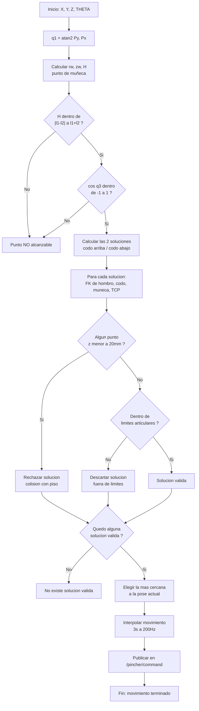

<table>
  <tr>
    <td align="center">
      
    </td>
    <td align="center">
      
    </td>
  </tr>
  <tr>
    <td align="center">
      
    </td>
    <td align="center">
      
    </td>
  </tr>
</table>

## Proyecto — Cinemática Inversa PhantomX Pincher (`ik_phantom`)

Esta actividad consiste en programar la cinemática inversa del **PhantomX Pincher X100**: dado un punto en el espacio (X, Y, Z) y un ángulo de muñeca deseado, el robot debe calcular por sí solo qué ángulos necesita cada articulación para llegar ahí, y moverse hasta esa posición sin chocar contra el piso ni salirse de sus límites mecánicos. El script `Actividad_12.py` es justamente eso: recibe el punto objetivo por consola, resuelve la geometría, filtra las soluciones inválidas y ejecuta el movimiento sobre el robot (real o simulado).

## Uso

```bash
python3 Actividad_12.py X Y Z THETA
```

- `X, Y, Z`: posición del TCP en milímetros.
- `THETA`: ángulo de la muñeca respecto a la horizontal, en grados.

**Ejemplo:**
```bash
python3 Actividad_12.py 200 0 150 -45
```

Requiere que el nodo `control_servo` (real o simulado, del paquete `pincher_control` en `phantom_ws`) esté corriendo, ya que este script publica en `/pincher/command` y lee `/joint_states`.

## Parámetros del robot

| Parámetro | Valor | Descripción |
|---|---|---|
| `l1` | 105.6 mm | Hombro → codo |
| `l2` | 105.6 mm | Codo → muñeca |
| `l3` | 92 mm | Muñeca → TCP |
| `base_height` | 127.1 mm | Altura de la base |

## Lógica del algoritmo

1. **`q1`** se obtiene directamente por `atan2(Py, Px)`.
2. Se calcula el punto de muñeca `(rw, zw)` restando la proyección de `l3` en la dirección de `theta`.
3. Se resuelve el triángulo `l1`-`l2` por **ley de cosenos**, generando **dos soluciones** (codo arriba / codo abajo) para `q2` y `q3`; `q4` se deriva para cumplir `theta`.
4. Cada solución se valida contra:
   - **Piso**: ningún punto de la estructura (FK) puede quedar a menos de 20 mm de `z = 0`.
   - **Límites articulares** (con margen de seguridad de 0.10 rad).
5. Entre las soluciones válidas, se ejecuta la más cercana a la configuración articular actual (menor distancia euclídea), con movimiento interpolado (3 s, 200 Hz).

## Ecuaciones

l1 = 105.6
l2 = 105.6
l3 = 92
d1 = 127.1

q1 = atan2(Py, Px)

r  = sqrt(Px^2 + Py^2)

rw = r  - l3*cos(θ)
zw = Pz - l3*sin(θ)

H = sqrt((zw - d1)^2 + rw^2)

cos(q3) = (H^2 - l1^2 - l2^2) / (2*l1*l2)
q3 = atan2( sqrt(1 - cos(q3)^2), cos(q3) )

λ = atan2( -l2*sin(q3), l1 + l2*cos(q3) )
β = atan2( rw, zw - d1 )
q2 = β - λ

θ = 90 + q2 + q3 + q4
q4 = θ - 90 - q2 - q3

## Diagrama de flujo


# Detección de figuras de colores + distancia (Kinect v1 en Raspberry Pi 5)

Script que usa un Kinect v1 (Xbox 360) para detectar figuras por color, calcular su distancia y posición 3D, y enviar coordenadas a un robot.

## Requisitos del sistema

```bash
sudo apt install git cmake build-essential libusb-1.0-0-dev freeglut3-dev
git clone https://github.com/OpenKinect/libfreenect.git
cd libfreenect && mkdir build && cd build
cmake -L .. -DBUILD_PYTHON3=ON
make -j4
sudo make install
sudo ldconfig
sudo cp ../platform/linux/udev/51-kinect.rules /etc/udev/rules.d/
```
Desconecta y reconecta el Kinect después de esto.

## Requisitos de Python

```bash
pip install opencv-python numpy
```

> El módulo `freenect` no se instala con pip: queda disponible en el sitio de Python del sistema tras compilar `libfreenect` con `-DBUILD_PYTHON3=ON`. Si usas un venv, créalo con `--system-site-packages` para poder importarlo.

## Configuración antes de usar

- **Intrínsecos de cámara** (`FX`, `FY`, `CX`, `CY`): valores típicos reportados por la comunidad para 640x480. Para precisión real, calibra tu sensor con `cv2.calibrateCamera` y un patrón de ajedrez.
- **Extrínsecos cámara → robot** (`R_CAM_TO_ROBOT`, `T_CAM_TO_ROBOT`): deben medirse/calcularse según el montaje físico de la cámara respecto al origen del robot. Actualmente son placeholders (identidad / ceros).
- **`ANGULO_MANIPULADOR`**: fijo en -90.
- **`RUTA_SCRIPT_ROBOT`**: ruta a `mi_script_mover_robot.py`, ajustar si no está en el mismo directorio.
- **`COLOR_RANGES`**: rangos HSV para rojo, verde y azul. Ajustar según las figuras reales y la iluminación (se recomienda un script aparte con trackbars de OpenCV para calibrar).
- **`MIN_AREA_PX`**: área mínima en píxeles para filtrar ruido (500 por defecto).

## Funcionamiento

1. Captura frame RGB y frame de profundidad del Kinect.
2. Detecta contornos por color (rojo, verde, azul) vía máscaras HSV.
3. Para cada figura detectada, calcula su centroide, distancia (convertida de valor crudo de disparidad a metros) y coordenadas XYZ en el marco de la cámara, transformadas luego al marco del robot.
4. Imprime por stdout un JSON por frame con las detecciones (`timestamp` + lista de detecciones).
5. Mueve el robot a la primera figura con coordenadas válidas, invocando `mi_script_mover_robot.py` por consola con `x y z angulo`.
6. Muestra una ventana de OpenCV con las detecciones marcadas (opcional, comentar en producción).

## Ejecución

```bash
python3 deteccion_color_distancia.py
```

Ctrl+C para salir. Presionar `q` en la ventana de video también cierra el programa.

## Notas

- 0 o 2047 en la lectura cruda de profundidad significan "sin lectura válida".
- El rojo en HSV cruza el límite 0/180, por eso usa dos rangos.
- La lógica de movimiento del robot es un ejemplo simple (primera figura válida); se puede ajustar para elegir la más cercana, filtrar por color específico, o esperar confirmación del usuario.

## Videos 

[](https://drive.google.com/file/d/1EqDscNefD4i1kRXzlKbOH6I8KSpX8Mq4/view?usp=drive_link)

[](https://drive.google.com/file/d/13yGw11tSOQHHb_xmZWPx7cLA9ExJpDro/view?usp=drive_link)

[](https://drive.google.com/file/d/1-KyUQCcPZHVYrZD1jbXKrO4pjFwlw1so/view?usp=drive_link)

[](https://drive.google.com/file/d/156der9t2Vzlm9ZEJO3adPHJ6D7YPmH1Z/view?usp=drive_link)

## Conclusiones

- El desacople posición-orientación (usar `theta` para ubicar el "punto de muñeca" antes de resolver el triángulo `l1`-`l2`) simplifica bastante el problema y evita tener que resolver las 4 incógnitas al tiempo.
- Tener dos soluciones geométricas (codo arriba/abajo) es útil, pero solo sirve si después se filtran bien contra piso y límites; sin ese filtro el robot podría intentar una configuración físicamente imposible.
- Reutilizar la misma convención DH de `fk_phantom.py` para la verificación anti-colisión fue clave para que el chequeo de piso fuera coherente con el modelo real del robot y no diera falsos positivos/negativos.
- Elegir la solución más cercana a la pose actual (y no simplemente la primera válida) hace que el movimiento sea más suave y predecible en la práctica.
