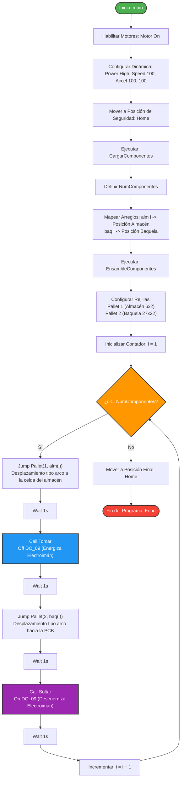

<div align="center">
<picture>
    <source srcset="https://imgur.com/5bYAzsb.png" media="(prefers-color-scheme: dark)">
    <source srcset="https://imgur.com/Os03JoE.png" media="(prefers-color-scheme: light)">
    
</picture>

<h3>Curso de Robótica 2026-I</h3>

<h1>Proyecto Final - Robótica Industrial</h1>

<h2>Profesores: <br>Pedro Fabián Cárdenas Herrera <br> Manuel Felipe Carranza Montenegro<br></h2>

</div>

# Integrantes
1. Juan Andrés Moreno Benavides [jumorenobe@unal.co](Jumorenobe)
2. Mateo Ramos Cujer [mramoscu@unal.edu.co](MateoKGR)
3. Paula Valentina Alvarez Chaparro [palvarezch@unal.edu.co] (Vaulentzc)
4. Yesid Camilo Ojeda Hernández [yojeda@unal.edu.co] (YojedaMt)
5. David Felipe Cardenas Cubides [dcardenascu@unal.edu.co] (dcardenascu)

# Índice

1. [Bitácora del desarrollo](#bitacora-del-desarrollo)
2. [Diagrama de flujo del proceso global](#diagrama-de-flujo-del-proceso-global)
3. [Diseño del gripper](#diseño-del-gripper)
4. [Simulación](#simulacion)
5. [Código fuente](#codigo-fuente)
6. [Comparación manual vs automatizado](#comparacion-manual-vs-automatizado)
7. [Descripción detallada de la solución](#descripcion-detallada-de-la-solución)
8. [Diagrama de flujo acciones del robot](#diagrama-de-flujo-acciones-del-robot)
9. [Plano de planta](#plano-de-planta)
10. [Videos demostrativos](#videos-demostrativos)

## 1. Bitácora del desarrollo

A continuación se documenta el proceso cronológico de diseño, simulación, fabricación e integración en laboratorio para el desarrollo de la **Etapa 2: Ensamblaje de Componentes** con el robot **Epson T3 401S ("Junior")**.

---

### Fase 1: Definición de Requerimientos y Diseño Mecánico

* **Definición del Concepto:** Se analizaron los requerimientos técnicos del proyecto para la Etapa 2 de la línea de producción (Pick & Place de componentes sobre la PCB).
* **Diseño CAD del Gripper (Electroimán):** * Se diseñó el adaptador/Sujetador mecánico para acoplar el electroimán al eje del robot Epson T3 401S en software CAD (SolidWorks/Fusion 360).
  * Se consideró un diseño liviano para no afectar la dinámica del robot y con tolerancia para alojar el núcleo magnético y el cableado de la señal digital `DO_09`.
* **Acondicionamiento del Almacén Ordenado:**
  * Se realizó la búsqueda y selección de la caja/almacén físico adecuado para disponer los componentes. Fue necesario conseguir una estructura con compartimentos adecuados en espaciado y profundidad para asegurar que el efector final pudiera ingresar sin colisiones y mantener una alta repetibilidad en el *pick*.


> **[Agregen mas info]:** *Agregar especificaciones del material del gripper (impresión 3D PLA/PETG) y dimensiones exactas de la caja/almacén utilizada.*

---

### Fase 2: Programación Inicial y Simulación (EPSON RC+)

* **Desarrollo del Código SPEL+:**
  * Implementación de la rutina lógica principal (`main`) y declaración de matrices globales para el mapeo de posiciones de origen (`alm`) y destino (`baq`).
  * Configuración de mallas de paletizado mediante las funciones `Pallet 1` (Almacén) y `Pallet 2` (Baquela).
* **Simulación Virtual:**
  * Verificación preliminar de trayectorias tipo `Jump` dentro del entorno virtual de **EPSON RC+** para garantizar que la elevación en $Z$ fuera suficiente para esquivar bordes de la caja y elementos sobre la PCB.

> **[Agregen foto de la simulación]:** *Adjuntar captura de pantalla de la simulación en EPSON RC+ con la malla de paletizado generada.*

---

### Fase 3: Integración Hardware y Control Eléctrico

* **Ensamble Mecánico y Eléctrico:**
  * Montaje de la herramienta en el robot real.
  * Conexión del relé de activación del electroimán al módulo de salidas digitales del controlador Epson (asignado a la salida `DO_09`).
* **Protección ESD y Seguridad:**
  * Implementación de precauciones antiestáticas en la zona de trabajo para evitar daños en los componentes electrónicos durante la manipulación.

> **[Agregen info del electroimán]:** *Añadir esquema de conexión eléctrica del relé/electroimán a la tarjeta I/O del Epson.*

---

### Fase 4: Pruebas en Laboratorio y Calibración de Trabajo (Iterativas)

Debido a las variaciones entre el modelo virtual y el montaje real, se realizaron múltiples visitas al laboratorio para ajustar los parámetros de precisión:

* **Visita 1 - Calibración de Puntos y Frames:**
  * Definición manual de los puntos origen y ejes ($X, Y$) para `Pallet 1` (Caja almacén) y `Pallet 2` (Baquela/PCB) usando el Jog de EPSON RC+.
  * Ajuste de altura de seguridad $Z$ para evitar choques con las paredes de la caja de componentes.
* **Visita 2 - Ajuste de Agarre Electromagnético:**
  * Pruebas de campo para verificar la atracción y liberación de las borneras/componentes metálicos.
  * **Problema detectado:** La remanencia magnética causaba que algunos componentes no se soltaran inmediatamente al apagar el electroimán.
  * **Solución aplicada:** Ajuste de tiempos de espera (`Wait 1`) en las subrutinas `Tomar` y `Soltar` para dar estabilidad al proceso.
* **Visita 3 - Calibración Fine-Tuning y Pruebas de Repetibilidad:**
  * Corrección milimétrica de las coordenadas de la baquela para asegurar que las terminales de los componentes alinearan correctamente con los orificios de la PCB.
  * Verificación del ciclo completo a velocidad real (`Speed 100`, `Accel 100 100`).

> **[Agregen mas info aquí]:** *Agregar tabla o registro de fallos encontrados durante las pruebas de campo y cómo se corrigieron.*

---

### Evidencias del Desarrollo

| Hito / Actividad | Descripción | Evidencia Fotográfica / Video |
| :--- | :--- | :---: |
| **Diseño CAD Herramienta** | Modelo 3D del soporte para el electroimán. | *(Insertar Imagen CAD)* |
| **Acondicionamiento Almacén** | Caja seleccionada con componentes ordenados. | ** |
| **Calibración en Lab** | Ajuste de puntos de paletizado en el Epson T3. | ** |
| **Prueba de Agarre** | Verificación de sujeción electromagnética (`DO_09`). | *(Insertar GIF / Foto Pick)* |

---

## 2. Diagrama de flujo del proceso global

El proceso global de la línea automatizada consta de cuatro estaciones robotizadas secuenciales e independientes para la manufactura, ensamble, soldadura y empaque de tarjetas electrónicas (PCBs).

```mermaid
flowchart TD
    %% Inicio del sistema
    START([Inicio del Proceso Global]) --> HMI_INIT[Selección de Receta y Start en HMI]
    
    %% ETAPA 1
    subgraph E1["Etapa 1: Clasificación y Ordenamiento (ABB IRB 140 - Caín)"]
        E1_IN[Llegada de componentes en desorden por banda transportadora] --> E1_VIS["Visión Artificial (Kinect + MATLAB):<br/>Detección e Identificación de Tipo/Pose"]
        E1_VIS --> E1_PICK[Pick de componente en banda]
        E1_PICK --> E1_DEC{¿Clasificación exitosa?}
        E1_DEC -- Sí --> E1_PLACE[Place en celda correspondiente del Almacén Ordenado]
        E1_DEC -- No / Duda --> E1_REJ[Depositar en Bandeja de Rechazo / Alarma HMI]
        E1_PLACE --> E1_COUNT[Incrementar Conteo por Tipo]
        E1_COUNT --> E1_CHECK{¿Almacén Completo?<br/>N >= 30 componentes}
        E1_CHECK -- No --> E1_IN
        E1_CHECK -- Sí --> E1_READY[Señal: Almacén Listo / Transfiriendo]
    end

    HMI_INIT --> E1_IN

    %% ETAPA 2
    subgraph E2["Etapa 2: Ensamblaje en PCB (Epson T3 401S - Junior)"]
        E2_SETUP[Fijar PCB en Fixture de Estación Epson] --> E2_RECIP[Cargar Receta de Posiciones X, Y, Ángulo]
        E2_RECIP --> E2_LOOP_INIT[Inicializar i = 1]
        E2_LOOP_INIT --> E2_LOOP_CHK{¿i <= N_componentes?}
        E2_LOOP_CHK -- Sí --> E2_PICK[Pick desde Almacén Ordenado con Electroimán]
        E2_PICK --> E2_PLACE[Jump Place/Inserción en coordenadas destino en PCB]
        E2_PLACE --> E2_INC[i = i + 1]
        E2_INC --> E2_LOOP_CHK
        E2_LOOP_CHK -- No --> E2_VERIF[Inspección Visual Rápida / Foto Final]
        E2_VERIF --> E2_READY[Señal: PCB Poblada / Transfiriendo]
    end

    E1_READY --> E2_SETUP

    %% ETAPA 3
    subgraph E3["Etapa 3: Soldadura (Yaskawa Motoman MH6 - El Chambeador)"]
        E3_SETUP[Fijar PCB Poblada en Fixture de Soldadura] --> E3_PATH[Cargar Rutina y Patrón de Puntos P1..PN]
        E3_PATH --> E3_EXEC[Ejecución de Trayectoria de Soldadura / Puntos]
        E3_EXEC --> E3_LOG[Generación de Log de Registro Explicito]
        E3_LOG --> E3_READY[Señal: PCB Soldada / Transfiriendo]
    end

    E2_READY --> E3_SETUP

    %% ETAPA 4
    subgraph E4["Etapa 4: Empaque y Envío (ABB IRB 140 - Abel)"]
        E4_PICK[Pick de PCB Soldada desde Estación 3] --> E4_PACK[Colocar en Caja/Bandeja de Empaque]
        E4_PACK --> E4_LABEL[Colocar Etiqueta de Lote]
        E4_LABEL --> E4_BELT[Depositar en Banda Transportadora de Salida]
        E4_BELT --> E4_COUNT[Incrementar Contador de Producción en HMI]
    end

    E3_READY --> E4_PICK
    E4_COUNT --> END([Fin del Proceso - Producto Empacado])

    %% Estilos de Nodos
    style START fill:#4CAF50,stroke:#333,stroke-width:2px,color:#fff
    style END fill:#2196F3,stroke:#333,stroke-width:2px,color:#fff
    style E1 fill:#FFF3E0,stroke:#FF9800,stroke-width:2px
    style E2 fill:#E8F5E9,stroke:#4CAF50,stroke-width:2px
    style E3 fill:#E1F5FE,stroke:#03A9F4,stroke-width:2px
    style E4 fill:#F3E5F5,stroke:#9C27B0,stroke-width:2px
```



## 3. Diseño del gripper

## 4. Simulación

## 5. Código fuente
El control y automatización de la **Etapa 2: Ensamblaje de Componentes** ejecutada por el robot **Epson T3 401S ("Junior")**  se desarrolló en el entorno **EPSON RC+** empleando el lenguaje de programación **SPEL+**. 

A continuación se detalla la estructura y funcionamiento del código implementado para la manipulación y posicionamiento de componentes mediante el electroimán adaptado.

### Estructura del Código

#### 1. Declaración de Variables Globales
```i```: Variable de control para los iteradores en los bucles de ensamble.
```alm(20)```: Arreglo que almacena las posiciones relativas (índices) de cada componente dentro del almacén ordenado.
```baq(20)```: Arreglo que asigna la posición relativa destino dentro de la tarjeta electrónica (baquela/PCB).
NumComponentes: Determina el número total de piezas a manipular durante la ejecución.

### 2. Rutina Principal (main)
Es el punto de entrada del programa. Establece la configuración de seguridad, velocidad del manipulador y coordina la secuencia global del ciclo de trabajo.
```Power High / Accel / Speed```: Habilita la máxima potencia y fija las velocidades e inercias al 100% para optimizar el tiempo de ciclo.
```Home```: Envía el robot a su posición segura inicial y final para prevenir colisiones durante el encendido o parada.
Llamado a subrutinas: Ejecuta de manera secuencial la asignación de posiciones y el proceso de pick & place.

### 3. Mapeo de Componentes (CargarComponente)
Define la relación entre el origen (almacén) y el destino (baquela) para cada ítem de la receta de ensamble.

### 4. Proceso de Ensamble y Paletizado (EnsambleComponentes)
Configura las mallas de trabajo (pallets) y ejecuta la rutina iterativa de Pick & Place utilizando trayectorias arqueadas para garantizar la seguridad en la inserción.

```Pallet 1```: Define la rejilla del Almacén con una matriz de $6 \times 2$ posiciones.
```Pallet 2```: Define la rejilla de la Baquela con una matriz de $27 \times 22$ posiciones.
```Jump```: Ejecuta un movimiento tipo SCARA Gate (eleva el eje Z, desplaza X/Y y baja Z), evitando obstáculos intermedios entre la zona de almacenamiento y la PCB.

### 5. Control del Actuador Final (Tomar / Soltar)
Gestión del efector final (electroimán) a través de salidas digitales del controlador Epson.

```DO_09```: Salida digital conectada al relé de activación del electroimán. Funciona bajo lógica invertida (o normalmente cerrado según el arreglo físico del relé):
```Off DO_09```: Energiza/activa la sujeción electromagnética para tomar el componente.
```On DO_09```: Desenergiza la herramienta para liberar el componente sobre la PCB.

## 6. Comparación manual vs automatizado
## 7. Descripción detallada de la solución

## 8. Diagrama de flujo acciones del robot
El siguiente diagrama detalla la secuencia algorítmica y la toma de decisiones que ejecuta el robot  durante la **Etapa 2: Ensamblaje de Componentes**, reflejando la lógica programada en **SPEL+**:



## 9. Plano de planta


## 10. Videos demostrativos
Los videos demostrativos estan subidos en este repositorio en la carpeta de ```videos```
