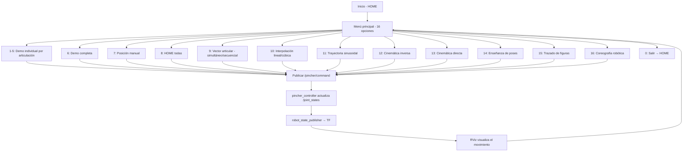
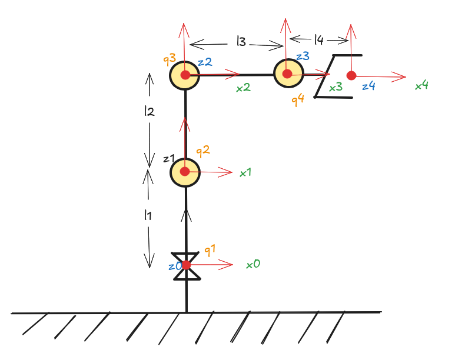
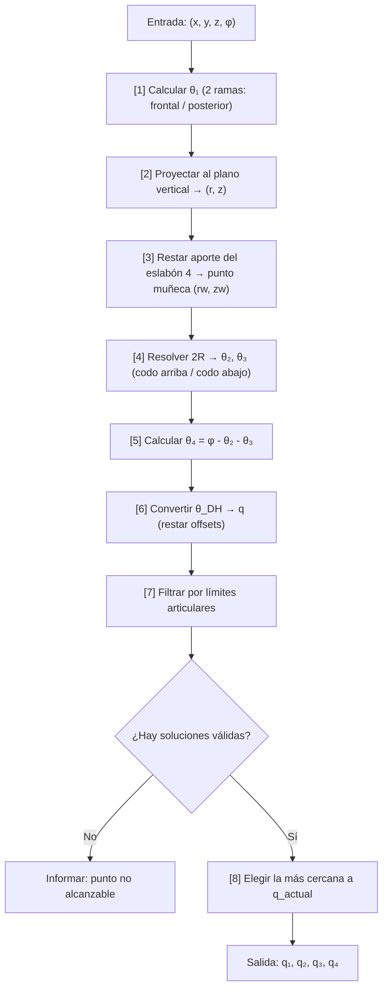
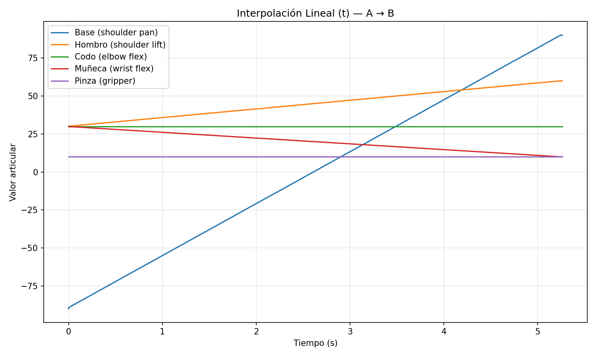
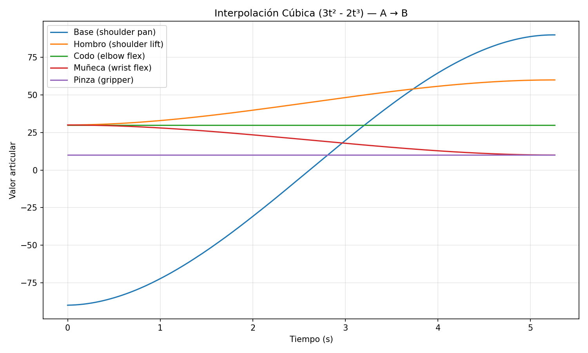
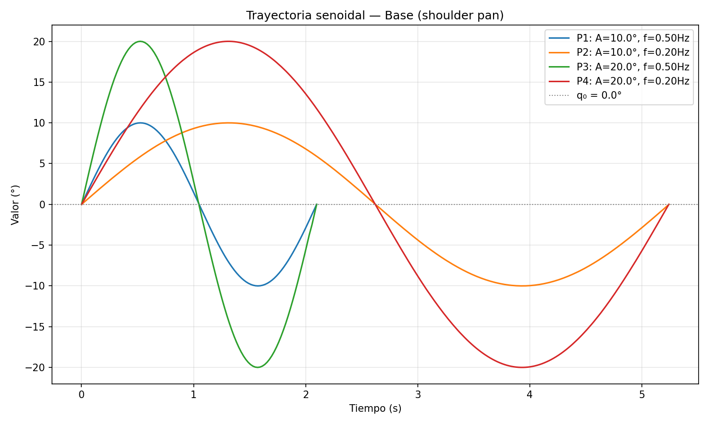

# Laboratorio No. 05 — Phantom X Pincher X100 – ROS 2 Jazzy – RViz

**Robótica 2026-I — Universidad Nacional de Colombia**


---

## Integrantes

| Nombres |
|--------|
| _Duvan Stiven Tique Osorio_ | 
| _Luis Alberto Mendoza Rojas_ | 

---

## 1. Descripción de la solución

Este repositorio implementa el control completo del robot **PhantomX Pincher X100** utilizando ROS 2 Jazzy Jalisco. El sistema permite:

- Visualización 3D del robot en RViz con mallas STL reales
- Control articular individual, simultáneo y secuencial
- Interpolación de trayectorias (lineal y cúbica)
- Trayectorias senoidales parametrizables
- Cinemática directa (DH) e inversa (geométrica)
- Enseñanza y repetición de poses (almacenamiento YAML)
- Trazado de figuras geométricas mediante cinemática inversa
- Coreografía robótica sincronizada con música (50s)

Todo el software se ejecuta sin intervención manual una vez iniciado, respetando los límites articulares en todo momento.

---

## 2. Diagrama de flujo



---

## 3. Estructura del repositorio

```
phantom_ws/
├── README.md
├── .gitignore
├── BaileRobotico.mp4              ← Video de la coreografía
├── movimientos_del_robot.mp4      ← Video de movimientos
└── src/
    ├── pincher_control/           ← Paquete de control (ament_python)
    │   ├── config/
    │   │   ├── ax12a.yaml
    │   │   └── xl430.yaml
    │   ├── launch/
    │   │   └── pincher_system.launch.py
    │   └── pincher_control/
    │       ├── control_servo.py        ← Controlador principal
    │       ├── dynamixel_profiles.py   ← Perfiles de motores
    │       ├── joint_position_demo.py  ← Demo interactiva (16 funciones)
    │       ├── pincher_gui.py          ← GUI Tkinter
    │       └── scan_dynamixel.py       ← Escáner de IDs
    └── pincher_description/       ← Paquete de descripción (ament_python)
        ├── launch/
        │   ├── display.launch.py
        │   └── display_gui.launch.py
        ├── meshes/ (6 archivos STL)
        ├── rviz/pincher.rviz
        └── urdf/robot.xacro
```

---

## 4. Identificación de motores y articulaciones (Actividad 2)

| Articulación | ID | Referencia (HOME) | Sentido positivo | Eje | Función |
|---|:---:|:---:|---|:---:|---|
| Base | 1 | 0° | Antihorario (vista sup.) | Z | Rotación de la base |
| Hombro | 2 | 0° | Adelante (eleva brazo) | Y | Elevación del brazo |
| Codo | 3 | 0° | Adelante (extiende) | Y | Extensión/flexión |
| Muñeca | 4 | 0° | Adelante (inclina) | Y | Orientación del efector |
| Pinza | 5 | 0 mm | Cierre (positivo) | X | Apertura/cierre prismático |

---

## 5. Medición del robot (Actividad 3)

### Dimensiones medidas

Las dimensiones se obtuvieron a partir de los archivos STL del repositorio de modelos 3D y de las propiedades definidas en el Xacro:

| Dimensión | Valor (mm) | Método |
|-----------|:----------:|--------|
| Altura de la base (d₁) | 35.0 | ax12_height + f10_height - 0.001 |
| Hombro → Codo (a₂) | 107.5 | f4 + 3.5×f10 + f3 + ax12 |
| Codo → Muñeca (a₃) | 107.5 | f4 + 3.5×f10 + f3 + ax12 |
| Muñeca → TCP (a₄) | 54.5 | f2 + f3 + ax12_width/2 |
| Longitud del dedo | 44.0 | finger_length |
| Apertura máx. pinza | 18.0 | recorrido prismático |
| **Alcance máximo** | **269.5** | a₂ + a₃ + a₄ |

### Diagrama geométrico



Ejes de movimiento:
- J1 (base): rotación en **Z**
- J2 (hombro): rotación en **Y** (con offset π/2 en DH)
- J3 (codo): rotación en **Y**
- J4 (muñeca): rotación en **Y**

---

## 6. Parámetros Denavit-Hartenberg

| i | θᵢ | dᵢ (mm) | aᵢ (mm) | αᵢ | offset |
|---|------|---------|---------|------|--------|
| 1 | q₁ | 35.0 | 0 | π/2 | 0 |
| 2 | q₂ | 0 | 107.5 | 0 | π/2 |
| 3 | q₃ | 0 | 107.5 | 0 | 0 |
| 4 | q₄ | 0 | 54.5 | 0 | 0 |

---

## 7. Desarrollo de la cinemática directa

### Modelo del robot

El robot tiene **4 articulaciones rotacionales** con estructura clásica "hombro-codo-muñeca": una base giratoria (α₁ = π/2) más un brazo planar de 3 eslabones (ejes paralelos).

El **offset de π/2 en la articulación 2** significa que el ángulo DH no es directamente q₂, sino:

$$\theta_{2,DH} = q_2 + \frac{\pi}{2}$$

### Matriz de transformación DH estándar

Cada articulación aporta una matriz homogénea 4×4:

$$
T_i = \begin{bmatrix} \cos\theta_i & -\sin\theta_i\cos\alpha_i & \sin\theta_i\sin\alpha_i & a_i\cos\theta_i \\ \sin\theta_i & \cos\theta_i\cos\alpha_i & -\cos\theta_i\sin\alpha_i & a_i\sin\theta_i \\ 0 & \sin\alpha_i & \cos\alpha_i & d_i \\ 0 & 0 & 0 & 1 \end{bmatrix}
$$

donde $\theta_i = q_i + \text{offset}_i$

### Transformación total

La pose del efector final se obtiene multiplicando las cuatro matrices:

$$T_0^4 = T_1 \cdot T_2 \cdot T_3 \cdot T_4$$

### Ecuaciones de posición

Como las articulaciones 2, 3 y 4 son coplanares, se separa en:
- **θ₁:** define la dirección en el plano XY
- **θ₂, θ₃, θ₄:** posición dentro del plano vertical

Distancia radial acumulada:

$$r = a_2\cos\theta_2 + a_3\cos(\theta_2 + \theta_3) + a_4\cos(\theta_2 + \theta_3 + \theta_4)$$

Coordenadas cartesianas del efector final:

$$P_x = r\cos\theta_1 \qquad P_y = r\sin\theta_1$$

$$P_z = d_1 + a_2\sin\theta_2 + a_3\sin(\theta_2 + \theta_3) + a_4\sin(\theta_2 + \theta_3 + \theta_4)$$

### Orientación del efector

Como los tres últimos ejes son paralelos, la orientación en el plano vertical es:

$$\phi = \theta_2 + \theta_3 + \theta_4$$

Esta variable $\phi$ es el parámetro `theta` del programa — la inclinación del gripper respecto al plano horizontal.

### Implementación

En el código, se construyen las 4 matrices DH y se multiplican secuencialmente. De T₀⁴ se extrae:
- Posición (x, y, z) de la última columna
- Orientación (roll, pitch, yaw) de la submatriz de rotación 3×3 con convención ZYX

---

## 8. Desarrollo de la cinemática inversa

### Planteamiento

Dado un punto deseado (x, y, z) y una orientación φ, encontrar (q₁, q₂, q₃, q₄). Son 4 incógnitas con 4 ecuaciones → sistema determinado.

### Paso 1 — Desacoplar θ₁

El ángulo de base se obtiene proyectando el punto en el plano XY:

$$\theta_{1,DH} = \text{atan2}(P_y,\ P_x)$$

Existe una segunda solución (rama posterior):

$$\theta'_{1,DH} = \text{atan2}(-P_y,\ -P_x), \qquad r' = -\sqrt{P_x^2 + P_y^2}$$

### Paso 2 — Reducir a problema planar 2R

Con θ₁ fijo, se trabaja en coordenadas del plano vertical:

$$r = \pm\sqrt{P_x^2 + P_y^2}, \qquad z = P_z - d_1$$

Se resta el aporte del eslabón 4 para encontrar el punto de la muñeca:

$$r_w = r - a_4\cos\phi \qquad z_w = z - a_4\sin\phi$$

### Paso 3 — Resolver 2R por ley de cosenos (θ₂, θ₃)

$$\cos\theta_3 = \frac{r_w^2 + z_w^2 - a_2^2 - a_3^2}{2\,a_2\,a_3}$$

- Si $|\cos\theta_3| > 1$: el punto está **fuera del alcance** (no hay solución)
- Si es válido, existen **dos soluciones**:

$$\sin\theta_3 = \pm\sqrt{1 - \cos^2\theta_3}$$

- **Codo abajo** → $\sin(\theta_3) > 0$
- **Codo arriba** → $\sin(\theta_3) < 0$

Con θ₃ conocido:

$$\theta_3 = \text{atan2}(\sin\theta_3,\ \cos\theta_3)$$

$$\theta_2 = \text{atan2}(z_w,\ r_w) - \text{atan2}(a_3\sin\theta_3,\ a_2 + a_3\cos\theta_3)$$

### Paso 4 — Cerrar la orientación con θ₄

$$\theta_4 = \phi - \theta_2 - \theta_3$$

### Paso 5 — Conversión a variable articular

$$q_i = \theta_{i,DH} - \text{offset}_i$$

### Multiplicidad de soluciones

| θ₁ | θ₃ | Interpretación |
|---|---|---|
| rama frontal | codo abajo | Solución 1 |
| rama frontal | codo arriba | Solución 2 |
| rama posterior | codo abajo | Solución 3 |
| rama posterior | codo arriba | Solución 4 |

### Criterio de selección

Se elige la solución **más cercana en espacio articular** a la configuración actual:

$$d_k = \|\mathbf{q}_k - \mathbf{q}_{actual}\|_2$$

Se selecciona el índice $k$ que minimiza $d_k$, evitando movimientos bruscos.

### Flujo completo del algoritmo



---

## 9. Límites articulares

| Articulación | Límite inferior | Límite superior | Eje |
|---|:---:|:---:|:---:|
| Base (shoulder pan) | -150° | +150° | Z |
| Hombro (shoulder lift) | -120° | +120° | Y |
| Codo (elbow flex) | -139° | +139° | Y |
| Muñeca (wrist flex) | -98° | +103° | Y |
| Pinza (gripper) | 0 mm | 18 mm | X (prismática) |

---

## 10. Actividades implementadas

### Actividad 4 — Movimiento individual de articulaciones (Opciones 1-5)

Se desarrolló un sistema interactivo que permite seleccionar cualquiera de las 5 articulaciones (base, hombro, codo, muñeca, pinza) y enviarle posiciones dentro de sus límites. Para cada articulación se ejecutan al menos 4 posiciones predefinidas de demostración con movimiento interpolado suave (ease-in-out coseno) y se regresa automáticamente a la posición HOME.

El movimiento es progresivo: se interpolan 75 posiciones intermedias (50 Hz × 1.5s) entre la posición actual y la objetivo, usando la función de suavizado `t_smooth = (1 - cos(πt)) / 2` para evitar arranques y paradas bruscas.

### Actividad 6 — Determinación de límites seguros

Los límites articulares están implementados directamente en el software como constantes validadas contra la geometría del robot. Todo comando pasa por la función `_clamp_vector()` que impide enviar valores fuera de rango. Los límites definidos son:

- Base: ±150° (rango mecánico completo del AX-12A en modo posición)
- Hombro: ±120° (margen de 30° antes del tope mecánico)
- Codo: ±139° (rango útil sin colisión con el cuerpo)
- Muñeca: -98° / +103° (asimétrico por la geometría del bracket F2)
- Pinza: 0–18 mm (recorrido prismático completo)

### Actividad 7 — Movimiento simultáneo (Opción 9, modo a)

El programa publica un mensaje `JointState` con las 5 posiciones objetivo al mismo tiempo. Internamente, se interpola simultáneamente entre la configuración actual y la deseada publicando a 50 Hz con suavizado coseno. Todas las articulaciones arrancan y terminan al mismo tiempo, independientemente del recorrido angular de cada una.

Las configuraciones solicitadas en el laboratorio se ejecutan directamente ingresando el vector:
```
25, 25, 20, -20, 0
-35, 35, -30, 30, 0
85, -20, 55, 25, 0
80, -35, 55, -45, 0
```

### Actividad 8 — Movimiento secuencial (Opción 9, modo b)

La misma función de vector articular ofrece el modo "b) Secuencial", que mueve las articulaciones una por una en orden: base → hombro → codo → muñeca → pinza. Cada articulación completa su movimiento antes de iniciar la siguiente.

El programa mide y reporta el tiempo total de ambos modos para facilitar la comparación experimental (el secuencial tarda ~5× más que el simultáneo para el mismo destino).

### Actividad 9 — Interpolación de trayectorias (Opción 10)

Se implementan dos métodos de interpolación entre dos configuraciones articulares alejadas:

1. **Lineal:** $q(t) = t$ — velocidad constante, cambios bruscos al inicio y final.
2. **Cúbica (Hermite):** $q(t) = 3t^2 - 2t^3$ — velocidad cero en los extremos, movimiento suave.

El usuario ingresa la configuración A y B, selecciona la duración y el tipo de interpolación. El programa:
- Mueve al robot a la configuración A
- Ejecuta la trayectoria interpolada a 50 Hz
- Registra (tiempo, posiciones) en cada paso
- Exporta los datos a un archivo `.txt` compatible con Matlab
- Genera una gráfica con matplotlib superponiéndo las 5 articulaciones vs tiempo

### Actividad 10 — Trayectoria sinusoidal (Opción 11)

Para una articulación seleccionada, se ejecuta la trayectoria:

$$q(t) = q_0 + A\sin(2\pi f\,t)$$

El usuario define dos amplitudes (A₁, A₂) y dos frecuencias (f₁, f₂). Se ejecutan 4 pruebas combinatorias (A₁f₁, A₁f₂, A₂f₁, A₂f₂), cada una completando exactamente un ciclo. Las amplitudes se limitan automáticamente al rango seguro de la articulación.

Al finalizar se exportan los datos a `.txt` y se genera una gráfica con las 4 curvas superpuestas, mostrando el efecto de la amplitud y frecuencia sobre el movimiento.

### Actividad 11 — Cinemática directa (Opción 13)

Implementación completa usando matrices de transformación homogénea DH estándar:

```
T = Rot_z(θ+offset) · Trans_z(d) · Trans_x(a) · Rot_x(α)
```

Se multiplican las 4 matrices T₁·T₂·T₃·T₄ para obtener T₀₄. De la última columna se extrae la posición (x, y, z) en mm, y de la submatriz de rotación 3×3 se extraen los ángulos roll, pitch, yaw usando la convención ZYX.

El usuario puede ingresar un vector articular manualmente o usar la posición actual del robot. Opcionalmente puede mover el robot a esa configuración después de ver el resultado.

### Actividad 12 — Cinemática inversa (Opción 12)

Implementación geométrica del problema inverso para un manipulador 4-DOF:

1. Se calculan dos opciones de θ₁ a partir de `atan2(y,x)` y su opuesto
2. Se desacopla la muñeca: se calcula la posición del centro de la muñeca restando la contribución de a₄
3. Se resuelve el triángulo formado por a₂ y a₃ usando ley de cosenos para θ₃
4. Se obtienen dos configuraciones por triángulo: codo arriba (sin₃ > 0) y codo abajo (sin₃ < 0)
5. θ₂ se calcula con `atan2(zw, rw) - atan2(...)`, y θ₄ cierra la orientación

Se generan hasta 4 candidatos, se filtran por límites articulares, y se selecciona el más cercano (distancia euclidiana en espacio articular) a la configuración actual para minimizar el movimiento.

### Actividad 13 — Enseñanza y repetición de poses (Opción 14)

Sistema completo de teach-and-repeat:

1. **Mover:** ingresa un vector articular y el robot se posiciona
2. **Guardar:** captura la configuración actual de las 5 articulaciones
3. **Nombrar:** asigna un nombre descriptivo a cada pose
4. **Almacenar:** sin límite de poses, guardadas en `poses.yaml`
5. **Reproducir:** ejecuta todas las poses en el orden en que fueron guardadas, con transición suave entre cada una
6. **Tiempo de transición:** ajustable en cualquier momento (default 1.5s)
7. **Detener:** Ctrl+C interrumpe la reproducción inmediatamente

El archivo YAML se persiste en disco, por lo que las poses sobreviven entre sesiones.

### Actividad 14 — Trazado de figuras (Opción 15)

El robot traza figuras geométricas en un plano a altura Z constante, resolviendo cada punto mediante cinemática inversa:

- **Cuadrado:** 4 esquinas interpoladas con N puntos por lado
- **Triángulo:** equilátero centrado, 3 lados interpolados
- **Círculo:** N puntos distribuidos uniformemente en la circunferencia

El usuario define: centro (X, Y), altura Z, tamaño (lado/radio), número de puntos, orientación θ del efector, y tiempo entre puntos. Si algún punto no es alcanzable por la IK, se reporta y se salta sin detener el trazado.

### Actividad 15 — Coreografía robótica (Opción 16)

Coreografía de 50 segundos sincronizada con "Pedro Pedro Pedro":

- **Segundos 0-40:** Cabeceo rítmico (shoulder+elbow oscilan a 1 Hz) combinado con giro continuo de la base (ciclo completo ida-vuelta cada 7 segundos). La pinza abre y cierra cada 2 segundos.
- **Segundos 40-50:** Fase frenética — se añade sacudida lateral de la base (±40° a frecuencia doble), la muñeca vibra al doble de velocidad, y la pinza se agita al triple de frecuencia. Todo el cuerpo participa.
- Se publica a 25 Hz para movimiento fluido.
- Inicia y termina en HOME.
- Se ejecuta sin intervención manual.
- Ctrl+C detiene inmediatamente y regresa a HOME.

---

## 11. Evidencias y gráficas

### Interpolación lineal vs cúbica (Actividad 9)




**Observaciones:** La interpolación cúbica produce un movimiento más suave (velocidad cero en los extremos), mientras que la lineal tiene cambios bruscos al inicio y final del movimiento.

### Trayectoria sinusoidal (Actividad 10)



**Parámetros de prueba:** 4 combinaciones de (A₁, A₂) × (f₁, f₂) sobre la articulación del hombro.

### Cinemática directa — Evaluación (Actividad 11)

| Configuración (°) | x (mm) | y (mm) | z (mm) | pitch (°) |
|---|:---:|:---:|:---:|:---:|
| [0, 0, 0, 0] | 0.00 | 0.00 | 304.50 | -90.00 |
| [25, 25, 20, -20] | -130.94 | -61.06 | 257.84 | -65.00 |
| [-35, 35, -30, 30] | -83.79 | 58.67 | 274.79 | -55.00 |
| [85, -20, 55, 25] | -6.28 | -71.82 | 251.33 | -30.00 |
| [80, -35, 55, -45] | 8.32 | 47.20 | 273.47 | -65.00 |

> Valores obtenidos ejecutando la cinemática directa (opción 13) con los parámetros DH del robot.

### Cinemática inversa — Pruebas (Actividad 12)

| x (mm) | y (mm) | z (mm) | θ (°) | Solución [q1,q2,q3,q4] (°) | Codo |
|:---:|:---:|:---:|:---:|---|:---:|
| 150 | 0 | 50 | 0 | [0.00, -17.79, -126.56, 54.35] | arriba |
| 100 | 100 | 80 | -30 | [45.00, 3.96, -112.96, -11.00] | arriba |
| 200 | 0 | 100 | 0 | [0.00, -23.76, -84.33, 18.09] | arriba |
| 0 | 150 | 60 | -45 | [90.00, -6.95, -106.73, -21.32] | arriba |
| 120 | -80 | 50 | -20 | [-33.69, -7.50, -125.22, 22.73] | arriba |

> Valores obtenidos ejecutando la cinemática inversa (opción 12). Todas las soluciones respetan los límites articulares.

---

## 12. Videos

| Video | Contenido | Enlace |
|-------|-----------|--------|
| Movimientos del robot | Movimiento individual, simultáneo, secuencial, enseñanza de poses y trazado de figuras | [Ver video](https://drive.google.com/file/d/1F81ZkBj3x8zv6Wy_oGS6F4u6zDAmxoLS/view?usp=sharing) |
| Coreografía robótica | "Pedro Pedro Pedro" — 50 segundos sincronizados | [Ver video](https://drive.google.com/file/d/1Van4lDI_V36msmntc8idwd-QjQ4_-91G/view?usp=sharing) |

> **Nota:** Los videos inician con la introducción oficial del laboratorio LabSIR.

---

## 13. Instrucciones de uso

### Requisitos
```bash
sudo apt install -y python3-colcon-common-extensions ros-jazzy-xacro \
  ros-jazzy-robot-state-publisher ros-jazzy-joint-state-publisher-gui \
  ros-jazzy-rviz2 ros-jazzy-dynamixel-sdk python3-tk
```

### Compilación
```bash
cd ~/ros2_jazzy/phantom_ws
source /opt/ros/jazzy/setup.bash
colcon build --symlink-install
source install/setup.bash
```

### Ejecución (modo simulación)

**Terminal 1 — Sistema + RViz:**
```bash
ros2 launch pincher_control pincher_system.launch.py \
  use_hardware:=false use_meshes:=true start_gui:=false
```

**Terminal 2 — Demo interactiva:**
```bash
ros2 run pincher_control joint_position_demo
```

### Solo visualización con sliders
```bash
ros2 launch pincher_description display_gui.launch.py use_meshes:=true
```

---

## 14. Conclusiones

- El uso de RViz como entorno de visualización virtual permitió validar completamente la cinemática, los límites articulares y las trayectorias del robot antes de cualquier conexión con hardware real. Esto evita colisiones, movimientos inesperados y posibles daños a los servomotores que ocurrirían si se prueba directamente sobre el robot físico.

- La implementación de la cinemática inversa con múltiples soluciones (codo arriba/abajo, rama frontal/posterior) y filtrado por límites resultó esencial para operar de forma segura. El criterio de mínima distancia articular garantiza transiciones suaves entre configuraciones consecutivas.

- El ecosistema ROS 2 Jazzy con `robot_state_publisher`, Xacro y `colcon` proporcionó una arquitectura modular donde la descripción del robot, el controlador y las herramientas de demostración son paquetes independientes que se comunican exclusivamente mediante tópicos y servicios estándar, facilitando la reutilización y el mantenimiento del código.
---

## Referencias

- [ROBOTIS AX-12A e-Manual](https://emanual.robotis.com/docs/en/dxl/ax/ax-12a/)
- [ROS 2 Jazzy Documentation](https://docs.ros.org/en/jazzy/)
- [Repositorio base - LabSIR UNAL](https://github.com/labsir-un/06_Rob_2026_I_ROS2_Jazzy_PhantomX100_RVIZ)
- [PhantomX Pincher Description](https://github.com/snt-spacer/phantomx_pincher)
