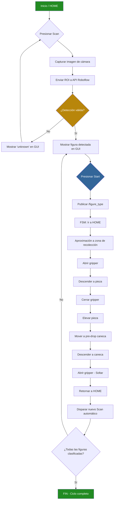
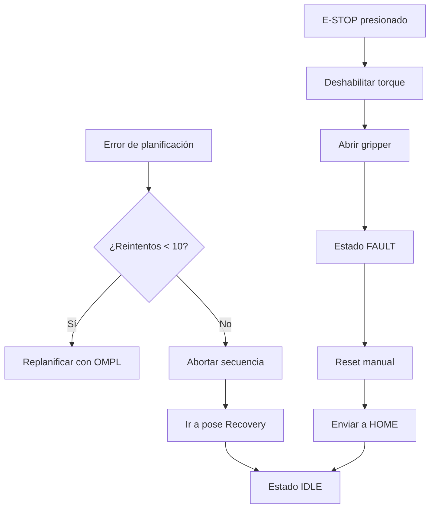
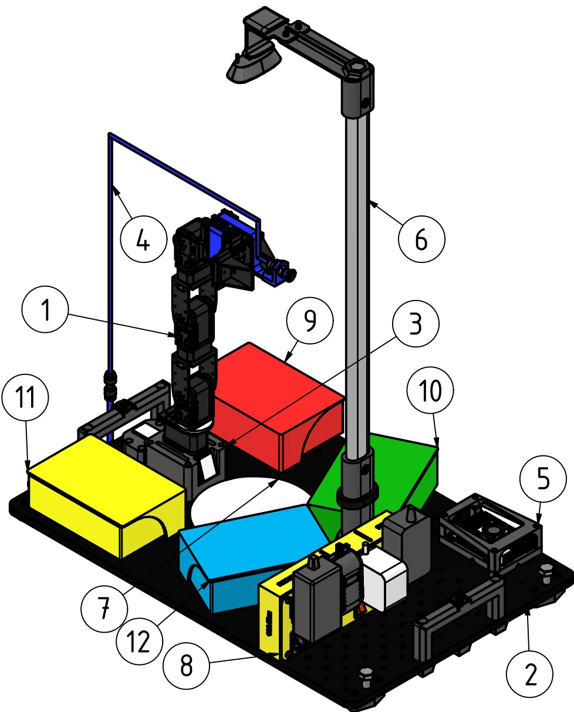
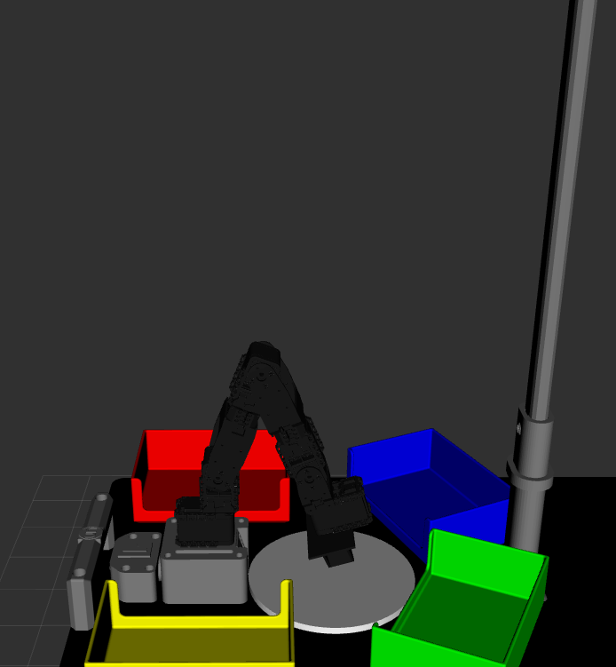
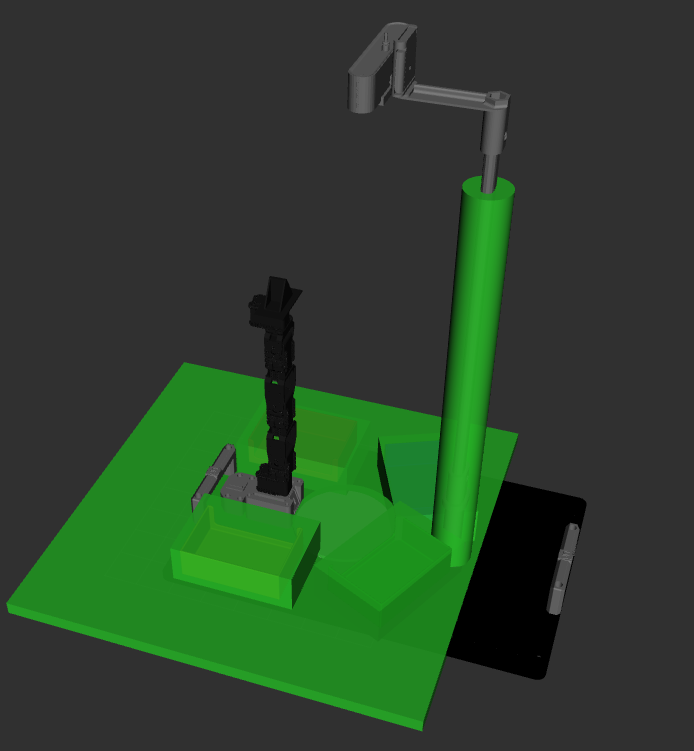
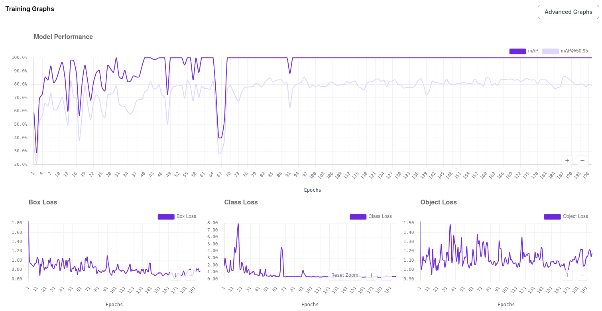
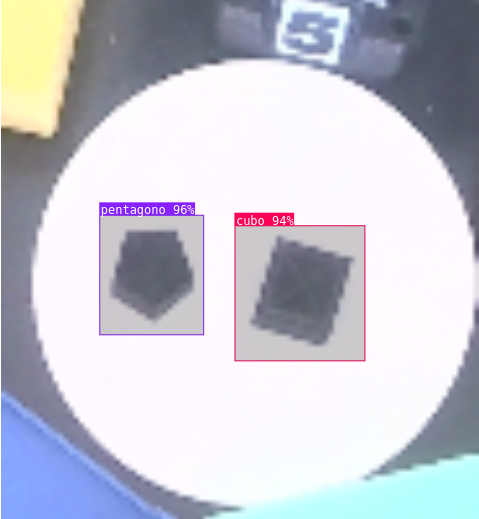

# Proyecto Final - Robótica 2026-I

## Clasificación Automatizada de Figuras Geométricas con PhantomX Pincher

Proyecto de clasificación automatizada utilizando el robot **PhantomX Pincher X**, visión de máquina mediante **API de Roboflow** (Object Detection), planificación de trayectorias con **MoveIt 2** y **ROS 2 Jazzy** sobre Ubuntu 24.04.

## Equipo

- Duvan Stiven Tique Osorio
- Luis Alberto Mendoza Rojaz
- Juan Diego López Mayorga
Edward Jeisen Jair Arévalo Peña

---

## 1. Descripción de la Solución y Alcance

### 1.1 Problema

Clasificar automáticamente figuras geométricas (cubo, cilindro, pentágono y rectángulo) depositadas sobre una bandeja de recolección y transportarlas mediante un brazo robótico de 4 GDL hasta la caneca correspondiente según su forma.

### 1.2 Solución Implementada

Se desarrolló un sistema integrado que combina:

- **Visión por computador**: una cámara USB captura la zona de recolección y mediante la API REST de Roboflow (modelo de Object Detection) se identifica la figura presente.
- **Planificación de movimiento**: MoveIt 2 con OMPL genera trayectorias libres de colisión desde la posición de recolección hasta cada caneca.
- **Control de hardware**: un nodo Python se comunica con los motores Dynamixel AX-12A del robot real a través del protocolo 1.0, ejecutando las trayectorias punto a punto.
- **Interfaz gráfica (GUI)**: una aplicación Tkinter permite al operador supervisar el proceso, disparar escaneos, iniciar ciclos y activar la parada de emergencia.

### 1.3 Alcance 

| Funcionalidad |
|---|
| Detección de 4 formas geométricas vía API Roboflow 
| Planificación de trayectorias con MoveIt 2 (OMPL)
| Ejecución en simulación (ros2_control fake) 
| Ejecución en robot real (Dynamixel AX-12A) 
| Clasificación a 4 canecas diferenciadas 
| Parada de emergencia con deshabilitación de torque 
| GUI con cámara en vivo, estados y controles 
| Objetos de colisión (mesa, canecas, bandeja, soporte) 
| Calibración  de motores 
| Calibración fina de offset articular (joint_calibration.yaml)
| Ejecución  en Raspberry Pi 5 


---

## 2. Bitácora del Desarrollo

### 2.1 Decisiones de Diseño

El diseño del sistema se fundamentó en la necesidad de ejecutar el proyecto tanto en un computador de escritorio como en una Raspberry Pi 5. Inicialmente se consideró utilizar un modelo YOLOv8 de clasificación entrenado localmente para la detección de figuras geométricas, sin embargo, las limitaciones de memoria y procesamiento de la Raspberry Pi 5 hicieron inviable la instalación de PyTorch y Ultralytics en ese hardware. Por esta razón se optó por delegar la inferencia a la API REST de Roboflow, que permite enviar una imagen y recibir la clasificación sin necesidad de ejecutar modelos pesados localmente.

Para la planificación de trayectorias se eligió MoveIt 2 con el planificador OMPL, ya que es el estándar en ROS 2 para manipulación robótica y ofrece soporte nativo de validación de colisiones. El nodo `commander` en C++ actúa como intermediario entre los comandos de alto nivel y MoveIt, permitiendo que los nodos de control en Python se comuniquen únicamente a través de tópicos ROS sin necesidad de gestionar directamente la interfaz de MoveIt.

El control del gripper se implementó como un comando directo a los ticks del servo Dynamixel, sin pasar por trayectorias de MoveIt, ya que la apertura y cierre del gripper es un movimiento simple que no requiere planificación. Esto reduce significativamente el tiempo de ciclo comparado con generar y ejecutar trayectorias completas para un solo joint prismático.

La arquitectura de inferencia se diseñó en modo bajo demanda: la API de Roboflow solo se consulta cuando el operador presiona el botón Scan en la GUI o cuando el clasificador finaliza un ciclo de pick & place. Este enfoque evita saturar la API con llamadas continuas y reduce el consumo de ancho de banda, que es especialmente relevante cuando el sistema se ejecuta en una Raspberry Pi conectada por WiFi.

### 2.2 Dificultades Encontradas

Durante el desarrollo del proyecto se presentaron varias dificultades técnicas que requirieron soluciones específicas. La primera y más crítica fue un problema con la planificación de trayectorias desde la posición Home. Cuando todas las articulaciones del robot se encontraban exactamente en 0 radianes, MoveIt presentaba un comportamiento errático: el robot podía completar un primer ciclo de pick & place correctamente, pero al intentar un segundo ciclo desde esa misma posición, el planificador no lograba calcular una trayectoria válida o la calculaba en sentido contrario al esperado. Después de analizar el problema se determinó que la configuración con todos los joints en cero representaba una singularidad o un punto límite para el solver cinemático KDL. La solución implementada fue definir la posición Home con un offset de 1 grado en todas las articulaciones (`[0.01745, 0.01745, 0.01745, 0.01745]` rad), lo cual eliminó completamente el problema y permitió al planificador encontrar soluciones consistentes en todos los ciclos subsecuentes.

La segunda dificultad importante se relacionó con el modelo de inteligencia artificial para la detección de figuras. El modelo YOLOv8 de clasificación entrenado originalmente funcionaba correctamente en un computador de escritorio con GPU, pero resultó imposible de desplegar en la Raspberry Pi 5 debido a que las dependencias de PyTorch y Ultralytics superaban la capacidad de memoria RAM disponible y el tiempo de inferencia era inaceptablemente lento sin aceleración por GPU. Para resolver este problema se migró completamente a la API de Roboflow, re-entrenando el modelo en la plataforma en línea y accediendo a la inferencia mediante peticiones HTTP REST. Esto permitió que la Raspberry Pi solo necesitara enviar una imagen codificada en base64 y recibir un JSON con la predicción, sin ninguna dependencia de frameworks de deep learning locales.

La tercera dificultad se manifestó en la calidad de las detecciones del modelo de visión. Se descubrió que las condiciones de iluminación afectaban severamente la precisión de la clasificación: cuando la iluminación no era cenital o producía sombras pronunciadas sobre las figuras geométricas, el modelo confundía los cubos con pentágonos de forma recurrente. Las sombras proyectadas alteraban la silueta percibida del cubo, generando aristas adicionales que el modelo interpretaba como los lados de un pentágono. La solución fue garantizar una iluminación superior difusa que minimizara las sombras, y ajustar el umbral de confianza (`confidence_threshold`) a 0.7 para descartar detecciones ambiguas. Adicionalmente, se re-entrenó el modelo en Roboflow incluyendo imágenes con variaciones de iluminación para mejorar su robustez.

### 2.3 Resultados

El sistema completo demostró ser funcional tanto en simulación como en el robot real. En modo simulado, el robot ejecuta secuencias completas de pick & place para las cuatro figuras geométricas sin errores de planificación, con un tiempo de ciclo promedio de 30 segundos por figura incluyendo los tiempos de espera entre movimientos. En el robot real, el tiempo de ciclo aumenta ligeramente a 35-40 segundos debido a la velocidad de los servos Dynamixel AX-12A y la latencia de comunicación con la API de Roboflow.

por el momento el brazo robotico solo es capaz de recolectar y posicionar la figura geometrica que se encuentre en el centro de la zona de recolección, es necesario añadir la funcionalidad de que pueda recojer las demás con mas tiempo de desarrollo.

### 2.4 Conclusiones

El uso de MoveIt 2 junto con RViz para la planificación de trayectorias de pick & place del brazo robótico permite realizar un desarrollo completamente simulado del sistema antes de ejecutar cualquier movimiento sobre el hardware real. Esta capacidad de simulación previa resulta fundamental para evitar posibles daños al robot durante la etapa de desarrollo, ya que permite visualizar cada trayectoria planificada, verificar que no existen colisiones con los objetos del entorno y confirmar que las secuencias de movimiento siguen el orden y la dirección esperados. Además, la simulación permite evidenciar problemas tanto en el diseño de las trayectorias como en la lógica de programación de la máquina de estados, lo cual convierte a MoveIt 2 con RViz en una herramienta indispensable para el desarrollo seguro e iterativo de aplicaciones de manipulación robótica.

La delegación de la inferencia de visión a una API externa como Roboflow simplifica significativamente la arquitectura del software y habilita la ejecución del sistema en hardware embebido de bajo costo como la Raspberry Pi 5, eliminando la necesidad de instalar frameworks pesados de deep learning. Sin embargo, esta decisión introduce una dependencia de conectividad a Internet que debe considerarse en el diseño de la aplicación y en la selección del entorno de operación.

Las condiciones de iluminación demostraron ser un factor crítico en la precisión del sistema de visión por computador aplicado a la clasificación geométrica. Las sombras producidas por iluminación lateral generan aristas falsas en las siluetas de los objetos que confunden al modelo de detección. Por lo tanto, el control de la iluminación debe considerarse como parte integral del diseño físico de la celda de trabajo y no únicamente como un aspecto del procesamiento de imagen por software.


## 3. Diagrama de Flujo del Proceso Global



### Manejo de Fallas



---

## 4. Plano de Planta



**Kit de clasificación completo ensamblado. Sus partes son:**

1. Manipulador robótico PhantomX Pincher AX-12 con 4 grados de libertad.
2. Plataforma base de MDF (554 mm × 360 mm × 9 mm) con acabado negro mate.
3. Base del manipulador con sistema de identificación numérica.
4. Sistema de succión por vacío con gripper intercambiable (no utilizado).
5. Controlador Raspberry Pi 5 en carcasa protectora.
6. Soporte de cámara con mástil vertical y brazo en voladizo.
7. Zona de recolección circular blanca (Ø146 mm).
8. Multitoma personalizada con control individual de subsistemas.
9. Caneca de depósito roja.
10. Caneca de depósito verde.
11. Caneca de depósito azul.
12. Caneca de depósito amarilla.

### Disposición de Elementos

| Elemento | Posición respecto a base del robot (m) |
|---|---|
| Base del robot | (0.0, 0.0, 0.0) — origen |
| Bandeja de recolección | (0.099, 0.0, 0.02) |
| Caneca roja (cubo) | (-0.009, 0.117, 0.04) |
| Caneca verde (cilindro) | (0.196, 0.091, 0.04) |
| Caneca azul (pentágono) | (0.192, -0.088, 0.04) |
| Caneca amarilla (rectángulo) | (-0.010, -0.110, 0.04) |
| Mesa de trabajo | (0.13, 0.0, -0.015) |
| Soporte de cámara | (0.26, 0.0, 0.009) |

---

## 5. Configuración de MoveIt

### 5.1 Modelo del Robot

- **URDF**: generado con Xacro desde `phantomx_pincher.urdf.xacro`
- **Grupos de planificación**:
  - `arm`: 4 articulaciones revolute (shoulder_pan, shoulder_lift, elbow_flex, wrist_flex)
  - `gripper`: 2 joints prismáticos (finger1, finger2) controlados por un solo servo
- **Planificador**: OMPL (RRT, RRTConnect, PRM, etc.)
- **Solver cinemático**: KDL

### 5.2 Escena de Planificación y Objetos de Colisión

El nodo `scene_objects_node.py` publica los siguientes objetos de colisión:

| Objeto | Tipo | Dimensiones |
|---|---|---|
| Mesa | BOX | 0.40 × 0.30 × 0.03 m |
| Bandeja | BOX | 0.08 × 0.08 × 0.02 m |
| Caneca roja | BOX | 0.04 × 0.04 × 0.08 m |
| Caneca verde | BOX | 0.04 × 0.04 × 0.08 m |
| Caneca azul | BOX | 0.04 × 0.04 × 0.08 m |
| Caneca amarilla | BOX | 0.04 × 0.04 × 0.08 m |
| Soporte cámara | BOX | 0.05 × 0.05 × 0.30 m |

### 5.3 Poses Objetivo (poses.yaml)

Las poses están definidas en coordenadas cartesianas (x, y, z, roll, pitch, yaw) en el frame de la base del robot:

| Pose | x | y | z | Uso |
|---|---|---|---|---|
| home / scan | 0.0 | 0.0 | 0.406 | Posición segura, no obstruye cámara |
| recoleccion_1 | 0.100 | 0.0 | 0.140 | Aproximación sobre la bandeja |
| recoleccion_2 | 0.099 | 0.0 | 0.045 | Contacto con el objeto |
| caneca_roja | -0.009 | 0.117 | 0.104 | Drop: cubo |
| caneca_verde | 0.196 | 0.091 | 0.179 | Drop: cilindro |
| caneca_azul | 0.192 | -0.088 | 0.184 | Drop: pentágono |
| caneca_amarilla | -0.010 | -0.110 | 0.109 | Drop: rectángulo |


---

## 6. Calibración Cámara–Bandeja–Robot

### 6.1 Método

La calibración se realiza mediante ROI (Region of Interest) proporcional en la imagen:

1. Se posiciona la cámara sobre la bandeja de recolección usando el soporte impreso en 3D.
2. Se ajustan los parámetros de ROI (porcentaje del ancho y alto de la imagen) para delimitar exactamente la zona de la bandeja visible.
3. El ROI se configura en el launch o dinámicamente desde la GUI.

### 6.2 Parámetros de ROI

```yaml
roi_x_min_pct: 0.35  # 35% desde la izquierda
roi_x_max_pct: 0.65  # 65% desde la izquierda
roi_y_min_pct: 0.35  # 35% desde arriba
roi_y_max_pct: 0.65  # 65% desde arriba
```

Estos valores se pueden ajustar dinámicamente desde la GUI con sliders y el botón "Aplicar ROI", que publica en `/roi_config`.

### 6.3 Calibración de Motores

La calibración global de los motores reales se centraliza en:

```
phantom_ws/src/phantomx_pincher_bringup/config/joint_calibration.yaml
```

```yaml
pincher_follow_joint_trajectory:
  ros__parameters:
    joint_offsets_degrees: [-2.0, 0.0, 0.0, 0.0, 0.0]
```

Orden: `[ID1_shoulder_pan, ID2_shoulder_lift, ID3_elbow_flex, ID4_wrist_flex, gripper]`

### 6.4 Validación

- Se verificó que el robot real coincide con la visualización en RViz al ejecutar movimientos articulares individuales.
- Se corrigieron los signos de los 4 motores del brazo para que el sentido de giro físico coincida con el modelo.


---

## 7. Código Fuente 

El código fuente de cada nodo está documentado con READMEs  individuales:

| Nodo | Descripción | Documentación |
|---|---|---|
| `follow_joint_trajectory_node.py` | Control de hardware Dynamixel AX-12A | [README](phantom_ws/src/pincher_control/README.follow_joint_trajectory_node.md) |
| `clasificador_node.py` | FSM de pick & place | [README](phantom_ws/src/pincher_control/README.clasificador_node.md) |
| `recognition_node.py` | Visión vía API Roboflow (bajo demanda) | [README](phantom_ws/src/pincher_control/README.recognition_node.md) |
| `scene_objects_node.py` | Objetos de colisión para MoveIt | [README](phantom_ws/src/pincher_control/README.md) |
| `gui_node.py` | Interfaz gráfica de usuario | [README](phantom_ws/src/pincher_control/README.md) |
| `commander_template.cpp` | Puente MoveIt ↔ comandos de alto nivel | [README](phantom_ws/src/phantomx_pincher_commander_cpp/README.commander.md) |
| `routine_manager.py` | Alternativa declarativa (YAML) al clasificador | [README](phantom_ws/src/pincher_control/README.routine_manager.md) |

---

## 8. Interfaz Gráfica de Usuario (GUI)

La GUI se ejecuta con:

```bash
ros2 run pincher_control pincher_gui
```

### 8.1 Funcionalidades

| Elemento | Descripción |
|---|---|
| Cámara en vivo | Imagen de `/camera/debug` con ROI dibujado y detección |
| Estado FSM | Indicador visual del estado actual (IDLE, PICK, FAULT, DONE) |
| Conteo de figuras | Figuras clasificadas vs. total por tipo |
| Estado de MoveIt | Listo / En ejecución / Fallo |
| Estado de torque | Indicador verde/rojo del estado de los motores |
| Sliders de ROI | Ajuste dinámico de la zona de detección |

### 8.2 Controles

| Botón | Función |
|---|---|
| 📷 Scan | Consulta la API **una sola vez** y muestra el resultado. No mueve el robot. |
| ▶ Start | Inicia el pick & place usando la última detección de Scan. **Esto mueve el robot.** |
| ⏹ Stop | Aborta la secuencia en curso |
| ⚠ E-STOP | Parada de emergencia: desactiva torque de todos los motores |
| 🔄 Reset | Limpia fallas y envía al robot a HOME |
| 🏠 Home | Envía articulaciones a posición segura |
| ➡ Next | Modo paso a paso: ejecuta un ciclo para la figura detectada |
| 🔓 Open / 🔒 Close | Control manual del gripper |

### 8.3 Capturas de la GUI


---

## 9. Archivos de Configuración

### 9.1 Poses del robot (`poses.yaml`)

```
phantom_ws/src/phantomx_pincher_bringup/config/poses.yaml
```

Contiene todas las poses cartesianas del sistema: home, scan, recovery, recoleccion_1/2, pre_drop_X, caneca_X.

### 9.2 Calibración de motores (`joint_calibration.yaml`)

```
phantom_ws/src/phantomx_pincher_bringup/config/joint_calibration.yaml
```

Offsets en grados para corregir discrepancias mecánicas del robot real.

### 9.3 Posiciones iniciales (`initial_joint_positions.yaml`)

```
phantom_ws/src/phantomx_pincher_description/config/initial_joint_positions.yaml
```

Posiciones de arranque para la simulación (ros2_control fake).

### 9.4 Rutinas YAML (`routines.yaml`)

```
phantom_ws/src/pincher_control/config/routines.yaml
```

Secuencias declarativas de movimientos para el `routine_manager`.

### 9.5 Credenciales de Roboflow (`.env`)

```
phantom_ws/src/pincher_control/config/.env
```

Archivo local (ignorado por git) con `PINCHER_API_KEY` y `PINCHER_MODEL_ID`. Plantilla disponible en `.env.example`.

### 9.6 Controladores MoveIt

```
phantom_ws/src/phantomx_pincher_bringup/config/controllers_position.yaml
phantom_ws/src/phantomx_pincher_moveit_config/config/joint_limits.yaml
phantom_ws/src/phantomx_pincher_moveit_config/config/kinematics.yaml
phantom_ws/src/phantomx_pincher_moveit_config/config/ompl_planning.yaml
```

---

## 10. Evidencias de RViz

### 10.1 Escena de Planificación


### 10.2 Trayectorias Planificadas




### 10.3 Validación de Colisiones



---

## 11. Modelo de Detección (Roboflow)

### 11.1 Información del Modelo

| Parámetro | Valor |
|---|---|
| Plataforma | [Roboflow](https://roboflow.com) |
| Tipo de proyecto | Object Detection |
| Arquitectura | YOLOv8s |
| Model ID | `duvans-workspace-fy2lt/deteccion-de-figuras-0hn7y-4-yolov8s-t1` |
| Clases | `cubo`, `cilindro`, `pentagono`, `rectangulo` |
| Umbral de confianza | 0.70 (configurable) |

El modelo fue entrenado en la plataforma de Roboflow utilizando imágenes del ROI de la cámara del kit en diversas condiciones de iluminación. La arquitectura YOLOv8s ofrece un balance adecuado entre velocidad de inferencia y precisión para la detección de formas geométricas simples.

### 11.2 Endpoint de la API

La inferencia se realiza mediante una petición POST al endpoint:

```
https://detect.roboflow.com/deteccion-de-figuras-0hn7y-4-yolov8s-t1?api_key=<API_KEY>
```

El cuerpo de la petición es la imagen codificada en base64. La respuesta es un JSON con las detecciones:

```json
{
  "predictions": [
    {
      "x": 60,
      "y": 47,
      "width": 22,
      "height": 22,
      "confidence": 0.939,
      "class": "pentagono",
      "class_id": 2,
      "detection_id": "ecb69f88-ecb4-444f-b54e-5fcaf37d7556"
    },
    {
      "x": 29.5,
      "y": 62.5,
      "width": 25,
      "height": 25,
      "confidence": 0.916,
      "class": "cubo",
      "class_id": 1,
      "detection_id": "70750882-7498-4389-b45a-f61d52666bcd"
    }
  ]
}
```

Cada predicción incluye:
- `x`, `y`: centro del bounding box (píxeles).
- `width`, `height`: dimensiones del bounding box.
- `confidence`: probabilidad de la detección (0.0–1.0).
- `class`: clase detectada (nombre de la figura).

Cuando se detectan múltiples objetos en el ROI, el sistema selecciona automáticamente la predicción con mayor `confidence`.

### 11.3 Métricas de Entrenamiento



### 11.4 Ejemplo de Detección



### 11.5 Consideraciones de Iluminación

El modelo fue re-entrenado con variaciones de iluminación para mejorar su robustez. Sin embargo, se recomienda utilizar iluminación cenital difusa para obtener los mejores resultados, ya que las sombras laterales pronunciadas pueden generar confusiones entre cubos y pentágonos debido a las aristas falsas que las sombras producen en la silueta de los objetos.

---

## 13. Clasificación de Figuras

| Figura detectada | Destino | Color caneca |
|---|---|---|
| cubo | caneca_roja | 🔴 |
| cilindro | caneca_verde | 🟢 |
| pentagono | caneca_azul | 🔵 |
| rectangulo | caneca_amarilla | 🟡 |

---

## Instalación Rápida

### Requisitos

- Ubuntu 24.04 LTS
- ROS 2 Jazzy (Desktop Install)
- Python 3.12
- Git + Git LFS

### Pasos

```bash
# 1. Dependencias del sistema
sudo apt install -y \
  ros-jazzy-ros2-control ros-jazzy-ros2-controllers \
  ros-jazzy-xacro ros-jazzy-joint-state-publisher-gui \
  ros-jazzy-tf-transformations ros-jazzy-moveit* \
  ros-jazzy-dynamixel-sdk ros-jazzy-control-msgs \
  python3-pip python3-colcon-common-extensions python3-tk \
  python3-dotenv git-lfs ros-jazzy-usb-cam

# 2. Dependencias Python
pip install --break-system-packages requests transforms3d pillow

# 3. Clonar
git lfs install
git clone https://github.com/DuvanTique/Proyecto-Robotica-Phanton-pincherx.git
cd Proyecto-Robotica-Phanton-pincherx/phantom_ws

# 4. Compilar
source /opt/ros/jazzy/setup.bash
./build.sh
source install/setup.bash

# 5. Configurar credenciales de Roboflow
cd src/pincher_control/config
cp .env.example .env
nano .env  # completar PINCHER_API_KEY y PINCHER_MODEL_ID
cd ../../../
./build.sh
source install/setup.bash
```

### Ejecución

```bash
# Simulación
ros2 launch phantomx_pincher_bringup phantomx_pincher.launch.py \
  use_real_robot:=false start_clasificador:=true

# Robot real (puerto USB configurable)
ros2 launch phantomx_pincher_bringup phantomx_pincher.launch.py \
  use_real_robot:=true start_clasificador:=true port:=/dev/ttyUSB1

# Visión
ros2 launch phantomx_pincher_bringup vision_bringup.launch.py \
  start_camera:=true camera_device:=/dev/video4 start_clasificador:=true

# GUI
ros2 run pincher_control pincher_gui
```

---

## Tópicos Principales

| Tópico | Tipo | Función |
|---|---|---|
| `/pose_command` | PoseCommand | Pose objetivo → commander → MoveIt |
| `/figure_type` | String | Figura confirmada por Start → inicia pick & place |
| `/figure_state` | String | Última detección (actualizada tras `/trigger_scan`) |
| `/trigger_scan` | Bool | Dispara una consulta a la API (sin mover robot) |
| `/joint_states` | JointState | Estado articular del robot |
| `/set_gripper` | Bool | Control directo del gripper (True=abrir) |
| `/routine_busy` | Bool | FSM ocupada (pausa escaneos) |
| `/emergency_stop` | Bool | Parada de emergencia |
| `/joint_command` | Float64MultiArray | Comando directo de articulaciones |
| `/roi_config` | Float32MultiArray | Ajuste dinámico del ROI |
| `/torque_status` | Bool | Estado de torque de los motores |

---

## Solución de Problemas

### El brazo se mueve al revés

Verificar `joint_sign` en `follow_joint_trajectory_node.py`:

```python
self.joint_sign = {1: -1, 2: 1, 3: 1, 4: 1, gripper_id: 1}
```

### Puerto USB incorrecto

```bash
ls -l /dev/ttyUSB* /dev/ttyACM*
# Usar el argumento port:= del launch
ros2 launch ... port:=/dev/ttyUSB1
```

### Permisos del puerto

```bash
sudo usermod -aG dialout $USER
# Reiniciar sesión
```

### MoveIt no planifica

El robot puede estar en una configuración rechazada. Enviar a HOME manualmente:

```bash
ros2 topic pub -1 /joint_command example_interfaces/msg/Float64MultiArray "{data: [0.01745, 0.01745, 0.01745, 0.01745]}"
```

### API devuelve "unknown" siempre

1. Verificar que `.env` tiene las credenciales correctas
2. Probar con curl:
```bash
source src/pincher_control/config/.env
curl -s -X POST "https://classify.roboflow.com/${PINCHER_MODEL_ID}?api_key=${PINCHER_API_KEY}" \
  -H "Content-Type: application/x-www-form-urlencoded" \
  --data-binary "@imagen_prueba.jpg"
```

---

## Estructura del Proyecto

```
phantom_ws/src/
├── phantomx_pincher_description/     # URDF/Xacro, meshes STL/DAE, soporte cámara
├── phantomx_pincher_moveit_config/   # MoveIt 2: OMPL, SRDF, controladores, cinemática
├── phantomx_pincher_bringup/         # Launch files principales
│   └── config/
│       ├── poses.yaml                # Poses cartesianas calibradas
│       ├── joint_calibration.yaml    # Offsets de calibración de motores
│       └── controllers_position.yaml # Controladores ros2_control
├── phantomx_pincher_commander_cpp/   # Nodo C++: puente /pose_command ↔ MoveIt
├── phantomx_pincher_interfaces/      # Mensaje personalizado PoseCommand
└── pincher_control/                  # Nodos Python de control y visión
    ├── config/
    │   ├── .env.example              # Plantilla de credenciales Roboflow
    │   └── routines.yaml             # Rutinas declarativas de movimiento
    └── pincher_control/
        ├── clasificador_node.py      # FSM de pick & place
        ├── follow_joint_trajectory_node.py  # Hardware Dynamixel AX-12A
        ├── recognition_node.py       # Visión bajo demanda (API Roboflow)
        ├── scene_objects_node.py     # Objetos de colisión
        ├── gui_node.py               # Interfaz gráfica Tkinter
        └── routine_manager.py        # Alternativa declarativa YAML
```

---

## Video de Demostración

Video completo del sistema funcionando en simulación y robot real (pick & place con clasificación de figuras geométricas):

🎥 [Ver video en Google Drive](https://drive.google.com/file/d/1GDtk2CfndklqoegfKm_4qSE93gW8hNvB/view?usp=sharing)
