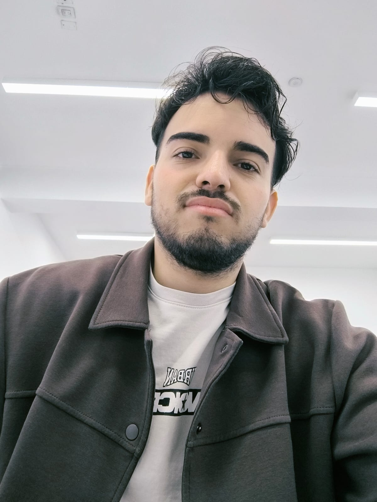
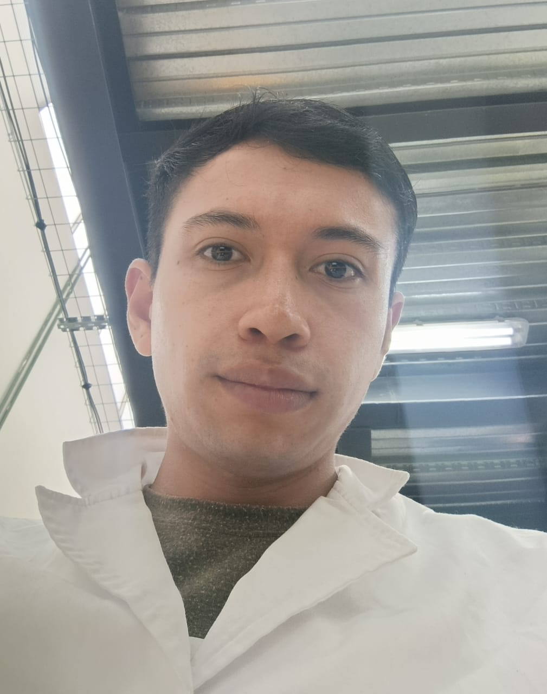

<picture>
    <source srcset="https://imgur.com/5bYAzsb.png" media="(prefers-color-scheme: dark)">
    <source srcset="https://imgur.com/Os03JoE.png" media="(prefers-color-scheme: light)">
    
</picture>

<h3>Curso de Robótica 2026-I</h3>

<h1>Compilado de Informes de Laboratorio de Robótica</h1>

<h2>Profesores:  Pedro Fabián Cárdenas Herrera   Manuel Felipe Carranza Montenegro</h2>

<h4>Luis Alberto Mendoza Rojas 
    Duvan Stiven Tique</h4>

  
  
  
  
  
  
  
  
  
  
  
  
  

---

## Descripción

Este repositorio corresponde al desarrollo de las actividades del curso de **Robótica 2026-I**.  
Aquí se documentan los laboratorios, avances, resultados y la presentación de los integrantes del equipo.

---

## Objetivos del repositorio

- Organizar el desarrollo de los laboratorios del curso.
- Documentar procedimientos, resultados y evidencias.
- Presentar formalmente a los integrantes del equipo.
- Mantener una estructura clara y ordenada para la evaluación.

---

## Integrantes del equipo

### Integrante 1 — Luis Alberto Mendoza Rojas

   

- **Nombre completo:** Luis Alberto Mendoza Rojas
- **Carrera:** Ingeniería Mecatrónica
- **Correo institucional:** lmendozar@unal.edu.co
- **Usuario de GitHub:** [lmendozar2001](https://github.com/lmendozar2001)
- **Rol en el equipo:** Integración ROS 2, visión de máquina, planificación con MoveIt
- **Intereses:** Robótica industrial, visión artificial, automatización de procesos
- **Descripción breve:**  
  Estudiante de Ingeniería Mecatrónica de la Universidad Nacional de Colombia. Interesado en la integración de sistemas robóticos con visión computacional y el desarrollo de celdas automatizadas de manufactura.

---

### Integrante 2 — Duvan Stiven Tique

   

- **Nombre completo:** Duvan Stiven Tique
- **Carrera:** Ingeniería Mecatrónica
- **Correo institucional:** dtiqueo@unal.edu.co
- **Usuario de GitHub:** [DuvanTique](https://github.com/DuvanTique)
- **Rol en el equipo:** Modelado 3D, configuración MoveIt, control de actuadores y sistema de vacío
- **Intereses:** Robótica de manipulación, diseño mecatrónico, control de sistemas embebidos
- **Descripción breve:**  
  Estudiante de Ingeniería Mecatrónica de la Universidad Nacional de Colombia. Enfocado en el diseño y modelado de sistemas robóticos, integración de hardware y control de actuadores para aplicaciones de manipulación automatizada.

