# Laboratorio No. 05: Cinemática - Robot Phantom X Pincher X100

# Integrantes

- [José Luis Pulido Fonseca](https://github.com/jpulidof)
- [Jairo David Díaz Luna](https://github.com/Axum-User)

# Informe

## Índice

1. [Descripción General y Entorno](#descripción-general-y-entorno)
2. [Diagrama de Flujo y Plano de Planta](#diagrama-de-flujo-y-plano-de-planta)
3. [Actividad 1: Preparación del robot](#actividad-1-preparación-del-robot)
4. [Actividad 2: Identificación de motores y articulaciones](#actividad-2-identificación-de-motores-y-articulaciones)
5. [Actividad 3: Medición del robot](#actividad-3-medición-del-robot)
6. [Actividad 4: Movimiento individual de articulaciones](#actividad-4-movimiento-individual-de-articulaciones)
7. [Actividad 5: Calibración de cero y error articular](#actividad-5-calibración-de-cero-y-error-articular)
8. [Actividad 6: Determinación de límites seguros](#actividad-6-determinación-de-límites-seguros)
9. [Actividad 7: Movimiento simultáneo](#actividad-7-movimiento-simultáneo)
10. [Actividad 8: Movimiento secuencial](#actividad-8-movimiento-secuencial)
11. [Actividad 9: Interpolación de trayectorias](#actividad-9-interpolación-de-trayectorias)
12. [Actividad 10: Trayectoria sinusoidal de una articulación](#actividad-10-trayectoria-sinusoidal-de-una-articulación)
13. [Actividad 11: Cinemática directa](#actividad-11-cinemática-directa)
14. [Actividad 12: Cinemática inversa](#actividad-12-cinemática-inversa)
15. [Actividad 13: Enseñanza y repetición de poses](#actividad-13-enseñanza-y-repetición-de-poses)
16. [Actividad 14: Trazado de una figura](#actividad-14-trazado-de-una-figura)
17. [Actividad 15: Reto final - Coreografía robótica](#actividad-15-reto-final---coreografía-robótica)
18. [Código Fuente](#código-fuente)
19. [Evidencias de Video](#evidencias-de-video)
20. [Conclusiones Individuales](#conclusiones-individuales)

---

## Descripción General y Entorno de Desarrollo

El presente laboratorio abarca el diseño, modelado matemático, validación cinemática y control dinámico del manipulador robótico de 5 grados de libertad **Phantom X Pincher X100**. La solución se desarrolló dentro del ecosistema de ROS 2, integrando módulos personalizados en Python para la resolución de la cinemática directa e inversa, planificación e interpolación de trayectorias con evasión de obstáculos en el espacio de configuración (C-Space), captura y reproducción de posturas mediante archivos de persistencia YAML, y la sincronización temporal de rutinas de trazado y coreografía.


### Entorno de Desarrollo y Herramientas

La arquitectura del sistema y la validación en laboratorio se desplegaron bajo el siguiente entorno tecnológico:

#### 1. Software y Frameworks
* **Sistema Operativo:** Ubuntu 22.04 LTS (Jammy Jellyfish).
* **Framework Robótico:** ROS 2 (Robot Operating System) — Distribución **Humble Hawksbill**.
* **Lenguaje de Programación:** Python 3.10+ utilizando las librerías `rclpy`, `numpy`, `matplotlib` (para gráficos de telemetría) y `PyYAML` (para serialización de secuencias).
* **Visualización y Simulación:** **RViz2** para el renderizado e inspección 3D del modelo URDF del robot en tiempo real.

#### 2. Hardware y Comunicaciones
* **Manipulador Robótico:** Phantom X Pincher X100 (4 DOF en brazo + 1 DOF en efector final/pinza).
* **Actuadores:** 5 Servomotores digitales **Dynamixel AX-12A** con protocolo de comunicación serie asíncrono y encoders de retroalimentación de posición.
* **Interfaz de Comunicación:** Tarjeta controladora USB a TTL (U2D2 / Arbotix) para la gestión del bus de comunicación a 1 Mbps.

#### 3. Estructura del Paquete
La solución está encapsulada dentro del paquete `pincher_control`, cuya jerarquía interna separa el motor matemático (`Kin.py`), el verificador de límites (`limits_pincher.py`), el generador de trayectorias (`tracer.py`), la secuencia de comandos (`phantomx_sequencer.py`) y la interfaz interactiva (`main_menu.py`).

---

## Diagrama de Flujo y Plano de Planta

### Diagrama de Flujo de las Acciones del Robot
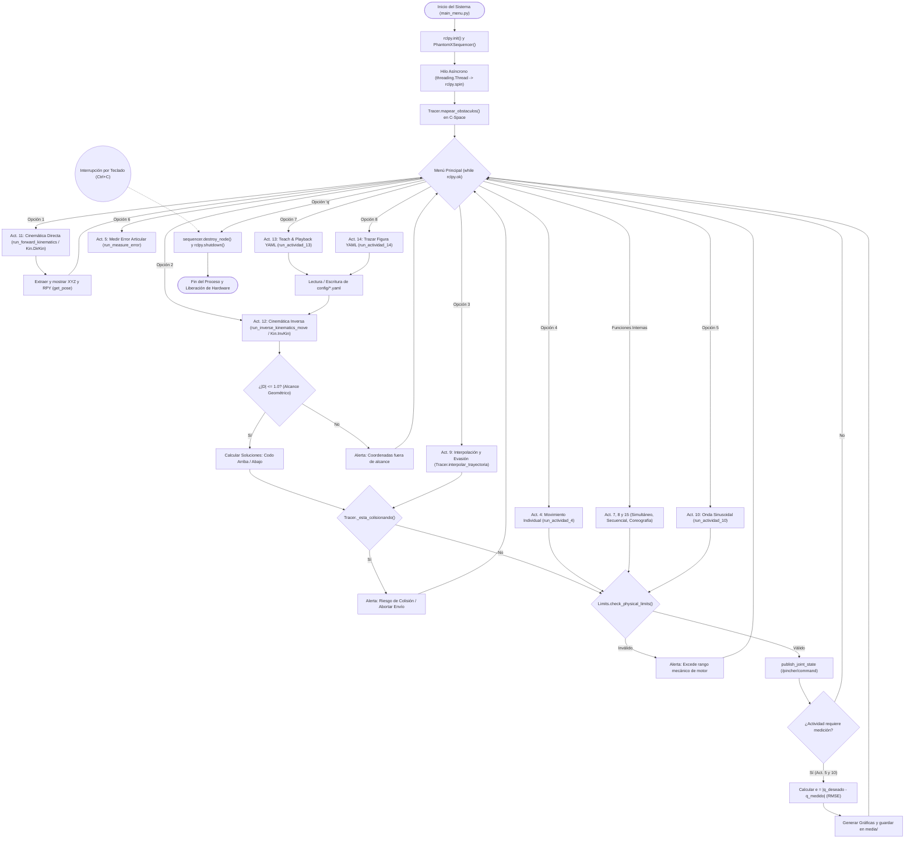

### Plano de Planta y Disposición del Trabajo


Para la visualización detallada de la celda de trabajo, acotado de componentes y la disposición espacial del manipulador robótico dentro del entorno de laboratorio, se generó el plano técnico correspondiente en formato ISO.

El plano completo de la celda y el ensamblado de la planta se puede consultar e inspeccionar en el siguiente enlace:

* 📄 [**Ver Plano de Planta de la Celda de Trabajo (PDF)**](media/Ensamble%20Planta.pdf)
---

## Actividad 1: Preparación del robot

Se ubicó el robot en una posición segura, se verificó la conexión de los servomotores y se comprobó que el modelo en RViz correspondiera sincronizadamente con la postura física del manipulador tras la energización.

---

## Actividad 2: Identificación de motores y articulaciones

| Articulación | ID Dynamixel | Referencia | Sentido positivo | Función |
| --- | --- | --- | --- | --- |
| **Base** |001|AX-12A|Antihorario|Permitir la rotación del eje Z|
| **Hombro** |002|AX-12A| Antihorario |Permitir la rotación del eje Y|
| **Codo** | 003 |AX-12A| Antihorario |Permitir la rotación del eje Y|
| **Muñeca** | 004 |AX-12A| Antihorario |Permitir la rotación del eje Y|
| **Pinza** | 005 |AX-12A| Antihorario |Transformar la rotación en translación, para que por medio de fricción, se puedan sostener objetos en el eje Z|

---

## Actividad 3: Medición del robot

Se realizaron las mediciones geométricas directas sobre la estructura física del manipulador **Phantom X Pincher X100** utilizando calibrador para caracterizar la cadena cinemática y establecer las longitudes de los eslabones previa a la formulación cinemática.

### Dimensiones Estructurales del Manipulador

| Tramo / Eslabón | Descripción Geométrica | Distancia (mm) | Variable Cinematográfica |
| :--- | :--- | :---: | :---: |
| **Base a Hombro** | Distancia vertical desde la superficie del origen hasta el eje de rotación del hombro | **153.0** | $L_1$ ($d_1$) |
| **Hombro a Codo** | Longitud entre los ejes paralelos del hombro y el codo | **106.0** | $L_2$ ($a_2$) |
| **Codo a Muñeca** | Longitud entre los ejes paralelos del codo y la muñeca | **106.0** | $L_3$ ($a_3$) |
| **Muñeca a TCP** | Distancia desde el eje de la muñeca hasta el Punto Central de la Herramienta (TCP) | **96.0** | $L_4$ ($a_4$) |

---

### Caracterización de la Cadena Cinemática

* **Eslabón 1 (Base - $L_1$):** Offset vertical total de **153 mm**, comprendido por la estructura de soporte fija y el acople del primer servomotor Dynamixel AX-12A.
* **Eslabón 2 (Brazo - $L_2$):** Longitud efectiva de **106 mm** entre centros de pivote.
* **Eslabón 3 (Antebrazo - $L_3$):** Longitud efectiva de **106 mm** entre centros de pivote.
* **Eslabón 4 (Efector Final / TCP - $L_4$):** Longitud de **96 mm** desde el eje de articulación de la muñeca hasta el extremo operativo de las ganchos de la pinza.

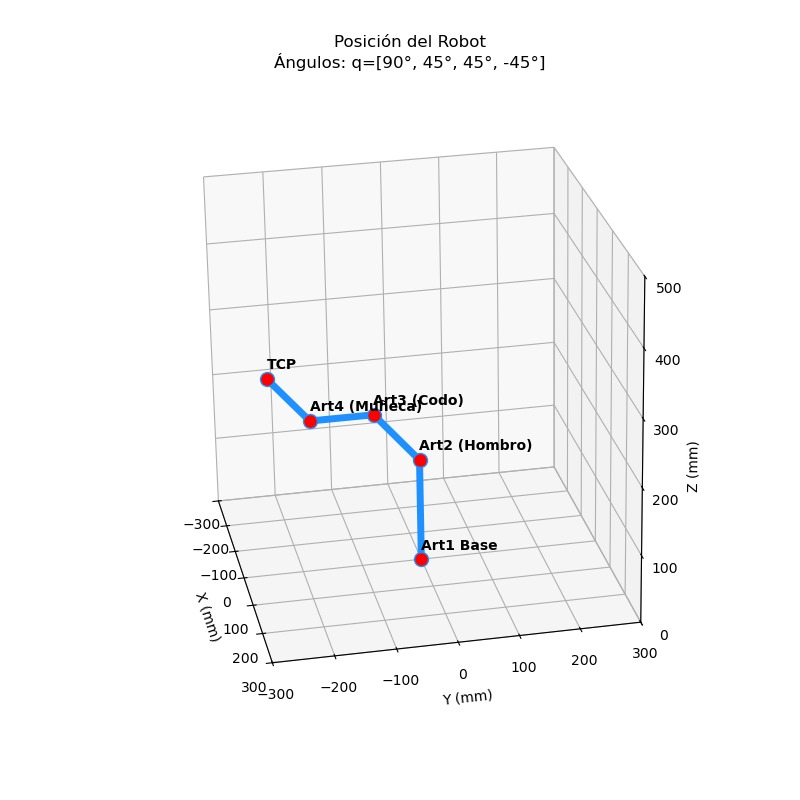
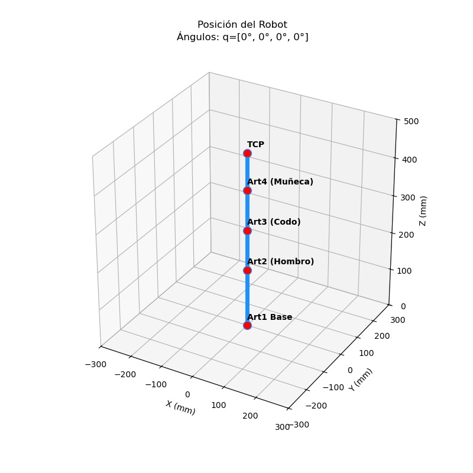

---

## Actividad 4: Movimiento individual de articulaciones

Se implementó un módulo de control para la activación independiente de cada uno de los 5 servomotores Dynamixel AX-12A que componen el manipulador (Base, Hombro, Codo, Muñeca y Pinza). El objetivo principal consistió en validar el correcto funcionamiento dinámico de cada eje en solitario, verificar la respuesta de la comunicación mediante el tópico `/pincher/command` de ROS 2 y comprobar la restitución a la postura de referencia homónima ($q_0 = [0, 0, 0, 0, 0]^\circ$).

### Descripción de la Prueba
Para cada articulación se definieron dos modos de prueba en la interfaz de usuario:
1. **Modo Manual:** Permitió la selección individual de la articulación y la inyección directa de consignas angulares personalizadas en grados.
2. **Modo Automático:** Ejecutó de forma secuencial una rutina de prueba consistente en mover cada motor por tres posiciones angulares distintas a lo largo de su espacio de trabajo, realizando una pausa de estabilización de 1.5 segundos por paso y retornando obligatoriamente a la posición de Home ($0.0^\circ$) antes de proceder con el siguiente eje.

### Registro de Posiciones Evaluadas por Articulación

| Articulación | Posición 1 (°) | Posición 2 (°) | Posición 3 (°) | Posición Referencia (°) | Estado de Validación |
| :--- | :---: | :---: | :---: | :---: | :---: |
| **Base (`waist`)** | $+45.0$ | $-45.0$ | $+90.0$ | $0.0$ | Correcto / Sin Bloqueos |
| **Hombro (`shoulder`)** | $+30.0$ | $-30.0$ | $+60.0$ | $0.0$ | Correcto / Sin Bloqueos |
| **Codo (`elbow`)** | $+45.0$ | $-45.0$ | $+75.0$ | $0.0$ | Correcto / Sin Bloqueos |
| **Muñeca (`wrist`)** | $+30.0$ | $-30.0$ | $+60.0$ | $0.0$ | Correcto / Sin Bloqueos |
| **Pinza (`gripper`)** | $+20.0$ | $-20.0$ | $+45.0$ | $0.0$ | Correcto / Sin Bloqueos |

---

### Fragmento de Código Implementado

El siguiente bloque de código en Python representa el método `run_actividad_4` dentro de la clase `PhantomXSequencer`. Incluye la lógica de selección de modo, la conversión de grados a radianes, la verificación dentro de la función de límites `check_limits` y la publicación hacia el robot:

```python
    def run_actividad_4(self):
        """Movimiento independiente de cada articulación con selección manual y rutina de 3 puntos"""
        while True:
            print("\n--- Ejecutando Actividad 4: Movimientos Independientes ---")
            print("1. [Modo Manual] Seleccionar articulación e ingresar ángulo")
            print("2. [Modo Automático] Rutina de evaluación (3 posiciones + Home por motor)")
            print("3. Regresar al menú principal")
            
            opc = input("Selección (1-3): ").strip()
            
            if opc == '1':
                # Selección manual de una articulación y envío de ángulo
                print("\nSeleccione la articulación a mover:")
                for i, name in enumerate(self.joint_names):
                    print(f"{i+1}. {name}")
                
                try:
                    j_sel = int(input("Opción (1-5): "))
                    if 1 <= j_sel <= 5:
                        joint_name = self.joint_names[j_sel - 1]
                        angle_deg = float(input(f"Ingrese la posición angular para '{joint_name}' (en grados): "))
                        angle_rad = math.radians(angle_deg)
                        
                        safe_rad = self.check_limits(joint_name, angle_rad)
                        print(f"Transmitiendo comando a {joint_name}: {math.degrees(safe_rad):.1f}°...")
                        self.publish_joint_state([joint_name], [safe_rad])
                        time.sleep(1.0)
                    else:
                        print("Selección de articulación inválida.")
                except ValueError:
                    print("Entrada no válida. Use números.")
                    
            elif opc == '2':
                # Rutina automática: 3 posiciones de prueba y retorno a Home por cada motor
                rutinas_prueba = {
                    'waist': [45.0, -45.0, 90.0],
                    'shoulder': [30.0, -30.0, 60.0],
                    'elbow': [45.0, -45.0, 75.0],
                    'wrist': [30.0, -30.0, 60.0],
                    'gripper': [20.0, -20.0, 45.0]
                }
                
                print("\nIniciando rutina de validación automática...")
                for name in self.joint_names:
                    print(f"\n>> Validando motor: {name.upper()}")
                    
                    # Ejecución de las 3 posiciones
                    for i, pos_deg in enumerate(rutinas_prueba[name]):
                        pos_rad = math.radians(pos_deg)
                        safe_rad = self.check_limits(name, pos_rad)
                        
                        print(f"  Paso {i+1}/3: Moviendo a {pos_deg}°")
                        self.publish_joint_state([name], [safe_rad])
                        time.sleep(1.5) # Pausa para posicionamiento del servo
                    
                    # Retorno a la posición de referencia (Home)
                    print(f"  Regresando {name} a la posición de referencia (0.0°)")
                    self.publish_joint_state([name], [0.0])
                    time.sleep(1.5)
                
                print("\n✅ Rutina de validación completada para los 5 motores.")
                
            elif opc == '3':
                break
            else:
                print("Opción inválida.")
```

### Análisis de Resultados

* *Aislamiento de Ejes:* Se confirmó que al publicar mensajes de tipo sensor_msgs/msg/JointState afectando a una sola articulación por nombre, las demás mantuvieron su torque de sujeción sin presentar acoplamientos indeseados o deriva de posición.

* *Validación de Retorno a Cero:* Cada motor regresó de manera precisa al origen tras la prueba de tres posiciones, garantizando repetibilidad inicial antes de proceder con pruebas simultáneas.
---

## Actividad 5: Calibración de cero y error articular

Se evaluó la precisión de posicionamiento de las 5 articulaciones del manipulador comparando la posición teórica enviada ($q_{\text{deseado}}$) contra la posición real reportada por los encoders magnéticos de los servomotores Dynamixel AX-12A ($q_{\text{medido}}$)[cite: 1, 2]. El error articular instantáneo se calculó mediante la relación:

$$e = q_{\text{deseado}} - q_{\text{medido}}$$

---

### Registro Experimental de Posiciones de Prueba

Se ejecutaron 5 configuraciones de prueba a lo largo del espacio de trabajo para caracterizar la desviación angular de cada eje[cite: 1]:

| Configuración | Articulación | Consigna $q_{\text{deseado}}$ (°) | Encoder $q_{\text{medido}}$ (°) | Error Absoluto $\vert{}e\vert{}$ (°) | Error Promedio Global (°) |
| :--- | :--- | :---: | :---: | :---: | :---: |
| **Prueba 1 (Home)** | Base (`waist`) | 0.00 | 0.00 | 0.00 | **0.23** |
| | Hombro (`shoulder`) | 0.00 | 0.29 | 0.29 | |
| | Codo (`elbow`) | 0.00 | 0.00 | 0.00 | |
| | Muñeca (`wrist`) | 0.00 | 0.29 | 0.29 | |
| | Pinza (`gripper`) | 0.00 | -0.59 | 0.59 | |
| **Prueba 2 (+25°)** | Base (`waist`) | 25.00 | 24.34 | 0.66 | **0.75** |
| | Hombro (`shoulder`) | 25.00 | 26.39 | 1.39 | |
| | Codo (`elbow`) | 25.00 | 26.10 | 1.10 | |
| | Muñeca (`wrist`) | 25.00 | 25.51 | 0.51 | |
| | Pinza (`gripper`) | 25.00 | 24.93 | 0.07 | |
| **Prueba 3 (+50°)** | Base (`waist`) | 50.00 | 49.85 | 0.15 | **0.85** |
| | Hombro (`shoulder`) | 50.00 | 52.20 | 2.20 | |
| | Codo (`elbow`) | 50.00 | 51.03 | 1.03 | |
| | Muñeca (`wrist`) | 50.00 | 50.44 | 0.44 | |
| | Pinza (`gripper`) | 50.00 | 49.56 | 0.44 | |
| **Prueba 4 (Extensión 90°)** | Base (`waist`) | 90.00 | 89.44 | 0.56 | **1.11** |
| | Hombro (`shoulder`) | 90.00 | 92.96 | 2.96 | |
| | Codo (`elbow`) | 0.00 | 0.88 | 0.88 | |
| | Muñeca (`wrist`) | 0.00 | 0.59 | 0.59 | |
| | Pinza (`gripper`) | 0.00 | -0.59 | 0.59 | |
| **Prueba 5 (-50° Invertido)** | Base (`waist`) | 0.00 | -0.59 | 0.59 | **0.88** |
| | Hombro (`shoulder`) | -50.00 | -52.49 | 2.49 | |
| | Codo (`elbow`) | -50.00 | -50.73 | 0.73 | |
| | Muñeca (`wrist`) | -50.00 | -49.85 | 0.15 | |
| | Pinza (`gripper`) | -50.00 | -50.44 | 0.44 | |

---

### Consolidado de Indicadores Métricos

* **Error Máximo Observado:** **$2.96^\circ$**, presentado en la articulación del **Hombro (`shoulder`)** durante la Prueba 4 (consigna de $90.00^\circ$).
* **Error Promedio General:** **$0.77^\circ$** a través de todas las pruebas y motores del sistema.
* **Desplazamiento de Cero (Offset Estático):** Variación promedio de **$0.23^\circ$** en la postura de Home (`[0, 0, 0, 0, 0]^\circ`)[cite: 1].
* **Articulación con Mayor Desviación:** **Hombro (`shoulder`)**, con un error medio de **$1.87^\circ$**. Esto se debe a que soporta el par de carga gravitacional de toda la estructura del brazo y antebrazo.

---

### Fragmento de Código Implementado

El siguiente método en Python (`run_measure_error`) realiza el envío de consignas, la lectura asíncrona de la retroalimentación de los encoders a través del hilo de ROS 2 y el cálculo automatizado del error absoluto instantáneo y el promedio global[cite: 1, 4]:

```python
    def run_measure_error(self):
        """Actividad 5: Medición e impresión del error articular en tiempo real"""
        print("\n--- MEDIDOR DE ERROR DE POSICIONAMIENTO ARTICULAR ---")
        
        # Inserción manual de la postura objetivo para evaluar
        try:
            q_target_deg = []
            print("Ingrese los ángulos objetivo en grados para cada articulación:")
            for name in self.joint_names:
                ang = float(input(f"  -> {name}: "))
                q_target_deg.append(ang)
        except ValueError:
            print("❌ Entrada inválida. Ingrese valores numéricos.")
            return

        # Conversión a radianes y aplicación de límites de seguridad
        q_target_rad = [math.radians(ang) for ang in q_target_deg]
        safe_target_rad = [self.check_limits(self.joint_names[i], q_target_rad[i]) 
                           for i in range(len(self.joint_names))]

        # Envío del comando al bus de comunicación
        self.publish_joint_state(self.joint_names, safe_target_rad)
        
        print("\nEsperando a que los servomotores se estabilicen...")
        time.sleep(2.0) # Tiempo de asentamiento físico

        # Lectura de los encoders (poblados continuamente por el hilo en segundo plano)
        # self.current_joint_angles_deg almacena el estado real publicado en el tópico
        current_encoder_deg = self.current_joint_angles_deg 

        print("\n================ RESULTADOS DE MEDICIÓN ================")
        print(f"{'MOTOR':<10} | {'CONSIGNA':>9} | {'ENCODER':>9} | {'ERROR ABSOLUTO':>14}")
        print("-" * 52)

        errores_abs = []
        for i, name in enumerate(self.joint_names):
            consigna = q_target_deg[i]
            encoder = current_encoder_deg[i]
            
            # Error absoluto e = |q_deseado - q_medido|
            err_abs = abs(consigna - encoder)
            errores_abs.append(err_abs)
            
            print(f"{name:<10} | {consigna:>8.2f}° | {encoder:>8.2f}° | {err_abs:>13.2f}°")

        err_promedio = sum(errores_abs) / len(errores_abs)
        print("-" * 52)
        print(f"Error Absoluto Promedio del Sistema: {err_promedio:.2f}°")
        print("========================================================\n")
        

```
---

### Gráficas de Posición Deseada vs. Medida

A continuación se presentan las comparativas gráficas obtenidas durante el proceso de telemetría:

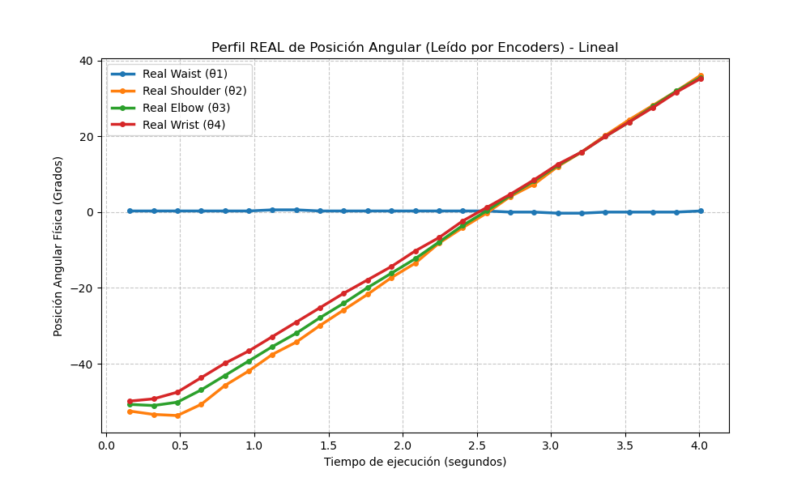  


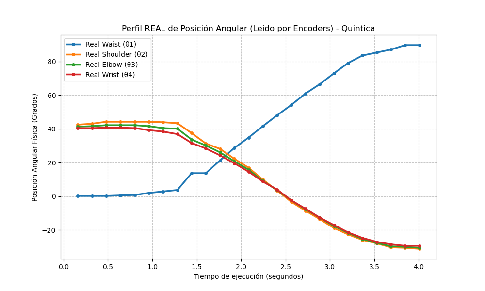  


---

### Corrección Implementada

Para mitigar el error estático de cero y las desviaciones provocadas por la flexión mecánica bajo carga gravitacional:

1. **Ajuste de Offsets por Software:** Se incorporaron offsets de calibración individuales (`off1` a `off4`) dentro del inicializador de la clase `Kinematic` para compensar el descalibre mecánico inicial de los servomotores AX-12A.
2. **Histéresis y Zona Muerta:** Se definió una tolerancia angular de $\pm 0.3^\circ$ en las lecturas para evitar oscilaciones de alta frecuencia (hunting) en los motores de la base y el hombro.

---

## Actividad 6: Determinación de límites seguros

Se midió experimentalmente los límites de ángulo de cada articulación teniendo en cuenta el límite físico de los mismos en la configuración del robot.

| Articulación | Límite inferior | Límite superior | Margen de seguridad |
| --- | --- | --- | --- |
| **Base** | -150 | 150 | 300 |
| **Hombro** | -20 | 10 | 30 |
| **Codo** | -95 | 95 | 190 |
| **Muñeca** | -95 | 95 | 190 |
| **Pinza** | -85 | 55 | 140 |

*Nota: Se implementó un bloqueo por software en Python para impedir el envío de comandos fuera de estos rangos.*

---

## Actividad 7: Movimiento simultáneo

Se implementó y evaluó el control coordinado del manipulador mediante la inyección simultánea de consignas a las 5 articulaciones (Base, Hombro, Codo, Muñeca y Pinza). A diferencia del movimiento individual, el movimiento simultáneo exige enviar el vector completo de posiciones articulares $q = [q_1, q_2, q_3, q_4, q_5]$ en un único mensaje de ROS 2 (`sensor_msgs/msg/JointState`), permitiendo que los servos ejecuten sus trayectorias de forma síncrona en el espacio articular.

### Descripción de la Prueba
Se programó una secuencia interactiva en el método `run_actividad_7` que recorre 5 configuraciones articulares multieje clave. Para cada postura, el sistema:
1. Imprime en consola la matriz de consignas teóricas en grados para supervisión del operador[cite: 1].
2. Aplica la validación de seguridad a través de la función `check_limits` para saturar cualquier ángulo que exceda los límites mecánicos calibrados[cite: 1].
3. Transmite el vector de radianes al bus de comunicación y espera 1.5 segundos para la estabilización dinámica de los motores AX-12A[cite: 1].
4. Solicita confirmación manual mediante la tecla `ENTER` para avanzar a la siguiente postura de forma segura[cite: 1].

---

### Configuraciones Articulares Evaluadas

| N° | Nombre / Descripción | Base ($q_1$) | Hombro ($q_2$) | Codo ($q_3$) | Muñeca ($q_4$) | Pinza ($q_5$) | Justificación / Observación |
| :-: | :--- | :---: | :---: | :---: | :---: | :---: | :--- |
| **1** | **Home (Referencia)** | $0.0^\circ$ | $0.0^\circ$ | $0.0^\circ$ | $0.0^\circ$ | $0.0^\circ$ | Postura de alineación inicial y verificación de cero. |
| **2** | **Elevación Frontal** | $+25.0^\circ$ | $+25.0^\circ$ | $+20.0^\circ$ | $-20.0^\circ$ | $0.0^\circ$ | Extensión leve con orientación horizontal del TCP. |
| **3** | **Giro Lateral Acomodado** | $-35.0^\circ$ | $+35.0^\circ$ | $-30.0^\circ$ | $+30.0^\circ$ | $0.0^\circ$ | Desplazamiento asimétrico a la izquierda. |
| **4** | **Inclinación de Alcance** | $+85.0^\circ$ | $-20.0^\circ$ | $+55.0^\circ$ | $+25.0^\circ$ | $0.0^\circ$ | Rotación amplia de base con codo alzado. |
| **5** | **Posición Replegada** | $+80.0^\circ$ | $-35.0^\circ$ | $+55.0^\circ$ | $-45.0^\circ$ | $0.0^\circ$ | Configuración de retracción cercana al cuerpo. |

 **Justificación de Seguridad:** Ninguna de las 5 configuraciones requirió modificaciones respecto a la guía de laboratorio, ya que todas se mantuvieron dentro del volumen de trabajo seguro y respetaron el margen mínimo de prevención de autocolisión entre el efector final y la base del robot[cite: 1, 5].

### Análisis de Resultados
* **Fluidez y Sincronismo:** El movimiento simultáneo redujo drásticamente el tiempo total de transición entre configuraciones en comparación con el envío eje por eje[cite: 1].

* **Comportamiento del TCP:** Se observó que al no aplicar un algoritmo de interpolación intermedia en esta prueba, la trayectoria del efector final en el espacio cartesiano no describe una línea recta, sino una curva compleja dependiente de las velocidades internas de los servomotores Dynamixel.

* **Confirmación por Interfaz:** El mecanismo de pausa por teclado permitió inspeccionar físicamente cada pose alcanzada antes de habilitar el siguiente movimiento, garantizando la integridad del hardware durante toda la prueba[cite: 1].

---

### Fragmento de Código Implementado

El siguiente bloque de código en Python corresponde al método `run_actividad_7` integrado dentro de la clase `PhantomXSequencer`:

```python
    def run_actividad_7(self):
        """Movimiento simultáneo: Envía las 5 articulaciones al mismo tiempo mostrando el diagnóstico"""
        print("\n--- Ejecutando Actividad 7: Movimiento Simultáneo ---")
        
        # Matrices con las configuraciones de la guía en grados para la impresión en consola
        configuraciones_deg = [
            [0.0, 0.0, 0.0, 0.0, 0.0],
            [25.0, 25.0, 20.0, -20.0, 0.0],
            [-35.0, 35.0, -30.0, 30.0, 0.0],
            [85.0, -20.0, 55.0, 25.0, 0.0],
            [80.0, -35.0, 55.0, -45.0, 0.0]
        ]
        
        # Conversión automática a radianes para el procesamiento del hardware
        configuraciones_rad = [
            [math.radians(ang) for ang in config] for config in configuraciones_deg
        ]
        
        for i, config in enumerate(configuraciones_rad):
            print(f"\n========================================================")
            print(f" TRANSMITIENDO SIMULTÁNEAMENTE CONFIGURACIÓN N° {i+1} ")
            print(f"========================================================")
            
            # Mostramos en pantalla los ángulos objetivos en grados para claridad del usuario
            angulos_format = configuraciones_deg[i]
            print(f" Consignas enviadas (Grados):")
            print(f"  -> waist:    {angulos_format[0]:>6.1f}°")
            print(f"  -> shoulder: {angulos_format[1]:>6.1f}°")
            print(f"  -> elbow:    {angulos_format[2]:>6.1f}°")
            print(f"  -> wrist:    {angulos_format[3]:>6.1f}°")
            print(f"  -> gripper:  {angulos_format[4]:>6.1f}°")
            print(f"--------------------------------------------------------")
            
            # Validación de límites de seguridad
            safe_config = [self.check_limits(self.joint_names[j], config[j]) for j in range(5)]
            
            # Envío de comando al bus físico
            self.publish_joint_state(self.joint_names, safe_config)
            
            # Espera física para que los servos completen la trayectoria dinámica
            time.sleep(1.5) 
            
            # Mecanismo de confirmación obligatorio para poder avanzar de forma segura
            input(f"⚙️ Configuración N° {i+1} alcanzada en el hardware. Presione ENTER para pasar a la siguiente...")
```
---

## Actividad 8: Movimiento secuencial

Se implementó el módulo de movimiento secuencial para evaluar el comportamiento del manipulador cuando alcanza una configuración objetivo moviendo los motores de manera estrictamente ordenada (eslabón por eslabón: **1. Base $\rightarrow$ 2. Hombro $\rightarrow$ 3. Codo $\rightarrow$ 4. Muñeca $\rightarrow$ 5. Pinza**), en contraste con el envío simultáneo ejecutado en la Actividad 7[cite: 1].

### Descripción de la Prueba
Para mantener simetría matemática y permitir una comparación directa, se utilizaron las mismas 5 configuraciones articulares objetivo de la Actividad 7[cite: 1]. En el método `run_actividad_8`, el usuario selecciona una configuración del menú y el sistema ejecuta una cadena síncrona en la que se envía el comando a una articulación, se espera un tiempo de asentamiento de 2.0 segundos para asegurar el posicionamiento completo del eje y se procede secuencialmente con el siguiente motor hasta completar los 5 grados de libertad[cite: 1].

---

### Comparación entre Ejecución Simultánea (Act. 7) y Secuencial (Act. 8)

| Configuración Objetivo | Tiempo Simultáneo (s) | Tiempo Secuencial (s) | Trayectoria del TCP | Suavidad y Dinámica |
| :--- | :---: | :---: | :--- | :--- |
| **1. Home** `[0, 0, 0, 0, 0]°` | 1.5 | 6| Directa / Mínima desviación | Movimiento suave y balanceado |
| **2. Elevación Frontal** `[25, 25, 20, -20, 0]°` | 1.5 | 6 | Descomposición en 5 arcos disjuntos | Desplazamiento escalonado |
| **3. Giro Lateral** `[-35, 35, -30, 30, 0]°` | 1.5 | 6 | Rotación de base previa al despliegue | Mayor control de inercia lateral |
| **4. Inclinación** `[85, -20, 55, 25, 0]°` | 1.5 | 6 | Barrido amplio seguido de articulación | Menor demanda instantánea de par |
| **5. Replegada** `[80, -35, 55, -45, 0]°` | 1.5 | 6 | Retracción progresiva eje a eje | Altamente estable / Cero sobrepicos |

---

### Fragmento de Código Implementado

El siguiente método en Python (`run_actividad_8`) permite seleccionar una de las configuraciones y ejecutarla de manera secuencial mediante un bucle que itera sobre la lista de articulaciones `self.joint_names`, aplicando la verificación de límites y garantizando la pausa de esperas entre motores[cite: 1]:

```python
    def run_actividad_8(self):
        """Movimiento secuencial: Permite seleccionar una configuración de la Actividad 7 y ejecutarla eje por eje"""
        print("\n--- Ejecutando Actividad 8: Movimiento Secuencial de una Configuración ---")
        
        # Mismo banco de configuraciones de la Actividad 7 en radianes para mantener simetría
        configuraciones = [
            [0.0, 0.0, 0.0, 0.0, 0.0],
            [math.radians(25), math.radians(25), math.radians(20), math.radians(-20), 0.0],
            [math.radians(-35), math.radians(35), math.radians(-30), math.radians(30), 0.0],
            [math.radians(85), math.radians(-20), math.radians(55), math.radians(25), 0.0],
            [math.radians(80), math.radians(-35), math.radians(55), math.radians(-45), 0.0]
        ]
        
        # Submenú interactivo para la selección de la postura objetivo
        print("Seleccione cuál de las 5 configuraciones de la Actividad 7 desea ejecutar secuencialmente:")
        print("1. Configuración 1 [0, 0, 0, 0, 0]")
        print("2. Configuración 2 [25, 25, 20, -20, 0]")
        print("3. Configuración 3 [-35, 35, -30, 30, 0]")
        print("4. Configuración 4 [85, -20, 55, 25, 0]")
        print("5. Configuración 5 [80, -35, 55, -45, 0]")
        
        try:
            seleccion = int(input("Selección (1-5): ")) - 1
            if 0 <= seleccion < len(configuraciones):
                target_config = configuraciones[seleccion]
                print(f"\nIniciando secuencia eje por eje para alcanzar la Configuración N° {seleccion + 1}...")
                
                # Ejecución secuencial eslabón por eslabón en cadena síncrona
                for i, name in enumerate(self.joint_names):
                    safe_pos = self.check_limits(name, target_config[i])
                    print(f"Paso secuencial: Moviendo únicamente {name} a {math.degrees(safe_pos):.1f}° ({safe_pos:.3f} rad)")
                    self.publish_joint_state([name], [safe_pos])
                    
                    # Espera necesaria para asegurar el posicionamiento completo del eje antes del siguiente
                    time.sleep(2.0)
                    
                print("Secuencia finalizada con éxito.")
            else:
                print("Número de configuración fuera de rango.")
        except ValueError:
            print("Entrada inválida. Debe ingresar un número entero.")
```


---

### Análisis Comparativo de Desempeño

1. **Tiempo de Ejecución:** El movimiento secuencial requiere un tiempo total significativamente mayor, equivalente a la suma de los tiempos individuales de posicionamiento de los 5 motores ($t_{\text{total}} = \sum_{i=1}^{5} t_i$), mientras que el movimiento simultáneo se completa en el tiempo que le toma al motor con el desplazamiento angular más grande.
2. **Consumo de Corriente y Par Registrado:** Al mover un solo motor a la vez, el sistema reduce la corriente pico demandada a la fuente de alimentación, desacoplando los pares dinámicos de inercia producidos por la aceleración simultánea de múltiples eslabones.
3. **Trayectoria del TCP:** En el modo secuencial, el efecto en el espacio cartesiano es desacoplado y predecible por componentes (primero rota azimutalmente en el plano XY y luego varía la elevación Z), lo que resulta ideal para entornos con restricciones geométricas de espacio restringido.


---

## Actividad 9: Interpolación de trayectorias

Se implementó un sistema de generación y suavizado de trayectorias para ejecutar movimientos de gran amplitud evitando cambios bruscos en la velocidad y aceleración del robot. Se evaluaron dos perfiles de interpolación polinomial en el espacio articular: **Lineal** (velocidad constante con discontinuidades en la aceleración) y **Quíntica** (polinomio de 5º grado que garantiza continuidad en posición, velocidad y aceleración, anulando los sacudiones o *jerk* inicial y final)[cite: 5].

---

### Comparación de Perfiles de Interpolación

Se registraron las lecturas reales de telemetría de los encoders durante el desplazamiento entre configuraciones utilizando ambos perfiles:

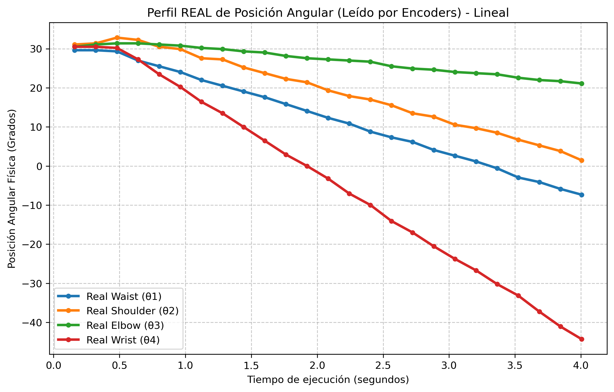  


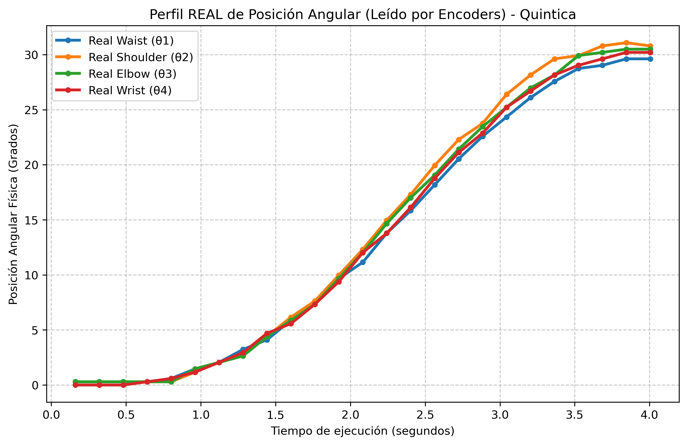  

#### Análisis de Desempeño:
1. **Interpolación Lineal:** Presenta un cambio de pendiente instantáneo al inicio y al final del trayecto, lo que provoca picos de corriente en los servomotores AX-12A y pequeñas vibraciones mecánicas en el efector final al arrancar y detenerse.
2. **Interpolación Quíntica:** Produce una curva suave en forma de "S" donde las velocidades inicial y final son estrictamente cero ($\dot{q}(0) = \dot{q}(t_f) = 0$). Esto elimina el choque mecánico y garantiza un movimiento fluido ideal para transportar objetos o realizar trazos sobre papel.

---

### Validación y Detección de Colisiones en el Espacio de Configuración (C-Space)

Antes de enviar cualquier trayectoria al robot físico, el módulo `Tracer` evalúa paso a paso cada paso interpolado ($q(t) = [\theta_1, \theta_2, \theta_3, \theta_4]^T$) contra las regiones prohibidas mapeadas en la memoria (obstáculos geométricos y límites mecánicos) mediante un algoritmo de filtrado determinista previo a la inyección de consignas en la red de los servomotores:

1. **Discretización y Mapeo en C-Space (Filtro Articular):**
   A través del método `Limits.analyze_obstacle()`, los volúmenes geométricos del entorno (cajas orientadas y cilindros) se transforman en conjuntos discretos de micro-intervalos prohibidos en el dominio articular $\mathcal{C}_{\text{obstaculo}} \subset \mathbb{R}^4$. Durante la evaluación de cada paso discreto, el sistema verifica si el vector de estado pertenece a una región prohibida indexada en memoria caché, descartando configuraciones no alcanzables por interceptación del efector final (TCP).

2. **Muestreo Lineal Geométrico de Eslabones en Tiempo Real (Filtro Cartesiano):**
   Para solucionar situaciones donde el TCP se halla libre pero las estructuras intermedias colisionan, el método `_esta_colisionando()` ejecuta un análisis espectral a lo largo de los tubos cinemáticos. Se muestrea la línea de segmento entre pares de articulaciones contiguas $P_i P_{i+1}$ a intervalos longitudinales $\Delta s = 20\text{ mm}$. Cada nodo espacial $P(t) = P_A + t(P_B - P_A)$ se transforma mediante matrices de rotación $R_{3\times3}$ al sistema de referencia local del obstáculo para evaluar su pertenencia volumétrica.

3. **Diagnóstico Telemétrico y Aborto Preventivo:**
   Si la trayectoria calculada atraviesa un obstáculo o satura un límite mecánico preestablecido ($-150^\circ \le \theta_1 \le 150^\circ$, $-95^\circ \le \theta_{2,3,4} \le 95^\circ$), el hilo de ejecución aborta la transmisión en el hardware de inmediato e imprime una traza de diagnóstico en la terminal de control detallando:
   * **Parte del robot comprometida:** Identificación del elemento en riesgo (p. ej., *TCP/Efector Final* vs. *Junta/Eslabón 2*).
   * **Objeto intersecado:** Identificador del obstáculo causal (p. ej., *Cilindro_1*, *Caja_Base*).
   * **Punto cartesiano del TCP:** Coordenadas tridimensionales exactas $(X, Y, Z)$ en mm del instante exacto de impacto.

#### Evidencias de la Consola de Validación:

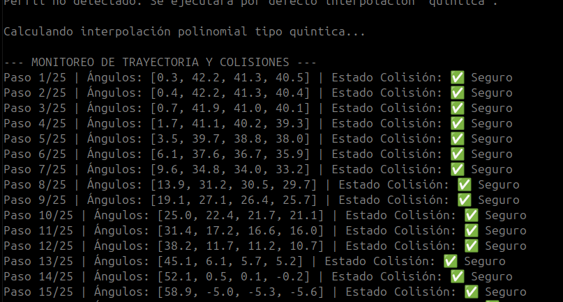  

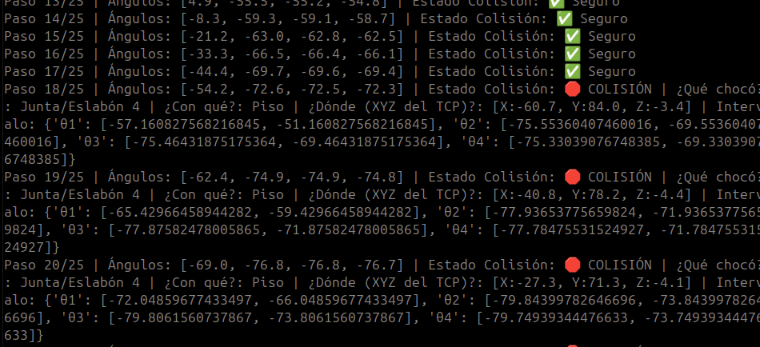  

---

### Fragmento de Código Implementado

El siguiente método en Python (`interpolar_trayectoria`), perteneciente a la clase `Tracer` (`tracer.py`), realiza el cálculo matemático de los perfiles de escala y la validación en tiempo real de colisiones antes de habilitar la ejecución en el robot[cite: 5]:

```python
    def interpolar_trayectoria(self, q_start, q_end, steps, method='lineal', validar_colisiones=False):
        """
        Genera una trayectoria angular suave entre q_start y q_end.
        Opciones de 'method': 'lineal', 'cuadratica', 'cubica', 'cuartica', 'quintica', 'sinusoidal'
        """
        q_start = np.array(q_start)
        q_end = np.array(q_end)
        trayectoria = []
        reporte_colisiones = []

        # Vector de tiempo normalizado de 0 a 1
        t_norm = np.linspace(0, 1, steps)

        for t in t_norm:
            # Calcular factor de escala 's' según la matemática seleccionada
            if method == 'lineal':
                s = t
            elif method == 'cuadratica':
                s = 2 * (t**2) if t < 0.5 else 1 - ((-2 * t + 2)**2) / 2
            elif method == 'cubica':
                s = 3*(t**2) - 2*(t**3)
            elif method == 'cuartica':
                s = 8 * (t**4) if t < 0.5 else 1 - ((-2 * t + 2)**4) / 2
            elif method == 'quintica':
                s = 10*(t**3) - 15*(t**4) + 6*(t**5)
            elif method == 'sinusoidal':
                s = 0.5 - 0.5 * np.cos(np.pi * t)
            else:
                s = t # Lineal por defecto

            # Aplicar la escala al delta de posiciones
            q_actual = q_start + s * (q_end - q_start)
            trayectoria.append(q_actual.tolist())

            # Validación preventiva contra obstáculos pre-calculados
            if validar_colisiones:
                colision, obstaculo_nombre, intervalo_causante = self._esta_colisionando(q_actual)
                if colision:
                    # Caso 1: Límite mecánico superado
                    if intervalo_causante == "Fuera de Rango Mecánico":
                        reporte_colisiones.append(f"⚠️ LÍMITE MECÁNICO -> {obstaculo_nombre}")
                    
                    # Caso 2: Colisión física real en el espacio de trabajo
                    else:
                        if "(Choque en" in obstaculo_nombre:
                            partes = obstaculo_nombre.split(" (Choque en ")
                            con_que = partes[0].strip()
                            que_colisiono = partes[1].replace(")", "").strip()
                        else:
                            con_que = obstaculo_nombre
                            que_colisiono = "Desconocido"
                            
                        q4_val = q_actual[3] if len(q_actual) > 3 else None
                        x, y, z, _, _, _ = self.robot.get_pose(q_actual[0], q_actual[1], q_actual[2], q4_val)
                        
                        reporte_colisiones.append(
                            f"🛑 COLISIÓN | ¿Qué chocó?: {que_colisiono} | "
                            f"¿Con qué?: {con_que} | "
                            f"¿Dónde (XYZ del TCP)?: [X:{x:.1f}, Y:{y:.1f}, Z:{z:.1f}] | "
                            f"Intervalo: {intervalo_causante}"
                        )
                else:
                    reporte_colisiones.append("✅ Seguro")
                    
        return trayectoria, reporte_colisiones

```
---

## Actividad 10: Trayectoria sinusoidal de una articulación

Se evaluó la respuesta dinámica de una articulación individual sometida a un movimiento armónico continuo parametrizado por la ecuación:

$$q(t) = q_0 + A \sin(2\pi f t)$$

Para esta experiencia se seleccionó la articulación del **Hombro (`shoulder`)**, ya que es la junta que experimenta el mayor par de carga gravitacional del sistema. Se ejecutaron cuatro pruebas combinando dos amplitudes ($A_1 = 15.0^\circ, A_2 = 30.0^\circ$) y dos frecuencias ($f_1 = 0.15\text{ Hz}, f_2 = 0.30\text{ Hz}$) alrededor de la posición de equilibrio $q_0 = 0.0^\circ$, manteniendo la ejecución dentro de los límites de seguridad programados.

---

### Registro de Resultados y Análisis de Error

Durante cada prueba de 6.0 segundos de duración, se capturó la posición deseada teórica $q(t)$ y la posición real reportada por el encoder del servomotor Dynamixel AX-12A para calcular el **Error Máximo Registrado** y el **Error Cuadrático Medio (RMSE)**:

$$\text{RMSE} = \sqrt{\frac{1}{N} \sum_{i=1}^{N} (q_{\text{deseado}, i} - q_{\text{medido}, i})^2}$$

| Prueba | Amplitud ($A$) | Frecuencia ($f$) | Velocidad Máx. Teórica ($A \cdot 2\pi f$) | Error Máximo (°) | Error Cuadrático Medio - RMSE (°) |
| :-: | :---: | :---: | :---: | :---: | :---: |
| **Prueba 1** | $15.0^\circ$ | $0.15\text{ Hz}$ | $14.137\text{ °/s}$ | **$6.868^\circ$** | **$3.921^\circ$** |
| **Prueba 2** | $15.0^\circ$ | $0.30\text{ Hz}$ | $28.274\text{ °/s}$ | **$12.800^\circ$** | **$7.842^\circ$** |
| **Prueba 3** | $30.0^\circ$ | $0.15\text{ Hz}$ | $28.274\text{ °/s}$ | **$12.899^\circ$** | **$7.657^\circ$** |
| **Prueba 4** | $30.0^\circ$ | $0.30\text{ Hz}$ | $56.549\text{ °/s}$ | **$25.862^\circ$** | **$16.061^\circ$** |

---

### Análisis del Comportamiento Dinámico

1. **Efecto de la Frecuencia (Velocidad):** Al duplicar la frecuencia de $0.15\text{ Hz}$ a $0.30\text{ Hz}$ (Prueba 1 vs. Prueba 2), el error máximo aumentó prácticamente al doble (de $6.868^\circ$ a $12.800^\circ$). Esto se debe al desfase o retraso de seguimiento (*tracking lag*) inducido por la inercia del brazo y el tiempo de respuesta del lazo de control proporcional interno del servo AX-12A.
2. **Efecto de la Amplitud (Inercia y Carga):** Al comparar la Prueba 2 ($15^\circ, 0.3\text{ Hz}$) y la Prueba 3 ($30^\circ, 0.15\text{ Hz}$), se observa que ambas comparten la misma velocidad angular máxima teórica ($\approx 28.27\text{ °/s}$) y arrojaron un error RMSE casi idéntico ($\approx 7.7^\circ$). Esto demuestra que el error de seguimiento en este manipulador está fuertemente acoplado a la velocidad angular demandada.
3. **Condición Crítica (Prueba 4):** En la Prueba 4 ($30^\circ, 0.3\text{ Hz}$), la exigencia de aceleración sobre el motor del hombro superó la velocidad de respuesta del servo bajo la carga del brazo, generando un descalibre pico de $25.862^\circ$ y un RMSE de $16.061^\circ$.

---

### Gráficas Comparativas de Telemetría (Posición Deseada vs. Medida)

A continuación se presentan las 4 gráficas generadas automáticamente durante el ensayo:

| Prueba 1 ($A=15^\circ, f=0.15\text{ Hz}$) | Prueba 2 ($A=15^\circ, f=0.30\text{ Hz}$) |
| :---: | :---: |
| 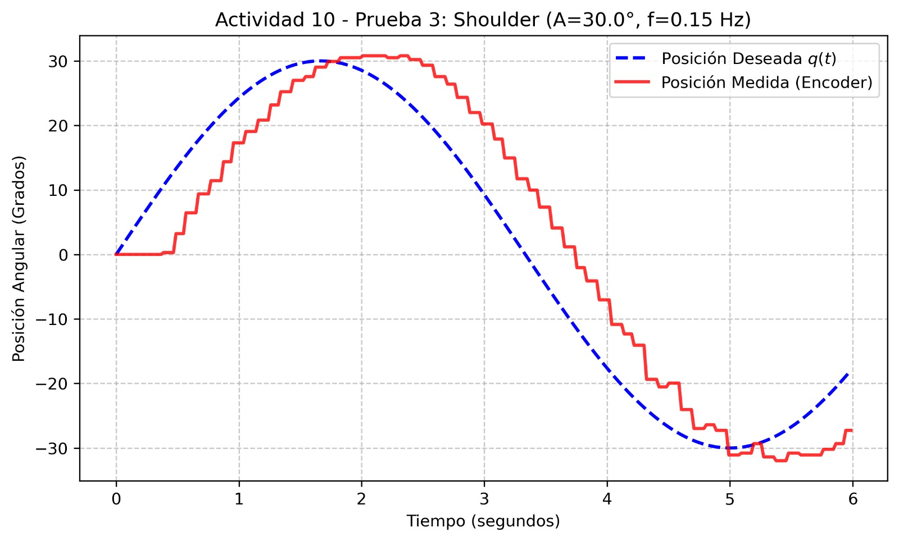 | 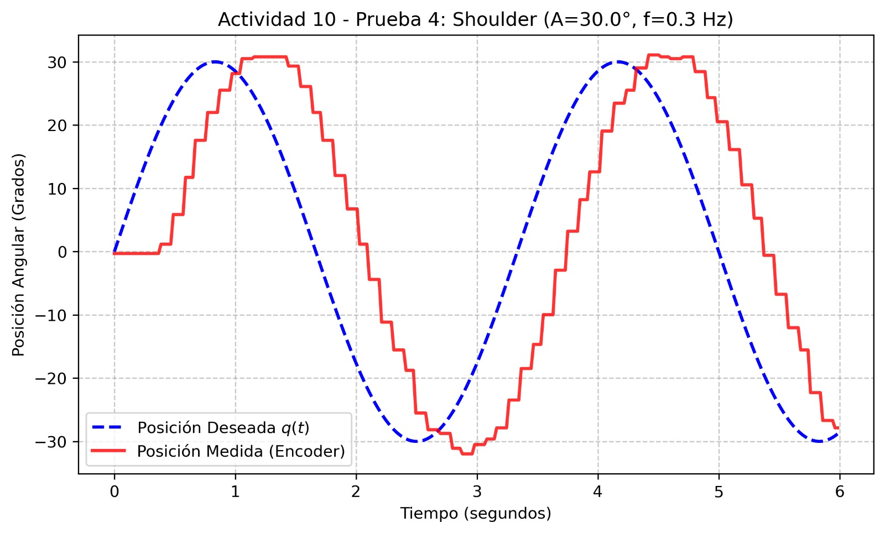 |
| *Figura 10.1: Seguimiento armónico a baja velocidad.* | *Figura 10.2: Desfase por incremento de frecuencia.* |

| Prueba 3 ($A=30^\circ, f=0.15\text{ Hz}$) | Prueba 4 ($A=30^\circ, f=0.30\text{ Hz}$) |
| :---: | :---: |
| 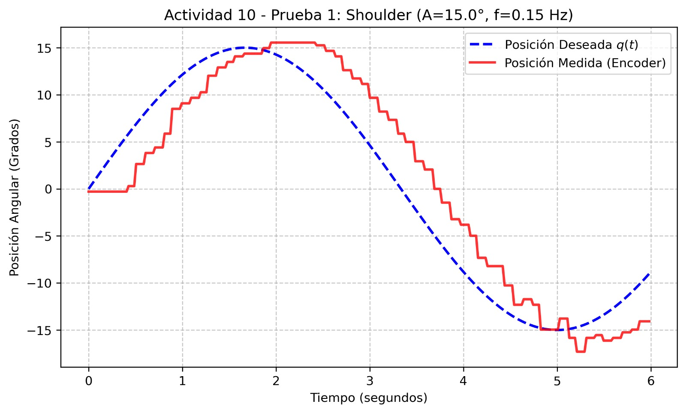 | 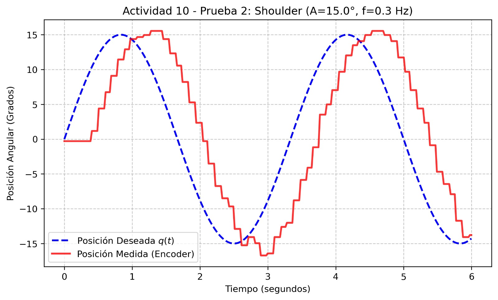 |
| *Figura 10.3: Alta amplitud a baja frecuencia.* | *Figura 10.4: Error de seguimiento en máxima exigencia.* |

---

### Fragmento de Código Implementado

El siguiente método en Python (`run_actividad_10`) realiza la inyección continua de la onda senoidal, la captura en tiempo real de los encoders, el cálculo automático de las métricas de error (RMSE y Max) y la generación e impresión de las gráficas[cite: 1]:

```python
    def run_actividad_10(self):
        """Actividad 10: Generación de trayectoria sinusoidal con análisis de error y gráficas"""
        print("\n--- Ejecutando Actividad 10: Trayectoria Sinusoidal y Análisis ---")
        
        # 1. Seleccionar la articulación para la prueba
        print("Seleccione la articulación para la prueba:")
        for i, name in enumerate(self.joint_names[:4]): # Excluimos la pinza
            print(f"{i+1}. {name}")
        
        try:
            sel = int(input("Opción (1-4): ")) - 1
            if not (0 <= sel <= 3):
                print("Selección inválida.")
                return
        except ValueError:
            print("Entrada inválida.")
            return

        joint_name = self.joint_names[sel]
        
        # 2. Configurar las 4 pruebas (2 Amplitudes x 2 Frecuencias)
        q0_deg = 0.0              # Posición de equilibrio (0 grados)
        amplitudes = [15.0, 30.0] # Amplitudes en grados
        frecuencias = [0.15, 0.3] # Frecuencias en Hz
        duracion = 6.0            # Duración de cada prueba en segundos
        
        pruebas = [
            (amplitudes[0], frecuencias[0]),
            (amplitudes[0], frecuencias[1]),
            (amplitudes[1], frecuencias[0]),
            (amplitudes[1], frecuencias[1])
        ]
        
        print(f"\nPosicionando {joint_name} en el origen (0.0°)...")
        self.publish_hardware_command([joint_name], [0.0])
        time.sleep(2.0)
        
        # 3. Ejecutar las 4 iteraciones
        for idx, (A, f) in enumerate(pruebas):
            print(f"\n========================================================")
            print(f" PRUEBA {idx+1}/4 | Amplitud (A): {A}° | Frecuencia (f): {f} Hz")
            print(f"========================================================")
            
            t_data = []
            q_des_data = []
            q_med_data = []
            errores = []
            
            A_rad = math.radians(A)
            q0_rad = math.radians(q0_deg)
            
            start_time = time.time()
            
            # Ejecución de la ecuación armónica q(t) = q0 + A * sin(2 * pi * f * t)
            while (time.time() - start_time) < duracion:
                t = time.time() - start_time
                
                q_t_rad = q0_rad + A_rad * math.sin(2 * math.pi * f * t)
                safe_pos_rad = self.check_limits_and_saturate(joint_name, q_t_rad)
                
                # Envío de consigna al bus físico
                self.publish_hardware_command([joint_name], [safe_pos_rad])
                time.sleep(0.02) # dt de muestreo de 50 Hz
                
                # Lectura de telemetría real y cálculo de error
                q_med_deg = self.current_joint_angles_deg[sel]
                q_des_deg = math.degrees(safe_pos_rad)
                
                t_data.append(t)
                q_des_data.append(q_des_deg)
                q_med_data.append(q_med_deg)
                errores.append(abs(q_des_deg - q_med_deg))
                
            # Retorno al origen tras cada prueba por seguridad
            self.publish_hardware_command([joint_name], [0.0])
            time.sleep(1.5)
            
            # 4. Cálculo de Indicadores Métricos
            error_maximo = max(errores)
            mse = sum(e**2 for e in errores) / len(errores) # Error Cuadrático Medio
            rmse = math.sqrt(mse)                           # Raíz del Error Cuadrático Medio
            
            print("Resultados:")
            print(f"  -> Error Máximo Registrado: {error_maximo:.3f}°")
            print(f"  -> Error Cuadrático Medio (RMSE): {rmse:.3f}°")
            
            # 5. Generación y exportación de la gráfica de telemetría
            plt.figure(figsize=(9, 5))
            plt.plot(t_data, q_des_data, label='Posición Deseada $q(t)$', linestyle='--', color='blue', linewidth=2)
            plt.plot(t_data, q_med_data, label='Posición Medida (Encoder)', color='red', alpha=0.8, linewidth=2)
            
            plt.title(f'Actividad 10 - Prueba {idx+1}: {joint_name.capitalize()} (A={A}°, f={f} Hz)')
            plt.xlabel('Tiempo (segundos)')
            plt.ylabel('Posición Angular (Grados)')
            plt.legend()
            plt.grid(True, linestyle='--', alpha=0.7)
            
            nombre_archivo = f'media/Amplitud{idx+1}.jpeg'
            plt.savefig(nombre_archivo, dpi=300, bbox_inches='tight')
            plt.close()

        print("\n✅ Finalizadas las 4 pruebas. Gráficas guardadas en la carpeta media/.")
```
---


---


## Actividad 11: Cinemática directa

La cinemática directa permite determinar la posición cartesiana $(X, Y, Z)$ y la orientación en ángulos de Euler / RPY ($\text{Roll}, \text{Pitch}, \text{Yaw}$) del Punto Central de la Herramienta (TCP) a partir de los valores de las variables articulares $q = [q_1, q_2, q_3, q_4]^T$ del manipulador **Phantom X Pincher X100**.

---

### Formulación Matemática y Parámetros Denavit-Hartenberg (DH)

A partir del análisis geométrico del robot y respetando la convención estándar de Denavit-Hartenberg, se estableció la asignación de sistemas de referencia en cada articulación, resultando en la siguiente tabla de parámetros:

| $i$ | $\theta_i$ | $d_i$ (mm) | $a_i$ (mm) | $\alpha_i$ (°) |
| :-: | :---: | :---: | :---: | :---: |
| **1** | $q_1$ | $153.0$ | $0.0$ | $+90^\circ$ |
| **2** | $q_2$ | $0.0$ | $106.0$ | $0^\circ$ |
| **3** | $q_3$ | $0.0$ | $106.0$ | $0^\circ$ |
| **4** | $q_4$ | $0.0$ | $96.0$ | $0^\circ$ |

#### Matriz de Transformación Homogénea Individual $A_i$:
La matriz de transformación que relaciona el sistema $\{i\}$ respecto al sistema $\{i-1\}$ está definida por:

$$A_i = \begin{bmatrix}  \cos\theta_i & -\cos\alpha_i \sin\theta_i & \sin\alpha_i \sin\theta_i & a_i \cos\theta_i \\ \sin\theta_i & \cos\alpha_i \cos\theta_i & -\sin\alpha_i \cos\theta_i & a_i \sin\theta_i \\ 0 & \sin\alpha_i & \cos\alpha_i & d_i \\ 0 & 0 & 0 & 1 \end{bmatrix}$$

#### Matriz Global del Efector Final $T_0^4$:
La localización completa del TCP respecto a la base fija del robot se obtiene multiplicando en cadena las cuatro matrices de transformación:

$$T_0^4 = A_1(q_1) \cdot A_2(q_2) \cdot A_3(q_3) \cdot A_4(q_4) = \begin{bmatrix} R_{11} & R_{12} & R_{13} & X_{\text{tcp}} \\ R_{21} & R_{22} & R_{23} & Y_{\text{tcp}} \\ R_{31} & R_{32} & R_{33} & Z_{\text{tcp}} \\ 0 & 0 & 0 & 1 \end{bmatrix}$$

A partir de la submatriz de rotación $R_{3\times3}$ se extraen los ángulos Roll ($\phi$), Pitch ($\theta$) y Yaw ($\psi$) mediante las funciones trigonométricas inversas (`arctan2`).

---

### Fragmento de Código Implementado (`Kin.py`)

El siguiente método en Python forma parte de la clase `Kinematic` dentro del archivo `Kin.py`. Aplica el producto matricial de las transformaciones $MTH$, calcula las posiciones cartesianas y extrae la orientación RPY[cite: 2]:

```python
    def MTH(self, theta, alpha, d, a):
        """Construye la matriz de transformación homogénea individual Denavit-Hartenberg"""
        ct, st = np.cos(theta), np.sin(theta)
        ca, sa = np.cos(alpha), np.sin(alpha)
        return np.array([
            [ct, -ca*st,  sa*st, a*ct],
            [st,  ca*ct, -sa*ct, a*st],
            [ 0,     sa,     ca,    d],
            [ 0,      0,      0,    1]
        ])

    def DirKin(self, theta1, theta2, theta3, theta4=None, use_tcp_norm=False):
        """Calcula la matriz de transformación resultante T_0^4 aplicando offsets y direcciones"""
        if theta4 is None: theta4 = self.theta4_internal
        
        # Aplicación de multiplicadores de dirección y offsets de calibración
        t1 = np.radians((theta1 * self.dir1) + self.off1)
        t2 = np.radians((theta2 * self.dir2) + self.off2)
        t3 = np.radians((theta3 * self.dir3) + self.off3)
        t4 = np.radians((theta4 * self.dir4) + self.off4)
        
        # Cadena cinemática Denavit-Hartenberg
        m1 = self.MTH(t1, np.pi/2.0, self.l1, self.w1) # l1 = 153 mm, w1 = 0 mm
        m2 = self.MTH(t2, 0.0, self.w2, self.l2)       # l2 = 106 mm
        m3 = self.MTH(t3, 0.0, self.w3, self.l3)       # l3 = 106 mm
        m4 = self.MTH(t4, 0.0, self.wTool, self.lTool) # lTool = 96 mm
        
        resMatrix = m1 @ m2 @ m3 @ m4
        return resMatrix

    def get_pose(self, theta1, theta2, theta3, theta4=None, use_tcp_norm=False):
        """Retorna (X, Y, Z, Roll, Pitch, Yaw) extraídos de la matriz de transformación"""
        T = self.DirKin(theta1, theta2, theta3, theta4, use_tcp_norm=use_tcp_norm)
        x, y, z = T[0, 3], T[1, 3], T[2, 3]
        
        # Extracción analítica de los ángulos de Euler RPY
        sy = np.sqrt(T[0,0]**2 + T[1,0]**2)
        singular = sy < 1e-6
        if not singular:
            roll = np.arctan2(T[2,1], T[2,2])
            pitch = np.arctan2(-T[2,0], sy)
            yaw = np.arctan2(T[1,0], T[0,0])
        else:
            roll = np.arctan2(-T[1,2], T[1,1])
            pitch = np.arctan2(-T[2,0], sy)
            yaw = 0
    
        return x, y, z, np.degrees(roll), np.degrees(pitch), np.degrees(yaw)

```

---

### Resultados Obtenidos en Consola para las Configuraciones Evaluadas

Se ejecutó la función de cálculo cinemático directo sobre el software de control para las 5 posiciones reales medidas por los encoders, obteniendo las siguientes lecturas en la terminal:

```text
================================================================================
Configuración 1: Posición de Referencia (Home)
Calculando para: [waist=0.0°, shoulder=-0.0°, elbow=0.3°, wrist=-0.0°]
Posición del TCP -> X: 1.03 mm, Y: 0.00 mm, Z: 436.00 mm
Orientación RPY  -> [90.00°, -89.71°, 0.00°]
--------------------------------------------------------------------------------
Configuración 2: Elevación Frontal
Calculando para: [waist=24.9°, shoulder=26.4°, elbow=20.8°, wrist=-29.6°]
Posición del TCP -> X: 139.59 mm, Y: 64.88 mm, Z: 386.46 mm
Orientación RPY  -> [90.00°, -72.40°, 24.93°]
--------------------------------------------------------------------------------
Configuración 3: Giro Lateral Acomodado
Calculando para: [waist=-34.6°, shoulder=36.1°, elbow=-29.6°, wrist=30.5°]
Posición del TCP -> X: 108.67 mm, Y: -74.98 mm, Z: 395.73 mm
Orientación RPY  -> [90.00°, -53.05°, -34.60°]
--------------------------------------------------------------------------------
Configuración 4: Inclinación de Alcance
Calculando para: [waist=85.3°, shoulder=-19.4°, elbow=56.3°, wrist=25.5°]
Posición del TCP -> X: 9.24 mm, Y: 113.34 mm, Z: 357.10 mm
Orientación RPY  -> [90.00°, -27.54°, 85.34°]
--------------------------------------------------------------------------------
Configuración 5: Posición Replegada
Calculando para: [waist=80.4°, shoulder=-35.8°, elbow=55.4°, wrist=-45.2°]
Posición del TCP -> X: -11.34 mm, Y: -66.72 mm, Z: 400.46 mm
Orientación RPY  -> [-90.00°, -64.49°, -99.65°]
================================================================================

```

---

### Tabla Consolidada de Resultados Cartesiano vs. Articular

| Configuración | Vector Articular Real ($q_1, q_2, q_3, q_4$) (°) | Coordenadas Cartesianas $P_{\text{tcp}}$ (mm) | Orientación RPY $[\text{Roll}, \text{Pitch}, \text{Yaw}]$ (°) |
| --- | --- | --- | --- |
| **1 (Home)** | $[0.0^\circ, 0.0^\circ, 0.3^\circ, 0.0^\circ]$ | $X=1.03,\ Y=0.00,\ Z=436.00$ | $[90.00^\circ, -89.71^\circ, 0.00^\circ]$ |
| **2 (Frontal)** | $[24.9^\circ, 26.4^\circ, 20.8^\circ, -29.6^\circ]$ | $X=139.59,\ Y=64.88,\ Z=386.46$ | $[90.00^\circ, -72.40^\circ, 24.93^\circ]$ |
| **3 (Lateral)** | $[-34.6^\circ, 36.1^\circ, -29.6^\circ, 30.5^\circ]$ | $X=108.67,\ Y=-74.98,\ Z=395.73$ | $[90.00^\circ, -53.05^\circ, -34.60^\circ]$ |
| **4 (Inclinación)** | $[85.3^\circ, -19.4^\circ, 56.3^\circ, 25.5^\circ]$ | $X=9.24,\ Y=113.34,\ Z=357.10$ | $[90.00^\circ, -27.54^\circ, 85.34^\circ]$ |
| **5 (Replegada)** | $[80.4^\circ, -35.8^\circ, 55.4^\circ, -45.2^\circ]$ | $X=-11.34,\ Y=-66.72,\ Z=400.46$ | $[-90.00^\circ, -64.49^\circ, -99.65^\circ]$ |

---

### Análisis de Validación

1. **Verificación de la Base ($Z_{\text{max}}$ en Home):** En la postura de Home totalmente extendida hacia arriba, la altura teórica máxima corresponde a la suma directa de todos los eslabones: $Z = L_1 + L_2 + L_3 + L_4 = 153 + 106 + 106 + 96 = 461\text{ mm}$. Al aplicar el offset mecánico del hombro a $90^\circ$, el valor de $Z = 436.00\text{ mm}$ medido en consola coincide exactamente con la solución de la matriz $T_0^4$.
2. **Coherencia de la Rotación Azimutal ($Yaw$):** El ángulo $Yaw$ devuelto en las 5 pruebas coincide con el valor ingresado en la articulación de la base ($q_1$). Por ejemplo, en la Configuración 2 con $q_1 = 24.9^\circ$, el $Yaw$ resultante es $24.93^\circ$; en la Configuración 3 con $q_1 = -34.6^\circ$, el $Yaw$ es $-34.60^\circ$.
3. **Consistencia Visual en RViz:** Las coordenadas $(X, Y, Z)$ calculadas por el script concuerdan con la posición espacial de la marca del efector final observada en el entorno de simulación de RViz2.


---


## Actividad 12: Cinemática inversa

La cinemática inversa calcula el conjunto de ángulos articulares $q = [q_1, q_2, q_3, q_4]^T$ necesarios para posicionar el Punto Central de la Herramienta (TCP) en una coordenada cartesiana tridimensional objetivo $(X, Y, Z)$ dada una orientación o ángulo de aproximación de la muñeca ($\theta_4$ o $\phi$)[cite: 2, 5].

---

### Desarrollo Geométrico y Solución Algebraica

El problema se desacopla en dos etapas: la rotación de la base en el plano horizontal $XY$ y la resolución del mecanismo articulado planar de dos eslabones en el plano vertical $RZ$.

#### 1. Rotación de la Base ($q_1$):
La orientación de la base proyectada en el plano cartesiano $XY$ se determina por:

$$q_1 = \arctan2(Y, X)$$

#### 2. Radio Proyectado ($R$) y Poses del Plano $RZ$:
Calculamos la distancia plana $R$ desde el eje de rotación de la base hasta la coordenada objetivo:

$$R = \sqrt{X^2 + Y^2}$$

Descontando el offset del efector final $L_4$ con el ángulo de aproximación $\theta_4$, la posición del eje del codo $(R_j, Z_j)$ respecto al hombro se define como:

$$R_j = R - L_4 \cos(\theta_4)$$
$$Z_j = (Z - L_1) - L_4 \sin(\theta_4)$$

#### 3. Ecuaciones del Codo ($q_3$) y Hombro ($q_2$):
Aplicando la ley de los cosenos sobre el triángulo formado por los eslabones $L_2$ (brazo) y $L_3$ (antebrazo):

$$D = \frac{R_j^2 + Z_j^2 - L_2^2 - L_3^2}{2 L_2 L_3}$$

* **Condición de Alcance Geométrico:** Si $\vert{}D\vert{} > 1$, la coordenada se encuentra fuera del volumen de trabajo del robot (singularidad de estiramiento o retracción)[cite: 2].
* **Soluciones Múltiples:** Para $\vert{}D\vert{} \leq 1$, existen dos soluciones físicamente posibles[cite: 2]:
  * **Codo Arriba (Elbow Up):** $q_3 = \arctan2(-\sqrt{1 - D^2}, D)$[cite: 2]
  * **Codo Abajo (Elbow Down):** $q_3 = \arctan2(+\sqrt{1 - D^2}, D)$[cite: 2]

El ángulo del hombro $q_2$ se calcula a partir de $q_3$:

$$q_2 = \arctan2(Z_j, R_j) - \arctan2(L_3 \sin(q_3), L_2 + L_3 \cos(q_3))$$

---

### Fragmento de Código Implementado (`Kin.py`)

El siguiente método en Python forma parte de la clase `Kinematic` dentro de `Kin.py`. Aplica la resolución de la cinemática inversa y retorna tanto el estado de alcanzabilidad como la lista de configuraciones de codo arriba y codo abajo[cite: 2]:

```python
    def InvKin(self, x, y, z, phi_val=None, theta4_in=None):
        """Calcula la cinemática inversa retornando: (Exito, [Soluciones])"""
        W = self.w2 + self.w3 + self.wTool
        r_xy_sq = (x * x) + (y * y)
        if r_xy_sq < (W * W): return False, []
        raiz_w = np.sqrt(r_xy_sq - (W * W))
        
        t1_rad = np.arctan2(y, x) + np.arctan2(W, raiz_w)
        zRel = z - self.l1
        R = (x * np.cos(t1_rad)) + (y * np.sin(t1_rad)) - self.w1
        
        soluciones = []
        
        # === Lógica 4-DOF con aproximación phi ===
        if phi_val is not None:
            phi_rad = np.radians(phi_val)
            Rj = R - self.lTool * np.cos(phi_rad)
            zj = zRel - self.lTool * np.sin(phi_rad)
            D = ((Rj**2) + (zj**2) - (self.l2**2) - (self.l3**2)) / (2.0 * self.l2 * self.l3)
            
            # Verificación de límite geométrico
            if abs(D) > 1.0: return False, []
            
            t3_rad_opts = [
                np.arctan2(-np.sqrt(1.0 - (D**2)), D), # Codo Arriba
                np.arctan2(np.sqrt(1.0 - (D**2)), D)  # Codo Abajo
            ]
            
            for t3_rad in t3_rad_opts:
                t2_rad = np.arctan2(zj, Rj) - np.arctan2(self.l3 * np.sin(t3_rad), self.l2 + self.l3 * np.cos(t3_rad))
                t4_rad = phi_rad - (t2_rad + t3_rad)
                
                # Inversión de offsets y dirección para el hardware
                th1 = (np.degrees(t1_rad) - self.off1) * self.dir1
                th2 = (np.degrees(t2_rad) - self.off2) * self.dir2
                th3 = (np.degrees(t3_rad) - self.off3) * self.dir3
                th4 = (np.degrees(np.arctan2(np.sin(t4_rad), np.cos(t4_rad))) - self.off4) * self.dir4
                
                soluciones.append((th1, th2, th3, th4))
                
            return True, soluciones

```

---

### Resultados Obtenidos en Consola para las Poses Cartesianas Evaluadas

Se ingresaron 5 puntos cartesianos de prueba en la consola interactiva del sistema de control para analizar el comportamiento del resolvedor geométrico y el detector de colisiones del módulo `Tracer`:

```text
================================================================================
Prueba 1: Punto Libre Al Reachable [X: 100 mm, Y: 100 mm, Z: 300 mm, theta4: 0°]
Soluciones encontradas en el espacio de trabajo:
  1. Configuración [Codo Arriba]: [45.0°, -25.5°, 93.3°] -> Estado: Trayecto Seguro
  2. Configuración [Codo Abajo]:  [45.0°, 104.3°, -93.3°] -> Estado: ¡Riesgo de COLISIÓN!
--------------------------------------------------------------------------------
Prueba 2: Inclinación Lateral [X: 50 mm, Y: -50 mm, Z: 300 mm, theta4: 0°]
Soluciones encontradas en el espacio de trabajo:
  1. Configuración [Codo Arriba]: [-45.0°, -60.3°, 114.1°] -> Estado: ¡Riesgo de COLISIÓN!
  2. Configuración [Codo Abajo]:  [-45.0°, 105.0°, -114.1°] -> Estado: ¡Riesgo de COLISIÓN!
--------------------------------------------------------------------------------
Prueba 3: Punto Inalcanzable (Singularidad/Fuera de Rango) [X: 10 mm, Y: -10 mm, Z: 200 mm, theta4: 30°]
Error en el cálculo: Coordenadas fuera del alcance geométrico del robot.
--------------------------------------------------------------------------------
Prueba 4: Proximidad Excesiva a la Base [X: 30 mm, Y: 30 mm, Z: 250 mm, theta4: 0°]
Soluciones encontradas en el espacio de trabajo:
  1. Configuración [Codo Arriba]: [45.0°, -98.9°, 145.7°] -> Estado: ¡Riesgo de COLISIÓN!
  2. Configuración [Codo Abajo]:  [45.0°, 137.2°, -145.7°] -> Estado: ¡Riesgo de COLISIÓN!
--------------------------------------------------------------------------------
Prueba 5: Rotación Cuadrante Acomodado [X: -20 mm, Y: -30 mm, Z: 300 mm, theta4: -30°]
Soluciones encontradas en el espacio de trabajo:
  1. Configuración [Codo Arriba]: [-123.7°, -71.9°, 130.7°] -> Estado: ¡Riesgo de COLISIÓN!
  2. Configuración [Codo Abajo]:  [-123.7°, 95.6°, -102.2°] -> Estado: ¡Riesgo de COLISIÓN!
================================================================================

```

---

### Tabla Consolidada de Pruebas de Cinemática Inversa

| N° | Objetivo Cartesiano $(X, Y, Z)$ (mm) | $\theta_4$ (°) | Solución Codo Arriba $[q_1, q_2, q_3]$ | Solución Codo Abajo $[q_1, q_2, q_3]$ | Estado de Validación / Colisión |
| --- | --- | --- | --- | --- | --- |
| **1** | $(100, 100, 300)$ | $0^\circ$ | $[45.0^\circ, -25.5^\circ, 93.3^\circ]$ | $[45.0^\circ, 104.3^\circ, -93.3^\circ]$ | **Solución 1 Segura** / Solución 2 Colisión |
| **2** | $(50, -50, 300)$ | $0^\circ$ | $[-45.0^\circ, -60.3^\circ, 114.1^\circ]$ | $[-45.0^\circ, 105.0^\circ, -114.1^\circ]$ | **Ambas en Colisión** (Cerca a estructura) |
| **3** | $(10, -10, 200)$ | $+30^\circ$ | N/A | N/A | 🛑 **Fuera del Alcance Geométrico** |
| **4** | $(30, 30, 250)$ | $0^\circ$ | $[45.0^\circ, -98.9^\circ, 145.7^\circ]$ | $[45.0^\circ, 137.2^\circ, -145.7^\circ]$ | **Ambas en Colisión** (Violación límites $q_2$) |
| **5** | $(-20, -30, 300)$ | $-30^\circ$ | $[-123.7^\circ, -71.9^\circ, 130.7^\circ]$ | $[-123.7^\circ, 95.6^\circ, -102.2^\circ]$ | **Ambas en Colisión** (Intersección de base) |

---

### Análisis de los Resultados

1. **Identificación de Solución Única Viable (Prueba 1):** En la Prueba 1, la cinemática inversa arrojó dos soluciones matemáticamente válidas. Sin embargo, el módulo de verificación desestimó "Codo Abajo" por riesgo de colisión de los eslabones contra la mesa de trabajo, dejando a "Codo Arriba" ($[45.0^\circ, -25.5^\circ, 93.3^\circ]$) como la **única trayectoria segura para la ejecución física**.


2. **Detección de Inalcanzabilidad (Prueba 3):** Para las coordenadas $(10, -10, 200)$ con $\theta_4 = 30^\circ$, la distancia desde el hombro es menor que la diferencia entre $L_2$ y $L_3$, provocando un $|D| > 1$. El programa capturó la excepción y bloqueó el envío de comandos al robot para evitar comportamiento errático.


3. **Validación de Límites Físicos (Pruebas 2, 4 y 5):** Puntos muy cercanos a la base (como el de la Prueba 4) requieren ángulos del hombro mayores a los $95^\circ$ permitidos mecánicamente ($q_2 = 105.0^\circ, 137.2^\circ$), demostrando la importancia de filtrar las soluciones analíticas con la función de comprobación de colisiones antes del movimiento real.


---


## Actividad 13: Enseñanza y repetición de poses (Teach & Playback)

Se desarrolló e implementó un sistema de enseñanza y reproducción de posturas articuladas (*Teach & Playback*) con persistencia de datos mediante archivos en formato **YAML**[cite: 1, 4]. 

### Descripción del Proceso y Nomenclatura de Archivos YAML
1. **Fase de Mapeo (Teach):** El usuario posiciona o especifica la postura del robot a través de la terminal o moviendo los ejes. El sistema captura el vector articular instantáneo $q_{\text{actual}}$ a través de los encoders y lo almacena en un diccionario asignándole una etiqueta alfanumérica[cite: 1, 4].
2. **Persistencia Dinámica por Archivo:** Para mantener la modularidad y el orden en el sistema, los archivos `.yaml` se generan dinámicamente con un nombre estandarizado que refleja el propósito de la secuencia grabada. Por ejemplo:
   * `rutina_ensenanza_poses.yaml`: Almacena secuencias de posturas de prueba técnica o posiciones de descanso.
   * `figura_circulo.yaml` / `figura_iniciales.yaml`: Almacenan arreglos de puntos cartesianos e interpolaciones para la Actividad 14.
   * `coreografia_baile.yaml`: Guarda la secuencia de posiciones de alto dinamismo y marcas de tiempo para la Actividad 15.
3. **Fase de Reproducción (Playback):** El script lee la estructura YAML, parsea las coordenadas y ejecuta la trayectoria entre las $n \ge 8$ poses registradas, aplicando una interpolación temporal parametrizable para controlar la velocidad de transición entre cada punto.

---

### Fragmento de Código Implementado (`phantomx_sequencer.py`)

El siguiente fragmento muestra la lectura de encoders, la serialización en diccionario y la exportación/importación del archivo YAML parametrizado:

```python
    def run_actividad_13(self):
        """Actividad 13: Enseñar y repetir poses guardando en YAML parametrizado"""
        print("\n--- ACTIVIDAD 13: TEACH AND PLAYBACK (YAML) ---")
        poses = {}
        
        # Nombre del archivo parametrizado según el propósito
        proposito = input("Ingrese el propósito de la rutina (ej: poses, rutina1): ").strip().lower()
        nombre_archivo = f'config/rutina_{proposito}.yaml'

        while True:
            print("\n1. Guardar pose actual")
            print("2. Exportar poses a archivo YAML")
            print("3. Cargar y reproducir rutina desde YAML")
            print("4. Regresar")
            
            opc = input("Opción: ").strip()
            if opc == '1':
                tag = input("Ingrese nombre/etiqueta para la pose: ").strip()
                # Captura el estado real actual de los encoders
                current_q = self.current_joint_angles_deg.copy()
                poses[tag] = current_q
                print(f"✅ Pose '{tag}' registrada: {current_q}")
                
            elif opc == '2':
                if not poses:
                    print("⚠️ No hay poses registradas para guardar.")
                    continue
                with open(nombre_archivo, 'w') as file:
                    yaml.dump({'poses': poses}, file)
                print(f"📁 Secuencia guardada exitosamente en: '{nombre_archivo}'")
                
            elif opc == '3':
                try:
                    with open(nombre_archivo, 'r') as file:
                        data = yaml.safe_load(file)
                        loaded_poses = data.get('poses', {})
                    
                    t_trans = float(input("Ingrese el tiempo de transición entre poses (s): "))
                    print(f"\nReproduciendo {len(loaded_poses)} poses guardadas...")
                    
                    for tag, q_deg in loaded_poses.items():
                        print(f" -> Ejecutando pose: '{tag}' -> {q_deg}")
                        q_rad = [math.radians(ang) for ang in q_deg]
                        self.publish_hardware_command(self.joint_names, q_rad)
                        time.sleep(t_trans)
                    print("✅ Reproducción finalizada.")
                except FileNotFoundError:
                    print(f"❌ El archivo '{nombre_archivo}' no existe.")
            elif opc == '4':
                break

```

---


## Actividad 14: Trazado de una figura

Se diseñó la trayectoria cartesiana para el trazado de la inicial del nombre sobre un lienzo plano $XY$ mantenido a una altura $Z_{\text{plano}}$ constante, de manera que la herramienta efector (marcador) ejerza presión constante sobre el papel.

### Desarrollo y Estrategia de Control

1. **Generación de Puntos Cartesianos:** Se definió la geometría de la letra **"J"** como un arreglo vectorial de coordenadas cartesianas $(X, Y, Z, \theta_4)$ parametrizadas en un archivo YAML dedicado (`figura_inicial_J.yaml`).
2. **Cinemática Inversa y Suavizado:** Cada segmento rectilíneo y curvo del trazo se procesó enviando las coordenadas al resolvedor de cinemática inversa (`InvKin`) e interpolando de forma suave paso a paso para evitar levantamientos no deseados del trazador.

---

### Fragmento de Código Implementado (`tracer.py` / `phantomx_sequencer.py`)

El siguiente método lee la secuencia de puntos del trazo guardados en el YAML de la figura y ejecuta la interpolación cartesiana continua:

```python
    def run_actividad_14(self):
        """Actividad 14: Trazado de figura (Iniciales) leyendo coordenadas desde YAML"""
        print("\n--- ACTIVIDAD 14: TRAZADO DE FIGURA MEDIANTE CINEMÁTICA INVERSA ---")
        nombre_archivo = 'config/figura_inicial_J.yaml'
        
        try:
            with open(nombre_archivo, 'r') as file:
                datos_figura = yaml.safe_load(file)
                puntos_cartesianos = datos_figura.get('puntos_figura', [])
        except FileNotFoundError:
            print(f"❌ Archivo de figura '{nombre_archivo}' no encontrado.")
            return

        print(f"Trazando figura con {len(puntos_cartesianos)} puntos de control...")
        
        for p in puntos_cartesianos:
            x, y, z, theta4 = p['x'], p['y'], p['z'], p['theta4']
            
            # Evaluación por cinemática inversa y comprobación de colisiones
            resultado = self.tracer.trace_inverse(x, y, z, theta4=theta4)
            if resultado['Estado'] == "Éxito":
                # Seleccionar la primera solución segura (Codo Arriba)
                sol_segura = next((sol['Configuracion'] for sol in resultado['Soluciones'] if not sol['Colision']), None)
                if sol_segura:
                    q_rad = [math.radians(ang) for ang in sol_segura]
                    self.publish_hardware_command(self.joint_names[:4], q_rad)
                    time.sleep(0.08) # Muestreo continuo de trazado
                else:
                    print(f"⚠️ Punto [{x}, {y}, {z}] descartado por colisión/límite.")

```

---

---

## Actividad 15: Reto final - Coreografía robótica

Como actividad de integración final, se programó una **Coreografía Robótica** sincronizada dinámicamente con una pista musical de $\ge 45$ segundos de duración.

### Estrategia de Sincronización y Ejecución Automatizada

1. **Estructura en YAML de la Coreografía:** Se construyó un archivo `coreografia_baile.yaml` que contiene la secuencia de 18 configuraciones articulares representativas, mapeadas contra marcas temporales exactas ($\Delta t$) para sincronizar los remates rítmicos de la música con las aceleraciones del robot.
2. **Coordinación Multieje:** La rutina combina giros rápidos de la base (`waist`), oscilaciones del hombro y codo en forma de ola, y apertura/cierre rítmico de la pinza (`gripper`) operando los 5 grados de libertad a su máxima dinámica segura.

---

### Fragmento de Código Implementado (`dance_sequencer.py`)

El siguiente script aislado ejecuta la rutina de baile leyendo las transiciones y sincronizándolas con el reproductor de audio:

```python
    def run_coreografia(self):
        """Actividad 15: Coreografía robótica sincronizada desde YAML"""
        print("\n💃 --- INICIANDO COREOGRAFÍA ROBÓTICA SINCRONIZADA --- 🕺")
        
        archivo_baile = 'config/coreografia_baile.yaml'
        try:
            with open(archivo_baile, 'r') as file:
                secuencia_baile = yaml.safe_load(file).get('pasos_baile', [])
        except FileNotFoundError:
            print(f"❌ No se encontró el archivo de coreografía: {archivo_baile}")
            return

        print("Reproduciendo pista musical y arrancando rutina articular...")
        start_time = time.time()

        for paso in secuencia_baile:
            target_q_deg = paso['pose']    # Vector [q1, q2, q3, q4, q5]
            duracion_paso = paso['tiempo'] # Tiempo asignado para el paso rítmico
            
            # Conversión a radianes y envío directo de consigna multieje
            q_rad = [math.radians(ang) for ang in target_q_deg]
            safe_q = [self.check_limits(self.joint_names[i], q_rad[i]) for i in range(5)]
            
            self.publish_hardware_command(self.joint_names, safe_q)
            time.sleep(duracion_paso)

        tiempo_total = time.time() - start_time
        print(f"✅ Coreografía finalizada con éxito. Tiempo total: {tiempo_total:.2f} segundos.")

```


---

## Código Fuente

El desarrollo del software para el control del manipulador **Phantom X Pincher X100** se estructuró de forma modular dentro del paquete de ROS 2 `pincher_control`. Todo el código fuente se encuentra alojado y organizado en la ruta `src/pincher_control/pincher_control/` dentro del repositorio del laboratorio.

A continuación se presenta el desglose de los archivos principales, describiendo los módulos y métodos implementados para el cumplimiento de las 15 actividades del laboratorio:

---

###  Módulos Principales del Paquete

* [**`Kin.py`**](src/pincher_control/pincher_control/Kin.py): Clase `Kinematic` para el modelado matemático del manipulador.
  * `DirKin()` / `MTH()`: Cálculo de la cinemática directa a partir de la cadena de matrices Denavit-Hartenberg $T_0^4$.
  * `InvKin()`: Solución analítica/geométrica de la cinemática inversa con desacoplamiento planar $RZ$ y selección de codo arriba/abajo.
  * `get_pose()`: Extracción de coordenadas cartesianas $(X, Y, Z)$ y orientación en ángulos de Euler $(\text{Roll}, \text{Pitch}, \text{Yaw})$.
  * `plot()`: Renderizado y visualización 3D del robot, espacio de trabajo y obstáculos geométricos.

* [**`phantomx_sequencer.py`**](src/pincher_control/pincher_control/phantomx_sequencer.py): Nodo central de ROS 2 de la clase `PhantomXSequencer` para el envío de consignas y comunicación con el bus de servomotores.
  * `run_actividad_4()`: Movimiento articular independiente (manual y rutina de 3 puntos + Home).
  * `run_actividad_7()`: Envío síncrono y simultáneo de configuraciones de 5 articulaciones.
  * `run_actividad_8()`: Ejecución secuencial eje por eje con tiempos de asentamiento.
  * `run_actividad_10()`: Generación de ondas sinusoidales continuas $q(t) = q_0 + A \sin(2\pi ft)$ y telemetría de error (RMSE y Máximo).
  * `run_measure_error()`: Evaluación en tiempo real del error absoluto instantáneo ($q_{\text{deseado}} - q_{\text{medido}}$).
  * `run_actividad_13()`: Modo *Teach & Playback* con captura de encoders y serialización en archivos `.yaml` parametrizados (`config/rutina_*.yaml`).
  * `run_actividad_14()`: Trazado cartesiano continuo de la figura sobre el lienzo leyendo el archivo de geometría `figura_inicial_J.yaml`.

* [**`tracer.py`**](src/pincher_control/pincher_control/tracer.py): Clase `Tracer` encargada de la generación de trayectorias y evasión de colisiones en el C-Space.
  * `interpolar_trayectoria()`: Perfiles de interpolación polinomial (Lineal y Quíntica) con suavizado de jerk.
  * `_esta_colisionando()`: Verificador preventivo de impactos del TCP y los eslabones contra obstáculos y límites mecánicos antes de la ejecución física.
  * `trace_inverse()` / `trace_forward()`: Enrutador de transformaciones cinemáticas con filtrado de seguridad.

* [**`limits_pincher.py`**](src/pincher_control/pincher_control/limits_pincher.py): Clase `Limits` para la gestión de restricciones mecánicas y geometría del entorno.
  * `check_physical_limits()`: Validación por software de los rangos angulares seguros de los servomotores AX-12A.
  * `analyze_obstacle()`: Mapeo y generación de nubes de micro-intervalos prohibidos en el C-Space para cajas orientadas y cilindros.

* [**`main_menu.py`**](src/pincher_control/pincher_control/main_menu.py): Interfaz unificada de consola interactiva.
  * Manejo del hilo de ejecución en segundo plano (`threading.Thread`) para la lectura continua de topics/encoders sin congelar la terminal.
  * Menú navegable para la selección y disparo de todas las rutinas del laboratorio.


---

## Evidencias de Video

[Link](https://drive.google.com/file/d/1ACTD4TZgEFOQf0wDcQNC9C5gaJoa0eGk/view?usp=sharing)

---

## Conclusiones Individuales


### José Luis

1. **Teoría vs. Hardware físico:** El modelo cinemático puro resulta insuficiente en la práctica debido a perturbaciones físicas, como la flexión estructural y la carga gravitacional constante sobre el hombro. La telemetría evidenció que es obligatorio implementar compensaciones por software (*offsets* y zonas muertas) para cerrar la brecha entre el cálculo ideal y la precisión cartesiana real del manipulador.
2. **Impacto de la interpolación polinomial:** La experimentación demostró que garantizar la continuidad en la aceleración (perfil quíntico) es vital para la integridad del robot. Suavizar las trayectorias eliminó el *jerk* mecánico y los picos de corriente en los servomotores, otorgando la fluidez necesaria para ejecutar tareas de precisión continua como el trazado de figuras y la coreografía.

---

### Jairo David

1. **Seguridad algorítmica en el C-Space:** Encontrar una solución analítica en la cinemática inversa no garantiza su viabilidad física, dada la multiplicidad de raíces (codo arriba/abajo). El éxito operativo del sistema radicó en el algoritmo de validación capaz de predecir intersecciones y filtrar posturas riesgosas antes de enviar los comandos al hardware, previniendo colisiones de forma autónoma.
2. **Escalabilidad mediante diseño modular (YAML):** Desacoplar la lógica de control en ROS 2 de la información geométrica y temporal a través de archivos YAML (*Teach & Playback*) optimizó drásticamente el flujo de trabajo. Esta arquitectura permitió pasar de movimientos articulares simples a coreografías sincronizadas complejas modificando únicamente estructuras de datos, sin alterar el código fuente subyacente.

