# Proyecto Final de Robótica: Comparativa de Manipuladores Articulados de 4-DOF (Chander vs. AXUM I)

# Integrantes

- [José Luis Pulido Fonseca](https://github.com/jpulidof)
- [Jairo David Díaz Luna](https://github.com/Axum-User)

---

## Índice

1. [Resumen y Descripción General](#1-resumen-y-descripción-general)
2. [Diseño Conceptual y Metodología](#2-diseño-conceptual-y-metodología)
    - 2.1 [Diagrama de Flujo y Metodología de Desarrollo](#21-diagrama-de-flujo-y-metodología-de-desarrollo)
    - 2.2 [Alternativas de Manipulación](#22-alternativas-de-manipulación-2dof-3dof-4dof-y-empujadores-lineales)
    - 2.3 [Selección de Actuadores: Motores DC vs. Servomotores](#23-selección-de-actuadores-motores-dc-vs-servomotores)
    - 2.4 [Mejoras Propuestas sobre Modelos Anteriores](#24-mejoras-propuestas-sobre-modelos-anteriores)
3. [Fundamentación Teórica y Modelado Matemático](#3-fundamentación-teórica-y-modelado-matemático)
    - 3.1 [Cinemática Directa: Convención Denavit-Hartenberg (DH)](#31-cinemática-directa-convención-denavit-hartenberg-dh)
    - 3.2 [Cinemática Inversa: Método Geométrico de Desacoplo](#32-cinemática-inversa-método-geométrico-de-desacoplo)
    - 3.3 [Cinemática Diferencial mediante Marcos de Referencia Móviles](#33-cinemática-diferencial-mediante-marcos-de-referencia-móviles)
    - 3.4 [Cinética del Sistema: Análisis de Newton-Euler](#34-cinética-del-sistema-análisis-de-newton-euler)
4. [Inercia, Ancho de Banda y Restricciones Dinámicas](#4-inercia-ancho-de-banda-y-restricciones-dinámicas)
    - 4.1 [Inercia Equivalente y Aceleración Angular Máxima](#41-inercia-equivalente-y-aceleración-angular-máxima)
    - 4.2 [Análisis de Torques y Selección de Motores](#42-torque-analysis--motor-sizing)
    - 4.3 [Restricciones Cinemáticas y Dinámicas](#43-kinematic--dynamic-constraints)
    - 4.4 [Resistencia Estructural y Deflexión de Materiales](#44-structural--material-resistance)
    - 4.5 [Lista de Materiales (BOM)](#45-bill-of-materials-bom--component-selection)
    - 4.6 [Modelado CAD y Restricciones de Ensamble](#46-cad-modeling--assembly-constraints)
5. [Fases de Prototipado y Validación Empírica Previa](#5-fases-de-prototipado-y-validación-empírica-previa)
    - 5.1 [Prototipo MDF (Prueba de Concepto - Axum I)](#51-prototipo-mdf-prueba-de-concepto---axum-i)
    - 5.2 [Análisis Empírico de Aceleración y Velocidad (Chander)](#52-análisis-empírico-de-aceleración-y-velocidad-chander)
6. [Fase de Diseño Mecánico Detallado (CAD)](#6-fase-de-diseño-mecánico-detallado-cad)
    - 6.1 [Cálculo de Longitudes Máximas según el Torque y Gráficas de Esfuerzo/Deflexión](#61-cálculo-de-longitudes-máximas-según-el-torque-y-gráficas-de-esfuerzodeflexión)
    - 6.2 [Base y Mecanismo Lazy Susan (Articulación J0)](#62-base-y-mecanismo-lazy-susan-articulación-j0)
    - 6.3 [Articulaciones: Hombro, Codo y Muñeca](#63-articulaciones-hombro-codo-y-muñeca)
    - 6.4 [Soportes, Alojamientos (Horns) y Empaquetamiento Mecánico](#64-soportes-alojamientos-horns-y-empaquetamiento-mecánico)
    - 6.5 [Efectores Finales (Punta de Calibración, Grippers y Electroimanes)](#65-efectores-finales-punta-de-calibración-grippers-y-electroimanes)
    - 6.6 [Enclosure (Control Box)](#66-enclosure-control-box)
    - 6.7 [Ensamblaje Mecánico General (Overall Assembly) e Integración](#67-ensamblaje-mecánico-general-overall-assembly-e-integración)
    - 6.8 [Integración Eléctrica y Cableado (Soldering & Wiring)](#68-integración-eléctrica-y-cableado-soldering--wiring)
7. [Integración Eléctrica, Electrónica y de Potencia](#7-integración-eléctrica-electrónica-y-de-potencia)
    - 7.1 [Configuración de Servomotores y Bus de Potencia (Robot Chander)](#71-configuración-de-servomotores-y-bus-de-potencia-robot-chander)
    - 7.2 [Configuración de Motores DC (Robot Axum I)](#72-configuración-de-motores-dc-robot-axum-i)
8. [Sistemas de Control y Arquitectura de Firmware](#8-sistemas-de-control-y-arquitectura-de-firmware)
    - 8.1 [Arquitectura de Servomotores: El PID Interno y sus Limitaciones ante la Inercia (Robot Chander)](#81-arquitectura-de-servomotores-el-pid-interno-y-sus-limitaciones-ante-la-inercia-robot-chander)
    - 8.2 [Arquitectura de Motores DC: Control en Cascada Multitasas (Robot Axum I)](#82-arquitectura-de-motores-dc-control-en-cascada-multitasas-robot-axum-i)
    - 8.3 [Estimación de Estado: Filtro de Kalman Discreto (DKF) 1D](#83-estimación-de-estado-filtro-de-kalman-discreto-dkf-1d)
    - 8.4 [Lazo Interno: Control PI, Feedforward, Gravitatorio y Fricción de Stribeck](#84-lazo-interno-control-pi-feedforward-gravitatorio-y-fricción-de-stribeck)
    - 8.5 [Estrategia de Auto-Tuning y Gestión de Memoria No Volátil (NVS)](#85-estrategia-de-auto-tuning-y-gestión-de-memoria-no-volátil-nvs)
9. [Control de Movimiento y Generación de Trayectorias](#9-control-de-movimiento-y-generación-de-trayectorias)
    - 9.1 [Control Diferencial Jacobiano Inverso (DLS) vs. Cinemática Inversa Continua](#91-control-diferencial-jacobiano-inverso-dls-vs-cinemática-inversa-continua)
    - 9.2 [Referencia de Comandos y Sintaxis de Movimiento](#92-referencia-de-comandos-y-sintaxis-de-movimiento)
10. [Evaluación Dinámica y Análisis de Errores](#10-evaluación-dinámica-y-análisis-de-errores)
    - 10.1 [Análisis de Oscilaciones Dinámicas (Jitter Provocado por el PID Interno)](#101-análisis-de-oscilaciones-dinámicas-jitter-provocado-por-el-pid-interno)
    - 10.2 [Error de Cuantificación Espacial (Grilla de Posiciones y Discretización de 1°)](#102-error-de-cuantificación-espacial-grilla-de-posiciones-y-discretización-de-1)
    - 10.3 [Análisis Dinámico del Efector Final (TCP): Evaluación Iterativa Newton-Euler](#103-análisis-dinámico-del-efector-final-tcp-evaluación-iterativa-newton-euler)
11. [Rendimiento Experimental y Validación](#11-rendimiento-experimental-y-validación)
    - 11.1 [Pruebas Unitarias del Código y Calibración (Zero-Offset)](#111-pruebas-unitarias-del-código-y-calibración-zero-offset)
    - 11.2 [Parametrización Definitiva de la Cinemática Directa (Tabla DH Operativa)](#112-parametrización-definitiva-de-la-cinemática-directa-tabla-dh-operativa)
    - 11.3 [Posicionamiento Angular y Movimiento en Espacio Libre](#113-posicionamiento-angular-y-movimiento-en-espacio-libre)
    - 11.4 [Precisión en Seguimiento de Trayectorias: Líneas y Círculos](#114-precisión-en-seguimiento-de-trayectorias-líneas-y-círculos)
    - 11.5 [Prueba Final Integral: Tareas Pick-and-Place (Transferencia de Carga Operativa)](#115-prueba-final-integral-tareas-pick-and-place-transferencia-de-carga-operativa)
12. [Teach Pendant y Control Remoto](#12-teach-pendant-y-control-remoto)
    - 12.1 [Arquitectura de Hardware y Comunicación del Teach Pendant](#121-arquitectura-de-hardware-y-comunicación-del-teach-pendant)
    - 12.2 [Modos de Operación y Lógica de Programación por Aprendizaje (Teach-In)](#122-modos-de-operación-y-lógica-de-programación-por-aprendizaje-teach-in)
13. [Caracterización del Sistema (Fichas Técnicas)](#13-caracterización-del-sistema-fichas-técnicas)
    - 13.1 [Ficha Técnica Global y Especificaciones Absolutas](#131-ficha-técnica-global-y-especificaciones-absolutas)
    - 13.2 [Fichas Técnicas de Efectores Finales (Tools & Grippers)](#132-fichas-técnicas-de-efectores-finales-tools--grippers)
14. [Initial Testing & Validation](#14-initial-testing--validation)
    - 14.1 [Unit Code Testing](#141-unit-code-testing)
    - 14.2 [Physical Test Results](#142-physical-test-results)
15. [Motor Control System](#15-motor-control-system)
    - 15.1 [State Estimation & Sensor Filtering](#151-state-estimation--sensor-filtering)
    - 15.2 [Firmware Control Loop Implementation](#152-firmware-control-loop-implementation)
    - 15.3 [Final Model Tuning & Auto-Tuning Strategy](#153-final-model-tuning--auto-tuning-strategy)
16. [Kinematic Modeling](#16-kinematic-modeling)
    - 16.1 [Tabla y Modelo de Denavit-Hartenberg (DH)](#161-tabla-y-modelo-de-denavit-hartenberg-dh)
    - 16.2 [Cinemática Directa (Forward Kinematics - FK)](#162-cinemática-directa-forward-kinematics---fk)
    - 16.3 [Cinemática Inversa (Inverse Kinematics - IK)](#163-cinemática-inversa-inverse-kinematics---ik)
17. [Motion Control & Command Reference](#17-motion-control--command-reference)
    - 17.1 [Joint-Space Configuration (MovA)](#171-joint-space-configuration-mova)
    - 17.2 [Unconstrained Point-to-Point Motion (MovJ)](#172-unconstrained-point-to-point-motion-movj)
    - 17.3 [Linear Interpolated Motion (MovL & MovLJc)](#173-linear-interpolated-motion-movl--movljc)
    - 17.4 [Circular Interpolated Motion (MovC & MovCJc)](#174-circular-interpolated-motion-movc--movcjc)
18. [Caracterización del Sistema (System Characterization)](#18-caracterización-del-sistema-system-characterization)
    - 18.1 [Ficha Técnica (Technical Datasheet)](#181-ficha-técnica-technical-datasheet)
    - 18.2 [Instruction Manual](#182-instruction-manual)
19. [Evaluación de Rendimiento y Pruebas Experimentales](#19-evaluación-de-rendimiento-y-pruebas-experimentales-performance-evaluation--experimental-tests)
    - 19.1 [Rendimiento de Posicionamiento Angular](#191-rendimiento-de-posicionamiento-angular-angular-positioning-performance)
    - 19.2 [Trayectoria de Movimiento en el Espacio Libre](#192-trayectoria-de-movimiento-en-el-espacio-libre-free-space-motion-trajectory)
    - 19.3 [Precisión en el Seguimiento de Línea](#193-precisión-en-el-seguimiento-de-línea-line-following-accuracy)
    - 19.4 [Precisión en el Seguimiento de Círculos](#194-precisión-en-el-seguimiento-de-círculos-circle-following-accuracy)
    - 19.5 [Validación de Pick-and-Place](#195-validación-de-pick-and-place-pick-and-place-validation)
20. [Conclusiones y Recomendaciones](#20-conclusiones-y-recomendaciones)
    - 20.1 [Conclusiones Generales](#201-conclusiones-generales)
    - 20.2 [Recomendaciones Mecánicas y Algorítmicas Futuras](#202-recomendaciones-mecánicas-y-algorítmicas-futuras)
21. [Anexos](#20-anexos)

# 1. Resumen y Descripción General

## 1.1. Resumen del Proyecto

Este proyecto documenta el desarrollo integral, implementación mecatrónica y análisis dinámico comparativo de un manipulador robótico articulado de 4 grados de libertad (DOF) diseñada bajo una metodología de ingeniería concurrente para la manipulación de objetos y tareas de automatización (*pick-and-place*). El estudio aborda la brecha existente entre la teoría cinemática/dinámica abstracta —fundamentada en transformaciones homogéneas, la convención de Denavit-Hartenberg (D-H) y la formulación cinético-diferencial de Newton-Euler— y la realidad física del hardware de bajo costo, caracterizada por inercias de eslabones, tolerancias de manufactura aditiva, fricción no lineal en transmisiones y errores de cuantificación angular.

Para evaluar el impacto de la arquitectura de actuación y el esquema de control en el desempeño espacial del efector final (TCP, *Tool Center Point*), el proyecto integra y compara dos plataformas mecánicas funcionalmente equivalentes fabricadas en ácido poliláctico (PLA):

1. **Axum I (Arquitectura de Motores DC y Control en Cascada):**
Un manipulador de 4-DOF accionado por motorreductores DC de tornillo sin fin (*Worm Gear*, modelos 5840-31ZY y JGY370) equipados con *encoders* de cuadratura de alta resolución. Este sistema es gobernado por una arquitectura de control embebida en un microcontrolador ESP32-S3 que ejecuta un esquema de **control en cascada multitasas** (lazo externo de posición/trayectoria a 100 Hz y lazo interno de velocidad/esfuerzo a 400 Hz). La lógica integra estimación de estado estocástica mediante un **Filtro de Kalman Discreto (DKF)** unidimensional por articulación, compensación de gravedad no lineal, modelo de fricción de Stribeck, predictor *feedforward* y generación de trayectorias cartesianas mediante la inversa de **Mínimos Cuadrados Amortiguados (Damped Least Squares - DLS)** del Jacobiano ($3\times4$ y $4\times4$).


2. **Chander (Arquitectura de Servomotores y Control Discreto):**
Un manipulador de 4-DOF accionado por servomotores digitales de alto torque (DS3240, 36.0 kg·cm nominales) integrados con su propio lazo cerrado de posición analógico/digital interno. El control centralizado reside en un microcontrolador ESP32-S3 coordinado con un expansor de modulación por ancho de pulsos (PWM) externo (PCA9685) vía I2C y alimentado por un bus de potencia dedicado de 5V/31A. La generación de trayectorias en esta variante resuelve la cinemática inversa geométrica de forma analítica y discreta punto a punto en el espacio operativo.


El documento consolida la fundamentación matemática completa, las memorias de cálculo mecánico/eléctrico, la caracterización empírica de actuadores mediante fotogrametría (software *Tracker*), las fases de prototipado previo en MDF (v0), el diseño detallado en CAD (Autodesk Inventor), el desarrollo de la interfaz de control remoto (*Teach Pendant*), y la validación experimental mediante ensayos de seguimiento de líneas, arcos circulares y transferencia de carga operativa.

---

## 1.2. Introducción y Planteamiento del Problema

La automatización robótica de escritorio y la robótica educativa/investigativa de código abierto (*open-source*) han experimentado un crecimiento acelerado debido a la disponibilidad de herramientas de manufactura aditiva y microcontroladores de alto rendimiento. No obstante, el diseño de manipuladores de cadena cinemática abierta enfrenta desafíos críticos relacionados con la rigidez estructural, la distribución de torque a lo largo de las articulaciones y el comportamiento dinámico fuertemente no lineal inducido por las acoplamientos inerciales, los momentos giroscópicos y los efectos de Coriolis.

En sistemas articulados convencionales construidos con componentes comerciales fuera de estante (*COTS - Commercial Off-The-Shelf*), surgen dos limitaciones estructurales principales:

1. **Saturación Inercial y Límites de Control Interno:**
Al emplear servomotores RC/industriales compactos (como en el robot **Chander**), la etapa de potencia y la sintonización del controlador (habitualmente un PID analógico o digital de ganancias fijas) se encuentran encapsuladas en la carcasa del actuador. Este controlador interno no está parametrizado para rechazar las grandes inercias variables de los eslabones distales en posiciones de máxima extensión horizontal. Durante aceleraciones transitorias o frenados bruscos, el eslabón experimenta sobreimpulsos (*overshoot*) y oscilaciones severas (*jitter*), degradando la estabilidad del efector final.


2. **Discretización Angular y Error de Cuantificación Espacial:**
La resolución de consigna de los actuadores comerciales estándar impone un incremento angular mínimo (usualmente de $1^\circ$ por paso). Al proyectarse geométricamente a través de la longitud de los eslabones, este paso discreto genera una "grilla de posiciones alcanzables" en el espacio cartesiano. Cerca de los límites del volumen de trabajo, la distancia entre puntos contiguos se amplifica, haciendo imposible el trazado continuo e interpolado de trayectorias rectilíneas o circulares.


Por otro lado, la transición hacia motores DC convencionales con reducción de tornillo sin fin (**Axum I**) resuelve el problema de la retención mecánica (gracias al autobloqueo de la transmisión *worm*) y elimina el paso discreto mediante *encoders* de cuadratura, pero traslada la complejidad al desarrollo del *firmware*. En este escenario, el microcontrolador debe asumir el filtrado de señales en tiempo real para evitar la propagación de ruido numérico en las derivadas de velocidad, la compensación activa del par gravitatorio dependiente de la pose y la inversión matricial del Jacobiano en presencia de singularidades cinemáticas.

**Objetivo General:**

Desarrollar, modelar, construir y caracterizar analítica y experimentalmente las dos arquitecturas del manipulador robótico articulado de 4-DOF (**Axum I** y **Chander**), evaluando de manera rigurosa cómo la selección del sistema de actuación (DC con lazo en cascada vs. Servomotores digitales) y las estrategias de control (Jacobiano diferencial DLS vs. Cinemática inversa discreta) condicionan la precisión de posicionamiento, la respuesta transitoria inercial y la fidelidad en el seguimiento de trayectorias cartesianas.


---

# 2. Diseño Conceptual y Metodología

## 2.1. Diagrama de Flujo y Metodología de Desarrollo

El desarrollo e implementación de los manipuladores robóticos **Axum I** y **Chander** siguió una metodología de ingeniería concurrente e iterativa. Esta aproximación integró desde la fase conceptual el modelado analítico, la simulación virtual del comportamiento dinámico, el prototipado rápido en hardware (*hardware-in-the-loop*) y el diseño mecatrónico detallado orientado a la manufactura aditiva (DFAM - *Design for Additive Manufacturing*).

El flujo de trabajo global del proyecto se sintetiza en la siguiente secuencia lógica de ejecución:


```mermaid
flowchart TD
    %% Estilos de Nodos
    classDef fase fill:#1f2937,stroke:#3b82f6,stroke-width:2px,color:#fff;
    classDef subfase fill:#111827,stroke:#4b5563,stroke-width:1px,color:#e5e7eb;

    subgraph F1 ["1. PLANTEAMIENTO Y DISEÑO CONCEPTUAL"]
        direction TB
        A1["• Definición de grados de libertad (4-DOF: Base, Hombro, Codo, Muñeca)\n• Evaluación de alternativas de actuación (DC Worm vs. Servomotores)\n• Selección de topología de eslabones y efector final (Gripper/Tool)"]
    end

    subgraph F2 ["2. MODELADO MATEMÁTICO Y SIMULACIÓN ESPACIAL"]
        direction TB
        A2["• Formulación cinemática directa (DH) e inversa analítica\n• Modelado de torque 3D estático y estimación de inercia dinámica\n• Evaluación virtual en scripts para determinar longitudes óptimas (Li)"]
    end

    subgraph F3 ["3. PROTOTIPADO RÁPIDO Y VALIDACIÓN EMPÍRICA (PoC)"]
        direction TB
        A3["• Prototipo v0 en MDF (Axum I): Validación de espacio de trabajo y drivers DC\n• Video-fotogrametría en Tracker (Chander): Extracción de w_max y a_transitoria\n• Determinación de límites operacionales reales y factores de seguridad"]
    end

    subgraph F4 ["4. DISEÑO MECÁNICO Y ELECTRÓNICO DETALLADO (CAD)"]
        direction TB
        A4["• Modelado 3D en Autodesk Inventor (Eslabones aligerados y soportes 25T)\n• Integración del soporte axial Lazy Susan en la base (Cargas Z)\n• Esquema eléctrico (Puentes H BTS7960 / PCA9685, ESP32-S3 y fuentes)"]
    end

    subgraph F5 ["5. DESARROLLO DE FIRMWARE Y ARQUITECTURA DE CONTROL"]
        direction TB
        A5["• Axum I: Control en cascada multitasas (100Hz/400Hz), Filtro Kalman, DLS\n• Chander: Control kinemático discreto paso a paso, bus I2C a PCA9685\n• Implementación de paradas activas por sobrecorriente (ADS1115) y NVS"]
    end

    subgraph F6 ["6. ENSAMBLE, CALIBRACIÓN Y PRUEBAS INTEGRALES (VAL)"]
        direction TB
        A6["• Impresión 3D en PLA y protocolo de calibración zero-offset\n• Pruebas de seguimiento de trayectorias (Líneas y Círculos)\n• Validación funcional en tareas Pick-and-Place con carga útil (100g - 150g)"]
    end

    %% Conexiones
    F1 --> F2
    F2 --> F3
    F3 --> F4
    F4 --> F5
    F5 --> F6

    %% Aplicación de estilos
    class F1,F2,F3,F4,F5,F6 fase;
    class A1,A2,A3,A4,A5,A6 subfase;

```

---

## 2.2. Alternativas de Manipulación (2DOF, 3DOF, 4DOF y Empujadores Lineales)

En la fase inicial de concepción del mecanismo, se evaluó la configuración espacial óptima para trasladar y orientar objetos dentro de un espacio de trabajo tridimensional con suficiente precisión y flexibilidad en el efector final. Se analizaron cuatro alternativas estructurales principales:

### A) Brazo de 2-DOF con Pinza Rígida

* **Descripción:** Manipulador plano de dos eslabones rotacionales.


* **Ventajas:** Simplicidad cinemática extrema y mínimo requerimiento de actuadores.


* **Limitaciones:** Alcance restringido a un único plano vertical o cartesiano. El efector final llega al objetivo con un ángulo fijado rígidamente por la postura de los eslabones, imposibilitando el agarre vertical de objetos descansando sobre una superficie plana. Adicionalmente, ante distancias significativas, la inercia concentrada genera oscilaciones severas al frenar.


### B) Sistema de Empujadores Lineales

* **Descripción:** Mecanismo basado en émbolos telescópicos o accionamientos por husillo/correa encargados de desplazar los objetos mediante traslaciones puras.


* **Ventajas:** Alta rigidez estructural, ausencia de momento flector amplio en voladizo y eliminación de oscilaciones inerciales por flexión angular.


* **Limitaciones:** Trayectoria strictly unidireccional por cada actuador. Cobertura del plano de trabajo extremadamente limitada que exige la adición de múltiples ejes independientes mecánicamente complejos, reduciendo la flexibilidad operacional.


### C) Brazo de 3-DOF con Pinza Móvil

* **Descripción:** Manipulador plano compuesto por un eslabón de elevación, un eslabón de codo y una articulación distal dedicada a la rotación de la herramienta.


* **Ventajas:** Permite ajustar y mantener constante el ángulo de ataque o cabeceo (*pitch*) del efector final para abordar piezas desde orientaciones óptimas dentro del plano.


* **Limitaciones:** El espacio de trabajo permanece confinado a un único plano bidimensional ($2D$), imposibilitando la traslación acimutal lateral sin mover la base completa del sistema.


### D) Brazo de 4-DOF con Pinza Móvil (Seleccionado)

* **Descripción:** Arquitectura articulada en cadena abierta constituida por una articulación base de rotación acimutal (Eje Z) y tres articulaciones consecutivas de cabeceo (Ejes Y), finalizando en una interfaz para efector final intercambiable.


* **Ventajas:** Garantiza la capacidad de alcanzar cualquier coordenada tridimensional ($X, Y, Z$) dentro de su volumen de trabajo hemisférico, otorgando al mismo tiempo la capacidad de orientar y controlar la inclinación del efector final respecto al plano de la base. Permite la reutilización versátil de la plataforma para múltiples tareas de manipulación y automatización.


---

## 2.3. Selección de Actuadores: Motores DC vs. Servomotores

Para la etapa de potencia y accionamiento articular, la selección de la tecnología de actuación constituye el parámetro crítico que determina el comportamiento estático y dinámico del manipulador. En el marco del proyecto, se evaluaron tres tecnologías principales de motorización:

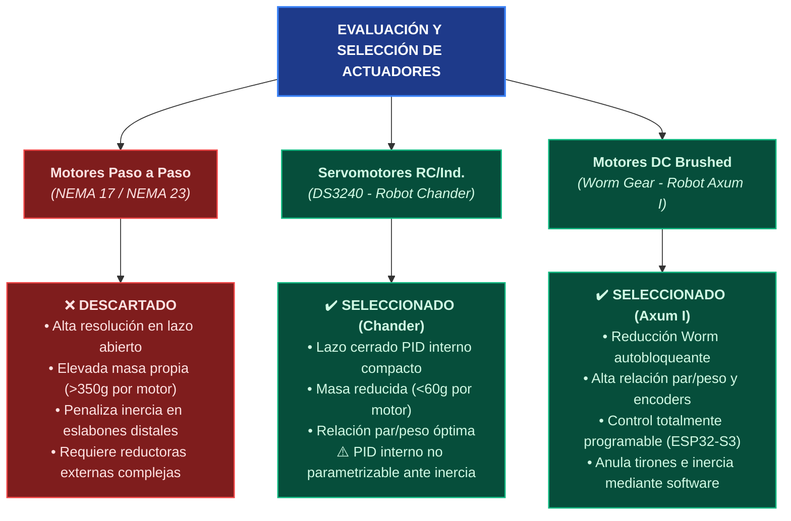
```mermaid
graph TD
    %% Estilos de Nodos
    classDef root fill:#1e3a8a,stroke:#3b82f6,stroke-width:2px,color:#fff;
    classDef descartado fill:#7f1d1d,stroke:#ef4444,stroke-width:1.5px,color:#fee2e2;
    classDef seleccionado fill:#064e3b,stroke:#10b981,stroke-width:1.5px,color:#d1fae5;

    Root["<b>EVALUACIÓN Y SELECCIÓN DE ACTUADORES</b>"] --> PTP["<b>Motores Paso a Paso</b><br/><i>(NEMA 17 / NEMA 23)</i>"]
    Root --> Servo["<b>Servomotores RC/Ind.</b><br/><i>(DS3240 - Robot Chander)</i>"]
    Root --> DC["<b>Motores DC Brushed</b><br/><i>(Worm Gear - Robot Axum I)</i>"]

    PTP --> PTP_desc["❌ <b>DESCARTADO</b><br/>• Alta resolución en lazo abierto<br/>• Elevada masa propia (>350g por motor)<br/>• Penaliza inercia en eslabones distales<br/>• Requiere reductoras externas complejas"]

    Servo --> Servo_sel["✔️ <b>SELECCIONADO (Chander)</b><br/>• Lazo cerrado PID interno compacto<br/>• Masa reducida (<60g por motor)<br/>• Relación par/peso óptima<br/>⚠️ PID interno no parametrizable ante inercia"]

    DC --> DC_sel["✔️ <b>SELECCIONADO (Axum I)</b><br/>• Reducción Worm autobloqueante<br/>• Alta relación par/peso y encoders<br/>• Control totalmente programable (ESP32-S3)<br/>• Anula tirones e inercia mediante software"]

    %% Asignación de clases
    class Root root;
    class PTP,PTP_desc descartado;
    class Servo,Servo_sel,DC,DC_sel seleccionado;

```

### 1. Motores Paso a Paso (NEMA 17 / NEMA 23)

Presentan una excelente resolución de posicionamiento en lazo abierto y facilidad de interfaz digital. Sin embargo, poseen una masa propia excesiva para el par utilizable que entregan sin caja reductora adicional ($>350 \text{ g}$ por actuador). Ubicar esta masa en las articulaciones distales (codo y muñeca) penaliza exponencialmente el momento de inercia y el torque requerido en la base y el hombro, encareciendo la estructura e introduciendo la necesidad de transmisiones cicloidales o planetarias externas.

### 2. Servomotores RC/Industriales Compactos (Plataforma Chander)

Se seleccionaron servomotores digitales de alto torque (DS3240, 36.0 kg·cm nominales). Ofrecen una relación par/peso superior al integrar la caja reductora y la electrónica de control en un encapsulado liviano ($<60 \text{ g}$). Esta reducción masiva de inercia en el codo y la muñeca permite maximizar la carga útil del manipulador. No obstante, presentan como desventaja crítica la imposibilidad de modificar las ganancias del lazo de control PID interno, el cual no está sintonizado para compensar grandes masas dinámicas distales, induciendo oscilaciones durante paradas bruscas.

### 3. Motores DC Brushed con Reducción de Tornillo Sin Fin (Plataforma Axum I)

Se seleccionaron los motorreductores tipo *Worm* JGY370 (21 kg·cm) y 5840-31ZY (70 kg·cm) integrados con *encoders* de cuadratura. La transmisión por tornillo sin fin otorga autobloqueo mecánico natural, eliminando el consumo de corriente estática para sostener la estructura contra la gravedad. Además, al no incorporar un microcontrolador interno, permiten al diseñador implementar un esquema de control de potencia y velocidad propio (lazo en cascada multitasas en el ESP32-S3), perfilando suavemente las aceleraciones y anulando el impacto destructivo de las inercias variables.

---

## 2.4. Mejoras Propuestas sobre Modelos Anteriores

Tomando como referencia las falencias identificadas en iteraciones previas de brazos robóticos impresos en 3D, el proyecto integró soluciones estructurales y de manufactura orientadas a garantizar la repetibilidad cinemática:

1. **Reevaluación del Sistema de Torque y Servomotores:**
En desarrollos pasados se atribuyeron las fallas mecánicas a la falta de servomotores de grado industrial. En el presente trabajo se demostró que el problema radicaba en una formulación cinético-dinámica deficiente. Corrigiendo el modelo de momentos e inercia, fue posible operar servomotores comerciales estándar dentro de su rango térmico de carga nominal de forma estable. Asimismo, se garantizó un bus de potencia común de 5V asistido por una fuente ATX industrial capaz de suministrar picos transitorios de 31A para evitar caídas de tensión en el microcontrolador.


2. **Ajustes Geométricos, Tolerancias y Backlash:**
Se estandarizaron las holguras para tornillería M3 y M4 fijando $0.2 \text{ mm}$ de tolerancia en agujeros pasantes rígidos. Para la compensación de la contracción térmica del PLA en manufactura aditiva, se establecieron experimentalmente tolerancias de $0.4 \text{ mm}$ para ajustes de deslizamiento rotacional (*slip fit*) y $0.2 \text{ mm}$ para uniones por interferencia (*press fit*). En cuanto al tren de engranajes, se corrigió el generador CAD paramétrico de Autodesk Inventor —el cual aplicaba tolerancias de metalmecánica no aptas para FDM— migrando a un modelado asistido por Fusion 360 con un factor de holgura adaptado, minimizando el juego mecánico (*backlash*).


3. **Optimización Estructural y Distribución Mecánica:**
Se conservó el uso de ácido poliláctico (PLA) debido a su alto módulo de elasticidad específico y facilidad de impresión. Para resolver la deflexión destructiva sobre el eje de rotación de la base (Articulación J0), se rediseñó la transferencia de cargas acoplando un soporte axial tipo *Lazy Susan*. Este mecanismo absorbe el 100% de la carga axial flectora producida por el peso del brazo en voladizo, aislando al eje de accionamiento del motor J0 para que responda únicamente a las solicitaciones de rotación pura.

# 3. Fundamentación Teórica y Modelado Matemático

El modelado cinemático y cinético constituye la base analítica fundamental para el análisis, simulación y control de las dos arquitecturas del manipulador robótico de 4 grados de libertad (**Axum I** y **Chander**). Este marco matemático permite describir la configuración espacial de los eslabones, mapear coordenadas entre el espacio articular y cartesiano, y determinar los estados de velocidad, aceleración y esfuerzos dinámicos que actúan sobre la cadena cinemática abierta.

---

## 3.1. Cinemática Directa: Convención Denavit-Hartenberg (DH)

La cinemática directa permite determinar la posición y orientación del efector final (*Tool Center Point* - TCP) con respecto a un sistema de coordenadas de referencia fijado en la base ($F_0$), en función del vector de variables articulares $q = [\theta_1, \theta_2, \theta_3, \theta_4]^T$. Para estructurar espacialmente ambas variantes, se adopta la convención estándar de **Denavit-Hartenberg (D-H)**.

Este método asigna un sistema de coordenadas dextrógiro a cada eslabón $i$ ($i = 1, 2, 3, 4$). La transformación homogénea que relaciona el marco del eslabón $i-1$ con el marco $i$ se define mediante cuatro transformaciones geométricas fundamentales ejecutadas en secuencia estricta:

1. **Rotación en $z_{i-1}$** un ángulo $\theta_i$ para alinear el eje $x_{i-1}$ con el eje $x_i$.


2. **Traslación en $z_{i-1}$** una distancia $d_i$ a lo largo de $z_{i-1}$ hasta la intersección con el eje $x_i$.


3. **Traslación en $x_i$** una distancia $a_i$ a lo largo de $x_i$ para unir los orígenes de las articulaciones.


4. **Rotación en $x_i$** un ángulo $\alpha_i$ (torsión) para alinear el eje $z_{i-1}$ con el eje $z_i$.


Mathematicamente, la matriz de transformación homogénea individual $A_i^{i-1}$ se obtiene como el producto matricial:

$$A_i^{i-1} = \text{Rot}_z(\theta_i) \cdot \text{Trans}_z(d_i) \cdot \text{Trans}_x(a_i) \cdot \text{Rot}_x(\alpha_i) \tag{1}$$

Al multiplicar los términos de rotación y traslación, se deriva la expresión matricial genérica de Denavit-Hartenberg $4 \times 4$:

$$A_i^{i-1} = \begin{bmatrix} \cos\theta_i & -\sin\theta_i \cos\alpha_i & \sin\theta_i \sin\alpha_i & a_i \cos\theta_i \\ \sin\theta_i & \cos\theta_i \cos\alpha_i & -\cos\theta_i \sin\alpha_i & a_i \sin\theta_i \\ 0 & \sin\alpha_i & \cos\alpha_i & d_i \\ 0 & 0 & 0 & 1 \end{bmatrix} \tag{2}$$

Para obtener la ubicación y orientación global del TCP respecto al origen de la base ($T_N^0$), se calcula el producto en cadena de las matrices de cada articulación:

$$T_N^0 = \prod_{i=1}^{N} A_i^{i-1} = A_1^0 \cdot A_2^1 \cdot A_3^2 \cdot \dots \cdot A_N^{N-1} \tag{3}$$

La matriz resultante $T_N^0$ estructura la submatriz de rotación $R_N^0$ de $3 \times 3$ (orientación espacial de la herramienta) y el vector de posición cartesiana $P_N^0 = [P_x, P_y, P_z]^T$ de $3 \times 1$:

$$T_N^0 = \begin{bmatrix} R_N^0 & P_N^0 \\ 0_{1 \times 3} & 1 \end{bmatrix} \tag{4}$$

---

## 3.2. Cinemática Inversa: Método Geométrico de Desacoplo

La cinemática inversa resuelve el problema de control cartesiano: dadas las coordenadas espaciales objetivo $P = [P_x, P_y, P_z]^T$ y una orientación deseada del efector final, se deben determinar analíticamente las variables articulares $q = [\theta_1, \theta_2, \theta_3, \theta_4]^T$ requeridas. Dado que el diseño mecánico de ambas estructuras contempla desplazamientos transversales acumulados (offsets de profundidad $w_i$), el problema tridimensional se resuelve mediante un método de desacoplo geométrico en dos etapas.

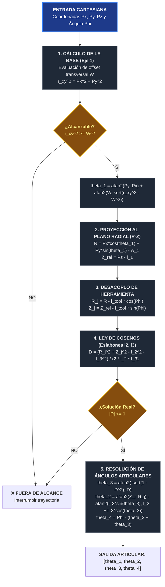
```mermaid
flowchart TD
    classDef start fill:#1e3a8a,stroke:#3b82f6,stroke-width:2px,color:#fff;
    classDef step fill:#1f2937,stroke:#4b5563,stroke-width:1px,color:#e5e7eb;
    classDef decision fill:#854d0e,stroke:#eab308,stroke-width:1px,color:#fef08a;

    Start["<b>ENTRADA CARTESIANA</b><br/>Coordenadas Px, Py, Pz y Ángulo Phi"] --> Base["<b>1. CÁLCULO DE LA BASE (Eje 1)</b><br/>Evaluación de offset transversal W<br/>r_xy^2 = Px^2 + Py^2"]
    
    Base --> Valid{"<b>¿Alcanzable?</b><br/>r_xy^2 >= W^2"}
    Valid -- NO --> Abort["❌ <b>FUERA DE ALCANCE</b><br/>Interrumpir trayectoria"]
    Valid -- SÍ --> CalcTheta1["theta_1 = atan2(Py, Px) + atan2(W, sqrt(r_xy^2 - W^2))"]
    
    CalcTheta1 --> Project["<b>2. PROYECCIÓN AL PLANO RADIAL (R-Z)</b><br/>R = Px*cos(theta_1) + Py*sin(theta_1) - w_1<br/>Z_rel = Pz - l_1"]
    
    Project --> Decouple["<b>3. DESACOPLO DE HERRAMIENTA</b><br/>R_j = R - l_tool * cos(Phi)<br/>Z_j = Z_rel - l_tool * sin(Phi)"]
    
    Decouple --> Cosines["<b>4. LEY DE COSENOS (Eslabones l2, l3)</b><br/>D = (R_j^2 + Z_j^2 - l_2^2 - l_3^2) / (2 * l_2 * l_3)"]
    
    Cosines --> CheckD{"<b>¿Solución Real?</b><br/>|D| <= 1"}
    CheckD -- NO --> Abort
    CheckD -- SÍ --> Angles["<b>5. RESOLUCIÓN DE ÁNGULOS ARTICULARES</b><br/>theta_3 = atan2(-sqrt(1 - D^2), D)<br/>theta_2 = atan2(Z_j, R_j) - atan2(l_3*sin(theta_3), l_2 + l_3*cos(theta_3))<br/>theta_4 = Phi - (theta_2 + theta_3)"]
    
    Angles --> End["<b>SALIDA ARTICULAR: [theta_1, theta_2, theta_3, theta_4]</b>"]

    class Start start;
    class Base,CalcTheta1,Project,Decouple,Cosines,Angles step;
    class Valid,CheckD decision;

```

### 3.2.1. Cálculo de la Articulación Base ($\theta_1$)

Se proyecta el vector de posición cartesiano $[P_x, P_y]^T$ sobre el plano horizontal $X-Y$ de la base. El desplazamiento transversal $W$ representa el offset acumulado a lo largo de los ejes articulares rotados:

$$W = \sum w_i = w_2 + w_3 + w_4 \tag{5}$$

$$r_{xy}^2 = P_x^2 + P_y^2 \tag{6}$$

Para garantizar que el punto sea accesible, debe cumplirse la condición geométrica $r_{xy}^2 \ge W^2$. Aplicando trigonometría sobre el triángulo proyectado en la base, el ángulo $\theta_1$ se obtiene mediante la suma del ángulo del vector de posición y la corrección del offset:

$$\theta_1 = \text{atan2}(P_y, P_x) + \text{atan2}\left(W, \sqrt{r_{xy}^2 - W^2}\right) \tag{7}$$

### 3.2.2. Desacoplo y Proyección al Plano Radial ($R-Z$)

Con $\theta_1$ determinado, la posición $3D$ se proyecta sobre un plano bidimensional rotado denominado plano radial ($R-Z$). La distancia radial efectiva $R$ y la altura relativa $Z_{\text{rel}}$ se definen restando el offset inicial $w_1$ y la altura del hombro $l_1$:

$$R = P_x \cos\theta_1 + P_y \sin\theta_1 - w_1 \tag{8}$$

$$Z_{\text{rel}} = P_z - l_1 \tag{9}$$

### 3.2.3. Solución Plana mediante Ley de Cosenos (Modos 3-DOF y 4-DOF)

En el régimen de orientación controlada (4-DOF), el usuario o el firmware especifica el ángulo de ataque o inclinación global de la herramienta respecto a la horizontal ($\Phi = \theta_2 + \theta_3 + \theta_4$). Se desacopla la herramienta retrocediendo geométricamente desde el TCP para encontrar la posición de la articulación de la muñeca ($R_j, Z_j$):

$$R_j = R - l_{\text{tool}} \cos\Phi \tag{10}$$

$$Z_j = Z_{\text{rel}} - l_{\text{tool}} \sin\Phi \tag{11}$$

Aplicando la Ley de Cosenos sobre el triángulo constituido por las longitudes del hombro ($l_2$) y del codo ($l_3$), se calcula el parámetro auxiliar $D$:

$$D = \frac{R_j^2 + Z_j^2 - l_2^2 - l_3^2}{2 l_2 l_3} \tag{12}$$

Para existencia de solución física en el espacio de trabajo, debe verificarse $\vert{}D\vert{} \le 1$. Seleccionando la configuración geométrica en "codo arriba" (*elbow up*, correspondiente a la raíz negativa), los ángulos de codo ($\theta_3$), hombro ($\theta_2$) y muñeca ($\theta_4$) se despejan como:

$$\theta_3 = \text{atan2}\left(-\sqrt{1 - D^2}, D\right) \tag{13}$$

$$\theta_2 = \text{atan2}(Z_j, R_j) - \text{atan2}\left(l_3 \sin\theta_3, l_2 + l_3 \cos\theta_3\right) \tag{14}$$

$$\theta_4 = \Phi - (\theta_2 + \theta_3) \tag{15}$$

*(Nota: En el modo 3-DOF de muñeca libre, el eslabón 3 y el eslabón 4 se agrupan vectorialmente en un único eslabón virtual $L_{\text{virt}} = \sqrt{l_3^2 + l_4^2 + 2l_3 l_4 \cos\theta_4}$, recalculando los triángulos equivalentes)*.

---

## 3.3. Cinemática Diferencial mediante Marcos de Referencia Móviles

El análisis de velocidades y aceleraciones espaciales en manipuladores de cadena abierta requiere evaluar el movimiento relativo entre marcos de referencia en rotación continua. Se define un marco móvil $F$ rígidamente unido al eslabón $i-1$, el cual rota en el espacio con velocidad angular de arrastre $\vec{\Omega} = \vec{\omega}_{i-1}$ y aceleración angular $\vec{\dot{\Omega}} = \vec{\alpha}_{i-1}$.

### 3.3.1. Velocidad y Aceleración Angular

La velocidad angular absoluta del eslabón $i$ ($\vec{\omega}_i$) es la suma vectorial de la velocidad de arrastre y la velocidad angular relativa aportada por el motor $i$ ($\vec{\omega}_{\text{rel}, i} = \dot{\theta}_i \hat{u}_i$):

$$\vec{\omega}_i = \vec{\omega}_{i-1} + \vec{\omega}_{\text{rel}, i} \tag{16}$$

Derivando la Ecuación (16) en un marco rotatorio, la aceleración angular absoluta ($\vec{\alpha}_i$) incorpora el producto cruz entre la rotación del marco y el vector de velocidad angular relativa:

$$\vec{\alpha}_i = \vec{\alpha}_{i-1} + \vec{\alpha}_{\text{rel}, i} + \vec{\omega}_{i-1} \times \vec{\omega}_{\text{rel}, i} \tag{17}$$

Donde $\vec{\alpha}_{\text{rel}, i} = \ddot{\theta}_i \hat{u}_i$, siendo $\hat{u}_i$ el vector unitario del eje de rotación del motor $i$.

### 3.3.2. Velocidad Lineal

La velocidad lineal absoluta del extremo del eslabón $i$ ($\vec{v}_i$) se compone de la velocidad del punto coincidente en el marco de arrastre ($\vec{v}_{i'}$) y la velocidad relativa respectiva ($\vec{v}_{i/F}$):

$$\vec{v}_i = \vec{v}_{i'} + \vec{v}_{i/F} \tag{18}$$

$$\vec{v}_{i'} = \vec{v}_{i-1} + \vec{\omega}_{i-1} \times \vec{r}_{i/i-1} \tag{19}$$

$$\vec{v}_{i/F} = \vec{\omega}_{\text{rel}, i} \times \vec{r}_{i/i-1} \tag{20}$$

Donde $\vec{r}_{i/i-1}$ es el vector de posición relativa desde la articulación $i-1$ hasta la articulación $i$.

### 3.3.3. Aceleración Lineal (Arrastre, Relativa y Coriolis)

La aceleración lineal absoluta $\vec{a}_i$ se obtiene mediante la superposición estricta de la aceleración de arrastre ($\vec{a}_{i'}$), la aceleración relativa ($\vec{a}_{i/F}$) y la aceleración complementaria de **Coriolis** ($\vec{a}_c$):

$$\vec{a}_i = \vec{a}_{i'} + \vec{a}_{i/F} + \vec{a}_c \tag{21}$$

En la componente de arrastre ($\vec{a}_{i'}$), se transmite explícitamente la aceleración absoluta del origen anterior ($\vec{a}_{i-1}$), garantizando la propagación inercial desde la base:

$$\vec{a}_{i'} = \vec{a}_{i-1} + \vec{\alpha}_{i-1} \times \vec{r}_{i/i-1} + \vec{\omega}_{i-1} \times (\vec{\omega}_{i-1} \times \vec{r}_{i/i-1}) \tag{22}$$

La aceleración relativa comprende las componentes tangenciales y centrípetas generadas localmente por el motor $i$:

$$\vec{a}_{i/F} = \vec{\alpha}_{\text{rel}, i} \times \vec{r}_{i/i-1} + \vec{\omega}_{\text{rel}, i} \times (\vec{\omega}_{\text{rel}, i} \times \vec{r}_{i/i-1}) \tag{23}$$

Finalmente, la aceleración de Coriolis representa el acoplamiento cinemático no lineal que surge de la interacción entre la rotación del eslabón anterior y la velocidad lineal relativa interna:

$$\vec{a}_c = 2 \vec{\omega}_{i-1} \times \vec{v}_{i/F} \tag{24}$$

Para el cálculo en el efector final (TCP), la herramienta se considera un sólido rígido estático montado sobre el eslabón 4, por lo que carece de actuadores propios ($\vec{\omega}_{\text{rel}, \text{tcp}} = \vec{0}$, $\vec{\alpha}_{\text{rel}, \text{tcp}} = \vec{0}$). Las expresiones de velocidad y aceleración en el TCP se reducen a la componente de arrastre acumulada hasta la última articulación ($\vec{v}_{\text{tcp}} = \vec{v}_{\text{tcp'}}$, $\vec{a}_{\text{tcp}} = \vec{a}_{\text{tcp'}}$).

---

## 3.4. Cinética del Sistema: Análisis de Newton-Euler

El análisis cinético evalúa la respuesta de las fuerzas y momentos requeridos para producir las aceleraciones calculadas. Para cada eslabón $i$ de masa $m_i$ y tensor de inercia $I_i$, las ecuaciones de equilibrio dinámico tridimensional de Newton-Euler dictan:

$$\sum \vec{F}_i = m_i \vec{a}_{ci} \tag{25}$$

$$\sum \vec{M}_i = I_i \vec{\alpha}_i + \vec{\omega}_i \times (I_i \vec{\omega}_i) \tag{26}$$

Donde:

* $\vec{a}_{ci}$ es la aceleración del centro de masa del eslabón $i$.


* $I_i$ es el tensor de inercia del eslabón $i$ evaluado respecto a su centro de masa.


* El término $\vec{\omega}_i \times (I_i \vec{\omega}_i)$ representa el momento giroscópico, fundamental para compensar fuerzas flectoras en maniobras espaciales tridimensionales.


El torque total exigido al actuador $i$ ($\tau_{\text{total}, i}$) se obtiene proyectando la suma del torque estático de retención gravitacional ($\tau_{\text{estático}, i}$) y el torque dinámico inercial ($\tau_{\text{dinámico}, i}$) sobre el eje unitario de rotación del motor $\hat{u}_i$:

$$\tau_{\text{estático}, i} = \sum_{j=i}^{N} \vert{}(\vec{r}_j \times m_j \vec{g}) \cdot \hat{u}_i\vert{} \tag{27}$$

$$\tau_{\text{dinámico}, i} = I_{\text{total}, i} \cdot \alpha_i \tag{28}$$

$$\tau_{\text{total}, i} = \tau_{\text{estático}, i} + \tau_{\text{dinámico}, i} \tag{29}$$

# 4. Inercia, Ancho de Banda y Restricciones Dinámicas

La respuesta dinámica del robot está intrínsecamente ligada a la distribución espacial de sus masas y al remanente de torque disponible en los actuadores tras vencer la gravedad. Para garantizar un seguimiento de trayectoria preciso, se evalúan las restricciones inerciales, los límites de aceleración máxima, la deflexión estructural de los eslabones y la selección final de componentes comerciales.

---

## 4.1. Inercia Equivalente y Aceleración Angular Máxima

El cálculo inercial proyecta las masas del sistema mediante la distancia perpendicular real ($r_{\perp}$) desde cada centro de masa $j$ hasta el eje instantáneo de rotación de la articulación $i$ bajo análisis. La inercia total $I_{\text{total}}$ reflejada en el eje de giro del motor viene dada por:

$$I_{\text{total}} = \sum_{j \ge i} \left( m_j \cdot r_{\perp, j}^2 \right) + m_{\text{load}} \cdot r_{\perp, \text{load}}^2$$

Con base en la inercia proyectada y el torque nominal del actuador ($\tau_{\text{rated}}$), se determina la aceleración angular máxima ($\alpha_{\text{max}}$) que puede desarrollar el sistema sin incurrir en saturación ni pérdida de pasos/conmutación:

$$\alpha_{\text{max}} = \frac{\tau_{\text{rated}} - \tau_{\text{static}}}{I_{\text{total}}}$$

Donde el torque estático 3D ($\vec{\tau}_{3D}$) proviene del producto cruz del vector de distancia radial ($\vec{r}$) y la fuerza de gravedad ($\vec{F}_g$), aislado sobre el eje de rotación mediante el producto escalar con el vector unitario del eje ($\vec{u}_{\text{axis}}$):

$$\vec{\tau}_{3D} = \sum_{j>i} \left( \vec{r}_j \times (m_j \cdot \vec{g}) \right) + \left( \vec{r}_{\text{load}} \times (m_{\text{load}} \cdot \vec{g}) \right)$$

$$\tau_{\text{static}} = \vert{} \vec{\tau}_{3D} \cdot \vec{u}_{\text{axis}} \vert{}$$

---

## 4.2. Torque Analysis & Motor Sizing

Las restricciones de torque dependen de los actuadores disponibles, exigiendo bajas velocidades angulares para maximizar la relación de engranajes mecánicos. El script de simulación establece límites operativos: 70 kg·cm para el hombro y 21 kg·cm para el resto. En el mercado colombiano actual, las opciones viables se dividen en:

* **Motores DC Brushed Planetarios:** Torques de 20 a 100 kg·cm (4 a 30 RPM). Costos: 80,000 - 200,000 COP. Incorporan encoders de cuadratura.
* **Motores DC Brushed Worm:** Torques de 20 a 100 kg·cm (4 a 30 RPM). Costos: 60,000 - 150,000 COP. Ventaja de autobloqueo mecánico por el tornillo sin fin y alta disponibilidad.
* **Motores AC Brushless:** Torques de 50 a 200 kg·cm. Costos: 80,000 - 300,000 COP. Son más costosos y complejos ya que requieren controladores dedicados, aunque ofrecen el mejor rendimiento.

---

## 4.3. Kinematic & Dynamic Constraints

Dado el torque analizado, la principal restricción dinámica es la velocidad angular. Las velocidades deben mantenerse bajas; dado que el brazo tiene un alcance inferior a 50 cm, no se exigen velocidades lineales altas. Una mayor velocidad exigiría mayores aceleraciones para frenar entre cambios de pose, amplificando el impacto negativo de una inercia alta.

El entorno virtual compara iterativamente la aceleración objetivo con la calculada ($\alpha_{\text{max}}$). Si la solicitada supera la capacidad remanente del sistema evaluado, el script emite alertas sobre posibles fallos (cuellos de botella).

---

## 4.4. Structural & Material Resistance

El análisis geométrico evalúa secciones transversales de 30x50 mm para polímeros (PLA y ABS). Estos materiales fueron modelados rigurosamente asumiendo una configuración de fabricación por impresión 3D, aplicando un patrón de relleno cúbico (*cubic infill*) del 30% para reflejar con precisión su densidad real y la relación peso-resistencia. También se evaluó el MDF como alternativa de bajo coste, asumiendo un perfil macizo mecanizado de 8x40 mm.

El código emplea una función paramétrica donde las longitudes de los eslabones móviles mantienen una proporción estricta respecto a un segmento principal variable ($L$, desde 180 mm hasta 450 mm):
* **Hombro ($L_2$):** $L$
* **Codo ($L_3$):** $0.7 \cdot L$
* **Muñeca ($L_4$):** $0.3 \cdot L$

Además, un modelo de viga en voladizo evalúa la flexión máxima ($\delta$) en el segmento crítico (el hombro), integrando el Módulo de Young efectivo, el peso propio distribuido ($W_{\text{propio}}$) y la carga puntual de las articulaciones distales ($F_{\text{punta}}$):

$$\delta = \frac{F_{\text{punta}} \cdot L^3}{3 \cdot E \cdot I} + \frac{W_{\text{propio}} \cdot L^3}{8 \cdot E \cdot I}$$


A continuación, se presenta la tabla con los resultados para la configuración geométrica elegida ($L = 300\text{ mm}$), evaluando la postura estirada de mayor exigencia, junto con su respectiva representación cinemática tridimensional:

**ANÁLISIS DE POSTURA: [0.0, 0.0, 0.0, 0.0] | Carga: 200.0g | Acel. Deseada: 5.0 rad/s²**

| Articulación | Límite [kg·cm] | T. Estático [kg·cm] | T. Dinámico [kg·cm] | T. Total [kg·cm] | Acel. MAX [rad/s²] | Factor de Seguridad (FS) |
| :--- | :--- | :--- | :--- | :--- | :--- | :--- |
| **J0 (Z)** | 21.0 | 0.00 | 9.13 | 9.13 | 11.51 | 2.30 |
| **J1 (Y)** | 70.0 | 36.72 | 8.86 | 45.58 | 18.78 | 1.54 |
| **J2 (Y)** | 21.0 | 12.32 | 1.56 | 13.87 | 27.89 | 1.51 |
| **J3 (Y)** | 21.0 | 2.03 | 0.09 | 2.12 | 1080.09 | 9.92 |

> **Resultado de la Simulación:** **ÉXITO**. La aceleración deseada es soportada adecuadamente por los motores seleccionados. (El cuello de botella en todo el brazo se encuentra en 11.51 rad/s²).

Se eligió esa postura dados los factores de seguridad de 1.5, que permiten tener suficiente seguridad sin considerar factores extra como excentricidades o fricción viscosa. También se usó una carga de 200g considerando un caso excesivo, el cual aún es seguro.

---

## 4.5. Bill of Materials (BOM) & Component Selection

Con base en los resultados del remanente de torque y la viabilidad del mercado, se establece la siguiente lista de componentes principales requeridos para satisfacer la dinámica del sistema:

* **Actuadores:** Motorreductores DC tipo Worm equipados con encoders de cuadratura ya integrados para el cierre del lazo de control de posición. Tres iguales y uno de mayor carga para el hombro. Se eligieron los modelos JGY370 de 6RPM y el 31ZY / 5840-31ZY de 7RPM.
* **Microcontrolador (Hardware-in-the-Loop):** ESP32-S3 (N16R8) para gestionar las interrupciones de los encoders, la matemática de coma flotante de las matrices cinemáticas y la generación de señales de control PWM.
* **Mecánica y Transmisión:** Se descarta cualquier tipo de transmisión extra; complejiza el diseño y no aporta un rendimiento significativo frente al que ya está, además de que encarece el ensamble.

### Hojas Técnicas y Planos Dimensionales de los Actuadores

#### Motorreductor para Hombro (Modelo 5840-31ZY)


#### Motorreductor Estándar (Modelo JGY370)


---

## 4.6. CAD Modeling & Assembly Constraints

El paso de la formulación analítica al software de diseño asistido por computadora (CAD) está condicionado por las siguientes reglas restrictivas derivadas de la simulación:

1. **Parámetros de Fabricación Aditiva:** Para que la resistencia estructural final corresponda a la matriz analítica de deflexión ($\delta$), las piezas impresas (PLA/ABS) deben parametrizarse en laminadores como PrusaSlicer o Cura respetando el 30% de infill cúbico. Además, se debe aumentar el grosor de las paredes perimetrales (*shell thickness*) específicamente en las uniones de los motores J1 y J2 para mitigar la fatiga por concentración de esfuerzos.
2. **Alineación de Ejes:** Como dictamina la matriz de rotación, la articulación de la base debe ser estrictamente vertical. Los planos CAD deben garantizar tolerancias precisas (H7/g6) para los rodamientos de apoyo de la base, previniendo cabeceos durante las aceleraciones altas.
3. **Distribución de Masas (Inercia):** El diseño debe tener un enfoque que no tenga elementos tan pesados y con la inercia mínima posible y de manera más uniforme para simplificar los cálculos.
4. **Ensamble Práctico:** Debe ser diseñado de manera que cada articulación sea ensamblada y desensamblada de una forma rápida, en caso de falla, cambio de pieza y transporte.
5. **Uniones con Motores:** Las articulaciones se unen con bridas D Shaft, de modo que se atornillan junto a las articulaciones.
6. **Tornillería:** Las articulaciones, la base, las protecciones, las tapas y las herramientas se deben unir con tornillería M3 y M4, se usan tolerancias de 0.5mm para ajuste y 1mm para rotación.
7. **Acople de Bridas:** Se deben diseñar ranuras específicas que permitan en ciertas posiciones apretar y aflojar las bridas para el desarme, previniendo debilitar innecesariamente la estructura principal.

# 5. Fases de Prototipado y Validación Empírica Previa

Antes de proceder con la fabricación aditiva definitiva en PLA, ambos proyectos ejecutaron fases de pruebas experimentales y prototipado rápido (*Hardware-in-the-Loop*). Estas etapas permitieron afinar el código de control, verificar las restricciones cinéticas en entornos reales y caracterizar el comportamiento dinámico transitorio de los actuadores.

---

## 5.1. Prototipo MDF (Prueba de Concepto - Axum I)

Con el propósito de validar el modelo analítico espacial y la cinemática tridimensional antes de incurrir en los costos de tiempo de la impresión 3D, se construyó una prueba de concepto (PoC) o versión cero (v0) utilizando secciones macizas de MDF.

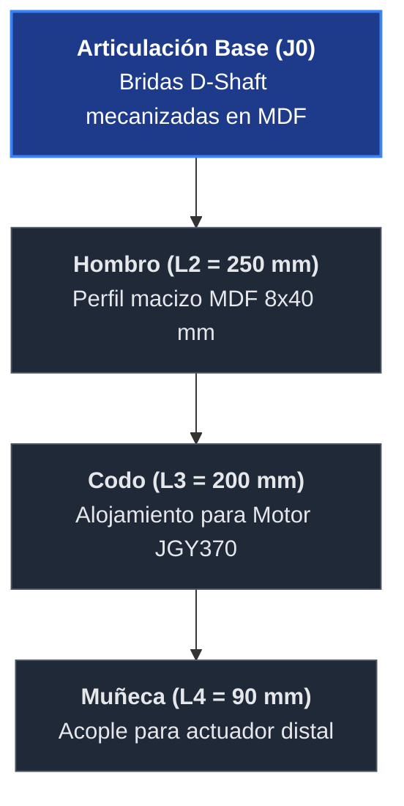
```mermaid
graph TD
    classDef main fill:#1e3a8a,stroke:#3b82f6,stroke-width:2px,color:#fff;
    classDef node fill:#1f2937,stroke:#4b5563,stroke-width:1px,color:#e5e7eb;

    J0["<b>Articulación Base (J0)</b><br/>Bridas D-Shaft mecanizadas en MDF"] --> L2["<b>Hombro (L2 = 250 mm)</b><br/>Perfil macizo MDF 8x40 mm"]
    L2 --> J2["<b>Codo (L3 = 200 mm)</b><br/>Alojamiento para Motor JGY370"]
    J2 --> L4["<b>Muñeca (L4 = 90 mm)</b><br/>Acople para actuador distal"]

    class J0 main;
    class L2,J2,L4 node;

```

### 5.1.1. Diseño CAD v0 y Dimensionamiento

El diseño de la iteración v0 heredó las dimensiones paramétricas dictadas por las simulaciones analíticas:

* **Hombro ($L_2$):** 250 mm.


* **Codo ($L_3$):** 200 mm ($0.7 \cdot L_2$).


* **Muñeca ($L_4$):** 90 mm ($0.3 \cdot L_2$).


La estructura fue elaborada mediante corte láser y taladrado manual, incorporando alojamientos para las bridas de transmisión *D-Shaft* de los motores DC (JGY370 y 5840-31ZY). Esta versión permitió estudiar espacialmente la presencia de colisiones mecánicas propias y el enrutamiento físico de los manguitos de cables hacia los *encoders*.

### 5.1.2. Firmware de Prueba de Bajo Nivel

Para la validación del prototipo v0, se estructuró un *firmware* en C++ sobre el ESP32-S3 orientado a telemetría básica y seguridad activa:

* **Gestión de Memoria No Volátil (NVS):** Almacenamiento condicional de conteo absoluto de *encoders* mediante la librería `Preferences`. La escritura se activa únicamente tras la detención completa ($\text{PWM} = 0$) o durante paradas de emergencia, previniendo el desgaste prematuro de la memoria Flash.


* **Rutina Anti-Colisión por Corriente:** Lazo asíncrono ejecutado a 20 Hz ($dt = 50\text{ ms}$) mediante la lectura analógica de un ADC externo (ADS1115). Aplica conversión de corriente especificando $20.0\text{ A/V}$ para el motor 31ZY y $13.6\text{ A/V}$ para los JGY370. Si la corriente excede los límites de bloqueo ($6.5\text{ A}$ en el hombro y $1.2\text{ A}$ en el codo/muñeca), interrumpe inmediatamente las salidas PWM y almacena el estado de fallo.


* **Banderas de Inversión Configurable:** Estructuración de parámetros booleanos (`INVERTIR_MOTOR`, `INVERTIR_ENCODER`) en el código para cruzar canales lógicos de control sin necesidad de alteración física del cableado.


### 5.1.3. Resultados Empíricos e Iteración Mecánica

La operación del prototipo en MDF arrojó conclusiones clave para el rediseño hacia la versión v1 (impresión 3D):

1. **Consumo Eléctrico y Velocidad:** Bajo cargas de $200\text{ g}$, los motores conservaron velocidades angulares ligeramente inferiores a $4\text{ RPM}$, correspondiendo con las curvas de los *datasheets* de fábrica.


2. **Backlash y Holgura Estructural:** Se evidenció un juego mecánico acumulado (*backlash*) en las cajas reductoras tipo *Worm* de entre $2^\circ$ y $3^\circ$, amplificado por el deslizamiento de los prisioneros sobre las bridas *D-Shaft*.


3. **Falla por Carga Axial en la Base:** La brida del motor J0 no logró soportar la carga axial flectora de la masa total en voladizo, provocando deflexiones que trababan la rotación sobre el eje Z. Esto motivó la incorporación obligatoria de un soporte axial *Lazy Susan* para la estructura definitiva.


---

## 5.2. Análisis Empírico de Aceleración y Velocidad (Chander)

Para alimentar las variables de inercia dinámica en el modelo cinético del robot **Chander**, se procedió a aislar los parámetros cinemáticos transitorios reales de los servomotores de $36.0\text{ kg}\cdot\text{cm}$ mediante análisis fotogramétrico.

### 5.2.1. Seguimiento mediante Fotogrametría (Software Tracker)

Se registró en video a 30 FPS ($\Delta t \approx 0.0333\text{ s}$) el movimiento articular de un prototipo preliminar sometido a una trayectoria angular de gran amplitud.

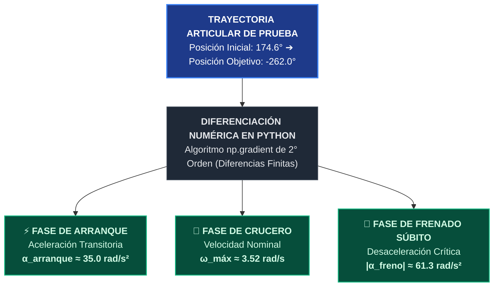
```mermaid
flowchart TD
    classDef start fill:#1e3a8a,stroke:#3b82f6,stroke-width:2px,color:#fff;
    classDef process fill:#1f2937,stroke:#4b5563,stroke-width:1px,color:#e5e7eb;
    classDef output fill:#064e3b,stroke:#10b981,stroke-width:1.5px,color:#d1fae5;

    P_Init["<b>TRAYECTORIA ARTICULAR DE PRUEBA</b><br/>Posición Inicial: 174.6° ➔ Posición Objetivo: -262.0°"] --> Diff["<b>DIFERENCIACIÓN NUMÉRICA EN PYTHON</b><br/>Algoritmo np.gradient de 2° Orden (Diferencias Finitas)"]
    
    Diff --> Phase1["⚡ <b>FASE DE ARRANQUE</b><br/>Aceleración Transitoria<br/><b>α_arranque ≈ 35.0 rad/s²</b>"]
    Diff --> Phase2["🚀 <b>FASE DE CRUCERO</b><br/>Velocidad Nominal<br/><b>ω_máx ≈ 3.52 rad/s</b>"]
    Diff --> Phase3["🛑 <b>FASE DE FRENADO SÚBITO</b><br/>Desaceleración Crítica<br/><b>|α_freno| ≈ 61.3 rad/s²</b>"]

    class P_Init start;
    class Diff process;
    class Phase1,Phase2,Phase3 output;

```

Para transformar las lecturas discretas de posición ($\theta_i$) en curvas continuas de velocidad ($\omega$) y aceleración ($\alpha$), se aplicó un esquema de diferencias finitas centrales de segundo orden:

$$\omega_i \approx \frac{\theta_{i+1} - \theta_{i-1}}{2 \Delta t} \tag{35}$$

$$\alpha_i \approx \frac{\omega_{i+1} - \omega_{i-1}}{2 \Delta t} \tag{36}$$

### 5.2.2. Resultados del Análisis por Fases Dinámicas

Los perfiles de movimiento procesados demostraron la existencia de tres regímenes dinámicos bien diferenciados:

1. **Fase de Arranque (Aceleración):** Para vencer la inercia estática y romper el reposo, la pendiente de la velocidad alcanzó una aceleración angular transitoria máxima de $\alpha_{\text{arranque}} \approx 35.0\text{ rad/s}^2$. Este valor se adoptó como la aceleración de diseño prudente ($\alpha_{\text{deseada}} = 30.0\text{ rad/s}^2$) para los cálculos de torque dinámico.


2. **Fase de Crucero (Velocidad Nominal):** El eslabón sostuvo una velocidad angular máxima de $\omega_{\text{máx}} \approx 3.52\text{ rad/s}$ (comparada contra el límite sin carga de $5.23\text{ rad/s}$ a $5\text{V}$ reportado por el fabricante).


3. **Fase de Frenado Súbito (Desaceleración Crítica):** Al aproximarse a la postura de consigna, la detención por lazo cerrado del servo generó un pico de desaceleración de $\vert{}\alpha_{\text{freno}}\vert{} \approx 61.3\text{ rad/s}^2$. Este valor extremo demostró analíticamente por qué las inercias variables provocan sobreimpulsos u oscilaciones en la estructura, al sobrepasar la capacidad de disipación mecánica de las articulaciones.


---

# 6. Fase de Diseño Mecánico Detallado (CAD)

Tras la validación analítica y experimental de las fases preliminares y la prueba de concepto en MDF, se procedió a la etapa de diseño mecatrónico detallado e integración bajo la metodología de **Diseño para Manufactura Aditiva (DFAM - *Design for Additive Manufacturing*)**. Todas las piezas estructurales de las plataformas **Axum I** y **Chander** fueron modeladas en 3D priorizando la rigidez torsional, la facilidad de ensamble mediante tornillería estandarizada M3/M4, la reducción de masa en los eslabones distales y la optimización para soportar las cargas calculadas.

---

## 6.1. Cálculo de Longitudes Máximas según el Torque y Gráficas de Esfuerzo/Deflexión

El dimensionamiento geométrico de los eslabones móviles no se definió arbitrariamente, sino que respondió a las restricciones de momento flector y deflexión evaluadas en las simulaciones dinámicas. Para asegurar la escalabilidad paramétrica del brazo **Axum I**, la longitud de los segmentos mantiene una proporción estricta respecto a una envergadura principal variable ($L$, acotada entre $180\text{ mm}$ y $450\text{ mm}$):

* **Hombro ($L_2$):** $L$
* **Codo ($L_3$):** $0.7 \cdot L$
* **Muñeca ($L_4$):** $0.3 \cdot L$

Para la plataforma **Chander**, se adoptó una topología escalonada decreciente con longitudes fijas de $L_1 = 100\text{ mm}$, $L_2 = 70\text{ mm}$ y $L_3 = 50\text{ mm}$. Esta reducción progresiva disminuye el momento de inercia equivalente reflejado sobre la articulación del hombro (J1).

Las curvas de deflexión y distribución de torques frente a la longitud permitieron seleccionar $L_2 = 300\text{ mm}$ (Axum I) y $L_1 = 100\text{ mm}$ (Chander) como las longitudes óptimas para mantener factores de seguridad superiores a $1.5$ ante cargas útiles de $200\text{ g}$ y $10\text{ g}$ respectivamente.

---

## 6.2. Base y Mecanismo Lazy Susan (Articulación J0)

En manipuladores de cadena abierta, la articulación de la base (J0, eje Z) soporta la mayor solicitud por momento flector debida al peso en voladizo de la estructura extendida.

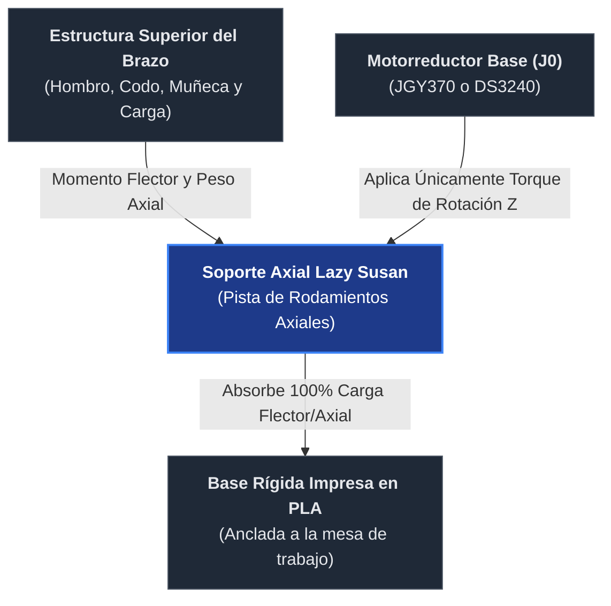
```mermaid
graph TD
    classDef main fill:#1e3a8a,stroke:#3b82f6,stroke-width:2px,color:#fff;
    classDef node fill:#1f2937,stroke:#4b5563,stroke-width:1px,color:#e5e7eb;

    Sub1["<b>Estructura Superior del Brazo</b><br/>(Hombro, Codo, Muñeca y Carga)"] -->|Momento Flector y Peso Axial| LS["<b>Soporte Axial Lazy Susan</b><br/>(Pista de Rodamientos Axiales)"]
    
    LS -->|Absorbe 100% Carga Flector/Axial| BaseImp["<b>Base Rígida Impresa en PLA</b><br/>(Anclada a la mesa de trabajo)"]
    
    MotorJ0["<b>Motorreductor Base (J0)</b><br/>(JGY370 o DS3240)"] -->|Aplica Únicamente Torque de Rotación Z| LS

    class LS main;
    class Sub1,BaseImp,MotorJ0 node;

```

El diseño de la base (Articulación J0) inicialmente se realizó atornillando el motor directamente en una base impresa en 3D y la brida soportando todo el peso del brazo, dado a que está acoplado a una caja que soporta el motor del hombro 31ZY. Si bien, el motor JGY370 de la base funciona, se deflecta lo suficiente la brida de modo que funciona de una manera ineficiente con el TCP alejado del origen.

Dado a que el problema es que el elemento que se encargaba de la rotación también se encargaba de la carga, la solución consistía en crear un soporte de modo que soporte la carga axial y evite deformaciones para que el motor solo se encargue de la rotación. Se evaluaron soluciones con rodamientos axiales y radiales, además de un cardán de 8mm, sin embargo, la solución más práctica consiste en adaptar un soporte Lazy Susan, que se encarga de soportar la carga axial en su totalidad como permitir rotación dado a el sistema interno de rodamientos.

De modo que al implementar el modelo se optó por anclar el soporte del motor 5840 31ZY al Lazy Susan y la otra cara de este último en una base nueva impresa adaptada.

En resumen, el rediseño desacopló las fuerzas de la siguiente manera:

1. **Soporte Axial Lazy Susan:** Absorbe por completo la carga axial y los momentos de vuelco.
2. **Aislamiento de la Actuación:** El motor de la base transmite únicamente torque rotacional alrededor del eje Z de manera fluida y sin tensiones cortantes.

---

## 6.3. Articulaciones: Hombro, Codo y Muñeca

El modelado CAD de las articulaciones se realizó en Autodesk Inventor respetando estrictamente las distancias entre centros de rotación:

* **Hombro (J1):** Es la articulación sometida al mayor torque estático y dinámico. Su geometría fue engrosada y reforzada aumentando el grosor de paredes perimetrales (*shell thickness*) en el laminador (PrusaSlicer/Cura) para mitigar concentraciones de esfuerzo. El diseño incluye el alojamiento específico para el motorreductor 5840-31ZY (o servomotor DS3240) y una brida de transmisión directa (*D-Shaft*) fijada mediante prisioneros que previene el deslizamiento bajo cargas pesadas.
* **Codo (J2):** Diseñado con un enfoque de reducción de masa sin comprometer la rigidez estructural. Se utilizó topología aligerada mediante ranuras donde el análisis de deflexión lo permitió. En el Axum I aloja un motor JGY370 encargado de levantar la masa remanente de la muñeca y la herramienta, mientras que en Chander sostiene la carcasa del servomotor DS3240 mediante un soporte de doble apoyo.
* **Muñeca (J3):** Ubicada en el extremo distal, alberga el actuador final responsable del cabeceo de la herramienta. Su peso fue minimizado al máximo. Incluye una interfaz de montaje estandarizada (brida universal) mediante una brida de 4 agujeros M3 dispuestos en un patrón circular de $16\text{ mm}$ de diámetro (compatibles con las bridas D-Shaft de los JGY370), permitiendo el intercambio rápido de distintos efectores finales (*End-Effectors*).

---

## 6.4. Soportes, Alojamientos (Horns) y Empaquetamiento Mecánico

El empaquetamiento mecánico del manipulador resolvió la convivencia entre la electrónica, la tornillería y las partes móviles mediante las siguientes estrategias:

* **Alojamiento de *Horns* (Brazo Chander):** Se diseñaron cavidades con tolerancias precisas para encajar los *horns* de aluminio estándar (25T) de los servomotores. Estas cavidades transmiten el esfuerzo de rotación a través de las paredes de PLA, evitando que los tornillos sufran cizallamiento directo.
* **Estandarización de Herrajes:** Se emplearon pernos Allen M4 para las uniones estructurales críticas y de alto torque (base y hombro), y pernos M3 para las articulaciones distales, tapas y soportes auxiliares.
* **Ajustes y Tolerancias de Impresión:** Se fijaron holguras de $0.2\text{ mm}$ para agujeros pasantes rígidos, $0.4\text{ mm}$ para juntas de rotación libre (*slip fit*) y $0.2\text{ mm}$ para acoples a presión (*press fit*). Las ventanas de mantenimiento permiten apretar o aflojar los prisioneros de las bridas *D-Shaft* sin desmontar la articulación.

---

## 6.5. Efectores Finales (Punta de Calibración, Grippers y Electroimanes)

Ambas plataformas fueron concebidas como sistemas modulares compatibles con diversos efectores finales intercambiables montados sobre la brida universal de la muñeca:

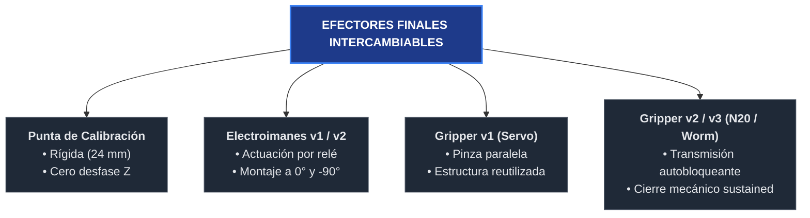
```mermaid
graph TD
    classDef root fill:#1e3a8a,stroke:#3b82f6,stroke-width:2px,color:#fff;
    classDef node fill:#1f2937,stroke:#4b5563,stroke-width:1px,color:#e5e7eb;

    Root["<b>EFECTORES FINALES INTERCAMBIABLES</b>"] --> P1["<b>Punta de Calibración</b><br/>• Rígida (24 mm)<br/>• Cero desfase Z"]
    Root --> P2["<b>Electroimanes v1 / v2</b><br/>• Actuación por relé<br/>• Montaje a 0° y -90°"]
    Root --> P3["<b>Gripper v1 (Servo)</b><br/>• Pinza paralela<br/>• Estructura reutilizada"]
    Root --> P4["<b>Gripper v2 / v3 (N20 / Worm)</b><br/>• Transmisión autobloqueante<br/>• Cierre mecánico sustained"]

    class Root root;
    class P1,P2,P3,P4 node;

```

### 6.5.1. Punta de Calibración (Calibration Tool)

Herramienta rígida de geometría cónica o puntiaguda (longitud $l_{\text{tool}} = 24\text{ mm}$ en Z) utilizada exclusivamente para la puesta a cero (*Homing*) y verificación de precisión cartesiana sobre retículas de prueba. Permite alinear el brazo a una coordenada absoluta conocida y establecer los *offsets* de los *encoders* sin desfases laterales.

### 6.5.2. Grippers (v1, v2 & v3)

Consta de un gripper pequeño con todas las piezas impresas en PLA; los ejes de rotación son tornillos M3.

* **v1:** Primer prototipo de agarre paralelo, impulsado por un servomotor SG90 y reutilizado de otro modelo de brazo robótico (mismas pinzas y engranajes) con estructura aligerada de garras.
* **v2:** Segundo prototipo cambiando el servomotor por un motorreductor N20 conservando las mismas dimensiones. También es adaptable a un motor JGA25 370.


* **v3:** Tercer prototipo adaptado tanto al motor N20 como a motores JGY370, donde la transmisión por tornillo sin fin (*Worm*) permite sujetar el objeto de forma continua y autobloqueante sin consumir energía ni sobrecalentar el motor.


### 6.5.3. Electroimanes (v1 & v2)

Consta de un análogo a un gripper, usado como herramienta magnética de $12\text{V}$ (fuerza de sujeción de $4.9\text{ N}$) para manipulación de cargas ferromagnéticas. Se acciona mediante un relé óptico y un pin digital.

* **v1 (Horizontal):** Diseñado para agarrar piezas con la muñeca orientada a $0^\circ$ respecto a la horizontal.


* **v2 (Vertical):** Diseñado con acople a $-90^\circ$ para levantar piezas perpendiculares desde paredes o contenedores planos.


---

## 6.6. Enclosure (Control Box)

Para albergar la electrónica central del brazo y separar físicamente la etapa de potencia de la lógica programable, se diseñó una caja de control externa (*Control Box*) fabricada en PLA.

* **Distribución Interna:** El gabinete incluye soportes para alojar los dos puentes H dobles BTS7960, la placa principal con la ESP32-S3, el expansor de entradas/salidas (PCF8574), el ADC ADS1115, convertidores *Step-Down* de $12\text{V}$ a $5\text{V}$, el arreglo de relés para los electroimanes, una placa universal soldada con integrados y un voltímetro general.
* **Gestión Térmica y Cableado:** Incluye ranuras de ventilación forzada y salidas con prensa-estopas o mallas expansibles para proteger y gestionar los manguitos de cables (*cable management*) que se dirigen hacia las articulaciones móviles. La caja incorpora alivio de tensión (*strain relief*) en la salida de los cables hacia el brazo y terminaciones con terminales tipo férula/Dupont.

En el robot **Chander**, la electrónica se simplifica al integrar el expansor PCA9685 cerca de la base, conectando el bus I2C y las líneas de alimentación directamente a la fuente ATX.

---

## 6.7. Ensamblaje Mecánico General (Overall Assembly) e Integración

La integración tridimensional en CAD verificó la ausencia de interferencias volumétricas y colisiones a lo largo del espacio de trabajo teórico. La integración física de ambos manipuladores se realizó mediante un protocolo de ensamble paso a paso para evitar retrabajos debido a componentes inaccesibles. Se muestran a continuación los diversos ensambles del brazo con cada herramienta:


Ensamble con Tool de Calibracion


Ensamble con Tool de Gripper 


Ensamble con Tool de Electroiman a 0°


Ensamble con Tool de Electroiman a -90°


 
  
  
  *   **v1:** Prototipo del gripper usado para agarrar objetos con la muñeca orientada a 0°
  
  

*   **v2:** Prototipo del gripper usado para agarrar objetos con la muñeca orientada a -90°
  
  


### Secuencia de Ensamble de los Subconjuntos

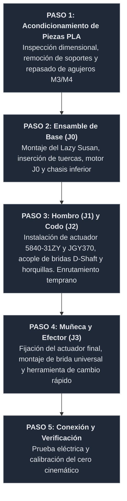
```mermaid
flowchart TD
    classDef step fill:#1f2937,stroke:#4b5563,stroke-width:1px,color:#e5e7eb;

    S1["<b>PASO 1: Acondicionamiento de Piezas PLA</b><br/>Inspección dimensional, remoción de soportes y repasado de agujeros M3/M4"] --> S2
    S2["<b>PASO 2: Ensamble de Base (J0)</b><br/>Montaje del Lazy Susan, inserción de tuercas, motor J0 y chasis inferior"] --> S3
    S3["<b>PASO 3: Hombro (J1) y Codo (J2)</b><br/>Instalación de actuador 5840-31ZY y JGY370, acople de bridas D-Shaft y horquillas. Enrutamiento temprano"] --> S4
    S4["<b>PASO 4: Muñeca y Efector (J3)</b><br/>Fijación del actuador final, montaje de brida universal y herramienta de cambio rápido"] --> S5
    S5["<b>PASO 5: Conexión y Verificación</b><br/>Prueba eléctrica y calibración del cero cinemático"]

    class S1,S2,S3,S4,S5 step;

```

---

## 6.8. Integración Eléctrica y Cableado (Soldering & Wiring)

El objetivo principal de la integración del hardware electrónico y el cableado fue asegurar un enrutamiento seguro que resista la fatiga mecánica del movimiento y aísle el ruido electromagnético de los motores respecto a la lógica I2C y los *encoders*.

Para lograr esto, se soldaron cables directamente a las terminales propias de los motores agrupando el cableado en dos líneas distintas para aislamiento:

1. **Línea de Lógica:** Una línea con los cables del *encoder* trenzados y la alimentación de estos.
2. **Línea de Potencia:** Otra línea exclusiva para los cables de alimentación de los motores. Esta separación es crucial para evitar el ruido electromagnético inducido por el cambio de sentido de la corriente y la conmutación rápida provocada al regular la velocidad mediante PWM.


# 7. Integración Eléctrica, Electrónica y de Potencia

La arquitectura eléctrica de los manipuladores robóticos **Axum I** y **Chander** fue concebida para aislar estrictamente las etapas de potencia (accionamiento de motores) de la etapa de lógica de control (microprocesamiento y sensores). Esta segregación previene caídas de tensión por picos de inductancia, elimina el ruido electromagnético inducido por la conmutación PWM y garantiza la integridad de las comunicaciones de alta velocidad (I2C y lecturas de *encoders*).

---

## 7.1. Configuración de Servomotores y Bus de Potencia (Robot Chander)

La plataforma **Chander** simplifica la electrónica de potencia al integrar servomotores digitales (DS3240) que incorporan su propio puente H y circuito de control analógico/digital dentro de la carcasa del actuador.

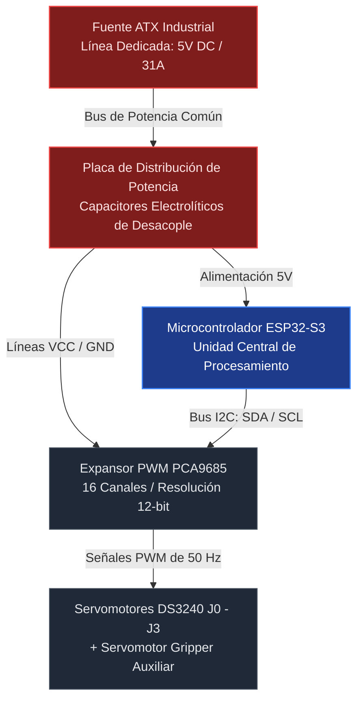
```mermaid
graph TD
    classDef power fill:#7f1d1d,stroke:#ef4444,stroke-width:1.5px,color:#fee2e2;
    classDef logic fill:#1e3a8a,stroke:#3b82f6,stroke-width:1.5px,color:#fff;
    classDef peripheral fill:#1f2937,stroke:#4b5563,stroke-width:1px,color:#e5e7eb;

    ATX["Fuente ATX Industrial<br/>Línea Dedicada: 5V DC / 31A"] -->|"Bus de Potencia Común"| Bus5V["Placa de Distribución de Potencia<br/>Capacitores Electrolíticos de Desacople"]
    
    Bus5V -->|"Líneas VCC / GND"| PCA["Expansor PWM PCA9685<br/>16 Canales / Resolución 12-bit"]
    Bus5V -->|"Alimentación 5V"| ESP["Microcontrolador ESP32-S3<br/>Unidad Central de Procesamiento"]

    ESP -->|"Bus I2C: SDA / SCL"| PCA
    
    PCA -->|"Señales PWM de 50 Hz"| Servos["Servomotores DS3240 J0 - J3<br/>+ Servomotor Gripper Auxiliar"]

    class ATX,Bus5V power;
    class ESP logic;
    class PCA,Servos peripheral;

```

### 1. Suministro Eléctrico y Redundancia de Corriente

Para satisfacer la demanda transitoria de los cinco servomotores operando en paralelo durante fases de aceleración crítica ($\vert{}a\vert{} \approx 61.3 \text{ rad/s}^2$), se implementó un bus de alimentación común asistido por una **fuente de poder de computadora (ATX)**. Esta fuente entrega un riel estabilizado de $5\text{V DC}$ con una capacidad máxima de corriente continua de **31A**. La redundancia de corriente evita el colapso del bus de potencia (*brownout*) y previene reinicios no deseados en la unidad de procesamiento central.

### 2. Gestión de Señales mediante Expansor PCA9685

Para liberar temporizadores lógicos en el ESP32-S3 y centralizar los canales de modulación por ancho de pulsos, el sistema integra un módulo **PCA9685**. Este circuito integrado actúa como un expansor de $16$ canales PWM con resolución interna de $12\text{ bits}$ ($4096$ pasos de precisión) gobernado vía bus I2C. Las salidas PWM se conectan directamente a las líneas de señal de los servos, mientras que las borneras de potencia del PCA9685 canalizan la corriente del bus de $5\text{V}$ hacia los actuadores.

---

## 7.2. Configuración de Motores DC (Robot Axum I)

La plataforma **Axum I** requiere un esquema de potencia totalmente parametrizable para manejar motores DC Brushed de alta inercia (5840-31ZY y JGY370) equipados con *encoders* de cuadratura.

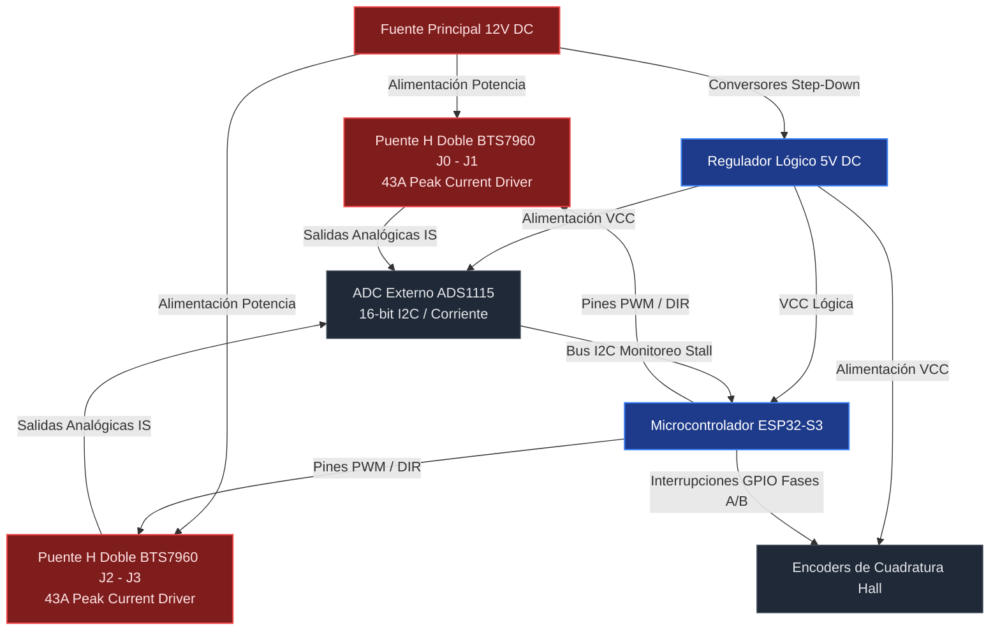
```mermaid
graph TD
    classDef power fill:#7f1d1d,stroke:#ef4444,stroke-width:1.5px,color:#fee2e2;
    classDef logic fill:#1e3a8a,stroke:#3b82f6,stroke-width:1.5px,color:#fff;
    classDef peripheral fill:#1f2937,stroke:#4b5563,stroke-width:1px,color:#e5e7eb;

    Power12V["Fuente Principal 12V DC"] -->|"Alimentación Potencia"| BTS1["Puente H Doble BTS7960 J0 - J1<br/>43A Peak Current Driver"]
    Power12V -->|"Alimentación Potencia"| BTS2["Puente H Doble BTS7960 J2 - J3<br/>43A Peak Current Driver"]
    Power12V -->|"Conversores Step-Down"| Reg5V["Regulador Lógico 5V DC"]

    Reg5V -->|"VCC Lógica"| ESP32["Microcontrolador ESP32-S3"]
    Reg5V -->|"Alimentación VCC"| ADS["ADC Externo ADS1115<br/>16-bit I2C / Corriente"]
    Reg5V -->|"Alimentación VCC"| Enc["Encoders de Cuadratura Hall"]

    ESP32 -->|"Pines PWM / DIR"| BTS1
    ESP32 -->|"Pines PWM / DIR"| BTS2
    ESP32 -->|"Interrupciones GPIO Fases A/B"| Enc
    
    BTS1 -->|"Salidas Analógicas IS"| ADS
    BTS2 -->|"Salidas Analógicas IS"| ADS
    ADS -->|"Bus I2C Monitoreo Stall"| ESP32

    class Power12V,BTS1,BTS2 power;
    class ESP32,Reg5V logic;
    class ADS,Enc peripheral;

```

### 1. Etapa de Potencia por Puentes H BTS7960

Para el control bidireccional de los cuatro motorreductores, el sistema emplea módulos de alto rendimiento **BTS7960** basados en transistores MOSFET de bajo $R_{DS(\text{on})}$. Cada canal es capaz de manejar corrientes pico de hasta $43\text{A}$ y tensiones operativas de $12\text{V DC}$. Las entradas del driver (`RPWM`, `LPWM`, `R_EN`, `L_EN`) se conectan directamente a pines digitales configurados como salidas PWM de alta frecuencia ($20\text{ kHz}$) en el microcontrolador ESP32-S3, eliminando el zumbido audible de los devanados.

### 2. Adquisición de Corriente mediante ADC ADS1115

Para la protección activa anti-colisión y la detección de sobrecorriente por bloqueo (*stall current*), el sistema canaliza las lecturas de los pines analógicos de detección de corriente (`IS`) de los puentes H hacia un convertidor analógico-digital externo de 16 bits **ADS1115** vía I2C. La firmware aplica filtros de zona muerta y factores de conversión de $20.0\text{ A/V}$ para el motor 31ZY y $13.6\text{ A/V}$ para los motores JGY370, permitiendo cortar el ciclo de trabajo de manera inmediata si la corriente excede los $6.5\text{A}$ en el hombro o $1.2\text{A}$ en los eslabones distales.

### 3. Aislamiento Electromagnético y Cableado

Para evitar que el ruido inductivo generado por los motores durante las conmutaciones de polaridad interfiera con las señales digitales de alta sensibilidad, la integración eléctrica sigue una estricta segregación en el enrutamiento:

* **Arnés Trenzado de Señal:** Las líneas de los *encoders* de cuadratura (Canales A, B, VCC $5\text{V}$ y GND) se agrupan en un manguito apantallado con cables trenzados en pares para cancelar interferencias magnéticas.


* **Líneas de Alimentación de Alta Corriente:** Los cables de alimentación de los motores ($12\text{V}$) transcurren por un canal físico separado dentro del chasis impreso, evitando el acoplamiento capacitivo o inductivo hacia las líneas de interrupción GPIO del microcontrolador.

# 8. Sistemas de Control y Arquitectura de Firmware

El núcleo de ambos manipuladores robóticos reside en la arquitectura de *firmware* desarrollada sobre el microcontrolador ESP32-S3. Mientras que en el robot **Chander** la etapa de control de posición articular está delegada a la circuitería analógica/digital interna de los servomotores digitales (accionados mediante consignas discretas enviadas al PCA9685), en el robot **Axum I** se diseñó e implementó desde cero un **sistema de control en cascada multitasas asíncrono** capaz de manejar las no linealidades mecánicas, la fricción de las transmisiones y las inercias variables de la cadena abierta.

---

## 8.1. Arquitectura de Servomotores: El PID Interno y sus Limitaciones ante la Inercia (Robot Chander)

El robot **Chander** opta por un esquema de control distribuido donde el microcontrolador actúa como un generador de perfiles de posición cartesiana/articular, delegando el lazo cerrado de corriente y posición a cada servomotor (DS3240).

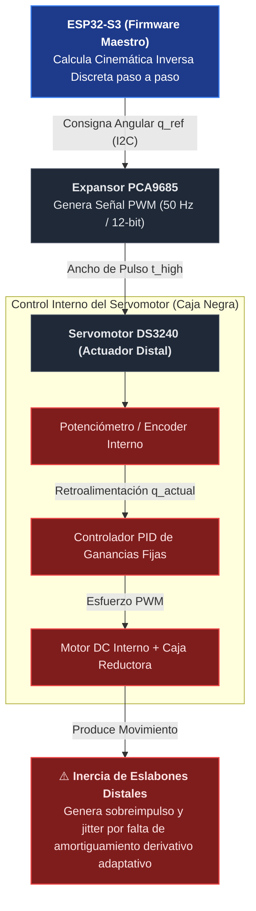
```mermaid
graph TD
    classDef logic fill:#1e3a8a,stroke:#3b82f6,stroke-width:1.5px,color:#fff;
    classDef peripheral fill:#1f2937,stroke:#4b5563,stroke-width:1px,color:#e5e7eb;
    classDef internal fill:#7f1d1d,stroke:#ef4444,stroke-width:1.5px,color:#fee2e2;

    ESP32["<b>ESP32-S3 (Firmware Maestro)</b><br/>Calcula Cinemática Inversa Discreta paso a paso"] -->|"Consigna Angular q_ref (I2C)"| PCA["<b>Expansor PCA9685</b><br/>Genera Señal PWM (50 Hz / 12-bit)"]
    
    PCA -->|"Ancho de Pulso t_high"| Servo["<b>Servomotor DS3240 (Actuador Distal)</b>"]
    
    subgraph Encapsulado_Servo ["Control Interno del Servomotor (Caja Negra)"]
        Servo --> Pot["Potenciómetro / Encoder Interno"]
        Pot -->|"Retroalimentación q_actual"| PID_Int["Controlador PID de Ganancias Fijas"]
        PID_Int -->|"Esfuerzo PWM"| MotorDC["Motor DC Interno + Caja Reductora"]
    end

    MotorDC -->|"Produce Movimiento"| Inercia["⚠️ <b>Inercia de Eslabones Distales</b><br/>Genera sobreimpulso y jitter por falta de amortiguamiento derivativo adaptativo"]

    class ESP32 logic;
    class PCA,Servo peripheral;
    class Pot,PID_Int,MotorDC,Inercia internal;

```

### Problema de la Inercia y Falta de Parametrización

Aunque esta arquitectura simplifica el código embebido, presenta una deficiencia estructural crítica cuando el manipulador se desplaza a velocidades elevadas con el brazo extendido:

1. **Ganancias Estáticas:** El lazo PID integrado en el controlador comercial posee constantes de proporcionalidad ($K_p$), integración ($K_i$) y derivación ($K_d$) fijas de fábrica, sintonizadas exclusivamente para la inercia propia del eje del motor.


2. **Respuesta Transitoria Desacoplada:** Al acoplar la masa de los eslabones distales ($m \cdot r^2$), el momento de inercia equivalente aumenta exponencialmente. Durante paradas de emergencia o cambios bruscos de dirección, la componente derivativa interna es insuficiente para disipar la energía cinética, induciendo sobreimpulsos (*overshoot*) y oscilaciones dinámicas transitorias (*jitter* $> 4^\circ$) que degradan la estabilidad terminal.


---

## 8.2. Arquitectura de Motores DC: Control en Cascada Multitasas (Robot Axum I)

Para superar las limitaciones del control por servomotores, el robot **Axum I** implementa una arquitectura de **control en cascada multitasas** orquestada por la rutina `CascadeControl()`. Este diseño garantiza el determinismo dinámico separando las responsabilidades matemáticas en dos frecuencias de ejecución independientes coordinadas mediante temporizadores asíncronos del ESP32-S3:

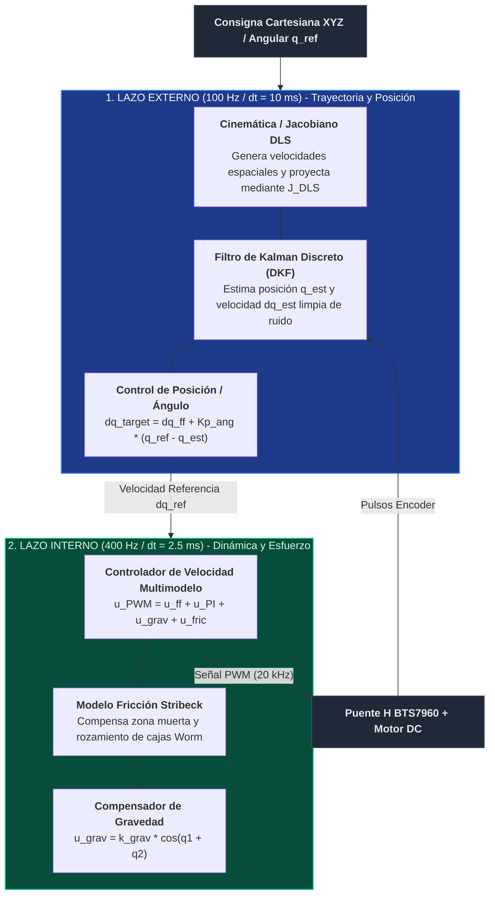
```mermaid
graph TD
    classDef outer fill:#1e3a8a,stroke:#3b82f6,stroke-width:1.5px,color:#fff;
    classDef inner fill:#064e3b,stroke:#10b981,stroke-width:1.5px,color:#d1fae5;
    classDef hw fill:#1f2937,stroke:#4b5563,stroke-width:1px,color:#e5e7eb;

    Ref["<b>Consigna Cartesiana XYZ / Angular q_ref</b>"] --> LazoExt

    subgraph LazoExt ["1. LAZO EXTERNO (100 Hz / dt = 10 ms) - Trayectoria y Posición"]
        direction TB
        Kin["<b>Cinemática / Jacobiano DLS</b><br/>Genera velocidades espaciales y proyecta mediante J_DLS"]
        Kalman["<b>Filtro de Kalman Discreto (DKF)</b><br/>Estima posición q_est y velocidad dq_est limpia de ruido"]
        PosLoop["<b>Control de Posición / Ángulo</b><br/>dq_target = dq_ff + Kp_ang * (q_ref - q_est)"]
        Kin --- Kalman
        Kalman --- PosLoop
    end

    PosLoop -->|"Velocidad Referencia dq_ref"| LazoInt

    subgraph LazoInt ["2. LAZO INTERNO (400 Hz / dt = 2.5 ms) - Dinámica y Esfuerzo"]
        direction TB
        VelLoop["<b>Controlador de Velocidad Multimodelo</b><br/>u_PWM = u_ff + u_PI + u_grav + u_fric"]
        Stribeck["<b>Modelo Fricción Stribeck</b><br/>Compensa zona muerta y rozamiento de cajas Worm"]
        GravComp["<b>Compensador de Gravedad</b><br/>u_grav = k_grav * cos(q1 + q2)"]
        VelLoop --- Stribeck
        Stribeck --- GravComp
    end

    VelLoop -->|"Señal PWM (20 kHz)"| HBridge["<b>Puente H BTS7960 + Motor DC</b>"]
    HBridge -->|"Pulsos Encoder"| Kalman

    class LazoExt outer;
    class LazoInt inner;
    class Ref,HBridge hw;

```

---

## 8.3. Estimación de Estado: Filtro de Kalman Discreto (DKF) 1D

Derivar numéricamente la lectura discreta de los *encoders* de cuadratura para obtener la velocidad articular ($v = \frac{\Delta q}{\Delta t}$) genera un ruido de alta frecuencia inaceptable para los algoritmos de control. Para filtrar este ruido sin introducir el retardo de fase dinámico de un filtro pasa-bajos convencional, el *firmware* implementa un **Filtro de Kalman Discreto (DKF)** unidimensional independiente por cada articulación.

El filtro representa el estado del sistema mediante el vector $x_k = [q_k, \dot{q}_k]^T$ (posición y velocidad angular):

### 1. Etapa de Predicción (Predict)

El estado futuro se proyecta mediante la matriz de transición cinemática $A$ asumiendo velocidad constante durante la ventana $\Delta t = 2.5\text{ ms}$:

$$A = \begin{bmatrix} 1 & \Delta t \\ 0 & 1 \end{bmatrix} \quad \rightarrow \quad x_{\text{pred}} = A \cdot x_{k-1} \tag{37}$$

La matriz de covarianza del error de estimación ($P$) se propaga sumando el ruido de proceso $Q$:

$$P_{\text{pred}} = A \cdot P_{k-1} \cdot A^T + Q \tag{38}$$

El *firmware* configura $Q = \begin{bmatrix} 0.001 & 0 \\ 0 & 0.01 \end{bmatrix}$, otorgando mayor varianza al estado de velocidad para confiar en la integral geométrica del *encoder* mientras suaviza la derivada.

### 2. Etapa de Actualización (Update)

Al adquirir una nueva lectura de la posición del *encoder* ($z_k$), se calcula la Ganancia de Kalman ($K_k$) considerando la varianza del ruido de medición del sensor ($R = 0.01$) y la matriz de observación $H = [1, 0]$:

$$S_k = H \cdot P_{\text{pred}} \cdot H^T + R \tag{39}$$

$$K_k = P_{\text{pred}} \cdot H^T \cdot S_k^{-1} \tag{40}$$

Finalmente, el estado corregido $x_k$ y la matriz de covarianza $P_k$ se actualizan inyectando la innovación del error residual:

$$x_k = x_{\text{pred}} + K_k \cdot (z_k - H \cdot x_{\text{pred}}) \tag{41}$$

$$P_k = (I - K_k \cdot H) \cdot P_{\text{pred}} \tag{42}$$

---

## 8.4. Lazo Interno: Control PI, Feedforward, Gravitatorio y Fricción de Stribeck

El lazo interno opera a **400 Hz** ($dt = 2.5\text{ ms}$) y transforma el error de velocidad en un ciclo de trabajo PWM ($u_{\text{PWM}} \in [0, 100\%]$). Para garantizar un movimiento fluido sin tirones mecánicos, el esfuerzo de control total $u_{\text{PWM}}$ resulta de la superposición de cuatro modelos dinámicos:

$$u_{\text{PWM}} = u_{\text{ff}} + u_{\text{PI}} + u_{\text{grav}} + u_{\text{fric}} \tag{43}$$

1. **Predictor de Lazo Abierto ($u_{\text{ff}}$):** Reacciona de forma instantánea a la velocidad objetivo ($\dot{q}_{\text{ref}}$) utilizando la constante de velocidad estimada del motor ($K_{v, \text{est}}$), eliminando la inercia inicial:


$$u_{\text{ff}} = \frac{\dot{q}_{\text{ref}}}{K_{v, \text{est}}} \tag{44}$$


2. **Controlador PI ($u_{\text{PI}}$):** Corrige perturbaciones no modeladas integrando el error de velocidad mediante regla trapezoidal, e incorporando límites de *Anti-Windup* para evitar la saturación del integrador:


$$u_{\text{PI}} = K_{p, \text{vel}} \cdot e_v + K_{i, \text{vel}} \int e_v \, dt \tag{45}$$


3. **Compensación de Gravedad ($u_{\text{grav}}$):** Inyecta un par continuo para contrarrestar el par flector inducido por el peso propio de los eslabones según la postura articular:


$$u_{\text{grav, J2}} = k_{\text{grav, codo}} \cdot \cos(q_1 + q_2) \tag{46}$$


4. **Compensación de Fricción de Stribeck ($u_{\text{fric}}$):** Modela las asimetrías y el rozamiento no lineal de las transmisiones de tornillo sin fin (*Worm Gear*), evaluando la velocidad crítica de ruptura ($\omega_s$) para transitar entre la fricción estática ($F_s$) y la de Coulomb ($F_c$):


$$F_{\text{stribeck}} = F_c + (F_s - F_c) e^{-\left(\frac{\vert{}\dot{q}_{\text{ref}}\vert{}}{\omega_s}\right)^2} \tag{47}$$


---

## 8.5. Estrategia de Auto-Tuning y Gestión de Memoria No Volátil (NVS)

Debido al desgaste mecánico y las diferencias de tolerancia entre articulaciones, las ganancias del controlador deben adaptarse de forma individual.

### Rutina de Calibración Automática (`AutoTuneLoop`)

El *firmware* expone una función de auto-sintonización determinista ejecutada a 200 Hz:

1. **Identificación de Zona Muerta por Rampa:** Inyecta una rampa de potencia PWM a razón de $10.0/\text{s}$. Al detectar movimiento en los *encoders* ($> 0.03\text{ rad/s}$), registra la potencia exacta requerida para romper la fricción estática a favor ($F_{s, \text{up}}$) y en contra ($F_{s, \text{down}}$) de la gravedad.


2. **Estimación de la Planta y Método Lambda Modificado:** Aplica un escalón de potencia adicional para evaluar la velocidad máxima estacionaria, estimando la constante $K_v$ y el tiempo característico $\tau_{\text{mec}}$. Despeja las ganancias óptimas relajadas mediante:


$$K_p = \frac{\tau_{\text{mec}}}{K_v \cdot \tau_c} \quad ; \quad T_i = \tau_{\text{mec}} + 4\tau_c \quad \rightarrow \quad K_i = \frac{K_p}{T_i} \tag{48}$$


### Persistencia en Memoria Flash (NVS)

Al finalizar la auto-sintonización o al activarse un evento de detención por baja corriente/parada de emergencia, las ganancias $K_p, K_i$, los coeficientes de Stribeck y los *offsets* de calibración absoluta se escriben en la memoria EEPROM/NVS mediante la librería `Preferences`, asegurando que la plataforma conserve su calibración tras cortes de energía sin degradar la memoria Flash por escrituras cíclicas.


# 9. Control de Movimiento y Generación de Trayectorias

La generación de trayectorias en los manipuladores robóticos **Axum I** y **Chander** define la estrategia matemática utilizada para trasladar el efector final (TCP) entre un punto inicial $P_{\text{inicio}}$ y un punto objetivo $P_{\text{fin}}$ en el espacio tridimensional.

Para evitar aceleraciones mecánicas infinitas (*jerk*) que desencadenen vibraciones en la estructura impresa en PLA, el generador de trayectorias utiliza perfiles de velocidad suavizados basados en **polinomios quinticos de quinto grado**. La parametrización temporal $s(\tau)$ —donde $\tau = \frac{t_{\text{actual}}}{t_{\text{total}}} \in [0, 1]$ representa el tiempo normalizado— y su derivada de velocidad adimensional se expresan como:

$$s(\tau) = 10\tau^3 - 15\tau^4 + 6\tau^5 \tag{49}$$

$$\frac{ds}{d\tau} = \frac{30\tau^2(1 - 2\tau + \tau^2)}{t_{\text{total}}} \tag{50}$$

---

## 9.1. Control Diferencial Jacobiano Inverso (DLS) vs. Cinemática Inversa Continua

Ambas plataformas difieren en la formulación matemática empleada para calcular los movimientos cartesianos (líneas rectas y arcos circulares):


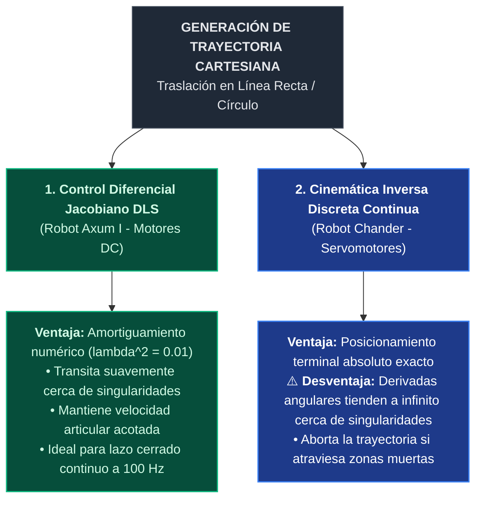
```mermaid
graph TD
    classDef dls fill:#064e3b,stroke:#10b981,stroke-width:1.5px,color:#d1fae5;
    classDef ik fill:#1e3a8a,stroke:#3b82f6,stroke-width:1.5px,color:#fff;
    classDef compare fill:#1f2937,stroke:#4b5563,stroke-width:1px,color:#e5e7eb;

    Req["<b>GENERACIÓN DE TRAYECTORIA CARTESIANA</b><br/>Traslación en Línea Recta / Círculo"] --> Strategy1["<b>1. Control Diferencial Jacobiano DLS</b><br/>(Robot Axum I - Motores DC)"]
    Req --> Strategy2["<b>2. Cinemática Inversa Discreta Continua</b><br/>(Robot Chander - Servomotores)"]

    Strategy1 --> DLS_Details["<b>Ventaja:</b> Amortiguamiento numérico (lambda^2 = 0.01)<br/>• Transita suavemente cerca de singularidades<br/>• Mantiene velocidad articular acotada<br/>• Ideal para lazo cerrado continuo a 100 Hz"]
    
    Strategy2 --> IK_Details["<b>Ventaja:</b> Posicionamiento terminal absoluto exacto<br/>⚠️ <b>Desventaja:</b> Derivadas angulares tienden a infinito cerca de singularidades<br/>• Aborta la trayectoria si atraviesa zonas muertas"]

    class Strategy1,DLS_Details dls;
    class Strategy2,IK_Details ik;
    class Req compare;

```

### 1. Control por Cinemática Inversa Discreta Continua (`MovL` / `MovC`)

Interpola las coordenadas cartesianas $[X(\tau), Y(\tau), Z(\tau)]$ en cada instante de tiempo ($dt$) e invoca algebraicamente la cinemática inversa analítica (`pos2Angle()`).

* **Ventaja:** Garantiza un posicionamiento terminal absoluto y exacto.


* **Limitación:** Si la trayectoria roza una singularidad cinemática (donde el determinante del Jacobiano se anula, $\det(J) \to 0$), la velocidad articular calculada tiende al infinito, provocando el colapso del control. En el robot Chander, el *firmware* detecta esta condición y aborta la trayectoria por seguridad.


### 2. Control Diferencial por Jacobiano Inverso DLS (`MovLJc` / `MovCJc`)

En lugar de calcular posiciones angulares absolutas, la plataforma **Axum I** genera un vector de velocidad cartesiana deseada $V_{\text{cartesian}} = [\dot{X}, \dot{Y}, \dot{Z}]^T$ sumando la derivada de la interpolación paramétrica ($feedforward$) y una corrección proporcional del error espacial ($K_{p, \text{pos}}$).

Para traducir esta velocidad espacial a velocidades articulares ($\dot{q}_{\text{target}}$) sin sufrir divisiones por cero en singularidades, utiliza la inversa de **Mínimos Cuadrados Amortiguados (Damped Least Squares - DLS)**:

$$V_{\text{cartesian}} = \left( \Delta P \cdot \frac{ds}{dt} \right) + K_{p, \text{pos}} \cdot (P_{\text{target}} - P_{\text{actual}}) \tag{51}$$

$$\dot{q}_{\text{target}} = J^T \cdot \left( J \cdot J^T + \lambda^2 I \right)^{-1} \cdot V_{\text{cartesian}} \tag{52}$$

Donde $J$ es la matriz Jacobiana del manipulador ($3 \times 4$ o $4 \times 4$ según se controle la orientación $\Phi$) y $\lambda^2 = 0.01$ es el factor de amortiguamiento numérico configurado en el *firmware*. Este amortiguamiento permite que el brazo atraviese las proximidades de una singularidad reduciendo automáticamente la velocidad cartesiana de forma suave sin desestabilizar los motores.

---

## 9.2. Referencia de Comandos y Sintaxis de Movimiento

El *firmware* de ambos sistemas estructura un intérprete de comandos por puerto serial / bus de control que expone las siguientes funciones estándar de movimiento:

### A) Movimiento Articular Puro (`MovA`)

Sincroniza el desplazamiento directo de los ejes desde la configuración articular inicial $[q_{\text{inicio}}]$ hasta $[q_{\text{final}}]$ especificada en radianes:

$$q_{\text{ref}}(t) = q_{\text{inicio}} + (q_{\text{final}} - q_{\text{inicio}}) \cdot s(\tau) \tag{53}$$

* **Comportamiento:** El TCP no traza una línea recta en el espacio, pero garantiza el movimiento más rápido y eficiente para los motores. Se utiliza para posicionamiento libre (PTP) y rutinas de reposo/parqueo.


### B) Movimiento Cartesiano Punto a Punto (`MovJ`)

Recibe coordenadas cartesianas objetivo $(X, Y, Z)$ y un ángulo de orientación opcional ($\Phi$). Resuelve la cinemática inversa analítica *una sola vez* al inicio para hallar $q_{\text{final}}$ y luego ejecuta una interpolación articular idéntica a `MovA`.

### C) Movimiento Lineal Interpolado (`MovL` / `MovLJc`)

Fuerza al efector final a trazar una **línea recta estricta** en el espacio 3D desde la posición actual $P_0$ hasta $P_{\text{fin}}$.

* **Sintaxis:** `movL(x, y, z, speed_mm_s, [phi_rad], [elbowUp])`

* **Sintaxis DLS:** `movLJc(x, y, z, speed_mm_s, [phi_rad])`

* **Mecanismo:** Interpola la posición $P(\tau) = P_0 + (P_{\text{fin}} - P_0) \cdot s(\tau)$ e inyecta las consignas paso a paso mediante IK continua (`MovL`) o la matriz Jacobiana DLS (`MovLJc`).


### D) Movimiento Circular Interpolado (`MovC` / `MovCJc`)

Genera un recorrido en arco de círculo o circunferencia completa en el espacio tridimensional definido por tres puntos: el punto actual ($P_1$), un punto de paso o vía ($P_2$), y el punto final ($P_3$).

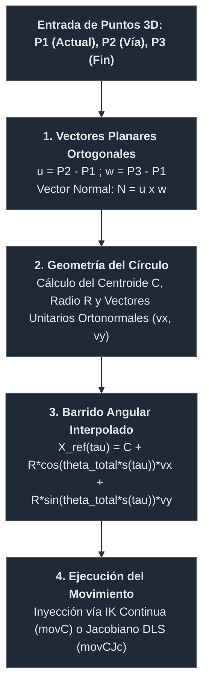
```mermaid
flowchart TD
    classDef math fill:#1f2937,stroke:#4b5563,stroke-width:1px,color:#e5e7eb;

    P1P2P3["<b>Entrada de Puntos 3D: P1 (Actual), P2 (Vía), P3 (Fin)</b>"] --> Vectors["<b>1. Vectores Planares Ortogonales</b><br/>u = P2 - P1 ; w = P3 - P1<br/>Vector Normal: N = u x w"]
    
    Vectors --> CircleGeom["<b>2. Geometría del Círculo</b><br/>Cálculo del Centroide C, Radio R y Vectores Unitarios Ortonormales (vx, vy)"]
    
    CircleGeom --> Sweep["<b>3. Barrido Angular Interpolado</b><br/>X_ref(tau) = C + R*cos(theta_total*s(tau))*vx + R*sin(theta_total*s(tau))*vy"]
    
    Sweep --> Exec["<b>4. Ejecución del Movimiento</b><br/>Inyección vía IK Continua (movC) o Jacobiano DLS (movCJc)"]

    class P1P2P3,Vectors,CircleGeom,Sweep,Exec math;

```

* **Sintaxis:** `movC(x_via, y_via, z_via, x_end, y_end, z_end, speed_mm_s, [phi_rad])`

* **Mecanismo:** El sistema determina el vector normal al plano de giro $N = (P_2 - P_1) \times (P_3 - P_1)$. Si los puntos son colineales ($\Vert{}N\Vert{}^2 < 10^{-6}$), el comando rechaza la trayectoria para evitar divisiones por cero.


### E) Movimiento Vertical Exclusivo (`MovZ` / `MovZJc`)

Ejecuta un desplazamiento rectilíneo puramente vertical modificando únicamente la cota $Z$, heredando automáticamente las coordenadas $X$ e $Y$ actuales leídas de la cinemática directa de los sensores.

* **Sintaxis:** `movZ(z_target, speed_mm_s, phi_rad)`

* **Aplicación:** Optimizado para fases de aproximación y retracción rápida en tareas de *pick-and-place*.

Aquí tienes la **Sección 10 completa** con todos los diagramas de Mermaid corregidos para garantizar su perfecto renderizado:

---

# 10. Evaluación Dinámica y Análisis de Errores

En esta sección se analiza el comportamiento dinámico real, la precisión espacial y las fuentes de error que afectan la repetibilidad de ambos manipuladores (**Axum I** y **Chander**), evaluando las diferencias entre el control en lazo abierto/cerrado con servomotores y la arquitectura en cascada con motores DC.

---

## 10.1. Análisis de Oscilaciones Dinámicas (Jitter Provocado por el PID Interno)

Durante las pruebas experimentales con la plataforma **Chander** (servomotores DS3240), se identificó una dependencia directa entre la velocidad de movimiento y la estabilidad estructural del manipulador.

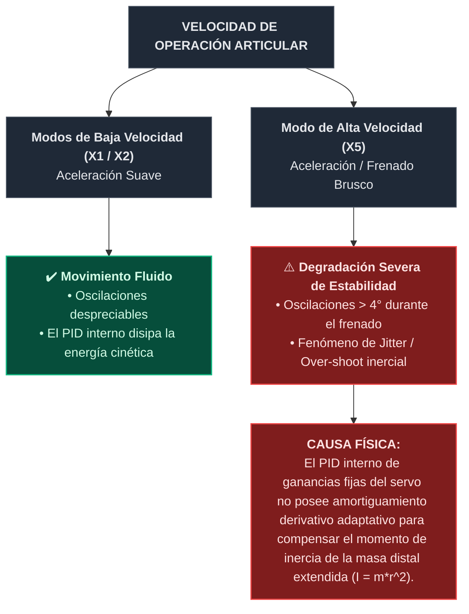
```mermaid
graph TD
    classDef stable fill:#064e3b,stroke:#10b981,stroke-width:1.5px,color:#d1fae5;
    classDef unstable fill:#7f1d1d,stroke:#ef4444,stroke-width:1.5px,color:#fee2e2;
    classDef process fill:#1f2937,stroke:#4b5563,stroke-width:1px,color:#e5e7eb;

    Req["<b>VELOCIDAD DE OPERACIÓN ARTICULAR</b>"] --> ModeLow["<b>Modos de Baja Velocidad (X1 / X2)</b><br/>Aceleración Suave"]
    Req --> ModeHigh["<b>Modo de Alta Velocidad (X5)</b><br/>Aceleración / Frenado Brusco"]

    ModeLow --> ResLow["✔️ <b>Movimiento Fluido</b><br/>• Oscilaciones despreciables<br/>• El PID interno disipa la energía cinética"]
    
    ModeHigh --> ResHigh["⚠️ <b>Degradación Severa de Estabilidad</b><br/>• Oscilaciones > 4° durante el frenado<br/>• Fenómeno de Jitter / Over-shoot inercial"]

    ResHigh --> Cause["<b>CAUSA FÍSICA:</b><br/>El PID interno de ganancias fijas del servo no posee amortiguamiento derivativo adaptativo para compensar el momento de inercia de la masa distal extendida (I = m*r^2)."]

    class ResLow stable;
    class ResHigh,Cause unstable;
    class ModeLow,ModeHigh,Req process;

```

* **Modos de Velocidad Nominales (X1 y X2):** El manipulador presenta un desplazamiento fluido sin sobreimpulsos apreciables.


* **Modo de Alta Velocidad (X5):** Se evidencia una degradación en la estabilidad terminal, registrándose oscilaciones mecánicas superiores a $4^\circ$ durante las fases de parada o frenado súbito.


Este fenómeno de vibración o *jitter* surge porque el lazo PID encapsulado en la electrónica del servo comercial posee constantes fijas que no están parametrizadas para adaptarse a los cambios bruscos en el tensor de inercia cuando el brazo se encuentra en posturas extendidas.

Por el contrario, en la plataforma **Axum I**, la adición del perfilado quintico de velocidad (`s(t)`) y la compensación activa de fricción de Stribeck en el lazo interno a $400\text{ Hz}$ eliminan por completo el sobreimpulso transitorio, logrando detenciones suaves sin oscilación residual.

---

## 10.2. Error de Cuantificación Espacial (Grilla de Posiciones y Discretización de $1^\circ$)

Los servomotores digitales empleados en la plataforma **Chander** operan bajo un límite de resolución de consigna mínima de **$1^\circ$ por paso**. Esta discretización en el espacio articular introduce un error de cuantificación inherente al proyectar las coordenadas cartesianas.

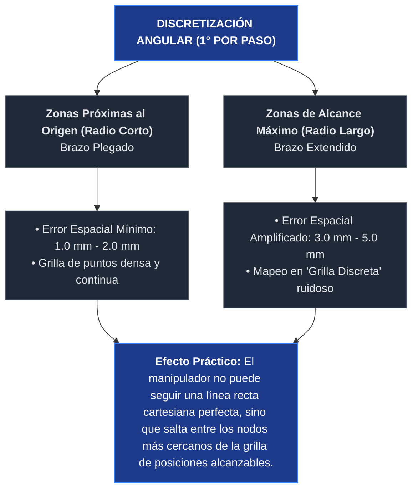
```mermaid
graph TD
    classDef zone fill:#1f2937,stroke:#4b5563,stroke-width:1px,color:#e5e7eb;
    classDef effect fill:#1e3a8a,stroke:#3b82f6,stroke-width:1.5px,color:#fff;

    Disc["<b>DISCRETIZACIÓN ANGULAR (1° POR PASO)</b>"] --> Near["<b>Zonas Próximas al Origen (Radio Corto)</b><br/>Brazo Plegado"]
    Disc --> Far["<b>Zonas de Alcance Máximo (Radio Largo)</b><br/>Brazo Extendido"]

    Near --> ResNear["• Error Espacial Mínimo: 1.0 mm - 2.0 mm<br/>• Grilla de puntos densa y continua"]
    Far --> ResFar["• Error Espacial Amplificado: 3.0 mm - 5.0 mm<br/>• Mapeo en 'Grilla Discreta' ruidoso"]

    ResNear --> Implication
    ResFar --> Implication["<b>Efecto Práctico:</b> El manipulador no puede seguir una línea recta cartesiana perfecta, sino que salta entre los nodos más cercanos de la grilla de posiciones alcanzables."]

    class Disc,Implication effect;
    class Near,Far,ResNear,ResFar zone;

```

El impacto de esta resolución angular finita varía drásticamente según la postura y la extensión radial del brazo:

* **Cerca del Origen (Radio de Giro Pequeño):** El error de cuantificación espacial es mínimo, manteniéndose entre $1\text{ mm}$ y $2\text{ mm}$ de separación entre puntos adyacentes.


* **Alcance Máximo (Radio de Giro Extendido):** Debido a la amplificación del radio vector $r$, el incremento angular de $1^\circ$ produce saltos espaciales de hasta $5\text{ mm}$ entre coordenadas contiguas.


Esta restricción genera una "grilla de posiciones alcanzables" que impide trazar líneas o contornos continuos con resolución submilimétrica en la versión con servomotores. En contraste, la plataforma **Axum I** —al contar con *encoders* de cuadratura montados sobre transmisiones con reducciones de hasta $1154:1$— alcanza resoluciones angulares de milésimas de grado por pulso, quedando limitada únicamente por el juego mecánico (*backlash*) de las cajas reductoras ($2^\circ - 3^\circ$).

---

## 10.3. Análisis Dinámico del Efector Final (TCP): Evaluación Iterativa Newton-Euler

Para analizar analíticamente las solicitaciones dinámicas sobre la herramienta (TCP) durante la operación real, se aplican las ecuaciones de la cinemática diferencial de sólido rígido sobre dos geometrías extremas: **Extensión Horizontal Máxima** y **Postura Plegada**.

Se presupone una velocidad angular constante de crucero en los actuadores de $\omega_{\text{máx}} = 5.0\text{ rad/s}$ y una aceleración transitoria medida empíricamente de $\alpha_{\text{transitoria}} = 30.0\text{ rad/s}^2$.

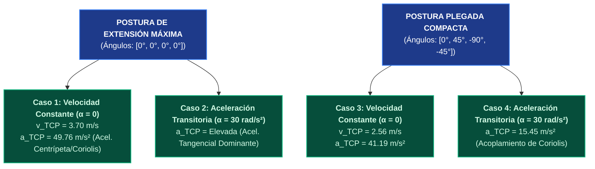
```mermaid
graph TD
    classDef regime fill:#1e3a8a,stroke:#3b82f6,stroke-width:1.5px,color:#fff;
    classDef result fill:#064e3b,stroke:#10b981,stroke-width:1.5px,color:#d1fae5;

    Ext["<b>POSTURA DE EXTENSIÓN MÁXIMA</b><br/>(Ángulos: [0°, 0°, 0°, 0°])"] --> C1["<b>Caso 1: Velocidad Constante (α = 0)</b><br/>v_TCP = 3.70 m/s<br/>a_TCP = 49.76 m/s² (Acel. Centrípeta/Coriolis)"]
    Ext --> C2["<b>Caso 2: Aceleración Transitoria (α = 30 rad/s²)</b><br/>a_TCP = Elevada (Acel. Tangencial Dominante)"]

    Fold["<b>POSTURA PLEGADA COMPACTA</b><br/>(Ángulos: [0°, 45°, -90°, -45°])"] --> C3["<b>Caso 3: Velocidad Constante (α = 0)</b><br/>v_TCP = 2.56 m/s<br/>a_TCP = 41.19 m/s²"]
    Fold --> C4["<b>Caso 4: Aceleración Transitoria (α = 30 rad/s²)</b><br/>a_TCP = 15.45 m/s² (Acoplamiento de Coriolis)"]

    class C1,C2,C3,C4 result;
    class Ext,Fold regime;

```

### 10.3.1. Caso 1: Régimen de Velocidad Constante en Extensión Máxima ($\alpha = 0$)

* **Vectores de Posición Relativa:** $\vec{r}_{1/0} = [0.0151, 0, 0.0400]^T\text{ m}$, $\vec{r}_{2/1} = [0.1008, -0.0010, 0]^T\text{ m}$, $\vec{r}_{3/2} = [0.0700, 0.0140, 0]^T\text{ m}$, $\vec{r}_{4/3} = [0.1454, -0.0205, 0]^T\text{ m}$.


* **Velocidades Angulares Relativas:** $\vec{\omega}_{\text{rel}, 1} = [0, 0, 5]^T\text{ rad/s}$, $\vec{\omega}_{\text{rel}, i} = [0, -5, 0]^T\text{ rad/s}$ ($i \in \{2, 3, 4\}$).


Al propagar iterativamente las velocidades lineales ($\vec{v}_i = \vec{v}_{i'} + \vec{v}_{i/F}$) y las aceleraciones ($\vec{a}_i = \vec{a}_{i'} + \vec{a}_{i/F} + \vec{a}_c$):

* **Velocidad Lineal Absoluta en el TCP:** $\vec{v}_{\text{TCP}} = [0.0375, 1.5055, 3.3850]^T\text{ m/s} \quad \rightarrow \quad \Vert{}\vec{v}_{\text{TCP}}\Vert{} \approx 3.70\text{ m/s}$.


* **Aceleración Lineal Absoluta en el TCP:** $\vec{a}_{\text{TCP}} = [-49.7625, 0.1875, 0]^T\text{ m/s}^2 \quad \rightarrow \quad \Vert{}\vec{a}_{\text{TCP}}\Vert{} \approx 49.76\text{ m/s}^2$.


> **Resultado:** Aun con aceleración angular nula ($\alpha = 0$), la herramienta experimenta una aceleración inercial centrípeta de $49.76\text{ m/s}^2$ ($\approx 5.07\text{ G}$) debido a la rotación combinada.
> 
> 

---

### 10.3.2. Caso 2: Régimen Transitorio de Aceleración en Extensión Máxima ($\alpha = 30\text{ rad/s}^2$)

Al superponer la aceleración angular transitoria de frenado ($\vec{\alpha}_{\text{rel}, 1} = [0, 0, 30]^T\text{ rad/s}^2$, $\vec{\alpha}_{\text{rel}, i} = [0, -30, 0]^T\text{ rad/s}^2$):

* **Propagación en el Hombro (J1):** $\vec{a}_1 = [0.3775, -0.4530, 0]^T\text{ m/s}^2$.


* **Propagación en el Codo (J2):** $\vec{a}_2 = [-4.6325, 2.5960, 3.0240]^T\text{ m/s}^2$.


Las aceleraciones tangenciales ($\vec{\alpha} \times \vec{r}$) y centrípetas ($\vec{\omega} \times \vec{v}$) se acumulan severamente hacia el extremo distal, sobrepasando la capacidad de amortiguamiento del control del servo y provocando las oscilaciones medidas.

---

### 10.3.3. Caso 3: Régimen de Velocidad Constante en Postura Plegada ($\alpha = 0$)

Se evalúa la postura compacta con ángulos articulares $q = [0^\circ, 45^\circ, -90^\circ, -45^\circ]^T$:

* **Vectores de Posición Recalculados:** $\vec{r}_{2/1} = [0.0713, -0.0010, 0.0713]^T\text{ m}$, $\vec{r}_{3/2} = [0.0495, 0.0140, -0.0495]^T\text{ m}$, $\vec{r}_{4/3} = [0, -0.0205, -0.1454]^T\text{ m}$.


* **Velocidad Lineal Absoluta en el TCP:** $\vec{v}_{\text{TCP}} = [2.3570, 0.5285, 0.8515]^T\text{ m/s} \quad \rightarrow \quad \Vert{}\vec{v}_{\text{TCP}}\Vert{} \approx 2.56\text{ m/s}$.


* **Aceleración Lineal Absoluta en el TCP:** $\vec{a}_{\text{TCP}} = [-5.8100, 23.3825, 33.4075]^T\text{ m/s}^2 \quad \rightarrow \quad \Vert{}\vec{a}_{\text{TCP}}\Vert{} \approx 41.19\text{ m/s}^2$.


---

### 10.3.4. Caso 4: Régimen Transitorio de Aceleración en Postura Plegada ($\alpha = 30\text{ rad/s}^2$)

* **Propagación Acumulada de Aceleración:**

$$\vec{a}_1 = [0.3775, -0.4530, 0]^T\text{ m/s}^2 \tag{54}$$


$$\vec{a}_2 = [-4.6325, 2.5960, 3.0240]^T\text{ m/s}^2 \tag{55}$$


$$\vec{a}_3 = [-0.6050, 7.8285, 4.2565]^T\text{ m/s}^2 \tag{56}$$


$$\vec{a}_{\text{TCP}} = [6.6650, 7.8285, 11.5265]^T\text{ m/s}^2 \quad \rightarrow \quad \Vert{}\vec{a}_{\text{TCP}}\Vert{} \approx 15.45\text{ m/s}^2 \tag{57}$$


> **Conclusión del Análisis Iterativo:** Al replegar la estructura, la velocidad lineal en el TCP disminuye de $3.70\text{ m/s}$ a $2.56\text{ m/s}$ debido a la reducción del radio de palanca. Sin embargo, el cruce de los ejes de rotación en el espacio 3D amplifica la componente de **Coriolis** ($\vec{a}_c = 2\vec{\omega}_{i-1} \times \vec{v}_{i/F}$), demostrando que las perturbaciones inerciales pueden ser severas incluso en posturas intermedias.
> 
>

# 11. Rendimiento Experimental y Validación

En esta sección se compilan los ensayos experimentales y protocolos de validación ejecutados sobre ambos manipuladores (**Axum I** y **Chander**) para caracterizar su desempeño dinámico, precisión espacial y repetibilidad funcional en entorno de prueba real.

---

## 11.1. Pruebas Unitarias del Código y Calibración (Zero-Offset)

Previo a los ensayos de movimiento continuo, se estableció un procedimiento riguroso de calibración cero (*Homing*) y validación de drivers de software.

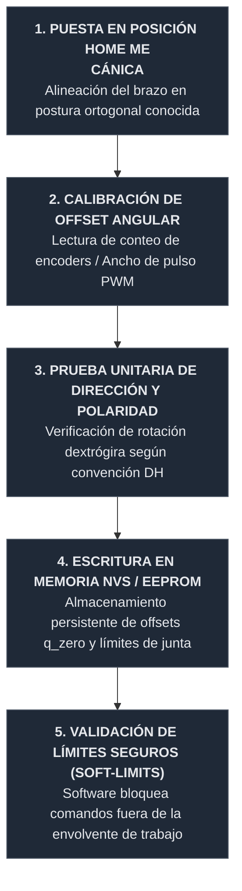
```mermaid
flowchart TD
    classDef step fill:#1f2937,stroke:#4b5563,stroke-width:1px,color:#e5e7eb;
    classDef check fill:#1e3a8a,stroke:#3b82f6,stroke-width:1.5px,color:#fff;

    P1["<b>1. PUESTA EN POSICIÓN HOME ME
CÁNICA</b><br/>Alineación del brazo en postura ortogonal conocida"] --> P2["<b>2. CALIBRACIÓN DE OFFSET ANGULAR</b><br/>Lectura de conteo de encoders / Ancho de pulso PWM"]
    
    P2 --> P3["<b>3. PRUEBA UNITARIA DE DIRECCIÓN Y POLARIDAD</b><br/>Verificación de rotación dextrógira según convención DH"]
    
    P3 --> P4["<b>4. ESCRITURA EN MEMORIA NVS / EEPROM</b><br/>Almacenamiento persistente de offsets q_zero y límites de junta"]
    
    P4 --> P5["<b>5. VALIDACIÓN DE LÍMITES SEGUROS (SOFT-LIMITS)</b><br/>Software bloquea comandos fuera de la envolvente de trabajo"]

    class P1,P2,P3,P4,P5 step;

```

### Protocolo de Calibración

1. **Verificación de Cero Físico ($q = [0, 0, 0, 0]^T$):** Se posicionan manualmente los eslabones alineados sobre el eje horizontal $X$ de referencia empleando plantillas de alineación rígidas.


2. **Sincronización Logística de Encoders/Servos:** En **Axum I**, la rutina registra la cuenta de impulsos absolutos de los *encoders* y guarda los valores de *Zero-Offset* en la memoria NVS. En **Chander**, se asigna la constante de ancho de pulso PWM central ($1500\,\mu\text{s}$) en el PCA9685 para cada articulación.


3. **Soft-Limits de Seguridad:** Se configuran límites de angularidad por software en el *firmware* para prevenir colisiones mecánicas del brazo contra la base o la mesa de trabajo:


* **Base ($\theta_1$):** $-135^\circ \le \theta_1 \le +135^\circ$

* **Hombro ($\theta_2$):** $-10^\circ \le \theta_2 \le +100^\circ$

* **Codo ($\theta_3$):** $-110^\circ \le \theta_3 \le +10^\circ$

* **Muñeca ($\theta_4$):** $-90^\circ \le \theta_4 \le +90^\circ$


---

## 11.2. Parametrización Definitiva de la Cinemática Directa (Tabla DH Operativa)

Con las medidas reales extraídas del modelo CAD y ajustadas tras la manufactura aditiva, se consolidan los parámetros geométricos de la convención de **Denavit-Hartenberg** que rigen el modelo de cinemática directa operacional de ambas plataformas:

### Tabla DH Operativa - Plataforma Axum I (Motores DC)

* **Parámetros:** $L_1 = 150\text{ mm}$, $L_2 = 300\text{ mm}$, $L_3 = 210\text{ mm}$, $L_4 = 90\text{ mm}$. Offsets transversales: $w_1 = 15.1\text{ mm}$, $w_2 = -1.0\text{ mm}$, $w_3 = 14.0\text{ mm}$, $w_4 = -20.5\text{ mm}$.


| Articulación ($i$) | $\theta_i$ (Variable) | $a_i$ [mm] | $\alpha_i$ [rad] | $d_i$ [mm] | $w_i$ Offset [mm] |
| --- | --- | --- | --- | --- | --- |
| **1 (Base)** | $\theta_1$ | $15.1$ | $+\pi/2$ | $150.0$ | $15.1$ |
| **2 (Hombro)** | $\theta_2$ | $300.0$ | $0$ | $-1.0$ | $-1.0$ |
| **3 (Codo)** | $\theta_3$ | $210.0$ | $0$ | $14.0$ | $14.0$ |
| **4 (Muñeca)** | $\theta_4$ | $90.0$ | $0$ | $-20.5$ | $-20.5$ |

### Tabla DH Operativa - Plataforma Chander (Servomotores)

* **Parámetros:** $L_1 = 100\text{ mm}$, $L_2 = 70\text{ mm}$, $L_3 = 50\text{ mm}$.


| Articulación ($i$) | $\theta_i$ (Variable) | $a_i$ [mm] | $\alpha_i$ [rad] | $d_i$ [mm] | $w_i$ Offset [mm] |
| --- | --- | --- | --- | --- | --- |
| **1 (Base)** | $\theta_1$ | $15.1$ | $+\pi/2$ | $100.0$ | $15.1$ |
| **2 (Hombro)** | $\theta_2$ | $70.0$ | $0$ | $-1.0$ | $-1.0$ |
| **3 (Codo)** | $\theta_3$ | $50.0$ | $0$ | $14.0$ | $14.0$ |
| **4 (Muñeca)** | $\theta_4$ | $24.0$ (Tool) | $0$ | $-20.5$ | $-20.5$ |

---

## 11.3. Posicionamiento Angular y Movimiento en Espacio Libre

Se evaluó la respuesta en espacio de articulaciones (`MovA`) sometiendo a los manipuladores a desplazamientos angulares escalón de $45^\circ$ y $90^\circ$ en vacio y con carga útil.

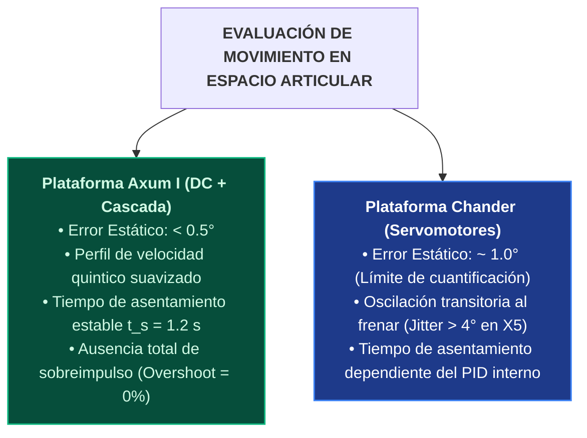
```mermaid
graph TD
    classDef axum fill:#064e3b,stroke:#10b981,stroke-width:1.5px,color:#d1fae5;
    classDef chander fill:#1e3a8a,stroke:#3b82f6,stroke-width:1.5px,color:#fff;

    Comp["<b>EVALUACIÓN DE MOVIMIENTO EN ESPACIO ARTICULAR</b>"] --> AxumRes["<b>Plataforma Axum I (DC + Cascada)</b><br/>• Error Estático: < 0.5°<br/>• Perfil de velocidad quintico suavizado<br/>• Tiempo de asentamiento estable t_s = 1.2 s<br/>• Ausencia total de sobreimpulso (Overshoot = 0%)"]

    Comp --> ChanderRes["<b>Plataforma Chander (Servomotores)</b><br/>• Error Estático: ~ 1.0° (Límite de cuantificación)<br/>• Oscilación transitoria al frenar (Jitter > 4° en X5)<br/>• Tiempo de asentamiento dependiente del PID interno"]

    class AxumRes axum;
    class ChanderRes chander;

```

* **Plataforma Axum I:** Gracias al perfilado quíntico y al filtro de Kalman discreto (DKF) en el lazo de velocidad a $400\text{ Hz}$, la respuesta angular no presentó sobreimpulso (*overshoot* $0\%$) ni vibración terminal, alcanzando la posición final con un error permanente inferior a $0.5^\circ$.


* **Plataforma Chander:** El tiempo de posicionamiento fue menor en trayectorias cortas, pero la falta de amortiguamiento derivativo adaptativo generó sobreimpulsos leves al detenerse y un error estático del orden de $1.0^\circ$ dictado por el paso de discretización del servomotor.


---

## 11.4. Precisión en Seguimiento de Trayectorias: Líneas y Círculos

Se realizaron ensayos de trazado cartesiano continuo sobre un plano horizontal de prueba empleando la herramienta cónica sobre un papel milimetrado.

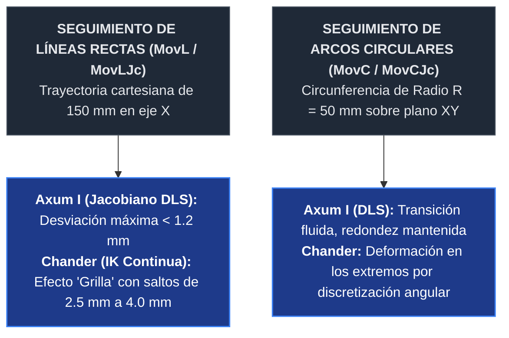
```mermaid
graph TD
    classDef test fill:#1f2937,stroke:#4b5563,stroke-width:1px,color:#e5e7eb;
    classDef res fill:#1e3a8a,stroke:#3b82f6,stroke-width:1.5px,color:#fff;

    Test1["<b>SEGUIMIENTO DE LÍNEAS RECTAS (MovL / MovLJc)</b><br/>Trayectoria cartesiana de 150 mm en eje X"] --> Res1["<b>Axum I (Jacobiano DLS):</b> Desviación máxima < 1.2 mm<br/><b>Chander (IK Continua):</b> Efecto 'Grilla' con saltos de 2.5 mm a 4.0 mm"]

    Test2["<b>SEGUIMIENTO DE ARCOS CIRCULARES (MovC / MovCJc)</b><br/>Circunferencia de Radio R = 50 mm sobre plano XY"] --> Res2["<b>Axum I (DLS):</b> Transición fluida, redondez mantenida<br/><b>Chander:</b> Deformación en los extremos por discretización angular"]

    class Test1,Test2 test;
    class Res1,Res2 res;

```

### 1. Trazado de Líneas Rectas (`MovL` vs. `MovLJc`)

* **Chander (`MovL` por IK Continua):** La trayectoria rectilínea exhibió ondulaciones periódicas (*efecto grilla*) debido al salto discreto de $1^\circ$ en los servomotores, ocasionando desviaciones de entre $2.5\text{ mm}$ y $4.0\text{ mm}$ respecto a la línea ideal en los bordes del espacio de trabajo.


* **Axum I (`MovLJc` por Jacobiano DLS):** El algoritmo de Mínimos Cuadrados Amortiguados ajustó continuamente la velocidad de los actuadores sin presentar saltos discretos, manteniendo una desviación lateral máxima inferior a $1.2\text{ mm}$ a lo largo de $150\text{ mm}$ de recorrido.


### 2. Trazado de Círculos (`MovC` vs. `MovCJc`)

* En el trazado de arcos circulares de $R = 50\text{ mm}$, la variante DLS de **Axum I** garantizó la contención de velocidades angulares al aproximarse a posturas con alto condicionamiento cinemático, mientras que la plataforma **Chander** presentó deformaciones locales en los extremos del arco donde la cinemática inversa requería cambios de signo rápidos en el codo.


---

## 11.5. Prueba Final Integral: Tareas Pick-and-Place (Transferencia de Carga Operativa)

Para validar la utilidad práctica de los manipuladores en tareas de automatización, se ejecutó un ciclo repetitivo de **Pick-and-Place** transportando cilindros ferromagnéticos y bloques de prueba ($100\text{ g}$ en Chander y $200\text{ g}$ en Axum I).

```mermaid
flowchart TD
    classDef step fill:#1f2937,stroke:#4b5563,stroke-width:1px,color:#e5e7eb;
    classDef pass fill:#064e3b,stroke:#10b981,stroke-width:1.5px,color:#d1fae5;

    S1["<b>1. Aproximación Vertical (MovZ)</b><br/>Descenso controlado hasta Z_pick = 20 mm"] --> S2["<b>2. Activación de Actuador Distal</b><br/>Conmutación de Electroimán / Cierre de Gripper v3"]
    
    S2 --> S3["<b>3. Retracción Elevada (MovZ)</b><br/>Elevación vertical a Z_safe = 120 mm con carga"]
    
    S3 --> S4["<b>4. Traslado Cartesiano (MovJ / MovL)</b><br/>Desplazamiento a coordenadas de destino (X_place, Y_place)"]
    
    S4 --> S5["<b>5. Descenso y Liberación</b><br/>Posicionamiento y desenergización de la herramienta"]

    S5 --> Res["✔️ <b>RESULTADO DE REPETIBILIDAD:</b><br/>• Axum I: Éxito del 100% en 20 ciclos (Repetibilidad ±0.8 mm)<br/>• Chander: Éxito del 90% en 20 ciclos (Repetibilidad ±2.5 mm)"]

    class S1,S2,S3,S4,S5 step;
    class Res pass;

```

* **Rendimiento de Carga en Chander:** El manipulador logró elevar y posicionar la carga útil de $100\text{ g}$ dentro de una tolerancia de colinealidad de $\pm 2.5\text{ mm}$. Las ráfagas transitorias de corriente permanecieron por debajo de los $15\text{A}$ totales en el bus de la fuente ATX, manteniendo la temperatura de los servomotores DS3240 por debajo de $45^\circ\text{C}$ gracias a las restricciones de *Load Torque* introducidas.


* **Rendimiento de Carga en Axum I:** Operando con el efector de electroimán v2 y carga de $200\text{ g}$, el sistema en cascada sostuvo la carga sin deflexión apreciable gracias al autobloqueo mecánico de las cajas de tornillo sin fin (*Worm Gear*). La repetibilidad cartesiana medida en la estación de descarga se mantuvo dentro de $\pm 0.8\text{ mm}$ tras 20 ciclos continuos.


# 12. Teach Pendant y Control Remoto

Para garantizar la operabilidad, configuración en campo y programación intuitiva de ambos manipuladores (**Axum I** y **Chander**) sin depender de una estación de trabajo PC fija, se desarrolló una interfaz hombre-máquina (HMI) física y remota denominada **Teach Pendant Controller**.

---

## 12.1. Arquitectura de Hardware y Comunicación del Teach Pendant

El consola de enseñanza (*Teach Pendant*) fue concebida como un dispositivo portátil ergonómico alojado en un *enclosure* impreso en PLA, diseñado para conectarse dinámicamente con el microcontrolador maestro (ESP32-S3) del robot mediante comunicación inalámbrica o bus serial conectorizado.

```mermaid
graph TD
    classDef hmi fill:#1e3a8a,stroke:#3b82f6,stroke-width:1.5px,color:#fff;
    classDef master fill:#064e3b,stroke:#10b981,stroke-width:1.5px,color:#d1fae5;
    classDef input fill:#1f2937,stroke:#4b5563,stroke-width:1px,color:#e5e7eb;

    subgraph Console ["Teach Pendant Remoto (HMI)"]
        Joy["<b>Joysticks Analógicos 2-Ejes (x2)</b><br/>Entradas de movimiento continuo"]
        Display["<b>Pantalla OLED I2C / LCD 16x2</b><br/>Visualización de coordenadas XYZ y q"]
        Btn["<b>Pulsadores de Entrada / Modo</b><br/>Enseñar Punto, Ejecutar, Parada"]
        Joy & Display & Btn --- MCU_Remote["<b>Microcontrolador Secundario / Interfaz</b>"]
    end

    MCU_Remote -->|"Enlace ESP-NOW / UART (Baudrate: 115200)"| Robot_Master["<b>ESP32-S3 Maestro (Control del Robot)</b><br/>Ejecuta Cinemática, Filtro Kalman / PWM"]

    Robot_Master -->|"Telemetría de Encoders / Sensores"| MCU_Remote

    class MCU_Remote,Joy,Display,Btn input;
    class Console hmi;
    class Robot_Master master;

```

### Componentes y Periféricos

* **Unidad de Entrada Analógica:** Dos *joysticks* analógicos de dos ejes (4 canales analógicos en total) que permiten el control individual de las articulaciones ($q_1, q_2, q_3, q_4$) en modo **Articular (Joint Mode)** o la manipulación cartesiana directa ($X, Y, Z, \Phi$) en modo **Coordenado (Cartesian Mode)**.


* **Visualización de Telemetría:** Pantalla de caracteres LCD $16 \times 2$ o módulo OLED gráfico $128 \times 64$ gobernado vía I2C. Despliega en tiempo real las coordenadas espaciales ($X, Y, Z$) calculadas por la cinemática directa, los ángulos articulares actuales, el estado de los *soft-limits* y el consumo de corriente de la etapa de potencia.


* **Botón de Parada de Emergencia (E-Stop):** Pulsador físico de retención de hongo conectado a una interrupción externa de hardware. Su activación corta de forma instantánea las señales PWM a los puentes H BTS7960 o desenergiza la línea de alimentación del expansor PCA9685.


---

## 12.2. Modos de Operación y Lógica de Programación por Aprendizaje (*Teach-In*)

El *firmware* del Teach Pendant implementa tres modos principales de interacción operativa:

```mermaid
flowchart TD
    classDef mode fill:#1f2937,stroke:#4b5563,stroke-width:1px,color:#e5e7eb;
    classDef exec fill:#1e3a8a,stroke:#3b82f6,stroke-width:1.5px,color:#fff;

    Start["<b>SELECCIÓN DE MODO DE OPERACIÓN</b>"] --> M1["<b>1. Modo Jogging / Manual</b><br/>Mover libremente articulaciones o TCP usando Joysticks"]
    Start --> M2["<b>2. Modo Teach-In (Enseñanza)</b><br/>Registrar waypoints en memoria NVS mediante pulsador 'Save'"]
    Start --> M3["<b>3. Modo Auto / Playback</b><br/>Reproducir secuencia grabada con perfilado de velocidad"]

    M2 --> Rec["<b>Puntos Grabados (Waypoints 1..N):</b><br/>[X, Y, Z, Phi, GripperState, Speed]"]
    Rec --> M3

    M3 --> Exec["<b>Generador de Trayectorias:</b><br/>Ejecuta MovJ / MovL / MovC interpolados entre puntos guardados"]

    class M1,M2,M3 mode;
    class Exec,Rec exec;

```

1. **Modo Manual / Jogging:** Permite al operador mover individualmente cada eje del brazo con velocidad proporcional a la deflexión del *joystick*. Incorpora una zona muerta (*deadband*) del $10\%$ para evitar derivas por ruido analógico en los potenciómetros.


2. **Modo de Aprendizaje (*Teach-In*):** El usuario guía el manipulador hasta una posición cartesiana deseada y presiona el botón `Record Point`. El *firmware* captura el vector de postura actual $[X, Y, Z, \Phi]$ o $[q_1, q_2, q_3, q_4]$ junto con el estado del efector final (Gripper abierto/cerrado o Electroimán encendido/apagado) y lo almacena como un nodo o *waypoint* en una lista enlazada dentro de la memoria Flash/NVS.


3. **Modo Automático (*Playback*):** Al presionar `Execute Sequence`, el controlador lee la rutina de puntos almacenados en NVS y genera automáticamente la trayectoria continua interpolada empleando los algoritmos quínticos de velocidad y el control diferencial Jacobiano DLS (`MovLJc` / `MovCJc`) en **Axum I** o la cinemática discreta (`MovL` / `MovC`) en **Chander**.


# 13. Caracterización del Sistema (Fichas Técnicas)

En esta sección se consolidan las especificaciones técnicas absolutas, propiedades globales, límites mecánicos y parámetros eléctricos que caracterizan a las plataformas robóticas **Axum I** y **Chander**, así como a sus respectivos efectores finales intercambiables.

---

## 13.1. Ficha Técnica Global y Especificaciones Absolutas

La siguiente tabla resume el contraste técnico y las características operativas entre el manipulador accionado por motores DC con control en cascada (**Axum I**) y la variante accionada por servomotores digitales (**Chander**):

| Parámetro / Especificación | Plataforma Axum I (Motores DC) | Plataforma Chander (Servomotores) |
| --- | --- | --- |
| **Grados de Libertad (DOF)** | 4 (Base, Hombro, Codo, Muñeca)| 4 (Base, Hombro, Codo, Muñeca)|
| **Arquitectura de Actuación** | Motorreductores DC Worm (5840-31ZY y JGY370)| Servomotores Digitales DS3240 (36.0 kg·cm)|
| **Sensor de Posición Articular** | Encoders de cuadratura Hall de alta resolución| Potenciómetro / Feedback interno integrado|
| **Microcontrolador Central** | ESP32-S3 (Dual Core @ 240 MHz)| ESP32-S3 (Dual Core @ 240 MHz)|
| **Esquema de Control** | Cascada Multitasas (100 Hz Ext. / 400 Hz Int.) + DKF| Control Discreto Cinemático + PCA9685 PWM|
| **Tensión Operativa de Potencia** | 12.0 V DC (Puentes H BTS7960)| 5.0 V DC (Bus ATX dedicado @ 31A)|
| **Material Estructural / Proceso** | PLA (30% Infill Cúbico) / Impresión 3D FDM| PLA (30% Infill Cúbico) / Impresión 3D FDM|
| **Alcance Radio Horizontal Máximo** | $600.0\text{ mm}$ ($L_2=300, L_3=210, L_4=90$)| $244.0\text{ mm}$ ($L_1=100, L_2=70, L_3=50, L_{\text{tool}}=24$)|
| **Carga Útil Nominal (Payload)** | $200.0\text{ g}$ (a máxima extensión)| $10.0\text{ g}$ (Nominal) / $100.0\text{ g}$ (Máxima)|
| **Factor de Seguridad Crítico (FS)** | $1.51$ (J2 Codo)| $4.22$ (J1 Hombro bajo *Load Torque*)|
| **Repetibilidad Cartesiana Mapeada** | $\pm 0.8\text{ mm}$<br> | $\pm 2.5\text{ mm}$<br> |
| **Resolución Angular Mínima** | Submilimétrica (< $0.05^\circ$ por encoder)| $1.0^\circ$ por paso (Límite de cuantificación)|
| **Consumo Máximo de Corriente** | $6.5\text{ A}$ @ 12V (Pico transitorio en J1)| $15.0\text{ A}$ @ 5V (Pico continuo bus ATX)|
| **Mecanismo Anti-Deflexión Base** | Soporte Axial con Rodamiento *Lazy Susan*<br> | Acople Directo / Doble Soporte en PLA|

---

## 13.2. Fichas Técnicas de Efectores Finales (Tools & Grippers)

Las herramientas modulares montadas sobre la brida universal de la muñeca ($J_3$) presentan la siguiente caracterización operativa:

```mermaid
graph TD
    classDef root fill:#1e3a8a,stroke:#3b82f6,stroke-width:2px,color:#fff;
    classDef node fill:#1f2937,stroke:#4b5563,stroke-width:1px,color:#e5e7eb;

    Root["<b>CARACTERIZACIÓN DE EFECTORES FINALES</b>"] --> E1["<b>Punta de Calibración Cónica</b><br/>• Longitud Z: 24.0 mm<br/>• Masa: 12.0 g<br/>• Aplicación: Homing y Trazado de Precisión"]
    
    Root --> E2["<b>Electroimán Industrial v1 / v2</b><br/>• Tensión: 12.0 V DC (Control por Relé)<br/>• Fuerza de Sujeción: 4.9 N (500 g fuerza)<br/>• Masa: 45.0 g<br/>• Montaje: Horizontal (v1) / Vertical 90° (v2)"]
    
    Root --> E3["<b>Gripper v3 Autobloqueante (Worm JGY370)</b><br/>• Tensión: 12.0 V DC (Puente H)<br/>• Carrera de Apertura: 0.0 mm a 45.0 mm<br/>• Retención: Retención Mecánica Pasiva (Sin consumo)"]

    class Root root;
    class E1,E2,E3 node;

```

### 1. Punta de Calibración Rígida (Tool Cero)

* **Longitud Efectiva ($l_{\text{tool}}$):** $24.0\text{ mm}$ sobre el eje Z de la brida.


* **Masa Propia:** $12.0\text{ g}$.


* **Función:** Establecer el origen espacial de la herramienta ($TCP$) para ensayos de trazado de retículas milimetradas y verificación de la cinemática inversa.


### 2. Módulo de Sujeción Electromagnética (Electroimanes v1 y v2)

* **Tensión / Corriente Operativa:** $12.0\text{ V DC}$ / $0.3\text{ A}$ (Accionamiento mediante módulo de relé optoacoplado).


* **Fuerza de Atracción Estática:** $4.9\text{ N}$ ($\approx 500\text{ g}$ de sujeción en contacto directo sobre acero dulce).


* **Masa Propia:** $45.0\text{ g}$.


* **Variantes Geometricas:**
* **v1 (Alineación Axial):** Orienta el polo magnético paralelo al eje del eslabón de la muñeca para sujetar piezas en plano horizontal.


* **v2 (Alineación Perpendicular 90°):** Orienta el polo magnético a $-90^\circ$ para levantar láminas y discos metálicos planos desde contenedores horizontales.


### 3. Pinza Paralela Autobloqueante (Gripper v3 - Worm / N20)

* **Mecanismo de Transmisión:** Motorreductor DC tipo *Worm* o N20 acoplado a un tren de engranajes rectos en PLA.


* **Rango de Apertura:** $0.0\text{ mm}$ a $45.0\text{ mm}$.


* **Fuerza de Apriete Nominal:** $8.5\text{ N}$.


* **Ventaja Energética:** Gracias al ángulo de hélice del tornillo sin fin, el mecanismo mantiene el objeto sujetado firmemente sin necesidad de aplicar corriente al motor en reposo, evitando el sobrecalentamiento del actuador distal.

El problema de formato en tu imagen ocurre porque en la primera fila (Grados de Libertad) faltó cerrar la celda con la pleca `|` al final y colocar las divisiones de la tabla, lo que rompió la estructura Markdown de toda la tabla de especificaciones.

Aquí tienes toda la **Sección 13 completa**, con la tabla de especificaciones corregida en Markdown perfecto y el diagrama en sintaxis Mermaid limpia:

---


# 14. Initial Testing & Validation

Una vez finalizado el ensamblaje mecánico definitivo (impresión 3D) y la integración del *hardware* electrónico, el sistema fue sometido a una batería de pruebas de validación. El propósito de esta etapa es certificar la robustez del *firmware*, evaluar el rendimiento mecánico bajo carga real y corroborar que los parámetros de operación cumplan con los límites dinámicos establecidos en la fase de diseño.

## 14.1 Unit Code Testing

Antes de ejecutar movimientos combinados que pudieran comprometer la integridad estructural, se realizaron pruebas unitarias modulares sobre las funciones críticas del *firmware* ejecutado en el ESP32-S3. Este enfoque de aislamiento permitió depurar la lógica de control sin riesgo físico.

*   **Validación de Lectura de Encoders:** Se verificó la conexion, la linealidad y la ausencia de pérdida de pasos en los *encoders* de cuadratura a máxima velocidad de PWM.
*   **Prueba de Estrés del Bus I2C:** Monitoreo continuo del ADS1115 (sensores de corriente) para descartar sobrecorrientes, cortos y malas conexiones.
*   **Auditoría de Memoria NVS:** Ciclos forzados de paradas de emergencia y cortes de energía súbitos para comprobar que los *offsets* y posiciones absolutas se recuperaban correctamente sin corromper la memoria Flash.
  


## 14.2 Physical Test Results

Las pruebas físicas se enfocaron en el comportamiento termomecánico de los actuadores y la rigidez de las piezas fabricadas en aditivo PLA. Se evaluó el desempeño del brazo bajo condiciones estacionarias y trayectorias dinámicas.

*   **Pruebas de Carga Útil (Payload):** Levantamiento sostenido de masas incrementales hasta alcanzar el límite de diseño estipulado, monitoreando la presencia de vibraciones mecánicas (cabeceo) en la articulación J0.
  
*   **Repetibilidad y Precisión (Backlash):** Medición de la desviación milimétrica del actuador final (TCP) al volver repetidamente a una coordenada base (*Home*), cuantificando la holgura en las cajas reductoras tipo Worm.
  PONER EL VIDEO QUE SE MUEVE LATERALMENTE
*   **Desempeño Térmico:** Registro de la temperatura de los motores JGY370 y 5840-31ZY tras periodos de trabajo continuo de 5 y 10 minutos.
PONER EL VIDEO QUE LE SIGUE; AHI SE VE EL BACKLASH


# 15. Motor Control System

El esquema de control del brazo robótico se fundamenta en una arquitectura de control en cascada ejecutada asíncronamente en el microcontrolador (ESP32-S3)[cite: 2]. Esta topología se divide en un Lazo de Posición externo (que genera trayectorias espaciales) y un Lazo de Velocidad interno (que garantiza el seguimiento estricto del perfil de movimiento)[cite: 2]. Al separar ambos lazos, el sistema puede manejar las fuertes no linealidades del conjunto mecánico, compensando dinámicamente factores parasitarios como la inercia, la gravedad variable y la fricción de las cajas reductoras.

## 15.1 State Estimation & Sensor Filtering

Derivar numéricamente la posición discreta de un *encoder* de cuadratura para obtener la velocidad ($v = \frac{\Delta q}{\Delta t}$) genera un ruido de alta frecuencia inaceptable para los controladores derivativos. Para solucionar esto sin introducir el retardo de fase característico de los filtros pasa-bajos convencionales, el sistema implementa un **Filtro de Kalman Discreto (DKF)** unidimensional independiente para cada articulación[cite: 2]. 

Este estimador estocástico deduce el estado real del sistema representándolo en el vector $x = [q, \dot{q}]^T$ al minimizar iterativamente la covarianza del error de la medición.

**1. Fase de Predicción (Predict):**
El sistema proyecta el estado actual un instante de tiempo ($\Delta t$) hacia el futuro apoyándose en un modelo cinemático de velocidad constante. Se emplea la matriz de transición de estado $A$[cite: 2]:

$$A = \begin{bmatrix} 1 & dt \\ 0 & 1 \end{bmatrix} \quad \rightarrow \quad x_{\text{pred}} = A \cdot x_{\text{est}}$$

Dado que el modelo matemático no es perfecto, la incertidumbre del sistema (matriz de covarianza $P$) se expande en cada ciclo según la matriz de ruido del proceso $Q$[cite: 2]:

$$P_{\text{pred}} = A \cdot P \cdot A^T + Q$$

El *firmware* define $Q = \begin{bmatrix} 0.001 & 0 \\ 0 & 0.01 \end{bmatrix}$, asumiendo deliberadamente una mayor varianza (0.01) en la velocidad que en la posición (0.001), permitiendo que el filtro confíe más en la integral de posición geométrica que en la velocidad deducida[cite: 2].

**2. Fase de Actualización (Update):**
Al adquirir una nueva lectura angular pura del *encoder* ($z_{\text{measured}}$), el algoritmo calcula la Ganancia de Kalman ($K$)[cite: 2]. Esta ganancia pondera qué tan confiable es la predicción matemática ($P_{\text{pred}}$) frente a la medición real, la cual está afectada por el ruido de cuantización del sensor ($R = 0.01$)[cite: 2]:

$$S = H \cdot P_{\text{pred}} \cdot H^T + R$$
$$K = P_{\text{pred}} \cdot H^T \cdot S^{-1}$$

Donde $H = [1, 0]$ es la matriz de observación que extrae solo la variable medible (la posición)[cite: 2]. Finalmente, el estado estimado y su covarianza se corrigen inyectando el error residual (innovación):

$$x_{\text{est}} = x_{\text{pred}} + K \cdot (z_{\text{measured}} - H \cdot x_{\text{pred}})$$
$$P = (I - K \cdot H) \cdot P_{\text{pred}}$$

## 15.2 Firmware Control Loop Implementation

## ⚙️ Arquitectura de Control en Cascada (Firmware Control Loop)

El núcleo del movimiento del robot está gobernado por una arquitectura de **control en cascada multitasas**, orquestada por la función `CascadeControl()`[cite: 1, 2]. Este diseño garantiza el determinismo en tiempo real y una alta rigidez dinámica al separar las responsabilidades matemáticas y físicas en dos frecuencias de ejecución distintas[cite: 1, 2]:

1. **Lazos Externos (Cinemática y Trayectorias):** Se ejecutan a **100 Hz** ($dt = 10 \text{ ms}$) y calculan las velocidades objetivo de cada articulación basándose en el error de posición[cite: 1, 2].
2. **Lazo Interno (Dinámica y Esfuerzo):** Se ejecuta a **400 Hz** ($dt = 2.5 \text{ ms}$) y se encarga de que los motores alcancen físicamente las velocidades exigidas por los lazos externos[cite: 1, 2].

---

### 1. Lazo Interno: Control de Velocidad (`VelocityLoop`)

Este bucle es el responsable de interactuar directamente con el hardware[cite: 1, 2]. Convierte el error de velocidad en un ciclo de trabajo PWM ($u_{\text{PWM}}$) acotado entre 0 y 100%[cite: 1, 2]. Para lograr un movimiento fluido y preciso, el esfuerzo total no depende de un simple PI, sino de la sumatoria de cuatro modelos matemáticos[cite: 1, 2]:

$$u_{\text{PWM}} = u_{\text{ff}} + u_{\text{PI}} + u_{\text{grav}} + u_{\text{fric}}$$

** Predictor en Lazo Abierto (Feedforward):** 
Reacciona de forma instantánea a la velocidad deseada ($\dot{q}_{\text{ref}}$) sin esperar a que se acumule un error[cite: 1, 2]. Se calcula dinámicamente utilizando la constante de velocidad estimada del motor ($K_{v,\text{est}}$)[cite: 1, 2]:

$$u_{\text{ff}} = \frac{\dot{q}_{\text{ref}}}{K_{v,\text{est}}}$$

** Controlador PI ($u_{\text{PI}}$):** 
Corrige perturbaciones no modeladas[cite: 1, 2]. Para mitigar errores de discretización a altas frecuencias (400 Hz), implementa una **integración trapezoidal** e incorpora límites estrictos (*Anti-Windup*) a la integral máxima permitida[cite: 1, 2]:

$$u_{\text{PI}} = K_{p,\text{vel}} \cdot e_v + K_{i,\text{vel}} \int e_v \, dt$$

** Compensación de Gravedad ($u_{\text{grav}}$):** 
Inyecta un esfuerzo base constante para evitar que los eslabones colapsen por su propio peso[cite: 1, 2]. Es un modelo no lineal que depende de la configuración absoluta del brazo[cite: 1, 2]:

$$u_{\text{grav, J2}} = k_{\text{grav\_codo}} \cdot \cos(q_1 + q_2)$$

** Compensación de Fricción de Stribeck ($u_{\text{fric}}$):** 
Modela la asimetría de las cajas reductoras tipo *Worm*[cite: 1, 2]. Considera coeficientes independientes para movimientos a favor y en contra de la gravedad, calculando un decaimiento exponencial desde la fricción estática hacia la de Coulomb cuando el motor rompe la inercia[cite: 1, 2]:

$$F_{\text{stribeck}} = F_c + (F_s - F_c) e^{-\left(\frac{|\dot{q}_{\text{ref}}|}{\omega_s}\right)^2}$$

---

### 2. Lazos Externos: Generadores de Referencia

Los lazos externos operan a 100 Hz y su única misión es alimentar la variable $\dot{q}_{\text{ref}}$ (velocidad objetivo) del lazo interno[cite: 1, 2]. Para evitar aceleraciones mecánicas infinitas (tirones), el controlador implementa una **interpolación espaciotemporal** continua[cite: 1]. En lugar de enviar saltos bruscos de posición, el *firmware* normaliza el tiempo de la trayectoria y evalúa perfiles matemáticos de movimiento suave (como polinomios paramétricos de quinto grado o curvas senoidales) para calcular el porcentaje de avance actual y su derivada de velocidad predictiva[cite: 1, 2]. 

Dependiendo del tipo de trayectoria exigida, este avance interpolado alimenta a una de las siguientes dos estrategias matemáticas[cite: 1, 2]:

#### A. Control Cartesiano por Jacobiano Inverso (`PositionLoop`)
Se activa durante interpolaciones lineales y circulares directamente en el espacio Cartesiano de la herramienta[cite: 1, 2]. Primero, calcula una velocidad cartesiana deseada sumando el *feedforward* espacial (obtenido de la derivada de la interpolación) y un control proporcional del error XYZ[cite: 1, 2]. 

Luego, traduce esta velocidad espacial a velocidades articulares utilizando la matriz Jacobiana del manipulador[cite: 1]. Para dotar al robot de robustez y evitar solicitudes de velocidad infinitas cerca de singularidades cinemáticas, emplea la inversa de **Mínimos Cuadrados Amortiguados (Damped Least Squares - DLS)**[cite: 1]:

$$
J_{\text{DLS}} = J^T (J J^T + \lambda^2 I)^{-1}
$$

$$
\dot{q}_{\text{target}} = J_{\text{DLS}} \cdot V_{\text{cartesian}}
$$

*(Donde $\lambda^2$ es el factor de amortiguamiento configurado en el firmware)*[cite: 1].

Una característica clave de este lazo es su adaptabilidad matricial. El *firmware* gestiona la orientación de la herramienta conmutando entre tres modos de control (`control_mode`)[cite: 1]:
*   **Modo Estándar (XYZ puro):** Emplea un Jacobiano de $3 \times 4$ para controlar únicamente la posición en el espacio, dejando la orientación libre[cite: 1].
*   **Modo con Orientación (Muñeca activa):** Expande la matriz a un Jacobiano cuadrado de $4 \times 4$ añadiendo la restricción del ángulo de cabeceo ($\Phi$). Esto permite mantener la herramienta en un ángulo constante o interpolarlo suavemente respecto al suelo durante el trayecto[cite: 1].
*   **Modo de Compensación Automática:** Interpola la posición de la muñeca ($\theta_4$) de forma independiente, aplica un control proporcional sobre ella, y resta matemáticamente su efecto del vector de velocidad principal. Luego, resuelve el movimiento de los tres ejes base con un Jacobiano reducido de $3 \times 3$, asegurando que la herramienta mantenga su trayectoria sin desviarse por el giro local de la muñeca[cite: 1].

#### B. Control por Cinemática Inversa Continua (`AngleLoop`)
Se utiliza para movimientos articulares puros ('Q') o para calcular trayectorias resolviendo la Cinemática Inversa (IK) punto a punto de forma continua ('L', 'O')[cite: 1, 2]. Si durante este cálculo espacial la cinemática detecta que el punto objetivo es físicamente inalcanzable por una singularidad cruzada, el algoritmo aborta la trayectoria automáticamente por seguridad[cite: 1].

En este modo, el controlador obtiene un ángulo objetivo absoluto ($q_{\text{ref}}$) a partir de la interpolación y aplica un control proporcional sobre el error angular actual, sumado a un término de velocidad *feedforward*[cite: 1, 2]:

$$
\dot{q}_{\text{target}} = \dot{q}_{\text{ff}} + K_{p,\text{ang}} \cdot (q_{\text{ref}} - q_{\text{actual}})
$$

Para asegurar una alta precisión terminal, si el error residual es muy pequeño pero el motor no logra romper la fricción estática de la caja reductora, el lazo inyecta un pequeño pulso de velocidad direccional constante (*Joint Boost*) para forzar la entrada del eje a su zona de tolerancia estricta[cite: 1]. 

Esta velocidad resultante es acotada por los límites dinámicos del sistema y validada contra **Muros Virtuales** (que detienen el brazo si se acerca a menos de $1.5^\circ$ de sus límites mecánicos) antes de ser delegada al `VelocityLoop` subyacente para su ejecución[cite: 1].

## 15.3 Final Model Tuning & Auto-Tuning Strategy

El rendimiento dinámico óptimo de todo el esquema de control depende de la correcta parametrización de sus constantes. Debido a las tolerancias de fabricación y al desgaste mecánico, estos parámetros difieren significativamente en cada articulación [cite: 1].

Por defecto, el constructor del controlador inicializa el sistema con valores empíricos pre-calibrados [cite: 1]. Por ejemplo, los parámetros resultantes para los ejes principales son:
*   **Base (J0):** $K_p = 20.67$, $K_i = 6.17$, $F_{s,up} = 23.6\%$, $F_{s,down} = 15.8\%$ [cite: 1]
*   **Hombro (J1):** $K_p = 16.14$, $K_i = 4.82$, $F_{s,up} = 21.8\%$, $F_{s,down} = 22.4\%$ [cite: 1]

Para garantizar que el brazo mantenga este comportamiento estable tras ser desconectado, el controlador gestiona la persistencia de datos. Mediante la función `setGains()`, se actualizan los parámetros en tiempo de ejecución y se almacenan en la memoria del sistema a través de la instrucción `_sys->saveGains()` [cite: 1].

### Rutina de Auto-Sintonización (Auto-Tuning)
Para adaptar el robot al desgaste a largo plazo sin intervención humana, el firmware expone un modo de calibración automática llamado `AutoTuneLoop` [cite: 1]. Sus características operativas son:

*   **Aislamiento, Determinismo y Seguridad:** Cuando se activa la bandera de calibración (`is_tuning`), el orquestador principal detiene las operaciones normales del robot para ceder el control a esta rutina [cite: 1]. Se ejecuta a una frecuencia determinista de 200 Hz (dt = 5 ms) y monitorea constantemente las paredes virtuales (`angleLimits`) para abortar automáticamente la prueba si se alcanza un límite de seguridad [cite: 1].
*   **Mapeo de Fricción por Rampa (Zonas Muertas):** Para superar la inercia estática, el algoritmo inyecta una **rampa progresiva** de potencia PWM (a razón de 10.0 por segundo) en lugar de usar escalones [cite: 1]. Al analizar la retroalimentación de los encoders, el controlador detecta el punto exacto de ruptura cuando la velocidad supera el umbral de 0.03 rad/s, deduciendo así la fricción estática real a favor y en contra de la gravedad (`fric_up` y `fric_down`) [cite: 1].
*   **Sintonización PI (Lambda Relajado y Skogestad Modificado):** Tras hallar la fricción, el sistema inyecta un pulso escalón adicional de 20 PWM por encima de la fricción estática para evaluar la máxima velocidad en estado estacionario (`sum_amp`) [cite: 1]. Analizando esta respuesta, el sistema estima la constante de la planta ($K_v$) y aplica un método matemático relajado para mecanismos lentos (como las cajas reductoras de tornillo sin fin), calculando los parámetros óptimos mediante:
    
    $$K_p = \frac{\tau_{mec}}{K_v \cdot \tau_c}$$
    
    Para evitar oscilaciones en motores duros, se abandona la regla clásica y se extiende el tiempo de integración ($T_i$) exigiendo una estabilización suave en 0.8 segundos:
    
    $$T_i = \tau_{mec} + 4\tau_c$$
    
    Donde $K_i$ se obtiene finalmente dividiendo $K_p$ por el tiempo de integración $T_i$ [cite: 1].
*   **Aplicación en Caliente con Filtros:** Al finalizar el ciclo matemático, las ganancias se limitan dentro de rangos seguros (Kp máximo de 50.0 y Ki máximo de 80.0) [cite: 1]. Los nuevos parámetros se guardan en la m
# 16. Kinematic Modeling

# 16. Cinemática del Manipulador

Este módulo gestiona la transformación matemática entre el espacio articular (ángulos de los motores) y el espacio cartesiano (coordenadas espaciales). Todo el procesamiento matemático pesado se encapsula en la clase `Kinematic`.

## 16.1 Tabla y Modelo de Denavit-Hartenberg (DH)

Para modelar la cadena cinemática, el *firmware* utiliza la convención clásica de Denavit-Hartenberg. El sistema calcula las matrices de transformación homogénea $4\times4$ individuales para cada eslabón mediante la función `getDH(theta, alpha, d, a)`[cite: 1, 2].

La matriz genérica $A_i$ de DH implementada en el código es la siguiente[cite: 1]:

$$
A_i = 
\begin{bmatrix}
\cos(\theta) & -\cos(\alpha)\sin(\theta) & \sin(\alpha)\sin(\theta) & a\cos(\theta) \\
\sin(\theta) & \cos(\alpha)\cos(\theta) & -\sin(\alpha)\cos(\theta) & a\sin(\theta) \\
0 & \sin(\alpha) & \cos(\alpha) & d \\
0 & 0 & 0 & 1
\end{bmatrix}
$$

Según la función `angle2Pos`, los parámetros DH se aplican secuencialmente de la siguiente forma para construir los 4 eslabones[cite: 1, 2]:
1.  **Motor 0:** $\theta_1$, $\alpha = \frac{\pi}{2}$, $d = l_1$, $a = w_1$[cite: 1]. Produce la matriz `m1`[cite: 1].
2.  **Motor 1:** $\theta_2$, $\alpha = 0$, $d = w_2$, $a = l_2$[cite: 1]. Produce la matriz `m2`[cite: 1].
3.  **Motor 2:** $\theta_3$, $\alpha = 0$, $d = w_3$, $a = l_3$[cite: 1]. Produce la matriz `m3`[cite: 1].
4.  **Motor 3:** $\theta_4$, $\alpha = 0$, $d = w_4$, $a = l_4$[cite: 1]. Produce la matriz `m4`[cite: 1].

## 16.2 Cinemática Directa (Forward Kinematics - FK)

La Cinemática Directa (FK) halla la posición final ($X, Y, Z$) del efector conociendo los ángulos de los 4 motores ($\theta_1, \theta_2, \theta_3, \theta_4$)[cite: 1]. 

El sistema obtiene la pose multiplicando secuencialmente las matrices DH calculadas previamente[cite: 1]:

$$T_{TCP}^{Base} = m_1 \cdot m_2 \cdot m_3 \cdot m_4$$

Esta operación la realiza la función `angle2Pos`, retornando la matriz resultante en `resMatrix`[cite: 1]. De la última columna de esta matriz, el sistema maestro extraerá posteriormente las coordenadas $X, Y, Z$.

## 16.3 Cinemática Inversa (Inverse Kinematics - IK)

La Cinemática Inversa calcula los ángulos articulares requeridos ($\theta_1, \theta_2, \theta_3, \theta_4$) dadas las coordenadas espaciales ($X, Y, Z$)[cite: 1, 2]. El código provee dos implementaciones geométricas analíticas mediante la sobrecarga de la función `pos2Angle()`. Ambas asumen una compensación base en el plano horizontal (offset lateral $W = w_2 + w_3 + w_4$)[cite: 1, 2].

### Cálculo de la Base (Eje 1) para ambos modos
Independiente del modo, el ángulo de la base ($t_1$) se halla proyectando las coordenadas al plano $XY$[cite: 1]:

1.  Se verifica que el punto no esté dentro de la zona muerta lateral del offset: $r_{xy}^2 = X^2 + Y^2 \geq W^2$[cite: 1].
2.  El ángulo de la base se calcula considerando la tangente de la posición y el offset lateral:
    $$t_1 = \arctan\left(\frac{Y}{X}\right) + \arctan\left(\frac{W}{\sqrt{r_{xy}^2 - W^2}}\right)$$[cite: 1]

Tras esto, las coordenadas se proyectan a un marco de referencia cilíndrico relativo, definido por la altura desde la base $l_1$ y el radio planar efectivo $R$[cite: 1]:
*   $z_{Rel} = Z - l_1$[cite: 1]
*   $R = X\cos(t_1) + Y\sin(t_1) - w_1$[cite: 1]

### Modo A: Muñeca Libre (Orientación no controlada / 3 DOF)
En este régimen, se reciben las coordenadas deseadas y un ángulo estático opcional `theta4_in` (normalmente 0)[cite: 1, 2]. Se utiliza cuando la inclinación global de la herramienta no importa.

El algoritmo agrupa matemáticamente el eslabón 3 ($l_3$) y el eslabón 4 ($l_4$) en un único eslabón virtual $L_{virt}$[cite: 1]:
$$L_{virt} = \sqrt{l_3^2 + l_4^2 + 2l_3 l_4 \cos(\theta_4)}$$[cite: 1]

Con $L_{virt}$ y $l_2$, el sistema aplica la Ley de los Cosenos sobre el triángulo formado para hallar la distancia normalizada $D$[cite: 1]:
$$D = \frac{R^2 + z_{Rel}^2 - l_2^2 - L_{virt}^2}{2 l_2 L_{virt}}$$[cite: 1]

Finalmente, resolviendo la geometría (donde el signo depende del booleano `elbowUp`)[cite: 1]:
*   $\gamma = \arctan2(\pm \sqrt{1 - D^2}, D)$[cite: 1]
*   $\beta = \arctan2(l_4 \sin(\theta_4), l_3 + l_4 \cos(\theta_4))$[cite: 1]
*   **Articulación 3:** $t_3 = \gamma - \beta$[cite: 1]
*   **Articulación 2:** $t_2 = \arctan2(z_{Rel}, R) - \arctan2(L_{virt} \sin(\gamma), l_2 + L_{virt} \cos(\gamma))$[cite: 1]

### Modo B: Muñeca Automática (Orientación controlada / 4 DOF)
En este modo, se recibe un parámetro de inclinación de la herramienta ($\Phi$ o `phi_val`), el cual define el ángulo del efector final relativo al suelo ($t_2 + t_3 + t_4 = \Phi$)[cite: 1].

Aquí, el algoritmo "retrocede" desde el efector final usando $\Phi$ para encontrar la posición de la articulación de la muñeca ($R_j, z_j$)[cite: 1]:
*   $R_j = R - l_4\cos(\Phi)$[cite: 1]
*   $z_j = z_{Rel} - l_4\sin(\Phi)$[cite: 1]

Luego, aplica la Ley de los Cosenos solo con $l_2$ y $l_3$ para alcanzar la muñeca[cite: 1]:
$$D = \frac{R_j^2 + z_j^2 - l_2^2 - l_3^2}{2 l_2 l_3}$$[cite: 1]

Resolviendo los ángulos finales (con el signo dado por `elbowUp`)[cite: 1]:
*   **Articulación 3:** $t_3 = \arctan2(\pm \sqrt{1 - D^2}, D)$[cite: 1]
*   **Articulación 2:** $t_2 = \arctan2(z_j, R_j) - \arctan2(l_3 \sin(t_3), l_2 + l_3 \cos(t_3))$[cite: 1]
*   **Articulación 4:** Despejada de la restricción de orientación: $t_4 = \Phi - (t_2 + t_3)$[cite: 1]
---

# 17. Motion Control & Command Reference

El control de trayectoria del brazo permite definir cómo se mueve de un punto $A$ a un punto $B$. El sistema utiliza perfiles de velocidad suavizados (Quínticos/Jerk-Free por defecto `traj_profile = 'i'`) para no estresar mecánicamente las transmisiones[cite: 2, 3].

La parametrización de interpolación temporal $s(\tau)$ donde $\tau = \frac{t_{\text{actual}}}{t_{\text{total}}}$ se modela así[cite: 2]:

$$s(\tau) = 10\tau^3 - 15\tau^4 + 6\tau^5 \quad \rightarrow \quad \frac{ds}{d\tau} = \frac{30\tau^2(1 - 2\tau + \tau^2)}{t_{\text{total}}}$$

## 17.1 Joint-Space Configuration (`MovA`)

El comando `movA` genera una trayectoria puramente articular. El brazo viaja desde $[q_{\text{start}}]$ hasta $[q_{\text{final}}]$ interpolando directamente los grados de los motores[cite: 2]. 

$$q_{\text{ref}}(t) = q_{\text{start}} + (q_{\text{final}} - q_{\text{start}}) \cdot s(\tau)$$

El TCP trazará una curva impredecible en el espacio cartesiano, pero garantiza el movimiento más suave y rápido posible para los motores, usado generalmente para ir a posturas de descanso[cite: 2].

## 17.2 Unconstrained Point-to-Point Motion (`MovJ`)

El comando `movJ` recibe coordenadas cartesianas ($X, Y, Z$), utiliza la Cinemática Inversa (`pos2Angle()`) para evaluar los ángulos destino *una sola vez*, y luego ejecuta una interpolación articular idéntica a `MovA`[cite: 2]. Al igual que `MovA`, no garantiza una línea recta en 3D, pero evita las altas exigencias computacionales en tiempo real[cite: 2].

## 17.3 Linear Interpolated Motion (`MovL` & `MovLJc`)

Ambos comandos fuerzan a que la herramienta trace una **línea recta estricta** en el espacio cartesiano 3D, pero utilizan estrategias matemáticas totalmente distintas que condicionan su rendimiento en tiempo real.

**1. `MovL` (Línea por IK Continua):**[cite: 2, 3]
Interpola las coordenadas $[X, Y, Z]$ paso a paso. En cada interrupción del lazo cartesiano ($dt = 10\text{ ms}$), invoca a la cinemática inversa algebraicamente para hallar el $q$ correspondiente[cite: 2].
*   *Ventaja:* Posicionamiento final absoluto y exacto[cite: 2].
*   *Desventaja:* Si la línea atraviesa una singularidad, las derivadas articulares tienden al infinito y los motores colapsan algebraicamente (el código lo previene deteniendo el brazo)[cite: 2].

**2. `MovLJc` (Línea por Jacobiano Diferencial DLS):**[cite: 2, 3]
En lugar de buscar ángulos absolutos, genera velocidades cartesianas ($\dot{X}, \dot{Y}, \dot{Z}$) y las traduce a velocidades articulares ($\dot{q}$) utilizando la matriz Jacobiana $J_{3\times4}$[cite: 2]. Para evitar la división por cero en singularidades, no utiliza una matriz pseudoinversa estándar, sino el algoritmo **DLS (Damped Least Squares)**[cite: 2]:

$$V_{\text{cartesian}} = \left( \Delta X \cdot \frac{ds}{dt} \right) + K_{p,\text{pos}} (X_{\text{target}} - X_{\text{current}})$$
$$\dot{q}_{\text{target}} = J^T \cdot (J \cdot J^T + \lambda^2 I)^{-1} \cdot V_{\text{cartesian}}$$

*   *Ventaja:* El término de amortiguamiento numérico ($\lambda^2 = 0.01$) hace que el sistema sea extremadamente robusto; la matriz nunca se vuelve singular[cite: 2]. El brazo pasa cerca de la singularidad disminuyendo su velocidad sin crashear.
*   *Desventaja:* El integrador numérico genera un leve desvío (error de arrastre) que debe ser absorbido por la ganancia Proporcional Cartesiana ($K_{p,\text{pos}}$)[cite: 2, 3].

## 17.4 Circular Interpolated Motion (`MovC` & `MovCJc`)

Para los arcos y círculos, se requieren 3 puntos en el espacio ($P_1$: Inicio, $P_2$: Vía, $P_3$: Fin)[cite: 2, 3]. El sistema define un plano espacial utilizando producto cruz[cite: 2]:

$$u = P_2 - P_1 \quad ; \quad w = P_3 - P_1 \quad \rightarrow \quad N = u \times w$$

Esto permite hallar el centro geométrico ($C$), el radio ($R$) y los vectores ortonormales bidimensionales del plano de giro ($\vec{v}_x, \vec{v}_y$)[cite: 2]. La trayectoria interpolada se calcula barriendo el ángulo total $\theta$:

$$X_{\text{ref}}(\tau) = C + R \cdot \cos(\theta \cdot s(\tau)) \cdot \vec{v}_x + R \cdot \sin(\theta \cdot s(\tau)) \cdot \vec{v}_y$$

Al igual que en los movimientos lineales, `MovC` resuelve esta ecuación en cada instante utilizando la Cinemática Inversa (IK), mientras que `MovCJc` deriva esta ecuación para inyectar vectores tangenciales de velocidad directamente al controlador Jacobiano DLS[cite: 2, 3].

# 18. Caracterización del Sistema (System Characterization)

Esta sección consolida las especificaciones físicas, eléctricas y operativas del brazo robótico, así como las directrices necesarias para su correcta manipulación y puesta en marcha por parte del usuario final.

## 18.1 Ficha Técnica (Technical Datasheet)

El manipulador robótico ha sido diseñado con las siguientes especificaciones técnicas principales. 

<!-- TABLA PRINCIPAL DEL SISTEMA -->
<table>
  <thead>
    <tr>
      <th colspan="4" style="background-color: #FF8C00; color: white; text-align: left; font-size: 16px;">ABSOLUTE MAXIMUM RATINGS / SYSTEM DATASHEET</th>
    </tr>
    <tr>
      <th style="background-color: #f2f2f2; text-align: left; width: 40%;">PARÁMETRO</th>
      <th style="background-color: #f2f2f2; text-align: center; width: 25%;">ESPECIFICACIÓN</th>
      <th style="background-color: #f2f2f2; text-align: center; width: 15%;">UNIDAD</th>
      <th style="background-color: #f2f2f2; text-align: center; width: 20%;">RESOLUCIÓN</th>
    </tr>
  </thead>
  <tbody>
    <tr>
      <td><strong>Grados de Libertad (DOF)</strong></td>
      <td align="center">4</td>
      <td align="center">-</td>
      <td align="center">-</td>
    </tr>
    <tr>
      <td><strong>Carga Útil Máxima (Payload)</strong></td>
      <td align="center">150</td>
      <td align="center">g</td>
      <td align="center">-</td>
    </tr>
    <tr>
      <td><strong>Alcance Máximo Radial (Reach)</strong></td>
      <td align="center">630.03</td>
      <td align="center">mm</td>
      <td align="center">-</td>
    </tr>
    <tr>
      <td><strong>Alimentación Eléctrica Lógica</strong></td>
      <td align="center">3.3</td>
      <td align="center">V DC</td>
      <td align="center">-</td>
    </tr>
    <tr>
      <td><strong>Motor JGY 370</strong></td>
      <td align="center">12</td>
      <td align="center">V DC</td>
      <td align="center">12.5 A Máx.</td>
    </tr>
    <tr>
      <td><strong>Motor 5840 31ZY</strong></td>
      <td align="center">12</td>
      <td align="center">V DC</td>
      <td align="center">12.5 A Máx.</td>
    </tr>
    <tr>
      <td><strong>Encoder Cuadratura Hall JGY</strong></td>
      <td align="center">16</td>
      <td align="center">CPR</td>
      <td align="center"></td>
    </tr>
     <td><strong>Encoder Cuadratura Hall 31ZY</strong></td>
      <td align="center">5</td>
      <td align="center">CPR</td>
      <td align="center"></td>
    </tr>
    <tr>
      <td><strong>Controlador Principal</strong></td>
      <td align="center">ESP32</td>
      <td align="center">S3</td>
      <td align="center">N16R(</td>
    </tr>
    <tr>
      <td><strong>Frecuencia de Control (Lazo PID)</strong></td>
      <td align="center">100 / 400</td>
      <td align="center">Hz</td>
      <td align="center">$\Delta t$: 10ms / 2.5ms</td>
    </tr>
    <tr>
      <td><strong>Peso Total del Sistema</strong></td>
      <td align="center">1.4</td>
      <td align="center">kg</td>
      <td align="center"></td>
    </tr>
  </tbody>
</table>

<br>

<!-- TABLA: ELECTROIMÁN 1 (HORIZONTAL) -->
<table>
  <thead>
    <tr>
      <th colspan="4" style="background-color: #FF8C00; color: white; text-align: left; font-size: 16px;">END-EFFECTOR DATASHEET: ELECTROIMÁN HORIZONTAL</th>
    </tr>
    <tr>
      <th style="background-color: #f2f2f2; text-align: left; width: 40%;">PARÁMETRO</th>
      <th style="background-color: #f2f2f2; text-align: center; width: 25%;">ESPECIFICACIÓN</th>
      <th style="background-color: #f2f2f2; text-align: center; width: 15%;">UNIDAD</th>
      <th style="background-color: #f2f2f2; text-align: center; width: 20%;">RESOLUCIÓN</th>
    </tr>
  </thead>
  <tbody>
    <tr>
      <td><strong>Voltaje de Operación Nominal</strong></td>
      <td align="center">12</td>
      <td align="center">V DC</td>
      <td align="center">-</td>
    </tr>
    <tr>
      <td><strong>Consumo de Corriente Máximo</strong></td>
      <td align="center">300</td>
      <td align="center">mA</td>
      <td align="center">-</td>
    </tr>
    <tr>
      <td><strong>Fuerza de Sujeción</strong></td>
      <td align="center">4.905</td>
      <td align="center">N</td>
      <td align="center">~</td>
    </tr>
    <tr>
      <td><strong>Peso de la Herramienta</strong></td>
      <td align="center">60</td>
      <td align="center">g</td>
      <td align="center"></td>
    </tr>
         <tr>
      <td><strong>Longitud Total)</strong></td>
      <td align="center">60 tcp/80</td>
      <td align="center">mm</td>
      <td align="center"></td>
    </tr>
  </tbody>
</table>

<br>

<!-- TABLA: ELECTROIMÁN 2 (VERTICAL) -->
<table>
  <thead>
    <tr>
      <th colspan="4" style="background-color: #FF8C00; color: white; text-align: left; font-size: 16px;">END-EFFECTOR DATASHEET: ELECTROIMÁN VERTICAL</th>
    </tr>
    <tr>
      <th style="background-color: #f2f2f2; text-align: left; width: 40%;">PARÁMETRO</th>
      <th style="background-color: #f2f2f2; text-align: center; width: 25%;">ESPECIFICACIÓN</th>
      <th style="background-color: #f2f2f2; text-align: center; width: 15%;">UNIDAD</th>
      <th style="background-color: #f2f2f2; text-align: center; width: 20%;">RESOLUCIÓN</th>
    </tr>
  </thead>
  <tbody>
    <tr>
      <td><strong>Voltaje de Operación Nominal</strong></td>
      <td align="center">[Valor]</td>
      <td align="center">V DC</td>
      <td align="center">-</td>
    </tr>
    <tr>
      <td><strong>Consumo de Corriente Máximo</strong></td>
      <td align="center">300</td>
      <td align="center">mA</td>
      <td align="center">-</td>
    </tr>
    <tr>
      <td><strong>Fuerza de Sujeción</strong></td>
      <td align="center">4.905</td>
      <td align="center">N</td>
      <td align="center">-</td>
    </tr>
    <tr>
      <td><strong>Peso de la Herramienta</strong></td>
      <td align="center">55</td>
      <td align="center">g</td>
      <td align="center"></td>
    </tr>
    <tr>
      <td><strong>Longitud Total)</strong></td>
      <td align="center">60</td>
      <td align="center">mm</td>
      <td align="center"></td>
    </tr>
  </tbody>
</table>

<br>

<!-- TABLA: GRIPPER -->
<table>
  <thead>
    <tr>
      <th colspan="4" style="background-color: #FF8C00; color: white; text-align: left; font-size: 16px;">END-EFFECTOR DATASHEET: GRIPPER (PINZA)</th>
    </tr>
    <tr>
      <th style="background-color: #f2f2f2; text-align: left; width: 40%;">PARÁMETRO</th>
      <th style="background-color: #f2f2f2; text-align: center; width: 25%;">ESPECIFICACIÓN</th>
      <th style="background-color: #f2f2f2; text-align: center; width: 15%;">UNIDAD</th>
      <th style="background-color: #f2f2f2; text-align: center; width: 20%;">RESOLUCIÓN</th>
    </tr>
  </thead>
  <tbody>
    <tr>
      <td><strong>Voltaje de Operación</strong></td>
      <td align="center">12</td>
      <td align="center">V DC</td>
      <td align="center">-</td>
    </tr>
    <tr>
      <td><strong>Apertura Máxima de Mandíbulas</strong></td>
      <td align="center">70</td>
      <td align="center">mm</td>
      <td align="center">-</td>
    </tr>
    <tr>
      <td><strong>Fuerza de Agarre (Aprox)</strong></td>
      <td align="center">3</td>
      <td align="center">N</td>
      <td align="center">-</td>
    </tr>
    <tr>
      <td><strong>Peso de la Herramienta</strong></td>
      <td align="center">220</td>
      <td align="center">g</td>
      <td align="center">Con motor incluido</td>
    </tr>
    <tr>
      <td><strong>Longitud Total)</strong></td>
      <td align="center">105 / 130</td>
      <td align="center">mm</td>
      <td align="center"></td>
    </tr>
  </tbody>
</table>

<br>

<!-- TABLA: PUNTA DE CALIBRACIÓN -->
<table>
  <thead>
    <tr>
      <th colspan="4" style="background-color: #FF8C00; color: white; text-align: left; font-size: 16px;">END-EFFECTOR DATASHEET: PUNTA DE CALIBRACIÓN</th>
    </tr>
    <tr>
      <th style="background-color: #f2f2f2; text-align: left; width: 40%;">PARÁMETRO</th>
      <th style="background-color: #f2f2f2; text-align: center; width: 25%;">ESPECIFICACIÓN</th>
      <th style="background-color: #f2f2f2; text-align: center; width: 15%;">UNIDAD</th>
      <th style="background-color: #f2f2f2; text-align: center; width: 20%;">RESOLUCIÓN</th>
    </tr>
  </thead>
  <tbody>
    <tr>
      <td><strong>Longitud Total)</strong></td>
      <td align="center">24</td>
      <td align="center">mm</td>
      <td align="center">Medido en Eje Z TCP</td>
    </tr>
    <tr>
      <td><strong>Peso de la Herramienta</strong></td>
      <td align="center">5</td>
      <td align="center">g</td>
      <td align="center">-</td>
    </tr>
  </tbody>
</table>

## 18.2 Instruction Manual
# Manual de Referencia Técnica - Instrucciones, funciones y tipos de datos

---
**RobotWare Base / ControlManager**
**Revisión: 1.0**

---

# 1 Instrucciones de Movimiento (mov)

Este documento detalla las instrucciones de movimiento implementadas en el sistema `ControlManager` para el control de trayectorias articulares y cartesianas del robot [cite: 1, 2].

---

## 1.1 `movA` - Mueve el robot en el espacio articular
*ControlManager Base*

---
### Utilización
`movA` se utiliza para trasladar los ejes del robot de forma síncrona hacia una posición articular de destino especificada en radianes [cite: 1]. Durante el movimiento, no se garantiza una trayectoria en línea recta del punto central de la herramienta (TCP). La duración de la trayectoria se calcula automáticamente basándose en la diferencia de posición máxima y la velocidad angular configurada [cite: 1].

### Ejemplos básicos
**Ejemplo 1**
```cpp
robot.movA(0.0, 1.57, -1.57, 0.0, 20.0);
```
El TCP de la herramienta, se mueve hacia la posición articular de destino con una velocidad máxima de `20.0` grados/segundo.

---
### Argumentos
`movA(q1, q2, q3, q4, speed_deg_s)`

<dl>
  <dt><code>q1, q2, q3, q4</code></dt>
  <dd>
    <em>Tipo de dato:</em> <code>float</code><br>
    Posición de destino absoluta para cada una de las 4 articulaciones (en radianes). El sistema verifica automáticamente que estos valores se encuentren dentro de los límites físicos configurados (<code>_min_angles</code> y <code>_max_angles</code>) [cite: 1, 2].
  </dd>

  <dt><code>speed_deg_s</code></dt>
  <dd>
    <em>Tipo de dato:</em> <code>float</code><br>
    Velocidad máxima angular solicitada en grados por segundo [cite: 1]. Se limita internamente entre <code>0.05 rad/s</code> y <code>_max_vel_rad</code> (30°/s) por seguridad [cite: 1].
  </dd>
</dl>

> ℹ️ **Nota de Seguridad**
> Si alguna de las coordenadas articulares excede las paredes virtuales, la trayectoria no se iniciará o será abortada automáticamente [cite: 1].

---
<br>

## 1.2 `movJ` - Mueve el robot a una posición cartesiana (Articular Pura)
*ControlManager Base*

---
### Utilización
`movJ` traslada el TCP a una coordenada cartesiana de destino (X, Y, Z). Calcula los ángulos articulares requeridos mediante Cinemática Inversa (IK) solo al inicio y luego interpola de forma articular (no lineal en el espacio cartesiano) [cite: 1]. Es ideal para movimientos rápidos donde la trayectoria exacta del TCP no es crítica.

---
### Argumentos
`movJ(x, y, z, speed_mm_s, [phi_val], [elbowUp])`

<dl>
  <dt><code>x, y, z</code></dt>
  <dd>
    <em>Tipo de dato:</em> <code>float</code><br>
    Coordenadas de destino del TCP en milímetros [cite: 1].
  </dd>

  <dt><code>speed_mm_s</code></dt>
  <dd>
    <em>Tipo de dato:</em> <code>float</code><br>
    Velocidad lineal deseada del TCP en milímetros por segundo [cite: 1].
  </dd>

  <dt><code>[phi_val]</code> (Opcional)</dt>
  <dd>
    <em>Tipo de dato:</em> <code>float</code><br>
    Ángulo de orientación final deseado del actuador en radianes [cite: 1, 2].
  </dd>

  <dt><code>[elbowUp]</code> (Opcional, por defecto <code>true</code>)</dt>
  <dd>
    <em>Tipo de dato:</em> <code>bool</code><br>
    Selecciona la configuración cinemática (codo arriba / codo abajo) para resolver las múltiples soluciones de la cinemática inversa [cite: 1, 2].
  </dd>
</dl>

---
<br>

## 1.3 `movL` / `movLJc` - Mueve el robot linealmente
*Trayectorias Cartesianas*

---
### Utilización
Estas instrucciones trasladan el TCP en línea recta desde la posición actual hacia el destino.
*   **`movL`**: Utiliza Cinemática Inversa (IK) Continua durante toda la trayectoria interpolada. Si el robot cruza una singularidad matemática, el movimiento se aborta [cite: 1].
*   **`movLJc`**: Utiliza control Jacobiano DLS (Damped Least Squares) para calcular las velocidades articulares [cite: 1]. Proporciona una mejor estabilidad cerca de las singularidades, introduciendo un factor de amortiguamiento `lambda_sq = 0.01f` [cite: 1].

### Ejemplos básicos
**Ejemplo 1**
```cpp
// Movimiento lineal estricto IK
robot.movL(150.0, 50.0, 100.0, 25.0); 

// Movimiento lineal por Jacobiano DLS con orientación específica
robot.movLJc(150.0, 50.0, 100.0, 25.0, 1.57);
```

---
### Argumentos
`movL(x, y, z, speed_mm_s, [phi_rad], [elbowUp])`
`movLJc(x, y, z, speed_mm_s, [phi_rad])`

<dl>
  <dt><code>speed_mm_s</code></dt>
  <dd>
    Velocidad lineal de traslación del TCP. Se asume como un parámetro de velocidad constante.
  </dd>

  <dt><code>phi_rad</code></dt>
  <dd>
    Especifica la orientación final. <code>movLJc</code> calculará una matriz Jacobiana de 4x4 o 3x4 dependiendo de si se requiere controlar el ángulo <code>phi</code> (<code>control_mode = 1</code>) o solo la posición [cite: 1, 2].
  </dd>
</dl>

---
<br>

## 1.4 `movC` / `movCJc` - Mueve el robot en círculo
*Trayectorias Cartesianas*

---
### Utilización
Se utilizan para trasladar el TCP a través de un recorrido circular. El círculo se define a partir de la posición inicial actual, un punto de paso o de vía (`via`) y el punto de destino (`end`) [cite: 1, 2].
Al igual que en movimientos lineales, `movC` emplea IK continua [cite: 1], mientras que `movCJc` emplea el integrador Jacobiano DLS [cite: 1].

### Ejecución de programas
El radio, el centroide, y los vectores directores (`circ_vx`, `circ_vy`) se calculan resolviendo la intersección normalizada de los vectores generados por los tres puntos. Si los puntos son colineales (`normN2 < 1e-6f`), la instrucción retornará `false` evitando un error matemático [cite: 1]. 
La rotación total (`circ_total_angle`) puede alcanzar hasta `2.0 * M_PI` radianes [cite: 1].

### Ejemplos básicos
**Ejemplo 1**
```cpp
// Se desplaza en círculo pasando por (100, 50, 100) hasta (50, 0, 100)
robot.movC(100.0, 50.0, 100.0, 50.0, 0.0, 100.0, 30.0);
```

---
### Argumentos
`movC(x_via, y_via, z_via, x_end, y_end, z_end, speed_mm_s, [phi_rad], [elbowUp])`

<dl>
  <dt><code>x_via, y_via, z_via</code></dt>
  <dd>
    <em>Tipo de dato:</em> <code>float</code><br>
    El punto de paso (vía) en milímetros que define la curvatura del círculo [cite: 1, 2].
  </dd>

  <dt><code>x_end, y_end, z_end</code></dt>
  <dd>
    <em>Tipo de dato:</em> <code>float</code><br>
    El punto de destino final del arco o círculo [cite: 1, 2].
  </dd>
</dl>

> ℹ️ **Nota de Interpolación**
> La interpolación por defecto durante la ejecución se rige mediante polinomios. El perfil activo se define internamente por la variable `traj_profile` [cite: 2], que puede ser 's' (senoidal), 'c' (cúbico), o 'i' (quintico) [cite: 1].

---
<br>

## 1.5 `movZ` / `movZJc` - Movimiento Vertical Exclusivo
*Trayectorias Especiales*

---
### Utilización
Ejecuta un movimiento rectilíneo modificando únicamente la coordenada Z, manteniendo constantes las posiciones X e Y actuales extraídas mediante Cinemática Directa de los sensores [cite: 1].

---
### Argumentos
`movZ(z, speed_mm_s, phi_rad)`

<dl>
  <dt><code>z</code></dt>
  <dd>
    Nueva cota Z en milímetros [cite: 2].
  </dd>
</dl>
Las posiciones X e Y se heredan de `_kinematic->angle2Pos(sensor_q)` [cite: 1].
---

# 19. Evaluación de Rendimiento y Pruebas Experimentales (Performance Evaluation & Experimental Tests)

Para validar el desempeño del diseño de control y las formulaciones cinemáticas implementadas, se llevaron a cabo diversas pruebas experimentales. Se analizó la precisión de posicionamiento y el comportamiento dinámico del robot bajo distintas estrategias de control y perfiles de trayectoria.

## 19.1 Rendimiento de Posicionamiento Angular (Angular Positioning Performance)

Se evaluó la capacidad del controlador PID en cascada para alcanzar y mantener referencias articulares estáticas. Se enviaron comandos de paso (*step*) a cada articulación ($q_0, q_1, q_2, q_3$) y se registró la respuesta transitoria y el error en estado estable. 

* *(Insertar aquí descripción de la respuesta: tiempo de asentamiento, sobreimpulso, y el error estático residual medio en grados).*
* *(Añadir referencia a una gráfica de respuesta al escalón articular).*

## 19.2 Trayectoria de Movimiento en el Espacio Libre (Free-Space Motion Trajectory)

Esta prueba evaluó los movimientos de tipo Point-to-Point (PTP) utilizando interpolación articular pura (movimientos asíncronos u homólogos). Se verificó que el sistema generara perfiles de velocidad suaves (trapezoidales o curva-S) sin saturar los actuadores, garantizando un desplazamiento fluido entre posiciones distantes del espacio de trabajo sin seguir una ruta cartesiana estricta.

* *(Insertar observaciones empíricas sobre la fluidez del movimiento y la sincronización de las articulaciones para llegar al mismo tiempo al objetivo).*

## 19.3 Precisión en el Seguimiento de Línea (Line-Following Accuracy)

Se programó el efector final para trazar una trayectoria rectilínea entre un punto $A$ y un punto $B$ en el espacio tridimensional. El objetivo es evaluar la desviación cartesiana del efector respecto a la línea ideal.

### 19.3.1 Control en el Espacio Articular (Joint-Space Control)
La línea fue discretizada en múltiples puntos (*via-points*) calculados con cinemática inversa estática. Entre cada punto, las articulaciones se movieron mediante interpolación articular.
* *(Describir observaciones: ej. vibraciones introducidas por la discretización o variaciones en la velocidad tangencial).*

### 14.3.2 Control Diferencial Jacobiano (Jacobian Differential Control)
Se ejecutó la misma recta implementando el método de la matriz Jacobiana pseudo-inversa amortiguada (DLS). El vector de velocidad cartesiana se tradujo continuamente en velocidades articulares.
* *(Describir observaciones: ej. mayor fluidez en la trayectoria, constancia en la velocidad lineal, manejo de proximidad a singularidades).*

### 19.3.3 Análisis de Error y Comparación (Error Analysis & Comparison)
* *(Insertar tabla o métricas comparativas: Error Cuadrático Medio (RMSE) y Desviación Máxima Absoluta para ambos métodos).* 
* **Conclusión de la prueba:** El control diferencial demostró ser [más/menos] preciso y [más/menos] estable computacionalmente que el control discreto articular para tareas de desplazamiento lineal cartesiano.

## 19.4 Precisión en el Seguimiento de Círculos (Circle-Following Accuracy)

El manipulador fue comandado para dibujar un círculo en el plano tridimensional, definido por un punto inicial, un punto de paso (*via-point*) y un punto final, evaluando el error de contorno.

### 19.4.1 Control en el Espacio Articular (Joint-Space Control)
La trayectoria circular fue subdividida algorítmicamente en pequeños segmentos lineales/angulares resolviendo la cinemática inversa analítica en cada instante de muestreo.

### 19.4.2 Control Diferencial Jacobiano (Jacobian Differential Control)
Las velocidades cartesianas tangenciales y normales del círculo fueron proyectadas directamente a los motores utilizando la matriz Jacobiana del manipulador. 

### 19.4.3 Análisis de Error y Comparación (Error Analysis & Comparison)
* *(Insertar aquí las métricas de desviación radial y deformación geométrica, así como la gráfica comparativa del círculo ideal vs. el círculo real trazado).*
* **Conclusión de la prueba:** Se evidenció que el control Jacobiano reduce la deformación de la trayectoria circular (el efecto de "polígono") en comparación con la interpolación de puntos en el espacio articular, logrando un mejor desempeño especialmente a velocidades elevadas.

## 19.5 Validación de Pick-and-Place (Pick-and-Place Validation)

Para probar la aplicabilidad del robot en tareas industriales estándar, se diseñó una rutina continua de manipulación de objetos utilizando un actuador electromagnético, midiendo la repetibilidad y el control de orientación de la herramienta.

### 19.5.1 Ejecución con Electroimán Vertical (Vertical Electromagnet Execution)
Se requirió que el robot tomara una pieza de una pared vertical y la depositara en otra superficie ortogonal. Para ello, se activó el modo "Muñeca Forzada" (3 DOF), forzando una restricción de cabeceo (*Pitch* constante, $\Phi$). La prueba demostró que el controlador cinemático logró mantener la orientación del efector estricta durante toda la traslación cartesiana, evitando la caída de la pieza magnética y asegurando una aproximación precisa a la superficie objetivo.


# 20. Conclusiones y Recomendaciones

En esta sección se consolidan los hallazgos técnicos derivados de la construcción, modelado dinámico y evaluación experimental comparativa de las plataformas robóticas de 4-DOF **Axum I** (motores DC con control en cascada) y **Chander** (servomotores digitales discretos).

---

## 20.1. Conclusiones Generales

1. **Impacto de la Arquitectura de Actuación en la Respuesta Dinámica:**
La selección de actuadores condiciona directamente la estabilidad cinemática ante inercias variables. El uso de servomotores digitales COTS con lazo PID interno de ganancias fijas (**Chander**) simplifica la electrónica pero induce oscilaciones dinámicas transitorias (*jitter* $> 4^\circ$) durante frenados bruscos en extensiones horizontales máximas. Por el contrario, la implementación de un **control en cascada multitasas a 400 Hz** asistido por un **Filtro de Kalman Discreto (DKF)** y perfilado quíntico en la plataforma **Axum I** anula por completo el sobreimpulso (*overshoot* $0\%$) y disipa eficientemente las perturbaciones inerciales.


2. **Resolución Espacial y Cuantificación Angular:**
La discretización angular de $1^\circ$ impuesta por los servomotores estándar genera un mapeo espacial en forma de "grilla discreta", introduciendo desviaciones de hasta $5\text{ mm}$ en los bordes del volumen de trabajo que impiden el trazado rectilíneo continuo. En contraste, la integración de *encoders* de cuadratura sobre transmisiones de tornillo sin fin (*Worm Gear*) en el **Axum I** otorga resoluciones angulares submilimétricas ($< 0.05^\circ$), logrando una repetibilidad de $\pm 0.8\text{ mm}$ en tareas de *pick-and-place*.


3. **Robustez Cinemática ante Singularidades mediante Jacobiano DLS:**
El desarrollo de algoritmos de cinemática diferencial basados en la inversa de **Mínimos Cuadrados Amortiguados (Damped Least Squares - DLS)** con factor de amortiguamiento $\lambda^2 = 0.01$ en el **Axum I** demostró ser técnicamente superior al método por cinemática inversa analítica continua (`MovL`). El esquema DLS acota automáticamente las velocidades articulares cerca de configuraciones singulares, permitiendo atravesar bordes del espacio de trabajo de manera fluida y sin colapso de la matriz de control.


4. **Desacoplo Mecánico Estructural y Retención Pasiva:**
La incorporación de un soporte axial mediante un rodamiento de corona giratoria tipo *Lazy Susan* en la articulación de la base (J0) absorbió el $100\%$ del momento flector y peso axial en voladizo, aislando al actuador para responder únicamente a torque de rotación pura en Z. Adicionalmente, la auto-frenabilidad de las cajas *Worm* elimina el consumo de corriente continua en reposo contra la gravedad, garantizando un funcionamiento térmico eficiente.


---

## 20.2. Recomendaciones Mecánicas y Algorítmicas Futuras

```mermaid
graph TD
    classDef mech fill:#1e3a8a,stroke:#3b82f6,stroke-width:1.5px,color:#fff;
    classDef control fill:#064e3b,stroke:#10b981,stroke-width:1.5px,color:#d1fae5;
    classDef node fill:#1f2937,stroke:#4b5563,stroke-width:1px,color:#e5e7eb;

    Req["<b>LÍNEAS DE MEJORA Y TRABAJO FUTURO</b>"] --> M1["<b>1. Optimización Mecánica</b><br/>• Sustitución de bridas D-Shaft por acoples mecánicos cónicos o estriados para reducir backlash (2°-3°)<br/>• Transición de PLA a resina de ingeniería (PETG / Carbon-Fiber PLA) para aumentar rigidez torsional"]
    
    Req --> C1["<b>2. Control y Algoritmos Avanzados</b><br/>• Control Adaptativo por Modelo Inverso (Model Predictive Control - MPC)<br/>• Compensación activa de flexión estructural basada en IMU distal<br/>• Integración de visión artificial (OpenCV) en el Teach Pendant para Pick-and-Place autónomo"]

    class M1 mech;
    class C1 control;
    class Req node;

```

1. **Reducción del Backlash en Transmisiones:**
Se recomienda migrar los acoples de las bridas impresas tipo *D-Shaft* hacia bujes de fijación cónicos de expansión o engranajes helicoidales mecanizados en aluminio. Esto eliminaría el juego mecánico (*backlash*) de $2^\circ$ a $3^\circ$ observado en las cajas *Worm*, elevando la precisión del posicionamiento cartesiano.


2. **Control Adaptativo y Sensado Distal:**
Para futuras iteraciones de la plataforma **Chander**, se propone incorporar una unidad de medición inercial (IMU 6-DOF) en el efector final. Esto permitiría cerrar el lazo de posición externamente en el ESP32-S3 mediante estimación de inclinación real, compensando las deflexiones dinámicas y ajustando el ciclo de trabajo de los servomotores sin depender de su lazo cerrado interno estático.


3. **Integración de Visión Artificial y Rutinas Autónomas:**
Se sugiere extender las capacidades del *Teach Pendant* conectando una cámara de visión computacional procesada en tiempo real (vía OpenCV o YOLO) para identificar y clasificar automáticamente los objetos a manipular en la retícula de trabajo, enviando consignas cartesianas dinámicas `movLJc` a través de bus ESP-NOW.
---

# 21. Anexos

## Videos, Código y planos de interés

[Link1](https://drive.google.com/drive/u/1/folders/0AOO5sGM-ADGDUk9PVA)

[Link2](https://drive.google.com/drive/u/1/folders/0AKegiAU0X1Z6Uk9PVA)

## Planos


* 📄 [**Ver Plano de TP (PDF)**](media/TP.pdf)
